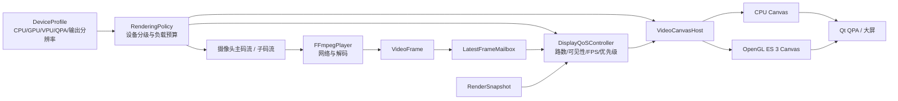
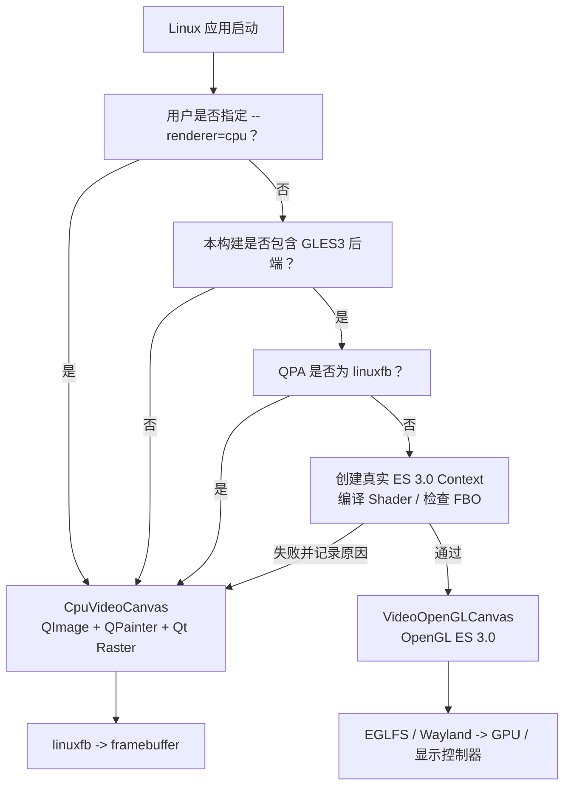

# 嵌入式设备分级与通用视频显示优化方案

> 日期：2026-08-08  
> 状态：§16～§22 双路径架构已由 Kimi 实施完成（Windows 14/14 CTest、ARM64 RASTER/GLES3 双构建与 ELF 验证通过）；真实目标板资格测试待用户在设备上执行  
> 适用范围：RtmpMonitor 的 Windows x86_64、通用 Linux ARM64 和专用嵌入式监控终端

## 1. 结论先行

这次争论不应被简化成“OpenGL 有用”或“OpenGL 是炫技”。更准确的结论是：

1. **朋友对产品场景的质疑是成立的。** 当前 RTX 3060 笔记本结果只能证明现有 OpenGL
   架构在这台 Windows 设备上有效，不能证明低端 ARM 盒子也会得到相同收益。
2. **“OpenGL 在监控客户端里只是炫技”过于绝对。** 当前 OpenGL 路径避免了解码线程提前
   转 RGB、用一个画布合成 16 路并复用 YUV 纹理，确实减少了 CPU 和内存搬运；Windows
   同机正式对照中 CPU 从 4.85% 降到 1.50%。这些是工程收益，不是视觉特效。
3. **对 2 核低端设备，主要瓶颈通常先是 H.264 软件解码，而不是最后一步合成。** OpenGL
   只能优化上传、颜色转换和合成，不能凭空消除 4～16 路软件解码成本。没有 VPU 时，降低
   预览码流分辨率/帧率往往比继续优化 Shader 更有效。
4. **下一阶段不应继续堆高级 OpenGL 技巧。** 应先交付一套与后端无关的通用显示优化：
   设备分级、主/子码流、显示 QoS、单画布、正确缩放/颜色、能力诊断和可靠 CPU 回退。
5. **OpenGL 保留为经过设备资格认证后的加速后端。** Windows 已认证设备继续使用 GL；
   未知 ARM 设备不能仅因 Context 创建成功就默认判定 GL 更优。

产品目标从“让所有设备都使用 OpenGL”改为：

> 在给定设备、输出分辨率和路数下，以最低可接受延迟稳定显示完整画面；OpenGL、CPU、
> 子码流和未来硬件解码只是实现手段。

## 2. 为什么双方各说对了一部分

### 2.1 朋友说对的部分

- 真实部署更可能是低功耗盒子、工控机或普通办公 PC 接大屏，而不是 RTX 3060 笔记本。
- 公网反向代理会增加链路和运维复杂度，不能为了使用一台高端 PC 主动制造不必要的延迟。
- “Linux 6.1 + 轻量 Qt”可以满足一部分只要求 1～4 路、低帧率预览的场景。
- 在没有硬件解码的 2 核设备上，要求 16 路 720p30 软件解码本身就不合理；先换子码流、
  降低路数或选择带 VPU 的 SoC，比加入复杂 GL 技术更有价值。
- 当前 ARM64 只有交叉构建和 ELF 证据，没有真实 QPA、GPU、VPU、温度和长稳数据，因此
  不能把 Windows 性能结果写成“嵌入式已经优化完成”。

### 2.2 不能因此把 OpenGL 全盘否定

监控画面最终仍要完成 YUV→RGB、缩放和多路合成。CPU 后端通常要生成 RGB 图像并由 Qt
继续合成；OpenGL 可以直接采样 YUV plane，在一个 Quad pass 中完成颜色转换、缩放和合成。
当设备具备稳定 EGL/GLES 驱动时，这能降低 CPU 内存带宽，让 CPU 留给解码、网络和业务。

Qt 官方也说明：EGLFS 是带 GPU 的现代嵌入式 Linux 的推荐平台插件之一；即使是 QWidget
软件内容，在 EGLFS 下也会先由 CPU 画进图像，再上传成纹理参与合成。因此“使用 QWidget
就完全绕开 GPU”和“使用 OpenGL 一定更重”都不是普遍事实。

真正的问题不是 GL API 本身，而是：

- 设备是否有稳定的 EGL/GLES 用户态与内核驱动；
- QPA 使用 EGLFS、Wayland、X11 还是 LinuxFB；
- H.264 是否由 CPU 或 VPU 解码；
- 输出是 720p、1080p 还是 4K；
- 同时显示 4、9 还是 16 路；
- 内存带宽、散热和持续功耗能否支撑目标负载。

仅知道内核是 Linux 6.1，无法回答这些问题。

## 3. 当前项目应该保留什么

以下 Week 6 成果应继续作为公共架构，不因最终选择 CPU 或 GL 而撤销：

| 现有设计 | 保留原因 |
|---|---|
| `VideoFrame` 保存 YUV、stride、PTS 和颜色信息 | 防止业务层绑定 RGB/QImage，也给硬件帧留下扩展边界 |
| `LatestFrameMailbox(capacity=1)` | 实时监控应显示最新帧，不能积累过时画面 |
| `RenderSnapshot` 与帧数据分离 | 布局变化不要求解码器重缩放或复制帧 |
| 单主画布合成 1～16 路 | 无论 CPU/GL 都比 16 个独立 Context/定时器更容易调度 |
| 15 FPS 网格、30 FPS 全屏 | 把展示节奏与输入帧率解耦 |
| CPU fallback | 驱动失败、未知设备和诊断场景必须可运行 |
| GL 纹理复用和 `glTexSubImage2D` | 是基础资源管理，不属于过度优化 |
| 颜色、stride、contain/cover 测试 | 保证画面正确，不是为了跑分 |

现有架构不是“为高端 GPU 重写整个产品”。它把解码、帧所有权、布局和后端拆开，使产品
可以在不同设备上选择 CPU 或 GL。需要调整的是选择策略和目标设备认证，而不是退回逐路
`QImage` 信号链。

## 4. 新的目标架构：设备策略位于 Renderer 之上



图中的三类决策必须分开：

1. **输入负载决策**：主码流还是子码流、分辨率、源帧率和同时连接路数。
2. **显示 QoS 决策**：网格显示帧率、全屏优先级、最小化/不可见时是否暂停上传。
3. **渲染后端决策**：CPU 还是 OpenGL ES。

只切换 CPU/GL 而不控制前两类负载，无法让低端设备变成合格的 16 路终端。

## 5. 设备分级，不再用“嵌入式”一个词概括全部设备

以下等级用于决定测试起点，不预设任何 ARM 板的最大路数；表中的路数描述是测试方法或
已验证 PC 事实，不是嵌入式承诺：

| 等级 | 典型能力 | 建议场景 | 默认策略 |
|---|---|---|---|
| S0 安全模式 | 2 核、1～2 GiB、无可靠 EGL/GLES 或仅 LinuxFB、无 VPU | 从 1 路子码流开始，用户逐档测试 | RASTER/CPU；由报告生成 `recommendedMaxStreams` |
| S1 轻量 GPU | 2～4 核、稳定 EGL + GLES3、仍使用软件解码 | 从低路数开始做 CPU/GLES3 同机测试 | 未认证 CPU；通过后才可 GL；不预设最大路数 |
| S2 监控盒子 | 4 核以上、稳定 DRM/GBM/EGL/GLES3、可能有 VPU | 按订单码流和输出分辨率测试 | GL 候选；硬件解码另行认证；不预设最大路数 |
| S3 PC/工控机 | x86_64、稳定 Desktop GL 或高性能 CPU | 16 路及调试/管理 | 当前 `auto`；已认证 Windows 设备优先 GL |

分级结果不能只写一个芯片型号，还必须记录：

- Qt 版本、QPA 插件和窗口系统；
- EGL/GLES vendor、renderer、version 和扩展；
- 输出分辨率、色深和刷新率；
- CPU 核心数、内存、温控与降频状态；
- FFmpeg 解码器是软件还是硬件路径；
- 流数量、编码参数、主/子码流分辨率及帧率；
- 测试使用的系统镜像和驱动版本。

## 6. 通用画面优化包

### 6.1 第一优先级：主/子码流切换

监控产品最通用、最有价值的优化不是 Shader，而是让摄像头为网格提供低分辨率/低帧率
子码流，全屏时再切主码流：

```text
网格：previewUrl，例如 360p/540p、8～15 FPS
全屏：primaryUrl，例如 720p/1080p、25～30 FPS
无子码流：继续使用同一 URL，并按设备预算限制路数
```

这会同时降低网络、软件解码、内存写入和纹理上传压力。相比之下，把 1080p30 全部软件
解码后再丢成 10 FPS，只减少显示成本，不减少前面的解码成本。

建议未来把一路设备配置从单个 URL 扩展为：

```text
DeviceStreamProfile
├── primaryUrl
├── previewUrl（可选）
├── preferredGridFps
└── preferredFullscreenFps
```

切换时必须保留稳定 `StreamId`，并允许主码流连接失败时回退子码流，不能因为全屏切换让
整个设备格子重新创建。

### 6.2 第二优先级：与后端无关的显示 QoS

新增 `DisplayQoSController`，只做负载预算，不调用 GL API：

- 全屏流优先级最高，目标 25～30 FPS；
- 选中流次高，可比普通网格多 2～5 FPS；
- 普通可见网格根据 S0/S1/S2 档使用 5～15 FPS；
- 最小化、屏幕关闭或完全遮挡时停止持续调度，保留 Dirty 和最新帧；
- 拖拽/缩放时暂时降低上传频率，交互结束后恢复；
- 当 frame age、UI gap 或队列连续超限时逐级降展示 FPS，而不是让延迟持续增长；
- 恢复必须有迟滞，避免每秒在两个档位之间抖动。

必须明确：仅降低展示 FPS 不等于降低软件解码成本。要降低解码成本，优先选择子码流、
降低源帧率或接入平台硬件解码。

### 6.3 OpenGL 相关的通用画面质量改进

GL 路径只做跨设备容易验证的一次 pass 处理：

- YUV420P/NV12 正确的 BT.601/709/2020 NCL 和 Limited/Full 转换；
- Y、U、V plane 使用准确尺寸和中心采样，色度使用双线性上采样；
- 缩放默认 `GL_LINEAR`，不生成视频 mipmap，不使用昂贵的各向异性过滤；
- contain/cover、旋转和裁剪统一通过 viewport/scissor/UV 计算；
- 纹理只在尺寸/格式变化时分配，其余帧复用；
- 默认不启用锐化、降噪、HDR tone mapping 或多 pass 特效。

“画面优化”在本项目中的第一含义应是颜色正确、比例正确、缩放稳定和无花屏，而不是让
锐化后的截图看起来更讨喜。可选轻量锐化只能作为 S2/S3 的关闭默认值功能，并单独做质量
和 GPU 时间门禁；它不应成为通用路径。

### 6.4 CPU 路径也要继续优化

CPU fallback 不是无人维护的旧后端。建议保留并完善：

- 复用 swscale context 和目标 QImage buffer；
- 只转换本次确实需要显示的新 sequence；
- 依据 tile 实际物理像素选择转换尺寸，避免为很小的格子生成完整 RGB 图；
- 保持与 GL 相同的颜色矩阵、range、contain/cover 语义；
- S0/LinuxFB 设备优先走该后端并设置保守 FPS；
- 用相同输入和报告与 GL 比较，不假定 CPU 必然更慢。

## 7. 把 `auto` 从“能创建 Context”升级为“设备感知策略”

当前 `VideoCanvasHost::auto` 的核心逻辑是：尝试创建满足版本要求的 GL Context，初始化
失败则 CPU fallback。它能处理“GL 不可用”，但不能处理“GL 可用却更慢、驱动不稳或功耗
更高”。

建议引入 `DeviceProfile + RendererQualification`：

```text
启动
  ├─ 明确 --renderer=cpu        -> CPU
  ├─ 明确 --renderer=opengl     -> 尝试 GL，失败回退并报告
  └─ --renderer=auto
       ├─ Windows 已认证组合    -> GL
       ├─ ARM 已认证设备档案    -> 档案指定 CPU/GL
       ├─ 已知坏驱动档案        -> CPU
       └─ 未知 ARM 设备          -> CPU（保守默认）+ 提示执行资格测试
```

资格档案至少保存：

```text
platform / board / image / qpa
GL vendor / renderer / version
CPU / memory / output resolution
decoder type
qualified backend
tested stream profile and count
qualification date and report id
```

不建议在每次应用启动时偷偷跑 GPU benchmark。短跑结果受温度、首帧编译和后台负载影响，
也会拖慢启动。应由部署工具或验收脚本生成可审查的设备档案，应用只读取结果；未知设备
始终可以用 `--renderer=opengl` 做显式试验。

## 8. 嵌入式 Qt 的特殊约束

Qt 官方文档指出，EGLFS 通常只有一个 native/EGL 全屏窗口，并且不支持同时打开多个 GL
窗口或混合多个 OpenGL 顶层窗口。因此嵌入式产品不能照搬 Windows 的“主画布 + 临时全屏
第二 Context”行为。

建议固定策略：

- Windows/Wayland/X11：可以保留当前临时全屏画布，但仍需设备测试；
- EGLFS：始终使用同一个主 GL 画布，进入全屏时把 Snapshot 切成单路，退出后恢复网格；
- LinuxFB：只使用 CPU Canvas；
- 不在嵌入式第一版启用共享 Context、异步上传线程或跨窗口共享 GLuint；
- `QOpenGLWidget` 的 Context/FBO 在重建、resize 和 reparent 后可能变化，资源必须按现有
  Context 生命周期重新创建和释放。

这也是当前“单主画布”设计在嵌入式上的价值：它比每路一个 `QOpenGLWidget` 更符合
EGLFS 的窗口模型。

## 9. 硬件解码的优先级

如果最终产品确实要在低功耗设备上显示 9～16 路，硬件解码的重要性高于继续做 OpenGL
微优化。FFmpeg 的 `AVHWDeviceContext/AVHWFramesContext` 能表达厂商相关硬件设备和帧池，
但具体后端、像素格式和导入方式仍是平台相关工作。

建议分两步：

1. **硬件解码但先允许一次受控拷贝**：先证明稳定性、颜色和生命周期，不立即追求零拷贝。
2. **明确目标板后再做零拷贝**：例如 DRM PRIME/EGLImage 等必须按 SoC、驱动和 FFmpeg
   构建逐一实现，不能作为“通用 Linux 6.1”功能承诺。

`VideoFrame` 的类型擦除 owner 和未来硬件帧描述可以继续作为边界；第一阶段不要为了一个
尚未确定的 SoC 提前引入大量 `#ifdef`。

## 10. 分阶段实施

### 阶段 A：先确定产品负载，不改 Renderer

- 选定至少一台 S0 低端参考设备和一台 S2 中端监控盒子；
- 由用户给出本板要测试的路数阶梯、源分辨率/帧率和大屏分辨率，不预先写死 4/9/16；
- 记录 QPA、GPU/VPU、驱动、内存和散热；
- 明确摄像头是否能提供主/子码流。

交付物：`device_matrix.md` 和每档明确的“不支持范围”。没有这一步，不进入硬件特化。

### 阶段 B：通用 QoS 与设备诊断

- 新增 DeviceProfile/RendererQualification 数据模型；
- 指标增加 QPA、设备档、输出分辨率、温度/降频（可用时）和解码后端；
- 增加网格/全屏/不可见优先级和有迟滞的 FPS 档位；
- 将未知 ARM 的 `auto` 改成保守 CPU，认证设备按档案选择；
- 保持用户显式 `cpu/opengl` 开关。

这一步对 CPU 和 GL 都有收益，是近期最优先的软件改造。

### 阶段 C：主/子码流

- 扩展设备配置为 primary/preview URL；
- 网格使用 preview，全屏按需切 primary；
- 加入切换超时、失败回退、session generation 和旧帧清理；
- 对比仅降低 display FPS 与真正使用子码流后的 CPU、网络和 frame age。

### 阶段 D：两类真实设备资格测试

- S0：从 1 路开始测试 CPU 安全模式，失败即停止升档；
- S2：按用户给定路数做 CPU/GL 同机 A/B，先软件解码，再视需要接 VPU；
- EGLFS 验证同一画布全屏，不创建第二个 GL 顶层窗口；
- 通过后生成设备档案，才允许该型号 `auto` 选择 GL。

### 阶段 E：有目标板才做硬件解码/零拷贝

只有阶段 D 证明软件解码是主要瓶颈，且硬件型号已经冻结，才进入 VPU 和零拷贝。PBO、
共享 Context、上传线程、HDR 和复杂画质 Shader 继续排在后面。

## 11. 嵌入式验收门槛

每个设备按用户指定的路数阶梯测试，并同时记录 CPU 与 GL（若支持）；产品只采用最后一个
完整通过门禁的档位：

| 类别 | 建议门槛 |
|---|---|
| 后端真实性 | 实际 backend、QPA、vendor/renderer/version 与 fallback 原因完整 |
| 稳态显示 | 达到设备档规定的网格 FPS，不能直接套用 PC 的 14 FPS 到所有 S0 |
| 最新帧 | frame age P95 不持续增长，GL 不比 CPU 恶化超过 10% |
| 端到端延迟 | 局域网同输入 A/B，不通过公网代理制造测试变量 |
| CPU/收益 | GL 至少降低 10% CPU，或在相近 CPU 下明显提高到目标 FPS；否则该设备选 CPU |
| 内存 | 预热后工作集和纹理字节无持续增长 |
| 温度 | 至少 30 分钟无持续降频；发布设备再做 8 小时长稳 |
| 生命周期 | 100 次增删流、网格/全屏切换和退出，无死锁、黑屏或资源增长 |
| 画质 | 四边完整、无拉伸；颜色/stride/framebuffer 质量相对 CPU 无可见退化 |
| EGLFS | 全屏必须复用同一画布；不创建第二个 GL 顶层窗口 |

如果 GL 只在短测中 CPU 更低，但温度更高、frame age 更差或驱动偶发黑屏，该型号不应
认证为 GL。设备档案可以明确记录“CPU 是更优后端”，这不是项目失败。

## 12. 本轮明确不做

- 不为证明技术能力而增加 PBO、共享 Context、上传线程或多 pass Shader；
- 不承诺 OpenGL ES 2.0 通用生产支持；只有 GLES2 的设备进入 S0/CPU，除非真实订单要求；
- 不把“Linux 6.1”当作 GPU/VPU 支持证明；
- 不把 RTX 3060 的 69.08% CPU 降幅套用到 ARM；
- 不默认锐化、降噪或裁剪来制造“更清晰/更铺满”的主观效果；
- 不在目标 SoC 未冻结前实现 DRM PRIME/EGLImage 零拷贝；
- 不以公网反向代理作为本地监控客户端的默认部署结构。

## 13. 对业务争论的最终回答

可以把团队共识写成下面这句话：

> RtmpMonitor 不把 OpenGL 当卖点，也不把它删除。产品以低延迟、稳定、完整显示为目标；
> 低端设备先靠子码流、负载预算和 CPU 安全模式，中端设备在真实 EGL/GLES3/VPU 环境
> 通过资格测试后使用 OpenGL。没有设备数据，就不声称任何后端更优。

因此近期最合理的投入顺序是：

```text
目标设备与路数矩阵
→ 设备诊断和保守 auto
→ 显示 QoS
→ 主/子码流
→ 两台真实 ARM 设备 A/B
→ 必要时硬件解码
→ 最后才考虑零拷贝或高级 GL 技巧
```

这条路线既回应了低端设备的真实产品约束，也保留了当前 OpenGL 架构在合适硬件上的
实证价值。

## 14. 可以优先实施的“通用 OpenGL ES 3.0 优化包”

这一节是给下一位实现者的直接答案。下面的项目不依赖某一家 GPU 扩展，适合 Qt 6 +
OpenGL ES 3.0 的大多数正常驱动；但任何“性能更快”结论仍必须在真实设备上测量。

### 14.1 当前已经完成，不要重复重写

| 通用优化 | 当前状态 | 现有实现入口 |
|---|---|---|
| 一个主画布和一个 Context 合成多路 | 已完成 | `VideoGridWidget`、`VideoCanvasHost` |
| `QOpenGLExtraFunctions`，Desktop 330/ES 300 双 Shader | 已完成 | `VideoCanvasHost.cpp`、`OpenGLGridRenderer.cpp` |
| 不申请 depth/stencil/MSAA | 已完成 | `main.cpp::configureOpenGLSurfaceFormat()` |
| 静态 Quad、VAO、VBO 只在 Context 初始化时创建 | 已完成 | `OpenGLGridRenderer::initialize()` |
| 每路纹理仅在尺寸/格式改变时 `glTexImage2D` | 已完成 | `TextureSet::allocateTextures()` |
| 普通帧使用 `glTexSubImage2D` | 已完成 | `TextureSet::uploadPlane()` |
| `GL_LINEAR + GL_CLAMP_TO_EDGE`，不生成 mipmap | 已完成 | `allocateTextures()` |
| 正 stride 用 `GL_UNPACK_ROW_LENGTH`，异常 stride 用复用 staging | 已完成 | `uploadPlane()` |
| 邮箱只上传新 sequence | 已完成 | `consumeFrame(streamId, sequence)` |
| 最小化/不可见、无 Dirty 或 paint pending 时不重复 update | 已完成 | `VideoCanvasHost::scheduleTick()` |
| Desktop timer query 非阻塞轮询；ES 不强行启用扩展 | 已完成 | `OpenGLGridRenderer::render()` |
| Context 销毁时 makeCurrent/release | 已完成 | `VideoOpenGLCanvas::cleanup()` |

Kimi K3 不应把这些模块重新命名或重写成另一套 Renderer。优先在现有类上做小步、可测试的
增量修改。

### 14.2 P0：能力探测和保守回退

新增纯数据结构 `EmbeddedGlCapabilities`，至少记录：

```text
qpaPlatform
isOpenGles
actualMajor / actualMinor
vendor / renderer / version
maxTextureSize
maxCombinedTextureUnits
supportsRequiredRedRgTextures
supportsRequiredUnpackRowLength
framebufferComplete
shaderSmokePassed
```

探测原则：

- 读取实际 Context 格式，不相信请求值；
- 必需能力失败立即 CPU fallback，并给出可诊断原因；
- 只把 ES3 核心能力作为必需项，不把厂商扩展变成启动条件；
- 不在 GUI 启动时跑长 benchmark；
- 不使用 `glReadPixels` 做每次启动测试。Framebuffer readback 只放在 smoke/资格测试中；
- QPA 为 `linuxfb` 时直接选择 CPU；QPA 为 `eglfs` 时标记单 GL 顶层窗口约束；
- 这一阶段只增加能力事实和回退理由，不擅自把未知 ARM 默认改成 GL。

建议文件：

```text
include/common/render/EmbeddedGlCapabilities.h
src/common/render/EmbeddedGlCapabilities.cpp
src/common/ui/VideoCanvasHost.cpp
tests/VideoRenderCoreTest.cpp
```

如果要把新字段写进正式指标 JSON，必须同步 schema、两个采样脚本、总控 SelfTest 和文档；
不能静默改变 schema v3。

### 14.3 P1：减少每帧冗余 GL 状态调用

当前实现正确，但仍有几项跨驱动通用的小优化：

1. Shader link 后绑定一次 program，把 `yTexture/uTexture/vTexture/uvTexture` sampler unit
   设成固定值；普通 `render()` 不再每帧重复设置四个静态 uniform。
2. 一批 plane 上传开始前设置一次 `GL_UNPACK_ALIGNMENT=1`；每个 plane 只更新
   `GL_UNPACK_ROW_LENGTH`，批次结束恢复为 0。
3. 当前 `uploadPlane()` 每个 plane 都调用 `glGetError()`。改为一个 RenderItem 的全部 plane
   上传后检查一次；Debug/测试可以保留更细粒度诊断，Release 不做每 plane 错误轮询。
4. 缓存当前 program、VAO 和已知固定状态，避免在同一次 paint 中重复 bind/disable；不要为了
   省几个调用引入复杂全局状态机。
5. 纹理上传失败只隔离当前 StreamId，不触发整个 Canvas 重建。

这些优化的目标是减少 ARM 驱动调用开销，不能以删除错误隔离或 Context 安全为代价。

### 14.4 P1：全屏切换时的纹理保留预算

当前 Renderer 会立即删除不在 Snapshot 中的流纹理。嵌入式 EGLFS 使用“同一画布从网格
切成单路全屏”时，这会释放另外 15 路纹理；退出全屏后又集中重新分配和上传，可能造成
瞬时卡顿。

新增 `TextureRetentionPolicy`：

```text
KeepRegisteredStreams   已注册但暂时不在 Snapshot 的流保留纹理，不继续上传
ReleaseImmediately      S0/极低内存设备立即释放
BudgetedLru             超过纹理预算时按最近使用顺序释放
```

初始建议：

- Windows 和内存充足 S2：`KeepRegisteredStreams`；
- S0：`ReleaseImmediately`；
- 后续再依据实机数据实现 `BudgetedLru`，不要第一步同时写三套复杂逻辑。

资源保留必须以 Controller 的“已注册 StreamId”为依据，不能把已经删除/断开的流永久留在
纹理 map。Context lost 时仍全部释放。

### 14.5 P1：EGLFS 同一画布全屏

为 `FullscreenPresentationMode` 增加平台策略：

```text
TemporaryWindowCanvas   Windows、经验证的 Wayland/X11
ReuseMainCanvas         EGLFS
```

`ReuseMainCanvas` 只更换主画布 Snapshot 和目标 FPS：

```text
网格 Snapshot / 15 FPS
→ 保存
→ 单路 Snapshot / 30 FPS
→ Esc
→ 恢复网格 Snapshot / 15 FPS
```

它不创建第二个 `QOpenGLWidget`、不共享 GLuint，也不启动第二个 FFmpegPlayer。必须测试快速
往返、断流、删除当前全屏流和 Context 重建。

### 14.6 P2：帧调度与上传预算

保持现有 Dirty/paintPending 结构，只增加保守预算：

- 每个 tick 最多上传本设备档允许的 plane 字节或流数量；
- 超出预算的流留在 mailbox，下一 tick 直接取最新 sequence，不补传旧帧；
- 全屏流优先，普通网格轮转，避免固定前几路总是优先；
- 上传预算必须有统计：deferred uploads、uploaded bytes、每路最长等待 tick；
- 不改变解码顺序，不在 Renderer 中丢 AVPacket。

该项需要目标板在用户指定路数下的真实数据后再决定默认值，不能只靠桌面微基准设常量。

## 15. 不属于“绝大多数设备通用优化”的项目

以下技术只能在明确目标板和驱动后单独立项，Kimi K3 本轮不要实现：

| 技术 | 不通用的原因 |
|---|---|
| PBO/持久映射 | ES 版本、驱动同步和内存策略差异大，错误使用反而增加拷贝/等待 |
| 上传线程与共享 Context | Qt 官方明确提醒部分移动/嵌入式驱动的 Context sharing 有问题 |
| DMA-BUF/DRM PRIME/EGLImage | 与 SoC、VPU、Mesa/厂商驱动和 FFmpeg 构建强绑定 |
| GLES2 兼容 Shader | 当前 R8/RG8、VAO 和 row-length 基线是 ES3；降级会扩大格式和测试矩阵 |
| compute shader | 不是 ES3.0 基线，且本项目的一次 pass YUV 合成不需要 |
| 多 pass 锐化/降噪 | 增加带宽和纹理，画质主观，低端设备收益不稳定 |
| 每帧 `glReadPixels` | 会产生 GPU→CPU 回读并可能阻塞流水线 |
| 每帧 `glFinish` | 强制 CPU/GPU 同步，破坏并行性 |
| 厂商 extension 快路径 | 可以成为特定设备插件，不能进入通用 Renderer 必需路径 |

## 16. 已确认的 Linux 双路径产品架构

本节是后续实现的确定输入，不再只是候选建议。Linux ARM64 必须同时支持两种可裁剪构建，
运行时 `auto` 再根据实际环境选择：

| 设备事实 | 构建内容 | 运行后端 | Qt/QPA 链路 |
|---|---|---|---|
| 没有 GPU，或没有可用的 EGL/GLES3 驱动 | `RASTER` | CPU | `QImage -> QPainter -> Qt Raster Paint Engine -> linuxfb -> /dev/fb0` |
| 有 GPU，且真实 ES 3.0 Context、Shader、FBO smoke 均通过 | `GLES3` 或 `AUTO` | OpenGL ES 3.0 | `VideoFrame YUV -> GLES3 textures/shader -> Qt FBO -> EGLFS/Wayland` |
| 硬件情况未知，或 GL 初始化失败 | `AUTO` | 先探测，失败立即 CPU | 记录实际 QPA、backend 和 fallback reason |



“有 GPU”不能通过芯片型号、`/dev/dri` 是否存在或能否加载某个 `.so` 来判定。产品判定必须
以应用实际创建的 Context 为准，并验证 `isOpenGLES == true`、版本至少 3.0、R8/RG8 纹理、
Shader link 和 framebuffer complete。否则即使设备宣传有 GPU，也走 CPU。

### 16.1 无 GPU 时选哪一种 CPU 方案

`Raster`、`QImage`、`QPainter` 和 `framebuffer` 不是四个互斥方案，而是同一软件显示链的
不同层。项目选择下面这一条完整链：

```text
LatestFrameMailbox
  -> VideoFrameToImageConverter（swscale，YUV 转目标尺寸 RGB）
  -> 可复用 QImage
  -> CpuVideoCanvas::paintEvent() / QPainter
  -> Qt Raster Paint Engine
  -> linuxfb QPA plugin
  -> /dev/fb0
```

这是无 GPU 设备上最稳妥的通用方案，原因是：

- 现有 `CpuVideoCanvas`、颜色转换、布局和状态覆盖可以复用，不再造第二套 UI；
- Qt 继续负责控件合成、字体、输入、DPI、脏区域和窗口生命周期；
- `linuxfb` 把 Qt Raster 的最终图像写入 framebuffer，应用不需要理解每块板的行跨度、
  像素格式、TTY 切换和双缓冲细节；
- Wayland/X11 的无 GL 软件环境也可以复用同一个 CPU Canvas，只替换 QPA；
- CPU-only 构建能够彻底移除 OpenGLWidgets、EGL 和 GLES 的编译/部署依赖。

不采用“应用直接 mmap `/dev/fb0` 并自己绘制”的方案。它会绕开 Qt 的控件合成、输入、字体、
DPI 和生命周期，还会把像素格式、stride、屏幕旋转、刷新与板级驱动差异带进业务代码。
只有完全不使用 Qt Widgets 的专用 appliance 才值得另立项目评估直接 framebuffer，本项目
不走这条路。

CPU 路径的性能原则是复用 swscale context 与 QImage buffer、只转换新 sequence、按格子的
物理像素转换，而不是先生成全分辨率 RGB 再缩小。它仍然使用容量 1 邮箱和统一 Snapshot，
不能退回逐帧 Qt signal 或每路一个绘制定时器。

### 16.2 有 GPU 时固定 OpenGL ES 3.0

GPU 路径复用当前单画布 YUV Renderer，只把 Linux 平台启动和能力策略落到 Linux 目录：

```text
VideoFrame(YUV420P/NV12)
  -> LatestFrameMailbox
  -> VideoRenderController
  -> VideoOpenGLCanvas
  -> OpenGLGridRenderer（ES 300 Shader）
  -> Qt 内部 FBO
  -> EGLFS 或 Wayland
```

生产基线固定为 ES 3.0，不增加 GLES2 兼容层。EGLFS 下仍只有一个 GL 顶层画布；全屏通过
切换主画布 Snapshot 完成，不创建第二个 `QOpenGLWidget`。GL 初始化或单项能力失败必须自动
回退 CPU，并把请求后端、实际后端、QPA、vendor/renderer/version 和原因写入诊断。

## 17. Linux 源码放置与类拆分

仓库已经存在 `src/platform/linux/`，但当前为空。用户所说的“app 里面的 linux”在本仓库
应落实为这个真实目录，而不是新建另一套平行的 `app/linux`。推荐新增：

```text
include/platform/linux/LinuxRenderingPolicy.h
src/platform/linux/LinuxRenderingPolicy.cpp
src/platform/linux/LinuxApplicationBootstrap.cpp
src/platform/linux/LinuxRendererFactory.cpp
```

各文件职责必须严格限定：

| 类型/文件 | 职责 | 明确不负责 |
|---|---|---|
| `LinuxRenderingPolicy` | 根据编译能力、CLI、QPA 和实际 Context 事实决定 CPU/GLES3，生成 fallback reason | 不解码、不绘制、不跑长 benchmark |
| `LinuxApplicationBootstrap` | 在创建 `QApplication` 前处理 Linux QPA/SurfaceFormat；只有 GLES3 路径请求 ES 3.0 | 不在 CPU-only 构建中引用 OpenGL 类型 |
| `LinuxRendererFactory` | 创建 Linux 对应的 CPU Canvas 或可选 GL Canvas | 不保存流业务状态 |
| `CpuVideoCanvas` | QImage 缓存、QPainter 合成、CPU 统计 | 不知道 EGL/GLES，不直接写 `/dev/fb0` |
| `VideoOpenGLCanvas` | Context/FBO 生命周期和 `OpenGLGridRenderer` 调用 | 不执行 FFmpeg 解码 |
| `VideoCanvasHost` | 保存公共 Snapshot/Dirty/调度接口，向上报告实际后端 | 不把 Linux 平台判断散落进各个 Widget |

当前 `CpuVideoCanvas` 与 `VideoOpenGLCanvas` 同时定义在 `VideoCanvasHost.cpp`，而该文件无条件
包含 `QOpenGLWidget`、`QOpenGLContext` 和 `OpenGLGridRenderer`。Kimi K3 应先把 CPU Canvas
抽成独立 `.h/.cpp`，再让 GL Canvas 成为可选源文件；否则所谓 `RASTER` 构建仍会依赖 OpenGL
头文件和库。公共层可用小型 backend 接口或工厂隔离，但不要重写 `VideoFrame`、Mailbox、
Snapshot 或 Renderer 的业务边界。

`src/main.cpp` 当前在所有非 Windows 平台无条件请求 `OpenGLES 3.0`。这个启动代码应移动到
`LinuxApplicationBootstrap`：

- `RASTER`：不设置 GLES SurfaceFormat，默认实际 renderer 为 CPU；
- `GLES3`：在 `QApplication` 创建前请求 ES 3.0、0 depth、0 stencil、无 MSAA；
- `AUTO`：只在本构建含 GL 且目标 QPA 允许时请求 ES3，Context smoke 失败后保留应用并回退；
- Windows 的 Desktop GL 3.3 设置保持原行为，不塞入 Linux 文件。

## 18. CMake 必须支持真正的 CPU-only 构建

当前根 `CMakeLists.txt` 在第一个 `find_package` 就无条件要求 `OpenGL` 和 `OpenGLWidgets`，
`rtmp_monitor_render`、`rtmp_monitor_ui` 也无条件链接它们。因此“运行时 `--renderer=cpu`”
不等于“无 GPU 系统可部署”。Kimi K3 必须把构建依赖也拆开。

建议增加字符串缓存项：

```cmake
set(RTMP_MONITOR_LINUX_RENDER_MODE "AUTO" CACHE STRING
    "Linux renderer build: AUTO, RASTER, or GLES3")
set_property(CACHE RTMP_MONITOR_LINUX_RENDER_MODE PROPERTY STRINGS AUTO RASTER GLES3)
```

语义如下：

| 模式 | CMake 行为 | 运行时行为 |
|---|---|---|
| `RASTER` | 只 `find_package(Qt6 COMPONENTS Widgets)`；不查找/链接 OpenGLWidgets、EGL、GLES | 只允许 CPU；`--renderer=opengl` 给出明确“本构建未包含 GL”并安全回退 |
| `GLES3` | 必须找到 ARM64 Qt OpenGL/OpenGLWidgets、EGL、GLESv2(提供 ES3 symbols)，缺失即配置失败 | `auto`/`opengl` 尝试 ES3，初始化失败回退 CPU |
| `AUTO` | 先 `QUIET` 查找可选 GL 依赖；齐全则同时编译两后端，否则生成 RASTER-only 并打印摘要 | 有合格 ES3 用 GL，否则 CPU |

推荐 target 拆分：

```text
rtmp_monitor_render_core
  RenderTypes + VideoRenderController + 纯布局/颜色数据

rtmp_monitor_render_opengl       （仅 HAS_GLES3/桌面 GL 时创建）
  OpenGLGridRenderer + Qt6::OpenGL + EGL/GLES 平台依赖

rtmp_monitor_ui
  Qt6::Widgets + CpuVideoCanvas + VideoCanvasHost
  条件加入 VideoOpenGLCanvas 和 Qt6::OpenGLWidgets
```

也可以保留 target 名称，但必须条件加入源文件与链接库。验收重点不是 target 名字，而是
`RASTER` 生成树中完全没有 `QOpenGLWidget` 源，也不由项目 target 直接查找或链接
Qt6::OpenGL/OpenGLWidgets、EGL、GLES。使用生成的配置头（例如 `RtmpMonitorBuildConfig.h`）暴露
`RTMP_MONITOR_HAS_OPENGL`，不要在业务代码散布平台宏。

需要注意 Qt 自身的构建配置：某些发行版提供的 `Qt6::Gui` 即使应用只使用 Raster，也可能
间接带有 EGL/OpenGL 依赖。产品如果要求根文件系统完全不安装任何 GL 库，必须在 ARM64
sysroot 中使用以 `-no-opengl`、linuxfb 为目标构建的 Qt；这属于 Qt/系统镜像配置，不应靠
给应用链接一个假的 GL 库规避。Kimi 的第一层验收是项目没有直接 GL 依赖，第二层才是用
最终产品 Qt 检查整棵动态依赖闭包。

CMake 配置结束时必须打印一段不可含糊的摘要：目标架构、所选 build mode、是否编译 CPU、
是否编译 GLES3、Qt QPA 预期和 sysroot。交叉构建查到的 EGL/GLES/Qt 路径必须继续验证位于
ARM64 sysroot 内，禁止链接 WSL2 主机 x86_64 库。

## 19. 嵌入式路数不再硬编码为“必须 16 路”

项目 UI 的绝对安全上限仍可保留 16 路，但这只是软件容量，不是任何 ARM 板的产品承诺。
不同板子的 CPU、VPU、GPU、内存带宽、温控、码流分辨率和输出屏幕不同，不能由代码预设
“嵌入式都支持 16 路”，也不应让未知设备一打开 16 路就被动卡死。

建议新增板级资格工具 `scripts/qualify_embedded_device.sh`（名字可调整），由用户在目标板上
自己运行。默认阶梯可以是 `1 -> 4 -> 9 -> 16`，也允许传入任意路数列表；每一档都必须先
预热，再采集至少：

```text
actual backend / QPA / GL facts
input resolution / source fps / codec / software or hardware decoder
display FPS / frame age P95 / mailbox overwritten
CPU / RSS / temperature / throttling
paint/upload time / texture bytes（GL 时）
连续错误、重连和退出清理
```

脚本遇到用户设定的 CPU、frame age、温度、内存或 UI gap 门槛失败时停止升档，不继续强压
到 16 路。结果写入本机设备档案：

```text
boardId / imageVersion / qpa / qualifiedBackend
testedStreamProfile / outputResolution
recommendedMaxStreams / testedAt / reportId
```

应用行为建议为：没有设备档案时仍允许用户从 1～16 路逐步添加，但显示“该板未认证”的
非阻塞提示；超过 `recommendedMaxStreams` 时警告并允许管理员继续测试，不静默硬拦截。
正式产品说明只宣称该设备档案实际通过的路数。路数测试必须在真实板上执行，WSL2 交叉
构建不能生成这个结论。

## 20. 删除连接功能核对结论

删除功能已经存在，Kimi K3 不应重复添加：

```text
VideoWidget 右键“断开并移除”
  -> StreamConnectionController::removeConnection()
  -> MultiStreamPlaybackManager::removeStream()
  -> MainWindow::removeConnectionWidget()
  -> VideoGridWidget::removeVideoWidget()
  -> 清除绑定、播放资源、Widget 和日志/提示
```

当前源码入口与测试：

- `src/common/ui/VideoWidget.cpp`：右键动作和 `removeRequested`；
- `src/common/app/StreamConnectionController.cpp`：确认、停止流、解绑和移除；
- `src/common/media/MultiStreamPlaybackManager.cpp`：`removeStream()`；
- `src/common/ui/VideoGridWidget.cpp`：`removeVideoWidget()`；
- `MultiStreamPlaybackManagerTest`、`StreamConnectionControllerTest`、`VideoGridDynamicTest`：
  已覆盖移除主链。

后续只需增加 Linux 两后端回归：播放中删除、重连等待中删除、全屏流删除、最后一路删除，
并验证 mailbox/纹理/QImage cache/绑定均释放。只有测试发现真实缺口时才修改生产代码。

## 21. 交给 Kimi K3 的实施顺序

### 任务 1：保护工作区并建立基线

按 `AGENTS.md` 读取权威文件，检查 `git status`，保留用户现有 `.gitignore`、OpenViking、
snapshot 等未提交改动。先运行当前 Windows Debug 构建与完整 CTest，并记录测试数量；不得
根据本文覆盖更高优先级的源码事实。

### 任务 2：拆出无 GL 依赖的 CPU Canvas

- 将 `CpuVideoCanvas`/CPU frame cache 从 `VideoCanvasHost.cpp` 抽到独立源文件；
- 保留 `VideoFrameToImageConverter -> QImage -> QPainter` 行为、颜色和布局语义；
- 公共 Host 不再无条件 include `QOpenGLWidget` 或 `OpenGLGridRenderer`；
- 增加纯 CPU 单元/UI smoke，证明没有 GL Context 也能显示和安全退出。

### 任务 3：实现 Linux 平台策略和两种构建

- 在 `src/platform/linux/` 实现 bootstrap、policy 和 factory；
- 实现 `RASTER/GLES3/AUTO` CMake 模式与配置摘要；
- 生成 compile-time capability，不在 UI 到处写 `#ifdef`；
- `RASTER` 不查找、不链接 Qt OpenGL、EGL、GLES；
- `GLES3` 保留 sysroot 路径防逃逸检查；
- Windows 构建和现有 `--renderer=auto|opengl|cpu` 行为不回归。

### 任务 4：实现真实 ES3 探测和回退

- 新增 `EmbeddedGlCapabilities` 与纯判定函数；
- 从实际 QPA/Context 收集 ES 版本、vendor/renderer/version、纹理与 FBO 必需能力；
- `linuxfb` 直接 CPU；ES3 smoke 失败回退 CPU并写明原因；
- EGLFS 全屏复用主画布，不创建第二个 GL 顶层窗口；
- 保留现有颜色、stride、动态格式和 Context 生命周期测试。

### 任务 5：板级资格脚本，不设统一 16 路承诺

- 新增可参数化的目标板 shell 脚本和报告 schema；
- 路数阶梯、预热、采样时长和门槛由用户参数控制；
- 输出 `recommendedMaxStreams`，失败即停止升档并保留已完成报告；
- 不在 CI、WSL2 或应用首次启动时自动跑长测；
- 不把测试结果写成通用 ARM 能力。

### 任务 6：删除功能和生命周期回归

不添加重复菜单。补齐 CPU/GLES3 下删除普通流、重连流、全屏流和最后一路的测试，验证流、
Widget、mailbox、CPU cache 和 GL texture 均释放。

### 任务 7：通用 GLES3 小优化（前述 P1）

在双构建和 fallback 稳定后，再做静态 sampler、批次 unpack state、Release 错误检查降频和
纹理保留策略。每项单独提交、构建和回归，不与平台拆分合成一个大改动。

## 22. WSL2 ARM64 构建与验证矩阵

Kimi K3 最终必须使用项目现有 `cmake/toolchains/aarch64-linux.cmake` 和实际 ARM64 sysroot
完成两套干净构建。先在 Windows 执行 `wsl -l -v` 确认可用发行版；随后进入该 WSL2
终端，并从仓库的挂载路径进入根目录（本机通常是 `/mnt/e/rtmpProject`，以实际挂载为准）。
下面的命令在 **WSL2 bash** 中执行，Preset/生成目录可根据仓库现状调整：

```bash
# 纯 CPU/LinuxFB 可部署构建
cmake -S . -B out/build-linux-arm64/raster-debug \
  -DCMAKE_TOOLCHAIN_FILE=cmake/toolchains/aarch64-linux.cmake \
  -DRTMP_MONITOR_LINUX_RENDER_MODE=RASTER \
  -DCMAKE_BUILD_TYPE=Debug
cmake --build out/build-linux-arm64/raster-debug --parallel

# 包含 OpenGL ES 3.0 的构建
cmake -S . -B out/build-linux-arm64/gles3-debug \
  -DCMAKE_TOOLCHAIN_FILE=cmake/toolchains/aarch64-linux.cmake \
  -DRTMP_MONITOR_LINUX_RENDER_MODE=GLES3 \
  -DCMAKE_BUILD_TYPE=Debug
cmake --build out/build-linux-arm64/gles3-debug --parallel
```

若实际 WSL2 环境只提供 Ninja Multi-Config 或已有 Preset，应使用真实可用的生成器，不要机械
复制 `CMAKE_BUILD_TYPE`。若 sysroot 没有 ARM64 Qt Widgets 的 linuxfb plugin，RASTER 只能
证明链接层已去 GL，不能宣称设备可启动；若没有 Qt OpenGL/EGL/GLES3 开发包，GLES3 配置
应明确失败并列出缺失依赖，不能偷偷链接 WSL2 x86_64 库。

每套构建都执行：

```text
file <rtmp_monitor>
readelf -h <rtmp_monitor>       # Machine 必须是 AArch64
readelf -d <rtmp_monitor>       # 检查 NEEDED/RPATH/RUNPATH
检查所有 Qt/FFmpeg/EGL/GLES 路径都来自 ARM64 sysroot
运行能在交叉环境执行的纯逻辑测试
```

额外验收：

- RASTER 应用 target 不应直接依赖 Qt6OpenGL、Qt6OpenGLWidgets、libEGL 或 libGLES；若最终
  Qt6Gui 自身仍间接依赖 GL，报告必须指出 Qt sysroot 的构建事实，不能归咎于应用后端；
- GLES3 ELF 应包含目标 ARM64 的 Qt OpenGL/EGL/GLES 依赖；
- 两套构建均保留删除连接、CPU 后端、解析/解码和公共 UI；
- WSL2/QEMU 可运行纯逻辑测试时可以记录通过，但不能把它写成 GPU 或 linuxfb 实机通过；
- `/dev/fb0`、DRM/GBM、EGLFS、Wayland、触摸/键鼠、VSync、温度、VPU 和实际多路能力必须
  在目标板及其正式系统镜像上验证。

因此最终报告必须分三层：

```text
1. ARM64 交叉编译和 ELF/依赖：Kimi K3 本轮必须完成
2. WSL2/QEMU 可执行的纯逻辑测试：环境允许时完成
3. 真实板 QPA/GPU/framebuffer/多路性能：由用户在具体设备上完成
```

## 23. Kimi K3 的完成标准

- Windows 现有完整 CTest 不减少、不跳过；
- Linux ARM64 `RASTER` 和 `GLES3` 两套构建按上节完成，或对实际缺失 sysroot 依赖给出可复现
  的明确阻塞证据；
- RASTER 产物经 link command 和 `readelf` 确认无项目直接 OpenGL/EGL/GLES 依赖；若产品要求
  整个镜像零 GL 依赖，再使用 `-no-opengl` Qt sysroot 验证完整依赖闭包；
- CPU 与 GLES3 共用 VideoFrame、Mailbox、Snapshot、布局和状态语义；
- `linuxfb` 和不含 GL 的构建不会进入 OpenGL 初始化；
- GLES3 初始化失败可回退且理由可诊断；
- EGLFS 不创建第二个 GL 顶层窗口；
- 删除连接已有入口不被重复实现，四类删除生命周期测试通过；
- 设备脚本不把 16 路设为统一硬门槛，报告只生成该板实测的 `recommendedMaxStreams`；
- YUV420P/NV12、颜色、range、负/非对齐 stride 和动态格式质量不退化；
- 不引入 PBO、共享 Context、上传线程、GLES2、DMA-BUF 或厂商扩展必需路径；
- 保留用户未提交文档和配置，不提交密钥、完整 RTMP 鉴权 URL、sysroot 绝对路径或大日志；
- 交接明确区分“构建通过”“模拟/逻辑通过”和“真实板待验收”。

Kimi K3 应按任务 2～7 分成可回滚的小提交。若真实源码与本文冲突，以源码、CMake 和测试为
准，先更新本文再继续，不得静默按旧描述实现。

## 24. 本轮明确不要求 Kimi K3 证明的事情

- 不要求任意嵌入式板稳定显示 16 路；
- 不要求 WSL2 证明真实 GPU、EGLFS、linuxfb 或温控可用；
- 不要求实现硬件解码、零拷贝、DMA-BUF 或厂商 SDK；
- 不要求 CPU 路径直接写 framebuffer；
- 不要求无 GPU 系统安装假的 Mesa/软件 OpenGL 来满足编译；
- 不要求为已经存在的“断开并移除”功能再增加一个入口。

## 25. 官方资料

- [Qt for Embedded Linux](https://doc.qt.io/qt-6/embedded-linux.html)：QPA、EGLFS、
  LinuxFB、单全屏窗口和嵌入式 GL 窗口限制。
- [Configure an Embedded Linux Device](https://doc.qt.io/qt-6/configure-linux-device.html)：
  EGLFS/DRM/GBM、厂商适配以及内核和用户态图形栈的系统集成责任。
- [QOpenGLWidget](https://doc.qt.io/qt-6/qopenglwidget.html)：Qt FBO、Context 生命周期、
  `NoPartialUpdate`、共享 Context 在部分嵌入式驱动上的风险。
- [QSurfaceFormat](https://doc.qt.io/qt-6/qsurfaceformat.html)：请求和检查 Desktop GL/
  OpenGL ES 版本与 surface 格式。
- [FFmpeg AVHWDeviceContext](https://ffmpeg.org/doxygen/8.0/structAVHWDeviceContext.html)：
  平台相关硬件设备和硬件帧池的公共抽象。
