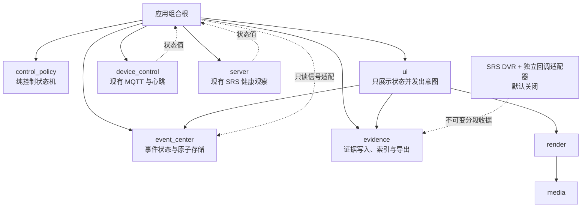
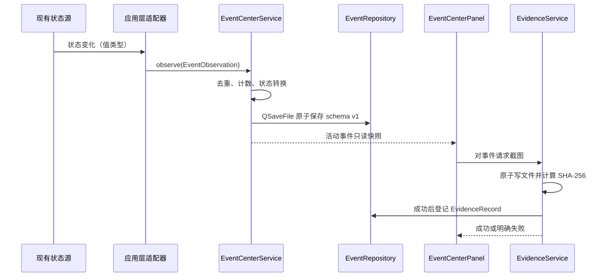

# RtmpMonitor 单车值守闭环架构设计

> 日期：2026-08-15
> 最后更新：2026-08-16
> 状态：产品与架构联合接受；Phase 1 与 Phase 2A 已实现并通过自动化门禁，现场验收待执行
> 风险：本文档变更为 R0；后续控制策略、事件、证据和 SRS DVR 实现分别按 R2 评审
> 试点：单车、单桌面操作者、本地离线优先
> 上位产品规划：[移动安防产品模块竞品调研与演进建议](../roadmap/mobile_security_product_module_recommendations.md)

## 1. 决策摘要

在不修改 MQTT 平台返回值、设备固件和硬件的前提下，当前可实施的最小产品由两条关联但不强制
串行的流程组成：

```text
控制流程：
选择目标 → 核对心跳/视频状态 → 显式解锁 → 提交控制意图
  → 显示本地提交结果 → 释放/停车/失效 → 重新锁定

事件流程：
平台异常或人工建事件 → 告警提示 → 人工确认 → 查看视频和状态上下文
  → 截图或登记“无有效画面” → 填写处置说明
  → 平台观察到恢复/人工事件解决 → 关闭 → 可选导出
```

正常命令提交不会自动创建安防事件；只有平台状态异常、人工标记或本地控制发布失败进入事件流程。

当前立即设计、后续可分阶段实现的模块按优先级为：

1. 本地控制安全策略与命令尝试审计。
2. 基于现有可观察信号的平台事件中心。
3. 截图证据、事件关联和目录导出。
4. 默认关闭的 SRS 分段录像 PoC。

这不是对长期产品优先级的否定。命令回执、设备鉴权、多车、地图和巡逻仍是完整移动安防产品的
重要能力，但在当前输入契约与硬件约束下不能被可靠实现，也不得用客户端推断或模拟数据冒充。

## 2. 不变量与事实基线

### 2.1 必须保持的外部行为

- `DeviceCommandCodec` 生成的现有控制 payload、字段、大小写和七类命令不变。
- 控制 Topic、状态 Topic、QoS 0、`retain=false` 和单个 Paho session 的行为不变。
- 心跳仍只接受现有 `heartbeat/client_id/timestamp` 结构；30 秒本地单调时钟离线规则不变。
- 同一控制 Topic 仍只允许一台真正受控设备；本设计不把视频卡多状态展示解释为多车定向控制。
- RTMP、SRS 推拉流、FFmpeg 解码、AAC 下行、media、render、全屏和重连链路不变。
- MQTT 默认关闭、Broker 为空；SRS DVR 也必须默认关闭。任何真实端点仍只进入本机忽略配置。
- 当前界面的历史文案“已提交到 Broker”实际只对应本地 MQTT 客户端接受发布请求；未来实现必须按
  第 5.3 节替换，不能把它继续解释为 Broker、设备或电机已执行。

### 2.2 当前可直接复用的事实

- `DeviceControlController` 已拥有当前 StreamId、URL 派生设备 ID、在线态、运动态和待停车状态。
- `DevicePresenceTracker` 已在 Qt 所有者线程中提供 Waiting/Online/Offline/Unavailable 状态。
- `MqttDeviceClient` 已提供连接状态、命令提交/失败和有界观察消息信号，并用 generation 丢弃旧 session 回调。
- `StreamConnectionController` 已维护稳定 StreamId、视频卡绑定、播放状态和当前控制目标。
- `MediaServerMonitor` 已提供 SRS 健康观察；`LogManager` 已提供系统/审计分流、脱敏、有界队列和轮转。
- `FullscreenScreenshotService` 已证明 `QImage → QSaveFile → 专用异步任务 → QPointer 回传` 的截图写入路径可行。
- 当前 CMake 已建立 profiles、device_control、media、render、diagnostics、ui 和应用组合根边界，并有依赖扫描门禁。

### 2.3 当前证据不能证明的事项

- 心跳在线不能证明车辆可安全控制，也不能证明最近命令已执行。
- QoS 0 publish 成功不能证明 Broker 或车辆收到消息。
- 客户端补发停车不能替代固件断网看门狗。
- OS 用户名只能作为本机审计标签，不能作为身份认证或 RBAC 证明。
- 交叉构建、Fake Broker 和 SRS 本地测试不能替代车辆动作、ARM 真机或现场网络验收。

## 3. 范围裁剪

| 能力 | 当前结论 | 本轮允许的产品表述 |
| --- | --- | --- |
| 本地控制解锁、目标锁定、视频新鲜度和失焦收敛 | 可实施 | 本地安全门禁，不保证设备侧停车 |
| 命令审计 | 可实施 | 已拒绝、已提交或本地发布失败 |
| MQTT/心跳/RTMP/SRS 平台事件 | 可实施 | 平台观察到的连接或流状态 |
| 人工事件、确认、解决、关闭 | 可实施 | 单机事件处置闭环 |
| 截图证据和目录导出 | 可实施 | 可校验的本地证据包 |
| SRS 分段 DVR | 独立 PoC | PoC 通过前不承诺事件录像 |
| 命令 ACK、TTL、幂等和执行确认 | 延期 | 不显示“设备已执行” |
| 多车定向控制、分布式控制租约 | 延期 | 仍限定一台受控设备 |
| MQTT TLS、设备凭据、ACL、真实 RBAC | 延期 | 不宣称生产级鉴权 |
| 电量、定位、速度、网络和温度遥测 | 延期 | 不生成占位数据 |
| 地图、围栏、巡逻、返航和回充 | 延期 | 不创建无真实输入的 UI |
| SOS、边缘 AI、双向对讲、动态码率 | 延期 | 不新增占位生产接口 |

## 4. 目标依赖与运行时数据流

### 4.1 未来编译依赖



约束如下：

- `control_policy`、`event_center` 只依赖 Qt Core；`evidence` 只依赖 Qt Core/Gui。
- `device_control`、`server`、`media` 和 `render` 不包含新业务模块头文件。
- 现有生产者只继续发出自身状态，由应用组合根转换为事件中心输入。
- UI 不直接打开事件存储、证据目录、Paho session 或 SRS callback。
- SRS callback 适配器是独立进程，不把 HTTP 服务生命周期塞进 Qt 主进程。

### 4.2 事件和证据数据流



## 5. 模块一：本地控制安全与诚实审计

### 5.1 职责拆分

新增纯策略 `ControlSessionGuard`，迁出“是否允许当前本地意图进入现有 Controller”的判定，
不迁移 Paho 资源、URL、StreamId 绑定或 QWidget。`DeviceControlController` 继续负责用例编排、调用
现有发布接口、显示结果和触发审计；`MqttDeviceClient` 不理解解锁、事件或审计。

建议的最小类型为：

```cpp
enum class ControlSessionState {
    Locked,
    Armed,
    Moving,
    Suspended
};

enum class ControlAttemptOutcome {
    Rejected,
    Submitted,
    PublishFailed
};
```

这两个类型只描述客户端事实，不包含 `Accepted/Executing/Succeeded` 等设备侧语义。

### 5.2 状态与转换

| 当前状态 | 输入 | 下一状态 | 必须动作 |
| --- | --- | --- | --- |
| Locked | 用户显式解锁且目标、MQTT、心跳、RTMP Playing 和画面新鲜度均有效 | Armed | 记录解锁，不发送车辆命令 |
| Armed | 移动命令本地提交成功 | Moving | 记录 `submitted` |
| Moving | 输入释放或中心停车 | Armed | 立即调用现有 StopCar 路径 |
| 任意已解锁态 | 目标切换、心跳非 Online、MQTT 非 Connected、RTMP 非 Playing、画面过期、应用失焦、全屏切换 | Suspended | 先收敛输入，再尝试 StopCar |
| Suspended | 本地条件恢复 | Locked | 必须重新显式解锁，不自动恢复运动 |
| 任意状态 | 应用退出 | Locked | 停止接受新意图，尝试停车后断开 MQTT |

移动解锁的“画面新鲜”在试点 v1 中定义为：同一 StreamId 的最近呈现帧使用本地单调时钟测得不超过
1,000 ms。启动推流不要求已有画面；否则用户无法从无流状态启动设备。鼠标摇杆、键盘和方向按钮
必须共享同一个 `ControlSessionGuard` 状态，不能只保护某一种输入方式。

命令门禁矩阵固定为：

| 命令 | 目标 | MQTT Connected | 心跳 Online | Armed + 新鲜画面 | 说明 |
| --- | --- | --- | --- | --- | --- |
| StartStream | 必须 | 必须 | 必须 | 不需要 | 保持现有启动语义 |
| StopStream | 必须 | 必须 | 不需要 | 不需要 | 绕过解锁和离线门禁 |
| Move/Turn | 必须 | 必须 | 必须 | 必须 | 只有完整本地条件成立才提交 |
| StopCar | 必须 | 可提交时必须；断连时记录不可用 | 不需要 | 不需要 | 始终绕过普通门禁；能提交则尝试发送，不能提交则产生结构化控制记录和 Critical 系统日志 |

本阶段不增加未经硬件验证的固定运动超时，也不周期性重发移动命令。现有“按住移动、释放停车”
保持不变；策略层的收益是集中表达门禁和失效收敛，而不是虚构设备侧 dead-man 能力。

### 5.3 命令尝试审计

每次按钮、摇杆或键盘意图生成一条控制尝试记录，至少包含：

```json
{
  "attemptId": "<local-uuid>",
  "action": "MOVE_FORWARD",
  "targetStreamId": "<session-stream-id>",
  "targetDeviceId": "<url-derived-device-id>",
  "identitySource": "url-derived",
  "presence": "online",
  "mqttState": "connected",
  "localOutcome": "submitted",
  "executionConfirmation": "unavailable",
  "actorAssurance": "unverified-local",
  "source": "joystick"
}
```

- 不记录完整 RTMP URL、原始 MQTT payload、Broker 地址或凭据。
- `targetDeviceId` 只是本地关联标识，不升级为经过认证的设备身份。
- `submitted` 只对应 `MqttDeviceClient` 接受本地 publish；若返回失败则写 `publish_failed`。
- 本地门禁拒绝时写 `rejected` 和稳定原因，例如 `target_missing`、`device_offline`、`control_locked`。
- 每次本地尝试生成 `attemptId`，只用于事件和导出关联，不进入 MQTT payload。
- `source` 区分 `joystick`、`keyboard`、`button`、`focus_lost`、`target_changed`、
  `heartbeat_timeout`、`mqtt_disconnected`、`fullscreen_transition` 和 `application_exit`。
- 审计使用当前 OS 用户名或 `local-user`，并以 `actorAssurance=unverified-local` 声明它不是登录认证结果。
- UI 使用“本地发送请求已提交；未确认 Broker 或设备接收”“本地发送失败，设备状态未知”以及
  “停车指令已尝试发送；未确认车辆已停车”。设备状态显示“心跳在线”，并提示它不代表设备可控
  或命令已执行；不得继续使用容易被理解为 Broker 已接收的“已提交到 Broker”。

控制目标切换顺序固定为：冻结旧目标输入 → 将状态置为 Locked/Suspended → 对旧目标尝试 StopCar 并
记录结果 → 清除旧目标运动状态 → 再安装新目标。不得先覆盖目标字段后才停车，否则审计和停车可能
错误关联到新目标。

### 5.4 Phase 1 实施状态（2026-08-15）

- 已新增仅依赖 Qt Core 的 `rtmp_monitor_control_policy`，`ControlSessionGuard` 是非 QObject 纯状态机；
  层依赖门禁同时禁止该模块依赖 app/device_control/media/render/ui，也禁止现有底层模块反向包含它。
- 应用层新增 `DeviceControlTransport` 测试端口及 MQTT 适配器。适配器只转发现有连接、发布和只读
  信号；`MqttDeviceClient` 的 payload、Topic、QoS、信号和 publish 返回契约未修改。
- `LatestFrameMailbox` 记录最近一次真实新帧呈现的本地单调时钟年龄，`clear()` 后恢复为无帧；
  `StreamConnectionController` 只读组合每路 Playing 状态和帧龄，不改变解码、渲染或全屏画布。
- 鼠标摇杆、键盘、流按钮和停车按钮均由应用组合根附加明确来源后进入同一 Controller/Guard。
  输入模式切换只释放持键，不再拥有独立解锁真值；停车按钮有目标即可触发本地尝试。
- Controller 每 100 ms 检查已解锁目标。目标切换、MQTT/心跳/RTMP/画面失效、应用失焦、全屏切换
  和退出只在首次失效时尝试一次停车；断线停车保留原目标快照，连接恢复后补发且不会自动重新解锁。
- 控制尝试审计已增加稳定 UUID、目标/在线/MQTT/播放/帧龄快照、来源、稳定原因和三种本地结果，
  固定写入 `executionConfirmation=unavailable` 与 `actorAssurance=unverified-local`，不写完整 URL、
  Broker 或原始 payload。Phase 1 交付时事件中心尚未实施，停车不可提交只写结构化审计和 Critical
  系统日志；Phase 2A 现已在不改变该控制记录的前提下消费其只读快照并形成平台事件。
- 自动化验证包括 Guard 表驱动边界、Controller/Fake Transport、UI/输入隔离、呈现帧龄、审计脱敏和
  原 MQTT 特征测试。Windows Debug 全量 CTest 31/31、Windows Release 全构建、ARM64 RASTER/GLES3
  全目标构建、AArch64 ELF/依赖审计和 QEMU 逻辑测试通过。真实 QPA/GPU/视频/车辆动作仍须人工验收，
  自动化结果不表示设备已经执行命令。

## 6. 模块二：平台事件中心

> 实施状态（2026-08-16）：Phase 2A 已落地 Qt Core-only `rtmp_monitor_event_center`、schema v1
> `QSaveFile` 原子存储、应用层 `PlatformEventBridge`、八类自动/人工事件，以及默认隐藏的底部事件
> Dock 和常驻状态徽标。Phase 2B 的事件详情、最小截图与通用处置备注仍未实施。

### 6.1 事件来源与语义

首批只接入当前实现能直接观察到的八类事实：

| 类型 | 打开条件 | 恢复条件 | 默认等级 |
| --- | --- | --- | --- |
| `MqttConnectionLost` | 已启用 MQTT 离开 Connected | 重新 Connected | Medium；运动中为 High |
| `DevicePresenceLost` | 已见过心跳的目标进入 Offline | 同一 ID 回到 Online | Medium |
| `VideoStreamLost` | 已 Playing 的流进入 Error/Reconnecting/Disconnected | 同一稳定本地资源回到 Playing | Medium |
| `MediaServerUnhealthy` | SRS 健康观察从 Healthy 变为失败 | 同一 endpoint 恢复 Healthy | High |
| `LocalControlPublishFailed` | 普通命令本地 publish 返回失败 | 同一目标后续普通命令本地提交成功 | Medium |
| `LocalSafetyStopPublishFailed` | 自动或人工停车的本地 publish 返回失败 | 同一目标后续 StopCar 本地提交成功 | Critical |
| `LocalSafetyStopUnavailable` | 有旧目标但 MQTT 非 Connected，停车无法进入 publish | 同一目标后续 StopCar 本地提交成功 | Critical |
| `ManualIncident` | 操作者手工创建 | 操作者明确解决 | 用户选择 |

Waiting、Unavailable、应用首次启动时的 Disabled 不自动制造告警。恢复不是新告警，而是更新原活动
事件。普通命令成功提交不产生安防事件；发布失败事件只陈述本地发送路径结果，不推断设备状态。
不得预置 SOS、碰撞、低电量、越界或 AI 告警，因为当前没有这些输入。

### 6.2 状态机和去重

```text
系统事件：Open ──人工确认──→ Acknowledged
          │                    │
          └────对应恢复信号────┴──→ Resolved → Closed
                                      │
              同一故障复发：Resolved ─┘→ Open

人工事件：Open → Acknowledged → Resolved → Closed
```

- `Open` 可以由系统观察或人工创建。
- `Acknowledged` 必须记录操作者与时间；它不表示根因已经消失。
- 系统事件无论是否已经 Acknowledged，都只能由匹配的恢复信号转为 Resolved；操作者可以确认和备注，
  但不能伪造系统恢复。
- 人工事件由操作者解决，并记录 `resolutionSource=operator`。
- Resolved 尚未关闭时同一故障复发，原事件执行 `Resolved → Open`，增加次数和 revision，并保留复发历史。
- `Closed` 必须由操作者确认，关闭后不可回退；关闭后同类问题再次出现时创建新事件。
- 若操作者必须在没有恢复信号时结束系统事件，可直接关闭，但必须使用
  `closeDisposition=closed_without_observed_recovery`，不填写 resolvedAtUtc，也不显示“问题已解决”。
- 活动事件唯一键为 `eventType + localResourceId`。重复观察只增加 `occurrenceCount`、更新
  `lastObservedAtUtc`，不生成事件风暴。
- UI 将系统自动 Resolved 显示为“平台观察到恢复”，不简称“问题已解决”。

### 6.3 schema v1

`SecurityEventRecord` 的最小字段为：

```json
{
  "eventId": "<uuid>",
  "eventType": "VideoStreamLost",
  "severity": "Medium",
  "state": "Open",
  "localResourceId": "camera:<id>",
  "deviceId": "<optional-url-derived-id>",
  "displayNameSnapshot": "<sanitized-name>",
  "openedAtUtc": "<utc-time>",
  "lastObservedAtUtc": "<utc-time>",
  "acknowledgedAtUtc": "",
  "resolvedAtUtc": "",
  "closedAtUtc": "",
  "resolutionSource": "",
  "closeDisposition": "",
  "eventRevision": 1,
  "occurrenceCount": 1,
  "actor": "",
  "actorAssurance": "unverified-local",
  "identitySource": "url-derived",
  "note": "",
  "linkedControlAttempts": [],
  "evidenceIds": [],
  "history": []
}
```

持久化规则：

- 文件位于 `QStandardPaths::AppLocalDataLocation/incidents/events-v1.json`。
- 使用 `QSaveFile` 原子提交；读取损坏文件或更高 schema 时保留原文件、禁用写入并产生用户可见错误。
- 活动事件永不因容量策略淘汰。没有证据关联的 Closed 事件同时受“最近 5,000 条”和“180 天”
  限制，超过任一条件才在下一次成功写入时清理最旧记录。
- 有证据关联的 Closed 事件不直接淘汰；达到普通留存边界后压缩为不可删除 tombstone，至少保留
  eventId、类型、资源/设备关联、打开/关闭时间、closeDisposition、evidenceIds 和最后 revision，
  从而保证每份证据始终有可解释的事件来源。
- 所有创建、确认、复发、恢复、解决、强制关闭和关闭转换均保留历史，不设置会截断关键生命周期的
  固定 32 条上限；重复观察只更新计数、时间和 revision，不追加历史。
- 普通控制尝试继续进入现有轮转审计日志。Phase 2A 对自动触发控制失败/恢复事件的 attempt 自动复制
  一份脱敏、不可变的 `ControlAttemptSnapshot`（attemptId、时间、action、localOutcome、source、
  executionConfirmation、targetDeviceId/identitySource）；人工关联任意历史 attempt 延期到事件详情阶段。
- 视频资源 ID 优先使用 `camera:<cameraId>`，其次使用 `device-stream:<deviceId>`；仅在两者都不存在时，
  对移除凭据、query 和 fragment 后的规范 URL 计算 SHA-256。SRS endpoint 同样只保存脱敏哈希；事件
  文件不保存完整 URL、Broker、payload 或凭据。
- 事件频率低，普通活动/Closed 工作集有界；与长期证据关联的 tombstone 随证据生命周期保留。
  v1 在 Qt 所有者线程同步原子写入，没有实际规模证据前不引入数据库或后台写线程。

## 7. 模块三：截图证据与目录导出

### 7.1 边界与所有权

`EvidenceService` 接收 UI 已取得的 `QImage`、事件 ID 和值类型资源上下文。它不读取 QWidget、
renderer、播放器或 MQTT。UI 负责“拍什么”，证据模块负责“如何安全保存、校验、登记和导出”。
`EvidenceCatalog` 是证据关联的唯一事实源；事件记录中的 `evidenceIds` 只是可从 Catalog 按 eventId
重建的查询投影，不能作为第二份独立真值。

最小 `EvidenceRecord` 为：

```json
{
  "evidenceId": "<uuid>",
  "eventId": "<uuid>",
  "type": "Screenshot",
  "deviceId": "<optional-url-derived-id>",
  "streamId": "<session-stream-id>",
  "identitySource": "url-derived",
  "captureRequestedAtUtc": "<utc-time>",
  "capturedAtUtc": "<utc-time>",
  "writtenAtUtc": "<utc-time>",
  "frameFreshnessMs": 0,
  "sourcePlaybackState": "playing",
  "captureFailureReason": "",
  "relativePath": "objects/<prefix>/<uuid>.png",
  "sizeBytes": 0,
  "sha256": "<lowercase-hex>",
  "actor": "<os-user-or-local-user>",
  "actorAssurance": "unverified-local"
}
```

事件详情必须允许“无有效画面”。没有当前帧、画面超过 1,000 ms、播放状态非 Playing 或 QImage
为空时，不创建有效 `EvidenceRecord`；而是保存一次 `EvidenceCaptureAttempt`，包含请求时间、播放状态、
帧新鲜度和稳定失败原因，并允许操作者继续填写处置说明。

### 7.2 写入与失败语义

1. 使用专用、容量为 4 的 `QThreadPool`；并发运行最多 1 个写任务，其余排队。
2. 接收前通过 `QStorageInfo` 检查证据根目录所在卷；可用空间低于 `max(2 GiB, 总容量 5%)` 时拒绝。
3. PNG 使用 `QSaveFile` 写入临时文件并原子提交。
4. 从已提交文件计算 SHA-256、大小和相对路径。
5. 只有文件与哈希都成功后，才把 `EvidenceRecord` 原子提交到唯一事实源 `EvidenceCatalog`。
6. Catalog 成功后再更新事件中的 `evidenceIds` 投影；投影提交失败不回滚 Catalog，由启动修复重建。
7. Catalog 提交失败时保留文件为 orphan，并在下次启动扫描隔离；不把它显示为有效证据。
8. 启动恢复先读取 Catalog，逐项验证规范路径、文件存在性和哈希，再按 eventId 重建所有事件投影；
   未登记文件移入 orphan 隔离区，Catalog 中缺失/哈希不符的文件标记 unavailable 并产生平台事件，
   不静默删除 Catalog 记录。
9. 应用退出先停止接收，最多等待 2 秒；未开始任务取消，运行中任务允许完成原子文件但不访问已销毁 UI。

证据默认不自动删除。磁盘不足、编码失败、索引失败分别返回稳定错误并产生平台事件；不得为了腾出
空间静默删除已关联证据。任意上述提交点发生崩溃后，重启扫描必须恢复为 Catalog 与事件投影一致；
成功记录找不到事件、或事件淘汰后产生无解释 orphan 的比例必须为 0。

### 7.3 导出格式

导出目标是用户选择的新目录，而不是 ZIP：

```text
incident-<event-id>/
  manifest.json
  evidence/
    <evidence-id>.png
  audit/
    control-attempts.jsonl
```

- `manifest.json` 包含 manifest schema 版本、导出时间、事件 revision、操作者标签与
  `actorAssurance`、事件快照、状态历史、证据记录和每个文件 SHA-256。
- 控制审计只导出事件内显式保存的 `ControlAttemptSnapshot`；辅助时间窗筛选只能供操作者选择，不能
  自动认领未关联记录。所有快照保留 `attemptId` 和 `executionConfirmation=unavailable`，因此导出
  不受系统审计日志轮转影响。
- 导出采用临时目录完成后再原子改名；目标已存在时创建新目录，不覆盖旧证据。
- 最终目录暴露前重新计算全部文件哈希；任何不匹配都使导出失败，失败导出不得留下最终目录。
- 导出成功与失败都写独立审计，包含 eventId、eventRevision、目标目录的脱敏表示和稳定失败原因。
- UI 和 manifest 固定声明：这是“可重新计算哈希的本地完整性包”，未经加密、数字签名或可信时间戳，
  不能证明来源真实性，也不是司法级防篡改证据。v1 不实现压缩、外部分享或自动上传。

## 8. 模块四：默认关闭的 SRS DVR PoC

### 8.1 部署边界

- 保留 `deploy/srs/conf/srs-minimal.conf` 原样作为正常推拉流基线。
- 另建证据 PoC 配置，只有用户显式选择时才启用 `dvr` 和 `http_hooks.on_dvr`。
- DVR 根目录必须由本机部署配置给出，位于仓库和发布包之外；文档和示例只使用符号占位符。
- SRS callback 发送到同主机回环监听的独立适配器；Qt GUI 不监听 HTTP 端口。
- 适配器只生成不可变“分段收据”，不直接改写事件或证据索引。

### 8.2 分段收据和安全校验

回调适配器必须：

- 对 callback file 执行规范路径解析，并验证最终路径位于配置的 DVR 根目录内；拒绝 `..`、符号链接
  越界、非普通文件和不存在文件。
- 记录流标识、开始时间、持续时间、相对路径、大小和 SHA-256，不保存完整 RTMP URL 或 token。
- 以“规范路径 + 大小 + SHA-256”为幂等键，重复 callback 不重复登记。
- 收据先写临时文件再原子移动到 spool；证据模块只消费完整收据。
- 监听只绑定回环，失败不影响 SRS 推拉流；适配器退出时不终止 SRS。

### 8.3 PoC 门禁

必须验证正常分段、关键帧边界、断流尾段、重复 callback、乱序 callback、路径穿越、磁盘满、
SRS 重启、适配器重启、应用未运行和 DVR 关闭。PoC 完成前，产品只承诺截图证据；事件前后录像、
锁定保留和案件回放不得进入已完成功能列表。

## 9. 生命周期和停止顺序

未来组合根按以下顺序创建和销毁新对象：

```text
启动：日志 → 事件存储 → 证据存储 → 现有 UI/media/server/device_control → 状态适配连接
停止：控制输入锁定并尝试停车 → 停止事件输入 → 停止证据新任务并有界等待
      → 断开 MQTT → 停止媒体与 SRS 健康观察 → 刷新事件/审计 → 销毁 UI
```

- `ControlSessionGuard` 与 `EventCenterService` 只在 Qt 所有者线程读写。
- 现有 Paho callback 线程只继续向 owner 线程提交值，不接触事件存储或 UI。
- 证据 worker 只持有不可变输入和值路径；完成通知使用 `QPointer`/generation 防止销毁后回调。
- 任一存储初始化失败只禁用对应业务模块，不阻止 RTMP 播放或本地停车意图。
- stop 必须幂等；两秒等待超时后不得强制结束不属于当前模块的线程或进程。

## 10. 分期实施与验收

### Phase 0：特征锁定

- 用现有测试锁定命令 payload、心跳、Topic/QoS、连接状态、停车和退出顺序。
- 补充测试证明 `submitted` 只代表本地 publish 接受，不改变 UI/审计语义。
- 更新依赖门禁，禁止 media/render/device_control/server 包含新模块头文件。

### Phase 1：本地控制策略与审计

- 落地 `ControlSessionGuard` 和控制尝试审计，不改变 `MqttDeviceClient` 公共发布契约。
- 验收目标切换、离线、断线、失焦、全屏和退出均锁定输入并走现有停车路径。
- Fake Broker 只能验证本地提交与观察链路，不把结果写成设备执行。

### Phase 2A：事件领域与自动/人工事件

> 状态：已于 2026-08-16 按 R2 实现。Windows Debug 全量 CTest 34/34（131.13 秒）、Windows
> Release 全目标、ARM64 RASTER/GLES3 全目标构建、AArch64 ELF/动态依赖审计及 QEMU 逻辑测试通过。

- 接入 MQTT、心跳、RTMP、SRS、本地发布失败和人工事件；提供列表、确认、复发、恢复和关闭。
- 验收活动事件去重、Resolved 后复发、系统/人工解决权限、关闭后再发、损坏/高版本文件保护和
  普通 Closed 事件容量/保留策略。

### Phase 2B：事件详情、最小截图和处置备注

- 在同一个事件用户闭环中提供当前视频/心跳上下文、最小截图入口、无有效画面登记和处置说明。
- 验收无画面时仍可确认和处置；成功截图记录真实捕获时间、画面新鲜度、播放状态、大小和哈希。

### Phase 3：完整证据索引、目录导出和留存

- 将通用 QImage 写入从全屏窗口职责中提取到 evidence 边界，保留全屏截图 façade 和原用户行为。
- 验收文件原子性、SHA-256、索引提交顺序、event/evidence/tombstone 引用一致性、orphan 隔离、
  磁盘不足和退出中任务。
- 导出后重新计算每个文件哈希并与 manifest 比对；每次成功或失败都进入审计。

### Phase 4：SRS DVR PoC

- 单独配置和运行回调适配器，不改变默认 SRS 配置及 Qt 主进程。
- 完成故障矩阵和磁盘预算后，再由产品评审是否进入事件前后录像实现。

## 11. 后续 R2 测试矩阵

| 范围 | 最低自动化验证 |
| --- | --- |
| 控制策略 | 全状态表、视频新鲜度、四类命令门禁、三种输入共享解锁、目标切换、断线、离线、失焦、全屏、幂等 stop |
| 命令审计 | attemptId、三种本地结果、自动停车来源、稳定原因、脱敏、`executionConfirmation=unavailable`、无完整 URL/payload |
| 事件领域 | 去重、次数、非法转换、自动恢复、Resolved 后复发、系统事件不可人工伪造恢复、关闭后再发 |
| 事件存储 | 无文件、正常读写、Unicode、损坏保留、高 schema 拒绝、5,000/180 天边界、证据 tombstone、原子失败 |
| 证据写入 | 空图/过期帧拒绝、捕获时间、PNG/Catalog 原子性、每个提交点崩溃恢复、事件投影重建、orphan、磁盘阈值、队列容量、退出超时和销毁后回调 |
| 导出 | 目录冲突、不覆盖、manifest schema/revision、控制快照不受日志轮转影响、导出审计、逐文件哈希复算、部分复制失败 |
| SRS DVR | 默认关闭、分段、断流、重复/乱序 callback、路径越界、磁盘满、各进程重启和故障隔离 |
| 跨层 | Windows Debug 全量 CTest、Release 构建、ARM64 RASTER/GLES3、ELF 依赖和层依赖扫描 |

真实车辆动作、设备执行确认、声学对讲、定位、ARM 真机和公网安全仍必须在对应环境单独验收，
不能由上述自动化结果替代。

### 11.1 产品验收指标

| 领域 | 试点验收指标 |
| --- | --- |
| 控制 | Locked 状态误放行运动命令为 0；所有提交/拒绝/失败均有本地结果；所有自动停车尝试均有来源 |
| 诚实语义 | UI、审计、导出中暗示“设备已执行/已停车”的误导性文案为 0 |
| 事件 | 同一活动键重复事件为 0；恢复后复发不丢失；非法状态转换为 0 |
| 事件恢复 | 系统事件人工伪造恢复为 0；每次确认、复发、恢复和关闭均有时间、来源与 revision |
| 持久化 | 崩溃、损坏和高版本文件不覆盖原文件；重启后活动事件恢复一致 |
| 截图 | 空图或过期帧被明确拒绝；成功证据均有捕获时间、帧新鲜度、大小和哈希 |
| 证据关联 | 有效证据找不到事件的比例为 0；事件淘汰后产生无解释 orphan 的比例为 0 |
| 导出 | 文件哈希匹配率 100%；失败导出暴露最终目录为 0；每次导出均有审计 |
| DVR PoC | 默认关闭；适配器故障不影响推拉流；重复收据不重复登记；时间覆盖误差有实际测量结果 |

## 12. 架构影响

- **风险等级**：本文档交付 R0；未来各实施包均为 R2，且应逐阶段评审和验证。
- **职责变化**：控制门禁归纯策略；事件状态归 event_center；证据文件/索引/导出归 evidence；
  SRS callback 归独立适配器。现有 Controller 保留用例编排，UI 保留展示和意图。
- **依赖变化**：未来仅新增从应用组合/UI 到新业务边界的合法依赖，不增加 media/render/device_control/server
  反向依赖；v1 不引入 Qt SQL/SQLite、ZIP 或新云服务。
- **契约与生命周期**：MQTT、心跳、RTMP、CLI 和现有持久化 schema 不变；新状态在 Qt owner 线程，
  证据 I/O 有界且可停止，SRS callback 为独立进程。
- **当前验证**：Phase 1 与 Phase 2A 已按 R2 实现；当前 Windows Debug CTest 为 34/34，Windows
  Release、ARM64 RASTER/GLES3 构建及交叉依赖门禁通过。真实车辆动作和 ARM 真机显示仍待人工
  验收；Phase 2B、Phase 3 和 Phase 4 尚未实施。

## 13. 联合评审结论

产品经理会话 `01a00544-d454-7c80-b7d2-28f4c078a680` 完成两轮只读评审后，于 2026-08-15
明确回复“最终接受，可记录 ADR-031”。评审要求并入了控制/事件双流程、停车绕过与不可提交事件、
画面新鲜度、诚实文案、事件复发、控制快照、event/evidence/tombstone 留存一致性、EvidenceCatalog
唯一事实源、逐提交点崩溃恢复和量化验收指标。

联合接受后 Phase 1 与 Phase 2A 已按 R2 实现并通过上述自动化门禁；这仍不表示车辆已执行命令，
也不表示 Phase 2B～4 或任何现场验收已经完成。
