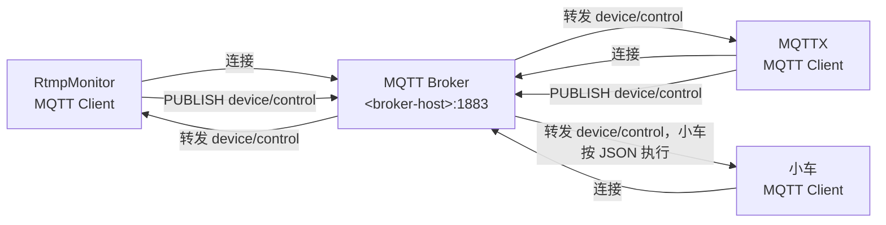
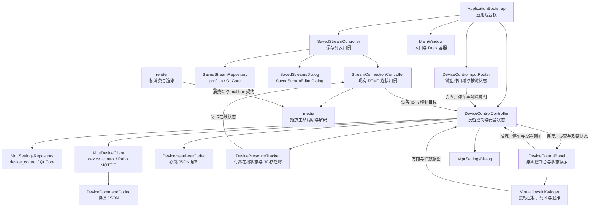
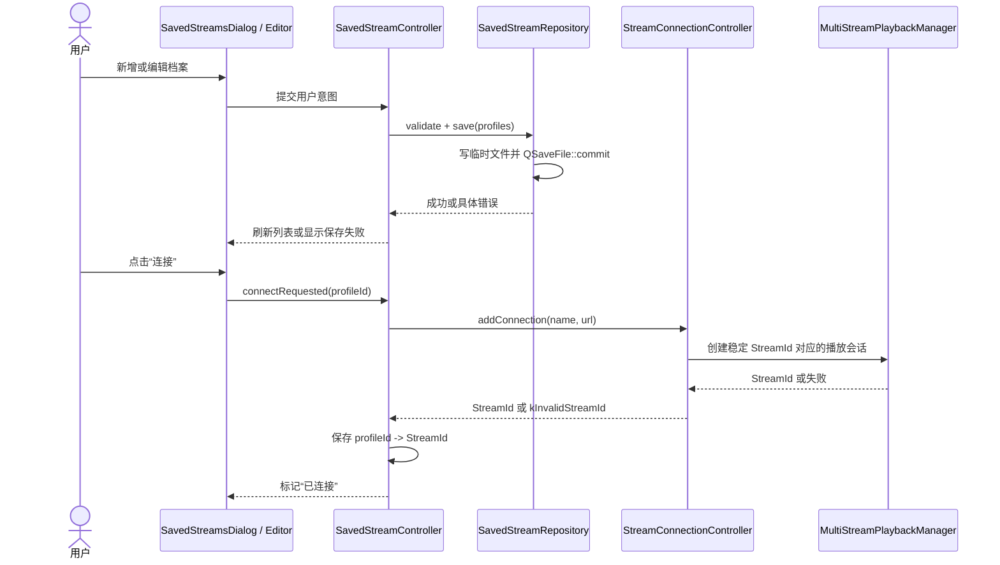
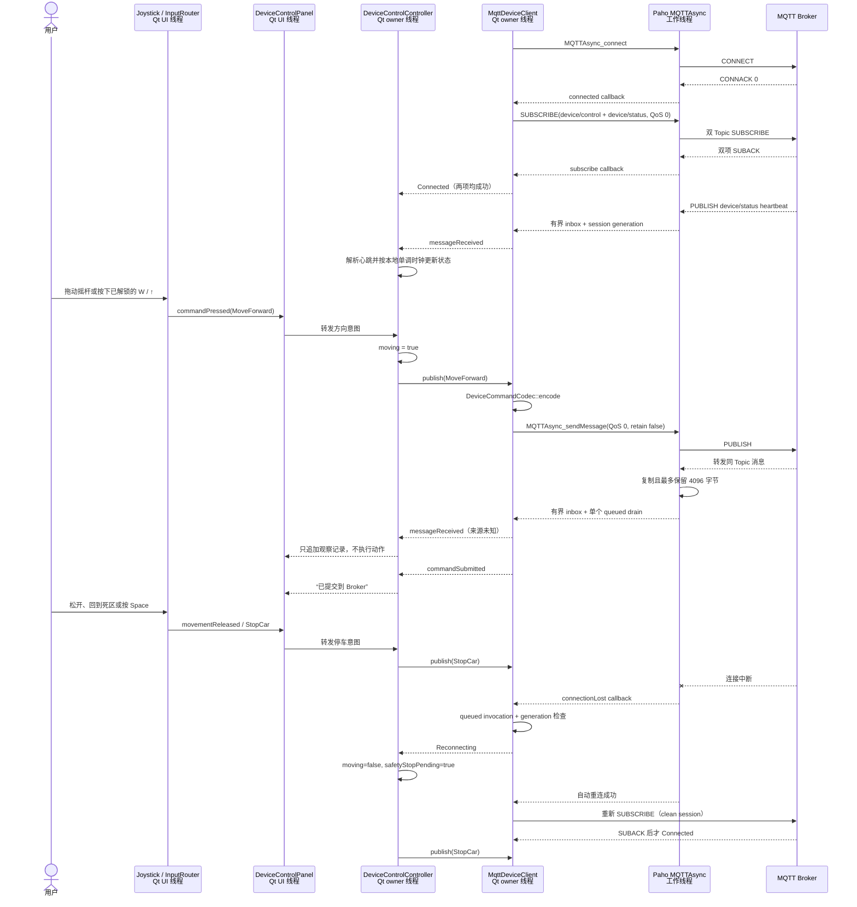
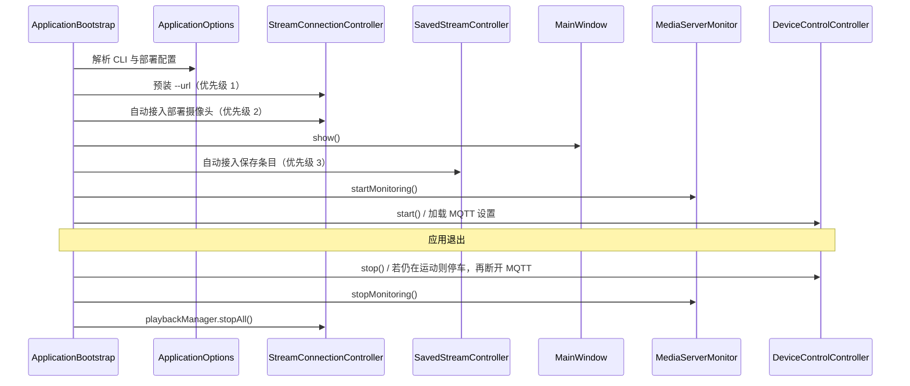

# 保存推流与单车 MQTT 控制：设计、使用与测试指南

> 文档状态：与 2026-08-15 安全默认值实现一致
> 适用版本：RtmpMonitor `0.1.0-alpha.1`
> 读者：功能使用者、现场联调人员、测试人员和后续维护者

## 1. 从零理解 MQTT

如果把 MQTT 想成一个“只按频道转发小纸条的邮局”，会比较容易入门：

- **RtmpMonitor、MQTTX 和小车都是 Client（客户端）**，地位上都能发布或订阅；
- **Broker（消息代理）**是邮局，只负责接收消息并按 Topic 转发；
- **Topic（主题）**是频道名或分拣标签，例如 `device/control`；
- **payload（载荷）**才是纸条内容，本项目使用 JSON 表达“前进”“停车”等意图。

MQTT 是一种轻量级的**发布/订阅消息协议**。它很适合发送小型控制消息和设备状态，但本项目
不会用它传 RTMP 视频：MQTT 传控制信令，RTMP 传视频，两条链路相互独立。

### 1.1 Broker、地址和 Topic 不是一回事

当前配置可以拆成两部分理解：

```text
Broker 地址：mqtt://<broker-host>:1883
Topic：       device/control
```

Broker 地址告诉客户端“去哪里建立网络连接”；Topic 告诉 Broker“这条消息属于哪个频道”。客户端
必须先连接 Broker，随后才能发布或订阅 Topic。不能把 `device/control` 当成服务器地址，也不能
只知道 Broker 地址却不知道双方约定的 Topic。

工程沟通中推荐称中心节点为 **Broker**，因为它的核心职责是消息代理和转发。MQTT 规范及某些软件
也会使用 “MQTT Server” 这个泛称，所以“MQTT 完全没有 Server 这一说”并不严谨；更准确的表达是：
这里不是一个理解 `moveCar` 业务的应用服务器，而是 MQTT Broker。Broker 通常不需要知道小车是谁，
也不需要理解 JSON 代表电机前进。



### 1.2 发布、订阅、信令和 payload

| 概念 | 初学者解释 | 本项目中的例子 |
| --- | --- | --- |
| 发布（Publish） | 把一条消息交给 Broker，并指定 Topic | PC 向 `device/control` 发布 `stopCar` JSON |
| 订阅（Subscribe） | 告诉 Broker：以后匹配这个 Topic 的消息请转发给我 | 小车、PC 或 MQTTX 订阅 `device/control` |
| 信令 | 表达控制意图的小消息，不是视频本身 | 启动推流、停止推流、前后左右、停车 |
| payload | 一条 MQTT 消息实际携带的数据 | `{"action":"stopCar","data":{},...}` |

“双方平权、在 Topic 里聊天”可以帮助理解发布/订阅，但 Topic 不是有历史记录的聊天室，也不是一个
存放数据的文件。如果所有客户端都只订阅而没有任何客户端发布，就不会产生控制消息。当前
`retain=false`，Broker 也不会把最后一条控制命令留给以后才上线的新订阅者。

### 1.3 为什么 PC 和小车可以各自独立测试

PC 不需要知道小车的 IP 或 clientId，小车也不需要知道消息来自 RtmpMonitor 还是 MQTTX。双方只需：

1. 连接同一个 Broker；
2. 使用完全一致的 Topic；
3. 遵守相同的 JSON 字段、大小写和动作含义。

因此朋友可以用 MQTTX 向 `device/control` 发布，独立验证小车；PC 端也可以在完全没有小车时，
用 MQTTX 订阅和发布来验证 RtmpMonitor。这正是发布/订阅带来的解耦。联合测试时，RtmpMonitor、
MQTTX 和小车还可以同时订阅同一 Topic：任一客户端发布一条消息，Broker 会把它转发给所有**当前
在线且订阅匹配**的客户端，形成“一发多收”。它不是无条件广播，也不保证离线客户端收到 QoS 0
消息。

客户端具备对等的协议能力，不等于一次业务流程没有角色。本项目通常是 PC 发布控制、小车订阅并
执行，MQTTX 则可扮演发布者或观察者。RtmpMonitor 现在也订阅同一个 Topic，但只显示观察消息，
绝不会把收到的 JSON 解释成本地按钮、播放器或其他动作。

### 1.4 QoS 0、会话和安全边界

- **QoS 0** 表示“最多发送一次”：没有 PUBACK，消息可能因断网而丢失；发送 API 成功不等于车辆执行。
- **retain false** 表示不保留控制命令供新订阅者上线时重放，避免车辆一上线就执行旧动作。
- **clean session** 表示本轮连接断开后不保留订阅会话和离线 QoS 0 消息；每次重连都必须重新订阅。
- **SUBACK** 是 Broker 对订阅请求的接受结果。RtmpMonitor 收到成功 SUBACK 前不会启用控制按钮。

发布/订阅能隔离 PC 与设备，便于各自开发和替换，也减少点对点连接耦合；但不能因此把公网明文
MQTT 称为“很安全”。没有 TLS、身份认证、来源字段、设备回执或访问控制的 Broker，可能被知道
地址、Topic 和协议的人观察或发布消息。生产环境仍需要认证、加密和 Topic 权限控制。

### 1.5 当前需求与旧设备文档的关系

旧 DOCX 是协议来源之一，但当前双方确认的联调约定优先：Broker 由用户在本机设置中输入，使用
`mqtt://<broker-host>:1883` 形式而不是旧 WebSocket 地址；移动 action 使用大小写敏感的
`moveCar`。MQTT 3.1.1 PUBLISH 本身没有提供本项目可用的业务发送者身份，因此 PC 观察到消息时
统一显示“来源未知”，不能根据相同 payload 猜测它来自自身、MQTTX 或小车。

## 2. 先了解这次增加了什么

本次增加了两个彼此独立的能力：

1. **保存常用 RTMP 推流**：把常用名称和完整 `rtmp://` 地址保存到本机，可以手工连接，
   也可以选择在 RtmpMonitor 启动时自动接入。
2. **单受控设备 MQTT 控制与心跳状态**：通过一个全局 MQTT Broker、控制 Topic 和状态 Topic，
   向一台设备发送推流/车辆命令，并按设备 ID 的心跳显示视频卡在线状态。

这两个能力没有被塞进媒体播放器或 `MainWindow`：保存列表有自己的 repository 和用例控制器，
MQTT 有自己的协议、配置、客户端和控制器。现有 FFmpeg 解码、重连、渲染和 RTMP 连接流程没有
因此承担设备控制职责。

必须先区分两组容易混淆的操作：

| 操作 | 控制对象 | 实际效果 |
| --- | --- | --- |
| “保存的推流”中的“连接/断开” | 本地 RtmpMonitor | 添加或移除本地 RTMP 播放连接 |
| “设备控制”中的“启动推流/停止推流” | MQTT 设备 | 只向小车提交控制命令 |

添加 RTMP 连接后，播放器会立即拉流并按原有策略重试；此时设备可能尚未推送。用户单击视频卡选择
控制目标，再点击“启动推流”，应用把该卡当前的完整运行时 URL 写入 `startStream.data.url`。设备
开始推送后，现有播放器会自动恢复，不创建第二条播放连接。

### 2.1 当前支持范围

- 最多保存 16 条 RTMP 档案。
- 每条档案包含稳定 UUID、显示名称、完整 RTMP URL 和自动接入开关。
- 只维护一个 MQTT 客户端、一个 Broker、控制 Topic `device/control`、状态 Topic `device/status`
  和一个当前控制目标；两个 Topic 的 QoS 均为 0。
- MQTT 使用明文 TCP、无用户名密码、QoS 0、retain false。
- MQTT 连接成功后同时订阅控制和状态 Topic；两项 SUBACK 都成功后才进入“已连接”。
- RTMP URL 最后一个非空路径段是设备 ID；每张视频卡独立显示等待心跳、在线、离线或状态不可用。
- 心跳到达立即在线；使用客户端单调时钟连续 30 秒未收到同一 ID 心跳后离线。
- 面板只观察最近 20 条会话消息，不将收到的消息执行成本地动作。
- 方向键采用“按住行驶、松开停车”。
- 面板隐藏、应用失活、全屏切换、鼠标捕获丢失和应用退出时触发桌面端停车保护。

### 2.2 本轮明确没有实现

- 携带目标 `client_id` 的多设备定向控制或每设备独立 Topic。界面可识别多张卡的状态，但当前控制
  payload 没有目标字段，同一 Broker/控制 Topic 只能部署一台真正受控设备。
- 加速、减速、速度档位、`capture` 或 `reset`。
- TLS、用户名密码、证书或其他鉴权方式。
- 设备命令执行回执；`device/status` 心跳只证明设备最近上报在线，不证明命令执行成功。
- MQTT 启停推流与本地播放器自动添加/删除连接。
- 固件断网看门狗认证。

后续扩展多车时应优先扩展 payload 中的设备标识，不应为每辆车复制一套 Paho 客户端或把 MQTT
配置写入每条 RTMP 档案。

## 3. 为什么按现在的方式拆分

### 3.1 设计要求

新增能力遵守以下边界：

- `media` 不依赖 `render`、`ui`、`profiles` 或 `device_control`。
- `render` 不依赖 `ui`、`profiles` 或 `device_control`。
- `device_control` 只依赖 Qt Core 和 Eclipse Paho MQTT C，不包含 UI、媒体或渲染头文件。
- `profiles` 只依赖 Qt Core。
- UI 只接收状态、显示数据和发出用户意图，不直接操作 Paho。
- 跨层对象创建、信号连接、启动顺序和退出顺序只在 `ApplicationBootstrap` 完成。
- 持久化失败不能留下半个 JSON 文件，因而使用 `QSaveFile` 原子提交。
- Paho 回调不能从工作线程访问 QWidget，必须排队回到 Qt 对象所属线程。
- 对外行为要诚实：QoS 0 只能证明发布请求已被客户端接受，不能证明车辆已经执行。

这些要求解决的是“独立变化原因”问题：RTMP 档案格式、MQTT 协议、网络重连、设备运动状态、
Qt 控件布局和本地播放连接分别会因不同需求变化，不应由同一个大类共同拥有。

### 3.2 模块依赖图



图中的箭头表示编译期或直接调用依赖。`device_control` 没有指向 UI、媒体或渲染；
`SavedStreamController` 通过现有连接用例接入媒体，不绕过 `StreamConnectionController`。

CMake 对应两个独立静态库：

| CMake target | 主要内容 | 允许依赖 |
| --- | --- | --- |
| `rtmp_monitor_profiles` | 档案类型、校验和原子持久化 | `Qt6::Core` |
| `rtmp_monitor_device_control` | 命令协议、设置、Paho 客户端 | `Qt6::Core`、`paho-mqtt3a` |

`cmake/CheckLayerDependencies.cmake` 会在 CTest 中检查禁止 include，防止后续局部需求重新形成
`media -> MQTT/UI` 或 `device_control -> UI/media/render` 的反向依赖。

## 4. 保存推流模块的类与职责

### 4.1 类职责表

| 类/类型 | 拥有的职责与状态 | 为什么独立 | 不应该负责 |
| --- | --- | --- | --- |
| `SavedStreamProfile` | `profileId`、`displayName`、`streamUrl`、`autoConnect` | 为持久化、界面和用例提供稳定数据契约 | 文件 I/O、建立播放连接 |
| `SavedStreamLoadResult` | 档案列表、错误、文件是否存在 | 区分“首次无文件”和“文件损坏” | 弹窗或自动修复 |
| `SavedStreamRepository` | schema v1、校验、读取、`QSaveFile` 写入 | 持久化规则可脱离 UI 和媒体独立测试 | QWidget、StreamId、播放器生命周期 |
| `SavedStreamController` | 档案用例、对话框协调、`profileId -> StreamId` 会话映射 | 保存列表与本地连接之间需要应用层协调，但不属于媒体 | 直接调用 FFmpeg、解析 JSON、绘制控件 |
| `SavedStreamsDialog` | 列表展示、选中项和按钮可用状态 | UI 只表达增删改连断意图 | 写文件、创建媒体流 |
| `SavedStreamEditorDialog` | 编辑名称、URL、自动接入；新建时生成 UUID | 表单验证和字段编辑是独立 UI 职责 | 管理活动连接或全局列表 |

拆分后的直接好处是：repository 测试不需要启动 QWidget，UI 销毁不会改变文件所有权，媒体连接失败
也不会破坏已经保存的档案。

### 4.2 保存、连接与映射时序



`profileId` 是跨重启稳定的档案身份；`StreamId` 是当前进程中的播放身份。两者不能合并：同一档案
断开后再次连接会得到新的播放会话，档案 UUID 则保持不变。

### 4.3 关键行为

- 新增档案默认开启“启动时自动连接”。
- 活动档案必须先断开才能编辑，避免显示 URL 与实际播放 URL 不一致。
- 删除保存项不会自动断开已经建立的播放连接。删除只改变持久化数据；“断开”是独立操作。
- 播放连接从其他入口被移除时，Controller 监听 `connectionRemoved` 并清除对应映射。
- 自动连接遇到重复 URL、重复 cameraId 或 16 路容量上限时，由现有连接控制器拒绝该条；
  已经建立的前序连接不会被挤掉。

## 5. MQTT 设备控制模块的类与职责

### 5.1 类职责表

| 类/类型 | 拥有的职责与状态 | 为什么独立 | 不应该负责 |
| --- | --- | --- | --- |
| `DeviceCommand` | 七种设备命令枚举 | 避免 UI 和网络层传递脆弱字符串 | JSON 或按钮布局 |
| `MqttConnectionState` | Disabled、Disconnected、Connecting、Subscribing、Connected、Reconnecting、Error | 明确区分 CONNACK 与 SUBACK，未订阅成功时不误启用控制 | Paho 资源所有权 |
| `MqttConnectionOptions` | enabled、Broker、控制 Topic、状态 Topic、keepalive | 单会话连接配置 | 每车配置或用户凭据 |
| `DeviceHeartbeat` / `DeviceHeartbeatCodec` | 校验 `heartbeat`、`client_id`、设备时间戳并记录本地接收时刻 | 业务 JSON 解析不进入 Paho 回调或 UI | 用设备时间戳判断 PC 端超时 |
| `DevicePresenceTracker` | Qt 所有者线程中的 30 秒超时、64 项有界缓存、会话清理和状态信号 | 在线规则和网络 session 生命周期可分别测试 | Paho 资源、视频卡或车辆命令 |
| `DeviceIdentity` | 从已校验 RTMP URL 的末段提取合法设备 ID | URL/ID 规则集中，避免 UI 和控制器各自猜测 | 保存 Broker 或建立媒体连接 |
| `MqttObservedMessage` | Topic、最多 4096 字节的原始 payload、接收时间和原始长度 | 网络接收契约不依赖 QWidget，且能明确表达截断 | 识别发送者、解析或执行业务动作 |
| `DeviceCommandCodec` | 命令到紧凑 UTF-8 JSON 的确定性映射 | 协议大小写和字段可做纯逻辑契约测试 | 网络连接、当前时间来源 |
| `MqttSettingsLoadResult` | 设置、错误和文件存在状态 | 区分缺省配置与损坏配置 | 自动覆盖损坏文件 |
| `MqttSettingsRepository` | schema v2、地址/双 Topic 校验、v1 迁移和原子保存 | 配置安全边界集中管理 | Paho 连接和 UI 提示 |
| `MqttDeviceClient` | 唯一 `MQTTAsync` session、订阅、发布、重连、有界接收 inbox、销毁和 callback generation | 网络线程与资源生命周期需要单一所有者 | QWidget、车辆运动语义、本地播放 |
| `DeviceControlController` | 组合当前 StreamId/设备 ID/URL、在线状态、用户命令、待停车状态和配置切换 | “控制哪张卡、何时允许启动或移动”属于应用用例 | Paho session、心跳 JSON 细节、FFmpeg |
| `VirtualJoystickWidget` | 鼠标捕获、摇杆帽位置、20% 死区、四向量化、约 10° 方向迟滞和 120 ms 回中动画 | 连续鼠标坐标与 MQTT 命令是不同变化原因；单独控件可精确测试边界抖动和释放停车 | Controller、MQTT session、速度或斜向协议 |
| `DeviceControlInputRouter` | 键盘模式、显式解锁、当前按键集合、最后按下顺序和快捷键作用域 | 应用级键盘事件不能塞入面板或 `MainWindow`；单独路由器可验证文本框、模态窗口和失焦行为 | MQTT、车辆运动真值、按键持久化或自定义改键 |
| `DeviceControlPanel` | 桌面卡片布局、模式选择、状态展示、推流/停车意图、最近 20 条观察消息和设置入口 | 控件可独立验证离线禁用、焦点、布局和显示上限 | 直接调用 Paho、持有键盘集合、写配置或执行收到的 JSON |
| `MqttSettingsDialog` | 编辑配置和显示连接测试结果 | 临时测试连接不污染主面板职责 | 发送设备命令或决定持久化策略 |

### 5.2 MQTT 线程与命令时序



Paho 回调只捕获带 `QPointer` 的上下文，并通过 queued invocation 回到 Qt 对象所属线程。
每次重建或断开连接都会增加 generation；旧 session 延迟到达的订阅或消息回调会被丢弃，避免旧
Broker 错误地覆盖新连接状态。Paho 工作线程中的接收路径每条最多复制 4096 字节；待投递 inbox
最多 64 条，满时丢弃最旧、保留最新，而且每个 session 同时最多安排一个 Qt drain 任务，避免公网
消息洪泛形成无界 Qt 事件队列。payload 不写入长期日志。

`disconnectFromBroker()` 和析构均可重复调用。退出时如果 Controller 仍记录为运动状态，会先尝试
提交停车，再停止重连并销毁 `MQTTAsync` session；但网络已经中断时，桌面程序无法保证停车命令
到达设备。

### 5.3 协议契约

默认控制 Topic 为 `device/control`，默认状态 Topic 为 `device/status`。payload 是紧凑 UTF-8 JSON，控制命令的 `timestamp` 为发送时的 Unix epoch
毫秒。动作名称和方向值大小写敏感：

```json
{"action":"startStream","data":{"url":"rtmp://<rtmp-host>/live/<device-id>"},"timestamp":1780413729147}
{"action":"stopStream","data":{},"timestamp":1780413729826}
{"action":"moveCar","data":{"direction":"up"},"timestamp":1780413730000}
{"action":"moveCar","data":{"direction":"down"},"timestamp":1780413730000}
{"action":"moveCar","data":{"direction":"left"},"timestamp":1780413730000}
{"action":"moveCar","data":{"direction":"right"},"timestamp":1780413730000}
{"action":"stopCar","data":{},"timestamp":1780413730000}
```

| 桌面操作 | `action` | `data` |
| --- | --- | --- |
| 启动推流 | `startStream` | `{"url":"当前选中卡的完整 RTMP URL"}` |
| 停止推流 | `stopStream` | `{}` |
| 前进 | `moveCar` | `{"direction":"up"}` |
| 后退 | `moveCar` | `{"direction":"down"}` |
| 左转 | `moveCar` | `{"direction":"left"}` |
| 右转 | `moveCar` | `{"direction":"right"}` |
| 停车 | `stopCar` | `{}` |

QoS 0 没有业务回执。“已提交到 Broker”表示 Paho 接受了发布请求，不表示 Broker、设备订阅端、
电机控制或推流服务已经执行成功。PC 收到自身发布的同 Topic 消息，只证明 Broker 又把消息转发给
PC 的订阅，不是小车回执。

设备每 15 秒向 `device/status` 发布一次心跳：

```json
{"type":"heartbeat","client_id":"<device-id>","timestamp":5824750}
```

设备 `timestamp` 可是运行时计数，客户端不拿它与电脑时间比较。RtmpMonitor 只按本地单调时钟记录
收到该 ID 心跳的时刻：首次绑定且未满 30 秒为 Waiting，收到后立即 Online，连续 30 秒没有收到为
Offline；MQTT 未启用或状态 Topic 尚不可用时为 Unavailable。短暂重连不会立即伪造离线，状态会按
30 秒规则自然过期；切换 Broker 或状态 Topic 时清除旧 session 心跳。

当前控制 payload 没有 `client_id`，所以点击不同视频卡只能改变 `startStream.data.url` 和桌面端的
安全门禁，不能让 `moveCar`、`stopCar` 或 `stopStream` 在 Broker 上定向到不同设备。生产部署必须
保证同一控制 Topic 只有一台受控设备；真正多设备需要为控制消息增加 `client_id` 或采用设备专属 Topic。

## 6. 如何嵌入现有应用

### 6.1 `MainWindow` 保留的职责

`MainWindow` 只增加了两个界面挂载点：

- 视频工具栏中的“保存的推流”Action，触发 `savedStreamsRequested`。
- 默认位于右侧的“设备控制”Dock；可停靠在左侧或右侧，并可从“视图”菜单隐藏/恢复。

它不知道 JSON schema、不创建 Paho client，也不管理 `profileId -> StreamId`。应用级键盘事件由
`DeviceControlInputRouter` 处理，不在 `MainWindow` 增加 WASD 分支。全屏转换时只发出
`fullscreenTransitionStarted`，由组合根连接到控制器、面板和输入路由器，使停车、视觉复位和键盘
解除各自在所属边界内完成。

### 6.2 组合根中的启动和退出顺序



启动优先级保证新保存项不会取代已经由 CLI 或部署配置建立的连接。连接重复或容量已满时，
后到的保存项会被跳过，前面的连接继续运行。

## 7. 本机配置文件

两个文件都位于 Qt 的 `QStandardPaths::AppConfigLocation`。应用设置了组织名 `RtmpProject`、
应用名 `RtmpMonitor`，Windows 当前典型目录为：

```powershell
$ConfigRoot = Join-Path $env:LOCALAPPDATA 'RtmpProject\RtmpMonitor'
Get-ChildItem -LiteralPath $ConfigRoot -Force
```

不要把含真实 stream key、签名或凭据的配置文件提交到 Git、问题单或长期记忆。

### 7.1 `saved-streams.json`

```json
{
  "schemaVersion": 1,
  "profiles": [
    {
      "profileId": "00000000-0000-4000-8000-000000000001",
      "displayName": "本地测试流",
      "streamUrl": "rtmp://127.0.0.1:1935/live/camera01",
      "autoConnect": true
    }
  ]
}
```

| 字段 | 规则 |
| --- | --- |
| `schemaVersion` | 当前只接受整数 `1`；高版本拒绝加载 |
| `profiles` | 数组，最多 16 项 |
| `profileId` | 有效且不重复的 UUID；编辑时保持不变 |
| `displayName` | 去除首尾空白后 1～64 个字符 |
| `streamUrl` | 有效 `rtmp://` URL，必须有 host；规范化后不得重复 |
| `autoConnect` | 布尔值；缺失时按 true 读取 |

读取时会忽略未知字段，但不会接受未知 schema。文件损坏时，repository 返回具体错误、清空本次
加载结果、禁止自动接入，并保留原文件不变。

### 7.2 `mqtt-control.json`

```json
{
  "schemaVersion": 2,
  "enabled": false,
  "brokerUrl": "",
  "topic": "device/control",
  "statusTopic": "device/status"
}
```

| 字段 | 规则 |
| --- | --- |
| `schemaVersion` | 当前写入整数 `2`；读取 v1 时保留原设置并补充 `device/status` |
| `enabled` | 首次默认 false；false 时启动后保持禁用，不建立连接 |
| `brokerUrl` | 禁用时可以为空；启用或测试连接时只接受无鉴权的 `mqtt://主机[:端口]`，默认端口 1883 |
| `topic` | 非空、最多 256 字符，不允许 `#`、`+` 或 NUL |
| `statusTopic` | 非空、最多 256 字符，不允许 `#`、`+` 或 NUL；安全默认值为 `device/status` |

Broker URL 不允许用户名密码、路径、query 或 fragment。UI 中使用 `mqtt://`；适配层会在内部转换为
Paho 接受的 `tcp://host:port`。

首次没有配置文件时，MQTT 保持禁用且 Broker 为空，不执行 DNS、TCP、MQTT CONNECT 或订阅。
配置损坏时同样不会回退到任何远端地址：控制器将 MQTT 设为禁用并显示错误，等待用户明确打开
设置、修正并保存。已有合法本机配置继续按其 `enabled` 值加载，不删除、不迁移到仓库。

### 7.3 损坏文件的安全恢复

1. 退出 RtmpMonitor，避免程序同时写配置。
2. 确认目录和文件名，不直接删除。
3. 先复制备份，再检查 JSON：

```powershell
$ConfigRoot = Join-Path $env:LOCALAPPDATA 'RtmpProject\RtmpMonitor'
$Stamp = Get-Date -Format 'yyyyMMdd-HHmmss'
Copy-Item -LiteralPath (Join-Path $ConfigRoot 'mqtt-control.json') `
  -Destination (Join-Path $ConfigRoot "mqtt-control.$Stamp.backup.json")
Get-Content -LiteralPath (Join-Path $ConfigRoot 'mqtt-control.json') -Raw
```

4. 对照本节 schema 修复，或在应用的 MQTT 设置中输入有效配置并明确保存。
5. 保存推流文件也采用相同步骤；如果 URL 含敏感 stream key，不要把原文粘贴到公开渠道。

## 8. 新增界面如何使用

### 8.1 “保存的推流”窗口

入口：主窗口顶部“视频操作”工具栏 → **保存的推流**。

列表每项显示名称、完整 RTMP URL，以及可选的“自动”和“已连接”标记。

| 按钮 | 用法与注意事项 |
| --- | --- |
| 新增 | 输入名称和 `rtmp://` URL；默认勾选启动时自动连接 |
| 编辑 | 修改未连接条目；已连接条目会提示先断开 |
| 删除 | 只删除保存记录，不中断已经播放的流 |
| 连接 | 通过现有连接控制器建立本地播放，并标记“已连接” |
| 断开 | 删除该档案当前映射的本地播放连接 |
| Close | 只关闭管理窗口，不改变保存内容或活动连接 |

推荐的第一次操作：

1. 确认测试 RTMP 流可用。
2. 点击“新增”，名称填写“本地测试流”。
3. URL 填写 `rtmp://127.0.0.1:1935/live/camera01`。
4. 首次验证时可暂时取消“启动时自动连接”，点击保存。
5. 选中条目并点击“连接”，确认主网格出现视频。
6. 点击“断开”，确认视频格被移除。
7. 再勾选自动连接，重启应用验证启动顺序。

### 8.2 “设备控制”面板

面板默认停靠在主窗口右侧，推荐宽度约 360 px，最小宽度 320 px；可以像普通 Windows Dock
一样拖到左右两侧或调整宽度。隐藏后，可通过菜单 **视图 → 设备控制** 恢复。输入模式默认是
“鼠标摇杆”，不会保存上次模式，也不会在重启后自动启用键盘控制。

面板从上到下包括：

- MQTT 连接状态和可选的错误详情。
- 控制/状态两个 Topic、当前选中设备 ID，以及与 Broker 状态分开的设备心跳状态。
- “启动推流”“停止推流”设备命令按钮。
- “鼠标摇杆”“键盘 WASD”模式选择和对应控制区域。
- 始终可见的红色“立即停车  Space”按钮。
- 最近一次提交结果或安全警告。
- 默认折叠的“Topic 消息观察（来源未知）”列表，最多保留本次运行最近 20 条。
- 标准齿轮“设置”入口。

绿色、蓝色和红色状态点分别辅助表示在线、连接过程和错误，旁边始终有文字，不能只凭颜色判断。
首次建立的卡自动成为控制目标；之后单击视频卡切换目标，拖拽换位不改变稳定 StreamId 绑定。
移除当前目标后会清空选择，不自动控制下一张卡。Start 和移动要求 MQTT 已连接、目标已选择且设备
Online；StopStream 和 StopCar 在 MQTT 已连接且存在目标时即允许，以免心跳过期阻断安全停止。
Broker“已连接并订阅”不等于设备 Online，界面分别显示两种状态。

#### 鼠标摇杆模式

1. 在圆形有效区域内按住鼠标左键并向目标方向拖动；摇杆帽连续跟随鼠标，但协议只量化为前、后、左、右。
2. 中心约 20% 活动半径是死区。在死区内按下不会发送移动；运动中拖回死区会立即请求停车。
3. 同一方向持续拖动只发送一次移动命令，不按帧或鼠标移动频率重复发布。方向边界有约 10°
   迟滞，轻微手抖不会在两个方向间反复切换。
4. 松开、鼠标捕获丢失、控件隐藏或窗口失焦时先立即请求停车，再用约 120 ms 动画把摇杆帽
   送回中心；动画不会延迟停车。
5. 连续摇杆只改善鼠标手感，不表示速度大小；当前没有斜向、模拟速度或加减速命令。

#### 键盘 WASD 模式

1. 切换到“键盘 WASD”后，还必须点击“启用键盘控制”。显式解锁能避免用户在普通界面输入时误动车辆。
2. `W/A/S/D` 和方向键分别对应前、左、后、右；系统自动重复被忽略，长按不会重复发布。
3. 多键同时按住时采用“最后按下方向优先”。例如按住 W 再按 D 会转右；松开 D 而 W 仍按住
   时恢复前进，不合成斜向命令。
4. `Space` 立即停车并清空已按键状态；旧按键仍被物理按住时不会自动恢复运动，必须先释放再重新按下。
5. `Esc` 先停车再解除键盘控制。退出全屏或重新连接后不会自动恢复，必须再次点击启用。
6. 文本框、可编辑下拉框、数字输入框和模态对话框拥有正常键盘输入权，路由器不会截获其中的 WASD。

模式切换、MQTT 断开、应用失活、Dock 隐藏、进入监控墙、进入视频全屏、打开设置窗口和程序退出
都会清空旧输入并解除键盘控制；若正在运动，Controller 只提交一次有效停车。点击“立即停车”也会
立即清空摇杆或键盘输入状态。

面板固定显示“断网自动停车未经验证”。这不是普通提示语，而是当前安全边界：若网络已断，
桌面端只能在恢复连接后补发停车，无法证明车辆在断网期间已经停下。

观察列表每条包含本地接收时间、Topic、单行转义后的 payload 和截断提示。换行、制表符和控制字符
会显示为 `\n`、`\t` 或 `\uXXXX`，不会按富文本解释。单条原始 payload 超过 4096 字节时只显示
前 4096 字节；网络侧待投递消息超过 64 条时丢弃最旧消息，面板提示“消息过快，部分观察消息已
丢弃”。这些限制只影响桌面观察，不改变 Broker 对其他订阅者的转发。

所有观察记录都标记“来源未知”。看到自己刚发布的 JSON 是 Broker 的正常回送；看到 MQTTX 的
JSON 也只用于观察。两者都不会驱动桌面输入、本地 RTMP 播放器或其他动作，也都不是设备回执。

### 8.3 MQTT 设置和“测试连接”

首次启动默认值：

- Broker：空，必须由用户输入
- 控制 Topic：`device/control`
- 状态 Topic：`device/status`
- “启动时连接”：关闭

“测试连接”会先按启用状态校验候选配置；Broker 为空时直接拒绝，不发起网络请求。合法时临时完成
CONNECT/CONNACK 和双 Topic SUBSCRIBE/SUBACK，**不会发送任何
设备命令**。成功文案是“连接并订阅成功（未发送设备命令）”。CONNACK 成功但 SUBACK 被拒绝、
订阅提交失败或 5 秒内没有 SUBACK，均按测试失败处理，设备命令保持禁用。
测试后：

- 点击“保存”：先停止当前运动、断开旧连接，原子保存新配置，再连接新目标。
- 点击“取消”：恢复进入设置窗口前的已保存配置和连接。
- 保存失败：恢复旧连接，不把非法或半写入配置当成新配置。

## 9. Windows 本地构建与自动化测试

所有命令都从仓库根目录执行。

### 9.1 首次环境准备

先安装 Visual Studio 2022“使用 C++ 的桌面开发”、Qt 6.6.1 MSVC x64 和 Git，然后执行：

```powershell
powershell.exe -NoProfile -ExecutionPolicy Bypass `
  -File .\scripts\setup_windows_dev.ps1 `
  -Action All -Configuration Debug `
  -QtRoot "<Qt-msvc-root>" `
  -ToolRoot "<tool-root>"
```

`All` 会准备固定版本的 vcpkg、FFmpeg 和 Paho MQTT C，生成本机 preset，配置、构建并运行 CTest。
项目不要求把第三方 DLL 提交到仓库。

### 9.2 日常完整回归

```powershell
cmake --preset Qt-Debug --fresh
cmake --build out\build-windows-x64\debug --parallel
ctest --test-dir out\build-windows-x64\debug --output-on-failure
```

当前 Windows Debug 配置注册 **27** 个测试目标；新增摇杆和键盘路由器测试后，本轮完整基线为
**27/27**。如果本机数量不同，先执行：

```powershell
ctest --test-dir out\build-windows-x64\debug -N
```

确认当前 build tree 是否由最新 CMake 配置生成，不要直接把历史数量当成当前通过结论。

### 9.3 新增模块定向测试

```powershell
ctest --test-dir out\build-windows-x64\debug `
  -R "saved_stream_repository|device_control_contract|mqtt_device_client|device_control_panel|virtual_joystick|device_control_input|layer_dependency" `
  --output-on-failure
```

| CTest | 覆盖内容 | 是否访问公网 |
| --- | --- | --- |
| `rtmp_monitor_saved_stream_repository_test` | 无文件、Unicode、稳定 UUID、重复/非法项、损坏文件保留、高版本拒绝 | 否 |
| `rtmp_monitor_device_control_contract_test` | 七种命令、字段/大小写/时间戳、离线默认值、禁用空 Broker、启用空 Broker 拒绝、设置读写和非法地址/Topic | 否 |
| `rtmp_monitor_mqtt_device_client_test` | 默认配置零连接、CONNECT/CONNACK、SUBSCRIBE/SUBACK、订阅拒绝/超时、QoS 0 扇出、重连重订阅、4096 字节截断、64 条有界 inbox、离线失败和幂等停止 | 否 |
| `rtmp_monitor_device_control_panel_test` | 最小宽度、离线禁用、模式/解锁状态、观察区折叠、20 条上限、控制字符转义和隐藏复位 | 否 |
| `rtmp_monitor_virtual_joystick_test` | 20% 死区、四向量化、边界迟滞、同向去重、释放/隐藏停车和立即停车后回中动画 | 否 |
| `rtmp_monitor_device_control_input_test` | 显式解锁、WASD/方向键、自动重复、多键回退、Space、文本输入、模态窗口和失活解除 | 否 |
| `rtmp_monitor_layer_dependency_test` | media/render/device_control 的禁止 include | 否 |

需要观察 Fake Broker 的详细测试过程时：

```powershell
ctest --test-dir out\build-windows-x64\debug `
  -R "^rtmp_monitor_mqtt_device_client_test$" -V
```

Fake Broker 是测试进程内部的 `QTcpServer`，监听随机回环端口，不需要安装生产 Broker，也不会连接
任何公网服务。它支持 CONNECT/CONNACK、SUBSCRIBE/SUBACK、QoS 0 向多个订阅者转发、
PINGRESP、DISCONNECT、订阅拒绝/无响应和主动断线。测试桩实现了 PINGREQ/PINGRESP 分支；当前用例
没有单独等待 30 秒 keepalive 周期并断言 PING，因此不能把 keepalive 时序记为独立通过项。

## 10. 本地手动测试：PC 与小车可独立联调

建议严格按本节顺序测试。先证明纯逻辑和本地 Broker，再接公网和实车，定位问题会更清楚。

### 10.1 级别 A：不启动 Broker，不连接车辆

首次没有 `mqtt-control.json` 时，代码默认 `enabled=false` 且 Broker 为空，不会发起任何网络请求。
下面的命令用于显式创建一份本机禁用配置：它会先为已有配置创建带时间戳的备份，再写入无 BOM
的 UTF-8 JSON：

```powershell
$ConfigRoot = Join-Path $env:LOCALAPPDATA 'RtmpProject\RtmpMonitor'
New-Item -ItemType Directory -Path $ConfigRoot -Force | Out-Null
$MqttConfig = Join-Path $ConfigRoot 'mqtt-control.json'
if (Test-Path -LiteralPath $MqttConfig) {
  $Stamp = Get-Date -Format 'yyyyMMdd-HHmmss'
  Copy-Item -LiteralPath $MqttConfig `
    -Destination (Join-Path $ConfigRoot "mqtt-control.$Stamp.before-local-test.json")
}
$Json = @{
  schemaVersion = 2
  enabled = $false
  brokerUrl = 'mqtt://127.0.0.1:1883'
  topic = 'device/control'
  statusTopic = 'device/status'
} | ConvertTo-Json
$Utf8NoBom = New-Object System.Text.UTF8Encoding($false)
[System.IO.File]::WriteAllText($MqttConfig, $Json, $Utf8NoBom)
```

随后执行：

1. 完成 9.3 的五项定向 CTest。
2. 启动应用：

```powershell
.\out\build-windows-x64\debug\rtmp_monitor.exe --renderer auto
```

3. 确认状态为“已禁用”，七个设备命令按钮不可用。
4. 打开“MQTT 设置”，确认“启动时连接”没有勾选；本级测试不要点击“测试连接”。
5. 打开“保存的推流”，验证新增、编辑、删除和错误 URL 提示。

此级别可以验证 UI、持久化和离线状态，不会向任何设备发命令。

### 10.2 级别 B：测试内置 Fake Broker

直接运行：

```powershell
ctest --test-dir out\build-windows-x64\debug `
  -R "^rtmp_monitor_mqtt_device_client_test$" --output-on-failure
```

该测试会自行创建和销毁 Broker，适合确认 Paho DLL、Qt 事件循环、发布、重连和退出生命周期。
它不是供 GUI 手工连接的常驻服务。

### 10.3 级别 C：用 MQTTX 独立测试 PC（主要手工方式）

此流程完全不需要小车。先在 MQTTX 新建连接：

```text
Host/地址：<broker-host>
Port：1883
Protocol：MQTT（TCP，不选 WebSocket）
认证：无
```

联调应同时准备隔离的控制 Topic 和状态 Topic，例如：

```text
rtmp-monitor/test/<随机字符串>/control
rtmp-monitor/test/<随机字符串>/status
```

不要用姓名、设备号或密码充当随机字符串，也不要在确认安全前使用真实车辆 Topic。随后：

1. MQTTX 订阅两个临时 Topic。
2. RtmpMonitor 的 MQTT 设置填写相同 Broker、控制 Topic 和状态 Topic，点击“测试连接”。
3. 确认显示“连接并订阅成功（未发送设备命令）”，消息观察区没有因此出现 PUBLISH。
4. 添加 `rtmp://127.0.0.1:1935/live/local-device`，单击该卡选为控制目标。
5. 由 MQTTX 每 15 秒向状态 Topic 发布
   `{"type":"heartbeat","client_id":"local-device","timestamp":1}`；卡片应立即 Online。
6. 点击“启动推流”。MQTTX 应在控制 Topic 收到含该本地 URL 的 `data.url`；RtmpMonitor 观察列表
   必须显示 `<stream-url>`，不能显示完整端点。
7. 停止心跳，30 秒边界后卡片应 Offline；恢复一条合法心跳后应立即 Online。
8. 再由 MQTTX 向控制 Topic 发布任意测试文本或合法 JSON；RtmpMonitor 应显示它，但不得执行本地
   按钮、方向动作或 RTMP 操作。

这证明 PC 的连接、订阅、发布和观察链路可用，不证明小车收到或执行。测试结束后恢复目标配置。

### 10.4 级别 D：朋友用 MQTTX 独立测试小车

此流程完全不需要 RtmpMonitor。朋友让设备订阅 `device/control`，并每 15 秒向 `device/status`
发布自己的心跳；MQTTX 同时订阅两个 Topic，并按第 5.3 节逐条发布精确 JSON。当前控制协议没有
目标设备字段，因此此流程只能连接一台受控设备，不能把状态跟踪能力误称为多设备定向控制。

实车仍必须架空或清场。先发 `stopCar`，再测启停推流；方向动作每次不超过 300 ms，并紧接一条
`stopCar`。MQTTX 显示发布成功只能作为消息侧证据，小车动作需要朋友单独记录。

### 10.5 级别 E：验证“一发多收”

1. RtmpMonitor 和两个 MQTTX 窗口连接同一 Broker。
2. 三者订阅同一个唯一临时 Topic。
3. 任意一方发布一条消息。
4. 三个在线订阅端都应各收到一次。

这证明 Broker 对匹配订阅者进行扇出；不证明离线客户端会补收，也不证明车辆执行。若只收到部分，
先检查各端 Topic 是否逐字符一致以及订阅是否已经收到成功反馈。

### 10.6 可选：本地 Mosquitto

如果不希望使用公网 Broker，可自行安装 Mosquitto。一个终端运行 `mosquitto -v -p 1883`，另一个
运行 `mosquitto_sub -h 127.0.0.1 -p 1883 -t device/control -v`，应用设置为
`mqtt://127.0.0.1:1883`。Mosquitto 只是可选命令行工具；主要手工流程以 MQTTX 为准，自动化仍以
测试内置 Fake Broker 为准。

### 10.7 每一步到底能证明什么

| 观察到的证据 | 只能证明 | 不能证明 |
| --- | --- | --- |
| CONNECT API 返回成功 | Paho 接受了异步连接请求 | Broker 已接受会话 |
| CONNACK 0 | Broker 接受了 MQTT 会话 | Topic 已订阅、车辆在线 |
| SUBACK 成功 | Broker 接受了该 Topic 的订阅 | 发布消息或车辆执行 |
| QoS 0 publish 返回成功 | Paho 接受了发送请求 | Broker/订阅者收到，更不是车辆执行 |
| PC 收到自身消息 | Broker 已转发给 PC 的同 Topic 订阅 | 小车收到或这是设备回执 |
| MQTTX 收到消息 | Broker 已转发给 MQTTX | 小车收到或执行 |
| 小车实际动作 | 设备确实收到、解析并执行了该次命令 | 其他设备也成功 |

任何前一层证据都不能替代后一层。定位问题时记录“最后成功的一层”和“第一失败的一层”。

### 10.8 本地 SRS 与保存推流联调

SRS 由项目的 WSL2 脚本管理。先确认 WSL 发行版：

```powershell
wsl.exe --list --quiet
```

启动和查看状态：

```powershell
powershell.exe -NoProfile -ExecutionPolicy Bypass `
  -File .\scripts\srs\srs_dev_wsl.ps1 `
  -Action Start -Distro "<WSL-distro>"

powershell.exe -NoProfile -ExecutionPolicy Bypass `
  -File .\scripts\srs\srs_dev_wsl.ps1 `
  -Action Status -Distro "<WSL-distro>"
```

在另一个终端按 [SRS 新手指南](../guides/build-and-testing/srs_beginner_guide.md) 的“自己动手推流”
步骤保持一路测试流发布到：

```text
rtmp://127.0.0.1:1935/live/camera01
```

然后运行应用并测试：

1. 在“保存的推流”新增“本地 camera01”。
2. 连接后确认视频进入 playing，而不是长期 reconnecting。
3. 断开后确认网格移除；删除档案后确认活动流不会被隐式删除。
4. 重新建立档案、开启自动连接并重启应用。
5. 如果同一 URL 同时通过 `--url` 传入，确认保存项被拒绝且 CLI 连接继续播放。
6. 完成后使用脚本的 `-Action Stop` 停止它自己启动的 SRS。

若只想快速证明 SRS 自身推拉链路，可执行 `-Action Test`；该动作会在自测结束时停止临时 publisher，
因此不适合作为 GUI 长时间播放源。

## 11. 公网 Broker 与实车安全测试

如果现场使用公网明文 Broker，其地址必须由用户自行输入，例如：

```text
mqtt://<broker-host>:1883
```

它适合当前联调，但不应被视为生产安全方案。任何能访问该服务且知道 Topic 的客户端都可能观察或
发送消息。

### 11.1 第一级：只测试连接和订阅

先做 TCP 可达性检查：

```powershell
Test-NetConnection -ComputerName <broker-host> -Port 1883
```

然后在应用的 MQTT 设置中点击“测试连接”。该操作会走完 CONNECT/CONNACK 和
SUBSCRIBE/SUBACK，但不发布设备命令。当前已验证的远端事实仍只有此前的匿名 CONNACK 0；本次
代码修改后的公网 SUBACK 尚未执行验证，不能提前写成通过。

### 11.2 第二级：公网 payload 验证但不触发车辆

不要在默认 `device/control` 上随意按方向键。将应用和观察客户端临时切换到唯一测试 Topic，例如：

```text
rtmp-monitor/test/<本次随机标识>
```

确保该 Topic 未被车辆订阅，再通过 MQTTX 或 `mosquitto_sub` 观察精确 JSON。测试后恢复保存配置。
公网 Broker 是共享环境，测试 Topic 中也不得包含姓名、设备编号、密码或其他敏感信息。

### 11.3 第三级：实车测试

只有满足以下条件才允许把 Topic 恢复为 `device/control` 并发布：

- 车辆架空、轮胎离地，或现场已经清场并设置物理阻挡。
- 操作者可以立即切断车辆电源。
- 已确认没有其他测试者同时控制该 Topic。
- 先验证中心停车，再验证运动。

测试顺序：启动推流、停止推流、前、后、左、右。每个方向按住不超过 300 ms，释放后观察
`stopCar`，随后再手工点击一次中心停车。任何动作与预期不符、应用异常或网络中断时，立即停止
所有公网发布并切断设备动力。

由于没有回执 Topic，记录必须分成两项：

- Broker 观察端是否收到正确 payload。
- 实车是否执行了对应动作。

前者不能替代后者，界面上的“已提交到 Broker”也不能作为实车通过证据。

## 12. 故障定位

### 12.1 MQTT 无法连接或订阅

按层级排查，不要持续轰击公网服务：

| 层级 | 检查 | 常见结论 |
| --- | --- | --- |
| 配置校验 | Broker 是否为 `mqtt://host[:port]`，Topic 是否无通配符 | UI 会直接提示格式错误 |
| DNS/TCP | `Test-NetConnection -ComputerName <host> -Port <port>` | timeout、refused、unreachable 属于网络/监听层 |
| MQTT 握手 | UI“测试连接”及 Paho code/message | TCP 通但 CONNACK/协议连接失败 |
| Topic 订阅 | 状态是否停在“正在订阅”、SUBACK 是否拒绝或 5 秒超时 | 会话已建立但 Broker 未接受订阅，控制按钮保持禁用 |
| 连接后断开 | 面板 Reconnecting、Broker 日志、系统日志 | Broker 主动断开、网络波动或会话丢失 |

如果公网失败：记录具体层级和时间，停止公网命令发布，切换 10.2 的 Fake Broker 或 10.6 的本地
Broker。不要用快速反复点击“测试连接”代替定位。

系统日志位于同一配置根目录下的 `logs/system.jsonl`。日志会记录 MQTT 状态和错误码，但不应
记录凭据或完整敏感 RTMP URL。

### 12.2 MQTT 已连接但设备不动作

1. 用独立订阅端确认 Topic 和 payload。
2. 检查设备是否订阅完全相同、大小写一致的 Topic。
3. 确认 action 是 `moveCar`，不是 `movecar` 或其他旧拼写。
4. 确认设备固件接受 `up/down/left/right`。
5. 将“Broker 已收到”与“设备已执行”分别记录。

当前协议没有设备命令回执，无法进一步判断设备解析、GPIO、电机驱动或推流进程内部故障；
`device/status` 心跳也不能替代命令回执。

### 12.3 保存项不自动连接

依次检查：

- 档案是否勾选“启动时自动连接”。
- `saved-streams.json` 是否损坏或 schema 高于 1。
- 同 URL 是否已经通过 `--url` 或部署摄像头配置占用。
- 总连接是否已经达到 16 路。
- RTMP 服务和 publisher 是否实际运行。
- 事件消息与系统日志中是否有重复 URL、容量或网络错误。

### 12.4 长期显示 RTMP“正在重新连接”

这是本地播放器的 RTMP 状态，不等于 MQTT 正在重连。先验证 SRS 1935、publisher 和实际 URL：

```powershell
Test-NetConnection -ComputerName 127.0.0.1 -Port 1935
powershell.exe -NoProfile -ExecutionPolicy Bypass `
  -File .\scripts\srs\srs_dev_wsl.ps1 `
  -Action Status -Distro "<WSL-distro>"
```

如果 SRS 可达但 API 中没有对应 stream，问题在推流端；如果 stream 存在，再检查保存 URL 的
application/stream key 是否完全一致。不要因为 MQTT 面板显示已连接，就推断 RTMP 源一定存在。

## 13. 当前验证状态和限制

截至 2026-08-15，已经得到以下结果：

- Windows Debug 干净全目标构建通过，完整 CTest **29/29**（127.76 秒）通过；覆盖 schema v1→v2、
  双 Topic Fake Broker、心跳解析/30 秒超时/64 项缓存、视频卡目标选择、UI、全屏、音频和依赖方向。
- Windows Release 全目标构建通过。
- Linux ARM64 RASTER 和 GLES3 重新配置及全目标交叉构建通过；两者均为 AArch64 ELF。RASTER 的
 直接 NEEDED 项不包含 Qt6OpenGL、Qt6OpenGLWidgets、EGL 或 GLES，GLES3 保留预期 OpenGL 依赖。
- 真实设备心跳、真实控制执行和公网 Broker 本轮未运行；自动化使用回环 Fake Broker，不能替代
  现场安全台架验收。
- RASTER 没有因 MQTT 引入 Qt OpenGL、EGL 或 GLES 动态依赖。
- 2026-08-14 用户通过 EMQX 后台与 MQTTX 完成 Broker 连接、订阅、发布和消息观察联调，确认
  七类指令在消息层的返回符合当前 Topic/JSON 契约；该证据由现场工具提供，不是本轮 Codex
  自动化公网探测结果。
- 尚未完成安全台架实车动作；Broker/MQTTX 消息正常不能替代车辆执行结果。
- Windows Release CTest 在当前机器受运行库加载/PATH 环境影响，部分目标启动前返回
  `0xc0000139`；代表性测试直接运行正常，但不能据此写成 Release CTest 全部通过。
- Windows 测试包包含 `paho-mqtt3a.dll` 和 EPL-2.0 许可证，不携带 OpenSSL。
- 当前打包流程不计算或校验制品哈希，也不生成 SHA256 文件。

这些结果证明当前自动化覆盖的结构和行为通过，不代表公网服务持续可用、车辆固件具有断网看门狗，
也不代表 ARM 真机或生产安全认证已经完成。

## 14. 维护者修改入口

| 需求 | 首选入口 | 必须同步检查 |
| --- | --- | --- |
| 改保存字段或 schema | `SavedStreamProfile`、`SavedStreamRepository` | 迁移策略、原子写、repository 测试 |
| 改自动接入策略 | `SavedStreamController`、组合根 | CLI/部署配置优先级、容量和重复行为 |
| 改设备 JSON | `DeviceCommand`、`DeviceCommandCodec` | 七类契约测试、固件兼容性 |
| 改 Broker/Topic 规则 | `MqttSettingsRepository` | 无鉴权边界、损坏文件行为、设置测试 |
| 改重连或线程模型 | `MqttDeviceClient` | generation、queued callback、幂等退出、Fake Broker 测试 |
| 改停车触发条件 | `DeviceControlController`、`DeviceControlPanel` | 去重、断线待停车、失焦/隐藏/全屏/退出测试 |
| 改鼠标手感或方向判定 | `VirtualJoystickWidget` | 死区、迟滞、捕获丢失、同向去重和回中动画测试 |
| 改键盘作用域或组合键 | `DeviceControlInputRouter` | 显式解锁、文本/模态焦点、多键回退和安全解除测试 |
| 改面板布局或文案 | `DeviceControlPanel` | 不得把 Paho、键盘集合或文件 I/O 移入 UI |

新增多车、设备回执、鉴权/TLS 或与本地播放器联动都属于公共协议或架构边界变化，应先重新评估
数据所有权、线程生命周期、兼容性和测试接缝，不能在现有 Controller 中临时追加无关状态。

## 15. 相关资料

- [渐进式架构解耦设计与实施过程](progressive_decoupling_architecture.md)
- [跨平台构建指南](../guides/build-and-testing/cross_platform_build.md)
- [SRS 新手完全指南](../guides/build-and-testing/srs_beginner_guide.md)
- [项目当前快照](../memory/project_snapshot.md)
- [项目路线图](../roadmap/project_plan.md)
