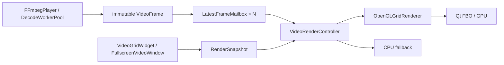

# 产品级视频渲染框架

## 模块



## 帧契约

支持 `Yuv420P8` 和 `Nv12_8`。每帧不可变并携带 plane view、rowBytes、带符号 stride、
时间戳、代次及颜色描述。FFmpeg 适配器使用 `av_frame_clone` 延长缓冲生命周期；不支持的
软件格式用 swscale 规范化为 YUV420P，不提前转 RGB。

缺失颜色信息按以下规则补齐：HD 使用 BT.709，SD 使用 BT.601，YUV 默认 Limited。
当前支持 8-bit SDR、BT.601/709/2020 NCL；PQ/HLG 被计为 unsupported，不宣称 HDR 正确。

## 调度

- worker 提交帧后只置 `FrameDirty`，不投递逐帧 Qt 事件。
- GUI scheduler 使用与目标帧率匹配的精确定时器检查 Dirty：网格约 67 ms（15 FPS），全屏约 33 ms（30 FPS）。不再在固定 16 ms tick 上叠加第二个 66/33 ms 判断，避免量化成约 12.5/20.8 FPS。
- `paintPending` 防止未消费的 update 重复排队。
- `paintGL` 原子消费 Dirty，最多扫描 16 个邮箱，只上传新 sequence。
- 隐藏/最小化时不持续 update；恢复和 Context 重建时强制 Resource/Viewport Dirty。

## OpenGL 资源

- YUV420P：三个 `GL_R8`；NV12：`GL_R8 + GL_RG8`。
- 正常 stride 使用 `GL_UNPACK_ROW_LENGTH`；负 stride、非整像素 stride 使用复用 staging。
- 纹理仅在首次帧、尺寸/格式或 Context 变化时分配，常规帧走 `glTexSubImage2D`。
- 一个静态 quad/VAO/VBO，通过 viewport、scissor、UV 和颜色 uniform 绘制全部流。
- RenderItem 失败被隔离，其余流继续绘制；不为每路创建 FBO。

## Context 生命周期

```text
Uninitialized -> Initializing -> Ready
Ready -> Releasing/ContextLost -> Uninitialized
Initializing failed -> CpuFallback
```

`aboutToBeDestroyed` 和派生类析构入口都会先断开回调，再在有效 Context 中释放 Shader、
VAO/VBO 和纹理。Context 已失效时只丢弃本地句柄；Scene 和 mailbox 保留，重建后重新上传
最新帧。

## 指标 schema v3

保留原 packets/decoded/converted/presented 字段，新增 submitted、mailboxOverwritten、
unsupported、uploaded、rendered、upload/paint CPU 时间、GPU 时间占位、最新帧年龄、
Dirty 合并、调度检查和纹理字节。`presentedFrames` 兼容映射到最终 draw 次数。
根级 `renderer` 同时记录请求/实际后端、fallback、Desktop GL/ES、vendor、renderer 和
version；`renderStatistics` 汇总调度、Dirty、上传、paint CPU、非阻塞 GPU timer query、
纹理字节和最新帧年龄。测试画面中的延迟标记直接从 Y 平面解析，内部/源端延迟在邮箱
对应帧完成最终绘制时采样，不再依赖 RGB QImage。

## 运行

```powershell
rtmp_monitor.exe --renderer=auto
rtmp_monitor.exe --renderer=opengl
rtmp_monitor.exe --renderer=cpu
```

`auto` 在能力或初始化失败时切换 CPU。默认是否长期优先 OpenGL，以 Windows 16 路
10 分钟门禁结果为准。
