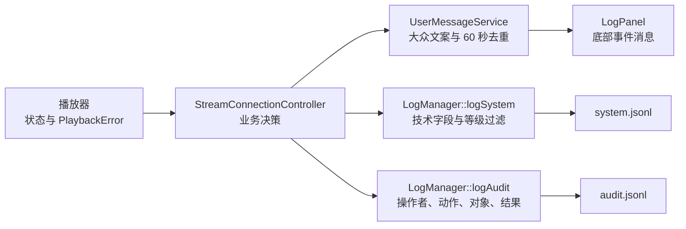

# 用户事件、系统日志与审计日志架构

> 文档分类：架构与深入学习。

## 1. 为什么需要三条通路

底部面板面向普通用户，本地系统日志面向开发和运维，审计日志面向操作追踪。三者
可以来自同一业务事件，但不能复用同一段文本。



`FFmpegPlayer` 不接触 UI 或文件日志，只产生结构化 `PlaybackError`。Controller
知道当前操作是否来自用户，因此由它决定是否同时产生用户消息和审计记录。

## 2. 模块职责

| 模块 | 负责 | 不负责 |
|---|---|---|
| `UserMessageService` | 事件到中文文案的统一映射、重复抑制 | 保存技术日志、解释 FFmpeg 文本 |
| `LogPanel` | 显示最多 5000 条用户消息、暂停滚动和清空 | 等级过滤、磁盘文件、技术诊断 |
| `LogManager` | 系统等级过滤、系统/审计分流、异步文件和轮转 | 决定业务事件是否需要审计 |
| `SensitiveDataSanitizer` | URL、文本和 JSON 字段脱敏 | 业务权限和加密存储 |
| `LogConfiguration` | 默认值和 INI 加载 | 设备配置持久化 |
| `StreamConnectionController` | 把设备结果转换为三类输出 | 网络读取和视频解码 |

## 3. 三类记录示例

设备连接失败时，面板只显示：

```text
[20:15:03] 摄像头 01 连接失败，请检查网络连接
```

`system.jsonl` 保存技术信息：

```json
{"channel":"system","level":"warning","module":"media","event":"stream_error","deviceId":"1","message":"打开输入失败：Connection refused","fields":{"errorCode":4,"nativeErrorCode":-111,"recoverable":true}}
```

自动连接失败不属于用户修改系统状态，因此不写审计。用户新增设备成功时，
`audit.jsonl` 记录：

```json
{"channel":"audit","actor":"admin","action":"ADD_DEVICE","targetType":"Camera","targetId":"1","result":"SUCCESS","source":"local-ui"}
```

## 4. 用户错误映射

`PlaybackErrorCode` 保留技术分类，Controller 将其转换为 `UserFailureReason`，再由
`UserMessageService` 生成文案。用户界面从不解析或显示 `technicalMessage`。

| 用户失败原因 | 默认文案 |
|---|---|
| `ConnectionTimeout` | 设备连接超时，请检查网络连接 |
| `HostUnavailable` | 暂时无法找到设备，请确认设备和本机已连接同一 Wi-Fi |
| `AuthenticationFailed` | 设备验证失败，请检查设备信息 |
| `MediaUnavailable` | 无法获取设备画面，请确认设备状态正常 |
| `DuplicateDevice` | 该设备已经添加 |
| `InvalidConfiguration` | 设备信息不完整，请检查后重试 |
| 未分类 | 操作失败，请检查网络和设备状态后重试 |

同一设备、事件和失败原因默认 60 秒内只显示一次。恢复 `Playing` 后会清除该设备的
连接失败抑制状态。

## 5. 本地文件与配置

默认配置文件为：

```text
QStandardPaths::AppConfigLocation/rtmp-monitor.ini
```

配置优先级为：显式命令行参数、INI、编译模式默认值。Debug 构建默认 `debug`，
Release 默认 `info`。

```ini
[logging]
directoryPath=
shutdownFlushTimeoutMs=2000
recoveryRetryMs=60000

[system]
level=info
consoleEnabled=false
maximumFileBytes=10485760
retainedFileCount=5
retentionDays=14
maximumTotalBytes=67108864
queueCapacity=4096
repeatWindowMs=60000

[system.modules]
media=warning

[audit]
maximumFileBytes=10485760
retainedFileCount=20
retentionDays=180
maximumTotalBytes=268435456
queueCapacity=1024

[userMessages]
repeatWindowMs=60000
```

未设置 `directoryPath` 时使用
`QStandardPaths::AppLocalDataLocation/logs`。`retainedFileCount` 表示历史文件数，
不包含当前活动文件。

## 6. 队列、清理与故障降级

- 系统和审计各有独立文件线程，媒体和 UI 线程不执行磁盘 I/O。
- 系统队列满时优先丢弃 Trace、Debug、Info，并保存一次溢出汇总。
- 审计队列独立，极端满载时保留较新的操作并记录 `AUDIT_QUEUE_OVERFLOW`。
- 初始化和轮转时同时执行文件数量、保留天数和总体空间清理。
- 退出时优先刷新审计和高等级系统记录，默认刷新窗口为 2 秒。
- 创建或写入失败不会使播放器退出，也不会进入用户事件面板；错误只向 stderr
  报告一次，并按 60 秒间隔尝试恢复。

## 7. 敏感信息保护

所有记录在进入异步队列前完成脱敏：

- URL 删除账号、密码、query 和 fragment，并把最后一级路径替换为 `***`；
- `password`、`token`、`secret`、`privateKey`、`credential` 等 JSON 字段替换为
  `***`；
- 文本中的 URL 和常见敏感 `key=value` 同样处理；
- 审计记录的修改前值和修改后值使用相同规则。

业务代码不得绕过 `LogManager` 使用 `qDebug()` 输出完整设备地址。

## 8. 当前审计边界

当前项目只有会话内新增、删除和手动重连，因此只在这些用户操作处接入审计。
登录、设备编辑、配置持久化和权限管理尚未实现；对应 `AuditAction` 与用户事件类型
已经预留并有单元测试，未来业务模块应在操作结果确定后调用，而不是伪造当前不存在
的界面或用户状态。
