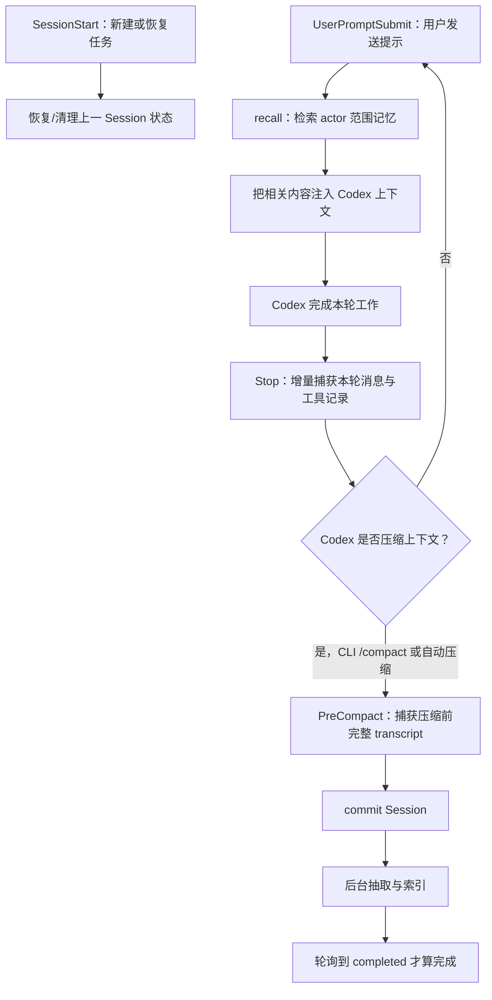

# OpenViking 使用、Codex/Kimi 联动、Studio 与测试指南

本文面向 `rtmpProject` 的日常开发，目标是让你可以直接照着操作：

- 理解 OpenViking 保存了什么、没有保存什么；
- 在 Codex 中使用自动记忆和主动检索；
- 在 Kimi Code 中以 MCP 客户端方式主动使用 OpenViking；
- 配置并使用 OpenViking Studio；
- 通过可清理的实验学习 Session、commit、记忆抽取和跨会话召回；
- 在不泄露密钥、不开放局域网端口的前提下完成日常运维。

> 当前部署基线：OpenViking Server 0.4.11 运行在 WSL2
> `Ubuntu-22.04-New` 中，Windows 通过 `http://127.0.0.1:1933`
> 访问 API、MCP 和 Studio。仓库代码、CMake、测试结果及
> `docs/memory/` 始终比 OpenViking 召回内容更权威。

## 1. 我应该在哪里使用

| 操作面 | 在哪里运行 | 用途 | 日常入口 |
| --- | --- | --- | --- |
| Codex Desktop / CLI | Windows | 自动召回、自动捕获、主动 MCP 检索；CLI 还用于 `/hooks` 和 `/compact` | 在 `<仓库根目录>` 打开 Codex |
| Kimi Code | Windows | 通过 MCP 主动搜索、读取、写入或删除 OpenViking 内容 | 在项目目录启动 `kimi`，TUI 中输入 `/mcp` |
| OpenViking Studio | Windows 浏览器 | 查看身份、资源、记忆、Session 和后台任务 | `http://127.0.0.1:1933/studio` |
| 健康检查 | Windows PowerShell | 从客户端一侧确认 WSL 服务可达 | `/health`、`/ready` |
| OpenViking Server | WSL2 | systemd 服务、doctor、journal、服务端 CLI | `wsl.exe -d Ubuntu-22.04-New` |

日常优先顺序是：

```text
Codex 或 Kimi 完成工作
        ↓
Studio 观察数据和任务
        ↓
只有故障或配置变更时才进入 WSL2 运维
```

不要在 Windows 和 WSL2 各安装一套 Server，也不要在 WSL2 再安装第二份
Codex OpenViking 插件。本项目的分工是：

- Windows 是 AI 客户端和浏览器操作面；
- WSL2 是 OpenViking Server 操作面；
- `127.0.0.1:1933` 是两者之间的本机边界。

## 2. 什么是 OpenViking

OpenViking 是面向 AI Agent 的上下文数据库。它不是 Codex/Kimi 聊天记录的简单备份，
也不只是向量数据库。它把资源、会话和长期记忆组织成可浏览、可检索的虚拟文件系统，
再让 Agent 按需召回，而不是每次都把全部历史塞入模型上下文。

### 2.1 Resource、Memory、Skill 和 Session

| 类型 | 含义 | 常见来源 |
| --- | --- | --- |
| Resource | 相对稳定的外部知识，例如文档、规范和经过筛选的资料 | 用户主动导入 |
| Memory | 从交互或任务结果中抽取的长期事实、偏好、事件或经验 | Session commit 后生成 |
| Skill | Agent 可声明和调用的流程、能力或工具说明 | 插件或用户配置 |
| Session | 一段对话的消息、工具调用、归档和记忆变化记录 | 客户端或 Hook 写入 |

一次 commit 通常包含两个阶段：

1. OpenViking 接受 Session 提交并返回 `task_id`；
2. 后台模型生成摘要、建立索引并按策略抽取记忆。

所以 `commit accepted` 只表示“任务已受理”，不表示抽取完成。必须继续查看
Tasks 或轮询任务状态，直到 `completed`，才能声称本次记忆抽取成功。
`failed` 或超时都不算通过。

### 2.2 VikingFS、Viking URI 与索引

OpenViking 使用 `viking://` URI 组织上下文。常见结构可理解为：

```text
viking://
├── resources/                         # 当前账户的客观资源
└── user/
    ├── memories/                      # 当前用户的长期记忆
    ├── peers/<peer>/memories/         # 与工作区/交互对象相关的记忆
    └── sessions/<session-id>/         # 会话、消息、工具结果和归档
```

AGFS/VikingFS 保存实际内容；向量索引保存 URI、向量和检索元数据。正常删除
VikingFS 内容时，OpenViking 会同步维护索引。不要绕过 API 直接删除
`/var/lib/openviking/data` 下的数据库或整个 memories 目录。

同一内容还可按不同详细程度加载：

- L0：短摘要，用于快速筛选；
- L1：概览和关键点；
- L2：完整正文或完整消息。

Agent 可以先用 L0/L1 找到相关内容，再按需读取 L2，从而控制上下文成本。

参考资料：

- [Architecture Overview](https://docs.openviking.ai/en/concepts/01-architecture)
- [Context Types](https://docs.openviking.ai/en/concepts/02-context-types)
- [Viking URI](https://docs.openviking.ai/en/concepts/04-viking-uri)
- [Storage Architecture](https://docs.openviking.ai/en/concepts/05-storage)
- [Session Management](https://docs.openviking.ai/en/concepts/08-session)

## 3. 当前项目的部署边界

```text
Windows
├── Codex Desktop / Codex CLI
│   └── openviking-memory 插件（Hook + 内置 MCP）
├── Kimi Code（可选的项目级 MCP 客户端）
├── 浏览器中的 OpenViking Studio
└── <OpenViking 客户端配置目录>\ovcli.conf
                 │
                 │ HTTP localhost:1933
                 ▼
WSL2 Ubuntu-22.04-New
└── openviking.service
    ├── /opt/openviking/venv-0.4.11
    ├── /etc/openviking/ov.conf
    └── /var/lib/openviking/
```

- Codex Home 使用本机 `$env:CODEX_HOME`，文档不记录个人绝对目录。
- Server 由 WSL2 systemd 管理，只监听 `127.0.0.1:1933`。
- `/etc/systemd/system/openviking.service.d/proxy.conf` 只为 Server 的上游 VLM
  请求设置 `127.0.0.1:7890` 代理；localhost 仍由 `NO_PROXY` 直连。
- Windows 客户端使用权限受限的 user/admin key，不使用 Server root key浏览租户数据。

### 3.1 当前后台 VLM：GPT-5.6 Luna

截至 2026-08-03，本机 OpenViking 0.4.11 使用
`openai-codex/gpt-5.6-luna`，继续通过 Codex OAuth 和 Responses API 调用。它改变的是
OpenViking 后台的文件摘要、Session 摘要和记忆抽取模型，不会改变 Codex Desktop 当前
任务所使用的模型。

当前 0.4.11 有一个兼容边界：配置 schema 不接受 `vlm.reasoning_effort`，原 Codex
Responses 适配器也不会转发该参数。本机适配器因此只对 `gpt-5.6-*` 明确发送
`reasoning.effort=none`。不要在 `ov.conf` 中自行增加该字段，否则服务会报
`Unknown config field 'vlm.reasoning_effort'` 并进入重启循环。

已验证证据：doctor 显示 Luna PASS；真实最小请求成功；专用 Session commit 最终
`completed` 且 reasoning Token 为 0。OpenViking 重装或升级会覆盖 venv 内的本机补丁，
升级后必须重新执行 doctor、最小模型请求和可清理 Session commit。当前走的是 Codex
订阅后端，公开 OpenAI API 的每 Token 价格不能直接当作本机实际账单。
- API Key、OAuth、代理凭据和完整鉴权 URL不得写入仓库。
- 当前 Windows 与 WSL2 使用 mirrored networking，共享 localhost，无需
  `netsh portproxy`、`0.0.0.0` 监听或局域网防火墙放行。

## 4. Codex 如何与 OpenViking 联动

OpenViking 官方 Codex Memory Plugin 同时提供生命周期 Hook 和 MCP 工具。两者用途不同：

- Hook 负责随 Codex 生命周期自动召回、捕获和提交；
- MCP 负责由 Codex 主动搜索、读取、记住或删除内容。

### 4.1 自动记忆流程



四个 Hook 的职责：

| Hook | 触发时机 | 作用 |
| --- | --- | --- |
| `SessionStart` | 新建、恢复或清空任务时 | 初始化召回配置，安全恢复/清理上一 Session 状态 |
| `UserPromptSubmit` | 用户提示提交前 | 检索 actor 范围内的相关记忆并注入上下文 |
| `Stop` | Codex 每个 turn 结束时 | 增量捕获本轮用户、助手和工具记录 |
| `PreCompact` | Codex 压缩上下文前 | 捕获压缩前 transcript 并提交 Session |

Hook 信任在共享同一 `CODEX_HOME` 的 Codex CLI 中通过 `/hooks` 管理。
Codex Desktop 聊天框没有 `/hooks` 是界面差异，不是插件损坏。手动触发真实
PreCompact 也应在 Codex CLI 中输入 `/compact`，不能用手工运行 Hook 脚本代替。

### 4.2 Hook 自动记忆与 MCP 主动调用的区别

| 能力 | Hook | MCP |
| --- | --- | --- |
| 是否自动 | 是，跟随 Codex 生命周期 | 否，由 Agent/用户提示触发工具调用 |
| 主要用途 | 自动召回、捕获、归档、commit | 搜索、读取、写入、删除指定内容 |
| 成功证据 | Hook 日志、Session archive、`.done`、任务 `completed` | 工具返回值和服务端任务状态 |
| 常见误区 | Hook active 不代表记忆已抽取完成 | MCP 已加载不代表 Hook 已信任 |

Codex 是当前 OpenViking 官方文档中具有完整自动生命周期捕获链的客户端。本指南后面
介绍的 Kimi Code MCP 接入只有主动工具调用，不能等同于 Codex 的自动链路。

### 4.3 日常怎么让 Codex 使用它

正常工作无需每次手动说“请保存”。建议使用自然、可审查的提示：

```text
开始前，请先根据仓库文档和可用的 OpenViking 记忆总结当前项目状态；
发生冲突时以代码、测试和仓库记忆文档为准。
```

```text
请在 OpenViking 中主动搜索与“RTMP Server 产品化边界”相关的经验，
列出命中的 URI，再读取最相关的一项；不要把召回内容当作高于仓库的事实。
```

```text
这条结论已经通过代码和测试验证。请只保存脱敏摘要，
不要保存绝对个人路径、密钥、完整日志或大段源码。
```

```text
这条 OpenViking 记忆已经过期，请先指出目标 URI，再删除或更正它。
```

如果当前任务暴露了 OpenViking 经验工具，可要求 Codex 使用
`search_experience`、`read_experience`。2026-08-03 当前 Desktop 已真实暴露并成功调用
这两个精确工具；常规 `search`、`recall`、`read` 也已从项目 peer 召回 Week 1～6 的
脱敏摘要。这个结果证明“主动 MCP 检索”可用，但还不能替代新 Desktop 任务中的
`SessionStart`/`UserPromptSubmit` 自动注入验收。

这些提示不是“咒语”。它们分别给 Codex 四项可审查约束：先读权威仓库、明确要求调用
MCP、只把经验证且脱敏的结论写入长期记忆、按精确 URI 更正旧记忆。Codex 收到提示后，
会选择插件提供的 MCP 工具并把工具结果放入本轮上下文；真正的持久化由 OpenViking
Server 完成，Codex 不能只凭一句“已记住”证明成功。应检查返回 URI、后台 task
`completed`，以及需要时检查 Session 的 `memory_diff.json`。

### 4.4 Codex 插件、MCP 和 Hook 检查

在 Windows PowerShell 中：

```powershell
$env:CODEX_HOME = '<Codex Home 的本机绝对路径>'
codex plugin list
codex mcp list
codex mcp get openviking-memory --json
codex
```

进入 Codex CLI 后：

```text
/hooks
```

验收要点：

- 只有一份启用的 `openviking-memory@openviking`；
- 只有一个相应的 OpenViking MCP；
- `SessionStart`、`UserPromptSubmit`、`Stop`、`PreCompact` 各一份且已信任；
- 新任务中确实出现并成功调用所需工具；
- Hook 日志和任务终态能够证明实际执行。

插件升级或重装可能覆盖插件缓存中的 MCP 配置。升级后应重新检查，而不是把 API Key
硬编码进插件 `.mcp.json`。

参考：

- [OpenViking Codex Memory Plugin](https://docs.openviking.ai/en/agent-integrations/04-codex)
- [Codex Hooks](https://learn.chatgpt.com/docs/hooks)
- [Codex CLI developer commands](https://learn.chatgpt.com/docs/developer-commands?surface=cli)

### 4.5 本项目已经回填的历史记忆

2026-08-03 已把经过仓库、Git、测试或运行结果复核的六个逻辑历史任务回填为：

```text
viking://user/fklightdog/sessions/rtmp-history-20260709-019f4749
viking://user/fklightdog/sessions/rtmp-history-20260718-019f741e
viking://user/fklightdog/sessions/rtmp-history-20260719-019f7aca
viking://user/fklightdog/sessions/rtmp-history-20260726-019f9ee8
viking://user/fklightdog/sessions/rtmp-history-20260728-019fa897
viking://user/fklightdog/sessions/rtmp-history-20260729-019fadb2
```

它们覆盖初始规划与 Week 1～3、文档协作、音视频学习偏好、Week 4、Week 5、Week 6。
每份只保留两条脱敏摘要消息，策略为 peer-only 的 `events/entities/preferences`；27 个子代理
会话、原始 transcript、工具输出和敏感内容未导入。六个 Session 都有
`archive_001/messages.jsonl`、`memory_diff.json` 和 `.done`，并已完成后台抽取。

权威仓库文档位于稳定 Resource 树：

```text
viking://resources/rtmpProject/repository-memory
```

日常使用时，先从 Resource 精确读取当前 Snapshot、Decisions、Known Issues、Handoff 或
路线文档，再用 peer Memory 做语义召回。两者冲突时以实际代码、测试和仓库文档为准。

Windows `ovcli.conf` 不再固定全局 `actor_peer_id`。Codex 插件根据工作目录派生 peer：
本项目仍为 `E--rtmpProject`，其他工作区应得到自己的 peer。修改后要自然重启 Desktop，
让长期运行的 MCP/Hook 子进程重新读取配置；不要为了方便重新加入全局固定 actor。

## 5. Kimi Code 如何与 OpenViking 联动

这里有两个相互独立的方案：

1. Kimi Code 作为 OpenViking MCP 客户端：让 Kimi 主动读写 OpenViking；
2. Kimi 会员模型作为 OpenViking Server 的 VLM：改变后台记忆抽取模型。

它们解决不同问题，可以只使用第一种。第二种不会自动完成第一种，也不会把 Kimi
对话自动同步到 OpenViking。

### 5.1 方案一：Kimi Code 连接 OpenViking MCP（首选）

本机当前记录：

- Kimi Code 版本：0.29.1；
- 默认模型：`kimi-code/k3`；
- 当前没有用户级或项目级 `mcp.json`；
- Kimi 可执行文件：`$env:USERPROFILE\.kimi-code\bin\kimi.exe`。

本次只提供配置方法，不创建真实配置。实际启用时，在项目级创建：

```text
<仓库根目录>\.kimi-code\mcp.json
```

示例内容：

```json
{
  "mcpServers": {
    "openviking": {
      "url": "http://127.0.0.1:1933/mcp",
      "bearerTokenEnvVar": "OPENVIKING_API_KEY",
      "headers": {
        "X-OpenViking-Actor-Peer": "E--rtmpProject"
      },
      "enabled": true,
      "startupTimeoutMs": 30000,
      "toolTimeoutMs": 60000
    }
  }
}
```

安全边界：

- JSON 中只有环境变量名，没有真实 API Key；
- `E--rtmpProject` 是固定的非敏感工作区 peer，用于将记忆限制在本项目；
- 配置只作用于 `rtmpProject`，不要无意中提升为所有 Kimi 项目共享；
- `.kimi-code/mcp.json` 必须保持被 Git 忽略。

截至本文更新时，下面的检查尚未命中忽略规则：

```powershell
git check-ignore --no-index -v -- '.kimi-code/mcp.json'
```

因此不要直接创建真实文件。实际启用前，应另行获准为仓库 `.gitignore` 增加精确规则
`/.kimi-code/mcp.json`，或只在本机 `.git/info/exclude` 增加同一规则；随后再次运行
上面的命令，只有它输出命中的规则后才创建配置。本指南不会修改真实客户端配置或
Git 忽略规则。

#### 5.1.1 从现有客户端配置安全启动 Kimi

在 Windows PowerShell 中运行以下启动器逻辑。它只把 key 放进当前 PowerShell/Kimi
进程环境，不回显、不复制到命令行参数，也不长期写入系统环境变量：

```powershell
$ovConfigPath = '<ovcli.conf 的本机绝对路径>'
$ovClient = Get-Content -LiteralPath $ovConfigPath -Raw | ConvertFrom-Json
$env:OPENVIKING_API_KEY = $ovClient.api_key

try {
    Set-Location -LiteralPath '<仓库根目录>'
    & (Join-Path $env:USERPROFILE '.kimi-code\bin\kimi.exe')
}
finally {
    Remove-Item Env:\OPENVIKING_API_KEY -ErrorAction SilentlyContinue
    Remove-Variable ovClient -ErrorAction SilentlyContinue
}
```

不要执行 `$env:OPENVIKING_API_KEY`、`Write-Output $ovClient.api_key` 或把 key 写入
PowerShell profile。Kimi 退出后，`finally` 会清除当前进程环境中的 key。

进入 Kimi TUI 后输入：

```text
/mcp
```

确认 `openviking` 已连接并显示工具。Kimi Code 0.29.1 的命令行帮助没有
`kimi mcp` 子命令，因此本文使用项目级 `mcp.json` 和 TUI `/mcp`，不使用
不存在的 `kimi mcp add`。

#### 5.1.2 在 Kimi 中学习 MCP 的提示词

搜索：

```text
请使用 OpenViking MCP 搜索与“Qt 6 Widgets”相关的内容，
先返回命中的 Viking URI 和摘要，不要猜测。
```

读取：

```text
请读取刚才最相关的 OpenViking URI，说明它属于 Resource、Memory 还是 Session，
并标出信息层级。
```

保存一条可清理测试记忆：

```text
请通过 OpenViking MCP 保存这条无敏感信息的测试事实：
OV-KIMI-LEARNING-<随机UUID>。完成后返回目标 URI 或任务 ID。
```

删除：

```text
请只删除包含 OV-KIMI-LEARNING-<同一UUID> 的测试内容，
删除前列出目标 URI，删除后再次精确搜索并确认零命中。
```

Kimi MCP 方案只有主动工具调用。当前没有 OpenViking 官方 Kimi 生命周期插件，因此：

- 不能假设每次 Kimi 对话都会自动写入；
- 不能假设新对话会自动执行 `UserPromptSubmit` 召回；
- 不能把 Kimi `/mcp` 显示 connected 当作记忆抽取完成；
- 需要明确提示 Kimi 调用工具，并检查工具返回和后台任务终态。

退出 Kimi 时使用 TUI 的正常退出方式或关闭该进程。由前述 PowerShell 启动器启动时，
`finally` 会清除当前进程的 `OPENVIKING_API_KEY`。若要回滚 MCP 接入：

1. 退出所有从该启动器打开的 Kimi 进程；
2. 移除项目级 `.kimi-code/mcp.json` 中的 `openviking` 项，或在确认文件只为本实验
   创建后删除该文件；
3. 新开 PowerShell，确认未长期设置 `OPENVIKING_API_KEY`；
4. 再次启动 Kimi，用 `/mcp` 确认 OpenViking 已不再加载。

参考：

- [Kimi MCP Configuration](https://www.kimi.com/code/docs/en/kimi-code-cli/customization/mcp.html)
- [OpenViking MCP Clients](https://docs.openviking.ai/en/agent-integrations/06-mcp-clients)

### 5.2 方案二：用 Kimi 会员作为 OpenViking VLM（可选）

该方案改变 OpenViking 后台用于摘要和记忆抽取的 VLM，不改变 Codex/Kimi 客户端
如何接入 OpenViking。执行前要区分三类凭据：

| 凭据 | 用途 | 能否直接替代 |
| --- | --- | --- |
| Kimi CLI OAuth 登录 | Kimi Code 自己登录和使用会员额度 | 不能当作 OpenViking 配置中的 API Key |
| Kimi Code 会员 API Key | 第三方工具调用 Kimi Coding API | 可按 Kimi provider 文档用于 OpenViking VLM |
| Moonshot 开放平台 API Key | Moonshot 开放平台 API | 不能与 Kimi Code 会员 Key、URL 混用 |

需要从 Kimi Code 控制台创建会员 API Key。Key 通常只在创建时显示一次；不要把真实值
写入本文、仓库、截图或命令历史。

#### 5.2.1 变更前备份

进入 WSL2：

```powershell
wsl.exe -d Ubuntu-22.04-New
```

在 WSL2 中：

```bash
sudo cp --preserve=mode,ownership \
  /etc/openviking/ov.conf \
  /etc/openviking/ov.conf.bak-before-kimi
```

优先运行当前已安装版本的初始化向导，并选择 Kimi：

```bash
sudo -u fklightdog \
  env \
  OPENVIKING_CONFIG_FILE=/etc/openviking/ov.conf \
  /opt/openviking/venv-0.4.11/bin/openviking-server init
```

只修改 `vlm` 块，保留当前本地 embedding、存储、端口、鉴权和 Server 配置。
如果向导不支持安全地只改这一块，停止并使用 `sudoedit /etc/openviking/ov.conf`
进行审查式编辑。

当前官方配置文档中的手工参考为：

```json
{
  "vlm": {
    "provider": "kimi",
    "model": "kimi-code",
    "api_key": "<KIMI_CODE_MEMBERSHIP_API_KEY>",
    "api_base": "https://api.kimi.com/coding"
  }
}
```

以当前安装版本的向导和 `doctor` 结果为准。Kimi provider 会应用 Kimi Coding 所需的
默认参数/User-Agent；不要凭猜测替换成 Moonshot URL 或其他模型名。

#### 5.2.2 验收

```bash
sudo -u fklightdog \
  env \
  OPENVIKING_CONFIG_FILE=/etc/openviking/ov.conf \
  /opt/openviking/venv-0.4.11/bin/openviking-server doctor

sudo systemctl restart openviking.service
systemctl status openviking.service --no-pager
```

回到 Windows PowerShell：

```powershell
curl.exe --noproxy "*" http://127.0.0.1:1933/health
curl.exe --noproxy "*" http://127.0.0.1:1933/ready
```

最后创建一个无敏感信息的最小测试 Session，执行 commit，保存 `task_id` 并等待任务
变成 `completed`。health/ready 为 200 只证明服务可用，不能证明 VLM 抽取成功。

#### 5.2.3 回滚

在 WSL2 中：

```bash
sudo cp --preserve=mode,ownership \
  /etc/openviking/ov.conf.bak-before-kimi \
  /etc/openviking/ov.conf

sudo systemctl restart openviking.service
```

然后重新运行 `doctor`、`/health`、`/ready` 和最小 commit。确认回滚成功后再按你的
备份保留策略处理备份文件。

参考：

- [OpenViking Configuration（Kimi provider）](https://github.com/volcengine/OpenViking/blob/main/docs/en/guides/01-configuration.md)
- [Kimi Code 会员 API](https://www.kimi.com/code/docs/)
- [Kimi Code Error Reference](https://www.kimi.com/code/docs/en/kimi-code/error-reference.html)

## 6. OpenViking Studio 怎么配置和使用

### 6.1 从 Windows 打开 WSL2 中的 Studio

先在 Windows PowerShell 检查：

```powershell
Get-ScheduledTask -TaskName OpenViking-rtmpProject-WSL-KeepAlive
curl.exe --noproxy "*" http://127.0.0.1:1933/health
curl.exe --noproxy "*" http://127.0.0.1:1933/ready
```

然后用 Windows 浏览器打开：

- Studio：`http://127.0.0.1:1933/studio`
- OpenAPI/Swagger：`http://127.0.0.1:1933/docs`
- OpenAPI JSON：`http://127.0.0.1:1933/openapi.json`

mirrored networking 会让 Windows 与 WSL2 共享 localhost。不要为 Studio：

- 把服务改成监听 `0.0.0.0`；
- 创建 `netsh interface portproxy`；
- 开放 Windows/Hyper-V 局域网防火墙端口；
- 把 1933 暴露给同一局域网的其他设备。

### 6.2 首次配置 Connection & Identity

Studio 是浏览器客户端，不会自动读取 Windows 上的 `ovcli.conf`。首次打开时，在页面
右上角的 Connection & Identity 独立填写：

| 字段 | 当前值/操作 |
| --- | --- |
| Server URL | `http://127.0.0.1:1933` |
| API Key | 从现有 Windows `ovcli.conf` 的 `api_key` 读取 |
| account | 留空，不手工覆盖 |
| user | 留空，不手工覆盖 |

在 `api_key` 鉴权模式下，account/user 由 user/admin key 派生。手工填写身份头可能
造成身份不一致。

以下 PowerShell 只把 key 复制到剪贴板，不在终端回显：

```powershell
$ov = Get-Content -LiteralPath `
  '<ovcli.conf 的本机绝对路径>' `
  -Raw | ConvertFrom-Json

$ov.api_key | Set-Clipboard
Remove-Variable ov
```

粘贴到 Studio、点击 Save 并确认连接后，立即清空剪贴板：

```powershell
Set-Clipboard -Value 'clipboard-cleared'
```

当前预期身份：

```text
account: rtmpproject-local
user:    fklightdog
role:    admin
```

如果显示的 account、user 或 role 不一致，立即停止导入、删除等操作，检查是否使用了
错误 key 或浏览器保存了旧连接。日常不要使用 Server root key；官方鉴权边界中 root
key 不用于浏览某个租户的用户数据。

使用结束后无需停止 Server。如果是临时浏览器或共用电脑，应在 Connection & Identity
中移除保存的 API Key；若当前 Studio 版本没有移除按钮，则关闭页面后清除
`127.0.0.1:1933` 的浏览器站点数据。再次打开时应重新要求配置连接。不要仅清空普通
页面缓存后就假设凭据已经移除。

参考：

- [OpenViking Authentication](https://docs.openviking.ai/en/guides/04-authentication)
- [Studio Connection & Identity](https://docs.openviking.ai/en/guides/11-oauth)

### 6.3 为什么首页和 Conversations 是空的

空页面通常不是 Studio 损坏，可能表示：

- 当前身份下没有保留的 Resource、Memory 或 Session；
- 之前的唯一标记、测试 Session 和测试记忆已经按要求清理；
- 某次 commit 或 Resource 处理因 VLM 网络超时未完成，因此没有产生可展示的长期记忆；
- Studio 不会导入 Codex Desktop 侧边栏或 Kimi TUI 的聊天历史；
- Conversations/Sessions 只显示实际写入当前 OpenViking account/user 空间的数据；
- 使用了不同 API Key，因而进入了另一个身份空间。

完成 2026-08-03 历史回填后，正确身份下不应再是完全空白：Conversations/Sessions 应能
看到六个 `rtmp-history-*` Session，Peer memories 应能看到 `E--rtmpProject` 的历史摘要，
Resources 应能看到 `rtmpProject/repository-memory`。如果仍全部为空，优先检查身份和
Server URL，不要重复导入。

判断顺序：

1. 确认右上角身份是 `rtmpproject-local / fklightdog / admin`；
2. 查看 Tasks 是否有 `failed` 或 `timeout`；
3. 查看 Resources、Memories、Sessions 是否确实为空；
4. 用一个可删除的最小实验写入数据；
5. 任务到 `completed` 后刷新相应页面。

### 6.4 各页面看什么

| 页面 | 用途 | 重点观察 |
| --- | --- | --- |
| Home | 总览当前身份的数据 | 数量为零不等于 Server 故障 |
| Resources | 用户主动导入的文档/知识 | 导入任务、URI、解析和索引状态 |
| Memories | 当前用户的长期记忆 | 内容、来源 Session、更新时间 |
| Peer memories | 工作区/actor 相关记忆 | peer 是否为预期项目，避免跨项目污染 |
| Conversations / Sessions | 已写入 OpenViking 的会话 | messages、history、archive，不是 Codex 侧边栏 |
| Tasks / Observer | 后台解析、摘要、向量化、抽取任务 | `accepted`、`running`、`completed`、`failed` |

已提交 Session 的典型结构：

```text
viking://user/sessions/<session-id>/
├── .abstract.md
├── .overview.md
├── .meta.json
├── messages.jsonl
├── tools/
└── history/
    └── archive_001/
        ├── messages.jsonl
        ├── .abstract.md
        ├── .overview.md
        ├── memory_diff.json
        └── .done
```

`memory_diff.json` 记录这次抽取新增、更新或删除的记忆，是测试清理的重要依据；
`.done` 表示对应后台阶段真正完成。

### 6.5 Studio 入门操作：导入、观察、搜索、清理

准备一个不含密钥、个人信息和项目源码的小型 Markdown 文件，然后：

1. 在 Resources 选择导入；
2. 在 Tasks/Observer 中找到返回的任务；
3. 等待状态从 accepted/running 变成 `completed`；
4. 回到 Resources，记录它的 `viking://` URI；
5. 在搜索中用文档内的独特非敏感词定位它；
6. 分别查看摘要、概览和完整内容；
7. 删除该测试 Resource；
8. 再次按 URI 和独特词搜索，确认内容及索引都不再命中。

删除前始终核对身份和精确 URI。不要直接删除整个目录，也不要把“列表为空”当作可以
批量清空的授权。

## 7. WSL2 运维命令

日常通常不必进入 WSL2。故障或配置变更时，从 Windows PowerShell 进入：

```powershell
wsl.exe -d Ubuntu-22.04-New
```

在 WSL2 中检查：

```bash
systemctl status openviking.service --no-pager
systemctl show openviking.service -p Restart -p Environment --no-pager
ss -ltnp | grep ':1933'

sudo -u fklightdog \
  env \
  OPENVIKING_CONFIG_FILE=/etc/openviking/ov.conf \
  /opt/openviking/venv-0.4.11/bin/openviking-server doctor

journalctl -u openviking.service --since "30 minutes ago" --no-pager
```

预期：

- 服务为 active；
- 只监听 `127.0.0.1:1933`；
- systemd 重启策略为 `on-failure`；
- `doctor` 不报告阻塞性配置问题；
- journal 中没有持续失败或敏感内容泄露。

只浏览内容时优先使用 Windows Studio 或 Codex/Kimi MCP。如果确实要在 WSL2 使用
隔离 venv 内的客户端 CLI，应另外准备权限受限的客户端 `ovcli.conf`，不能把 Server
的 `/etc/openviking/ov.conf` 当作客户端配置。先以当前版本的 `--help` 为准：

```bash
OPENVIKING_CLI_CONFIG_FILE=/path/to/restricted/ovcli.conf \
  /opt/openviking/venv-0.4.11/bin/openviking --help
```

典型 URI 操作概念如下；若 0.4.11 的参数名不同，以该版本帮助输出为准：

```bash
openviking ls viking://
openviking ls viking://resources
openviking ls viking://user/memories
openviking ls viking://user/sessions
openviking find "Qt 6 Widgets"
openviking read viking://user/memories/<memory-file>
```

退出 WSL shell：

```bash
exit
```

退出终端不会主动停止由登录保活任务维持的 WSL 发行版，也不会替代 systemd 管理。

## 8. 通过测试学习 OpenViking

所有测试必须使用随机、无敏感信息的唯一标记，并在结束后精确清理。不要使用 API Key、
真实身份、完整鉴权 URL、`.env` 内容或代理凭据作为测试文本。

### 8.1 实验一：理解三层健康状态

目标：区分“WSL 正在运行”“systemd active”“OpenViking ready”。

1. Windows 检查登录保活任务；
2. WSL2 检查 `systemctl is-active openviking.service`；
3. Windows 分别请求 `/health` 和 `/ready`；
4. 查看 `ss`，确认 1933 只监听回环；
5. 关闭交互式 WSL 终端，等待五分钟后重复检查。

只有无 WSL 终端时 Windows 仍得到两个 200，且 1933 仍只监听回环，才算完整通过。
若当前权限无法读取计划任务或完成五分钟实验，应保留“待验收”，不要写成已通过。

### 8.2 实验二：学习 Resource、URI 和 L0/L1/L2

1. 导入一份无敏感信息的小型 Markdown；
2. 等待导入任务 `completed`；
3. 用 Studio 或 CLI 查看 URI；
4. 用 `find/search` 定位主题；
5. 依次读取摘要、概览和完整内容；
6. 删除测试 Resource；
7. 用 URI 和独特关键词确认零命中。

### 8.3 实验三：学习 Session commit 与记忆抽取

1. 创建前缀为 `ov-learning-<timestamp>` 的 Session；
2. 写入一条无敏感信息的事实：

   ```text
   OV-LEARNING-<随机UUID>：本实验使用 Qt 6 Widgets 作为测试事实。
   ```

3. commit 并保存返回的 `task_id`；
4. 在 Tasks 或 `/api/v1/tasks/<task_id>` 轮询；
5. 只有状态为 `completed` 后才查看 Session history、`.done` 和
   `memory_diff.json`；
6. 在 user memories 和 `E--rtmpProject` peer memories 中搜索该 UUID。

`failed` 或十分钟超时都不算通过。只记录脱敏错误摘要，然后清理失败测试。

### 8.4 实验四：真实 Codex Hook 和跨任务召回

1. 在共享 `$env:CODEX_HOME` 的 Codex CLI 中新建专用测试任务；
2. 发送唯一标记和测试事实，等待本轮结束并确认真实 Stop 日志；
3. 在 CLI 输入 `/compact`；
4. 确认真实 `PreCompact(trigger=manual)`、Session archive、`.done`、
   `memory_diff.json` 和后台任务 `completed`；
5. 自然启动一个全新的 Codex Desktop 本地任务，只问：

   ```text
   请返回上一测试任务中的唯一测试标记。
   ```

6. 不在新提示中提供标记原文；
7. 核对 SessionStart、UserPromptSubmit 和实际自动注入日志；
8. 只有返回值完全一致且证据链完整时才算跨任务召回通过。

截至本文更新时，真实 CLI `/compact`、PreCompact 与新 Desktop 任务跨会话召回仍未
完成端到端验收，因此 ISSUE-003 保持未解决。Desktop 中
`search_experience`、`read_experience` 的真实可用性也不能提前宣称成功。

### 8.5 实验五：Kimi MCP 主动调用

1. 使用项目级 MCP 配置和安全启动器打开 Kimi；
2. `/mcp` 确认 `openviking` connected；
3. 先搜索一个已知 Resource；
4. 读取命中的精确 URI；
5. 写入 `OV-KIMI-LEARNING-<随机UUID>`；
6. 如果返回 task，等待其 `completed`；
7. 新开 Kimi 对话，明确要求 MCP 搜索该 UUID；
8. 删除目标并再次搜索确认零命中。

这个实验验证的是“主动 MCP 工具调用”，不是 Kimi 自动 Hook 或自动会话捕获。

### 8.6 完整清理

1. 根据 `memory_diff.json` 逆向恢复测试造成的新增、修改或删除；
2. 删除本轮 `cx-...`、`ov-learning-...` 等测试 Session；
3. 删除唯一标记对应的 Resource、Memory、索引项和插件测试状态；
4. 用 Codex CLI `/delete` 删除专用测试任务及 transcript；
5. 对 Sessions、user memories、peer memories 和客户端状态精确搜索 UUID；
6. 所有专用唯一标记必须零命中。

不要删除当前真实任务、既有用户数据或整个 memories 目录。

## 9. 日常操作速查表

### 9.1 每天开始

| 检查 | 命令/动作 | 合格标准 |
| --- | --- | --- |
| WSL 保活 | `Get-ScheduledTask -TaskName OpenViking-rtmpProject-WSL-KeepAlive` | 任务存在且状态合理 |
| 本机代理 | `Test-NetConnection 127.0.0.1 -Port 7890` | `TcpTestSucceeded=True` |
| Server 健康 | `curl.exe --noproxy "*" http://127.0.0.1:1933/health` | HTTP 200 |
| Server 就绪 | `curl.exe --noproxy "*" http://127.0.0.1:1933/ready` | HTTP 200，核心检查 ok |
| Studio 身份 | 打开 `/studio` | `rtmpproject-local / fklightdog / admin` |
| Codex | 检查新任务中的插件/MCP 工具 | 只有一份插件和 MCP |
| Kimi（使用时） | 安全启动后输入 `/mcp` | `openviking` connected |

### 9.2 工作中

- Codex：让 Hook 自动召回/捕获；需要精确内容时主动要求 MCP 搜索和读取 URI。
- Kimi：明确要求使用 OpenViking MCP；不要假设自动记忆。
- Studio：观察 Session 和 Task，尤其关注 accepted 后是否最终 completed。
- 发生文档与召回冲突：采用代码、测试和仓库记忆文档，并更正过期记忆。

### 9.3 配置变更后

按固定顺序：

```text
openviking-server doctor
        ↓
重启 openviking.service
        ↓
/health 与 /ready
        ↓
最小 Session commit
        ↓
等待 task completed
```

如果切换 VLM 或鉴权配置，还要重新确认 Studio 身份和客户端 MCP。

### 9.4 每周维护

- 查看 Tasks 中的 `failed`、`timeout` 和长期 `running`；
- 精确清理已确认无用的测试 Resource、Memory 和 Session；
- 检查 WSL VHDX/`/var/lib/openviking` 磁盘增长；
- 查看近期 systemd journal，确认没有重启循环；
- 插件升级后重新检查唯一插件、唯一 MCP 和四个 Hook；
- Kimi 升级后重新核对项目级 `mcp.json` schema 和 `/mcp` 状态；
- 只保留脱敏的验收摘要，不保留唯一测试标记和原始 transcript。

### 9.5 常见故障

| 现象 | 优先处理 |
| --- | --- |
| Windows `connection refused` | 检查 WSL 是否 Running、保活任务、systemd 和 1933 监听 |
| 启动期短暂 502 | 等待 `/ready`；查看 systemd journal |
| Studio 401 | 重新从 `ovcli.conf` 读取 user/admin key；不要填 account/user |
| Studio 空数据 | 先核对身份，再看 Tasks；空数据可能是清理后的正常状态 |
| 身份不匹配 | 立即停止写入/删除，清除 Studio 旧连接并检查 key |
| commit accepted 后超时 | 查 task 终态与 journal；accepted 不是成功 |
| Codex Desktop 没有 `/hooks` | 在共享 Home 的 Codex CLI 中使用 `/hooks` |
| Codex MCP/经验工具未出现 | 检查唯一插件、唯一 MCP、Server；自然新建任务复验 |
| Kimi `/mcp` 未连接 | 检查项目配置、进程环境变量、1933 health 和 401 |
| `TLS handshake failure` | 检查 WSL 到上游 VLM 的现有网络路径；不要误归因于数据库或 key |
| `stream disconnected before completion` | 单独检查 Codex backend 流式路径；网页版可用不代表该路径稳定 |

### 9.6 禁止的危险操作

- 不使用 root key 日常浏览租户数据；
- 不把 OpenViking/Kimi API Key 写入仓库、JSON 示例、截图或命令参数；
- 不直接删除整个 memories、data 或索引目录；
- 不把 1933 监听改成 `0.0.0.0`，不开放到局域网；
- 不把 Kimi CLI OAuth、Kimi Code 会员 Key 与 Moonshot 开放平台 Key 混用；
- 不把 Kimi MCP 描述为自动 Hook 集成；
- 不把 accepted、MCP connected 或插件 enabled 当成端到端召回成功。

## 10. 当前验收状态与安全边界

- OpenViking Server、health/ready 与 Studio 是不同验收层级；
- 真实 CLI `/compact`、PreCompact、新 Desktop 跨任务召回仍需完成，ISSUE-003
  继续保持未解决；
- 严格的“关闭全部 WSL 终端后空闲五分钟”如未能在所需权限下复验，ISSUE-004
  继续保持待验收；
- 当前 Desktop 未证明 `search_experience`、`read_experience` 实际可用，不能声称
  MCP 经验召回已经成功；
- 之前专用测试数据已清理，因此 Studio 首页和 Conversations 为空可以是正常现象；
- 2026-07-31 已确认此前 VLM 超时底层为 systemd 服务缺少代理后的
  `ConnectTimeout`；现已增加服务专用 drop-in，精确 endpoint 20/20 成功，真实
  Resource 的摘要、overview、向量和关联 Session 均在约一分钟内完成且无降级。
- 同日 Windows admin user key 因诊断输出意外回显而被立即轮换；旧值已失效。
  Studio 和已运行的 Codex/Kimi 客户端必须从受限 `ovcli.conf` 重新加载新 key。

安全原则：

- Server、Studio 和 MCP 只通过本机回环访问；
- API Key、OAuth、代理凭据不进入仓库、日志摘要或测试文本；
- 测试失败可保留脱敏诊断摘要，但必须清除唯一标记和专用测试 Session；
- 不修改第三方代理软件的订阅、节点或规则；
- 如果诊断工具曾回显代理订阅/节点凭据，应在服务商侧刷新，不要把旧值复制到文档。

OpenViking 是辅助 Codex/Kimi 找回上下文的工具，不是项目事实的最终来源。始终按照：

```text
代码和运行/测试结果
> CMake 与真实配置
> 仓库记忆文档
> 路线和指南
> OpenViking 召回
```

来处理冲突。
