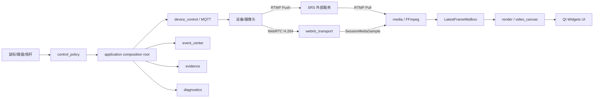
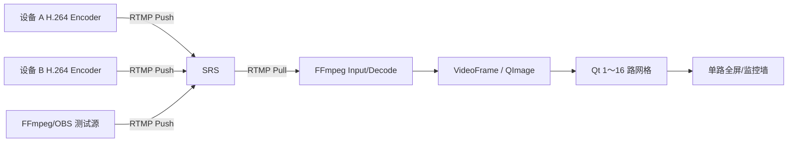
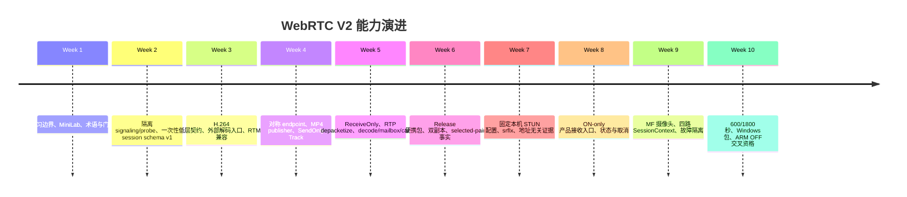
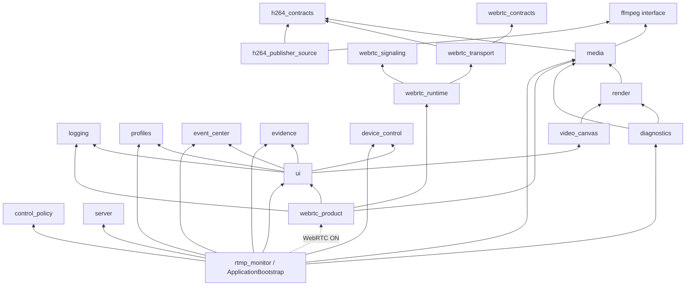
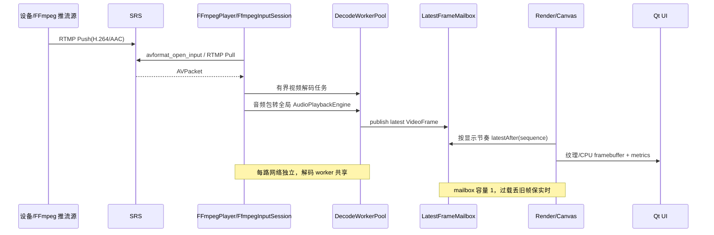
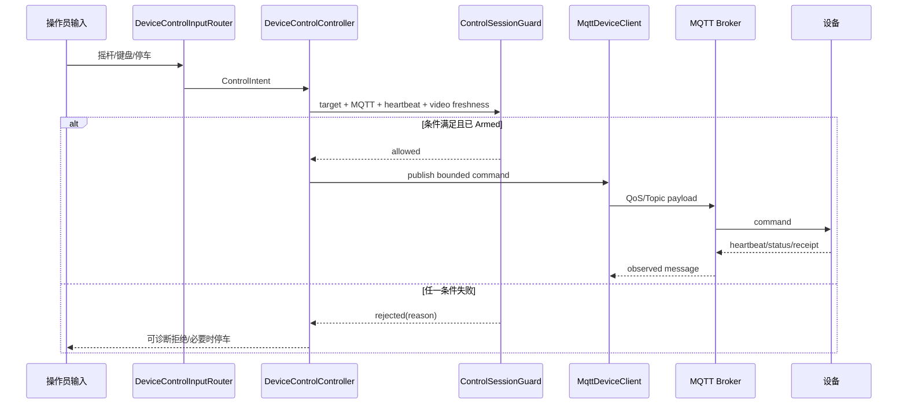
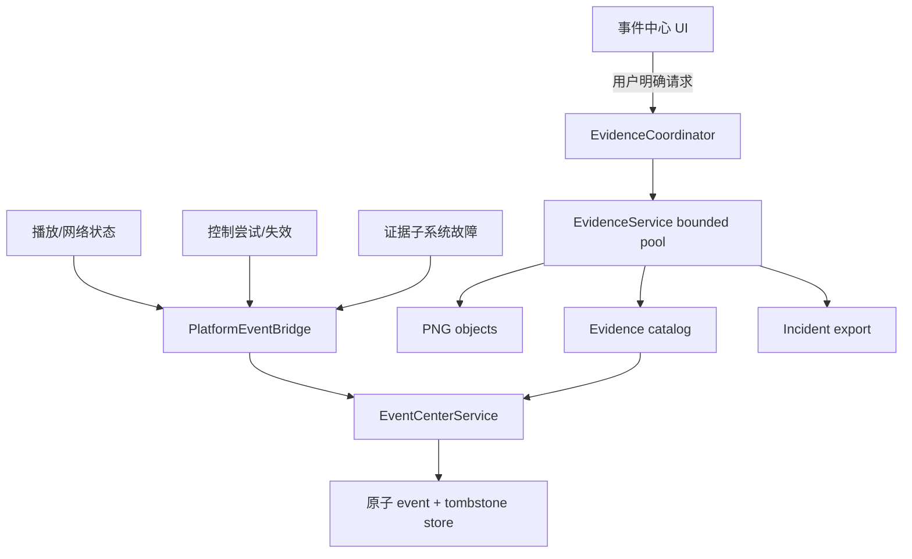
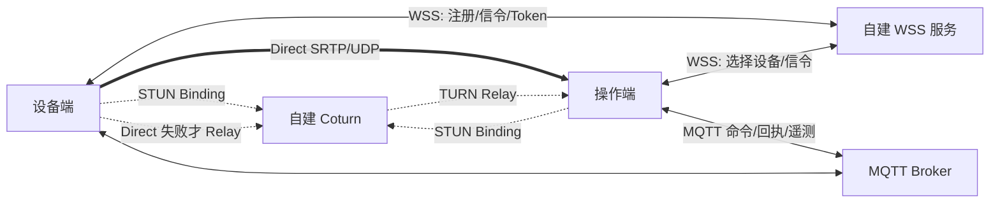

# RtmpMonitor 从零到 WebRTC 产品化前夜：全历程、现状架构与下一规划交接

> 文档用途：交给没有此前对话上下文的 Pro 模型，作为下一阶段产品化规划的单一入口。
>
> 生成基线：2026-08-31，分支 `Beta`，HEAD `12f731b`，可审计 Git 提交 43 个，生成前工作树干净。
>
> 当前源码版本：`0.2.0-beta.1`。当前稳定能力基线仍是 RTMP `0.1.0-alpha.1`；WebRTC 是本地
> qualification candidate，不是正式发布。
>
> 架构影响：R0。本文只汇总事实、决策、测试和产品意图，不修改生产接口、schema、CMake、线程、
> 网络默认值或运行行为。

## 目录

1. [给 Pro 的一分钟结论](#1-给-pro-的一分钟结论)
2. [证据规则、历史边界与状态词典](#2-证据规则历史边界与状态词典)
3. [项目最初要解决什么问题](#3-项目最初要解决什么问题)
4. [从零到 RTMP V1 的阶段演进](#4-从零到-rtmp-v1-的阶段演进)
5. [RTMP 基线之后的工程化和产品模块](#5-rtmp-基线之后的工程化和产品模块)
6. [WebRTC V2 Week 1～10 的完整演进](#6-webrtc-v2-week-110-的完整演进)
7. [当前产品能力地图](#7-当前产品能力地图)
8. [当前构建目标与模块依赖](#8-当前构建目标与模块依赖)
9. [四条核心运行时数据流](#9-四条核心运行时数据流)
10. [线程、所有权、队列与生命周期](#10-线程所有权队列与生命周期)
11. [公共契约、状态与 schema 全表](#11-公共契约状态与-schema-全表)
12. [平台、工具链、外部依赖和发布包](#12-平台工具链外部依赖和发布包)
13. [测试证据、资格边界与发布状态](#13-测试证据资格边界与发布状态)
14. [关键架构决策和已拒绝路线](#14-关键架构决策和已拒绝路线)
15. [当前未解决问题和技术债](#15-当前未解决问题和技术债)
16. [最新产品意图和 P2P 产品化入口](#16-最新产品意图和-p2p-产品化入口)
17. [Pro 模型接管说明和可复制规划提示词](#17-pro-模型接管说明和可复制规划提示词)
18. [附录 A：完整 Git 时间线](#18-附录-a完整-git-时间线)
19. [附录 B：目标、类、schema、ADR 和脚本索引](#19-附录-b目标类schemaadr-和脚本索引)
20. [附录 C：术语与事实追溯](#20-附录-c术语与事实追溯)

---

## 1. 给 Pro 的一分钟结论

RtmpMonitor 最初是一套 Windows x86_64 / Linux ARM64 共用的多路摄像头监控客户端：设备把 H.264
推到 SRS，客户端用 FFmpeg 拉 RTMP、解码、放入有界 mailbox，再由 Qt Widgets/OpenGL 以 0～16 路
网格显示。项目随后增加了断线重连、分层日志、保存流、单向 AAC 音频、MQTT 单车控制、事件中心、
证据截图/导出、SRS 健康监控、Windows 包和 ARM64 双渲染交叉构建。RTMP `0.1.0-alpha.1` 因此仍是
当前唯一稳定产品能力基线。

WebRTC V2 没有推翻媒体和 UI，而是在已有 H.264、解码、mailbox、画布和 StreamId 之上逐步增加：

- 地址无关的一次性 Offer/Answer 会话包；
- 协议无关的 `H264AccessUnit`、`SessionMediaSample` 和提交端口；
- libdatachannel `PeerConnection`、SendOnly/ReceiveOnly H.264 Track、RTP packetization/depacketization；
- 固定 MP4 publisher、Windows Media Foundation 摄像头 publisher；
- 接收端经 `EncodedVideoInputHandle` 复用 FFmpeg 解码和 Qt 画布；
- 最多四个独立 `SessionContext`，每路独占 PC、Track、generation、mailbox、widget 和状态；
- STUN、地址无关 selected-pair 事实、同机双包、故障恢复、长稳和 Windows Beta 候选包。

Week 10 已证明底层软件链不是伪造的：四套 Windows fresh 矩阵通过；单路 600 秒和四路 1,800 秒
真实 PeerConnection→RTP→解码→mailbox→presented 链通过；四路停止和最低 slot 重建通过；Windows
候选包两个全新副本 2/2 闭环；ARM64 RASTER/GLES3 WebRTC OFF 交叉构建通过；当前发送端经用户授权
的中国大陆测试 STUN 连续 5/5 获得 srflx。与此同时，真实 WebRTC 摄像头、物理双机 LAN/公司网络、
TURN、WSS 自动信令、ICE restart、身份授权和 ARM WebRTC/真机都没有完成。因此当前结论是：

```text
RTMP 0.1.0-alpha.1     = 稳定能力基线
WebRTC 0.2.0-beta.1    = 本地软件资格候选
W10-GATE               = blocked(camera_environment,physical_lan_environment)
正式 WebRTC 产品       = 尚未完成
```

用户最新产品决策不是继续优化手工 JSON 搬运，而是直接进入产品化主线：视频使用独立 WebRTC 会话，
Direct P2P 优先，自建 WSS/Coturn，STUN 只帮助发现映射，TURN 仅在 Direct 失败时兜底；MQTT 继续承担
设备命令、回执、状态和遥测。Week 10 手工文件信令只保留为内部回归，不再设计为客户体验。下一规划
应从 `P2P-PROD-01 + P2P-PROD-02` 开始：冻结产品平面与威胁边界，设计 WSS 自动信令、trickle ICE、
短期 Token、撤销和晚回调隔离。不能因为模型能力强而跳过身份、基础设施和真实网络验收。

### 1.1 三种状态不能混写

| 层次 | 当前事实 | 可以声明 | 不能声明 |
| --- | --- | --- | --- |
| 稳定产品能力 | RTMP 多路监控、音频、MQTT 控制等已有实现和历史资格 | RTMP Development Preview 基线 | 已正式大规模商用 |
| WebRTC Beta | 底层真实媒体链、四路隔离、同机长稳和候选包 | 本地 WebRTC 技术基础成立 | 已覆盖物理 LAN/公网/所有 NAT |
| 目标产品 | WSS、STUN/TURN、身份、自动恢复和 MQTT 绑定已确认方向 | 可进入 decision-complete 规划 | 已经实现或已经替代 RTMP |

### 1.2 当前整体结构



图中 RTMP 和 WebRTC 是当前并存的两个视频入口；MQTT 是独立控制面。WebRTC Connected 或出画不
自动授予控制权限，MQTT Connected 也不说明用户已经选择正确设备。

---

## 2. 证据规则、历史边界与状态词典

### 2.1 权威来源顺序

本文严格使用项目协作规则定义的优先级：

```text
实际源代码、运行结果和测试结果
> CMake 及真实配置
> docs/memory 中的已验证事实
> docs/project_handoff.md
> roadmap / version guides
> week 历史记录
> OpenViking 召回
> 当前对话中的未经验证描述
```

这意味着：旧周文档若写“待执行”，而后续源码和 Week 10 结果已明确补齐，则本文采用后续事实，并在
时间线上说明旧状态只对当时有效；反过来，规划文档写“将实现”而源码不存在时，本文不能把规划写成
完成。OpenViking 当前没有可调用检索接口，本文没有用无法复核的记忆填补空白。

### 2.2 Git 历史边界

当前仓库有 43 个提交，最早提交是 2026-08-15 的 `206624a chore: establish sanitized RtmpMonitor
project baseline`。因此：

- 2026-08-15 以后可以用 Git 提交、源码和测试交叉证明；
- 更早的 RTMP Week 1～7、OpenGL、ARM 和 SRS 演进由受跟踪文档、当前源码与后来测试重建；
- 不把“文档重建历史”伪装成缺失的逐提交历史；
- 附录中的完整提交表只覆盖当前可审计 Git 根之后的 43 个提交。

### 2.3 五级证据词典

| 级别 | 含义 | 示例 | 写作规则 |
| --- | --- | --- | --- |
| 已实现 | 源码/CMake 中存在 | WebRTC product target | 不等于运行成功 |
| 已自动验证 | CTest/runner 对行为有断言 | Debug ON 49/49 | 说明配置、平台和范围 |
| 已同机验证 | 同一主机的多个真实进程/PC | 两个包副本闭环 | 不写成物理 LAN 或公网 |
| 已物理环境验证 | 两台设备/真实摄像头/真实网络 | 当前尚缺 WebRTC 双机 | 必须记录环境和人工事实 |
| 已发布 | 有受控制品、版本和正式门禁 | 当前无 WebRTC 正式标签 | 候选包不得称正式发布 |

### 2.4 版本与制品事实

| 对象 | 版本/提交 | 状态 |
| --- | --- | --- |
| 当前分支/HEAD | `Beta` / `12f731b` | 文档实施起点，工作树干净 |
| 当前源码版本 | `0.2.0-beta.1` | CMake 集中定义 |
| RTMP 基线 | `0.1.0-alpha.1` | 当前稳定能力说明 |
| Git 标签 | `v0.1.0-alpha.1-rc1` | 唯一受跟踪标签，不虚构正式 alpha tag |
| Week 10 Windows 包 | source commit `392d9aa` | 53 文件，本地候选包 |
| 后续文档提交 | `578a791`、`cf6feca`、`12f731b` | 资格记录、双机教程、STUN 预检 |

### 2.5 敏感信息边界

本文不保存真实 STUN/WSS/MQTT/RTMP 端点、IP、端口映射、SDP、candidate、ICE 凭据、Token、设备
标识、客户信息或个人绝对路径。Git commit ID 是源码来源标识，可以引用；不生成 SHA-256 或内容哈希。
现场结果只保存类别、计数、耗时和通过/阻塞结论。

---

## 3. 项目最初要解决什么问题

### 3.1 原始产品问题

项目最初面对的是多台摄像头设备的集中监看：设备侧已有或计划提供 H.264 编码，Windows PC 用于开发
和桌面部署，Linux ARM64 盒子用于带显示输出的嵌入式终端。最小闭环不是自研视频协议，而是让成熟
RTMP Server 接收设备推流，RtmpMonitor 负责拉流、解码、显示、状态和交互。

原始分工是：

```text
设备             负责摄像头采集、H.264 编码和 RTMP Push
SRS              负责收流与转发
FFmpeg           负责 RTMP Pull、demux、decode 和像素处理
Qt Widgets       负责窗口、网格、状态、全屏和用户交互
Windows/ARM64    共享业务和媒体代码，只隔离平台/图形差异
```

### 3.2 为什么先选择 RTMP

RTMP 的价值是快速建立一个可观察、可拆分的问题链：可以先用 FFmpeg/ffplay 验证 Server，再接 Qt；
Server、设备推流和客户端拉流任一失败时都有成熟工具排查。项目明确拒绝在 MVP 阶段自研 RTMP Server，
也没有一开始引入硬件解码、零拷贝或复杂 OpenGL。这个选择使 UI、FFmpeg、线程、重连和多路管理先
形成稳定基线，后来 WebRTC 可以复用解码和画布，而不是从空白重写播放器。

### 3.3 原始目标架构



### 3.4 原始非目标

- 不从零实现 RTMP Server；
- 不在第一版承诺 ARM 真机硬件解码；
- 不在 UI 主线程执行网络阻塞或解码；
- 不因“未来可能需要”先创建通用媒体插件框架；
- 不把 Windows 构建成功外推为 Linux ARM 真机通过；
- 不在没有身份和授权设计时把视频连接等同设备控制权限。

---

## 4. 从零到 RTMP V1 的阶段演进

本章的 Week 1～7 主要来自仓库路线和版本文档重建。每段都用“问题→实现→证据→遗留”描述，避免
把早期学习计划和当前实现混为一谈。

### 4.1 Week 1：先让服务器链路可观察

**问题。** 如果 SRS、推流源、URL 和客户端同时开发，任何黑屏都难以定位。

**实现。** 使用成熟 SRS 或等价 RTMP Server；用 FFmpeg 命令模拟设备推流，用 ffplay/VLC 独立拉流。
客户端尚未承担 Server 进程管理，Server 被当作外部服务。

**架构结果。** 设备、Server、客户端成为三个可独立验证的节点；后来的 `rtmp_monitor_server` 也坚持
只读配置、URL 构造和健康观察，不拥有 Server 进程生命周期。

**证据。** 后续 Week 7 SRS 专项用 WSL2 SRS 6.0.184 重新验证了最小链路、健康检查、停推和恢复。

**遗留。** 真实 ARM 部署和最终设备推流仍需要现场环境；早期本地回环不能代表公网或客户网络。

### 4.2 Week 2：Qt 动态网格、拖拽和全屏

**问题。** 在接 FFmpeg 之前，需要先确定 0～16 路布局、交互和窗口生命周期，否则媒体到来后 UI
职责会和播放线程纠缠。

**实现。** 建立 `MainWindow`、`VideoGridWidget`、`VideoWidget`，支持动态增加、居中 16:9 网格、
拖拽换位、单路全屏、动画与交互互斥。网格几何和 scene 构建后来进一步拆为
`MonitoringGridLayout`、`GridTransitionAnimator` 和 `VideoGridSceneBuilder`。

**架构结果。** UI 只展示状态和画面，不直接执行 FFmpeg；StreamId/格子身份和显示顺序分开，给后续
运行期增加/删除流以及 WebRTC tile 奠定基础。

**证据。** 动态网格、拖拽、全屏和 UI smoke 形成独立测试，后续所有 Windows fresh 矩阵持续覆盖。

**遗留。** 早期占位画面没有证明真实媒体；全屏顶层窗口和 OpenGL context 的问题在 Week 6 继续解决。

### 4.3 Week 3：FFmpeg 单路播放和重连

**问题。** RTMP 拉流和 FFmpeg C API 都会阻塞，不能放在 Qt UI 线程；资源释放、退出和重连必须从
第一路就定义清楚。

**实现。** `FFmpegPlayer` 成为一路 RTMP 会话 façade：独立网络线程执行输入和 demux，解码任务交给
worker；状态使用 Connecting/Playing/Reconnecting/Error 等值；停止通过原子标记、中断等待和 join
收敛。解码后的画面通过 `VideoFrame`/mailbox 交给 UI，而不是跨线程操作控件。

**架构结果。** 网络会话、解码和 UI 的边界第一次形成。后来渐进式解耦把单次输入提取为
`FfmpegInputSession`，把解码状态提取为 `EncodedVideoDecodeSession`，但保留 `FFmpegPlayer` façade
以兼容既有调用和重连语义。

**证据。** 单路 RTMP、可中断退出、重连和真实桌面延迟均有历史文档；当前 CTest 仍覆盖 player 生命周期。

**遗留。** 单路私有线程/解码器不能直接扩展为 16 路；RGB 转换和每帧 Qt 投递也不适合长期多路。

### 4.4 Week 4：四路、十六路和有界背压

**问题。** 多路播放不能简单复制完整线程链，否则线程数、解码队列、UI 事件和内存会随路数失控；一路
异常也不能停止其他流。

**实现。** `MultiStreamPlaybackManager` 管理 0～16 路 Entry；每路拥有独立网络会话和 generation，
多个流共享 `DecodeWorkerPool`；压缩包队列和 `LatestFrameMailbox` 有界，mailbox 只保留最新帧；UI
用统一展示节奏消费最新 sequence。支持 add/remove/start/stop/restart 和逐路状态/指标。

**架构结果。** `StreamId` 成为运行期媒体身份；网络、解码和呈现节奏解耦；过载通过丢旧数据保持实时，
而不是无界排队追赶历史画面。这套边界后来直接容纳 WebRTC 外部 H.264 输入。

**证据。** 四路真实播放、0～16 路动态管理、一路失败隔离、共享池和指标有自动/历史性能证据。

**遗留。** ARM 真机能力不能由 Windows 16 路外推；实际推荐路数必须按目标板资格产生。

### 4.5 Week 5：状态、日志、错误和脱敏

**问题。** 多路线程失败如果只输出自由文本，用户和测试无法区分网络、解码、重连和 UI 问题；日志又
可能泄漏 RTMP URL、凭据或设备信息。

**实现。** 增加结构化 `PlaybackError`、状态事件、`LogManager`、`UserMessageService`、日志轮转和
`SensitiveDataSanitizer`；UI 日志面板和用户消息与底层错误对象分离。记录 bounded queue、丢弃、帧率
和延迟，但不让媒体层反向依赖日志 UI。

**架构结果。** 可观测性成为只读旁路，而不是媒体控制逻辑。后续 `RuntimeMetricsReporter` 作为 diagnostics
组合层读取 media/render，二者均不依赖 diagnostics。

**证据。** 日志格式、轮转、溢出、脱敏、用户消息和 UI 面板均有测试；候选包和 WebRTC runner继续执行
敏感输出扫描。

**遗留。** 日志证据不等于产品遥测平台；真实端点、SDP、candidate 和凭据始终禁止进入普通日志。

### 4.6 Week 6：产品级 CPU/OpenGL 渲染与全屏

**问题。** 多路 RGB/QImage 转换和分散 QWidget 绘制会浪费 CPU；OpenGL 又引入 shader、纹理、context
和顶层窗口切换风险。

**实现。** 建立 `render` 低层、`video_canvas` 可复用表面和产品 UI：`VideoRenderController` 持有低频
snapshot 与 mailbox binding，`OpenGLGridRenderer` 上传 YUV420P/NV12 纹理，CPU canvas 保持 fallback；
单主画布负责网格，临时全屏画布只在全屏生命周期存在。颜色矩阵、纹理复用、dirty flag、DWM 边界和
全屏揭幕分别有明确职责。

**架构结果。** `media → render → video_canvas → ui` 形成单向依赖；render 不知道产品 UI；同一 mailbox
可被主画布/临时全屏在受控生命周期内消费。

**证据。** Windows CPU/OpenGL 600 秒对照、像素质量、窗口/全屏 smoke 和退出回归通过；历史 16 路
长稳问题关闭。ARM 端保持 RASTER/GLES3 分离证据。

**遗留。** 零拷贝、PBO、共享 context 和硬件解码没有在缺乏真机数据时提前引入。

### 4.7 Week 7：SRS 外部服务边界

**问题。** 原型阶段会手工启动 SRS，但产品客户端需要知道 endpoint 和健康状态，又不应变成跨平台
进程管理器或把真实公网地址写成默认配置。

**实现。** `rtmp_monitor_server` 提供 `MediaServerConfiguration`、`RtmpUrlBuilder` 和
`MediaServerMonitor`：只读加载本地配置、生成 URL、异步观察健康；部署脚本管理自己启动的 SRS，
客户端不杀未知进程。默认网络功能关闭，示例使用符号占位符/回环。

**架构结果。** Server 是外部基础设施，客户端只持有配置和观察事实。这个原则后来延伸到自建
WSS/Coturn：基础设施可以由用户控制，但不能让 transport 直接依赖 UI 或持久化真实端点。

**证据。** WSL2 SRS 最小配置、健康→异常→恢复、10 分钟保活和 Windows 客户端链路有记录。

**遗留。** ARM 实机 Server、真实摄像头、多机部署和生产鉴权仍是独立环境门禁。

---

## 5. RTMP 基线之后的工程化和产品模块

### 5.1 嵌入式双路径：RASTER、GLES3 与设备分级

项目没有把“ARM64 能编译”写成“目标板能播放”。CMake Preset 使用 Jammy ARM64 sysroot，提供 AUTO、
RASTER、GLES3 三种策略：RASTER 产物不得链接 Qt OpenGL/EGL/GLES；GLES3 必须从 sysroot 获取 EGL/
GLES；EGLFS 等平台由 Linux bootstrap/policy/factory 决定。目标板推荐路数、VPU、温度和硬件解码必须
在真机按阶梯产生，不能由 WSL2/QEMU 或 Windows 数据推断。

### 5.2 Windows 摄像头和 720p30 资格工具

在 WebRTC 摄像头之前，RTMP 线已经建立开发者摄像头源、离线分析器、双行时间戳/源序号标记和
`DisplayFrameRatePolicy`。单路 120 秒诊断曾达到约 30 FPS、源延迟 P95 104 ms且零序号缺口，但
1/4/8 路各 600 秒正式真实摄像头矩阵没有全部完成，因此 ISSUE-012 仍是待验证。

### 5.3 渐进式架构解耦

2026-08-13 前后的解耦不是按文件行数拆类，而是按独立变化原因迁移所有权：

| 阶段 | 迁出职责 | 保留兼容面 |
| --- | --- | --- |
| P0 | 指标写盘、render 指标、单次 FFmpeg input、解码 session | `FFmpegPlayer`/manager façade |
| P1 | connection binding、事件报告、全屏 chrome、截图 I/O | Controller/UI 调用语义 |
| P2 | 网格几何、动画、RenderSnapshot 构建 | VideoGridWidget 协调入口 |
| P3 | CLI 解析、平台 bootstrap、应用组合 | `main()` 只委托 ApplicationBootstrap |

结果不是“层越多越好”，而是底层媒体不感知 UI/控制，跨层装配集中到应用组合根，层依赖由 CMake
脚本扫描并在测试中失败。

### 5.4 保存推流、MQTT 和控制安全

保存流由 `SavedStreamRepository` 管理显示名、RTMP URL 和 auto-connect；MQTT 配置由独立 repository
管理。`MqttDeviceClient` 每实例拥有一个 Paho MQTTAsync session、generation、订阅超时和最多 64
条观察消息 inbox。`DeviceControlController` 在应用层把 UI、播放状态、设备心跳和 MQTT 连接组合；
`ControlSessionGuard` 是纯策略，只在目标存在、MQTT 已连、设备在线、视频 Playing 且最近呈现帧不
陈旧时允许 arm/move。目标切换、心跳超时、MQTT 断开、视频中断、失焦、全屏切换和应用退出均会
失效控制，并在需要时尝试停车。

这个设计确立了后续产品化的硬边界：WebRTC 出画只是一项控制前置事实，不是授权来源；MQTT 是硬件
与软件的控制中间层，不使用 WebRTC DataChannel 替代。

### 5.5 平台事件中心和证据闭环

`EventCenterService` 管理故障观察、恢复、人工事件、确认/解决/关闭和历史状态，原子提交 event 与
tombstone。`EvidenceService` 使用有界线程池异步保存 PNG、维护 catalog、隔离 orphan、关联事件并
导出 incident；最多四个 pending task，默认要求至少 2 GiB 可用空间。应用层通过
`PlatformEventBridge`/`EvidenceCoordinator` 把播放、控制和证据连接，底层模块不反向依赖事件中心。

### 5.6 低延迟单向 AAC 音频

RTMP 视频基线增加可选 AAC-LC 48 kHz 单声道下行。全应用唯一 `AudioPlaybackEngine` 使用专用事件
线程、AAC 解码、libswresample 和 `QAudioSink`，压缩包/PCM 队列有界；用户显式选择唯一音频流，
视频 PTS 只提供有限同步参考。Windows 受控链路完成三轮 320 秒和一轮 600 秒，软件范围 P50≤100 ms、
P95≤150 ms；结果止于 QAudioSink 写入，不是扬声器声学延迟，ARM ALSA 真机仍未验证。

### 5.7 脱敏 Git 基线后的四个产品模块

当前可审计 Git 从 2026-08-15 开始，先补强单车值守闭环：heartbeat-aware device control、guarded
control session、平台事件中心、本地证据和 opt-in SRS DVR receipt PoC；随后增加 Linux ARM64
RASTER 包。它们说明项目从“播放器”转向“低延迟远程值守产品”，但 DVR receipt 仍是 opt-in PoC，
不能视为完整录像服务。

---

## 6. WebRTC V2 Week 1～10 的完整演进

### 6.1 为什么不是一次性替换 RTMP

WebRTC 同时涉及 PeerConnection、ICE、NAT、信令、RTP/SRTP、H.264 packetization、线程、设备采集、
产品 UI 和部署。如果直接把这些塞进 `FFmpegPlayer` 或 `MainWindow`，任何失败都会跨层扩散，也会破坏
已经验证的 RTMP 稳定路径。因此 V2 采用“先隔离学习和契约，再逐步接入真实媒体和产品组合根”的路线；
`RTMP_MONITOR_ENABLE_WEBRTC` 默认 OFF，OFF 构建不得出现 target、菜单、DLL、交换目录或自动联网。



### 6.2 Week 1：先建立可执行学习边界

**问题。** 团队需要理解 PeerConnection、DataChannel、Offer/Answer 和 ICE，但不能拿产品代码做实验。

**实现。** 独立 `webrtc-minilab` 用两个同进程真实 PeerConnection 交换 non-trickle Offer/Answer，经
DataChannel 完成 ping→pong。教程以微步骤、实际构建和错误实验解释 API、回调、generation、幂等
关闭和依赖部署。

**架构结果。** 学习代码与产品 repo target 分离；libdatachannel 版本、MSVC/Qt/CMake 入口和失败分类
得到验证，不把 DataChannel 误用为后续车辆控制通道。

**证据。** MiniLab 14 个检查点、最终 CTest、角色反转、非法参数和敏感输出门禁通过。

**遗留。** 同进程 DataChannel 不证明视频、双机、NAT 或产品 UI。

### 6.3 Week 2：默认 OFF 的信令和 probe

**问题。** 在媒体到来前，先验证可审计的一次性信令文件、角色、时间和清理，但不能改变 RTMP 产品。

**实现。** `SessionPackage` schema v1 只含 schemaVersion、sessionId、role、createdAtUtc、SDP；
`PeerConnectionProbe`/`LoopbackExchange` 创建真实 PC 并在受管交换根读写包。严格文件名、大小、时间窗、
唯一角色和 atomic write，日志不输出 SDP/candidate。

**架构结果。** `webrtc_dev` 被层门禁禁止依赖 app/media/render/ui；WebRTC OFF 时这些目标不存在。

**证据。** session codec、角色、清理、loopback 和 OFF 静态门禁通过。

**遗留。** 文件信令是确定性研发工具，不是产品 WSS；schema v1 冻结，不扩展身份和长期档案。

### 6.4 Week 3：协议无关 H.264 契约和外部解码入口

**问题。** WebRTC transport 不应依赖 FFmpeg media，media 也不应依赖 WebRTC；二者需要最窄交界。

**实现。** 增加 header-only `rtmp_monitor_h264_contracts`：`H264AccessUnit` 表达 Annex-B、时间戳、
keyframe；`SessionMediaSample`/submit result 表达接收样本和有界提交结果。media 增加
`EncodedVideoInputHandle` 与 `EncodedVideoDecodeSession`，外部压缩 H.264 可进入既有解码池/mailbox。

**架构结果。** transport、publisher、media 成为兄弟模块，只共同依赖 H.264 契约；没有创建通用
`MediaSource`、`MediaTransportMode`、RTMP/WebRTC 基类或 schema v2。

**证据。** 空/超大 AU、Annex-B、SPS/PPS/IDR、generation、外部解码和 RTMP façade 特征测试通过。

**遗留。** 只有契约和 decode ingress，没有 WebRTC Track/media transfer。

### 6.5 Week 4：真实 SendOnly publisher

**问题。** 需要把本地 H.264 真实放进 WebRTC Track，同时保持 source 与 transport 相互独立。

**实现。** `WebRtcEndpointSession` 拥有一个 PeerConnection、一个视频 Track、endpoint generation、
有界 sender；Offerer/Answerer 与 SendOnly/ReceiveOnly 正交。`Mp4H264PublisherSource` 用 FFmpeg demux
H.264 MP4，经 `h264_mp4toannexb`、时间戳归零和 pacing 输出 AU；测试 peer 接收 RTP。

**架构结果。** endpoint 只暴露 `H264SubmitPort`，不知道 MP4/camera；source 只依赖 H.264 契约，
不知道 PeerConnection。测试 client 作为组合根装配两者。

**证据。** publisher 作为 Offerer/Answerer 都发送真实 Track；首个恢复 AU 含 SPS/PPS/IDR；容量、
generation、关闭、CLI、DLL 和交换文件归零通过。Debug OFF/ON 当时为 39/39、43/43。

**遗留。** 尚无产品 viewer；接收只用于测试 peer。

### 6.6 Week 5：ReceiveOnly 到现有画布的完整闭环

**问题。** 接收端必须证明 RTP 不是停在网络计数，而是真正解码和呈现；transport 又不能链接 media/UI。

**实现。** ReceiveOnly Track 使用 libdatachannel H.264 depacketizer 和 RTCP receiving session；私有
receive pipeline 在 endpoint generation 内执行 Annex-B、SPS/PPS/IDR 恢复、RTP 时间戳展开、4 MiB
上限和容量丢弃。唯一跨层连接位于 `rtmp_monitor_webrtc_client`：sink→`EncodedVideoInputHandle`→
FFmpeg decoder→capacity-1 mailbox→`CpuVideoCanvas`。画布被提取为窄 `video_canvas` target，客户端
不链接完整产品 UI。

**架构结果。** 同一个 client 支持 publisher/viewer 和 offer/answer 正交组合；viewer 禁止 source。

**证据。** 两种双客户端拓扑均产生 RTP/AU/submitted/decoded/presented/nonBlack；Qt plugin、递归
重绘和缺样本前置校验问题修复。OFF/ON 当时为 39/39、44/44。

**遗留。** 仍是开发客户端，不是正式主程序菜单；没有便携包和双机流程。

### 6.7 Week 6：Release 便携包和双实例设计门禁

**问题。** 开发目录成功不能证明脱离 Qt/vcpkg/PATH 后可运行；双机还需要明确交换根和制品边界。

**实现。** `WebRtcClientRuntimePaths` 通过 exe 同级 manifest 识别 portable layout，固定
`session-exchange` 和 `webrtc-assets/sample.mp4`；连接结果只暴露 candidate type/transport，不暴露
地址。Release ZIP 含实际 DLL、Qt plugin、样本、许可、manifest 和 runner。

**架构结果。** portable marker 优先于仓库发现；包内状态与 handoff/inbox/outbox 分离；客户端没有
任意 path CLI。

**证据。** fresh OFF/ON 39/39、45/45；最终 ZIP 两个独立副本、两种拓扑各 10/10，合计 20/20；
用户接受其作为设计门禁，但明确 `sameMachinePortable=true`、`lanClaimed=false`。

**遗留。** 物理双机 LAN 延期；同机 selected pair 不证明真实网卡和防火墙。

### 6.8 Week 7：受限 STUN 与地址无关 ICE 事实

**问题。** 跨网络 Direct 需要 srflx，但真实 STUN URL 不能进入 CLI、Git、ZIP、日志或截图。

**实现。** `--ice-mode host|stun` 只选择模式；stun 从固定 package-local/repo-local
`ice-runtime.json` schema v1 读取一个无凭据 URL，4 KiB 上限且不接受 TURN、任意路径或热更新。
测试专用 libjuice fixture 仅回环；endpoint 输出 ICE state、candidate types、selected pair types 和
UDP/TCP，不输出地址/端口。

**架构结果。** STUN 是连接面辅助，不承载视频；配置是本机运行态，不属于 profiles/session schema。

**证据。** OFF 39/39、ON 46/46；两个包副本两种拓扑各 10/10，srflx observed、媒体六层证据通过；
真实公网延期。后续当前发送端经明确授权的中国大陆测试 STUN 5/5 获得 host+srflx，候选收集全部
低于 1 秒；该数据不是视频 RTT/带宽。

**遗留。** 没有 TURN；公司电脑和移动网络实际 Direct 未完成。

### 6.9 Week 8：正式主程序的一次性产品接收

**问题。** 开发 client 成功后，主程序需要一次性 ReceiveOnly UI，但不能把 PeerConnection 塞进
MainWindow、profiles 或 media。

**实现。** `WebRtcReceiveSession` 拥有 endpoint、worker、受管文件交换、取消和终态快照；
`WebRtcProductSessionController` 是唯一允许组合 runtime、external media ingress、mailbox 和
`VideoWidget` 的产品层。ON 构建主菜单出现入口，OFF 完全没有。`Direct` 需要 Connected、non-relay
selected pair、有效 stream、实际 presented frame 且年龄≤1,000 ms；媒体陈旧进入 Error，新 IDR
呈现后恢复。`NeedsRelay` 仅在 ICE Failed+srflx 事实成立时出现。

**架构结果。** 产品请求是一次性运行值，不进入 SavedStream schema；`controlAuthorized=false`、
`rtmpFallbackStarted=false` 是明确证据。

**证据。** fresh OFF 39/39、Debug/Release ON 47/47；真实两个 PC 覆盖 receiver Answerer/Offerer、
RTP→decode→mailbox→canvas、Direct、过期/恢复、取消和 cleanup。

**遗留。** 用户仍需文件信令；没有自动身份、WSS、TURN 和真实物理网络。

### 6.10 Week 9：MF 摄像头和四路产品 SessionContext

**问题。** 产品需要实时摄像头 source 和最多四路独立设备会话；不能复制四套全局状态或增加无界帧队列。

**实现。** `CameraH264PublisherSource` 位于 publisher target。Windows Media Foundation 固定
1280×720@30：实际 AU 合规时原生 H.264 直通；否则重开 NV12，只有合成 NV12 经 `h264_mf` 实际
encode+decode 预检成功才使用；无外部 ffmpeg/x264/NVENC/AMF/QSV 矩阵。一个 capture/encode worker，
无用户态帧队列，停止按 generation 失效→Flush/Shutdown→锁外 join→释放资源。

产品 controller 改为 StreamId→`SessionContext` map，最多四项；session-01～04 与最低空闲 slot
对应。每路独占 token、widget、input handle、receive runtime、mailbox、状态和 freshness；第五路
`capacity_reached`；单路 cancel/远端关闭/重建不停止另外三路。

**架构结果。** endpoint generation、product token、media generation 三个概念保持分离；无参 API
兼容单路/汇总语义。

**证据。** Debug OFF 39/39，Debug/Release ON 48/48；四组真实同机 PC、第五路拒绝、远端关闭一路、
其余三路增长、取消/重建、signal 重入和摄像头组件 seam 通过。

**遗留。** 自动测试未枚举/打开物理摄像头；W9-GATE 仍 blocked(camera_environment)。

### 6.11 Week 10：代表负载、候选包和诚实 Beta 边界

**问题。** Week 9 短 fixture 不能证明 720p30 四路 30 分钟资源趋势；Beta 还需要四矩阵、包和 ARM
交叉结论。

**实现。** BUILD_TESTING+WebRTC ON 的 qualification runner 读取一轮 180 个不可变 AU，只重建
33,333 µs 时间戳；一个 pacing worker 向一或四个既有 H264SubmitPort 提交。media 统计 additive
增加内部延迟 P50/max；PowerShell 父进程采集进程 CPU/工作集；共享 renderer 指标不伪装逐路值。

**证据。** Debug/Release OFF 39/39，Debug/Release ON 49/49；单路 600 秒、四路 1,800 秒；工作集
斜率 0.176/0.134 MiB/min；四路第 600 秒停一路、第 720 秒重建，约 2 秒 Direct；transport queue 0、
decode 峰值 1 包；53 文件 Windows 包两个干净副本和两次角色闭环通过；ARM64 RASTER/GLES3 OFF
交叉构建通过。

**边界。** `sameMachineSoftwareQualified=true`，但 camera/physical LAN/global performance/release
均 false；没有正式 `v0.2.0-beta.1` 标签。手工文件流程后来被用户明确降级为内部回归，不再作为
产品体验。

---

## 7. 当前产品能力地图

| 能力 | 主要入口/模块 | 当前等级 | 已有证据 | 仍缺什么 |
| --- | --- | --- | --- | --- |
| RTMP 0～16 路 | media/app/ui | 稳定基线 | 多路、重连、长稳、UI | 新机器现场复验 |
| CPU/OpenGL 渲染 | render/video_canvas | 稳定基线 | 像素、600 秒、全屏 | ARM GPU 真机 |
| 单向 AAC 音频 | AudioPlaybackEngine | 稳定软件能力 | 600 秒软件延迟 | 声学/ARM ALSA |
| 保存流/自动连接 | profiles/app | 稳定基线 | repository/UI 测试 | 身份化设备档案另设计 |
| MQTT 单车控制 | device_control/control_policy/app | 已实现并自动验证 | heartbeat、guard、输入、Fake Broker | 实车安全/多设备身份 |
| 事件中心 | event_center/app/ui | 已实现 | 状态机、迁移、UI | 现场事件流程 |
| 证据截图/导出 | evidence/app/ui | 已实现 | bounded I/O、catalog、package | 客户保留策略 |
| SRS 健康观察 | server/app | 稳定辅助能力 | WSL2 SRS、恢复 | 正式部署/鉴权 |
| ARM64 交叉构建 | platform/cmake | Engineering Preview | RASTER/GLES3 ELF | 真机/QPA/VPU |
| WebRTC MP4 P2P | publisher/transport/client | Beta 技术能力 | 双角色、包、长稳 | 自动信令/真实双机 |
| WebRTC 摄像头 | publisher | 生产代码+组件证据 | MF policy/seam/h264_mf | 物理 camera 120 秒 |
| WebRTC 四路产品接收 | product/runtime/media/ui | Beta 技术能力 | 四个真实同机 PC、恢复 | 四台物理设备 |
| STUN Direct 辅助 | client/transport | 测试能力 | fixture + 当前发送端 5/5 | 公司端、实际 Direct |
| WSS/trickle ICE | 尚无 | 未实现 | 只有规划 | 产品协议、服务和测试 |
| TURN Relay | 尚无 | 未实现 | NeedsRelay 状态语义 | 自建 Coturn、凭据、forced relay |
| WebRTC/MQTT 身份绑定 | 尚无统一 DeviceSession | 未实现 | 控制 guard 已独立 | 用户/设备/Token 权威源 |

### 7.1 用户今天实际能做什么

在 RTMP 路线上，用户能保存 RTMP URL、自动连接、多路查看、全屏、选择单路音频、观察状态/日志，
并在控制条件满足时通过 MQTT 操作单个目标。WebRTC 路线上，开发者能用候选 client 或 ON-only 主程序
建立真实 H.264 会话，但仍需要一次性文件交换和本机 ICE 配置；这一步不再被视为最终用户功能。

### 7.2 当前不能承诺什么

- 不能承诺任意企业网络都能 Direct；没有 TURN。
- 不能承诺真实摄像头已资格；组件测试不能替代物理采集。
- 不能承诺 ARM WebRTC；当前 ARM sysroot没有已资格 libdatachannel。
- 不能承诺视频连接自动授权 MQTT 控制。
- 不能承诺 RTMP 已被移除或 WebRTC 已成为默认入口。

---

## 8. 当前构建目标与模块依赖

### 8.1 CMake 目标图



箭头表示“上层 target 链接/依赖下层 target”。`webrtc_transport`、publisher 和 media 没有彼此链接；
它们通过 H.264 契约在组合根协作。层门禁同时扫描 include，阻止源码绕过 CMake 目标关系。

### 8.2 模块职责表

| 模块/目标 | 拥有什么 | 明确不拥有什么 |
| --- | --- | --- |
| logging | 配置、轮转、脱敏、用户消息 | media/UI 控制 |
| profiles | SavedStream schema v1 与原子存储 | Peer/ICE/Token |
| server | SRS 配置、URL、健康观察 | Server 进程管理 |
| device_control | MQTT session、codec、heartbeat、settings | UI、视频、控制授权策略 |
| control_policy | owner-thread 控制状态机 | MQTT 网络和 UI |
| event_center | event/tombstone 状态机和 store | 视频/控制底层 |
| evidence | PNG/catalog/export/线程池 | 事件业务决定 |
| media | RTMP façade、input/decode、worker、mailbox、音频 | render/UI/WebRTC session |
| render | snapshot、dirty、YUV uploader、指标 | 产品窗口和设备控制 |
| diagnostics | 组合 media/render 只读指标 | 反向控制二者 |
| video_canvas | CPU/OpenGL QWidget 表面 | profiles/控制/WebRTC transport |
| ui | 窗口、网格、全屏、面板 | 网络阻塞、PeerConnection 生命周期 |
| webrtc_signaling | 一次性包 codec/store | WSS、产品身份 |
| webrtc_transport | PC/Track/ICE/RTP/generation | source、FFmpeg、UI |
| publisher | MP4/MF capture、Annex-B、pacing | PeerConnection、产品 UI |
| webrtc_runtime | 一路 receive endpoint、worker、交换和取消 | media/UI/product |
| webrtc_product | runtime/media/UI 的会话组合 | MQTT 控制授权 |
| ApplicationBootstrap | 全程序创建、接线、退出顺序 | 领域算法实现 |

### 8.3 应用组合根

`main()` 只调用 `ApplicationBootstrap::run()`。Bootstrap 负责平台 surface/QPA、QApplication、版本、
CLI、样式、日志、MainWindow、playback manager、profiles、SRS monitor、MQTT、控制 controller、事件、
证据和可选 WebRTC product controller 的创建与信号接线。退出时由外向内停止：先拒绝新操作和取消
WebRTC/控制，再停止 playback/audio/evidence，销毁 UI，最后一次性执行全局 WebRTC cleanup。

---

## 9. 四条核心运行时数据流

### 9.1 RTMP 视频流



输入断开时当前 session generation 失效，晚包/旧回调不能进入新会话；manager 调度重连而不是 UI 线程
阻塞等待。音频只允许一个选中 StreamId，视频多路不意味着多路同时出声。

### 9.2 WebRTC H.264 流

```mermaid
flowchart LR
    Camera[MF Camera source] --> AU[H264AccessUnit Annex-B]
    MP4[MP4 publisher source] --> AU
    AU --> Port[H264SubmitPort]
    Port --> Send[SendOnly Track / RTP packetizer]
    Send == SRTP/UDP ==> Recv[ReceiveOnly Track / depacketizer]
    Recv --> Pipe[H264ReceivePipeline]
    Pipe --> Sample[SessionMediaSample]
    Sample --> Input[EncodedVideoInputHandle]
    Input --> Decode[EncodedVideoDecodeSession]
    Decode --> Mailbox[LatestFrameMailbox capacity 1]
    Mailbox --> Canvas[CPU/OpenGL canvas]
    Canvas --> Presented[presented frame / Direct freshness]
```



恢复语义在两侧一致：发送端保持 AU 上限、SPS/PPS/IDR；接收端在 generation 切换、畸形、超限或容量
丢弃后等待新的可恢复 IDR。`connected` 只证明 ICE/DTLS 连接；只有媒体一路走到 presented 且新鲜，
产品状态才可能是 Direct。

### 9.3 MQTT 控制流



视频只提供“目标当前可见且帧新鲜”事实；身份和授权必须由应用/未来服务端提供。切换 tile 不得静默
切换 MQTT 控制目标。

### 9.4 事件与证据流



截图/导出是用户或明确策略触发的证据操作，不是每帧保存；媒体帧、裸 H.264、SDP/candidate 不进入
事件 store。证据失败也不能破坏播放和控制底层。

---

## 10. 线程、所有权、队列与生命周期

### 10.1 线程/执行上下文全表

| 执行上下文 | 主要对象 | 所有者 | 允许做什么 | 禁止做什么 |
| --- | --- | --- | --- | --- |
| Qt UI 主线程 | Bootstrap、MainWindow、controllers、UI | QApplication | 创建/销毁 QObject、处理用户操作 | 阻塞 RTMP、join 长线程、解码 |
| 每路 RTMP 网络线程 | FFmpegPlayer/FfmpegInputSession | 对应 player/Entry | open/read/demux、投递压缩包 | 操作 QWidget、跨路共享 codec context |
| 固定解码 worker | DecodeWorkerPool Worker | MultiStreamPlaybackManager | 按 stable key 串行使用一路 decoder | 无界任务、处理网络阻塞 |
| 音频事件线程 | AudioPlaybackEngine | manager 全局唯一 | AAC decode/resample/QAudioSink | 同时播放多路未选音频 |
| OpenGL GUI/context | VideoOpenGLCanvas | canvas/widget | 纹理、shader、paintGL | 在 decoder 线程调用 GL |
| WebRTC runtime worker | WebRtcReceiveSession | 对应 SessionContext | PC、文件信令等待、终态快照 | 直接创建 UI/media object |
| libdatachannel 内部回调 | WebRtcEndpointSession Impl | libdatachannel/endpoint | RTP/ICE 回调和有界入队 | 捕获已销毁产品对象 |
| camera capture/encode worker | CameraH264PublisherSource | source | MF read、预检、Annex-B/submit | 用户态无界帧队列 |
| evidence QThreadPool | EvidenceService | service | bounded PNG/catalog/export task | 修改播放/控制底层 |
| Paho MQTT 回调线程 | MqttDeviceClient callbacks | MQTTAsync | 复制有界 observed message | 直接操作 UI/owner state |

### 10.2 稳定 key 与 worker 归属

`DecodeWorkerPool` 不让同一路 AVCodecContext 在多个线程并行使用。manager 用稳定 key 选择 worker，
一路任务在同一 worker 串行，多个流可分布到不同 worker。worker pool 自身任务 deque 的增长受上游
`EncodedVideoDecodeSession` 包队列门槛约束；网络线程先检查 maximumQueuedPackets/Bytes，再投递。

### 10.3 有界资源表

| 资源 | 当前边界 | 过载策略/原因 |
| --- | ---: | --- |
| 视频 decode queue | 默认 45 包、4 MiB | 拒绝/丢弃并等待恢复，不积压历史实时画面 |
| LatestFrameMailbox | 容量 1 | 新帧覆盖旧帧，renderer 只取最新 sequence |
| H.264 AU | 最大 4 MiB | 超限判无效，不进入 RTP/decode |
| Week 10 transport queue | 资格要求≤2 | 发送背压必须快速暴露 |
| MQTT observed payload | 最大 4 KiB | 超限不进入 owner inbox |
| MQTT observed inbox | 最大 64 条 | 计数丢弃，避免回调洪泛 UI |
| Evidence pending task | 最大 4 | 超限记录拒绝尝试，不阻塞媒体 |
| Saved profiles | 最大 16 | 与 UI 多路上限一致 |
| WebRTC product sessions | 最大 4 | 第五路稳定 `capacity_reached`，无副作用 |

“有界”不是安全装饰，而是低延迟产品语义：实时系统宁可丢旧帧，也不能因为追赶历史数据而持续增加
内存和延迟。丢弃后必须通过新 keyframe/generation 恢复，而不是把残缺 GOP 送入 decoder。

### 10.4 StreamId 与三类 generation

- `StreamId`：应用运行期视频身份，0 是 invalid；UI tile、mailbox、媒体指标和控制观察用它关联。
- endpoint generation：一个 PeerConnection/Track 的网络代次；关闭后旧 RTP/submit port 必须失效。
- media generation：`EncodedVideoInputHandle`/decode session 的输入代次；旧样本不能进入新 decoder。
- product token：controller 对 SessionContext 生命周期和晚 signal 的身份；取消后旧事件不能改变新会话。

三者的失效时机不同，不能为了“统一”合成一个全局计数。四路中某一路重建只改变本路三类值，其他路
的诊断 timer、decode pool、mailbox 和 widget 必须继续运行。

### 10.5 RTMP 单路启动和停止

启动顺序：应用/manager 创建 Entry→创建或复用 decode worker→创建 player/network thread→open input→
发现 codec→创建当前 session id→读 packet→有界提交→decode→mailbox→UI observing Playing。

停止顺序：manager 标记本路 stop/session 失效→唤醒重连等待→中断/收敛输入→不再接受旧 packet→
网络线程退出→decoder session drain/close→clear mailbox→join/释放。UI 只发起动作，不在持锁状态等待
线程；重复 stop 安全。

### 10.6 WebRTC 单路生命周期

```text
Product start(request)
  → 分配最低空闲 slot / StreamId / token
  → createEncodedVideoInput() 产生 media generation
  → 创建 mailbox + VideoWidget
  → 创建 WebRtcReceiveSession worker
  → endpoint gather/connect
  → H264 receive sink 提交当前 generation
  → decoded/presented 后状态 Direct
```

取消顺序固定为：先失效 product token 并从 active route detach；`requestStop()` 让 endpoint beginClose；
锁外 join runtime；关闭 input handle；remove media stream；remove/retry widget；erase context。应用最终退出
且所有 session 停止后才调用一次 `rtc::Cleanup()`。

### 10.7 四路批量取消

`cancel()` 表示全部取消，但不会逐路串行“停完一条再通知下一条”。controller 先对全部 runtime 请求
停止，阻止重入和新 start，再统一 join/释放。这样一路阻塞不会让其他 PC 继续产生晚回调。单路
`cancel(StreamId)` 只 detach 目标 context；其余三路继续呈现。

### 10.8 摄像头停止

source stop 先设置 closing 和 generation 失效，再用 MF Flush/Shutdown 打断可能阻塞的读取，唤醒
waiter，锁外 join 唯一 worker，最后释放 MF/FFmpeg。部分启动失败也走同一收尾；重复 stop 不重复释放。

### 10.9 晚回调和错误恢复

- Qt queued signal 到达时按 StreamId+token 重新查 context；不存在则丢弃。
- transport submit port 捕获 endpoint generation；旧 port 返回 InvalidGeneration/Closed。
- decoder 输入捕获 media generation；旧 sample 返回拒绝，不污染新帧。
- mailbox clear 同时清新鲜度；旧 presented 时间不能让新会话误判 Direct。
- RTP 丢包/畸形/容量 drop 后 waitingForKeyframe，只有新 SPS/PPS/IDR 恢复。
- UI 动画期 widget 暂不能删除时放入最多四项 pending retry，不泄漏无界对象。

---

## 11. 公共契约、状态与 schema 全表

### 11.1 媒体公共契约

| 类型 | 语义 | 所有权/边界 |
| --- | --- | --- |
| `StreamId` | 运行期流身份，`0` 无效 | 不等于设备持久身份 |
| `VideoFrame` | 解码后图像、sequence、媒体时间、generation | 值对象/共享像素资源 |
| `LatestFrameMailbox` | capacity-one latest-frame-wins | decoder 提交，renderer 消费 |
| `StreamMetrics` | 逐路可归属累计/速率/延迟 | 只读快照，不持有媒体资源 |
| `EncodedVideoInputHandle` | 外部压缩 H.264 的弱输入端口 | close 后旧 generation 拒绝 |
| `H264AccessUnit` | Annex-B、µs 媒体时间戳、keyframe | 无 transport/session/墙钟身份 |
| `SessionMediaSample` | generation + H264 AU | transport→media 的窄 envelope |
| `H264SubmitResult` | accepted/drop/closed/invalid 等 | 显式背压结果，不抛模糊异常 |

`H264AccessUnit` 只校验非空、Annex-B start code、非负媒体时间和调用方大小上限；SPS/PPS、slice、
profile、B frame 等 codec 级判断由 source/decoder/receive pipeline 各自负责。

### 11.2 播放和音频状态

`DeviceStatus` 为 Disconnected、Connecting、Playing、Reconnecting、Error。`PlaybackErrorCode` 区分
配置、timeout、host、auth、media、resource、decode、retry limit 等；recoverable 是显式字段。

`AudioPlaybackState` 为 Unavailable、Buffering、Playing、Muted、OutputError。音频 metrics 记录 packet、
drop、underrun、队列、PCM 缓冲、sink buffer 和软件输出延迟 P50/P95；不能称声学端到端延迟。

### 11.3 WebRTC endpoint 契约

`WebRtcSessionConfig` 只含 SignalingRole、VideoDirection 和运行期 ICE；Offerer/Answerer 不决定媒体
方向，第一阶段只允许 SendOnly/ReceiveOnly。`WebRtcEndpointSession` 拥有一个 PC/Track/generation，
提供 createOffer、acceptOfferAndCreateAnswer、acceptAnswerAndWait、waitConnected、createSendPort、
setReceiveSink、snapshot、beginClose/close。

`EndpointConnectionResult` 只公开 error、candidate types、地址无关 selected pair 类型/transport 和
ICE state。普通产品日志不得获得 SDP、candidate 字符串、IP、端口或凭据。

### 11.4 WebRTC 产品契约

`WebRtcSessionRequest` 目前只有 displayName、signaling role、runtime ICE。它刻意没有 device/peer
identity、file path、RTMP URL、saved profile、auto-connect。`WebRtcProductState` 为 Idle、Connecting、
Direct、NeedsRelay、Error；事件为 started/exported/direct/media interrupted/recovered/needs relay/
failed/cancelled。

`WebRtcProductDiagnostics` 合并 transport snapshot、media metrics、presented age、non-relay 事实、
StreamId 和 media generation；`controlAuthorized` 与 `rtmpFallbackStarted` 当前固定 false。无参
diagnostics 在单路时返回该路，多路时只给汇总状态/invalid StreamId，不伪造逐路计数求和。

### 11.5 控制契约

`ControlSessionState` 为 Locked、Armed、Moving、Suspended；每个意图经 `ControlContext` 判定目标、MQTT、
heartbeat、视频 Playing 和≤1,000 ms 帧新鲜度。拒绝原因是可枚举值，不靠 UI 文本反向解析。

产品化以后可以增加可信的设备/用户授权事实，但不能把它塞进 `WebRtcSessionConfig` 或让 MQTT client
直接判断 UI tile；应用组合层/未来 DeviceSession 负责关联。

### 11.6 schema 命名空间全表

| schema | 当前版本 | 代码权威 | 兼容/迁移 |
| --- | ---: | --- | --- |
| SavedStream profiles | 1 | `SavedStreamRepository::kSchemaVersion` | 仅 v1，最多 16；不含 WebRTC |
| MQTT settings | 2 | `MqttSettingsRepository::kSchemaVersion` | 可读 v1/v2，保存 v2 |
| Event center | 2 | `EventCenterStore::kSchemaVersion` | 可读 v1/v2，保存 v2 |
| Evidence catalog | 1 | `EvidenceCatalogStore::kSchemaVersion` | 高版本写阻塞 |
| Runtime metrics | 4 | `RuntimeMetricsReporter` | 诊断输出，非持久产品配置 |
| WebRTC session package | 1 | `kSessionSchemaVersion` | 严格一次性，拒绝 v2 |
| WebRTC ICE local config | 1 | `WebRtcIceRuntimeConfigLoader` | 只含 schemaVersion/stunUrl |
| Logging JSONL/summary | 1 | `LogManager` | 日志格式，不等于其他 v1 |
| Camera/audio/qualification reports | 1 | 对应 tool/script | 测试报告，各自独立 |

“schema v1”在多个命名空间重复出现，不代表它们是同一个 schema。下一规划若需要用户、设备、WSS
session、TURN 凭据或长期 WebRTC profile，必须定义新的权威来源和迁移；不能随手向 SavedStream v1
或一次性 SessionPackage v1 加字段。

---

## 12. 平台、工具链、外部依赖和发布包

### 12.1 Windows x64

| 项目 | 当前事实 |
| --- | --- |
| 开发/验证系统 | Windows 11 x64 |
| 编译器 | Visual Studio Community 2026 / MSVC 19.51 系列 |
| 语言 | C++17，关闭语言扩展 |
| Qt | 6.6.1 MSVC x64，Widgets/Gui/Network/Multimedia/OpenGL |
| FFmpeg | vcpkg 动态库：avformat/avcodec/avutil/swscale/swresample |
| MQTT | Eclipse Paho MQTT C，异步 non-TLS client API |
| WebRTC | libdatachannel 0.24.5，libjuice、SRTP、OpenSSL runtime |
| 摄像头 | Windows Media Foundation，链接 mf/mfplat/mfreadwrite/mfuuid/ole32 |
| 构建 | CMake + Ninja/VS Preset，vcpkg x64-windows |

Windows 包必须携带匹配的 Qt/FFmpeg/WebRTC/Paho runtime 和许可证，不依赖开发机 PATH。历史出现的
qExec/qTerminate 入口点、Qt platform plugin 和 GUI `--version` 异步问题都属于运行时/脚本缺陷，
已经修复；Pro 不应重新用“重装 Qt”作为默认方案。

### 12.2 Linux ARM64

CMake 只支持 Windows x86_64 MSVC 和 Linux ARM64 GCC/Clang。ARM preset 使用 Ubuntu Jammy sysroot：

- AUTO：按可用依赖决定；
- RASTER：不查找/链接 Qt OpenGL、EGL、GLES；
- GLES3：需要 sysroot 内 Qt OpenGL/OpenGLWidgets、EGL、GLES3；
- LinuxApplicationBootstrap/RenderingPolicy/RendererFactory 隔离 QPA 和图形选择。

Week 10 的 ARM 结论只到 AArch64 ELF 和动态依赖；当前 sysroot 无已资格 libdatachannel，因此 WebRTC
固定 OFF。没有 ARM 真机、V4L2、ALSA、EGLFS、温度、VPU 或四路性能结论。

### 12.3 外部服务的边界

| 服务 | 当前是否存在产品集成 | 作用 | 是否承载视频 |
| --- | --- | --- | --- |
| SRS | RTMP 外部服务+只读 monitor | RTMP 收流/转发 | 是，RTMP 路线 |
| MQTT Broker | client 已集成 | 命令、回执、心跳、状态 | 否 |
| STUN | client 测试配置 | 公网映射发现 | 否 |
| TURN/Coturn | 未接入产品 | Direct 失败时媒体 relay | 仅 fallback 时是 |
| WSS signaling | 未实现 | 身份化会话、Offer/Answer、trickle ICE | 否 |

用户计划自行控制公网服务器并部署 WSS/Coturn。STUN/TURN 和 WSS 可以初期同机不同进程，但正式
设计仍需明确 TLS、端口、凭据、监控和故障边界。本文不保存真实 endpoint。

### 12.4 WebRTC ON/OFF

- OFF：不寻找 libdatachannel，不构建 signaling/transport/publisher/runtime/product/client/test，不
  显示产品菜单，不复制 WebRTC DLL，不创建交换目录，不自动联网。
- ON：显式依赖准确的 libdatachannel 0.24.5，构建相关目标；主程序链接 product；测试/工具按范围
  复制运行库。
- OFF 是产品兼容和发布门禁，不是仅“宏隐藏 UI”。任何 WebRTC 二进制/启动副作用出现都算失败。

### 12.5 Week 10 Windows 候选包

候选包版本 `0.2.0-beta.1`，源码 commit `392d9aa`，共 53 个文件，包括主程序、publisher/viewer
测试 client、固定 sample、qwindows/qoffscreen、Qt/FFmpeg/Paho/datachannel/juice/SRTP/OpenSSL DLL
及许可。manifest 只记录 version、sourceCommit、相对路径和大小，无内容哈希。包不含 PDB/LIB/test
EXE/日志/用户状态/local-config/session/真实 endpoint。

两个全新展开副本在收敛 PATH 下通过主程序版本、client help/非法参数、本地两个角色闭环、敏感输出、
调试物和残留进程审计。它仍是资格候选，不是正式签名安装包。

---

## 13. 测试证据、资格边界与发布状态

### 13.1 测试体系如何分层

| 层级 | 例子 | 证明什么 | 不证明什么 |
| --- | --- | --- | --- |
| 单元/纯策略 | guard、codec、layout | 确定性规则 | 真实网络/设备 |
| 组件 | FFmpeg source、MF seam、mailbox | 生命周期/边界 | 完整产品 UX |
| 集成 | 两个真实 PeerConnection | 端到端软件链 | 物理双机网络 |
| 资格 runner | 600/1,800 秒 | 资源趋势/恢复 | 摄像头/公网 |
| 包测试 | 干净展开、PATH 收敛 | 可携带运行时 | 安装器/签名 |
| 物理现场 | camera/LAN/公网/ARM | 指定环境能力 | 所有客户环境 |

### 13.2 RTMP 历史证据摘要

| 能力 | 已有证据 | 边界 |
| --- | --- | --- |
| 单路 RTMP | 真实 SRS、Playing、重连、退出 | 新网络需复验 |
| 4/16 路 | 独立会话、共享解码、动态网格 | 目标 ARM 路数未知 |
| OpenGL | CPU/OpenGL 600 秒、像素质量、全屏 | ARM GPU 未验 |
| 音频 | 三轮 320 秒+一轮 600 秒，软件 P95≤150 ms | 非声学延迟 |
| Windows 摄像头诊断 | 单路 120 秒约 30 FPS、源 P95 104 ms | 1/4/8 正式矩阵未闭合 |
| SRS | WSL2 6.0.184、健康/恢复/保活 | 正式部署/鉴权另做 |
| ARM | RASTER/GLES3 交叉构建、ELF/NEEDED | 真机未验 |

### 13.3 WebRTC CTest 演进

| 阶段 | OFF | ON | 主要新增证据 |
| --- | ---: | ---: | --- |
| Week 4 | 39/39 | 43/43 | SendOnly publisher/endpoint |
| Week 5 | 39/39 | 44/44 | viewer decode/presented |
| Week 6 | 39/39 | 45/45 | portable package/pair |
| Week 7 | 39/39 | 46/46 | STUN/ICE facts |
| Week 8 | 39/39 | 47/47 | product receiver |
| Week 9 | 39/39 | 48/48 | camera/four sessions |
| Week 10 | 39/39 | 49/49 | qualification runner/latency stats |

不同周次使用当时源码，不能只比较数量判断质量；最终 Week 10 四矩阵才代表当前 candidate code。

### 13.4 Week 10 最终矩阵

| 配置 | CTest | 用时 | 结论 |
| --- | ---: | ---: | --- |
| Debug WebRTC OFF | 39/39 | 118.28 s | OFF 目标/行为通过 |
| Release WebRTC OFF | 39/39 | 91.53 s | 优化 OFF 通过 |
| Debug WebRTC ON | 49/49 | 199.56 s | 全功能 Debug 通过 |
| Release WebRTC ON | 49/49 | 167.55 s | 候选 Release 通过 |

### 13.5 正式本机长稳

| 指标 | 单路 600 秒 | 四路 1,800 秒 |
| --- | ---: | ---: |
| 工作集斜率 | 0.176 MiB/min | 0.134 MiB/min |
| 末 60 秒-首 60 秒 | +1.678 MiB | +2.802 MiB |
| CPU mean/P95/max | 0.503/0.871/1.257% | 1.828/2.614/3.385% |
| 内部延迟 P50/P95/max | 18/33/37 ms | 18/32～33/37 ms |
| transport queue peak | 0 | 0 |
| decode queue peak | 0 | 1 包/60,434 bytes |
| stop/rebuild | 不适用 | 第 600/720 秒，约 2 秒 Direct |
| continuity/old port/cleanup | 通过 | 通过 |

CPU/内存是进程总量；upload/paint/texture 是共享 renderer；逐路只报告可归属状态、generation、呈现、
队列、drop 和延迟。同机 P95 不是物理 LAN P95。

### 13.6 当前发送端 STUN 预检

用户明确授权第三方测试目的地和公网 IP/UDP 映射元数据外发后，当前发送端执行 5 轮真实 ICE gathering：

| 轮次 | 类型 | 观察 | 收集耗时 |
| ---: | --- | --- | ---: |
| 1 | host、srflx | srflx_observed | 747 ms |
| 2 | host、srflx | srflx_observed | 486 ms |
| 3 | host、srflx | srflx_observed | 569 ms |
| 4 | host、srflx | srflx_observed | 476 ms |
| 5 | host、srflx | srflx_observed | 459 ms |

成功率 5/5，P50 486 ms、均值 547.4 ms、最大/nearest-rank P95 747 ms。探针故意无 Answer，最终
退出码 3 是信令等待预期结果。该证据只说明当前网络可从 STUN 获得 srflx，不说明公司端、P2P Direct、
视频带宽或延迟。

### 13.7 最终门禁矩阵

| 布尔/门禁 | 当前值 | 原因 |
| --- | --- | --- |
| sameMachineSoftwareQualified | true | 真实 PC/RTP/decode/presented 长稳 |
| localPerformanceQualified | true | 本机工作集/队列/恢复通过 |
| packagePassed | true | 53 文件、2 个干净副本、2/2 闭环 |
| armCrossBuildPassed | true | RASTER/GLES3 AArch64 OFF |
| cameraQualified | false | 未执行 WebRTC 物理摄像头资格 |
| physicalLanQualified | false | 未执行两台物理 Windows 完整媒体 |
| armWebRtcQualified | false | ARM sysroot WebRTC OFF |
| armDeviceQualified | false | 无目标板运行 |
| performanceQualified | false | 全局现场资格不能由同机代替 |
| releaseQualified | false | 外部门禁和正式发布未完成 |
| W9-GATE | blocked(camera_environment) | 资源缺口已由 W10 关闭 |
| W10-GATE | blocked(camera_environment,physical_lan_environment) | 诚实保留外部条件 |

用户决定跳过手工文件测试，不会自动把这两个环境门禁改成 passed。产品化研发可以并行推进，但任何
正式发布声明仍需新的真实证据。

---

## 14. 关键架构决策和已拒绝路线

`docs/memory/decisions.md` 有 ADR-001～045。不是每一项都对下一阶段同等重要；本章提炼会直接限制
产品化方案的决定，完整标题索引见附录。

### 14.1 仓库事实优先于会话记忆

ADR-001/024 规定仓库文档和实际代码是项目记忆权威，任何生产代码/CMake/线程/schema 变化必须先做
职责、依赖、所有权、生命周期和测试 seam 评估。Pro 必须先读代码和 CMake，不能把本文当作新的
不可质疑事实；发现冲突时采用更高优先级来源并修正文档。

### 14.2 SRS 是外部成熟服务

ADR-004/015：项目不自研 RTMP Server。客户端 server target 只管理配置、URL 和健康，不拥有未知
Server 进程。产品化 WebRTC 也应复用这个边界思路：WSS/Coturn 是可部署基础设施，不应进入 media/
render/UI，更不能由 transport 任意读用户文件启动外部进程。

### 14.3 单主画布与分层渲染

ADR-011～018：主网格用单主 OpenGL 画布，临时全屏画布有明确 context 生命周期；16:9 网格、F11
监控墙、Windows DWM 边界和控制栏/截图/转场各自有职责。下一阶段新增 WebRTC tile 时复用现有
StreamId/mailbox/snapshot，不为每个协议创建新的产品渲染体系。

### 14.4 渐进式解耦与 diagnostics 单向组合

ADR-023/024：diagnostics 可以读 media/render，但不能被二者反向依赖；拆类必须迁移状态和生命周期，
不能只搬函数。产品化信令若需要观测，应由上层组合 endpoint/runtime 事实，不让 WebSocket client
反向驱动 media 或 UI。

### 14.5 MQTT 控制和视频分面

ADR-025/030/031/044：MQTT 是硬件命令、回执、心跳和遥测中间层；WebRTC 是视频媒体面；WSS 是信令
面；ICE/STUN/TURN 是连接面。WebRTC Connected/Direct 不授予控制，DataChannel 不替换 MQTT。
设备身份、操作员权限、WebRTC StreamId 和 MQTT target 的绑定只能在应用/未来 DeviceSession 组合层。

### 14.6 低层 H.264 兄弟模块

ADR-033/035/036：transport、publisher、media 共同依赖最窄 H.264 contract，而不直接互链；接收链只
在 client/product composition root 接入 media/canvas。WSS 和 TURN 不应诱导创建一个知道所有协议、
source、UI 和档案的 God `MediaSourceManager`。

### 14.7 文件信令/本机 ICE 是受限研发设计

ADR-032/037/039：一次性 session schema v1、便携交换根和固定本机 ICE config 是为了确定性测试、
隐私和无默认联网。它们不是目标产品协议。产品化 WSS 应新增独立 wire contract，而不是让云服务直接
读写这些本机文件或扩展 v1 保存 Peer/Token。

### 14.8 产品组合层和呈现事实

ADR-041：WebRTC product 是 ON-only 上层组合，Direct 必须有真实新鲜呈现；只 Connected 不够；
NeedsRelay 有严格 ICE 证据。WSS 自动化后仍要保留这些状态语义，不能把“信令成功”改写为“视频在线”。

### 14.9 摄像头窄 source 和四路 SessionContext

ADR-042/043：MF source 固定单 worker、无用户队列、native 优先、单一 h264_mf fallback；多会话以
StreamId map 独占可变协议状态，三类 generation 分开。产品化设备 publisher 和自动 reconnect 必须
保持单路故障隔离，不能引入全局 currentSession/currentGeneration。

### 14.10 本机资格与现场资格分离

ADR-038/040/045：同机双实例可以关闭研发设计门禁，但必须携带 `lanClaimed=false` 等边界；代表性
runner 可以关闭 W9 资源缺口，但不能替代摄像头和物理网络。产品化推进和正式发布资格是两条相关但
不同的工作流。

### 14.11 已拒绝或后置的路线

| 路线 | 当前决定 | 原因 |
| --- | --- | --- |
| 通用 MediaSource/Transport 插件框架 | 拒绝提前引入 | 只有一个真实 RTMP façade 和窄 WebRTC source，不足以支撑大抽象 |
| media 直接依赖 WebRTC transport | 禁止 | 破坏协议无关解码和 OFF 构建 |
| MainWindow 持有 PeerConnection | 禁止 | UI 生命周期、协议线程和测试不可控 |
| DataChannel 控车 | 禁止 | MQTT 已是硬件控制基础设施，授权/回执语义不同 |
| 全局 generation | 禁止 | 单路重建会污染其他流，无法拒绝晚回调 |
| WebRTC 失败静默回退 RTMP | 禁止 | 隐藏连接状态、破坏产品可诊断性 |
| NVENC/AMF/QSV/x264 回退矩阵 | 后置/不做 | 无真实必要性，扩大依赖、许可和硬件组合 |
| 外部 ffmpeg 进程作为生产 camera fallback | 禁止 | 进程生命周期和部署不可控 |
| 提前保存 Peer/ICE/Token 到 profiles | 禁止 | 身份、撤销、迁移和授权尚未设计 |
| 一开始做 SFU/多观看端 | 后置 | 当前业务是一设备一操作员的独立 P2P |
| 一开始移除 RTMP | 禁止 | WebRTC 产品门禁尚未通过，稳定回归路径仍有价值 |
| 用 SHA/内容哈希建立新校验系统 | 不做 | 当前 manifest/来源/大小和测试足够，避免无关系统 |

---

## 15. 当前未解决问题和技术债

### 15.1 与产品直接相关的未完成项

| 项目 | 当前状态 | 对下一阶段的影响 |
| --- | --- | --- |
| WebRTC 物理摄像头 | blocked(camera_environment) | device publisher 不能宣称现场可用 |
| 两台物理 Windows | blocked(physical_lan_environment) | Direct/防火墙/窗口尚无双端证据 |
| WSS 自动信令 | 未实现 | 用户仍需文件，产品 UX 不成立 |
| trickle ICE | 未实现 | 只能 non-trickle 整包，连接效率/恢复受限 |
| TURN/forced relay | 未实现 | 企业 NAT/UDP 受限会失败 |
| 短期 Token/撤销 | 未实现 | 信令没有产品身份和会话授权 |
| ICE restart/自动重连 | 未实现 | 网络切换需要重建人工会话 |
| WebRTC 与 MQTT target 绑定 | 未实现 | 视频和控制仍是两个运行期系统 |
| ARM WebRTC | OFF/未资格 | 嵌入式设备端方案未落地 |
| 正式安装/签名/升级 | 未实现 | 当前只是 ZIP 候选 |

### 15.2 RTMP/跨平台遗留

- ISSUE-001：Linux ARM64 真实设备未验收；交叉构建不能替代 QPA/GPU/VPU/温度和长期运行。
- ISSUE-008：SRS ARM 实机、真实摄像头和部分恢复场景未验收。
- ISSUE-012：Windows 真实摄像头 1/4/8 路正式矩阵待验证。
- ISSUE-014：音频声学回环和 ARM ALSA 真机待验证。
- 硬件解码、主/子码流、零拷贝和显示 QoS等待目标板数据，不作为下一 WSS 阶段前置重构。

### 15.3 WebRTC 现场遗留

- ISSUE-017：Week 9 只剩真实摄像头环境门禁；MF 代码/组件证据不是 cameraQualified。
- 物理 LAN 和公司/移动网络尚未完成 native client 双端画面；当前发送端 STUN 5/5 只是单端 discovery。
- 公开测试 STUN 不应成为产品默认；用户计划自建 Coturn。
- 当前 product request 无 identity 是刻意的 Week 8 边界，不能直接暴露公网 WSS。

### 15.4 已解决、不要重复修复的问题

| 历史问题 | 当前状态 | 已采用修复 |
| --- | --- | --- |
| Windows 16 路长稳 | 已解决 | 有界队列、mailbox、统一节奏和 600 秒资格 |
| WSL 空闲中断 OpenViking | 已解决 | Windows 登录任务保持生命周期 |
| GUI `--version` 模态/残留 | 已解决 | parse 后 stdout/立即退出；包用同步 capture |
| Debug heap corruption | 根因修复 | 正确关闭顺序/Application Verifier 回归 |
| Release Qt 入口点错误 | 已解决 | 收敛 PATH、部署同配置 runtime |
| Qt platform plugin 弹窗 | 已解决 | target/package 部署 qwindows/qoffscreen |
| Beta Git 推送网络阻塞 | 已解决 | 当时使用用户确认代理，非当前产品问题 |
| OpenViking OAuth 401 | 已解决 | external-owner auth/bootstrap；与产品无关 |

### 15.5 开发工具问题（不混入产品架构）

OpenViking 的跨会话召回、Node 24 MCP 关闭断言、适配器升级覆盖和代理 TLS EOF有独立 known issues。
它们影响开发体验，不影响 RtmpMonitor 运行时。Pro 可以阅读附录索引，但不能因为记忆插件问题改动
media/WebRTC/MQTT 架构。

---

## 16. 最新产品意图和 P2P 产品化入口

### 16.1 已确认的产品目标

用户最新确认：目标是低延迟远程操作；Week 10 手工文件流程太麻烦，可以从用户操作中忽略；依赖模型
能力直接进入产品化研发。基础设施由用户自行控制公网服务器，不依赖第三方公共 STUN 作为正式服务，
也不要求公司成为基础设施提供方。只有在使用公司电脑/网络时才遵守其资产政策。

目标体验必须收敛为：

```text
登录/取得本地授权 → 选择设备 → 点击连接 → 自动出画 → 显式选择并授权 MQTT 控制
```

用户不应接触：Offer/Answer JSON、candidate、STUN 地址、Offerer/Answerer、exchange 目录、Qt plugin、
DLL 或 generation。

### 16.2 P2P-first 不等于零服务器



正常 Direct 时，WSS 只传元数据，STUN 只发现映射，视频不经过公网服务器；TURN 才在失败时承担媒体。
因此 P2P-first 能显著降低服务器媒体带宽，但 WSS/STUN 的可用性、身份和监控仍是产品资源。

### 16.3 当前到目标的差距

| 平面 | 当前 | 目标 | 必须新增的证据 |
| --- | --- | --- | --- |
| 媒体 | 真实单/四路 H.264 PC | 每设备自动会话、Direct/Relay | 双机/四设备长稳 |
| 信令 | 文件 non-trickle | WSS + trickle ICE | 协议、重连、撤销、负向测试 |
| 连接 | host/STUN，没 TURN | 自建 Coturn，Direct 优先/Relay 兜底 | forced-relay、凭据轮换、受限网络 |
| 身份 | request 无设备/用户 | 可信设备+操作员+短期 session token | 冒用、过期、撤销、重放 |
| 控制 | MQTT target 与视频并列 | DeviceSession 显式绑定 | 误控/越权/tile 切换测试 |
| 恢复 | 人工新文件/generation | ICE restart+自动重连 | 网络切换、旧回调拒绝 |
| UI | 临时会话对话框 | 设备列表/连接状态/控制状态 | 人工 UX 和错误可诊断 |
| 部署 | Windows ZIP、ARM OFF | WSS/Coturn/设备 agent/客户端包 | 安装、升级、监控、回滚 |

### 16.4 P2P-PROD-01～07

| 阶段 | 单一输出 | 进入条件 | 退出门禁 |
| --- | --- | --- | --- |
| PROD-01 | 冻结 WebRTC/MQTT/WSS/TURN/identity 职责和威胁边界 | 当前文档+代码审计 | 无身份猜测、无反向依赖 |
| PROD-02 | WSS 自动信令、trickle ICE、短期 Token、撤销/过期 | PROD-01 | 无文件搬运；敏感材料不持久化 |
| PROD-03 | 用户/设备/StreamId/MQTT target 显式绑定 | PROD-02 | 视频不能自动授权控制 |
| PROD-04 | 自建 Coturn、短期 TURN 凭据、Direct/Relay/forced relay | PROD-02 | 受限 NAT 可复现，凭据不长期保存 |
| PROD-05 | 每设备自动创建、ICE restart、generation 恢复和独立 UI | PROD-03/04 | 旧 session 不复活，故障不扩散 |
| PROD-06 | LAN/企业/移动/四设备/控制一致性/包/隐私资格 | PROD-05 | 不用同机 fixture 代替现场 |
| PROD-07 | WebRTC 成为唯一实时视频入口，审计退役 RTMP | PROD-06 | 支持场景不再依赖 RTMP |

### 16.5 下一步只规划 PROD-01 + PROD-02

下一 Pro 不应一次实现七阶段。第一份 decision-complete 方案应冻结：

- WSS service 和 desktop/device agent 的进程边界；
- 会话/设备/用户/连接 attempt 的 ID 语义；
- WSS message envelope、状态机、trickle candidate、ack/timeout；
- 短期 Token 的签发、验证、过期、撤销和重放边界；
- client 与现有 `WebRtcEndpointSession` 的适配 seam；
- 关闭、网络断开、晚消息、重复消息和 generation；
- endpoint/SDP/candidate/Token 的日志与持久化禁区；
- 本地/回环 integration test、双进程测试和部署最小闭环。

Coturn/身份绑定可以作为接口占位，但 PROD-02 不应同时完成 TURN 生产部署或 MQTT 授权重构。

### 16.6 不因跳过 Week 10 手工流程而删除什么

- 保留 SessionPackage/文件交换测试，用作 deterministic fallback 和回归 fixture；
- 保留双角色 client、固定 sample 和 package tests；
- 保留 Week 10 600/1,800 秒 runner；
- 保留 OFF 构建和 RTMP 全回归；
- 保留真实 camera/physical LAN gate 的 false 状态。

用户不执行手工教程，只改变产品优先级和 UX 目标，不抹除历史、测试或发布边界。

---

## 17. Pro 模型接管说明和可复制规划提示词

### 17.1 Pro 的只读核验顺序

1. 仓库根 `AGENTS.md`。
2. 本文与 [当前项目快照](memory/project_snapshot.md)。
3. [重要决策](memory/decisions.md) ADR-033～045。
4. [WebRTC V2 总计划](roadmap/webrtc_v2_project_plan.md) 第 9 节。
5. CMake 中 contracts/transport/runtime/product/app 的真实 links。
6. `WebRtcEndpointSession`、`WebRtcReceiveSession`、`WebRtcProductSessionController`、
   `ApplicationBootstrap` 实际源码。
7. Week 8～10 test results 和当前 CTest target。
8. `git status`、HEAD、用户未提交改动和本机忽略配置。

### 17.2 不得覆盖的既有边界

- media 不依赖 WebRTC/UI；transport 不依赖 source/media/UI；publisher 不依赖 transport。
- MQTT 继续控制设备；DataChannel 不控车。
- Direct 需要真实 presented freshness；Connected 不够。
- endpoint/media/product generation 分离。
- OFF 构建保持完全无 WebRTC。
- RTMP 不静默 fallback，也不在产品门禁前删除。
- 不保存 SDP/candidate/ICE/TURN/Token/真实 endpoint 到 profiles、日志或 Git。
- 不用同机、fixture、交叉构建或模型推断冒充外部资格。

### 17.3 Pro 必须产出的决策

- WSS 服务技术栈、部署单元与仓库位置；
- device agent/desktop client 的连接状态机；
- wire message schema、版本和兼容策略；
- 身份权威源与最小 Token 模型；
- trickle ICE 如何接入当前 libdatachannel endpoint；
- 重连/过期/撤销/重复/乱序/晚消息的明确行为；
- 测试 fixture、回环服务、双进程 integration 和负向安全测试；
- 从文件信令迁移但保留回归 seam 的方式；
- 产品 UI 状态和错误分类；
- 何时允许进入 PROD-03/04。

### 17.4 可直接复制给 Pro 的提示词

```text
你正在接管 RtmpMonitor 的 WebRTC 产品化规划。先从仓库根读取 AGENTS.md，然后完整阅读
docs/project_evolution_architecture_and_productization_handoff.md。按实际源码、CMake 和测试优先，
不得仅依据摘要推断。

请为 P2P-PROD-01 + P2P-PROD-02 生成 decision-complete 实施计划：冻结 WebRTC 媒体、MQTT 控制、
WSS 信令、ICE/STUN/TURN 连接和身份授权五面职责；设计单节点 WSS 自动信令、trickle ICE、短期
会话 Token、过期/撤销/重放、断线/重连和 generation 隔离。计划必须说明进程/模块边界、C++ 公共
接口、wire schema、状态机、数据所有权、线程/回调、关闭顺序、负向场景、测试矩阵、部署和迁移。

必须保持：media/transport/publisher 兄弟边界；WebRTC 不授予 MQTT 控制；OFF 构建无 WebRTC；
不把 SDP/candidate/Token/真实 endpoint 写入 profiles、普通日志或 Git；不删除 RTMP；不引入通用
MediaSource、DataChannel 控车、全局 generation、SHA/内容哈希或与当前阶段无关的框架。

当前用户将自行提供公网服务器并部署 WSS/Coturn，产品 Direct P2P 优先，TURN 仅兜底。不要假设
服务器、域名、TLS、设备身份或真实摄像头已经可用；把无法从仓库发现的外部参数列为输入契约。
先做只读审计，发现文档与代码冲突时指出并采用代码/CMake/测试事实。
```

### 17.5 Pro 的成功标准

好的下一计划不会写“增加一个信令服务器”就结束，而会让实现者无需再决定：谁连接谁、哪个 ID 属于
哪个生命周期、消息如何校验/确认/过期、candidate 何时接受、断线如何恢复、旧回调如何拒绝、状态如何
映射到 UI、哪些数据永不落盘、怎样用真实 libdatachannel 和本地 fixture 自动证明。计划也必须把基础
设施输入和代码工作分开，不把自建服务器意图写成已部署事实。

---

## 18. 附录 A：完整 Git 时间线

以下是当前可审计 Git 根的全部 43 个提交。2026-08-15 之前的历史不在此表内，见第 4 章文档重建。

| 提交 | 日期 | 说明 |
| --- | --- | --- |
| `206624a` | 2026-08-15 | chore: establish sanitized RtmpMonitor project baseline |
| `0809d5e` | 2026-08-15 | feat: add heartbeat-aware targeted device control |
| `dbf99a6` | 2026-08-15 | docs: define single-vehicle operator safety loop |
| `56f167f` | 2026-08-15 | feat: add guarded local control sessions and honest audit |
| `b356ac5` | 2026-08-15 | docs: record module-one implementation and validation |
| `23ef1d6` | 2026-08-16 | feat: add persistent platform event center |
| `23c879e` | 2026-08-16 | docs: record module-two implementation and validation |
| `b9e7cd2` | 2026-08-16 | feat: add local incident evidence capture and export |
| `1155aa7` | 2026-08-16 | docs: record module-three implementation and validation |
| `db84951` | 2026-08-16 | docs: record module-three Windows package |
| `790a423` | 2026-08-16 | feat: add opt-in SRS DVR receipt poc |
| `89483c0` | 2026-08-16 | docs: record module-four poc validation |
| `84aa442` | 2026-08-18 | feat: add Linux ARM64 raster packaging |
| `bb7c970` | 2026-08-18 | docs: record Linux ARM64 package validation |
| `116e33b` | 2026-08-19 | docs: refresh Alpha status and announce WebRTC Beta |
| `e2b8638` | 2026-08-19 | docs: add WebRTC V2 twelve-week project plan |
| `7b5185c` | 2026-08-19 | docs: organize documentation by product version |
| `7233983` | 2026-08-23 | feat: checkpoint WebRTC v2 through week 3 |
| `4f355fa` | 2026-08-23 | build: qualify Visual Studio 2026 toolchain |
| `c04ff50` | 2026-08-23 | docs: record blocked Beta synchronization |
| `b6f9caa` | 2026-08-23 | feat: implement WebRTC v2 week 4 publisher |
| `89f1c50` | 2026-08-23 | docs: record OpenViking OAuth repair |
| `b947b2f` | 2026-08-23 | feat: complete WebRTC v2 week 5 viewer |
| `ff73744` | 2026-08-23 | feat: add WebRTC v2 week 6 LAN package |
| `e6921e1` | 2026-08-24 | fix: isolate Qt runtime during qualification |
| `ada15ac` | 2026-08-24 | test: verify Week 6 package from fresh ZIP |
| `f4b5636` | 2026-08-24 | docs: record WebRTC v2 week 6 qualification |
| `ac58694` | 2026-08-24 | docs: accept Week 6 local design gate |
| `bd37337` | 2026-08-24 | feat(webrtc): add week 7 STUN qualification path |
| `4ab63ae` | 2026-08-24 | fix(webrtc): harden qualification result cleanup |
| `c95c080` | 2026-08-24 | docs(webrtc): record week 7 qualification facts |
| `06814a3` | 2026-08-24 | docs(webrtc): add two-computer public test walkthrough |
| `ac5605f` | 2026-08-24 | docs(webrtc): record sanitized company network baseline |
| `749a229` | 2026-08-25 | feat(webrtc): integrate week 8 product receiver |
| `7165bec` | 2026-08-25 | docs: record WebRTC week 8 handoff |
| `a6aaa40` | 2026-08-30 | feat(webrtc): complete week 9 camera and multi-session baseline |
| `b9a3f4d` | 2026-08-31 | feat(webrtc): qualify week 10 beta candidate |
| `0e19b9d` | 2026-08-31 | fix(package): wait for GUI version probe |
| `1ac3514` | 2026-08-31 | fix(package): validate executable set without sort assumptions |
| `392d9aa` | 2026-08-31 | fix(package): distinguish placeholders from sensitive values |
| `578a791` | 2026-08-31 | docs: record week 10 beta qualification |
| `cf6feca` | 2026-08-31 | docs(webrtc): add two-computer p2p video tutorial |
| `12f731b` | 2026-08-31 | docs(webrtc): record authorized stun preflight |

关键 checkpoint 可按以下方式理解：`206624a` 是脱敏根；`7233983` 汇总 WebRTC Week 1～3；
`b6f9caa`/`b947b2f` 是发送/接收媒体闭环；`ada15ac` 是便携包实证；`749a229` 是产品入口；
`a6aaa40` 是 camera/四路；`b9a3f4d`～`392d9aa` 是 Week 10 candidate code；之后是文档和现场预检。

---

## 19. 附录 B：目标、类、schema、ADR 和脚本索引

### 19.1 生产/工具目标分组

| 组 | CMake target |
| --- | --- |
| 接口/依赖 | `rtmp_monitor_ffmpeg`、`rtmp_monitor_h264_contracts`、`rtmp_monitor_webrtc_contracts` |
| 领域/基础设施 | logging、profiles、control_policy、event_center、evidence、device_control、server |
| 媒体/渲染 | media、render、diagnostics、video_canvas、ui、opengl_prototype |
| WebRTC | signaling、probe_core、transport、h264_publisher_source、runtime、product |
| 平台 | platform_linux、arm64_egl、arm64_gles3 |
| 产品 | `rtmp_monitor` |
| 开发客户端 | webrtc_probe、webrtc_client、audio_qualification、camera_source、video_analyzer |
| 资格/测试 | 事件、证据、控制、MQTT、H264、WebRTC、OpenGL、UI、媒体、日志、server 等测试目标 |

### 19.2 关键类阅读索引

| 主题 | 首要类型 | 再读类型 |
| --- | --- | --- |
| 应用启动 | `ApplicationBootstrap` | ApplicationOptions、各 app controller |
| RTMP 多路 | `MultiStreamPlaybackManager` | FFmpegPlayer、FfmpegInputSession |
| 解码 | `EncodedVideoDecodeSession` | DecodeWorkerPool、EncodedVideoInputHandle |
| 帧/背压 | `VideoFrame`、`LatestFrameMailbox` | PlaybackTypes/StreamMetrics |
| 音频 | `AudioPlaybackEngine` | AudioPacketSink/Observer |
| 渲染 | `VideoRenderController` | OpenGLGridRenderer、DisplayFrameRatePolicy |
| 画布 | `VideoCanvasHost` | CpuVideoCanvas、VideoOpenGLCanvas |
| 网格/全屏 | `VideoGridWidget` | scene builder、animator、FullscreenChromeController |
| MQTT | `MqttDeviceClient` | codec、presence、settings repository |
| 控制 | `DeviceControlController` | ControlSessionGuard、InputRouter |
| 事件 | `EventCenterService` | EventCenterStore/Types |
| 证据 | `EvidenceService` | CatalogStore、AtomicPngWriter、Coordinator |
| SRS | `MediaServerMonitor` | Configuration、RtmpUrlBuilder |
| WebRTC 信令文件 | `SessionPackageStore/Codec` | WebRtcClientRuntimePaths |
| WebRTC transport | `WebRtcEndpointSession` | H264ReceivePipeline |
| publisher | `Mp4H264PublisherSource` | CameraH264PublisherSource/Policy |
| runtime | `WebRtcReceiveSession` | ReceiveSessionEvent/Options |
| product | `WebRtcProductSessionController` | ProductTypes/Policy |

### 19.3 schema 快速索引

SavedStream v1、MQTT v2、EventCenter v2、Evidence v1、RuntimeMetrics v4、WebRTC Session v1、ICE
Config v1、Logging v1。实现者必须使用完整名称，禁止只说“修改 schema v1”。详细权威见第 11.6 节。

### 19.4 ADR-001～045 索引

| 范围 | 主题 |
| --- | --- |
| ADR-001～010 | 仓库记忆、OpenViking 分层/身份/生命周期/代理/模型/历史回填、RTMP Server 原则 |
| ADR-011～018 | 单主画布、16:9、监控墙、嵌入式分级、SRS、VS Preset、DWM 全屏、控制栏/截图 |
| ADR-019～024 | MSVC Ninja 探针、Windows 包、源码交接、摄像头资格、diagnostics、架构 Skill |
| ADR-025～031 | 保存流/MQTT、桌面控制输入、主题外观、单向音频、默认离线、heartbeat、单车闭环 |
| ADR-032～034 | WebRTC 隔离 probe、H.264 兄弟契约、MiniLab 教程 |
| ADR-035～040 | publisher、viewer、便携包、同机设计门禁、固定 ICE、公网延期 |
| ADR-041～045 | 产品接收、MF camera、四路 SessionContext、WebRTC/MQTT 分面、Week 10 runner |

下一 Pro 应重点展开 ADR-033、035、036、039、041～045；其余在变更触及对应模块时再读取全文。

### 19.5 known issues 快速索引

| Issue | 状态摘要 |
| --- | --- |
| 001 | ARM64 真机未验收 |
| 002 | Windows 16 路长稳已解决 |
| 003 | OpenViking 跨会话召回未完全验收 |
| 004 | WSL 空闲退出已解决 |
| 005～007 | OpenViking/Node/代理开发工具问题 |
| 008 | SRS ARM/摄像头/恢复环境未验 |
| 009～011 | Windows 全屏/heap/version 历史问题已修或仅剩人工观察 |
| 012 | Windows 真实摄像头正式矩阵待验证 |
| 013 | Release CTest 入口点问题已解决 |
| 014 | 声学延迟和 ARM 音频真机待验证 |
| 015～016 | Git 网络/OpenViking OAuth 已解决 |
| 017 | WebRTC 真实摄像头 gate 未完成 |

### 19.6 关键脚本入口

| 目的 | 入口 |
| --- | --- |
| Windows 构建环境 | `scripts/setup_windows_dev.ps1` |
| ARM sysroot/资格 | setup_arm64_build_env、qualify_embedded_device、CMake Presets |
| Windows 包 | `scripts/package_windows.ps1` |
| 摄像头资格 | `scripts/camera_validation.ps1` |
| 音频资格 | `scripts/audio/qualify_mp4_audio.ps1` |
| SRS | `scripts/srs/srs_dev_wsl.ps1`、verify_srs_chain |
| WebRTC Week 4～10 | `scripts/webrtc/qualify_week*.ps1` |
| Week 10 长稳 | qualify_week10 + week10_performance_worker |
| Week 10 包 | package_week10_beta |
| 层依赖 | `cmake/CheckLayerDependencies.cmake` |

---

## 20. 附录 C：术语与事实追溯

### 20.1 术语表

| 术语 | 本项目语义 |
| --- | --- |
| RTMP | 设备→SRS→客户端的稳定视频传输基线 |
| WebRTC | PeerConnection/ICE/DTLS/SRTP/RTP 媒体体系，不等于浏览器 |
| SDP | 会话描述敏感材料；当前封装进一次性包，未来经 WSS 内存转发 |
| ICE | 收集/检查候选并选择可达 pair 的状态机 |
| STUN | 返回服务器视角的公网映射；不转发视频 |
| TURN | Direct 失败时 relay 媒体；当前尚未产品接入 |
| WSS | 目标自动信令/Token 通道；当前尚未实现 |
| host candidate | 本机接口候选，跨 NAT 通常不可直接用 |
| srflx candidate | STUN 得到的 server-reflexive 公网映射候选 |
| relay candidate | TURN 分配的中继候选 |
| Direct | non-relay selected pair + 真实新鲜 presented frame |
| NeedsRelay | 有 srflx 且 ICE Failed 的受限分类，不等同 TURN 已部署 |
| RTP/SRTP | 媒体 packet 与加密传输；WebRTC 视频真实走此链 |
| H264 AU | 一帧/访问单元的 Annex-B 压缩码流，不是解码图像 |
| SPS/PPS/IDR | H.264 恢复解码所需参数集/关键帧 |
| StreamId | 应用运行期流身份，不是设备持久身份 |
| generation | endpoint/media 的代次，用于拒绝旧数据 |
| product token | SessionContext 生命周期身份，拒绝晚 UI/runtime 事件 |
| mailbox | 容量 1 的最新帧槽，过载覆盖旧帧 |
| composition root | 唯一允许跨模块装配具体对象的应用层 |
| qualification | 对特定代码、环境、时长和门槛的证据，不自动泛化 |

### 20.2 事实来源追溯

| 本文章节 | 主要权威来源 |
| --- | --- |
| 1～2 状态/边界 | Git、CMake、project_snapshot、AGENTS |
| 3～5 RTMP 历史 | project_plan、rtmp-v1 weeks/architecture、当前源码 |
| 6 WebRTC 历史 | webrtc_v2_project_plan、week01～10、关键提交 |
| 7 能力地图 | 当前 headers/CMake、test results |
| 8 构建依赖 | CMakeLists、CheckLayerDependencies |
| 9～10 数据流/线程 | 实际 headers/cpp、架构文档、生命周期测试 |
| 11 契约/schema | 源码常量、serializer/loader、tests |
| 12 平台/包 | CMakePresets、package scripts、Week 10 result |
| 13 测试 | RTMP guides、WebRTC Week test_results |
| 14 ADR | `memory/decisions.md` |
| 15 Issues | `memory/known_issues.md`、最新测试 |
| 16～17 产品意图 | roadmap 第 9 节、ADR-044、当前用户确认 |

### 20.3 建议继续阅读

- [文档索引](README.md)
- [当前项目快照](memory/project_snapshot.md)
- [重要设计决策](memory/decisions.md)
- [已知问题](memory/known_issues.md)
- [长期路线](roadmap/project_plan.md)
- [WebRTC V2 总计划](roadmap/webrtc_v2_project_plan.md)
- [RTMP V1 文档](versions/rtmp-v1/README.md)
- [WebRTC V2 文档](versions/webrtc-v2/README.md)
- [Week 10 测试结果](versions/webrtc-v2/weeks/week10/test_results.md)

### 20.4 最终交接结论

项目不是从零开始的 WebRTC demo，也不是已经完成的远程操作产品。它拥有经过多阶段实证的媒体、UI、
并发、渲染、MQTT、事件、证据和跨平台基础，也拥有真实 WebRTC H.264 单/四路软件链；缺口集中在
产品信令、身份、TURN、自动恢复和物理环境。下一阶段最有价值的工作不是重写播放器、继续打磨文件
搬运或一次性删除 RTMP，而是在现有边界上完成 WSS 产品化协议和短期授权，并让后续 Coturn、设备身份
和 MQTT 控制绑定有清晰接口。任何规划都应以“Direct P2P 优先、自建基础设施、MQTT 控制独立、证据
诚实、边界可测试”为不变量。
