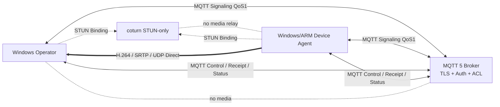
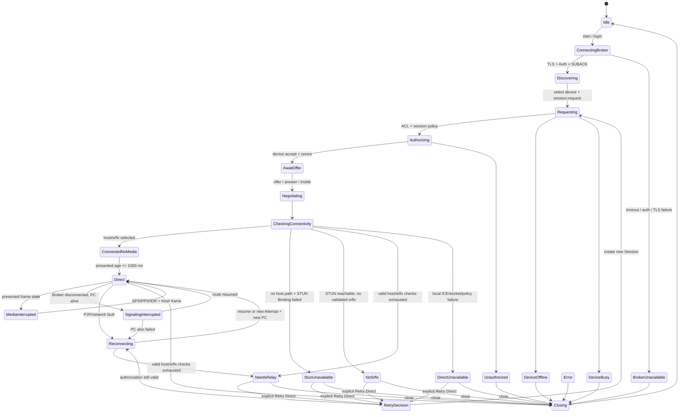
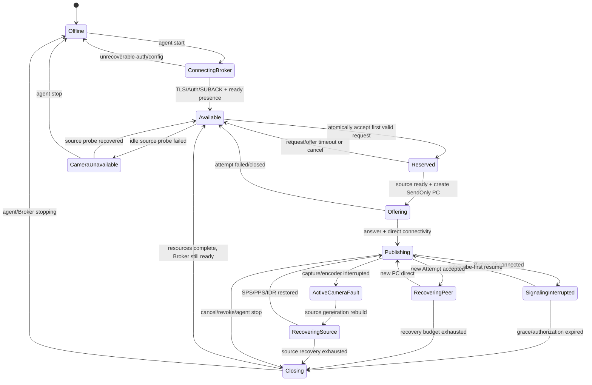

# RtmpMonitor 产品级 WebRTC Direct P2P 实施计划（MQTT 信令版）

> 文档版本：Draft 1.0
> 生成日期：2026-09-01
> 权威总纲：`RtmpMonitor_WebRTC_MQTT_Signaling_Direct_P2P_Productization_Outline_v2.md`
> 实施基线：`Beta` / `23c0949`
> 风险等级：代码阶段 R2；ADR-047/048 为用户确认后的 R3 产品范围决定
> 状态：`P2P-DIRECT-00=passed(scope_reduced_by_user_decision)`；`P2P-DIRECT-01=passed`（仅离线
> contract/provisioning 范围）。ADR-048 已确认团队共享公网 MQTT Server 是当前产品首选 Broker；
> DIRECT-02 不需要另备公网服务器。当前为明文 MQTT，不声明 MQTTS/TLS/Auth/ACL 安全资格。

本文把 MQTT 信令版总纲展开为可直接执行的阶段、接口、协议、部署、验证和回滚计划。本文不改变总纲约定；实际源码、CMake、运行结果和测试结果高于本文。任何尚未取得的 Broker、摄像头、物理网络或 ARM 真机证据均保持“待验证”。

---

## 1. 已冻结的产品与技术决策

### 1.1 产品范围

- WebRTC 最终成为唯一实时视频入口；RTMP/SRS 只在全部替代门禁通过后退役。
- 第一阶段使用 **MQTT over TLS 作为唯一产品信令通道**；不建设独立 WSS 服务。
- MQTT signaling 与 MQTT control 可以共用 Broker、TLS 和账号基础设施，但使用独立连接、ClientId、topic、ACL、payload、队列、状态机、错误码和指标。
- 当前严格为 Direct P2P only：只接受 host/srflx candidate；TURN、relay、SFU、MCU 和自动 RTMP fallback 均不在范围内。
- Direct 失败进入 `NeedsRelay` 或 `DirectUnavailable`；不得用已经部署但未声明的 TURN 掩盖失败。
- 第一版最多 4 路，一设备同时只允许一个操作员会话；第五路无副作用返回 `capacity_reached`。
- 第一版正式取消单向音频与录像/DVR；RTMP 退役不等待其迁移。
- 第一台生产路径 device agent 先使用 Windows x64 + Media Foundation；协议闭环后再迁 Linux ARM64。
- 首版视频基线冻结为1280×720@30fps、H.264 Constrained Baseline/Level≤3.1、Annex-B、无B帧、IDR间隔不超过30帧；软编目标4Mbps、单路峰值上限6Mbps，原生H.264直通也必须在`P2P-DIRECT-04`前证明不超过同一峰值。
- WSS 只保留为未来 `ISignalingChannel` adapter，不进入第一阶段 CMake、部署或发布门禁。

### 1.2 Broker、客户端库与公网选型

- **不得自研 MQTT Broker、STUN/TURN、WSS 转发器或 SDP/ICE 中央协调服务。**
- EMQX/Mosquitto 的版本、补丁、许可与 TLS/ACL/retain/QoS/expiry/limit 恶意客户端 fixture 保留为
  可选未来加固；按 ADR-047 不再作为 DIRECT-00/01 的阶段前置。未执行时不得声明产品安全资格，
  Dynamic Security 能力不足时也不临时自研 Broker 插件。
- EMQX 5.9+ 使用 BSL 1.1；是否能作为最终交付的一部分必须完成许可审查。Mosquitto 2.1.2 是明确的 EPL/EDL 回退。版本依据见 [EMQX 6.2.3 官方发布说明](https://docs.emqx.com/en/emqx/latest/changes/changes-ee-v6.html#v6-2-3)、[EMQX LICENSE](https://github.com/emqx/emqx/blob/master/LICENSE)、[Mosquitto 2.1.2](https://mosquitto.org/blog/2026/02/version-2-1-2-released/)。
- 客户端继续使用 [Paho MQTT C 1.3.16](https://github.com/eclipse-paho/paho.mqtt.c/releases/tag/v1.3.16)；不更换 MQTT SDK。当前 signaling 使用与团队 Broker 相符的 MQTT5 明文客户端路径，legacy control 保持既有 `paho-mqtt3a`；未来 MQTTS 迁移再单独引入 `paho-mqtt3as`、OpenSSL 与 CA/hostname 校验。MQTT5 属性和 packet 语义以 [OASIS MQTT 5.0](https://docs.oasis-open.org/mqtt/mqtt/v5.0/mqtt-v5.0.html) 为准。
- `P2P-DIRECT-02` 优先使用现有团队共享公网 MQTT Server，不要求另建公网 Broker。TLS/MQTTS 迁移与
  正式安全资格保留为可选未来加固，不阻塞当前团队产品；公网 STUN-only 仍是 `P2P-DIRECT-03` 的
  媒体可达性输入。
- STUN 使用 [coturn 4.17.2](https://github.com/coturn/coturn/releases/tag/4.17.2) 的 `stun-only` 模式。当前不部署可工作的 TURN listener、credential 或 relay port range；未来 TURN 必须另立 ADR、独立实例和资格阶段。
- 第一阶段不需要 Go 在线服务。只有未来出现动态多租户、设备共享、集中授权或浏览器 WSS adapter 时，才优先用 Go 实现独立 authority/adapter；该服务不得承载媒体或代替 Broker。

### 1.3 第一版身份选择

- 采用总纲方案 A：Broker 身份、精确 topic ACL 与 device agent 单会话仲裁共同构成第一版权威。
- 单租户、禁止匿名和公网自注册；每台设备、每个操作端安装实例使用独立 credential。
- 第一版使用高熵用户名/密码凭据：服务端只保存受控哈希，secret 至少 256 bit；Windows secret 进入 Credential Manager/DPAPI，ARM 进入 systemd credential、root-only 文件或后续硬件安全区。
- 首版明确使用Broker username/password over TLS，不启用client-certificate mTLS；服务器证书和hostname仍必须严格校验。mTLS如后续进入需求，单独ADR处理签发、轮换和设备存储。
- Broker username、`DeviceId`、`ClientInstanceId`、`MqttClientId` 有明确映射；payload 自报 identity 不能覆盖经过认证的连接身份。
- 第一版没有 JWT/PASETO 服务。会话使用设备生成的 256-bit 随机 `SessionNonce`，与 UserId、DeviceId、ClientInstanceId、SessionId、AttemptId、用途和过期时间绑定，只驻内存并可轮换。
- provisioning对每个`UserId + ClientInstanceId + DeviceId`显式签发`view`或`view+control`权限：`view`只能读presence/capabilities并发起观看signaling；只有`control`才能publish source-bound command topic并申请lease。scope同时落在provisioned roster、Broker ACL、session authorization和device guard，payload自报scope无效。

### 1.4 首版 H.264 产品契约

| 项目 | 冻结值 |
| --- | --- |
| 图像 | 1280×720、30fps；第一版不做动态分辨率/帧率切换 |
| Codec | H.264 Constrained Baseline，`profile-level-id=42e01f`（Level 3.1），`packetization-mode=1`，`level-asymmetry-allowed=1` |
| GOP | 无B帧，IDR间隔不超过30帧（1秒），编码器low-delay |
| 码率 | 软编目标4Mbps，单路1秒窗峰值不超过6Mbps；原生直通必须通过同一窗口门禁，不合格则转已资格MF编码或拒绝设备 |
| AU 格式 | 完整Annex-B access unit，输入允许3/4-byte start code；缓存/注入的SPS/PPS统一为4-byte start code；单AU最大4MiB |
| SPS/PPS/IDR | 每source/endpoint generation独立缓存SPS/PPS；中断后必须等待IDR，IDR缺SPS/PPS时只能注入当前generation已观察的参数，禁止复用旧generation |
| 时间戳 | RTP clock=90kHz；接收端按无符号32-bit wrap规则解包，每endpoint generation归一为从0开始、单调的`mediaTimestampUs`，不是壁钟 |
| 拥塞策略 | 第一版不自适应码率/分辨率；有界队列溢出时清队列并等待下一IDR，以可观测drop取代无界延迟 |
| 关键帧恢复 | 第一版不依赖尚未资格的RTCP PLI或MQTT关键帧请求；依赖≤1秒GOP。恢复后2秒无SPS/PPS/IDR则重开编码器一次，仍失败则`camera_unavailable` |
| camera 恢复 | 立即撤销control，保持当前Session/Attempt/PC最多10秒；source generation以1s/3s最多两次重建，首个可接受AU必须可恢复为SPS+PPS+IDR，超时关闭会话 |
| ARM 门禁 | ARM/V4L2/厂商编码输出必须通过与Windows相同的bitstream analyzer、码率、GOP、start-code、SPS/PPS/IDR和真解码闭环；不建ARM特例wire contract |

### 1.5 SDP / trickle 约束

- Offer/Answer总大小不超过192KiB，单行不超过8KiB，只允许CRLF换行、UTF-8/ASCII SDP token和单一`m=video`。
- `m=video` 只允许payload type 102、`H264/90000`、`profile-level-id=42e01f`、`packetization-mode=1`、`level-asymmetry-allowed=1`，mid恰好`video`。
- device Offer必须`sendonly`，desktop Answer必须`recvonly`；拒绝`sendrecv`、第二media section、audio、application/DataChannel、未知codec/payload和重复关键属性。
- 第一版是纯trickle：SDP严禁任何`a=candidate`/`a=end-of-candidates`，所有candidate/EOC只能走独立消息。`SdpContractValidator`在`setRemoteDescription`前执行该检查，因此内嵌relay candidate不能绕过candidate wrapper。
- candidate消息只允许host/srflx、mid=`video`、component=1、transport=UDP、IPv4 literal和port 1～65535；foundation 1～32个ICE char，priority限定uint32。srflx必须有合法`raddr/rport`，host不允许伪造related address。扩展只允许各一个受限`generation/ufrag/network-id/network-cost`，拒绝TCP/tcptype、重复`typ`、未知扩展、prflx/relay/unknown。selected pair终检两端也必须是IPv4 UDP host/srflx，否则不进`Direct`。IPv6在AAAA和端到端资格前不隐式接受。

---

## 2. 当前事实与大纲冲突表

| 领域 | 当前源码/环境事实 | v2 目标与计划处理 |
| --- | --- | --- |
| Paho | Windows/ARM 固定 Paho MQTT C 1.3.16 | 保留版本，显式限定 CMake 最低/精确支持版本 |
| TLS | CMake 链接非 TLS `paho-mqtt3a`；ARM `PAHO_WITH_SSL=OFF` | 迁移到 `paho-mqtt3as`、OpenSSL/CA、严格 hostname 校验 |
| 协议版本 | `MQTTAsync_connectOptions_initializer`，实际为 MQTT 3.1.1/default fallback | 新 signaling 强制 MQTT 5；拒绝协议降级 |
| 当前运行配置 | 团队共享公网 Broker 使用明文 MQTT；精确 endpoint 只在 Git 外配置 | 作为当前产品首选 Broker 显式注入；不成为源码/示例/默认值，不声明 MQTTS |
| Broker | 用户确认是团队共同使用的 MQTT Server；版本/安全配置未验证 | DIRECT-02 使用正常客户端数据面；管理面/核心配置不修改，安全加固可选延期 |
| ClientId | 每次显式 connect 生成随机 UUID；自动重连复用 handle | 新建持久 ClientInstanceId 和稳定 MqttClientId；signal/control每次CONNACK分别增加自己的connection epoch |
| Session | `cleansession=1`；没有 MQTT 5 Session Expiry | signaling 固定 Clean Start=1、Session Expiry=0，不允许离线信令堆积 |
| QoS/retain | pub/sub 均 QoS0；发送 retain=false | signaling 使用 QoS1+Message Expiry+应用层 TTL；SDP/ICE 永不 retained |
| LWT/presence | 无 LWT；heartbeat payload 自报 client_id | 设备 birth/LWT/presence 使用认证身份、受控 retained 和年龄校验 |
| 入站元数据 | `MqttObservedMessage` 不保存 qos/dup/retained；payload 4 KiB 截断、64 条 drop-oldest | 新 signaling message 保留 MQTT5 metadata，关键消息不能静默 drop；SDP 独立上限 192 KiB |
| Control | 全局 `device/control`/`device/status`，payload 无 target、TTL、CommandId、lease | P2P-DIRECT-06 新建 per-device command/receipt 契约；legacy control 在迁移期保留 |
| 回执 | 代码只有本地 Paho submit，固定 `executionConfirmation=unavailable` | 设备执行 ACK/receipt 是新能力；不得把大纲“已有回执”当成源码事实 |
| MQTT owner | `ApplicationBootstrap` 创建单一 `MqttDeviceClient`；其 connect/双订阅/publish/reconnect/callback 已有测试 | 提取唯一通用 `MqttAsyncTransport`；legacy façade 与 signaling adapter 复用实现、持有独立连接实例 |
| Desktop/UI | `MainWindow`、DeviceControlPanel、动态网格、OpenGL/CPU、全屏已存在 | 继续作为唯一产品 UI；DIRECT 只经组合根注入状态，不另建窗口、网格或控制面板 |
| Event/evidence | EventCenter/Panel、Evidence、事件证据截图和全屏截图已存在；截图均由用户触发 | 复用现有 store/service/panel/截图链；DIRECT-02 不新建事件系统或自动截图 |
| WebRTC signaling | `WebRtcReceiveSession` 直接轮询 `SessionPackageStore` | 引入窄 `ISignalingChannel`；文件 adapter 保留，MQTT adapter 成为产品路径 |
| Trickle | endpoint 等 gathering complete 后返回整包 SDP | 增加 local candidate 事件和 remote candidate 注入 |
| ICE restart | libdatachannel 0.24.5 有 `onLocalCandidate/addRemoteCandidate`，没有 `restartIce()` | v1 的 restart 定义为同 SessionId、新 AttemptId、完整新 PeerConnection；不宣称原地 ICE restart |
| UI shutdown | product controller 在 UI 线程同步 `join()` | 改成 detach/stop 与异步 completion 两阶段关闭 |
| 多路 | 已有最多4个独立 SessionContext和三类 generation | 继续复用；加入 DeviceId/SessionId/AttemptId/route/authorization |
| 资格 | 同机软件和长稳通过；camera、physical LAN、ARM WebRTC仍未通过 | 研发可推进，但外部资格布尔值保持 false |
| 视频发布基线 | 现有Windows source固定1280×720@30，校验Baseline/Level≤3.1、无B帧和IDR≤30帧；原生直通未校验码率 | 保留已证明的codec契约，增加4Mbps目标/6Mbps峰值观测与拒绝门禁 |

当前可复用的是 Paho 异步能力、SUBACK ready 门禁、`QPointer + atomic generation + queued value`、QSaveFile 非敏感配置模式、单调 heartbeat、ControlSessionGuard，以及 WebRTC/media/render 基础。不得复用现有 control handler 处理 SDP/ICE，也不得把现有 4 KiB观察队列扩成信令总线。

---

## 3. 目标进程、模块与依赖

### 3.1 目标拓扑



### 3.2 CMake 目标图

```text
# 本图统一表示“左侧 consumer -> 右侧 dependency”
signaling_contracts -> identity_contracts
lifecycle_contracts -> C++ standard library only
stream_contracts    -> C++ standard library only
time_health_contracts -> C++ standard library only
webrtc_negotiation_contracts -> webrtc_contracts
signaling_channel   -> signaling_contracts + lifecycle_contracts
signaling_session   -> signaling_channel + signaling_contracts
mqtt_signaling      -> signaling_session + signaling_channel
                       + signaling_contracts
                       + PRIVATE Qt Core + paho-mqtt3as + OpenSSL
file_signaling_adapter -> signaling_session + signaling_channel
                          + webrtc_negotiation_contracts
                          + existing webrtc_signaling(SessionPackage v1)
runtime_config      -> identity_contracts
device_directory    -> identity_contracts + signaling_channel
webrtc_transport    -> h264_contracts + webrtc_contracts
                       + webrtc_negotiation_contracts + libdatachannel
webrtc_runtime      -> signaling_channel + webrtc_transport
                       + webrtc_negotiation_contracts
product_media_port  -> h264_contracts + stream_contracts
                       + lifecycle_contracts
webrtc_product      -> product_media_port + media + video_canvas
                       + ui + logging
device_session      -> identity_contracts + runtime_config + device_directory
                       + signaling_channel + webrtc_runtime
                       + product_media_port + control_policy
device_agent_session -> identity_contracts + runtime_config
                        + signaling_channel + webrtc_runtime
                        + publisher + device_control
control_policy      -> time_health_contracts
device_control      -> identity_contracts + time_health_contracts
                       + PRIVATE paho-mqtt3as + OpenSSL

ApplicationBootstrap -> mqtt_signaling + device_directory + device_session
                        + webrtc_product + device_control + control_policy
rtmp_monitor_device_agent (QCoreApplication executable)
  -> mqtt_signaling + device_agent_session + device_control
     + publisher + platform adapters

publisher -> h264_contracts + FFmpeg/MF
media     -> h264_contracts + stream_contracts + FFmpeg
```

强制依赖规则：

- media、publisher、webrtc_transport、mqtt_signaling、device_control 互不反向依赖；`device_control` 保持不依赖 `control_policy`，两者只在composition root/device session组合。
- `webrtc_runtime` 只依赖 session signaling port抽象和transport，不包含 Paho 或 raw topic。
- Paho 仅为 `mqtt_signaling`/`device_control` 私有实现依赖，不出现在公共产品头文件。
- `DeviceSessionCoordinator` 是唯一跨 identity、signaling、WebRTC、StreamId 和 control target 的组合 owner，但不取代各子系统的资源owner。
- Desktop-only `device_session` 与 headless `device_agent_session` 不相互依赖；共享的只是identity/signaling session/runtime/control contracts。`webrtc_product` 不强持runtime，只实现中立`product_media_port`。
- MainWindow、QWidget、media、transport 和 control policy 不接触 Paho callback。
- diagnostics 只读 snapshot，不发布、取消或控制 session。

### 3.3 运行时 owner 与线程

| Owner | 执行上下文 | 独占状态/资源 | 停止终点 |
| --- | --- | --- | --- |
| `MqttSignalingClient` | 进程级独立 signaling owner QThread + Paho callback threads | 单条共享MQTT handle、ClientId、connection epoch、subscriptions、tx/rx queue、metrics | 应用退出时：closing→先递增epoch/generation并停投递→清有界队列→unsubscribe/disconnect/destroy→join owner |
| `MqttOperatorControlClient`（由现有`MqttDeviceClient`演进） | Desktop Qt owner + Paho callbacks | operator-control principal/handle、command tx、receipt/safety/heartbeat rx、control epoch | UI Locked→closing+先失效control epoch/generation→清有界队列→unsubscribe/disconnect/destroy |
| `MqttDeviceControlTransport` | device-agent control I/O thread + Paho callbacks | device-control principal/handle、dynamic command subscription、receipt/safety/heartbeat tx/rx queue、control epoch | 先失效control epoch/停投递→清队列→unsubscribe/disconnect/destroy；不拥有lease/policy/actuator |
| `DeviceCommandReceiver` | device-agent high-priority control owner thread | lease/scope/sequence/replay/dead-man状态和`IActuatorPort` | 本地/硬件watchdog停车→失效lease→请求transport unsubscribe |
| `SignalingSessionService` | signaling owner thread | wire/topic/auth/TTL/dedupe、peer ACK、nonce/tombstone和每Session route handle；不缓冲candidate | closeRoute→失效该Session sink/pending ACK/timer；不断开共享MQTT client |
| `WebRtcReceiveSession`/`PublishSession` | 每路 worker | 唯一拥有SDP-applied状态、candidate/EOC buffer、endpoint、attempt映射和协商timeout | beginClose→generation失效→worker收敛 |
| `WebRtcEndpointSession` | libdatachannel callbacks/私有sender | PC、Track、endpoint generation | close Track/PC并拒绝晚callback |
| `DeviceSessionCoordinator` | 应用 owner thread | 强持有session route/runtime/product-media handle/control binding，以及DeviceId/Session/Attempt/StreamId映射 | detach route→把资源转给CloseReaper→异步completion |
| `DeviceAgentSessionCoordinator` | device agent owner thread | Available/Reserved/Busy原子仲裁、authorization registry snapshot、route/publish runtime/source/control binding | 拒绝新request→撤销lease→转交agent close reaper |
| `WebRtcProductSessionController` | Desktop Qt owner thread | media input handle、StreamId、mailbox、widget绑定/移除权限和freshness；widget内存仍由MainWindow/QObject tree拥有并用QPointer观察 | `beginClose(ProductMediaSessionHandle)`→CloseTicket→异步解绑/释放 |
| `DeviceSessionCloseReaper` | 应用 owner + background completion | 所有已detach但未完成的route/runtime/product/control资源 | 真实completion/join后回投；UI timeout不销毁运行中对象 |
| camera source | capture/encode worker | reader/encoder、H.264 pacing | generation失效→Flush/Shutdown→join |
| media | decode worker pool | decoder、media generation、mailbox | close input→drain/clear |

所有跨线程事件必须是有界值对象，并携带 DeviceId、SessionId、AttemptId 与所属 generation/token；owner thread 收到后重新查找上下文，禁止长期捕获裸产品对象。

---

## 4. MQTT 5 topic、身份与 ACL

### 4.1 固定 topic namespace

第一版固定 root 为 `rtmp-monitor/v1`，使用稳定 inbox，不为 candidate 动态创建 topic：

```text
rtmp-monitor/v1/presence/device/{deviceId}
rtmp-monitor/v1/capabilities/device/{deviceId}
rtmp-monitor/v1/busy/device/{deviceId}

rtmp-monitor/v1/signaling/to/device/{deviceId}/from/operator/{operatorId}/{clientInstanceId}
rtmp-monitor/v1/signaling/to/operator/{operatorId}/{clientInstanceId}/from/device/{deviceId}

rtmp-monitor/v1/control/to/device/{mqttControlTargetId}/from/operator/{operatorId}/{clientInstanceId}/command
rtmp-monitor/v1/control/to/operator/{operatorId}/{clientInstanceId}/from/device/{mqttControlTargetId}/receipt
rtmp-monitor/v1/control/to/operator/{operatorId}/{clientInstanceId}/from/device/{mqttControlTargetId}/safety
rtmp-monitor/v1/telemetry/device/{deviceId}/heartbeat
rtmp-monitor/v1/telemetry/device/{deviceId}/snapshot

rtmp-monitor/v1/authority/to/device/{deviceId}/from/provisioner/{authorityId}/revocations
rtmp-monitor/v1/authority/to/provisioner/{authorityId}/from/device/{deviceId}/acks
rtmp-monitor/v1/authority/to/operator/{operatorId}/{clientInstanceId}/from/provisioner/{authorityId}/revocations
rtmp-monitor/v1/authority/to/provisioner/{authorityId}/from/operator/{operatorId}/{clientInstanceId}/acks
```

`DeviceId`、`UserId/OperatorId`、`ClientInstanceId`、`MqttControlTargetId`和`AuthorityId` 只允许 `[A-Za-z0-9._-]`，长度 1～128，不允许 `/ + # NUL`。所有 topic 由对应的typed topic codec生成和解析，业务层不得拼接任意字符串。`MqttControlTargetId`是provisioning建立的DeviceId→control route权威映射，不从StreamId、显示名、tile顺序或RTMP URL推导。Authority route只供非常驻provisioning CLI处理在线撤销，不是通用管理topic。

选型比较冻结如下：

| 方案 | 结论 | 理由 |
| --- | --- | --- |
| 普通稳定inbox，source只在payload | 拒绝 | MQTT PUBLISH不向订阅者暴露经认证publisher principal，不能只信payload自报source |
| **source-bound稳定route（本计划）** | 选用 | 静态精确ACL同时绑定target、source identity和client instance；Session/Attempt仍在envelope，无每candidate topic膨胀 |
| 每Session临时topic | 拒绝 | 引入动态ACL/订阅生命周期、旧topic清理和更大的恢复竞态，对最多4路无收益 |
| MQTT5 Response Topic + Correlation Data | 不作为路由 | Response Topic仍是发送方可填的属性并需动态授权；本计划使用固定route + envelope `correlationId`，只把MQTT properties作为非权威诊断 |

### 4.2 ClientId 与凭据

- 设备ClientId：`device-{DeviceId}-signal`和`device-{DeviceId}-control`；操作端ClientId：`operator-{UserId}-{ClientInstanceId}-signal`和`operator-{UserId}-{ClientInstanceId}-control`。四者是独立Broker principal/username/secret与独立ACL，不只是一个账号的ClientId后缀。
- view-only operator只下发signaling principal，不下发control principal/secret；`view+control`实例也不得用signal credential发control topic或反之。
- Broker credential 与 ClientId/identity 绑定。signal ClientId takeover使旧signal连接进入`ConnectionReplaced`，立即提升signaling epoch并关闭session/lease/PC，无30秒grace、不允许resume。control ClientId takeover只提升control epoch、撤销lease并本地停车，保留健康Direct视频。两者都不静默继续。
- 本地`connection_replaced`/审计事件必须携带`plane=signal|control`，不用一个无平面错误触发全局关闭。
- 设备和操作端每个实例/平面使用不同secret；禁止共享root/admin credential。轮换某平面不覆盖另一平面secret；撤销身份时按scope撤销control-only或同时撤销signal+control。
- 非敏感配置只保存Broker hostname、8883、topic root、protocol=5、signal/control ClientId、CA引用和分开的`signalingCredentialKey/controlCredentialKey`引用；密码/私钥不进入JSON。

### 4.3 ACL 矩阵

| Principal | 允许 publish | 允许 subscribe |
| --- | --- | --- |
| `device-signal:A` | 自己的presence/capabilities/busy；`from/device/A`且目标为已授权operator-signal的signaling；对provisioner的revocation ACK | `to/device/A`且来源为已授权operator-signal的signaling；发往A的authority revocation |
| `device-control:A` | 自己的heartbeat/telemetry；从自己MqttControlTargetId到授权operator-control的receipt/safety event | 发往自己MqttControlTargetId且来源为静态control-scope operator-control的command；当前lease由device guard再校验 |
| `operator-signal:U/{instance}` | `from/operator/U/{instance}`且目标为授权设备的signaling；对provisioner的revocation ACK | `to/operator/U/{instance}`且来源为授权device-signal的signaling；明确授权设备的presence/capabilities/busy；来自指定provisioner的revocation |
| `operator-control:U/{instance}` | 从本operator/instance发往已授权MqttControlTargetId的command | 发往本operator/instance的receipt/safety event；授权设备的heartbeat/telemetry |
| Provisioner authority P | 仅向受影响device/operator的source-bound revocation route发布 | 仅订阅对应device/operator ACK route；不订阅SDP/control/presence业务数据 |
| Broker admin | 仅受控运维接口 | 仅监控/审计接口 |

ACL 由 provisioning 工具生成精确 topic，不给产品 credential 配置 `#` 或根级 `+`。未来 Broker adapter
仍应校验 publish topic、QoS 和 retained，客户端再次校验 topic path 与 envelope source/target 一致。
当前未执行 EMQX/Mosquitto 能力 fixture，不据此声明产品安全；能力不足时另立 Broker/extension ADR，
第一版不临时自研安全插件。

### 4.4 设备目录与 presence

- device agent每次CONNECT前生成新UUIDv4 `connectionPresenceId`，先配置QoS1、retained=true、Message Expiry=45秒的`device.presence/offline`将死消息，然后连接。全部SUBACK后用同一bootId/connectionPresenceId发布`birth + presence/online ready=true`。
- LWT在CONNECT时已冻结，其`sentAtUtc`不代表真实断线时间；因此`presence/offline`是普signaling 30秒age规则的唯一例外，按本地`receivedAtMonotonic`和45秒Broker Message Expiry判断。只有connectionPresenceId与当前连接一致的offline才能覆盖online；旧连接晚到Will只丢弃计数。offline的`heartbeatSequence=null`，online为0～2^53-1。
- online presence 每15秒刷新，应用age 30秒判离线；MQTT5 Message Expiry=45秒，避免Broker重启后永久僵尸在线。
- capabilities使用QoS1、retained=true、Message Expiry=24小时；在每次ready、revision变更和每12小时定期重发，只包含稳定codec/分辨率/版本能力，不含session busy。
- heartbeat每5秒发送，QoS1、retained=false、Message Expiry=10秒，应用age>30秒触发control Suspended；device busy使用QoS1、retained=false、expiry=10秒；`telemetry-snapshot/v1`默认QoS0、retained=false、expiry=5秒且固定不超过1Hz。只有完成topic/identity/TTL校验后才进入`DevicePresenceTracker`。
- Will Delay固定为0。agent graceful stop先用当前connectionPresenceId发布QoS1 retained offline并最多等待2秒PUBACK，再MQTT DISCONNECT；发布/PUBACK失败则不发正常DISCONNECT，直接关socket让LWT接管。正常停机和crash/kill两条presence路径分别测试。
- operator按authorized roster对每设备的presence/capabilities/busy做三个精确topic订阅，不用设备通配符。最多512个注册设备以每批4个设备（12个filter，presence+capabilities最多8条retained回放）递进订阅；每批等待SUBACK并将directory queue排到8条以下才进下一批，保留至少16条空间给live update。超过512的roster在加载时拒绝，资格必须在并发live presence/busy下重放512设备的1024条retained快照而不溢出。

---

## 5. MQTT signaling wire contract

### 5.1 Envelope

```json
{
  "schemaVersion": 1,
  "messageId": "<uuid-v4>",
  "messageType": "webrtc.ice_candidate",
  "sentAtUtc": "<RFC3339-ms>",
  "ttlMs": 10000,
  "sourceIdentity": {"kind": "device", "id": "<device-id>"},
  "sourceClientInstanceId": null,
  "targetIdentity": {"kind": "operator", "id": "<user-id>"},
  "sessionId": "<uuid-v4-or-null>",
  "attemptId": "<uuid-v4-or-null>",
  "correlationId": "<uuid-v4-or-null>",
  "sequence": 0,
  "sessionNonce": "<base64url-or-null>",
  "payload": {}
}
```

固定限制：

- JSON envelope序列化后上限为256KiB；Broker和客户端MQTT Maximum Packet Size为320KiB，给topic、properties、variable/fixed header保留至少64KiB空间。超过任一层上限在publish前拒绝。
- SDP最大192 KiB；单candidate最大4 KiB；mid最大64 bytes；JSON最大嵌套深度8，每object最多64字段、每array最多64项。pre-scan在`QJsonDocument`前拒绝depth 9/第65项，golden vectors覆盖8/9和64/65。
- 每attempt最多64个candidate，早到candidate暂存总量最大64 KiB、最长30秒。
- 普signaling时间允许±2分钟clock skew，但实际消息年龄不得超过自身ttlMs；movement control不适用该宽容带，另行强制≤500ms时钟健康+本地单调deadline+500ms dead-man。
- `requestNonce/SessionNonce`均为32字节CSPRNG，序列化为恰好43个字符、无padding的base64url；SessionNonce只驻内存，不主动序列化到日志、retained、profile或fixture。生产禁用/不上传full-memory dump；只允许排除敏感内存的最小dump，加密、限权、最短保留并在资格中主动crash后扫描产物。
- JSON拒绝重复key、未知字段、未知messageType、非canonical UUID、NUL和错误类型；debug build也不输出payload全文。
- 所有JSON整数（`ttlMs/sequence/registryVersion/heartbeatSequence/candidateCount/lastAcceptedSequence/retryAfterMs`等）限定为`[0, 9007199254740991]`（`2^53-1`），缺失/不适用用`null`而不用-1；小数、指数形式、`2^53`及更大值统一`schema_invalid:number_out_of_range`。C++/Go golden vectors必须覆盖`2^53-1/2^53`边界。
- `SignalingConnectionEpoch/ControlConnectionEpoch`都不信任远端自报，不进JSON；各MQTT client在接收时把自己当前CONNACK代次作为只读metadata附到值事件，owner仅处理同平面当前epoch。
- `sourceIdentity.kind` 只允许`operator|device|provisioner`；必须与source-bound topic和当前credential/ACL映射一致，payload不能改变principal。
- `sourceClientInstanceId`按source kind严格校验：operator必须为当前安装`ClientInstanceId`并与topic/credential映射一致；device必须为null，由DeviceId source-bound topic、device credential、bootId/connectionPresenceId和SessionNonce绑定；provisioner也必须为null，由AuthorityId和专用credential证明。不使用空字符串代替null。
- 上例是定向信令。`device.birth/presence/capabilities/busy`是唯一broadcast族：`targetIdentity=null`，`sessionId/attemptId/correlationId/sessionNonce=null`，只依赖设备自身topic和ACL分发，不期待任何订阅者application ACK。

### 5.2 消息族

```text
device.birth / device.presence / device.capabilities / device.busy
session.request / accept / reject / cancel / cancelled / timeout / closed
session.resume / session.authorization.renewed / session.authorization.activated
control.lease.request / control.lease.granted / control.lease.revoked
identity.authorization_revoked
webrtc.offer / answer / ice_candidate / ice_complete
webrtc.restart_requested / restart_accepted / webrtc.protocol_error
message.ack / message.rejected
session.peer_state / media_state / direct_failed
```

第一版协商角色固定为：device agent = SendOnly Offerer，desktop = ReceiveOnly Answerer。设备原子接受第一个合法request并进入Busy；其他请求不排队，稳定返回`device_busy`。

各messageType的`payload`字段集固定如下（表中未列字段均拒绝）：

| messageType | payload 必填字段 | 响应/约束 |
| --- | --- | --- |
| `device.birth` | `bootId, connectionPresenceId, agentVersion, startedAtUtc, status=online` | 连接并完成全部SUBACK后才发布；broadcast/no ACK |
| `device.presence` | `bootId, connectionPresenceId, status=online\|offline, ready, heartbeatSequence` | retained/LWT/broadcast/no ACK；`ready=true`只在当前epoch的SUBACK全部完成后出现 |
| `device.capabilities` | `revision, videoCodec, width, height, fps, profileLevelId, packetizationMode, controlSupported` | 静态能力，不含busy/session/token；broadcast/no ACK |
| `device.busy` | `busy, activeSinceUtc` | retained=false/broadcast/no ACK，只供显示，原子仲裁仍以device状态机为准 |
| `session.request` | `requestNonce, requestedDeviceId, requestedRole=viewer, requestedScopes, capabilitiesRevision` | envelope必须含新SessionId/AttemptId，`sessionNonce=null`；只有operator可创建这两个ID |
| `session.accept` | `requestNonce, authorizationExpiresAtUtc, capabilitiesRevision, grantedScopes` | `correlationId=request MessageId`，envelope首次携带device签发SessionNonce |
| `session.reject` | `requestNonce, code, retryable` | `correlationId=request MessageId`；`retryAfterMs`仅在`retryable=true`时可选 |
| `session.cancel/cancelled/timeout/closed` | `reasonCode` | `correlationId`指向触发消息（无则null），关闭幂等 |
| `session.resume` | `bootId, lastPeerMessageId, previousAttemptId` | subscribe-first；只能恢复同Session/Attempt和仍健康PC |
| `session.authorization.renewed` | `newSessionNonce, newExpiresAtUtc, oldNonceValidUntilUtc` | 用旧nonce发送；新nonce尚未激活 |
| `session.authorization.activated` | `renewedMessageId, activatedAtUtc` | device收到renewed ACK后用新nonce发送；operator回ACK后双方仅用新nonce发新业务消息 |
| `webrtc.offer/answer` | `sdp` | offer只device发，answer只operator发；同Attempt只允许一份语义SDP |
| `webrtc.ice_candidate` | `candidate, mid` | candidate类型必须host/srflx；relay拒绝 |
| `webrtc.ice_complete` | `candidateCount` | 同Attempt单次幂等；之后不接受新candidate |
| `webrtc.restart_requested` | `reasonCode, failedAttemptId` | 任一peer可请求，但不自行创建AttemptId |
| `webrtc.restart_accepted` | `previousAttemptId` | 只operator发布，envelope携带新AttemptId；完整重建PC |
| `message.ack` | `acknowledgedMessageId, outcome=applied\|buffered\|duplicate` | `correlationId=acknowledgedMessageId`；不再ACK |
| `message.rejected` / `webrtc.protocol_error` | `rejectedMessageId, code, retryable` | 只使用稳定错误码，不包含原payload/SDP/candidate |
| `control.lease.request` | `mqttControlTargetId, requestedTtlMs=30000, purpose=control` | 需`control` scope与有效SessionNonce |
| `control.lease.granted` | `controlLeaseId, mqttControlTargetId, expiresAtUtc, initialSequence=0` | device签发，绑定User/instance/Session/Attempt/target |
| `control.lease.revoked` | `controlLeaseId, reasonCode` | device或operator可发，device本地立即停车 |
| `identity.authorization_revoked` | `registryVersion, affectedPrincipalKind=operator\|device, affectedPlane=signal\|control\|all, affectedPrincipalId, affectedClientInstanceId/null, affectedDeviceId, revokedScopes[], credentialIds[], effectiveAtUtc, reasonCode` | 只允许authority route，non-retained；peer按plane撤销视频/控制资源并回标准`message.ack` |
| `session.peer_state/media_state/direct_failed` | `stateOrCode, observedAtUtc` | 可丢诊断，不作为远端Direct或控制授权事实 |

`requestNonce`是operator为单次request生成的256-bit challenge，只用于绑定request/response；`SessionNonce`是device accept后签发的短期会话授权，两者不复用、不互换。Control command/receipt不使用signaling envelope，固定为：

```text
control-command/v1:
  commandId, userId, sourceClientInstanceId, controlLeaseId,
  sessionId, attemptId, mqttControlTargetId,
  issuedAtUtc, expiresAtUtc, sequence, action, data

control-receipt/v1:
  receiptId, commandId, controlLeaseId, sessionId, attemptId, mqttControlTargetId,
  receivedAtUtc, completedAtUtc, outcome, reasonCode, lastAcceptedSequence

control-safety-event/v1:
  eventId, controlLeaseId, sessionId, attemptId, mqttControlTargetId,
  causedByCommandId/null, occurredAtUtc, eventType, outcome
```

command topic的operator/instance、payload source、lease owner必须三者一致；receipt topic target必须回到同一operator/instance。

`control-command/v1` 首版只有两个action，无开放式`data`：

| action | data schema | 发送/执行规则 |
| --- | --- | --- |
| `move` | 恰好`{"direction":"<direction>"}`，`direction`枚为`forward`、`backward`、`left`、`right` | Armed按住期间10Hz（每100ms）刷新，每次sequence+1；方向外无速度/角度单位，不接受额外字段 |
| `stop` | 恰好`{}` | 高优先级单槽，仍校验source/target/session/attempt/lease；device本地dead-man/revoke不依赖远端stop到达 |

`control-receipt/v1.outcome` 只允许`executed|rejected|expired`。`reasonCode`在`executed`时为`none`，其余只能为`wrong_topic|wrong_source|wrong_scope|wrong_target|wrong_session|wrong_attempt|wrong_lease|sequence_replay|clock_unhealthy|locked|actuator_error|command_expired`。同一commandId重复时重发字节等价的原receipt（同receiptId/outcome/reasonCode），不再调用actuator。

dead-man/lease revoke/clock fault可在某个`move` receipt=`executed`之后发生，不改写该command终态；device另发`control-safety-event/v1`，`eventType=deadman_stop|lease_revoked|clock_unhealthy|broker_lost`，`outcome=stopped|actuator_error`，QoS1、retained=false、Message Expiry=10s。`broker_lost`只在socket仍可写的边缘窗口best-effort发送；真正断链时不排队/补发，仅记本地审计并由operator连接状态推断，任何门禁不期待收到该event。agent crash/restart后不持久短期session/lease/command ID，因此不伪造定向safety event；新`device.birth` bootId/connectionPresenceId表达重启，watchdog停车证据留在本地安全审计。旧RTMP `startStream/stopStream/moveCar/stopCar`契约只在legacy tile存活，不进入新DeviceSession。

首版telemetry不创建dynamic metric topic，只使用`telemetry-snapshot/v1`：`sampleAtUtc, cpuPermille, memoryBytes, temperatureMilliC, encoderFpsMilli, uplinkKbps`，每个整数遵守2^53-1上限，不支持的传感器用null。最多1Hz、QoS0、retained=false、expiry=5s；新metric必须升schema，不把metric name填入topic制造cardinality。

### 5.3 QoS、retained、expiry和session

| 类别 | QoS | retained | MQTT5 Message Expiry | 应用TTL |
| --- | ---: | --- | ---: | ---: |
| device birth/presence online/offline | 1 | true | 45s | online age≤30s；offline按LWT特例 |
| capabilities | 1 | true | 24h | 24h |
| device busy | 1 | false | 10s | 10s |
| session request/accept/reject | 1 | false | 10s | 10s |
| session cancel/cancelled/timeout/closed | 1 | false | 10s | 10s |
| session resume | 1 | false | 10s | 10s且不超过30s grace |
| session authorization renewed/activated | 1 | false | 10s | 10s |
| Offer/Answer | 1 | false | 30s | 30s |
| ICE candidate | 1 | false | 10s | 10s |
| ice_complete/restart | 1 | false | 15s | 15s |
| message ACK/rejected/protocol_error | 1 | false | 10s | 10s；本身无ACK |
| control lease request/granted/revoked | 1 | false | 10s | 10s |
| identity authorization_revoked/authority ACK | 1 | false | 10s | 10s；同MessageId重试一次，reconciler可重放，不离线排队 |
| peer/media/direct diagnostics | 0 | false | 5s | 5s，可丢 |
| control command | 1 | false | 2s | ≤2s |
| control receipt/safety event | 1 | false | 10s | 10s |
| heartbeat | 1 | false | 10s | age≤30s |
| telemetry | 0 | false | 5s | 5s |

上表是发送端唯一映射；任一未映射messageType在publish前返回`schema_invalid:message_policy_missing`，不回退Broker/SDK默认QoS、retained或expiry。

signaling连接固定 MQTT5 Clean Start=1、Session Expiry=0、Paho persistence none、`sendWhileDisconnected=0`；断线期间 Broker 和客户端都不得保存 Offer/Answer/candidate/control command。重连固定subscribe-first：双方只在当前epoch的所有SUBACK完成后发布`ready=true` presence；operator不用订阅时`retained=true`的旧online触发resume，必须在本端SUBACK后观察到一次实时投递（MQTT retained flag=false）的ready refresh，且connectionPresenceId对应device当前CONNECT，才使用同MessageId有界重试`session.resume`。双方同时重连时仍只有operator可发起resume/新Attempt，device只accept/reject；15秒presence refresh必须使该观察在30秒grace内可完成，否则关闭旧session并重新request。

MQTT5 SUBSCRIBE options不使用SDK默认猜测：QoS按上表，No Local=1，Retain As Published=0；每connection epoch首次订阅Retain Handling=0以取目录快照，同epoch内幂等重订阅使用Retain Handling=1避免再次回放。Broker fixture必须证明订阅回放的retained flag=true，后续实时retained publish在RAP=0时为false，否则不能作为live-ready依据。

新DeviceSession的control连接同样强制MQTT5、Clean Start=1、Session Expiry=0、Paho persistence none、`sendWhileDisconnected=0`和retained=false，但使用独立principal/ClientId/handle/queue。任一control/Broker断线都使旧lease永久失效，断线不排队movement/stop；重连后必须保持Locked，用户重新显式Armed并签发新ControlLeaseId、sequence=0，不存在“验证后复用旧lease”。legacy RTMP MQTT 3.1.1/tcp模式不得承载`control-command/v1`。

signal/control两条连接都固定KeepAlive=15秒，任一PINGRESP或QoS1 PUBACK等待不超过10秒；超时立即使当前epoch/generation失效、abort半开连接并进入退避重连。Broker断线grace的单调起点是`connectionLost`回调或上述watchdog deadline中更早的一个；TCP blackhole、单向丢包、不回PUBACK和NAT映射消失均是阻断测试。

### 5.4 幂等、ACK、乱序与缓冲

- QoS1只保证至少一次送达，不能替代应用ACK。
- 除`message.ack`、`message.rejected`、`webrtc.protocol_error`、全部device broadcast（birth/presence/capabilities/busy）和明确可丢诊断外，每条信令由**接收端应用**生成`message.ack`或`message.rejected`；ACK/error本身不再ACK，避免递归。3秒未收到时使用同一MessageId重发一次，再超时则结束attempt。
- 去重键为`authenticatedPrincipal + MessageId`，缓存10分钟，最多4096项或8MiB；重复消息返回原结果，不重复执行状态迁移。
- 同一Attempt只允许一个非重复Offer和Answer；第二份不同SDP返回`negotiation_conflict`。
- 只允许candidate/EOC在remote description前有界暂存；SDP应用后顺序flush。
- MessageId只做消息幂等；candidate在同一Attempt内按`(mid, candidate)`语义去重，即使换了MessageId也不重复计数/注入。旧SessionId/AttemptId、EOC后新candidate、超限和过期消息稳定拒绝。
- candidate先做语义去重再计入64条/64KiB预算。`ice_complete`只更新runtime状态和timeout；libdatachannel 0.24.5没有远端EOC注入接口，不构造空candidate冒充。
- 不依赖不同topic或不同publisher之间的全局顺序；sequence只用于确有顺序要求的同发布者事件。
- Session关闭后保留10分钟tombstone；旧accept、SDP、candidate、nonce只能拒绝和计数。

### 5.5 Session authorization

1. Broker认证和ACL先证明双方有权访问精确topic。
2. 操作端生成SessionId、AttemptId和request nonce发起`session.request`。
3. device agent验证topic、认证映射、TTL、容量和权限后原子占用，生成256-bit SessionNonce并返回accept。
4. Offer/Answer/candidate必须同时匹配SessionId、AttemptId和SessionNonce。
5. SessionNonce默认120秒过期，剩余60秒时由设备轮换；控制授权仍需用户显式Armed，不能由nonce自动授予。
6. Broker重连、撤销或关闭后旧nonce不得创建新attempt；device agent重启、peer进程重启或route丢失时重新建立SessionId。Broker重启但双方进程/PC/route仍在时按subscribe-first resume处理。
7. Broker断线时不延长nonce也不签发新attempt/control lease；已有健康P2P可在30秒grace内显示，但重连后必须先完成resume与nonce轮换才处理新信令。
8. nonce轮换使用`renewed → ACK → activated → ACK`四步握手：device用旧nonce发renewed后开始接受old/new、仍用old发送；operator收到后开始接受old/new并用old ACK；device收到ACK后用new发activated；operator收到activated后用new ACK并仅用new发新业务消息。device收到最后ACK后也仅用new发新业务消息。旧nonce随后只有5秒overlap，仅允许完成旧MessageId的ACK/去重结果，禁止新candidate、Attempt或lease，然后进tombstone。任一握手消息用同MessageId重试一次，仍失败则在旧nonce过期时关闭session。
9. registry和Broker是两个系统，不伪称跨系统原子提交。撤销是可恢复状态机：持久单调`desired_revoke` tombstone→`pending_broker_apply`→Broker deny+踢出并读回验证→通过authority route通知peer→`device_confirmed|peer_confirmed`。CLI/reconciler每次启动按最高registryVersion幂等重放未完成步骤，各步可crash-inject；**只有Broker deny在30秒内无法读回验证**时才使该环境产品listener fail-close并告警。peer按`affectedPlane`完成第10条对应资源收敛后才ACK；2秒无ACK只标记`pending_peer_confirmation`并主动断开相关MQTT client，不在Broker deny已确认时拖垮全环境。
10. 撤销按principal/plane分流：
    - operator `control`：deny/踢出对应control principal，通知device撤销lease并本地停车，view session继续；
    - operator `signal|all`：deny/踢出signal（`all`同时control）principal，通知所有活动device关闭该operator的session/lease/PC；
    - device `control`：deny/踢出device-control principal并禁用MqttControlTargetId，通知operator立即Locked，Direct视频可继续；
    - device `signal|all` / lost-device：先通知所有活动operator关闭P2P/控制，再deny/踢出device-signal（`all`同时control）principal并禁用target。
    设备已离线时无peer ACK可等，以Broker deny读回+无活动session为收敛证据；任一旧signal/control credential在回滚后仍不得重连。
    单operator可关联最多512设备，因此authority fan-out不同时发送：Broker deny先读回确认，reconciler按“活动session→在线设备→其他注册设备”排序，每批最多32个peer，等待该批ACK或2秒超时并持久batch cursor后再继续。中途crash按同registryVersion/MessageId幂等恢复；测试覆盖200在线/512注册设备的全量撤销、超时与每批crash/retry。

### 5.6 固定资源预算与溢出语义

| 资源 | 上限 | 溢出语义 |
| --- | ---: | --- |
| 每个signaling client tx/rx global queue | 各128条且1MiB | 按route轮转公平调度，不允许单route占满全局 |
| 每Session route tx/rx | 各32条/256KiB，其中4条专用cancel/close/ACK | presence/capabilities在directory queue按key合并；普通槽溢出只结束肇事route/attempt，其他route仍可发送关键消息 |
| device directory queue | 32条/256KiB | 同DeviceId的presence/capabilities可合并；使用4-device批处理retained回放，不丢不同DeviceId |
| session request-acceptor queue | 16条/128KiB | 溢出稳定`slow_consumer`，不污染已有session |
| pending application ACK | 每route 16、全局64 | 超限只拒绝肇事route的新业务发送，超时按`ack_timeout`收敛 |
| Paho/Broker QoS1 inflight | 每客户端32 | 不向无界队列转移；返回backpressure |
| 每Attempt candidate | 64条/64KiB/30s | 第65条或超字节/时间结束Attempt |
| dedupe/tombstone | 每principal 4096项或8MiB/10min | 先清理过期；仍超限则限速并拒绝新session |
| 单H.264 AU | 4MiB | 拒绝AU，转入waiting-for-keyframe |
| transport send AU queue | 每路2个AU | 清队列，非IDR拒绝，从下一IDR恢复 |
| decode compressed queue | 每路45包或4MiB | 清队列、递增media generation/metrics并等待IDR |
| decoded frame mailbox | 每路1帧 | latest-frame-wins，覆盖计数可观测 |
| UI pending removals | 最大4，与产品session容量相同 | 超限为invariant failure，CloseCoordinator继续持有资源，不静默丢指针 |
| control command/receipt/safety queue | 每活动lease独立各32条/256KiB，operator最多4组，device只1组 | movement不排队，只保留最新有效sequence；StopCar使用独立单槽高优先级，溢出立即Locked |
| telemetry low-priority queue | operator全局16条/64KiB，最多订阅1个展开设备 | latest-per-device，可覆盖计数，不占control/signaling保留槽 |
| device directory retained entries | 注册设备最大512，presence/capabilities各一 | 未注册/超限topic由ACL拒绝，不在客户端无界增长 |
| event/evidence | closed event 5000，evidence pending task 4 | 按现有保留/队列满契约显式拒绝，不影响实时线程 |

单节点默认最多512个注册设备，但不等于512设备同时在线。Broker最多512条MQTT产品连接的最坏预算为：200个在线device×2平面=400，32个在线control-capable operator instance×2平面=64，provisioner/admin/升级保留48条headroom，合计512。默认最多128个逻辑观看session，每operator instance最多4路，每device最多1路。最后一条由`DeviceAgentSessionCoordinator`原子busy仲裁，Broker只限制credential/ClientId连接、ACL、packet和rate，不解析envelope也不装作业务session owner。

---

## 6. ID、状态机、恢复与关闭契约

### 6.1 强类型 ID 与生命期

| 类型 | 签发者 | 生命期 | 用途 |
| --- | --- | --- | --- |
| `UserId` | provisioning CLI | 长期 | 操作员身份，与显示名分离 |
| `AuthorityId` | 安装时冻结 | 长期 | 限定provisioning撤销route，不代表产品用户 |
| `DeviceId` | provisioning CLI | 长期 | 设备身份与topic路由 |
| `ClientInstanceId` | 客户端首次安装 | 一次安装 | 区分同一UserId的实例 |
| `MqttClientId` | `MqttClientIdCodec` | 跨重连稳定 | Broker连接唯一性 |
| `SignalingConnectionEpoch` | signaling MQTT client owner | 每次成功CONNACK递增 | 拒绝旧signaling callback/route |
| `ControlConnectionEpoch` | control MQTT client owner | 每次成功CONNACK递增 | 拒绝旧command/receipt callback，不影响视频epoch |
| `MessageId` | 发送方 | 单消息/重试 | QoS1幂等与应用ACK |
| `SessionId` | operator | 一次逻辑观看会话 | 跨attempt保持 |
| `AttemptId` | operator | 一次完整PC协商 | 失败后新建，不复用 |
| `SessionNonce` | device agent | 默120秒、可轮换 | 会话内双方绑定 |
| endpoint/media generation | 各资源owner | 单个endpoint/decoder | 拒绝晚回调与旧sample |
| product token | Desktop产品层 | 单个SessionContext | UI和异步completion绑定 |
| `StreamId` | media manager | 应用运行期 | media/widget/mailbox绑定 |
| `MqttControlTargetId` | provisioning CLI | 长期 | DeviceId→control topic权威路由，禁止推导 |
| `ControlLeaseId` | device agent | 一次Armed授权 | 控制面与视频面分离 |

UUID类ID统一使用canonical UUIDv4小写序列化；`DeviceId/UserId/ClientInstanceId`是经provisioning校验的opaque ID，不从显示名、RTMP URL、IP或tile位置推导。

### 6.2 逻辑会话状态机



`Direct` 是组合状态：PeerConnection connected、selected pair两端都不是relay、存在有效StreamId、解码成功且最近presented frame age不大于1000ms。只有网络connected或只收到RTP不得标记Direct。

`BrokerUnavailable`、`SignalingInterrupted`和`MediaInterrupted`必须是三个独立事实：Broker断线时仍可继续显示健康Direct画面，但control立即Suspended；MQTT connected也不能代表设备在线、WebRTC connected、画面presented或control Armed。

`NeedsRelay`只在双方已获得与校验必需host/srflx candidate、STUN本身健康、无relay候选且所有合法connectivity check用完后才成立。STUN DNS/Binding失败是`StunUnavailable`；需要NAT穿透但未获得有效srflx是`NoSrflx`；本地socket/codec/policy/内存失败是`DirectUnavailable`，均不冒充“需要TURN”证据。用户可在上述终态显式点击“重试直连”：authorization仍有效时使用同SessionId+新AttemptId+新PC，否则新SessionId；5秒cooldown、10分钟最多3次，不自动循环也不回退RTMP。

稳定错误至少覆盖：`unauthenticated`、`forbidden`、`version_unsupported`、`schema_invalid`、`message_too_large`、`message_expired`、`message_replay`、`wrong_topic`、`wrong_connection_epoch`、`connection_replaced`、`broker_unavailable`、`slow_consumer`、`device_offline`、`device_busy`、`camera_unavailable`、`capacity_reached`、`unknown_session`、`session_closed`、`attempt_mismatch`、`invalid_transition`、`authorization_expired`、`authorization_revoked`、`sdp_too_large`、`candidate_invalid`、`candidate_buffer_overflow`、`ice_already_complete`、`negotiation_conflict`、`ack_timeout`、`rate_limited`、`stun_unavailable`、`no_srflx`、`direct_unavailable`、`needs_relay`和`internal`。

### 6.3 Device agent 状态机



device agent只有一个session owner thread可从`Available`原子迁移到`Reserved`；并发request只有一个accept，其余返回`device_busy`。`CameraUnavailable`是idle状态，观看请求返回`camera_unavailable`且不创建PC；只有活动session中的`ActiveCameraFault`才能经`RecoveringSource`回到`Publishing`。operator是SessionId/AttemptId的唯一创建者，device在accept后是唯一Offerer，因此双方同时恢复时不会各自创建会话/协商。Reserved/Offering任一超时、cancel或authorization失效都必须释放busy并将旧ID进tombstone。

### 6.4 正常协商时序

```mermaid
sequenceDiagram
    participant O as Desktop Operator
    participant B as MQTT Broker
    participant D as Device Agent
    participant S as STUN-only

    D->>B: retained presence/capabilities + LWT
    O->>B: session.request (QoS1, expiry, MessageId)
    B->>D: exact ACL-routed request
    D->>B: message.ack(request, applied)
    B->>O: request application ACK
    D->>B: session.accept (SessionNonce)
    B->>O: session.accept
    O->>B: message.ack (correlationId = accept MessageId)
    B->>D: application ACK
    D-->>S: STUN Binding
    D->>B: webrtc.offer + candidates + ice_complete
    B->>O: offer/trickle
    O->>B: app ACK for each offer/candidate/EOC
    B->>D: routed application ACKs
    O-->>S: STUN Binding
    O->>B: webrtc.answer + candidates + ice_complete
    B->>D: answer/trickle
    D->>B: app ACK for each answer/candidate/EOC
    B->>O: routed application ACKs
    D==>>O: Direct SRTP/UDP H.264
    O->>O: decode -> mailbox -> presented freshness gate
```

固定超时：MQTT TLS/CONNACK 10秒，订阅SUBACK 5秒，session request/accept 10秒，offer到达10秒，Offer/Answer/trickle/connectivity总预算30秒，connected后首帧10秒，Broker断线grace 30秒，两次PC重建总恢复预算30秒，本地关闭不因`session.closed` ACK超时5秒而阻塞。

### 6.5 断线、重建和 NeedsRelay

| 故障 | 立即动作 | 恢复路径 | 终止结果 |
| --- | --- | --- | --- |
| Broker普通短断，PC仍活着 | 禁止新协商，control立即Locked，device 500ms dead-man本地停车，StopCar publish仅best-effort | subscribe-first，30秒内`session.resume`匹配原Session/Attempt并轮换nonce | grace超时关闭PC和session |
| signal `ConnectionReplaced`/signal credential撤销 | 立即失效signaling epoch、nonce、lease、PC和媒体 | 不允许resume/grace；只能用新credential建新Session | 旧进程永不得继续媒体/控制 |
| control `ConnectionReplaced`/control scope撤销 | 只失效control epoch/lease并本地停车 | 重新provision/control Armed；不重建PC | 健康Direct视频保留，control Locked |
| PC断开，route和nonce仍有效 | 失效endpoint generation | 同SessionId、新AttemptId、完整重建PC，最多2次 | 根据STUN/srflx/check证据分别进StunUnavailable/NoSrflx/DirectUnavailable/NeedsRelay |
| device agent/Broker状态丢失或resume拒绝 | 关闭旧PC和nonce | 重新`session.request`创建SessionId | 失败则DeviceOffline/Unauthorized |
| 网络切换 | 冻结旧Attempt、锁定control | 新Attempt+新PC；不调用不存在的`restartIce()` | 直连穷尽后NeedsRelay |
| 本地/远端relay candidate | 传输wrapper立即拒绝并计数 | 其他host/srflx继续 | selected pair任一relay都不得进入Direct |

重连退避为1、2、4、8、16、30秒，每次±20% jitter；只有当owner的desired state仍为Connected时才继续。断线期间不保存SDP/ICE离线队列，也不把完整PC重建称为ICE restart。

### 6.6 两阶段异步关闭

1. Desktop owner thread先从`DeviceSessionCoordinator`拆除route、product token和control lease，UI立即转为Closing并不再接受操作。
2. 向signaling/runtime/media/control各owner发送幂等`beginClose`/停车意图；不在UI thread调用`join()`。
   每个子owner均返回第7节统一`CloseTicket`，completion携带SessionId/product token/generation并在指定owner dispatcher恰好一次投递。
3. 各worker使generation失效，关闭输入/PC/decoder/MQTT route，然后用值事件回投owner thread。
4. owner重新核对SessionId、AttemptId、product token和generation，仅在全部子资源完成时释放widget/mailbox/StreamId。
5. UI close timeout只允许完成界面detach并记录证据；`DeviceSessionCloseReaper`继续强持有worker/PC/camera/decoder/route直到真实completion/join，不得仅使generation失效就销毁运行对象，也不重新把已detach会话挂回UI。应用退出有独立总预算与强制失效诊断，但不在owner析构后留存可访问应用对象的线程。

### 6.7 产品 UI 四分面投影

UI不使用一个绿色“已连接”混合多个事实，每个DeviceSession固定显示下列四个独立分面：

| 分面 | 状态 | 稳定用户动作 |
| --- | --- | --- |
| 消息/Broker | `Connecting/Ready/Interrupted/Unavailable/Unauthorized/ConnectionReplaced` | 自动有界重连；认证/替换时提示重新provision，不提示手工SDP |
| 设备 | `Online/Busy/Offline/CameraUnavailable` | Busy选其他设备或等待；Offline检查agent/网络；CameraUnavailable恢复设备source |
| 视频 | `Idle/Negotiating/Checking/ConnectedNoMedia/Direct/MediaInterrupted/Reconnecting/StunUnavailable/NoSrflx/DirectUnavailable/NeedsRelay/Closing` | 终态可显式“重试直连”或关闭；NeedsRelay明确说明当前版本无relay |
| 控制 | `Locked/Armed/Moving/Suspended` | 只在view视频Direct+帧新鲜+control scope+时钟/心跳健康时显式Armed；其他任何变化立即Locked/Suspended |

`StunUnavailable`引导检查STUN/DNS，`NoSrflx`引导检查NAT/UDP，`DirectUnavailable`引导查看本地安全诊断，`NeedsRelay`只告知网络不在Direct-only支持边界内。UI只显示错误码映射和可执行动作，不显示topic、SDP、candidate、nonce或网络拓扑。

---

## 7. 公共接口和文件级变更图

### 7.1 Signaling channel 接缝

```cpp
class ISignalingChannel {
public:
    virtual ~ISignalingChannel() = default;
    virtual DeviceDirectoryPortOpenResult openDeviceDirectoryPort(
        DeviceDirectoryEventSink sink,
        IValueDispatcher& targetDispatcher) = 0;
    virtual SessionRequestAcceptorOpenResult openSessionRequestAcceptor(
        SessionRequestSink sink,
        IValueDispatcher& targetDispatcher) = 0;
    virtual SessionRouteOpenResult openSessionRoute(
        const SessionRouteSpec& spec,
        SessionEventSink sink,
        IValueDispatcher& targetDispatcher) = 0;
    virtual SignalingChannelSnapshot snapshot() const = 0;
    virtual CloseTicket beginApplicationClose(
        CloseCompletionSink sink,
        IValueDispatcher& targetDispatcher) = 0;
};

class ISessionSignalingPort {
public:
    virtual ~ISessionSignalingPort() = default;
    virtual SignalingEnqueueResult enqueue(
        const SignalingEnvelope& envelope) = 0;
    virtual SessionRouteSnapshot snapshot() const = 0;
    virtual CloseTicket closeRoute(
        CloseCompletionSink sink,
        IValueDispatcher& targetDispatcher) = 0;
};
```

- `ISignalingChannel`是进程级连接façade，只在应用退出时关闭；每路`SessionRouteHandle/ISessionSignalingPort`关闭只失效当前Session的sink、pending ACK和timer，不断开其他3路共享MQTT client。
- `IDeviceDirectoryPort`处理会话前的birth/presence/capabilities/busy；`ISessionRequestAcceptor`是device agent的稳定inbox，把新request投递`DeviceAgentSessionCoordinator`原子仲裁，accept后才创建per-session route。operator可为新SessionId先打开pending route再发request。两者与per-session port同样是adapter-neutral抽象，不允许device directory/UI绕过它们访问Paho concrete。
- `enqueue()`只表示本地有界队列接受，不表示socket write、MQTT PUBACK或peer应用成功。`SignalingDeliveryEvent` 分别报告`broker_puback`、`peer_applied/buffered/duplicate/rejected`和`peer_ack_timeout`。
- Paho callback只复制为值事件并投递signaling owner；严格codec/auth/TTL/dedupe通过后，再经每路有界dispatcher投递session worker。`closeRoute()` completion之后不再投递新事件；已在途值仍必须通过epoch/Session/Attempt/generation校验。`snapshot()`是线程安全的不可变副本。
- `CloseTicket`是move-only、幂等句柄；重复close返回同一逻辑ticket。它携带owner token/generation，只在资源真实停止/join后于指定dispatcher恰好一次发送终态`completed`。UI本地deadline可另发非终态`CloseProgress{timed_out_but_owned}`用于detach，但不settle ticket；实体仍由CloseReaper持有直到`completed`。不轮询snapshot、不在UI thread等future。
- `MqttSignalingChannel`负责MQTT5/TLS/topic/metadata；`SessionPackageSignalingChannel`仅保留developer fixture。两者都不暴露Paho handle、raw topic、Qt widget或PeerConnection。
- `SignalingSessionService`只负责wire/topic/auth/schema、TTL、dedupe、peer ACK、nonce和tombstone；不拥有SDP-applied状态、candidate/EOC buffer、PeerConnection或UI。
- 未来WSS实现必须以第三个adapter接入，不改runtime、transport和产品状态机。

### 7.2 Transport 与 runtime 窄接口

`WebRtcEndpointSession`增加：

```text
beginLocalOffer(endpointGeneration)
applyRemoteOfferAndBeginLocalAnswer(endpointGeneration, sdp)
applyRemoteAnswer(endpointGeneration, sdp)
setLocalDescriptionSink(callback tagged endpointGeneration)
setLocalCandidateSink(callback tagged endpointGeneration)
setLocalGatheringCompleteSink(callback tagged endpointGeneration)
addRemoteCandidate(endpointGeneration, candidate, mid)
selectedCandidatePairSnapshot()
```

`beginLocalOffer`和`applyRemoteOfferAndBeginLocalAnswer`只能由session worker调用，返回“命令已接受/稳定错误”；本地description就绪后先发`LocalDescription`值事件，随后零到多个`LocalCandidate`，最后每generation恰好一个`LocalGatheringComplete`。libdatachannel callback可在其内部线程发生，wrapper必须复制为带generation的有界值事件；close/新generation后旧回调只丢弃计数。

transport只知道endpoint generation和ICE candidate type，不知道MQTT、topic、DeviceId、SessionId、AttemptId、UI或control。relay candidate在transport wrapper的本地输出和远端输入两侧都拒绝。现有整包`createOffer/acceptOfferAndCreateAnswer/acceptAnswerAndWait`改为在同一异步core上等待description+EOC的兼容façade，保留到RTMP退役后的developer fixture复审点，不维护第二套non-trickle core。

`WebRtcReceiveSession`改为注入signaling port；新建对称`WebRtcPublishSession`，分别拥有ReceiveOnly/SendOnly生命周期。runtime负责AttemptId→endpoint generation、有界candidate/EOC、timeout/cancel、完整endpoint重建和旧事件拒绝，不建立通用MediaSource框架。

`SessionPackageSignalingChannel`位于独立`rtmp_monitor_webrtc_file_signaling_adapter` target，不编进runtime。SessionPackage v1 schema保持不变：读取legacy bundled SDP时，adapter确定性按原顺序提取所有`a=candidate`和`a=end-of-candidates`，把移除这些行的description先交共享`rtmp_monitor_webrtc_negotiation_contracts::SdpContractValidator`，再以独立candidate事件和EOC交runtime；写文件时等待local EOC，将description+candidates+EOC重组为字节级稳定的v1包。relay/非UDP/非H.264仍按共享validator拒绝，但不让原始bundled candidate在未拆分前被“SDP内嵌candidate”规则误杀。该adapter只是developer fixture，不作产品自动fallback。

v1没有AttemptId/SessionNonce/MessageId/peer ACK，因此adapter使用不可由wire/payload构造的typed `TrustedFixtureSessionContext`：把v1 `sessionId`同时包装为强类型fixture SessionId和fixture AttemptId（值可相同，类型不混），authorization标记为`TrustedLocalFixture`，每个合成事件在本地生成MessageId。delivery policy固定`FixtureNoPeerAck`，以adapter成功应用事件作为完成；它不放宽MQTT产品的nonce/ACK。`TrustedLocalFixture/FixtureNoPeerAck`的constructor/capability token仅在file-adapter target内部可见，`MqttSignalingChannel`始终强制`ProductNonce + AckRequired`；negative test必须证明fixture policy无法注入MQTT channel。

### 7.3 预计新增目标与目录

```text
contracts/signaling/v1/                       schema + golden/invalid vectors
include/common/identity/                      strong ID/value contracts
include/common/lifecycle/                     CloseTicket/completion value contracts
include/common/stream/                        StreamId/kInvalidStreamId low-level contract
include/common/time_health/                   TimeHealthSnapshot/provider contract
include/common/signaling/                     envelope, errors, states, channel API
src/common/signaling/                         strict codec, topic codec, validators
include/common/signaling_session/ + src/common/signaling_session/
include/common/mqtt_signaling/                public owner-facing façade only
src/common/mqtt_signaling/                    Paho MQTT5/TLS pImpl/private callbacks
include/common/device_directory/ + src/common/device_directory/
include/common/device_session/ + src/common/device_session/
include/common/runtime_config/ + src/common/runtime_config/
include/common/product_media/                 neutral media-session port/handle
include/common/webrtc_runtime/                receive/publish signaling ports
src/common/webrtc_runtime/
include/common/webrtc_negotiation/            shared SDP/candidate validators
src/common/webrtc_negotiation/
include/common/webrtc_file_signaling_adapter/ + src/common/webrtc_file_signaling_adapter/
include/common/device_agent/ + src/common/device_agent/
include/common/device_agent_session/ + src/common/device_agent_session/
include/common/device_control/DeviceCommandReceiver.h
include/common/device_control/IActuatorPort.h
src/common/device_control/DeviceCommandReceiver.cpp
deploy/mqtt-direct/                           sanitized broker/STUN/systemd templates
tools/provisioning/                           Go CLI for identity/ACL/credential bundles
tests/signaling/ tests/mqtt_integration/ tests/device_session/
```

CMake目标使用`rtmp_monitor_identity_contracts`、`rtmp_monitor_lifecycle_contracts`、`rtmp_monitor_stream_contracts`、`rtmp_monitor_time_health_contracts`、`rtmp_monitor_signaling_contracts`、`rtmp_monitor_signaling_channel`、`rtmp_monitor_signaling_session`、`rtmp_monitor_mqtt_signaling`、`rtmp_monitor_webrtc_negotiation_contracts`、`rtmp_monitor_webrtc_file_signaling_adapter`、`rtmp_monitor_runtime_config`、`rtmp_monitor_device_directory`、`rtmp_monitor_product_media_port`、`rtmp_monitor_device_session`、`rtmp_monitor_device_agent_session`和QCoreApplication可执行目标`rtmp_monitor_device_agent`。`P2P-DIRECT-00`同步扩展`CheckLayerDependencies.cmake`扫描上述新路径/目标，防止新模块绕过现有门禁。Go CLI只生成身份、ACL和一次性credential bundle，不在运行时路径内。

`MqttRuntimeConfig v1`在`P2P-DIRECT-01/02`就冻结：只含Broker hostname/port、topic root、protocol=5、signal/control ClientId、CA reference、分开的signaling/control credential-key reference和provisioned authorized-device roster。roster每项包含`DeviceId + MqttControlTargetId + view/control scope`，用于精确订阅和显示；它不能扩大Broker ACL。view-only配置的control ClientId/key必须为null。友好名和用户偏好到`P2P-DIRECT-07`的DeviceProfile再加入。

同一`rtmp_monitor_runtime_config` target内冻结`IceRuntimeConfig v1`：`stunUri` 可为null或恰好一个`stun:<hostname>:3478`，只允许`stun` scheme、DNS hostname/IPv4、显式UDP port，禁止`turn/turns/stuns`、username/password、query/fragment/path和第二server。developer file fixture可使用null做host-only；`webrtcMqttDirect.enabled=true`的产品入口必须有合法STUN URI，否则fail-closed为`configuration_invalid`，不硬编码也不弹手工dialog。ApplicationBootstrap和DeviceAgentBootstrap从本机忽略/部署配置加载后注入`WebRtcSessionConfig`；真endpoint不进Git/DeviceProfile/日志，repo只保留`stun:<stun-host>:3478`占位符。

device agent另有`DeviceAuthorizationRegistry v1`，由`DeviceAuthorizationStore`在agent owner thread原子加载不可变snapshot：

```text
registryVersion, deviceId, mqttControlTargetId,
deviceSignalCredentialId, deviceControlCredentialId,
entries[] = userId + clientInstanceId
            + signalingCredentialId + controlCredentialId/null
            + scopes(view|control) + validFromUtc + revokedAtUtc/null,
revokeTombstones[]
```

provisioning CLI同时生成Broker ACL、operator roster和device registry；device guard使用**当前device registry snapshot**判定`session.request`和`control.lease.request`，不信任operator roster或payload scope。registry使用单调version、临时文件+原子rename、Windows受限ACL/ARM 0600；加载失败继续使用旧snapshot并拒绝未知principal，revoke tombstone不随回滚消失。

每DeviceId最多授权63个operator `UserId + ClientInstanceId`实例，为device-signal的authority route保留第64个订阅槽。provisioning CLI、registry loader和Broker ACL generator在第64个operator时一致返回`capacity_reached`，不以通配topic绕过。

authority revocation只能做权限减法：高于registry当前版本的revoke event即使跨过中间版本也先写本地tombstone并锁定对应资源，绝不通过消息新增scope/principal。新授权只能由完整签发/受限安装的registry snapshot + Broker ACL读回共同生效。

`RuntimeConfigRepository`只原子持久非敏感配置，`ICredentialStore`仅持有Credential Manager/DPAPI/systemd credential引用。命名feature flag固定为`webrtcMqttDirect.enabled`、`webrtcMqttDirect.controlEnabled`和`webrtcMqttDirect.maximumSessions=4`；启动时加载，只有没有活动session时才可在运行期切换，失败保留旧snapshot。

### 7.4 DeviceSession 与 control 绑定

`rtmp_monitor_product_media_port` 只定义中立值与窄接口：

```cpp
class IProductMediaSessionPort {
public:
    virtual ProductMediaSessionCreateResult createMediaPresentation(
        const ProductMediaSessionRequest& request) = 0;
    virtual CloseTicket beginClose(
        ProductMediaSessionHandle handle,
        CloseCompletionSink sink,
        IValueDispatcher& targetDispatcher) = 0;
};
```

`ProductMediaSessionHandle`是opaque move-only值，只暴露StreamId、product token、media generation和值事件port，不暴露QWidget/mailbox类型。`WebRtcProductSessionController`实现该port，`DeviceSessionCoordinator`仅依赖中立target并持有handle，不反向include `webrtc_product`。

```text
DeviceSession
  = UserId + DeviceId + ClientInstanceId + view/control scope
  + MqttControlTargetId
  + SignalingConnectionEpoch + ControlConnectionEpoch
  + SessionId + AttemptId + SessionNonce
  + product token + endpoint/media generation
  + ProductMediaSessionHandle(StreamId + non-owning presentation snapshot)
  + ControlLeaseId
  + signaling/video/media/MQTT/control independent states
```

`DeviceSessionCoordinator`位于应用层，是唯一将上述ID与handle组合起来的owner，不直接持有widget/mailbox。`WebRtcProductSessionController`继续拥有media ingress、StreamId、mailbox、widget绑定/移除权限和freshness；widget内存归MainWindow/QObject tree，controller仅使用`QPointer`。`ControlSessionGuard`增加scope、authorization、session/attempt、target、lease和expiry拒绝原因。

Control lease默认TTL 30秒，唯一绑定`UserId + ClientInstanceId + DeviceId + MqttControlTargetId + SessionId + AttemptId + purpose=control`；单设备同时只有一个lease。Armed且全部安全谓词持续成立时每10秒申请续期；每个lease的sequence从0开始严格递增，device agent是grant/revoke和执行的最终owner。tile选择只更改候选DeviceId，每次目标/session/attempt变更后都必须重新显式Armed。

control subscription也绑定lease，不长期fan-in所有授权principal：operator点击Armed后先为目标设备的receipt/safety/heartbeat精确topic订阅并等SUBACK，才发`control.lease.request`；device验证请求后先用device-control principal订阅当前operator/instance的唯一精确command topic并等SUBACK，才发`control.lease.granted`。revoke/expiry/target switch顺序固定为本地停车+失效lease→unsubscribe command/receipt/safety/heartbeat→完成事件。因此非leased operator的洪泛不进device control inbox。

operator同时只对最多4个候选/活动DeviceSession保持control相关订阅。telemetry snapshot使用另一个16条/64KiB低优先级、latest-per-device队列，只对当前用户显式展开的一个设备按需订阅，绝不与receipt/StopCar共队列。

Control使用独立`ITimeHealthProvider`，输出`synchronized/estimatedMaxErrorMs/lastSuccessfulSyncAgeMs/monotonicNow`不可变snapshot。Windows adapter使用Windows Time服务状态，ARM adapter使用chrony/systemd-timesyncd状态；两端只有`synchronized=true`、各自estimated error≤250ms、last sync age≤5分钟时才能Armed。device对每条command再比较本地UTC与`issuedAtUtc/expiresAtUtc`，实际偏差门禁≤500ms；任一端无法证明时钟健康即Locked。通过的movement command在收包时换算本地单调deadline，device端500ms dead-man未收到新有效movement即本地停车。Broker断线、nonce/lease过期或撤销、control MQTT断线、heartbeat age>30秒、Direct丢失、presented age>1000ms、target/session/attempt切换、窗口失焦和应用退出都使lease立即失效并触发device本地停车；MQTT StopCar publish是额外best-effort，不是断网安全保证。

agent线程的dead-man不能覆盖进程crash/hang/kill/OS停顿，因此`IActuatorPort` 产品资格要求执行器/下位机或独立安全进程自身实现≤500ms watchdog：`move`是需持续续约的短脉冲，未收到续约即硬停车。无该独立watchdog证据时`webrtcMqttDirect.controlEnabled=false`，只发布视频，不以agent timer冒充安全级停车。

DeviceProfile与SavedStream v1分离，只持久化DeviceId、友好显示和用户偏好；Broker secret、SessionNonce、SDP、candidate、ControlLeaseId、真实topic授权和网络endpoint均不入profile。

---

## 8. 分阶段 WBS、退出门禁与回滚点

### 8.1 通用执行规则

- 按 `P2P-DIRECT-00` 到 `08` 顺序推进；退出门禁可以由技术证据或明确记录的用户范围决定关闭，
  后者不得冒充技术验证通过。
- 每阶段单独变更集、构建、测试和证据记录；不将Broker安全、协议schema、trickle、UI与control多个高风险边界混在一个不可审查提交里。
- 每个代码阶段执行 Windows Debug/Release × WebRTC OFF/ON fresh configure/build/CTest，并保持现有ARM64 RASTER/GLES3 WebRTC-OFF交叉构建/依赖门禁；ARM device-agent/WebRTC产品资格直到`P2P-DIRECT-07`才成为新阻断项。
- 线上能力默认feature flag关闭；回滚只切回上一个已资格二进制/配置，不把失败会话自动降级到RTMP。
- 所有门禁证据记录commit、build preset、Broker/STUN版本、脱敏配置hash、测试ID、起止UTC和结果；不记录endpoint、secret、SDP、candidate或设备地址。

### 8.2 `P2P-DIRECT-00` — 基线冻结与 Broker 选型门禁

**实施项**

1. 将v2总纲、本计划、ADR和RTMP parity ledger纳入版本控制；ADR明确“MQTT TLS是第一阶段产品信令，WSS和TURN旧路线被覆盖”。
2. 生成实际CMake target/link DAG和分层检查基线，登记当前工作树与所有旧证据真值。
3. 在服务器上只读核验 `emqx version`、OS/补丁、安装来源、license、TLS、认证、ACL、retained约束、packet/inflight/queue/connection限额、管理面暴露和监控能力；输出仅保存脱敏结论。
4. 隔离 EMQX/Mosquitto 能力与恶意客户端 fixture 保留为可选未来加固；按 ADR-047 不再阻塞
   `P2P-DIRECT-01`，未执行时不得声明产品安全资格。
5. 记录Paho 1.3.16、OpenSSL、libdatachannel 0.24.5、Qt、FFmpeg和编译器版本；建立漏洞和许可清单。

**退出门禁**：OFF/ON四矩阵和层依赖零失败；Broker决策有可审查事实；parity ledger每项有owner/状态/证据路径；运行行为未变。

**回滚点**：本阶段只修文档、检查脚本和审计配置，可整阶段撤销；不触及现有Broker listener。

### 8.3 `P2P-DIRECT-01` — 身份、topic 与协议契约

**实施项**

1. 实现强类型ID、topic codec、稳定错误码、session/attempt状态机和完全的valid/invalid golden vectors。
2. 实现严格JSON边界：在`QJsonDocument`前做UTF-8/重复key/depth/size扫描，然后对每个messageType做精确字段集和类型校验。
3. 实现TTL、clock skew、dedupe/tombstone和ACK的adapter-neutral纯内存模型；本阶段只冻结candidate 64/65、EOC和错序的schema/limit/golden vectors，不实现candidate buffer。唯一buffer/state实现留在`P2P-DIRECT-03` runtime。
4. 用 Go 实现非常驻 `rtmpmonitor-provision`：生成 device/pair 的离线 identity、ClientId、credential
   reference 与精确 ACL artifact，并严格校验；原子写入、请求 0600、日志不输出 secret。真实 secret、
   rotate/revoke 执行、状态数据库和 Broker 写入均延期。
5. 建立threat model，覆盖credential泄漏、topic spoofing、retained SDP、QoS1重复、ClientId takeover、旧nonce、慢消费者、candidate洪泛和control starvation。

**退出门禁**：所有golden/invalid vector通过；未知字段、重复key、过期、越权topic、超限和重放均得到稳定错误；Go CLI unit/race/fuzz与secret scan通过；模块未接入产品运行路径。

**回滚点**：删除新目标和fixture即可；现有SessionPackage、SavedStream v1和MQTT control不变。

### 8.4 `P2P-DIRECT-02` — 团队公网 MQTT 产品信令

**实施项**

1. 保持现有 legacy control `paho-mqtt3a` 路径不变；新 signaling 以独立 target 和连接使用 Paho MQTT5
   API。当前团队 Broker 采用明文 MQTT，TLS 库迁移不作为本阶段前置；未来启用 MQTTS 时再单独迁移
   `paho-mqtt3as`、OpenSSL、CA/hostname 校验和发布包依赖。
2. 从现有 `MqttDeviceClient` 提取通用 `MqttAsyncTransport`，迁出 Paho handle、callback、connect/reconnect、
   SUBACK 门禁、通用 publish 和有界分发；legacy façade 通过该 transport 保持原行为和字节契约。
3. 在通用 transport 上实现 `MqttSignalingChannel` 与 Direct Operator/Device Core，完成 presence、
   session request/accept/reject/cancel、ACK、TTL、dedupe、状态和 reconnect；不新增完整 Operator Harness。
4. 使用现有团队公网 MQTT Server 的正常客户端数据面；只创建新 `rtmp-monitor/v1/...` 精确 topic
   流量，不登录管理后台写配置，不修改 listener、用户、ACL、插件、限额或 retained 数据。
5. 将 DirectOperatorCore 接入现有桌面组合根，并提供显式 CLI 验证入口；Device Harness 只是未来 ARM
   runtime 的可替换 shell。使用真实 `rtmp_monitor.exe` 与 Device Harness 完成公网协议会话。
6. 对现有控制面板/固定指令、OpenGL/CPU、动态网格、全屏、事件、证据和截图执行强制 parity 回归。

**退出门禁**：两个真实进程通过团队公网 MQTT Server 建立 source-bound session；精确 topic、
ClientId、QoS1 重复、TTL、retained SDP/ICE 拒绝、断线/重连、control 回归和敏感扫描通过。结果标记为
`plaintext_team_broker`，不声明 MQTTS/TLS/Auth/ACL 安全资格。

**回滚点**：关闭 feature flag 后产品仅保留 developer file fixture，不自动 fallback；清除本机显式
endpoint 配置并断开 signaling 客户端，不修改或回滚团队 Broker 核心配置。

### 8.5 `P2P-DIRECT-03` — Trickle ICE 和公网 STUN-only

**实施项**

1. 在transport wrapper增加local description/candidate/EOC事件和remote description/candidate注入，全部携带endpoint generation。
2. 把`WebRtcReceiveSession`改为注入signaling port，建立`SessionPackageSignalingChannel`回归adapter，实现`WebRtcPublishSession`。
3. 实现candidate-before-SDP缓冲、去重、EOC、旧attempt/旧generation拒绝、relay双向拒绝、selected-pair校验和完整PC重建。
4. 用`IceRuntimeConfig v1`将同一个受控STUN URI注入desktop/device agent，并在公网主机部署coturn 4.17.2 `--stun-only`，仅开UDP/3478；TCP/UDP 5349、TURN listener和relay range保持关闭。
5. 用MP4 publisher/device harness和Desktop viewer经MQTTS+trickle完成真实RTP→AU→decode→mailbox→presented闭环。

**退出门禁**：SessionPackage整包回归不变；WSS不出现在产品路径；SDP内嵌candidate/额外m-line、candidate 64/65、EOC、乱序、晚回调和relay注入负向通过；无凭据与合成错凭据TURN Allocate都不得成功，也不得返回401/438 REALM/NONCE challenge或XOR-RELAYED-ADDRESS；媒体不经Broker/STUN服务器。

**回滚点**：关闭MQTT signaling feature flag并保留file fixture；停掉STUN-only不影响MQTTS/control/RTMP旧路径。

### 8.6 `P2P-DIRECT-04` — Windows 单设备产品闭环

**实施项**

1. 建立`DeviceAgentBootstrap`，组合MQTT signaling、SendOnly runtime、Media Foundation camera/encoder source、presence/capabilities和安全关闭。
2. 将 device directory 与 `DeviceSessionCoordinator` 接入并扩展现有 `MainWindow`、动态网格、
   `VideoWidget` 和 `DeviceControlPanel`，实现 DeviceId→SessionId/AttemptId→StreamId/widget/mailbox
   绑定；不得新建平行桌面 UI。
3. 实现Direct、ConnectedNoMedia、MediaInterrupted、NeedsRelay、DeviceOffline/Busy/Unauthorized的稳定UI和日志映射。
4. 在真实Windows摄像头、两台物理机LAN、自建STUN跨NAT和受限网络中分别取证；不用同机证据替代。

**退出门禁**：真摄像头LAN出画；至少一组跨NAT host/srflx direct成功；受限网络可重复进NeedsRelay且不回退RTMP；设备busy原子拒绝第二观看者。

**回滚点**：关闭device directory产品入口，保留agent/harness和RTMP稳定路径，不转换SavedStream。

### 8.7 `P2P-DIRECT-05` — 恢复、异步关闭与四路

**实施项**

1. 完成UI两阶段关闭，所有join移出UI thread，建立可查的close coordinator和timeout evidence。
2. 实现Broker resume、nonce轮换、完整PC重建、网络切换、休眠唤醒、camera恢复和关键帧恢复。
3. 将每路session的MQTT route、candidate buffer、endpoint/media generation、mailbox和metrics彻底隔离；全局仅保留最大4路容量仲裁。
4. 验证第5路`capacity_reached`零副作用，以及一路故障时其他3路不丢帧/不重建/不失去控制候选。
5. 执行600秒一路和1800秒四路资格，记录presented freshness、内存、队列高水位、重连与关闭时延。

**退出门禁**：UI无阻塞join；旧MQTT/candidate/RTP/sample不能复活；断线恢复不超过2次/总30秒；四路隔离和第5路无副作用通过；长稳零失败。

**回滚点**：feature flag限制回单路，或回到已资格单设备闭环；不保留一半新/旧shutdown模式。

### 8.8 `P2P-DIRECT-06` — MQTT control 安全绑定

**实施项**

1. 为control保持独立MQTT connection/ClientId/queue，迁移至MQTTS和per-device topic/ACL；signaling flood不得堵塞StopCar。
2. 新建`control-command/v1`：`commandId/userId/sourceClientInstanceId/controlLeaseId/sessionId/attemptId/mqttControlTargetId/issuedAtUtc/expiresAtUtc/sequence/action/data`，以及对称`control-receipt/v1`；movement TTL不超过2秒。
3. 用户显式点击Armed后，由device agent通过signaling request/grant签发ControlLeaseId；视频Direct或tile选中都不自动授权。
4. device agent核验topic/target/session/attempt/lease/TTL/sequence并发送实际执行receipt；旧lease/attempt、重复sequence、过期命令和错target必须在设备端拒绝。
5. 在device agent新建`DeviceCommandReceiver`、`IActuatorPort`、`ITimeHealthProvider`和独立高优先级control owner thread；receiver唯一拥有lease/sequence/replay/dead-man状态，actuator port只接收已验证的500ms租约式脉冲与幂等`stop()`，执行器/下位机必须有独立watchdog；不把设备端执行塞入desktop `MqttDeviceClient`或signaling service。
6. 保留现有 `DeviceControlPanel`、键盘/摇杆、`DeviceControlController`、`DeviceCommand` 语义和当前已发布
   MQTT 指令兼容；新 control wire schema 只允许位于兼容 adapter 后，不得静默改变按钮行为。
6. WSS字样不进入本阶段；control lease通过MQTT signaling交换，视频媒体仍仅走P2P。

**退出门禁**：错topic/target、旧lease/attempt、重复/过期command、tile切换、失焦、Broker断线、Direct丢失和帧过旧全部无法误控；设备端负向receipt可证明；agent crash/kill、control thread freeze、重启/断电时独立actuator watchdog的设计硬上限不大于500ms，规定样本中**零次**物理停止>500ms；P99仅作性能指标不替代硬门禁。StopCar ACK P95不大于250ms，signaling洪泛对其P95增量不大于50ms。

**回滚点**：新DeviceSession的control feature flag关闭并保持Locked；legacy RTMP control payload只在RTMP tile迁移期保留，不会与新lease混用。

### 8.9 `P2P-DIRECT-07` — ARM、部署与功能对齐

**实施项**

1. 冻结ARM板型、SoC、V4L2/厂商编码器、系统镜像、升级和回滚机制，然后完成Qt/Paho TLS/libdatachannel交叉构建。
2. 新建ARM camera source adapter，与Windows MF source共享H.264合同而不共享平台生命周期实现。
3. 提供systemd service/watchdog/credential/load-order、健康检查、日志限速、更新/回滚和干净安装包。
4. 实现DeviceProfile；复审parity ledger，正式记录4路、无音频、无DVR与16路RTMP能力取消的产品决策。

**退出门禁**：ARM真机构建、安装、摄像头、编码、MQTTS、STUN direct、CPU/内存/温度、断网、camera恢复、watchdog和升级/回滚全通过；parity ledger零未定项。

**回滚点**：保留上一版ARM包和systemd unit，原子切回；Windows已资格路径不受ARM发布影响。

### 8.10 `P2P-DIRECT-08` — RC 资格

**实施项**

1. 执行LAN、跨NAT、NeedsRelay、1～4路、Broker/STUN/control故障、安全负向、长稳、干净安装、升级/回滚和隐私审计的锁定矩阵。
2. 发布文档明确Direct-only网络边界、支持的NAT/防火墙前提、NeedsRelay含义，不宣称TURN、无条件公网可达或RTMP fallback。
3. 冻结SBOM、签名包、升级/回滚包、服务端配置hash、运维runbook、证据索引和已知限制。

**退出门禁**：所有release gate零失败，所有外部证据为true且可重放，无真实endpoint/secret进Git/日志/发布包，回滚演练成功。

**回滚点**：不发布RC即为回滚；已发布时切回上一个已资格包和Broker/STUN配置，不迁移短期session状态。

### 8.11 `RTMP-RETIRE-01` — RTMP/SRS 退役

1. 先发布一个RTMP deprecated版本：SavedStream v1只读、可导出，禁止从RTMP URL自动推导DeviceId。
2. 只有RC门禁通过且一个迁移版本完成后，才删除RTMP UI/URL/auto-connect、SRS monitor/scripts/DVR PoC、RTMP-specific input和包依赖。
3. 保留通用FFmpeg H.264解码、像素处理、测试素材、历史证据标签和可回滚的上一版安装包。
4. 项目/二进制重命名只在此阶段一次完成，不在WebRTC迁移中途扩大diff。

**退出门禁**：无SRS、RTMP URL、RTMP profile、RTMP UI/脚本/包依赖的全新安装完成全流程；通用FFmpeg/H.264 fixture回归通过；退役前回滚包可安装。

### 8.12 阶段→文件/target→owner 映射

`(新)`表示计划新建；未标注的是现有文件。每阶段的`CMakeLists.txt`变更只注册当阶段target/test，不预先建空壳下游模块。

| 阶段 | 主要文件 / target | owner 和主要变更 | 定向验证 |
| --- | --- | --- | --- |
| `P2P-DIRECT-00` | `docs/roadmap/...Outline_v2.md`、本计划、`docs/memory/decisions.md`、`docs/roadmap/webrtc_mqtt_direct_parity_ledger.md`(新)、`CMakeLists.txt`、`cmake/CheckLayerDependencies.cmake`、`scripts/validate_windows_matrix.ps1`(新) | architecture/release owner：ADR、DAG、parity、四fresh矩阵和新层门禁 | layer check + OFF/ON Debug/Release baseline；运行行为无变化 |
| `P2P-DIRECT-01` | `include/common/identity/StrongIds.h`(新)、`include/common/lifecycle/AsyncClose.h`(新)、`include/common/signaling/{SignalingTypes,SignalingEnvelope,SignalingTopicCodec,SignalingStateMachine}.h`(新)、对应`src/common/signaling/*.cpp`、`include/common/runtime_config/{MqttRuntimeConfig,IceRuntimeConfig,DeviceAuthorizationRegistry,RuntimeConfigRepository,ICredentialStore}.h`(新)、`src/common/runtime_config/*`(新)、`contracts/signaling/v1/*`(新)、`tools/provisioning/*`(新)、`tests/{IdentityContracts,AsyncCloseContracts,SignalingCodec,SignalingStateMachine,RuntimeConfig}Test.cpp`(新) | contract/security owner：ID、CloseTicket/dispatcher、strict codec、topic、scope、state、MQTT/ICE config、operator roster/device registry、Go provisioning CLI | golden/invalid/fuzz、close exactly-once、STUN URI allow/deny、duplicate key、TTL、ACL vector、registry rollback、CLI race/secret scan |
| `P2P-DIRECT-02` | 通用 `mqtt_transport`(从现有 client 提取)、`mqtt_signaling` adapter、Direct Operator/Device Core、现有 `ApplicationBootstrap`/`MqttDeviceClient`、Device Harness 与 protocol tests | mqtt transport owner：唯一 Paho 生命周期实现；desktop composition：现有产品 Operator；Device Harness：可替换 runtime shell | legacy MQTT 字节/重连回归；现有 desktop + harness 公网 session；控制/UI/render/event/evidence/screenshot parity；无 Operator Harness |
| `P2P-DIRECT-03` | `include/common/webrtc_negotiation/{SdpContractValidator,IceCandidateContractValidator}.h`(新)、对应`src/common/webrtc_negotiation/*.cpp`、`include/common/webrtc_transport/WebRtcEndpointSession.h`、`src/common/webrtc_transport/WebRtcEndpointSession.cpp`、`include/common/webrtc_runtime/WebRtcReceiveSession.h`、`src/common/webrtc_runtime/WebRtcReceiveSession.cpp`、`include/common/webrtc_runtime/WebRtcPublishSession.h`(新)、`src/common/webrtc_runtime/WebRtcPublishSession.cpp`(新)、`include/common/webrtc_file_signaling_adapter/SessionPackageSignalingChannel.h`(新)、`src/common/webrtc_file_signaling_adapter/SessionPackageSignalingChannel.cpp`(新)、`tests/{WebRtcNegotiationContracts,WebRtcEndpointTrickle,WebRtcRuntimeSignaling,SessionPackageAdapter}Test.cpp`(新)、`deploy/mqtt-direct/stun/*`(新) | shared negotiation-contract/transport/runtime/file-adapter owners：单一SDP/candidate安全策略、异步description/candidate/EOC、generation、runtime唯一buffer、legacy bundled SDP拆/组、STUN-only | 同一golden/invalid vectors覆盖MQTT与file adapter；trickle、64/65、EOC、relay、晚回调、SessionPackage v1回归、TURN负向 |
| `P2P-DIRECT-04` | `src/device_agent/main.cpp`(新，QCoreApplication)、`include/common/device_agent/DeviceAgentBootstrap.h`(新)、`src/common/device_agent/DeviceAgentBootstrap.cpp`(新)、`include/common/device_agent_session/DeviceAgentSessionCoordinator.h`(新)、`src/common/device_agent_session/DeviceAgentSessionCoordinator.cpp`(新)、`include/common/device_directory/*`(新)、`src/common/device_directory/*`(新)、`include/common/stream/StreamId.h`(新，从`media/PlaybackTypes.h`下沉)、`include/common/product_media/ProductMediaSessionPort.h`(新)、`include/common/device_session/DeviceSessionCoordinator.h`(新)、`src/common/device_session/DeviceSessionCoordinator.cpp`(新)、`include/common/webrtc_product/WebRtcProductSessionController.h`、`src/common/webrtc_product/WebRtcProductSessionController.cpp`、`src/common/app/ApplicationBootstrap.cpp`、`src/common/ui/MainWindow.cpp`、`tests/{StreamContracts,DeviceDirectory,DeviceSessionCoordinator,DeviceAgentSessionCoordinator,DeviceAgentBootstrap}Test.cpp`(新) | `rtmp_monitor_device_agent` executable、desktop/device独立composition owners：StreamId低层契约、device directory、MF source、route/runtime/product port、UI四分面映射 | QCoreApplication启动/异步关闭/无QWidget依赖；媒体/UI对StreamId兼容回归；真Windows camera、两机LAN、跨NAT、NeedsRelay |
| `P2P-DIRECT-05` | `include/common/device_session/DeviceSessionCloseReaper.h`(新)、`src/common/device_session/{DeviceSessionCoordinator,DeviceSessionCloseReaper}.cpp`、`include/common/device_agent_session/DeviceAgentSessionCloseReaper.h`(新)、`src/common/device_agent_session/DeviceAgentSessionCloseReaper.cpp`(新)、`src/common/webrtc_runtime/{WebRtcReceiveSession,WebRtcPublishSession}.cpp`、`src/common/webrtc_product/WebRtcProductSessionController.cpp`、`tests/{DeviceSessionRecovery,DeviceAgentSessionRecovery,WebRtcAsyncClose,WebRtcFourSession}Test.cpp`(新)、`scripts/webrtc_mqtt_stability_runner.ps1`(新) | lifecycle owner：resume、new Attempt/PC、desktop/agent close reaper、camera/network恢复、四路隔离 | 竞争/晚事件、单路故障、第5路、600/1800s |
| `P2P-DIRECT-06` | `include/common/device_control/{MqttOperatorControlClient,MqttDeviceControlTransport,DeviceCommandReceiver,IActuatorPort,ControlCommandV1,ControlSafetyEventV1}.h`(新/迁移)、对应`src/common/device_control/*.cpp`、`include/common/control_policy/ControlSessionGuard.h`、`include/common/time_health/ITimeHealthProvider.h`(新)、`src/common/control_policy/ControlSessionGuard.cpp`、`src/platform/{windows/WindowsTimeHealthProvider,linux/LinuxTimeHealthProvider}.cpp`(新)、`src/platform/<device-target>/QualifiedActuatorPort.cpp`(按冻结输入新建)、`src/common/device_agent_session/DeviceAgentSessionCoordinator.cpp`、`src/common/device_agent/DeviceAgentBootstrap.cpp`、`src/common/app/DeviceControlController.cpp`、`src/common/device_session/DeviceSessionCoordinator.cpp`、`tests/{ControlCommandV1,DeviceCommandReceiver,ControlBinding,FloodIsolation,ActuatorWatchdog,TimeHealth}Test.cpp`(新)、`deploy/mqtt-direct/broker/acl-*`(新) | operator/device control transports、agent coordinator/bootstrap和执行器adapter owners：source-bound route、lease/scope/sequence/time health/dead-man、独立watchdog、receipt/safety event | spoof/expiry/replay/takeover/clock jump/NTP loss/process kill/thread freeze/disconnect物理停车、StopCar latency |
| `P2P-DIRECT-07` | `src/common/device_agent/{V4l2CameraSource,ArmEncoderSource}.cpp`(新，按板型二选一)、`include/common/profiles/DeviceProfile.h`(新)、`src/common/profiles/DeviceProfileRepository.cpp`(新)、`CMakePresets.json`、`cmake/toolchains/aarch64-linux.cmake`、`scripts/{package_linux_arm64.sh,package_windows.ps1}`、`deploy/mqtt-direct/systemd/*`(新)、`tests/DeviceProfileTest.cpp`(新) | platform/release owner：ARM source、安装、systemd/watchdog、profile/迁移、parity定稿 | ARM bitstream/真解码/热稳定/升级回滚，Windows/ARM干净包 |
| `P2P-DIRECT-08` | `scripts/webrtc_mqtt_rc_runner.*`(新)、`docs/roadmap/webrtc_mqtt_direct_rc_checklist.md`(新)、`docs/guides/webrtc_mqtt_direct_deployment.md`(新)、现有`include/common/evidence/*`与`src/common/evidence/*`、打包manifest/SBOM | qualification/release owner：锁定RC矩阵、证据索引、运维/限制、签名包 | 全release gate、隐私、clean install、upgrade/rollback rehearsal |
| `RTMP-RETIRE-01` | `src/common/app/{StreamConnectionController,SavedStreamController}.cpp`、`include/common/server/*`、`src/common/server/*`、`include/common/transport/*`、`src/common/transport/*`、`include/common/media/{FFmpegPlayer,FfmpegInputSession}*`、`src/common/media/{FFmpegPlayer,FfmpegInputSession}*`、SRS/DVR scripts/config、`CMakeLists.txt`、package manifests | migration owner：先SavedStream只读版，再删RTMP/SRS-specific路径；保留通用decode/pixel/fixture | 无SRS/URL/profile/UI/dependency全流程 + FFmpeg/H.264通用回归 |

---

## 9. 测试、资格与证据矩阵

### 9.1 自动化矩阵

| 层级 | 必须覆盖 | 阻断条件 |
| --- | --- | --- |
| C++ contract unit | ID/topic codec、schema、重复key、未知字段、TTL、错误映射、状态机、dedupe/tombstone | 任一非确定结果或未检测过限 |
| Protocol vectors/fuzz | 全消息族valid/invalid vector、UTF-8、深度、数值边界、envelope 256KiB/+1、SDP 192KiB、candidate 4KiB、mid 64B | crash、hang、未受限allocation、未知字段被接受，或合法envelope加MQTT开销超过320KiB |
| MQTT client unit | signal/control独立epoch、subscribe-first/live-ready、Broker持久旧retained online+双方同时重连、QoS1 DUP、expiry、PING/PUBACK blackhole、取消、slow consumer、两平面ClientId takeover、callback晚到 | 旧retained触发resume，丢失关键信令但未结束attempt，旧callback可变更新owner，signal takeover获得grace/resume，或control takeover错误关闭健康Direct |
| Local Broker integration | TLS/Auth/ACL/scope、MQTT5、LWT/retained、QoS1、Message Expiry、packet/rate/queue限额、重启、在线撤销+配置回滚 | 匿名/1883可达，view-only可控制，越权topic成功，SDP/ICE被retained/离线投递，或旧credential回滚后复活 |
| Public MQTTS | 错CA、hostname、credential、ClientId/topic、证书续期、Broker reload/restart、认证前per-IP/global限额、慢TLS握手/连接洪泛 | 客户端降级到明文/弱校验，管理面公网可达，或洪泛使已连接control StopCar P95增量>50ms |
| WebRTC transport | 真trickle、SDP内嵌relay/任意candidate/EOC/额外m-line负向、candidate-before-SDP、EOC、64/65、relay双向拒绝、selected pair、完整PC重建、晚回调、StunUnavailable/NoSrflx/DirectUnavailable/NeedsRelay分流 | selected relay仍进Direct，旧attempt/generation复活，SDP绕过trickle validator，或无足够网络证据即报NeedsRelay |
| Media closure | RTP→AU→decode→mailbox→presented、SPS/PPS/IDR恢复、首帧10s、freshness 1000ms | 只用connected/RTP冒充Direct，无presented仍可控 |
| Multi-session/recovery | 1～4路、第5路、单路故障/候选洪泛/耗尽route ACK、Broker断开、网络切换、休眠唤醒、camera断开、关闭竞争 | UI join阻塞，一路变更或队列耗尽影响其他三路，第5路有资源副作用 |
| MQTT control security | source-bound ACL、view/control scope、lease前后精确SUBACK/unsubscribe、target/session/attempt/lease/TTL/sequence、receipt/safety event、UTC偏差/clock jump/NTP loss、agent dead-man、独立actuator watchdog、断线/进程kill/线程freeze/重启/断电、512大roster telemetry fan-in和多非lease operator command洪泛 | 任一错命令执行；执行器watchdog设计上限>500ms或规定样本中任一次物理停止>500ms；StopCar P95>250ms或任一fan-in/flood增量>50ms |
| STUN abuse/negative | Binding、Allocate/TCP/TLS/DTLS拒绝、PPS/per-source限速、放大比、异常源告警 | 任一TURN路径可用，放大比>2.5，或洪泛影响MQTTS/主机稳定 |
| Packaging/privacy | 干净Windows/ARM安装、SBOM、DLL/ELF、证书引用、升级/回滚、secret/endpoint/payload scan | 依赖开发PATH，包含secret/真endpoint/session material |
| RTMP regression/retirement | 迁移期RTMP/media/render/UI/MQTT/evidence持续回归；退役时无SRS/RTMP痕迹 | 退役前回归下降，或误删通用FFmpeg/H.264能力 |

### 9.2 物理与长稳矩阵

| 场景 | 最低时长/样本 | 通过口径 |
| --- | --- | --- |
| Windows camera 单路 LAN | 600s | 持续Direct，presented age门禁通过，无无界内存/队列增长 |
| Windows camera 四路 | 1800s | 四路隔离，各路freshness/帧率可观测，零非预期重建 |
| 自建STUN跨NAT | 至少3种已记录拓扑 | selected pair只有host/srflx，媒体地址不指向服务器 |
| 受限网络 | 每类10次 | 可重复NeedsRelay，无TURN/RTMP fallback，UI错误稳定 |
| Broker中断 | <30s、>30s各10次 | 短断视频grace+控制Locked；超时安全关闭 |
| PC/network中断 | 每类20次 | 新Attempt+新PC，最多2次/总30s，旧callback零复活 |
| camera中断/恢复 | 20次 | 经新generation和IDR恢复，旧sample不显示 |
| Windows/ARM干净安装 | 各至少2台 | 无开发环境，安装/首连/升级/回滚/卸载通过 |
| ARM热稳定 | 四路不适用时按板端capability，至少1800s单路 | 温度、CPU、RSS、编码延时在板端预算内，watchdog无异常重启 |

`NeedsRelay`资格必须是受控网络负向测试，不得用开启TURN后的成功当作Direct成功。物理结果必须区分“同机”、“两机LAN”、“跨NAT”和“真ARM”，不互相替代。

### 9.3 每个代码变更集的最小验证

```powershell
cmake --preset Qt-Debug --fresh -B out/qualification/windows-debug-off -DRTMP_MONITOR_ENABLE_WEBRTC=OFF
cmake --build out/qualification/windows-debug-off --parallel
ctest --test-dir out/qualification/windows-debug-off --output-on-failure

cmake --preset Qt-Debug --fresh -B out/qualification/windows-debug-on -DRTMP_MONITOR_ENABLE_WEBRTC=ON
cmake --build out/qualification/windows-debug-on --parallel
ctest --test-dir out/qualification/windows-debug-on --output-on-failure

cmake --preset Qt-Release --fresh -B out/qualification/windows-release-off -DRTMP_MONITOR_ENABLE_WEBRTC=OFF
cmake --build out/qualification/windows-release-off --parallel
ctest --test-dir out/qualification/windows-release-off --output-on-failure

cmake --preset Qt-Release --fresh -B out/qualification/windows-release-on -DRTMP_MONITOR_ENABLE_WEBRTC=ON
cmake --build out/qualification/windows-release-on --parallel
ctest --test-dir out/qualification/windows-release-on --output-on-failure
```

OFF/ON使用独立、全新binary directory并显式设置`RTMP_MONITOR_ENABLE_WEBRTC=OFF/ON`；不复用上一个configure cache伪装fresh。实际Qt/vcpkg基础preset由现有setup脚本生成的`CMakeUserPresets.json`提供，证据中只记录解析后的Qt/vcpkg/compiler版本，不记录私有绝对路径。`P2P-DIRECT-00`把上述命令封装进受跟踪`scripts/validate_windows_matrix.ps1`，但脚本仍保留每个命令和失败输出。每次额外运行：

```powershell
cmake -DPROJECT_SOURCE_DIR=. -P cmake/CheckLayerDependencies.cmake
```

---

## 10. 公网部署和运维 runbook

### 10.1 部署时序与端口

```text
P2P-DIRECT-00  SSH只读审计现有EMQX，冻结EMQX/Mosquitto决策
P2P-DIRECT-01  准备DNS、CA/ACME、credential/ACL生成与staging配置
P2P-DIRECT-02  开放 mqtt.<domain>:8883/TCP，真实客户端通过安全门禁
P2P-DIRECT-03  开放 stun.<domain>:3478/UDP，完成Binding与TURN Allocate负向
```

| 端口/服务 | 公网状态 | 说明 |
| --- | --- | --- |
| TCP 8883 / MQTT TLS | `P2P-DIRECT-02`起开放 | Broker直接终止TLS，只MQTT5产品credential |
| TCP 1883 / plaintext MQTT | 关闭 | 如本机legacy必需，仅loopback/私网临时listener且不用产品credential |
| UDP 3478 / STUN | `P2P-DIRECT-03`起开放 | coturn固定`stun-only` |
| TCP/UDP 5349、TURN 3478/TCP、relay range | 关闭 | 无TURN listener/credential/allocation |
| EMQX 18083 / Mosquitto admin | 关闭 | 管理面只loopback/VPN/SSH tunnel |
| metrics | 关闭 | 只loopback，由受控采集器读取 |

MQTT不使用Caddy标准HTTP reverse proxy；Broker直接加载ACME证书并严格热重载。首版冻结DNS-01 challenge，DNS provider token只允许修改该域名TXT记录，由OS受支持的ACME client/systemd timer续期；deploy hook先校验新证书再reload Broker，失败继续使用旧证书并告警。首版只发布IPv4 A记录；AAAA只在IPv6防火墙、MQTTS/STUN正负向和媒体路径全资格后增加。

### 10.2 服务器布局与硬化

- Broker、coturn和certificate renewal分属独立systemd unit/故障边界；使用独立Linux user、读取必需证书/配置的最小权限。
- unit启用`NoNewPrivileges`、`ProtectSystem=strict`、`ProtectHome=true`、`PrivateTmp=true`、`PrivateDevices=true`、`ProtectKernelTunables=true`、`ProtectControlGroups=true`和空capability set；如端口/日志需要例外，逐项记录而不关闭整个沙箱。
- Broker限制Maximum Packet Size=320KiB、每客户端QoS1 inflight=32、每身份连接数、发布速率20msg/s burst64、无授权失败5/min burst10；不依赖默认值。每设备一个逻辑观看session由`DeviceAgentSessionCoordinator`原子仲裁，不冒充Broker能力。
- 订阅上限按principal类型冻结：operator-signal最多1600个精确topic（最坏512设备×presence/capabilities/busy + 最多4个session route + authority/headroom），device-signal最多64，operator/device-control最多16。超限SUBSCRIBE稳定拒绝并记审计，不用`#`压缩授权。
- 认证前无principal，所以另设全局最多128个和每IP最多5个未认证TCP/TLS连接、TLS handshake 5秒、MQTT Auth/CONNACK 5秒、每IP新握手20/min burst10；主机启用SYN cookie/backlog保护，Broker unit默认`LimitNOFILE=4096`、`TasksMax=512`、`MemoryMax=1G`（`P2P-DIRECT-00`若主机更小只能下调连接容量，不取消资源上限）。慢握手/连接洪泛测试必须证明已连接control StopCar P95增量仍不大于50ms。
- MQTT5服务端Session Expiry与Message Expiry不能被客户端或管理默认放大；signal/control/authority所有短期principal均由Broker强制Session Expiry=0、离线queue=0，拒绝客户端请求的持久session。只有presence/capabilities的精确topic可retained，仍受Message Expiry约束。
- 外网防火墙仅开8883/TCP和3478/UDP；不为“方便调试”开dashboard、1883、SSH全网段或relay range。SSH使用现有受控用户/密钥和主机指纹校验。
- 仓库`deploy/mqtt-direct/`只放`<mqtt-host>`/`<stun-host>`占位符和脱敏模板；真endpoint、DNS provider token、credential、CA private key和identity registry只在服务器受控路径与客户端secret store。
- coturn固定`--stun-only --no-tcp --no-tls --no-dtls`、绑定指定公网IPv4并关闭CLI/TURN credential/relay range；主机或上游对单源20pps burst40、全局1000pps做限速/告警，异常只记录聚合计数。合成测试同时门禁Binding成功，无凭据/假凭据Allocate不得成功且不得出现REALM/NONCE challenge/XOR-RELAYED-ADDRESS，TCP/TLS/DTLS无listener，配置/监听socket/抓包中无relay range，响应/请求字节放大比不大于2.5。

环境彻底隔离：

| 环境 | Broker/STUN/CA | credential/ACL/registry | 数据边界 |
| --- | --- | --- | --- |
| local development | loopback Broker/STUN、测试私有CA | 合成ID和可随时销毁secret | 禁止连入staging/production |
| CI/integration | 每job临时Broker/STUN和CA | 每job唯一credential/ACL，job后撤销 | 无真设备/用户数据 |
| public staging | 独立listener/instance、staging DNS | 独立namespace、registry、credential和ACL | 只允许明确测试设备/操作端 |
| production | RC后独立instance/DNS，不复用staging secret | 独立单调registry、最小ACL和审计 | staging配置/证据不自动晋级 |

### 10.3 部署流程

1. 保存当前二进制、systemd unit、脱敏非身份配置hash和加密备份；不备份短期SDP/candidate/sessionNonce。Identity/credential/revocation registry独立使用单调version和不可回退revoke tombstone，不随二进制/配置备份倒退。
2. 先在本地container/VM运行config lint、TLS/Auth/ACL/限额负向，再上传已校验配置到staging路径。
3. 在新listener/实例上启动，从公网和服务器内部执行端口扫描、TLS chain/hostname、MQTT5、ACL、retained、expiry和限速验证。
4. 只在安全负向通过后生成一次性device/operator bundle，真实两进程做端到端session。
5. 升级使用明确运维窗口，先读取连接/会话计数并等待自然drain到受控阈值，再restart；第一版不依赖尚未定义的“maintenance presence”。客户端按固定退避恢复；单节点短断是已接受约束，不用隐式集群扩大范围。
6. 失败时停新listener，只切回上一二进制和非身份配置；ACL必须从**当前单调registry**重新生成，禁止恢复会复活已撤销credential的旧ACL snapshot。撤销/轮换时主动踢出旧ClientId并废弃session/lease；客户端重建新SessionId，不迁移内存会话。发布或回滚结束后显式撤销本次临时staging credential。

### 10.4 日志、指标和审计

- Broker指标：TLS连接/CONNACK、认证失败、ACL拒绝、ClientId takeover、QoS1 inflight、retained数、过期清理、队列深度、slow consumer、packet/rate limit和restart。
- 产品信令指标：presence age、session request/accept/reject、ACK timeout、duplicate/expired/wrong-topic、candidate buffer高水位、attempt重建、resume、NeedsRelay和close latency。
- STUN指标：合成Binding成功率/延迟、PPS、响应字节、异常来源和Allocate负向结果；不记录candidate或完整客户地址。
- control指标：command/receipt、TTL/lease/attempt/target/sequence拒绝、StopCar P50/P95/P99和flood差值。
- Broker、客户端和agent日志都禁止写入credential、SessionNonce、完整topic身份列表、SDP、candidate、control data和原始payload；使用稳定错误码、截断/哈希ID和计数。
- 审计事件默认保留30天，可配置；包含credential创建/轮换/撤销、ACL变更、Broker配置切换和发布/回滚，不包含网络拓扑和秘密。

### 10.5 TURN 与 Go 服务的明确边界

- 当前团队公网 Broker 为明文 MQTT 并已获授权作为产品首选数据面；STUN-only 仍按媒体阶段单独处理。
  TLS/MQTTS 与 Broker 正式安全加固是可选未来工作，不阻塞当前团队产品，但不得伪称已验证。
- 不部署“先开着备用”的TURN。如产品未来接受relay，必须新建ADR、隔离实例/DNS/credential/relay range、带宽和隐私模型、独立测试阶段和发布文案。
- 第一阶段不自研在线服务，因为团队 Broker 可提供当前 MQTT 数据面；已观察到 MQTT5 兼容性，但
  TLS/ACL 安全能力未验证。provisioning CLI 使用 Go；未来 authority/WSS adapter 如被 ADR 批准也
  优先 Go，但不承载媒体、control 或 Broker 功能。

---

## 11. RTMP parity 及最终退役口径

| 现有能力 | 最终结论 | 退役前证据 |
| --- | --- | --- |
| RTMP最大16路 | WebRTC正式冻结4路，16路有意识取消 | 4路1800s、第5路无副作用、资源预算 |
| 音频 | 取消，不建WebRTC Audio Track | UI/文档/包不宣称音频 |
| DVR/录像 | 取消，移除SRS DVR PoC产品路径 | parity ledger和迁移通知 |
| SavedStream v1 | 一个迁移版本只读/可导出 | 不猜DeviceId，管理员显式绑定DeviceProfile |
| SRS health | 替换为Broker/TLS、STUN、presence、video、control分面健康 | 故障注入和UI错误映射 |
| MQTT `StartStream(rtmpUrl)` | 只在legacy RTMP tile保留到退役 | 新DeviceSession payload中零RTMP URL |
| FFmpeg | 保留H.264解码、像素处理和fixture | 无SRS/RTMP的干净安装回归 |
| 上下左右、停车、键盘和摇杆 | 保留现有 DeviceControlPanel/Controller/codec 行为 | 固定指令字节、控制回归和焦点/停车安全测试 |
| OpenGL/CPU、动态网格和全屏 | 原实现持续复用，不建立 DIRECT 渲染体系 | WebRTC viewer pipeline、canvas、grid、fullscreen 全回归 |
| 事件显示、详情和目录导出 | 原 EventCenter store/service/panel 持续复用 | 事件状态机、panel、持久化和导出回归 |
| 事件证据截图与全屏截图 | 保持当前用户触发行为；不冒充自动截图 | EvidenceService/Coordinator 与 fullscreen screenshot 回归 |
| 项目/二进制名 | 退役阶段一次重命名 | 安装/升级/卸载/回滚演练 |

RTMP退役的必要条件是“不安装SRS、不配RTMP URL也能完成设备发现、受授权MQTT信令、Direct视频、四路、恢复、安全控制、干净安装和回滚”；不以代码行数、同机演示或单个NAT成功代替。

---

## 12. 前置输入、架构预记录与不在范围

### 12.1 已接受假设

- 第一版单租户，无TenantId、无公网自注册、无密码找回和通用账号中心。
- 公网主机为Linux x86_64，具备sudo/SSH、可校验主机指纹、公网IP、可控DNS以及8883/TCP和3478/UDP入站能力。
- 现有EMQX可以只读审计；如不合格，可在隔离环境验证Mosquitto 2.1.2而不破坏legacy工作负载，但Mosquitto未通过同等能力门禁前不视为可用回退。
- MQTT topic、payload和ACL可按本计划新增/修改；device agent能回传执行receipt并校验control lease。
- 首版产品设备为Windows x64；ARM板型、SoC、编码器和升级机制在`P2P-DIRECT-07`前冻结，不阻塞`P2P-DIRECT-00`～`06`。

### 12.2 进入对应阶段前必须取得的外部输入

| 输入 | 最晚时点 | 缺失时的处理 |
| --- | --- | --- |
| Broker 管理面或核心配置变更授权 | 仅确有运维变更需求时 | 当前只用客户端数据面；无授权则不执行管理写操作 |
| Git 外团队 Broker endpoint 配置 | `P2P-DIRECT-02` 联调前 | 缺失则只做离线测试，不把 endpoint 写入仓库默认值 |
| EMQX许可/交付法务结论 | 可选未来加固 | 保持未验证，不阻塞当前离线研发；不声明产品交付资格 |
| 两台Windows x64物理机、至少两个真camera/source、三种已记录NAT/防火墙拓扑 | `P2P-DIRECT-04` 退出前 | 可完成本地/harness开发证据，物理资格保持false |
| 四个独立DeviceId/agent/source；RC时四个独立物理camera/encoder（可分布在两台以上主机） | `P2P-DIRECT-05` 四路软件门禁 / `P2P-DIRECT-08` RC物理门禁 | `P2P-DIRECT-05`可用四个隔离harness证明生命周期，`P2P-DIRECT-08`不得用单source复制替代四路物理资格 |
| 执行器/下位机型号、通信协议、独立≤500ms watchdog能力、物理停止传感器/测量方法和安全测试台 | `P2P-DIRECT-06` 开始/退出前 | 缺失时只能保留video与`controlEnabled=false`，不宣称控制闭环 |
| 经批准UTC时间源、Windows Time/ARM chrony或timesyncd配置、最大误差与断网holdover策略 | `P2P-DIRECT-06` 开始前 | 无法证明双端error≤250ms且last sync≤5min时control保持Locked |
| ARM板、镜像、V4L2/厂商SDK、温度/资源预算 | `P2P-DIRECT-07` 开始前 | 不开始ARM产品adapter，Windows路径继续 |
| Broker安全扫描/渗透窗口和RC发布签字owner | `P2P-DIRECT-08` 前 | 不进RC，不用内部smoke替代 |

### 12.3 架构预记录（R2）

- **职责**：新增identity/signaling/device-session/device-agent内聚模块；MainWindow、transport、media和control不承担Broker/session策略。
- **依赖**：新依赖只向内指向contract和channel abstraction；Paho/OpenSSL/Qt Network是MQTT adapter私有依赖；无media→signaling、transport→product或control→UI反向边。
- **公共契约**：MQTT topic/envelope/error/state、control-command/v1、DeviceProfile和provisioning bundle是版本化契约；SessionPackage v1和SavedStream v1在对应迁移点前不变。
- **所有权**：Broker client、session service、endpoint、media、DeviceSession和control各有唯一owner；跨线程仅值事件，异步completion必须重校验token/generation。
- **失败边界**：Broker、STUN、单路PC、camera、decoder和control均能独立失败；不以共享无界队列或全局重连放大。
- **测试接缝**：file signaling adapter、fake/real Broker fixture、clock/nonce/random注入、endpoint generation和值事件sink使各层可独立测试。
- **迁移**：新产品路径默认关闭，按阶段打开；RTMP迁移期保持稳定但不作为Direct失败自动fallback；退役是最后独立阶段。

### 12.4 明确不在当前范围

TURN/relay、SFU、MCU、浏览器互操作、WSS产品adapter、DataChannel控制、多租户、多观看端、音频、录像/DVR、无条件公网穿透、自动RTMP fallback、中央媒体中继、在线Go信令服务和中途项目重命名均不在本计划内。任一项重新进入产品必须新建ADR、风险评级、预算、开发阶段和release gate，不得以“已经在服务器上”为理由绕过。

---

## 13. 后续实施起点（不属于当前文档任务）

当前任务在本计划文档完成审校后停止，**不修改源码/CMake/脚本，不连接SSH，不部署Broker/STUN，不运行实施阶段测试**。

后续从 `P2P-DIRECT-02` 继续：使用 ADR-048 授权的团队公网 MQTT 数据面实现自动信令，真实 endpoint
只由 Git 外配置注入，不执行管理面写操作；STUN-only 按 `P2P-DIRECT-03` 的媒体可达性时序处理。
