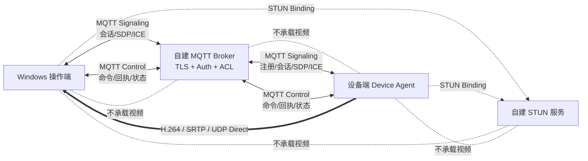
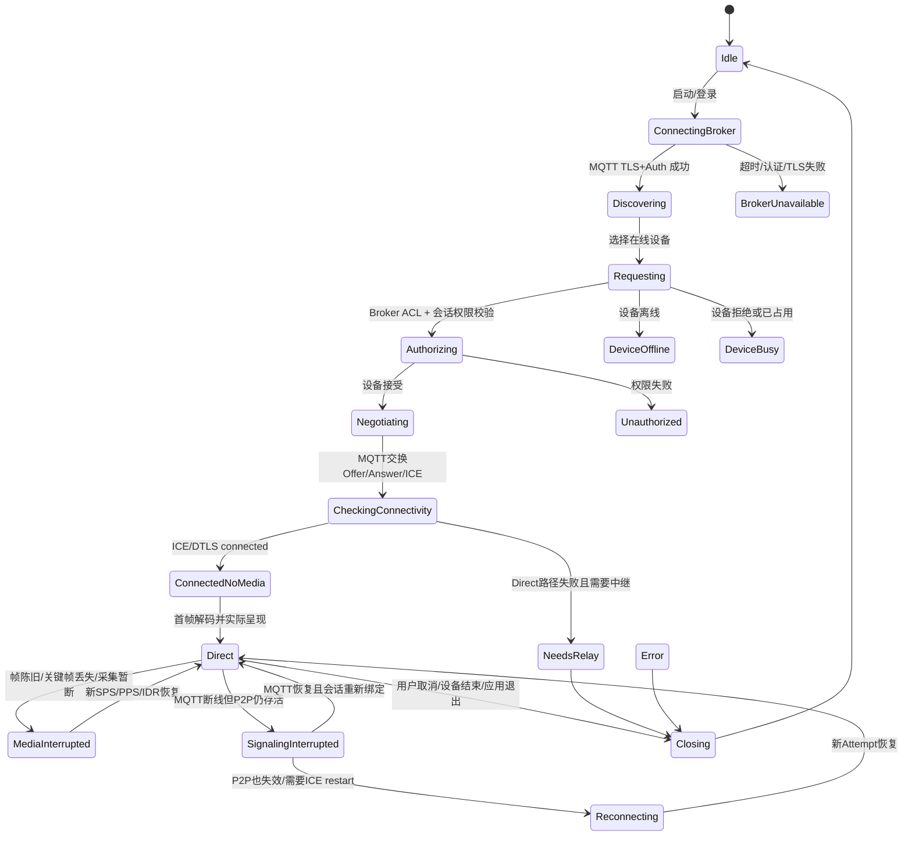

# RtmpMonitor 产品级 WebRTC Direct P2P 总体方案大纲（MQTT 信令版）

> 文档版本：Draft 2.0
> 修订日期：2026-09-01
> 依据文档：`RtmpMonitor 从零到 WebRTC 产品化前夜：全历程、现状架构与下一规划交接`
> 上一版：`RtmpMonitor 产品级 WebRTC Direct P2P 总体方案大纲 Draft 1.0`
> 文档定位：交给 GPT-5.6 Sol Ultra 继续生成 **decision-complete 的详细研发计划**。
> 本文是产品化总纲，不代表其中能力已经实现，也不替代源码、CMake、测试结果和 ADR。

---

## 修订说明

本版接受并落实以下架构判断：

> 当前操作端和设备端均为原生客户端，业务已经使用 MQTT Broker，并且当前不要求浏览器接入。WebRTC 的 Offer、Answer、trickle ICE candidate、会话请求和取消，本质上都是体量较小的临时消息，因此可以直接通过 MQTT 交换，没有必要为了信令再强制建设一套独立 WSS 协议和 WSS 服务。

但必须同时冻结一个重要边界：

> **复用 MQTT 基础设施，不等于把 WebRTC 信令逻辑塞进现有设备控制逻辑。**

新版采用：

```text
同一个 MQTT 基础设施
    ├─ MQTT 信令命名空间：设备发现、会话协商、SDP、ICE、取消与恢复
    └─ MQTT 控制命名空间：命令、回执、heartbeat、状态与遥测
```

两者可以共用 Broker、TLS、账号体系和运维设施，但必须具有独立的 topic、权限、消息模型、队列、状态机、错误码和测试。

WSS 从“第一阶段必选基础设施”调整为“未来可选适配器”。只有出现浏览器接入、独立 Web API、跨系统开放接口或需要将信令故障域与 MQTT 控制故障域彻底分离时，才重新评估 WSS。

---

## 0. 核心决策

### 0.1 最终产品目标

将 RtmpMonitor 从“以 RTMP/SRS 为稳定视频基线、WebRTC 为 Beta 能力”的过渡状态，演进为：

```text
WebRTC         = 唯一实时视频传输入口
MQTT Signaling = 自动信令、设备发现、会话协商与短期授权消息通道
MQTT Control   = 设备命令、回执、heartbeat、状态与遥测通道
STUN           = Direct P2P 地址发现服务
TURN           = 当前不实现；未来作为 Direct 失败后的公网中继兜底
WSS            = 当前不是必选项；仅保留为未来浏览器/网关适配选项
RTMP           = 完成迁移后从产品运行时、配置、UI、部署和文档中退役
SRS            = 不再是产品运行依赖
```

本文出现的“生产 MQTT”默认指 **MQTT over TLS**。本地开发环境可以使用受控回环明文连接，但公网产品不得沿用未经 TLS 保护的 MQTT 连接。

最终用户体验应收敛为：

```text
登录或取得本地授权
    → 通过 MQTT 获得在线设备
    → 选择设备
    → 点击连接
    → 通过 MQTT 自动交换会话信令
    → ICE 使用 host/STUN candidate 尝试 Direct
    → Direct P2P 出画
    → 用户显式选择并授权 MQTT 控制
```

用户不应接触 Offer、Answer、candidate、Offerer/Answerer、交换目录、STUN 地址、MQTT topic、QoS、DLL、generation 等研发概念。

### 0.2 对“MQTT 能否替代 WSS”的最终判断

在当前产品条件下，**可以替代，而且建议替代**。成立前提是：

- 操作端和设备端都能稳定连接同一个受信 MQTT 基础设施；
- 当前不要求浏览器直接参与 WebRTC 会话；
- Broker 支持 TLS、客户端认证和细粒度 topic ACL；
- 信令消息严格禁止 retained 和无限离线堆积；
- 能处理 QoS 1 重复、乱序、过期和旧会话消息；
- 信令流量与控制流量在 topic、队列、处理器和监控上隔离；
- 设备身份、操作员权限和会话授权不依赖“知道 Broker 地址就能发布消息”。

这并不意味着“信令系统消失”。被删除的是独立 WSS 传输层和 WSS 服务，不是以下产品职责：

- 设备上线与离线识别；
- 设备列表与能力描述；
- 会话请求、接受、拒绝、取消和占用仲裁；
- Offer/Answer；
- trickle ICE candidate 与 end-of-candidates；
- session/attempt/generation；
- 超时、重复、乱序、重放和晚消息拒绝；
- 身份认证、topic 授权和短期会话授权；
- Broker 断线后的恢复行为。

### 0.3 当前阶段的网络范围

当前阶段采用 **Direct P2P only**：

- 复用并产品化现有 MQTT Broker；
- 新增独立 MQTT 信令协议与客户端模块；
- 自建 STUN 服务；
- 支持局域网 host candidate 直连；
- 支持兼容 NAT 下通过 srflx candidate 建立公网 Direct；
- 支持通过 MQTT 交换 Offer/Answer 和 trickle ICE；
- 暂不实现 TURN、公网媒体中继、SFU、MCU；
- Direct 失败时进入可诊断的 `NeedsRelay` 或 `DirectUnavailable`；
- 不静默回退 RTMP；
- 不对对称 NAT、严格企业防火墙、UDP 封锁等环境承诺必然连通。

### 0.4 WSS 的新定位

第一阶段不建设独立 WSS 信令服务。WSS 仅在以下需求真实出现时重新评估：

- 浏览器需要直接参与会话；
- 第三方系统需要标准 WebSocket/API 接口；
- 需要把信令服务和设备控制 Broker 完全拆成不同故障域；
- 现有 Broker 无法提供所需认证、ACL、消息过期或审计能力；
- 需要一个集中式会话协调器执行复杂多租户、计费、排队或跨区域路由；
- MQTT 连接数、topic ACL 或消息模型在真实规模下被证明不适合。

即使未来加入 WSS，也应实现为 `ISignalingChannel` 的另一个 adapter，而不是改写 WebRTC transport、media 或产品状态机。

### 0.5 RTMP 退役原则

“最终剔除 RTMP”不等于立即删除 RTMP。退役必须是最后一个阶段，并满足：

1. WebRTC 已覆盖目标产品所需的实时视频能力；
2. 真实摄像头、真实双机、目标网络、目标设备平台完成资格验证；
3. MQTT 自动信令、身份、重连、错误诊断和安装部署成立；
4. RTMP 独有能力已经迁移、明确取消或有新的替代方案；
5. 不再需要 RTMP 作为产品 fallback；
6. 保留可审计的历史标签、测试证据和必要的离线回归 fixture。

---

## 1. 当前项目基线与产品化差距

### 1.1 已具备的可复用基础

| 基础能力 | 当前价值 | MQTT 信令版 WebRTC 产品化中的复用方式 |
| --- | --- | --- |
| H.264 Annex-B 契约 | 已隔离 transport、publisher、media | 保持为发送端、传输端、接收端之间的最窄媒体契约 |
| `WebRtcEndpointSession` | 已有真实 PeerConnection、Track、RTP、ICE 和 generation | 继续作为低层 WebRTC transport，不感知 MQTT、UI 或设备身份 |
| `EncodedVideoInputHandle` | 外部 H.264 可进入既有 FFmpeg 解码链 | 作为 WebRTC 接收媒体进入 media 的唯一窄入口 |
| Decode worker + mailbox | 有界、latest-frame-wins、低延迟 | 继续承担多路解码和呈现背压 |
| CPU/OpenGL canvas | 已支持现有网格与全屏 | WebRTC 不另建渲染体系 |
| `SessionContext` | 已支持最多四路独立会话 | 扩展为按设备组织的产品会话上下文 |
| generation/token 隔离 | 可拒绝旧 RTP、旧样本和晚 UI 事件 | 扩展到 MQTT 信令消息、连接 attempt 和自动重连 |
| MQTT 控制体系 | 已有 heartbeat、guard、回执和控制策略 | 复用 Broker 与客户端库，但不把信令塞入控制 handler |
| Paho MQTT C | 已有异步 MQTT 接入基础 | 核验 MQTT 版本、TLS、重连和 MQTT 5 能力后建立信令 adapter |
| 日志、事件、证据和诊断 | 已形成旁路观察能力 | 增加 Broker、信令、ICE、身份和设备会话事实，不记录敏感载荷 |
| Windows 打包和资格脚本 | 已有干净包和长稳基线 | 扩展为 MQTT/STUN 配置、真实设备和安全资格 |

### 1.2 当前关键缺口

| 缺口 | 对产品的影响 |
| --- | --- |
| 自动 MQTT 信令未实现 | 用户仍需手工交换文件，无法形成产品体验 |
| 当前 MQTT 是否支持 TLS 尚需核验 | 若仍是明文 MQTT，不能直接暴露到公网作为产品信令和控制通道 |
| Broker 用户、设备凭据和 topic ACL 未冻结 | 可能出现伪造设备、越权订阅、越权观看和误控 |
| MQTT 版本与会话策略未冻结 | 无法确定 Message Expiry、Session Expiry、Response Topic 等能力是否可用 |
| retained/offline queue 规则未冻结 | 旧 SDP、旧 candidate 或旧控制命令可能在重连后被错误重放 |
| QoS 与去重策略未冻结 | QoS 1 的重复交付可能重复创建 session、重复 setRemoteDescription 或污染新 attempt |
| trickle ICE 未实现 | candidate 只能整包处理，连接效率和恢复能力不足 |
| 用户/设备身份未建立 | 无法可信地选择设备、授权会话和拒绝冒用 |
| 短期授权、撤销、重放保护未实现 | 公网 Broker 上的会话请求不能仅依赖 payload 自报身份 |
| 自动重连与 ICE restart 未实现 | 网络切换或短时故障需要人工重建 |
| WebRTC 会话与 MQTT 控制 target 未统一绑定 | 存在“看的是 A、控制的是 B”的产品风险 |
| 真实摄像头和物理双机门禁未完成 | 当前不能声明真实部署可用 |
| Linux ARM64 WebRTC 未落地 | 嵌入式设备端仍缺生产路径 |
| WebRTC 音频能力未建立 | 若产品继续需要现有单向音频，RTMP 不能直接退役 |
| RTMP/SRS 相关 profile、监控、DVR PoC 尚未处理 | 删除 RTMP 前必须逐项迁移或取消 |

### 1.3 必须先审计的 MQTT 事实

GPT-5.6 Sol Ultra 在给出文件级计划前，必须从真实源码、配置和 Broker 环境确认：

- 当前使用 MQTT 3.1.1 还是 MQTT 5.0；
- Paho MQTT C 的具体版本和编译选项；
- 当前连接是明文 TCP、TLS 还是 MQTT over WebSocket；
- Broker 产品、版本和部署位置；
- 是否支持客户端证书、用户名密码、JWT/plugin 或外部认证；
- ACL 是否能按 DeviceId、UserId、ClientInstanceId 和 topic 前缀限制；
- clean start、session expiry、offline queue、inflight、retained 的当前配置；
- keepalive、LWT、最大包大小、最大 inflight、重连策略；
- 当前 `MqttDeviceClient` 是单设备、全局还是多实例模型；
- 当前控制 topic、QoS、payload schema 和消息幂等语义；
- 当前 Broker 是否允许同一 ClientId 抢占旧连接；
- 当前日志是否可能输出 Broker 凭据、topic 或消息 payload。

不能在没有核验这些事实的情况下，直接把 SDP 和 candidate 发布到现有 topic。

### 1.4 规划必须坚持的事实边界

- 当前 WebRTC 证据主要证明本机软件链和候选包，不等于全部真实网络资格；
- 当前最大 WebRTC 产品会话数是 4，不得自动写成 16；
- Windows Media Foundation 摄像头存在生产代码，但物理摄像头资格仍需补齐；
- ARM64 当前只证明 WebRTC OFF 的交叉构建，不得写成 ARM WebRTC 已支持；
- 当前 `SessionPackage` 文件信令是回归工具，不是未来产品协议；
- 删除 RTMP 后仍可能继续使用 FFmpeg 解码、像素处理或测试素材；
- 复用 MQTT Broker 不等于复用当前控制类的所有权和状态机；
- MQTT Broker 是服务器资源，因此 P2P-first 仍然不等于“零服务器”。

---

## 2. 产品范围

### 2.1 第一阶段产品支持范围

建议第一阶段正式范围为：

- 操作端：Windows x64 Qt 桌面客户端；
- 设备端：具备 H.264 编码能力的 device agent；
- 视频方向：设备端 SendOnly，操作端 ReceiveOnly；
- 编码基线：优先保持当前 1280×720、30 FPS、H.264 路线；
- 会话数：先维持当前产品已验证的最多 4 路；
- 网络：LAN Direct 与 STUN-assisted Direct；
- 信令：MQTT over TLS；
- 控制：现有 MQTT 控制通道；
- Broker 可以相同，但信令和控制逻辑隔离；
- 服务端不承载视频；
- 不要求浏览器参与会话。

具体分辨率、码率、H.264 profile/level、GOP、关键帧周期、最大会话数、目标 ARM 型号、Broker 产品和 MQTT 协议版本，应由后续详细规划根据真实环境冻结。

### 2.2 当前非目标

- 独立 WSS 信令服务；
- TURN relay；
- SFU、MCU、多人会议式拓扑；
- 一个设备同时向多个观看端广播；
- DataChannel 控车；
- 浏览器 WebRTC 互操作；
- 自动 RTMP fallback；
- 一开始重写 media/render/UI；
- 一开始引入通用协议插件总线或 God Manager；
- 把 SDP、candidate、Token、真实 endpoint 写入 profile、普通日志或 Git；
- 把 SDP/ICE 发布到 retained topic；
- 允许 Broker 为离线客户端无限保存信令和控制消息；
- 在产品门禁完成前删除 RTMP 稳定路径。

### 2.3 必须明确标识的暂不支持环境

产品必须对以下环境给出明确错误，而不是无限重试或显示模糊“连接失败”：

- symmetric NAT 导致无法 Direct；
- 企业网络阻止 UDP 或点对点流量；
- STUN 可达但 candidate pair 全部失败；
- 双方网络均不允许可用的 host/srflx 路径；
- 当前网络需要 TURN relay，而本版本尚未提供；
- MQTT Broker 不可达或 TLS/认证失败；
- Broker 在线但用户无权访问目标设备 topic；
- 设备 H.264 参数与接收端解码能力不兼容。

---

## 3. 目标系统架构

### 3.1 总体拓扑



正常 Direct 时：

```text
MQTT Broker 只交换小型信令和控制消息
STUN 只帮助发现公网映射
H.264 视频通过 WebRTC/SRTP 在设备和操作端之间直连
```

### 3.2 五个相互独立的产品平面

| 平面 | 职责 | 不得承担的职责 |
| --- | --- | --- |
| 身份与授权平面 | 用户、设备、客户端实例、Broker 凭据、topic ACL、会话授权、撤销 | 不传视频、不做解码、不直接控设备 |
| MQTT 信令平面 | presence、设备发现、会话协商、Offer/Answer、trickle ICE、取消和恢复 | 不转发媒体、不执行车辆控制、不长期保存 SDP/candidate |
| ICE/STUN 连接平面 | host/srflx candidate 收集与可达性检查 | 不等于用户授权，不承载业务状态 |
| WebRTC 媒体平面 | DTLS/SRTP/RTP、H.264 发送与接收 | 不决定 MQTT 控制权限，不直接操作 UI |
| MQTT 控制平面 | 命令、回执、heartbeat、状态、遥测 | 不传视频，不复用信令 retained/expiry 规则，不根据 tile 自动授权 |

### 3.3 “共用 MQTT”与“模块隔离”同时成立

推荐第一版采用：

```text
同一 Broker
    ├─ 独立 signaling topic namespace
    ├─ 独立 control/telemetry topic namespace
    ├─ 独立 ACL 规则
    ├─ 独立 payload schema
    ├─ 独立收发队列和速率限制
    ├─ 独立状态机和错误码
    └─ 独立诊断指标
```

客户端连接方式建议优先采用：

```text
MqttSignalingClient  → 一条长连接，负责设备目录和 WebRTC 信令
MqttDeviceClient     → 保留现有控制职责，负责命令、回执和 heartbeat
```

两者连接同一个 Broker，但不共享可变业务状态。是否进一步共享底层 Paho connection，必须在代码审计和压力测试后决定，不应为了“少一条连接”提前制造控制与信令耦合。

### 3.4 共用 Broker 的代价

选择 MQTT 取代 WSS 可以减少协议和部署单元，但会引入以下共享故障域：

- Broker 故障会同时影响新会话协商和设备控制；
- 信令消息洪泛可能与控制消息争夺连接、inflight 和处理线程；
- 错误 retained/offline queue 配置会把临时信令变成陈旧消息；
- ACL 配置错误可能同时造成越权观看和越权控制；
- ClientId 冲突可能把合法设备连接踢下线。

因此产品级方案必须提供 topic 隔离、连接/队列隔离、配额、限流、优先级策略、Broker 监控和故障演练。未来如果共享故障域不可接受，可以在不改变 `ISignalingChannel` 的前提下拆分 Broker 或增加 WSS adapter。

### 3.5 产品层组合原则

跨平面绑定只允许发生在产品组合层：

```text
DeviceSession
  = 可信 DeviceIdentity
  + 当前 WebRTC SessionContext
  + 当前 StreamId / mailbox / widget
  + 明确绑定的 MQTT Control Target
  + 当前 SessionAuthorization
  + 当前 MQTT Signaling Route
  + 视频 freshness 与设备 heartbeat
```

底层模块不得互相反向依赖：

- media 不依赖 WebRTC、MQTT 或 UI；
- `webrtc_transport` 不依赖 publisher、media、UI、MQTT；
- publisher 不依赖 transport；
- `mqtt_signaling` 不直接操作 QWidget；
- `device_control` 不解析 SDP、candidate 或 WebRTC 状态机；
- MQTT control client 不根据 UI tile 自动更换目标；
- MainWindow 不持有 PeerConnection 或 Paho client；
- diagnostics 只读取事实，不反向控制媒体和信令。

---

## 4. 产品进程与基础设施边界

### 4.1 Windows 操作端

主要职责：

- 用户登录或读取本地授权；
- 建立 MQTT signaling 连接；
- 获取设备列表、在线状态、能力和占用状态；
- 发起、取消和重建设备会话；
- 通过 MQTT 完成 Offer/Answer 与 trickle ICE；
- 创建 ReceiveOnly WebRTC endpoint；
- 把 H.264 接收样本提交到现有 media 解码链；
- 复用现有网格、全屏、事件、证据和诊断；
- 显式绑定并授权 MQTT 控制目标；
- 呈现 Direct、NeedsRelay、Unauthorized、BrokerUnavailable、DeviceBusy 等状态。

不得：

- 在 UI 线程等待 MQTT、ICE 或线程 join；
- 在 MainWindow 内管理 PeerConnection 或 Paho 生命周期；
- 仅以 MQTT connected 或 PeerConnection connected 判断视频可用；
- 根据当前选中的 tile 静默切换 MQTT control target；
- 订阅超出当前用户权限的设备通配 topic。

### 4.2 设备端 Device Agent

主要职责：

- 使用设备唯一凭据建立 MQTT over TLS 长连接；
- 使用稳定 `DeviceId` 发布 birth/presence/capabilities；
- 配置 LWT，使异常断线可以被识别；
- 接受经过 Broker ACL 和会话授权校验的观看请求；
- 创建 SendOnly PeerConnection；
- 通过 source adapter 获取 H.264 AU；
- 执行 pacing、SPS/PPS/IDR 恢复和关键帧请求策略；
- 发布会话占用、错误、heartbeat 和遥测；
- MQTT 断线后自动重连并拒绝旧 session/attempt；
- 在退出、网络切换和采集失败时确定性收尾。

不得：

- 使用所有设备共用的 Broker 超级账号；
- 接受 payload 中自称合法、但 topic/凭据无权访问的任意 Offer；
- 保存远端 SDP、candidate 或短期授权；
- 将 SDP、candidate 或 session token 发布为 retained；
- 使用无界摄像头帧队列；
- 一个全局 PeerConnection 服务所有会话；
- 把设备控制改为 DataChannel。

### 4.3 MQTT Broker

第一版可以继续使用现有 Broker，但必须新增或核验以下产品能力：

- TLS 终止与严格证书校验；
- 每设备唯一凭据或设备证书；
- 每操作端用户/实例可审计凭据；
- topic ACL；
- ClientId 唯一性和抢占策略；
- 最大 payload、最大 inflight、连接数和速率限制；
- retained、offline queue、session expiry 和 LWT 策略；
- 认证失败、ACL 拒绝、连接踢除和异常发布的审计；
- 健康检查、指标、日志和备份；
- 开发、测试、预发布和生产环境隔离。

Broker 不得：

- 转发视频或音频；
- 把全部消息持久化为业务数据库；
- 允许匿名公网连接；
- 允许普通用户订阅所有设备的 signaling/control 通配 topic；
- 为 Offer、Answer、candidate、session token 建立 retained 消息；
- 为断线客户端无限保存临时信令。

### 4.4 身份与会话授权来源

删除 WSS 服务后，必须明确由谁回答“用户能否观看/控制设备”。可选方案包括：

#### 方案 A：Broker 身份与 ACL 作为第一版权威

- 用户/设备登录 Broker 时已经完成认证；
- ACL 决定其可发布和订阅哪些设备 topic；
- device agent 对单会话占用和 request/accept 负责；
- sessionId、attemptId 和随机 nonce 防止旧消息复活；
- 适合用户规模较小、授权关系相对静态的第一版。

#### 方案 B：增加独立身份/会话权威服务

- 负责用户、组织、设备授权和短期 session grant；
- 通过 MQTT 或管理 API 与客户端协作；
- Broker 继续只做消息路由和 ACL；
- 适合动态多租户、复杂授权、设备共享或审计需求。

GPT-5.6 Sol Ultra 必须根据现有账号体系和 Broker 能力选择，不得把“删除 WSS”误写成“无需身份服务”。

### 4.5 STUN 服务

当前阶段只承担：

- 为设备端和操作端提供 srflx candidate；
- 作为 Direct P2P 网络诊断的一部分；
- 提供健康检查、基础指标和访问控制策略；
- 与 MQTT Broker 分进程、分职责部署。

可以使用 Coturn 的 STUN 能力，但本阶段必须明确 TURN relay 未启用、未承诺、未纳入通过条件。

### 4.6 WSS 可选适配器

当前不实现。未来如需要浏览器，可以选择：

- Broker 原生 MQTT over WebSocket Secure；
- 浏览器到 MQTT 的受控网关；
- 独立 WSS signaling adapter。

无论选择哪一种，都不得修改 WebRTC transport 的 H.264/ICE 契约，也不得让浏览器接口反向进入 media 和 UI。

---

## 5. MQTT 信令协议大纲

### 5.1 设计目标

MQTT 信令协议必须做到：

- 自动完成设备发现、会话建立和 ICE 交换；
- 不依赖 retained SDP/candidate；
- 不依赖 Broker 对离线客户端长期排队；
- 能识别 QoS 1 重复交付；
- 能拒绝过期、乱序、跨会话和晚消息；
- 能处理 candidate 早于 remote description；
- 能在 Broker 重连后确定是恢复、ICE restart 还是完整新建；
- 不让 signaling handler 直接驱动 UI 或 media；
- 对普通日志和事件系统隐藏 SDP、candidate、凭据和真实地址。

### 5.2 topic 命名空间原则

建议使用版本化、用途明确的 topic root。最终名称由代码审计和产品重命名决定，以下仅表达结构：

```text
{root}/v1/presence/device/{deviceId}
{root}/v1/capabilities/device/{deviceId}

{root}/v1/signaling/device/{deviceId}/inbox
{root}/v1/signaling/operator/{clientInstanceId}/inbox

{root}/v1/control/device/{deviceId}/command
{root}/v1/control/device/{deviceId}/receipt
{root}/v1/telemetry/device/{deviceId}/heartbeat
{root}/v1/telemetry/device/{deviceId}/{metric}
```

建议使用稳定 inbox topic，而不是为每条 candidate 动态创建不可控 topic。`SessionId` 和 `AttemptId` 放入版本化消息 envelope 中完成路由。

详细计划必须比较并冻结：

- 稳定 inbox topic；
- 每 session 临时 topic；
- MQTT 5 Response Topic + Correlation Data；
- Broker 动态 ACL 能力；
- 当前 Paho/Broker 对 MQTT 5 的支持。

无论采用哪一种，客户端都不得相信 payload 中任意填写的 `source`、`target` 或 `replyTopic`，必须结合认证身份和 ACL 校验。

### 5.3 signaling envelope

建议每条信令 payload 至少包含：

```text
schemaVersion
messageId
messageType
sentAtUtc
expiresAtUtc 或 ttlMs
sourceIdentity
sourceClientInstanceId
targetIdentity
sessionId（按消息类型可选）
attemptId（按消息类型可选）
correlationId（按消息类型可选）
sequence（需要有序语义时可选）
authorizationProof 或 sessionNonce（按授权方案可选）
payload
```

Broker topic 提供第一层路由与授权，envelope 提供第二层会话归属和幂等校验。两层必须一致；不一致时拒绝并审计。

### 5.4 消息族

#### 设备 presence 与能力

- `device.birth`
- `device.presence`
- `device.capabilities`
- `device.busy`
- `device.offline`（通常由 LWT 表达）

#### 产品会话

- `session.request`
- `session.accept`
- `session.reject`
- `session.cancel`
- `session.cancelled`
- `session.timeout`
- `session.closed`

#### WebRTC 协商

- `webrtc.offer`
- `webrtc.answer`
- `webrtc.ice_candidate`
- `webrtc.ice_complete`
- `webrtc.restart_requested`
- `webrtc.restart_accepted`
- `webrtc.protocol_error`

#### 确认与诊断

- `message.ack`
- `message.rejected`
- `session.peer_state`
- `session.media_state`
- `session.direct_failed`

服务端或对端不应依赖客户端上报来判断真实画面已呈现；`Direct` 的最终判定仍在本地产品层完成。

### 5.5 QoS、retained、expiry 与 session 策略

必须形成消息类别表，建议基线如下：

| 消息类别 | QoS 建议 | retained | 过期策略 | 说明 |
| --- | ---: | --- | --- | --- |
| device presence | 1 | 可使用 | 必须有 TTL/heartbeat 校验 | 使用 birth + retained LWT 时需防止永久僵尸在线 |
| device capabilities | 1 | 可使用 | 版本化并允许过期 | 不能把动态 session 状态混入长期能力消息 |
| session request/accept/reject | 1 | 禁止 | 短 TTL | 重复必须幂等，过期后不得创建会话 |
| session cancel/closed | 1 | 禁止 | 短 TTL | 重复关闭安全 |
| Offer/Answer | 1 | 禁止 | 短 TTL | 不得在重连后应用到新 attempt |
| ICE candidate | 1 为默认 | 禁止 | 更短 TTL | 接受重复，按 messageId/candidate key 去重 |
| end-of-candidates | 1 | 禁止 | 短 TTL | 幂等 |
| ICE restart | 1 | 禁止 | 短 TTL | 必须生成新 AttemptId |
| control command | 沿用控制设计 | 通常禁止 | 由安全策略决定 | 不得因为信令方案变化而降低控制安全 |
| telemetry | 0/1 按用途 | 按现有策略 | 有界 | 与信令处理器隔离 |

生产硬规则：

- Offer、Answer、candidate、session token、控制命令不得 retained；
- 信令订阅默认不依赖无限持久 session；
- MQTT 5 可优先使用 Message Expiry Interval；
- 若使用 MQTT 3.1.1，必须通过 `sentAtUtc + ttlMs + AttemptId` 在应用层拒绝陈旧消息；
- reconnect 后不得无条件消费 Broker 保存的旧信令；
- retained store 中不得出现 SDP、candidate 或短期授权；
- 资格测试必须主动注入错误 retained 消息和旧 offline queue，证明客户端拒绝。

### 5.6 重复、乱序和早到 candidate

MQTT QoS 1 是至少一次交付，因此必须假定消息可能重复。

产品语义应为：

- `messageId` 去重；
- `session.request` 重复只返回同一既有结果；
- `setRemoteDescription` 不因重复 Offer/Answer 被再次执行；
- candidate 重复安全；
- candidate 早于 remote description 时进入有界暂存；
- 暂存按 `SessionId + AttemptId` 隔离；
- 达到条数、字节或时间上限后稳定拒绝；
- 不依赖不同 topic 之间的全局顺序；
- Broker reconnect、网络抖动和多发布者情况下仍以状态机和 ID 判定合法性；
- 旧 AttemptId 的任何消息不得改变当前 endpoint。

### 5.7 topic ACL 基线

至少满足：

- 设备只能发布自己的 presence、capabilities、telemetry 和 signaling reply；
- 设备只能订阅自己的 signaling inbox 和被授权的 control command；
- 操作端只能订阅当前用户有权访问的 presence/signaling route；
- 操作端不能订阅其他租户或所有设备的控制命令；
- 普通用户不能伪造其他 DeviceId 的 presence；
- payload 中的 DeviceId 必须与认证身份和 topic 路径一致；
- 禁止使用共享 root/admin 凭据运行产品客户端；
- topic 中的动态 ID 必须经过严格字符集和长度校验，防止通配符和 topic 注入；
- Broker ACL 修改、拒绝和异常通配订阅应进入审计。

### 5.8 SDP、candidate 与授权材料处理

- 只在内存中处理；
- 不进入普通日志；
- 不进入 retained store；
- 不进入离线长期队列；
- 不进入事件详情、崩溃报告、profile 或 Git；
- debug build 默认也不输出全文；
- 只记录 message type、大小、方向和短非敏感 ID；
- candidate 中的 IP、端口和网络拓扑不得出现在用户可见日志；
- 受控诊断模式必须显式开启、自动过期并限制访问。

---

## 6. 核心身份、ID 与生命周期模型

### 6.1 必须区分的 ID

| ID | 含义 | 生命周期 | 禁止混用 |
| --- | --- | --- | --- |
| `UserId` / `OperatorId` | 操作员身份 | 长期 | 不等于本机客户端实例 |
| `DeviceId` | 设备持久身份 | 长期 | 不等于 `StreamId` 或 MQTT ClientId |
| `ClientInstanceId` | 一次安装或一次运行实例 | 中期/运行期 | 不等于用户身份 |
| `MqttClientId` | Broker 连接客户端标识 | 单连接配置 | 不直接作为业务授权唯一依据 |
| `BrokerConnectionEpoch` | 一次 MQTT 成功连接代次 | 单连接 | 重连后必须变化 |
| `SessionId` | 一次逻辑观看会话 | 单会话 | 不等于某次 ICE attempt |
| `AttemptId` | 一次连接、ICE restart 或重建尝试 | 单 attempt | 新 attempt 必须隔离旧 candidate |
| endpoint generation | PeerConnection/Track 代次 | 单 endpoint | 不与 media generation 合并 |
| media generation | 外部解码输入代次 | 单 decode ingress | 不与产品 token 合并 |
| product token | `SessionContext` 生命周期身份 | 单产品上下文 | 防止晚 UI/runtime 事件污染新会话 |
| `StreamId` | 本地运行期画面身份 | 单应用运行期 | 不作为设备持久身份 |
| `MqttControlTargetId` | MQTT 控制目标 | 持久或运行期 | 不根据 `StreamId` 自动推断 |
| `MessageId` | MQTT 信令消息幂等身份 | 单消息 | 不替代 session/attempt ID |
| `CorrelationId` | 请求与响应关联 | 单交互 | 不作为授权凭据 |

### 6.2 会话授权语义

详细计划必须冻结一种最小可用模型：

1. 设备使用唯一 Broker credential 或客户端证书证明 `DeviceId`；
2. 操作端使用用户或安装实例凭据连接 Broker；
3. Broker ACL 限制可访问的设备 signaling/control topic；
4. 操作端创建 `SessionId + AttemptId + nonce` 发起请求；
5. device agent 或会话权威返回 accept/reject；
6. 后续 Offer/Answer/candidate 必须绑定同一会话和 attempt；
7. 会话结束、撤销或超时后 nonce/授权不得用于新协商；
8. 重放旧 Offer、candidate 或 accept 不得复活已关闭会话。

Token 可以是 JWT、PASETO、opaque grant 或仅在强 Broker ACL 下使用随机 session nonce。具体形式由详细计划根据账号体系和密钥管理决定；本文冻结的是授权语义。

### 6.3 generation 原则

- MQTT 每次重连产生新的 `BrokerConnectionEpoch`；
- reconnect 后旧订阅回放消息必须经过 TTL、SessionId 和 AttemptId 校验；
- ICE restart 至少产生新的 `AttemptId`；
- 完整 PeerConnection 重建产生新的 endpoint generation；
- decoder 重建产生新的 media generation；
- UI/slot 重建产生新的 product token；
- 所有异步回调到达 owner thread 时重新查找当前上下文；
- 旧消息只能丢弃和计数，不能修改新会话状态。

---

## 7. 产品会话状态机大纲

### 7.1 操作端主状态

建议至少区分：

```text
Idle
ConnectingBroker
Discovering
Authorizing
Requesting
Negotiating
CheckingConnectivity
ConnectedNoMedia
Direct
MediaInterrupted
SignalingInterrupted
Reconnecting
NeedsRelay
Unauthorized
DeviceOffline
DeviceBusy
BrokerUnavailable
Error
Closing
```

`Direct` 必须继续满足：

```text
PeerConnection connected
AND selected pair 为 non-relay
AND 存在有效 StreamId
AND H.264 已解码
AND 画面已实际 presented
AND presented frame age 不超过产品阈值
```

MQTT Broker connected 只表示消息通道可用，不代表 WebRTC 已建立、画面已呈现或控制已授权。

### 7.2 简化状态流程



### 7.3 MQTT 断线时的推荐策略

- 已建立的 Direct P2P 视频可以在短暂 Broker 抖动时继续显示；
- MQTT 控制应立即进入 `Suspended`，因为命令、回执和 heartbeat 通道不可用；
- 不得因为 Broker 断线立即把仍在正常呈现的画面标为视频断开；
- UI 应分别显示“视频仍在直连”和“消息/控制服务中断”；
- Broker 恢复后必须重新认证并恢复当前 session route；
- 如果 ICE 仍有效，不必无条件重建 PeerConnection；
- 如果需要新的 candidate 或 ICE restart，则创建新 `AttemptId`；
- 超过会话授权或恢复窗口仍未恢复时，关闭会话并重新建立。

### 7.4 必须在详细计划中冻结的异常行为

- Broker 重启后 retained presence 和 LWT 如何恢复；
- Broker 断线期间旧信令是否被排队；默认建议不排队或使用短 expiry；
- 设备与操作端同时重连时如何避免双方各自创建新 session；
- Token/session nonce 在视频进行中到期时如何处理；
- 设备忙碌时是否排队；默认第一版直接返回稳定错误；
- 双方同时发起协商时如何仲裁；
- candidate 早到、重复、乱序和超时如何处理；
- 摄像头短暂失效时保持 PC、请求关键帧还是完整重建；
- `NeedsRelay` 后是否允许手动重试 Direct；
- ClientId 被重复登录或抢占时如何保护设备会话。

---

## 8. 现有 C++ 架构的演进方向

> 下列模块名是建议映射。GPT-5.6 Sol Ultra 必须先核验真实 target、headers、CMake links 和对象所有权，再给出最终文件级变更。

### 8.1 保持不变或尽量不变的模块

| 模块 | 处理原则 |
| --- | --- |
| `rtmp_monitor_h264_contracts` | 保持协议无关，不加入 MQTT、DeviceId 或 UI 字段 |
| media | 继续负责解码、worker、mailbox 和媒体指标，不依赖 WebRTC/MQTT |
| render / video_canvas | 继续复用现有画布、纹理和呈现事实 |
| ui | 只显示产品状态和发出用户意图，不管理 PC 或 Paho 线程 |
| `device_control` / `control_policy` | 保持控制策略独立，不解析信令消息 |
| event_center / evidence / diagnostics | 扩展观察事实，不反向驱动媒体或信令 |

### 8.2 WebRTC 与信令模块演进

| 当前模块 | 建议演进 |
| --- | --- |
| `webrtc_signaling` 文件包 | 保留 codec/store 作为 deterministic fixture；不作为产品协议 |
| `webrtc_transport` | 增加本地 candidate 回调、远端 candidate 注入、ICE restart/重建 seam；不依赖 MQTT |
| `webrtc_runtime` | 从“等待文件”演进为依赖窄 `ISignalingChannel` 的一路会话 runtime |
| `webrtc_product` | 按 DeviceId 管理 `SessionContext`，组合 identity、signaling、transport、media、UI |
| `h264_publisher_source` | 继续提供 MP4/MF source；设备 source adapter 保持兄弟边界 |
| `ApplicationBootstrap` | 创建 MQTT signaling、control、device directory、session controller 和 WebRTC product |

### 8.3 建议新增的概念模块

- `signaling_contracts`：envelope、message types、错误码、版本、TTL 和 ID；
- `signaling_channel`：窄接口，不携带 MQTT/Paho 类型；
- `mqtt_signaling`：topic codec、publish/subscribe、重连、QoS、去重和消息过期；
- `mqtt_identity` 或 auth adapter：连接身份和 ACL 相关配置；
- `device_directory`：presence、capability、busy 和设备选择；
- `identity_contracts`：用户、设备、客户端实例和会话授权值对象；
- `device_session`：DeviceId、WebRTC、StreamId、MQTT control target 和授权聚合；
- `device_agent`：设备端组合根；
- `runtime_config`：MQTT/STUN/证书配置，不进入 SavedStream schema。

### 8.4 `ISignalingChannel` 建议能力

接口应保持窄而具体，不演变为通用协议插件框架。可表达：

```text
connect(identity, credentials)
disconnect()
publish(SignalingMessage)
subscribe(route)
unsubscribe(route)
setMessageHandler(...)
setConnectionStateHandler(...)
snapshot()
```

不得暴露：

- Paho 原始 callback 给 WebRTC runtime；
- raw MQTT topic 给 UI；
- PeerConnection 给 signaling adapter；
- QWidget 给 MQTT 线程；
- 控制命令接口给 signaling channel。

文件 `SessionPackage` 可以实现测试专用 adapter，MQTT 是产品 adapter；未来 WSS 如有必要也只是另一个 adapter。

### 8.5 MQTT signaling 与现有 control client 的关系

推荐第一版：

- 保留现有 `MqttDeviceClient` 的控制语义；
- 新建 `MqttSignalingClient`；
- 两者连接相同 Broker；
- 分别拥有 connection epoch、队列、重连和指标；
- 产品层通过 `DeviceSession` 组合二者事实；
- 不让 `MqttDeviceClient` 演变为同时管理设备目录、SDP、ICE、控制、遥测和 UI 的 God Client。

若后续证据表明两个 Paho connection 成本不可接受，可在更低层增加共享 `MqttConnectionService`，但上层 signaling/control 接口仍保持分离。

### 8.6 线程与回调边界

| 上下文 | 主要职责 |
| --- | --- |
| Qt UI 主线程 | UI、controller、产品状态投影 |
| MQTT signaling I/O/callback | 收发信令、连接状态、有界复制消息 |
| MQTT control callback | 回执、heartbeat、遥测的有界复制 |
| signaling owner/session worker | schema 校验、去重、TTL、状态机、超时和路由 |
| libdatachannel 内部回调 | ICE、Track、RTP 底层事件 |
| camera capture/encode worker | 采集、编码、H.264 AU 输出 |
| decode worker pool | H.264 解码 |
| evidence worker pool | 截图、catalog、导出 |

任何跨线程事件都应转换为值对象，并按 `DeviceId + SessionId + AttemptId + token/generation` 在 owner thread 重新查找上下文。

### 8.7 关闭顺序

单路会话建议固定为：

```text
1. 产品层把 SessionContext 标记 Closing，并使 product token 失效
2. 从 UI、MQTT control route 和 active device route detach
3. 停止接受当前 SessionId/AttemptId 的新 MQTT signaling 消息
4. 发布 session.cancel/session.closed（Broker 可用时）
5. 请求 WebRTC endpoint beginClose
6. 使 endpoint generation 失效，拒绝晚 RTP/candidate
7. 锁外等待 session worker 收敛
8. 关闭 EncodedVideoInputHandle，使 media generation 失效
9. 清 mailbox 与 freshness
10. 移除 widget / StreamId
11. 取消临时订阅并清理去重/暂存状态
12. 释放 context
```

应用退出时：先拒绝新会话，再批量停止全部 context，随后停止 control/signaling client，统一 join 和释放，最后执行 WebRTC 全局 cleanup。

---

## 9. Direct P2P 网络策略

### 9.1 candidate 策略

当前阶段允许：

- host candidate；
- STUN 得到的 srflx candidate；
- non-relay selected pair；
- 通过 MQTT 交换 trickle ICE；
- end-of-candidates；
- ICE restart 或完整 endpoint 重建。

当前阶段不允许：

- relay candidate；
- 伪装为 Direct 的服务器代理；
- 把 MQTT Broker 当媒体隧道；
- 未经配置的公共 STUN 作为产品默认；
- 在普通日志或 MQTT retained store 中输出 candidate 地址。

### 9.2 连接策略

- 优先尝试 host/局域网直连；
- 同时或随后使用自建 STUN 的 srflx candidate；
- candidate gathering 和 connectivity check 有明确超时；
- selected pair 只记录地址无关类型和 transport；
- non-relay selected pair 是 Direct 必要条件，不是充分条件；
- 只有真实 decoded/presented freshness 成立才进入 Direct；
- ICE Failed 且有 srflx 事实时可进入 `NeedsRelay`；
- STUN 不可用时区分 `StunUnavailable`、`NoSrflx` 和普通 ICE 失败；
- 不无限重试；
- 用户主动重试创建新 `AttemptId`。

### 9.3 MQTT 与已建立媒体的关系

必须明确：

- MQTT 负责会话协商，不承载已建立的 WebRTC 视频；
- Broker 短时中断不必立即停止仍然健康的 Direct 视频；
- Broker 中断期间不能开始新会话或交换新 candidate；
- control 通道同时受影响，控制必须安全暂停；
- Broker 恢复后重新认证和恢复 session route；
- 若 Direct 仍存活，只恢复信令/控制状态；
- 若 Direct 已失效，创建新 attempt 进行 ICE restart 或完整重建；
- 旧 Broker connection 的晚消息必须拒绝。

### 9.4 网络切换与恢复

至少覆盖：

- Wi-Fi 短时断开恢复；
- 有线与 Wi-Fi 切换；
- NAT 映射变化；
- STUN 暂时不可达；
- Broker 重启但 P2P 仍存活；
- P2P 失效但 Broker 存活；
- Broker 和 P2P 同时失效；
- candidate 乱序和旧 candidate 到达；
- ICE restart 失败后完整重建；
- 设备端 IP 变化；
- 操作端休眠和唤醒；
- MQTT ClientId 抢占或重复登录。

---

## 10. 设备端媒体发布大纲

### 10.1 Source Adapter 原则

设备侧 source 只负责输出：

```text
H264AccessUnit
  - Annex-B
  - 媒体时间戳
  - keyframe 标记
  - 受控大小
```

不得把 DeviceId、MQTT topic、PeerConnection、控制状态或 session token 塞进 H.264 AU。

### 10.2 H.264 产品基线需要冻结的参数

详细计划必须核验并冻结：

- 分辨率和 FPS；
- profile/level；
- Annex-B start code；
- SPS/PPS 注入策略；
- IDR 周期；
- B-frame 是否允许；
- packetization-mode；
- 最大 AU 大小；
- 时间戳时基；
- 码率上限和网络自适应策略；
- 采集失败后的恢复；
- 关键帧请求或主动 IDR 机制；
- ARM 硬件编码器输出兼容性。

### 10.3 设备端会话仲裁

第一版建议一个设备同时只允许一个操作员观看或控制。device agent 和授权体系共同处理：

- 设备空闲；
- 设备正在被观看；
- 当前用户拥有会话；
- 其他用户请求；
- 超时占用释放；
- Broker 异常断线清理；
- 同一用户多个客户端实例；
- 只读观看与控制权限的区别。

### 10.4 ARM64 产品路径

若真实设备是 Linux ARM64，详细计划必须单独形成：

- libdatachannel ARM64 构建和运行时依赖；
- Paho MQTT TLS/证书依赖；
- 目标 sysroot 与编译链；
- V4L2、厂商 SDK 或已有编码器接入；
- H.264 Annex-B 合规测试；
- CPU、内存、温度、码率和持续运行门槛；
- 断网、Broker 重连、设备重启、升级和 watchdog；
- 安装包、服务脚本、证书和日志目录；
- 真机资格，而不是只做交叉构建。

---

## 11. 多设备、多路与资源边界

### 11.1 第一版并发策略

- 每设备一个独立 `SessionContext`；
- 每路独占 PeerConnection、Track、attempt、endpoint generation、media generation、product token、mailbox 和 widget；
- 首版最多 4 路；
- 第五路稳定返回 `capacity_reached`；
- 一路失败、取消、重建或摄像头异常不得停止其他路；
- 不引入全局 currentSession、currentDevice 或 currentGeneration。

### 11.2 有界资源原则

必须定义：

- MQTT signaling publish queue；
- MQTT signaling receive queue；
- 单消息最大字节；
- 单设备/单用户每秒信令数量；
- QoS inflight 数量；
- messageId 去重缓存大小和 TTL；
- 未应用 candidate 暂存数量和字节数；
- retained presence 数量；
- Broker offline queue/session expiry；
- H.264 AU 大小；
- transport/decode queue；
- mailbox capacity 1；
- UI pending removal；
- event/evidence 任务；
- session 数量；
- 重试次数和重连预算。

过载时优先拒绝新会话、丢弃过期信令或旧实时数据，不能无界排队。

### 11.3 信令和控制的资源隔离

因为同一 Broker 同时承担信令和控制，必须防止 SDP/candidate 洪泛影响停车或关键控制回执：

- signaling 和 control 使用不同 client/队列或明确优先级；
- 独立速率限制；
- 独立最大 payload；
- 独立 inflight/重试策略；
- control handler 不等待 signaling 状态机；
- signaling handler 不持有 control mutex；
- 压力测试中证明候选洪泛不会显著增加控制指令延迟；
- 必要时使用 Broker 独立 listener、账号组、vhost/namespace 或最终拆分 Broker。

### 11.4 从 4 路扩展到 16 路的条件

完全退役 RTMP 前必须做出显式决策：

```text
A. 正式产品只需要最多 4 路，RTMP 的 16 路能力被有意识取消；
或
B. WebRTC 必须扩展并资格验证到 16 路后，才允许 RTMP 退役。
```

不得只修改容量常量而不验证设备上行、Broker 信令峰值、接收端解码和渲染。

---

## 12. MQTT 信令与 MQTT 控制的产品级共存

### 12.1 相同之处

二者都可以复用：

- 同一个 Broker；
- TLS 证书和域名；
- Paho MQTT C；
- 连接健康监控；
- 用户/设备身份体系；
- 部署、升级和运维工具。

### 12.2 必须分开的部分

| 项目 | MQTT Signaling | MQTT Control |
| --- | --- | --- |
| 业务目的 | 建立/恢复 WebRTC 会话 | 操作设备并获得回执 |
| 消息生命周期 | 秒级临时 | 按控制安全语义 |
| retained | SDP/ICE 严禁 | 通常命令也禁止，状态按设计 |
| offline queue | 默认禁用或极短 expiry | 必须防止陈旧控制命令 |
| 幂等键 | MessageId/SessionId/AttemptId | CommandId/控制序号 |
| 状态机 | 请求、协商、ICE、关闭 | Locked、Armed、Moving、Suspended |
| 敏感信息 | SDP、candidate、session grant | 命令、目标、权限、回执 |
| 错误处理 | 重协商/NeedsRelay | 拒绝/停车/安全暂停 |
| 处理模块 | `mqtt_signaling` | `device_control` |

### 12.3 DeviceSession 绑定要求

必须由产品层显式建立：

```text
DeviceId
↔ 当前 WebRTC SessionId / StreamId
↔ 当前 MQTT Control TargetId
↔ 当前 UserId / SessionAuthorization
↔ 当前 MQTT Signaling Route
```

绑定来自可信身份、ACL 和本地明确选择，不根据显示名称、topic 字符串或 tile 顺序猜测。

### 12.4 控制安全不变量

- MQTT signaling 已连接不授予控制；
- WebRTC `Connected` 不授予控制；
- WebRTC `Direct` 也不自动授予控制；
- 用户必须显式选择目标并 Armed；
- tile 切换不得静默切换 control target；
- 视频陈旧、heartbeat 超时、control MQTT 断开、授权失效、会话切换、窗口失焦和应用退出均使控制失效；
- Broker 故障时立即暂停控制；
- 必要时发送停车命令，但不得在连接恢复后重放陈旧停车以外的运动命令；
- 旧 SessionId 的控制意图不得作用到新会话；
- 只读观看用户不得发布控制命令。

### 12.5 UI 上的多状态

至少分开呈现：

```text
消息服务：Online / Reconnecting / Unauthorized / Offline
视频：Negotiating / Direct / Interrupted / NeedsRelay / Offline
控制：Locked / Armed / Moving / Suspended / Unauthorized
设备：Online / Busy / HeartbeatTimeout / Offline
```

不能用一个绿色“已连接”同时代表 Broker、WebRTC、设备在线和控制授权。

---

## 13. 产品 UI/UX 大纲

### 13.1 主流程

- 登录或读取本地授权；
- 连接 MQTT 消息服务；
- 查看设备列表；
- 显示在线、离线、忙碌、无权限和能力；
- 点击设备连接；
- MQTT 自动协商；
- ICE/STUN 建立 Direct；
- 网格出画；
- 显式选择控制目标；
- Armed 后允许操作；
- 一键断开；
- 错误可恢复或给出明确原因。

### 13.2 用户可见状态

- 正在连接消息服务；
- 消息服务认证失败；
- 设备离线；
- 无权访问；
- 设备正在被其他会话使用；
- 正在请求设备会话；
- 正在交换 WebRTC 信令；
- 正在建立 P2P；
- 已建立 Direct P2P；
- 已连接但等待视频关键帧；
- 视频暂时中断，正在恢复；
- 视频仍在直连，但消息/控制服务暂时中断；
- 当前网络需要中继，本版本暂不支持；
- STUN 服务不可用；
- 摄像头或编码器故障；
- 控制通道未连接；
- 设备 heartbeat 超时；
- 控制未授权；
- 已达到最大会话数。

### 13.3 用户不应看到的内容

- Offer/Answer；
- candidate；
- IP/端口映射；
- MQTT topic；
- QoS、retained、session expiry；
- PeerConnection 原始状态枚举；
- Token/session nonce；
- generation；
- libdatachannel/FFmpeg/Paho/Qt DLL 细节；
- 交换文件目录；
- “请手动复制 JSON”。

### 13.4 高级诊断页

可提供脱敏诊断：

- Broker 连接状态与 connection epoch；
- MQTT 协议版本和 TLS 状态；
- signaling/control subscription 是否就绪；
- 设备 presence 年龄；
- 信令发送/接收/重复/过期/拒绝计数；
- ICE gathering/checking；
- host/srflx 是否观察到；
- selected pair 类型和 UDP/TCP；
- RTP/AU/decoded/presented 计数；
- presented frame age；
- transport/decode queue；
- drop 和恢复计数；
- session/attempt 的短非敏感标识；
- control、heartbeat 和 guard 状态。

不得显示真实 topic 权限、SDP、candidate 地址、Broker 密码或 Token。

---

## 14. 安全与威胁边界

### 14.1 需要保护的资产

- 设备身份和 Broker 凭据；
- 操作员身份和权限；
- topic ACL；
- session authorization/nonce；
- SDP、candidate 和网络拓扑；
- 视频会话访问权；
- MQTT 控制权；
- MQTT/STUN endpoint；
- 设备列表和在线状态；
- 事件、证据和日志中的客户信息。

### 14.2 必须覆盖的威胁

- 伪造 DeviceId；
- 冒用操作员；
- 所有设备共用一套账号；
- 通配符越权订阅；
- 发布到其他设备 topic；
- MQTT ClientId 抢占；
- 重放旧 Offer、candidate、accept 或控制命令；
- retained SDP/candidate 污染；
- offline queue 在重连后交付旧消息；
- QoS 1 重复导致重复会话；
- 会话劫持；
- 越权观看和越权控制；
- signaling 洪泛拖慢控制；
- 超大/畸形 JSON；
- topic 注入和通配符字符；
- TLS 降级或证书校验关闭；
- 日志泄漏 SDP、candidate、凭据和真实地址；
- 一个用户连接设备 A 后控制设备 B；
- 设备断线后旧 session 复活；
- Broker 重启后僵尸在线/占用；
- 本地配置被普通用户篡改。

### 14.3 最小安全控制

- 生产仅允许 MQTT over TLS；
- 严格证书校验；
- 每设备唯一凭据，禁止共享超级账号；
- 操作端身份可审计；
- topic ACL 最小权限；
- ClientId 生成、绑定和冲突策略明确；
- session 授权绑定 UserId、DeviceId、SessionId、AttemptId、用途和过期；
- MessageId、TTL 和 AttemptId 防重复/重放；
- 所有消息有大小、字段数和字符串长度边界；
- Offer/Answer/candidate/控制命令 retained=false；
- signaling offline queue 禁用或严格过期；
- 设备端只接受被授权的会话；
- 普通日志全链路脱敏；
- 敏感配置不进入 Git、示例包或崩溃转储；
- 生产配置和示例配置分离；
- 控制继续采用显式 guard；
- Broker 按账号、ClientId、topic、连接和速率审计。

### 14.4 需要详细计划作出的安全决策

- 设备首次注册/配网；
- 用户账号来源；
- Broker 认证插件或外部认证；
- MQTT 5 是否强制；
- token/session nonce 形式；
- 是否采用 mTLS；
- 证书签发、更新、吊销和轮换；
- 设备丢失后的吊销；
- 多租户/组织隔离；
- 审计日志保留；
- 本地凭据使用系统密钥库还是加密文件；
- Broker 高可用是否进入第一版。

---

## 15. 服务端部署与运维大纲

### 15.1 第一版最小部署单元

```text
1. MQTT Broker（现有基础设施，补齐 TLS/Auth/ACL/监控）
2. STUN 服务
3. TLS 证书、设备凭据和操作员凭据管理
4. 健康检查、指标和日志收集
5. 可选的身份/会话权威服务（仅当 Broker ACL 无法满足业务授权时）
```

不再把独立 WSS signaling service 列为第一阶段必选部署单元。

### 15.2 Broker 第一版原则

- 单节点可作为第一阶段起点；
- 连接、订阅、retained、session、inflight 和消息大小全部有上限；
- 信令消息不长期持久化；
- presence 使用 LWT/heartbeat 且有陈旧判断；
- 服务重启后客户端重新认证、设备重新上线、会话按策略恢复或重建；
- 不为了未来规模提前引入复杂集群；
- 但 topic schema、DeviceId 和 session model 不依赖单节点实现；
- Broker 不成为媒体带宽瓶颈，因为媒体不经过 Broker。

### 15.3 需要观测的 Broker/信令指标

- 当前 MQTT 连接数；
- 已认证操作端和设备数；
- 在线设备数及 presence 年龄；
- ACL 拒绝数量；
- ClientId 冲突/踢除；
- session request/accept/reject/timeout；
- Offer/Answer/candidate 消息计数；
- 重复、过期、乱序、非法和超大消息；
- signaling/control publish queue；
- inflight 和重试；
- retained 消息数量及类型审计；
- offline session/queue 数量；
- Broker 重连率；
- 消息处理延迟；
- 控制命令和回执延迟；
- STUN 成功率和延迟；
- 服务 CPU、内存、fd/socket 和错误率。

不得把 SDP、candidate 全文、Token 或高基数敏感 ID 写入指标标签。

### 15.4 配置与秘密管理

配置至少分为：

- 非敏感运行配置：Broker host、port、keepalive、timeout、topic root、大小上限、feature flag；
- 敏感配置：用户名密码、客户端证书、private key、签名密钥；
- 客户端公开配置：Broker 域名、STUN URL、CA/证书信任策略；
- 本地开发配置：回环 Broker/STUN 和测试凭据；
- 包内示例：只能使用占位符。

详细计划必须说明开发、测试、预发布和生产环境如何隔离，并核验当前非 TLS MQTT 路径如何迁移。

---

## 16. RTMP 功能对齐清单

完全退役 RTMP 前，应建立逐项 parity ledger：

| RTMP/SRS 现有能力 | WebRTC/MQTT 目标 | 退役前决策 |
| --- | --- | --- |
| 0～16 路 RTMP | 当前 WebRTC 最多 4 路 | 明确只需 4 路，或完成 16 路扩展资格 |
| 自动重连 | MQTT reconnect + ICE restart/重建 | 必须覆盖 Broker 与网络切换、旧回调拒绝 |
| 保存 RTMP URL | 设备目录和 DeviceProfile | 新建 schema，不向 SavedStream v1 追加临时信令 |
| SRS 健康监控 | MQTT Broker/STUN/device presence 健康 | 重新定义服务健康 |
| 单向 AAC 音频 | WebRTC Audio Track 或明确取消 | 若需要音频，迁移后才能去 RTMP |
| SRS DVR receipt PoC | 本地录像、设备录像或取消 | 明确新架构 |
| RTMP URL/凭据脱敏 | MQTT 凭据/SDP/candidate/session grant 脱敏 | 建立新敏感数据规则 |
| FFmpeg RTMP input | WebRTC H.264 ingress | 移除 RTMP-specific input，保留通用 decode |
| RTMP server scripts | MQTT Broker hardening + STUN 部署脚本 | 新增健康、升级和回滚 |
| RTMP UI 菜单/状态 | 设备列表、Broker、P2P 和控制状态 | 删除 URL 和协议手工选择 |
| RTMP 产品命名 | 新产品名称 | 在最终退役阶段评估重命名 |

---

## 17. 测试与资格体系

### 17.1 测试分层

| 层级 | 必须覆盖的内容 |
| --- | --- |
| 单元测试 | topic codec、envelope、ID、TTL、去重、状态机、ACL 规则映射、错误码 |
| MQTT 组件测试 | TLS、认证、订阅、QoS1 重复、retained 污染、offline queue、LWT、reconnect |
| signaling 组件测试 | session request/accept、Offer/Answer、candidate 暂存、cancel、close |
| transport 测试 | trickle ICE、remote candidate 注入、ICE restart、旧 generation 拒绝 |
| media 集成 | RTP→AU→decode→mailbox→presented、关键帧恢复、容量 drop |
| 双进程测试 | device agent + desktop client + 本地 MQTT Broker/STUN，无文件搬运 |
| 物理 LAN | 两台真实机器、真实摄像头、防火墙和网卡 |
| 跨 NAT Direct | 双方通过自建 STUN 获取 srflx 并建立 Direct |
| 不支持网络 | Direct 失败后稳定进入 NeedsRelay，不挂死、不回退 RTMP |
| 多路测试 | 1～4 路、第 5 路拒绝、单路故障隔离 |
| 安全负向 | 跨设备 topic、通配订阅、伪造 ClientId、过期、重放、畸形消息、TLS 错误 |
| 共享 Broker 压力 | candidate 洪泛时控制命令/回执延迟和安全策略 |
| 恢复测试 | Broker 重启、STUN 故障、网络切换、摄像头中断、休眠唤醒、设备重启 |
| 长稳与性能 | 继承 600/1,800 秒基线，并增加真实设备、Broker 和网络趋势 |
| 打包/安装 | 干净机器、无开发 PATH、证书、配置、升级/卸载/回滚 |
| ARM 真机 | 构建、运行、温度、内存、CPU、编码、MQTT TLS 和网络恢复 |
| RTMP 退役审计 | 不连接 SRS、不读取 RTMP profile、不包含 RTMP UI/脚本/运行依赖 |

### 17.2 MQTT 特有负向测试

必须主动验证：

- 把旧 Offer 设置为 retained 后，客户端拒绝；
- Broker 为离线客户端保存旧 candidate 后，重连时拒绝；
- QoS 1 重复 `session.request` 不创建两次会话；
- 重复 Offer/Answer 不重复应用；
- candidate 早于 SDP 时有界暂存；
- 超过 candidate 暂存上限后稳定失败；
- 旧 AttemptId 的 candidate 不进入新 PC；
- 用户 A 不能订阅用户 B/设备 B 的信令；
- 设备 A 不能伪造设备 B presence；
- ClientId 抢占产生明确故障而不是静默接管；
- signaling 洪泛不阻塞停车和关键控制回执；
- Broker 断线时控制立即 Suspended，但 Direct 视频按策略继续；
- Broker 恢复后旧消息不会复活已关闭 session。

### 17.3 必须保留的既有回归

- WebRTC OFF/ON 历史边界测试，直到最终构建策略重新冻结；
- 文件 `SessionPackage` 双角色 fixture；
- MP4 publisher 固定样本；
- H.264 contracts；
- 600/1,800 秒 WebRTC runner；
- media/render/UI/MQTT/event/evidence 全回归；
- RTMP 回归，直到正式退役完成。

### 17.4 产品发布门禁

WebRTC 成为唯一实时视频入口前，至少满足：

- 通过 MQTT 自动信令，无手工文件；
- MQTT TLS、设备凭据和 topic ACL 通过；
- retained/offline queue/重复消息负向测试通过；
- 用户与设备身份可验证；
- 会话授权、过期、撤销和重放测试通过；
- trickle ICE 通过；
- LAN Direct 通过；
- 自建 STUN 跨 NAT Direct 通过；
- Direct 失败稳定进入 NeedsRelay；
- 真实摄像头和目标设备平台通过；
- 1～4 路多会话和故障隔离通过；
- Broker reconnect、ICE restart 或完整重建通过；
- signaling 洪泛不破坏控制安全；
- MQTT control target 显式绑定和误控负向测试通过；
- 音频、录像、16 路等差异已迁移或取消；
- 干净安装、升级、卸载和回滚通过；
- 敏感数据扫描和 RTMP 退役审计通过。

---

## 18. 分阶段研发路线

### P2P-DIRECT-00：只读审计与产品范围冻结

**目标**：确认源码、Broker、MQTT、WebRTC 和 RTMP 真实边界。
**主要输出**：

- 当前 CMake target 和依赖图；
- Paho/Broker/MQTT 协议版本；
- TLS、认证、ACL、ClientId、LWT、QoS、retained、session expiry 现状；
- 当前 control topic/schema/ownership；
- WebRTC/RTMP/MQTT signaling/MQTT control/identity/STUN 职责 ADR；
- RTMP parity ledger；
- 目标平台、会话数、视频参数、音频和录像需求；
- 外部输入和不允许破坏的测试。

**退出门禁**：不存在“直接把 SDP 发到现有控制 topic”的未审计方案。

### P2P-DIRECT-01：身份、topic 与信令协议冻结

**目标**：定义 User、Device、Broker Connection、Session、Attempt 和消息协议。
**主要输出**：

- topic namespace 与 ACL；
- signaling envelope 和消息族；
- QoS、retained、expiry、clean start/session expiry；
- device presence/LWT；
- session request/accept/reject/cancel；
- Offer/Answer/candidate/ICE restart；
- TTL、幂等、重复、乱序、晚消息和大小限制；
- 会话授权和威胁模型。

**退出门禁**：实现者无需猜测消息发到哪里、保留多久、谁有权收发、旧消息如何拒绝。

### P2P-DIRECT-02：MQTT 自动信令基础设施

**目标**：建立无需媒体也能验证的自动会话闭环。
**主要输出**：

- `signaling_contracts`；
- `ISignalingChannel`；
- `MqttSignalingClient`；
- desktop/device 双端连接、认证、订阅、keepalive 和 reconnect；
- device birth/LWT/presence/capabilities；
- session request/accept/reject/cancel；
- 本地 Broker fixture 和双进程 integration；
- TLS/ACL/retained/offline queue 负向测试；
- 敏感日志门禁。

**退出门禁**：两个真实进程通过 MQTT 自动建立受授权逻辑 session，不复制 JSON。

### P2P-DIRECT-03：trickle ICE 与 transport 适配

**目标**：把 MQTT 信令接入现有 `WebRtcEndpointSession`，不破坏 transport 边界。
**主要输出**：

- 本地 candidate 回调；
- 远端 candidate 注入；
- candidate 有界暂存；
- end-of-candidates；
- Offer/Answer 自动交换；
- QoS 重复和旧 AttemptId 拒绝；
- ICE timeout、cancel 和关闭；
- 文件信令继续作为 fixture。

**退出门禁**：publisher/viewer 通过 MQTT + trickle ICE 自动完成真实 PeerConnection 和 RTP 链。

### P2P-DIRECT-04：单设备产品闭环

**目标**：完成“设备上线→选择→连接→Direct 出画”。
**主要输出**：

- device agent；
- desktop device directory；
- DeviceId→SessionContext→StreamId 绑定；
- 真实摄像头 publisher；
- Direct、freshness 和错误映射；
- LAN 双机与 STUN-assisted Direct；
- NeedsRelay 明确提示。

**退出门禁**：真实设备和操作端无需手工文件即可 Direct 出画。

### P2P-DIRECT-05：Broker 恢复、ICE 恢复与多会话

**目标**：达到产品级生命周期和故障隔离。
**主要输出**：

- Broker reconnect 和 connection epoch；
- 已有 P2P 在 Broker 抖动时的策略；
- ICE restart 或完整重建；
- 网络切换；
- 摄像头中断/关键帧恢复；
- 1～4 路 SessionContext；
- 第五路拒绝；
- 单路取消、远端关闭和 slot 重建；
- 旧 MQTT 消息、旧 candidate、旧 RTP、旧 decoder sample 拒绝。

**退出门禁**：一路故障不扩散，Broker 重启不复活旧 session，恢复路径有确定状态和测试。

### P2P-DIRECT-06：MQTT 信令/控制绑定与产品 UX

**目标**：把视频会话、设备身份、信令 route 和控制目标安全组合。
**主要输出**：

- DeviceSession 聚合；
- User/Device/WebRTC/MQTT signaling/MQTT control 显式绑定；
- Locked/Armed/Moving/Suspended 与视频状态分离；
- Broker 故障时控制暂停；
- signaling 洪泛与 control latency 测试；
- tile/目标切换安全策略；
- 权限、离线、忙碌、NeedsRelay、重连用户提示；
- 事件、证据和诊断接入。

**退出门禁**：无法通过 topic、tile、旧 session 或身份冒用造成误控。

### P2P-DIRECT-07：平台、功能对齐与部署

**目标**：补齐 RTMP 退役前的产品差异。
**主要输出**：

- ARM64 device agent；
- 目标摄像头/编码器适配；
- 音频迁移或取消；
- 4 路或 16 路容量决定；
- 录像/DVR 新方案或取消；
- MQTT Broker TLS/Auth/ACL/监控/升级/回滚；
- STUN 部署；
- Windows/ARM 安装包；
- DeviceProfile schema 和 SavedStream 迁移。

**退出门禁**：parity ledger 每一项都有审计结论。

### P2P-DIRECT-08：产品资格与 Release Candidate

**目标**：用真实环境证明 MQTT 信令 Direct P2P 产品成立。
**主要输出**：

- 真实物理 LAN；
- 自建 STUN 跨 NAT；
- 受限网络 NeedsRelay；
- 真实摄像头；
- 1～4 路长稳；
- Broker 重启、TLS、ACL、retained、offline queue、安全负向；
- signaling 洪泛与控制安全；
- Windows 干净安装；
- ARM 真机；
- RC 包、部署说明和已知限制。

**退出门禁**：release gate 全部通过，并明确“无 TURN 的网络支持边界”。

### RTMP-RETIRE-01：RTMP/SRS 正式退役

**目标**：产品运行时不再依赖 RTMP 和 SRS。
**主要输出**：

- 默认和唯一视频入口切换为 WebRTC；
- 删除 RTMP UI、URL、auto-connect 和 SRS health UI；
- SavedStream v1 只读迁移后停止写入；
- 删除/归档 RTMP-specific input、server target、SRS 脚本和 DVR PoC；
- 清理 RTMP runtime 配置、部署文档和包内容；
- 保留通用 FFmpeg decode 和必要测试工具；
- 更新产品名称、版本、帮助、许可证和架构文档；
- 建立最后一个含 RTMP 的可审计标签/维护分支；
- 执行无 RTMP 依赖和无 SRS 联网审计。

**退出门禁**：全新安装在没有 SRS、RTMP URL 和 RTMP 配置的环境中完成全部目标流程。

---

## 19. RTMP 退役的具体审计项

### 19.1 代码与 CMake

- `FFmpegPlayer` 中 RTMP-specific 输入；
- `FfmpegInputSession` 是否仍承担通用职责；
- `MultiStreamPlaybackManager` 中 RTMP 专属语义；
- `rtmp_monitor_server` target；
- SRS configuration、URL builder、monitor；
- RTMP profiles、auto-connect 和 schema；
- RTMP 菜单、状态和错误码；
- RTMP 测试和打包依赖；
- CMake option 和 target 命名；
- 产品/仓库名称是否迁移。

### 19.2 配置与数据迁移

- 旧 SavedStream v1 读取策略；
- 是否映射到 DeviceProfile；
- 无法映射的 RTMP URL 如何提示；
- 用户数据备份和回滚；
- 新 schema 原子写入；
- MQTT Broker/STUN 配置放置；
- 不保存 SDP、candidate、Token 和临时 ICE。

### 19.3 部署与运维

- 移除 SRS 部署和 RTMP 端口说明；
- 新增 MQTT Broker TLS/Auth/ACL hardening；
- 新增 STUN 部署；
- 更新健康检查和故障排查；
- 更新安装、升级、回滚；
- 更新隐私和日志；
- 不再把 RTMP fallback 作为恢复方案。

### 19.4 测试与文档

- 保留历史测试，不改写历史；
- RTMP fixture 可移入 archived/legacy；
- 主分支产品测试不再依赖 SRS；
- 用户手册不出现 RTMP URL；
- 开发文档说明 FFmpeg 的非 RTMP 职责；
- release note 明确不再支持旧 endpoint；
- 名称变更兼容快捷方式、配置目录和日志目录。

---

## 20. 主要风险与需要提前冻结的决策

| 风险/决策 | 为什么必须提前处理 | 建议默认方向 |
| --- | --- | --- |
| MQTT 是否真正替代 WSS | 取决于原生客户端、Broker 能力和浏览器需求 | 当前阶段替代；WSS 保留 adapter 位置 |
| 当前 MQTT 非 TLS | 公网信令和控制不能明文传输 | 生产必须 MQTT over TLS |
| 同一 Broker 共享故障域 | Broker 故障同时影响信令和控制 | 第一版接受，控制安全暂停；预留拆分能力 |
| signaling 洪泛影响控制 | candidate 峰值可能争抢队列/inflight | 分 topic、client、队列、限流和压力测试 |
| retained/offline queue | 旧 SDP/命令可能重放 | signaling 严禁 retained，短 expiry，负向测试 |
| MQTT 3.1.1 vs 5.0 | 决定 message/session expiry 等能力 | 优先评估 MQTT 5；否则应用层补齐 |
| Broker ACL | 没有细粒度权限就会越权 | 每设备/用户唯一身份 + 最小 topic ACL |
| ClientId 抢占 | 可把合法设备踢下线 | 唯一绑定、审计和稳定错误 |
| 会话授权来源 | Broker ACL 可能不足以表达动态权限 | 小规模先 ACL；复杂场景加 authority service |
| 无 TURN 网络覆盖 | 部分网络必然 Direct 失败 | 明确 NeedsRelay，不夸大覆盖率 |
| 设备同时观看数 | 决定仲裁和编码带宽 | 第一版一设备一操作员 |
| 最大路数 | RTMP 16 路，WebRTC 当前 4 路 | 第一版 4 路；退役前明确是否扩展 |
| 音频 | RTMP 有单向 AAC | 需要则新增 WebRTC Audio Track |
| 录像/DVR | SRS 退役后失去基础 | 本地/设备录制或取消 |
| ARM64 WebRTC | 生产设备可能依赖 ARM | 独立真机构建和资格计划 |
| 项目重命名 | RTMP 退役后名称误导 | 最终退役阶段一次处理 |

---

## 21. GPT-5.6 Sol Ultra 的详细规划输出要求

GPT-5.6 Sol Ultra 接管后，必须先只读核验：

1. 仓库根 `AGENTS.md`；
2. 当前 handoff 文档；
3. 本 MQTT 信令版大纲；
4. `memory/project_snapshot.md`；
5. `memory/decisions.md` 中 WebRTC、MQTT、generation 和产品组合相关 ADR；
6. 当前 CMake target、option 和层依赖扫描；
7. `WebRtcEndpointSession`；
8. `WebRtcReceiveSession`；
9. `WebRtcProductSessionController`；
10. `ApplicationBootstrap`；
11. `MqttDeviceClient`、MQTT settings repository、codec、presence、control guard；
12. Broker 配置、MQTT 版本、TLS、ACL、QoS、retained 和 session 设置；
13. 当前测试 target、qualification scripts 和最新 Git 状态。

详细计划至少应产出：

- 当前事实与文档冲突表；
- 目标进程图和 CMake target 图；
- 为什么 MQTT 足以替代 WSS，以及不成立条件；
- signaling/control 共用 Broker 但模块隔离的设计；
- topic namespace、ACL 和 payload schema；
- QoS、retained、message expiry、session expiry、LWT 和 reconnect；
- User、Device、Client、Session、Attempt、generation 和 token/nonce 模型；
- desktop/device 状态机；
- trickle ICE、ICE restart 和关闭时序；
- candidate 暂存、去重、乱序和晚消息规则；
- DeviceSession 与 control target 绑定；
- UI 状态和错误码；
- 配置、秘密、日志和持久化边界；
- 单元、组件、Broker、物理环境和安全负向测试；
- signaling 洪泛对控制延迟的压力测试；
- Windows/ARM/MQTT/STUN 部署；
- 每阶段文件级任务、依赖和退出门禁；
- RTMP parity ledger 和退役变更表；
- 风险、回滚点和不做事项。

不得只写“复用 MQTT 传信令”“接入 STUN”“删除 RTMP”这类不可执行描述。

---

## 22. 可直接交给 GPT-5.6 Sol Ultra 的提示词

```text
你正在接管 RtmpMonitor 的产品级 WebRTC Direct P2P 规划。

先从仓库根读取 AGENTS.md，再完整阅读当前项目 handoff 文档和
《RtmpMonitor 产品级 WebRTC Direct P2P 总体方案大纲（MQTT 信令版）》。必须以实际源码、CMake、测试、
ADR、Broker 配置和最新 Git 状态为权威；发现冲突时列出并采用更高优先级事实。

已冻结的核心产品决策是：当前操作端和设备端都是原生客户端，业务已经使用 MQTT，因此第一阶段不再建设
独立 WSS 信令服务。WebRTC 的 session request/accept、Offer/Answer、trickle ICE candidate、取消、关闭和
ICE restart 均通过 MQTT over TLS 交换。MQTT Broker 可以与现有控制业务共用，但 signaling 和 control 必须
使用独立 topic namespace、ACL、payload schema、队列、状态机、错误码和测试，不能把信令塞进现有控制类。

最终目标：WebRTC 成为唯一实时视频入口；自建 STUN 支持 LAN/NAT Direct；视频正常情况下不经过 Broker；
MQTT 继续承担命令、回执、heartbeat、状态和遥测，同时新增独立 MQTT signaling 通道。当前不实现 TURN、
SFU、MCU 或其他公网媒体中继。Direct 失败必须进入 NeedsRelay/DirectUnavailable，不允许静默回退 RTMP。
WSS 仅保留为未来浏览器或网关 adapter，不进入第一阶段实施范围。

请先完成只读审计，重点确认：
1. 当前 Paho MQTT C 和 Broker 的产品、版本、MQTT 3.1.1/5.0 能力；
2. 当前是否仅有 non-TLS MQTT，以及迁移到 MQTT over TLS 的方案；
3. 当前账号、DeviceId、ClientId、topic、QoS、retained、LWT、clean start/session expiry、offline queue；
4. 当前 MqttDeviceClient 的所有权、线程、重连和是否单设备实例；
5. 当前 control topic/schema/ACL 是否能与 signaling 独立；
6. Broker 是否支持按用户、设备和 topic 前缀做最小权限控制。

随后生成 decision-complete 的分阶段实施计划，必须覆盖：
1. desktop client、device agent、MQTT Broker、STUN 和可选 identity/session authority 的边界；
2. UserId、DeviceId、ClientInstanceId、MqttClientId、BrokerConnectionEpoch、SessionId、AttemptId、StreamId、
   endpoint generation、media generation、product token、MqttControlTargetId、MessageId 的语义；
3. MQTT signaling topic schema、版本、消息族、QoS、retained、Message Expiry、Session Expiry、LWT、ack、
   timeout、幂等、重复、乱序、晚消息和大小限制；
4. Broker credential、topic ACL、会话授权、过期、撤销和重放保护；
5. trickle ICE 如何接入 WebRtcEndpointSession，同时保持 transport 不依赖 MQTT/media/UI；
6. Broker 重连、ICE restart、完整重建、网络切换、摄像头中断和关闭顺序；
7. candidate 早到暂存、QoS1 重复、旧 AttemptId 和 offline queue 陈旧消息拒绝；
8. DeviceSession 如何显式绑定 WebRTC StreamId、可信 DeviceId、MQTT signaling route 和 control target；
9. signaling/control 共用 Broker 时的队列隔离、限流、优先级、故障域和控制安全；
10. 最多四路独立 SessionContext、第五路拒绝和单路故障隔离；
11. Windows/ARM64、真实摄像头、物理双机、自建 STUN 跨 NAT、NeedsRelay、Broker/TLS/ACL 负向、长稳、
    signaling 洪泛与控制延迟、打包测试；
12. 音频、录像/DVR、4/16 路、SavedStream v1、SRS health 和 RTMP UI 的功能对齐；
13. WebRTC 门禁通过后，如何删除 RTMP/SRS 运行依赖、配置、UI、脚本和文档，同时保留通用 FFmpeg 解码。

必须保持：
- media、webrtc_transport、publisher 是兄弟模块，只通过窄 H.264 契约协作；
- 新建窄 ISignalingChannel，产品 adapter 为 MQTT，文件 SessionPackage 仅为 regression fixture；
- 不创建同时管理 SDP、ICE、控制、遥测和 UI 的 God MQTT Client；
- MainWindow 不持有 PeerConnection 或 Paho client；
- MQTT signaling connected、WebRTC Connected/Direct 都不自动授予控制；
- DataChannel 不控车；
- endpoint/media/product generation 分离；
- 所有队列、去重缓存和 candidate 暂存有界；
- Offer/Answer/candidate/session grant/control command 不得 retained；
- SDP、candidate、Token、真实 endpoint 和 Broker 凭据不进入 profiles、普通日志或 Git；
- 产品门禁完成前不删除 RTMP；
- 不用同机测试、交叉构建或模型推断冒充真实环境资格。

输出必须包含：架构图、状态机、时序、公共接口、线程/所有权、topic/ACL、payload schema、文件级变更、
阶段任务、测试矩阵、部署、风险、回滚、退出门禁和 RTMP 退役审计。对无法确认的 Broker、TLS、账号体系、
设备发放、目标 ARM 型号和编码器参数，列为外部输入契约，不得假设已经存在。
```

---

## 23. 最终完成定义

只有同时满足以下条件，才能声明“已从 RTMP 产品迁移为 WebRTC Direct P2P 产品”：

```text
用户不再手工交换信令文件
AND 用户和设备通过可信 MQTT 身份连接
AND Broker 使用生产级 TLS/Auth/ACL
AND 设备和操作端通过 MQTT 自动交换 Offer/Answer/trickle ICE
AND signaling/control 虽共用 Broker，但 topic、权限、队列和状态机隔离
AND Offer/Answer/candidate 不 retained、不被长期离线排队
AND QoS 重复、过期、乱序和旧 Attempt 消息被稳定拒绝
AND 自建 STUN 支持 LAN/NAT Direct
AND Direct 状态由真实 presented frame 证明
AND 不支持网络稳定进入 NeedsRelay
AND MQTT control 与可信 DeviceSession 显式绑定
AND Broker 重连、ICE 恢复和旧会话隔离通过
AND 真实摄像头、物理双机、目标设备和安装包通过
AND RTMP 独有能力完成迁移或明确取消
AND 产品运行时不再需要 SRS、RTMP URL 或 RTMP fallback
AND RTMP 代码、配置、UI、脚本和文档完成审计退役
```

在不提供 TURN 的前提下，“产品级”应理解为：对声明支持的 Direct P2P 网络范围具备完整身份、MQTT 信令、生命周期、安全、诊断、部署和资格证据；不应理解为可以穿透所有 NAT 和企业网络。
