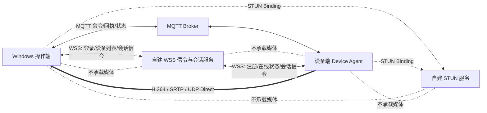
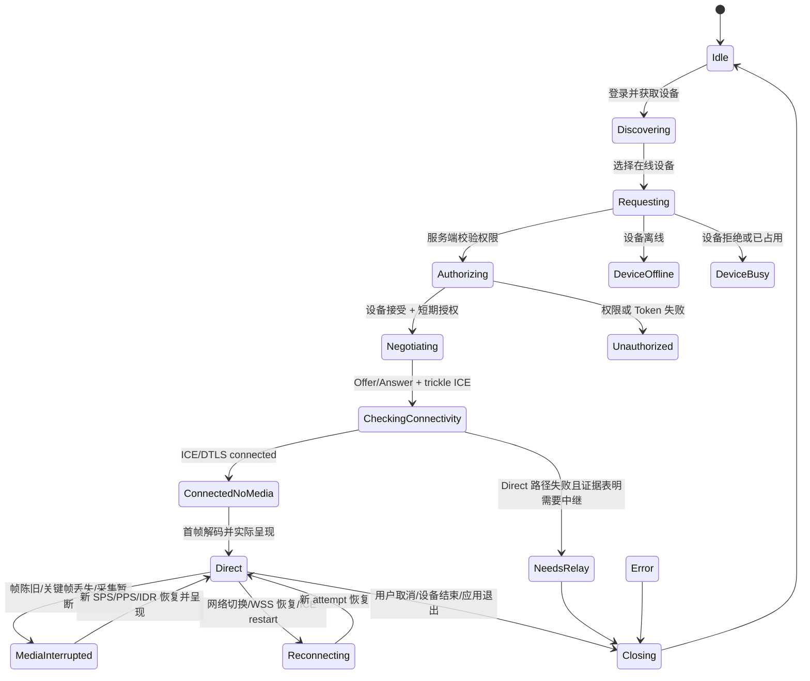

# RtmpMonitor 产品级 WebRTC Direct P2P 总体方案大纲

> **已废弃（Superseded）**：本 Draft 1.0 以 WSS 作为第一阶段信令，现已被
> `../RtmpMonitor_WebRTC_MQTT_Signaling_Direct_P2P_Productization_Outline_v2.md`
> 覆盖。保留本文只用于审计决策演进；不得据此实现 WSS、TURN 或产品默认网络端点。

> 文档版本：Draft 1.0
> 生成日期：2026-08-31
> 依据文档：`RtmpMonitor 从零到 WebRTC 产品化前夜：全历程、现状架构与下一规划交接`
> 文档定位：交给 GPT-5.6 Sol Ultra 继续生成 **decision-complete 的详细研发计划**。
> 本文是产品化总纲，不代表其中能力已经实现，也不替代源码、CMake、测试结果和 ADR。

---

## 0. 核心决策

### 0.1 最终产品目标

将 RtmpMonitor 从“以 RTMP/SRS 为稳定视频基线、WebRTC 为 Beta 能力”的过渡状态，演进为：

```text
WebRTC = 唯一实时视频传输入口
WSS    = 自动信令、设备会话与短期授权通道
STUN   = Direct P2P 地址发现服务
MQTT   = 独立设备命令、回执、心跳与遥测通道
RTMP   = 完成迁移后从产品运行时、配置、UI、部署和文档中退役
SRS    = 不再是产品运行依赖
```

最终用户体验应收敛为：

```text
登录或取得本地授权
    → 查看在线设备
    → 选择设备
    → 点击连接
    → 自动完成信令与 ICE
    → Direct P2P 出画
    → 用户显式选择并授权 MQTT 控制
```

用户不应接触 Offer、Answer、candidate、Offerer/Answerer、交换目录、STUN 地址、DLL、generation 等研发概念。

### 0.2 当前阶段的网络范围

当前阶段采用 **Direct P2P only**：

- 自建 WSS 信令服务；
- 自建 STUN 服务；
- 支持局域网 host candidate 直连；
- 支持兼容 NAT 下通过 srflx candidate 建立公网 Direct；
- 暂不实现 TURN、公网媒体中继、SFU、MCU；
- Direct 失败时进入可诊断的 `NeedsRelay` 或 `DirectUnavailable` 状态；
- 不静默回退 RTMP；
- 不对称 NAT、严格企业防火墙、UDP 封锁等环境承诺必然连通。

### 0.3 RTMP 退役原则

“最终剔除 RTMP”不等于立即删除 RTMP。退役必须是最后一个阶段，并满足：

1. WebRTC 已覆盖目标产品所需的实时视频能力；
2. 真实摄像头、真实双机、目标网络、目标设备平台完成资格验证；
3. 自动信令、身份、重连、错误诊断和安装部署成立；
4. RTMP 独有能力已经迁移、明确取消或有新的替代方案；
5. 不再需要 RTMP 作为产品 fallback；
6. 保留可审计的历史标签、测试证据和必要的离线回归 fixture。

---

## 1. 当前项目基线与产品化差距

### 1.1 已具备的可复用基础

| 基础能力 | 当前价值 | WebRTC 产品化中的复用方式 |
| --- | --- | --- |
| H.264 Annex-B 契约 | 已隔离 transport、publisher、media | 保持为发送端、传输端、接收端之间的最窄媒体契约 |
| `WebRtcEndpointSession` | 已有真实 PeerConnection、Track、RTP、ICE 和 generation | 继续作为低层 WebRTC transport，不吸收 UI、WSS 或设备身份 |
| `EncodedVideoInputHandle` | 外部 H.264 可进入既有 FFmpeg 解码链 | 作为 WebRTC 接收媒体进入 media 的唯一窄入口 |
| Decode worker + mailbox | 有界、latest-frame-wins、低延迟 | 继续承担多路解码和呈现背压 |
| CPU/OpenGL canvas | 已支持现有网格与全屏 | WebRTC 不另建渲染体系 |
| `SessionContext` | 已支持最多四路独立会话 | 扩展为按设备组织的产品会话上下文 |
| generation/token 隔离 | 可拒绝旧 RTP、旧样本和晚 UI 事件 | 扩展到 WSS 消息、连接 attempt 和自动重连 |
| MQTT 控制体系 | 已有 heartbeat、guard、回执和控制策略 | 继续作为独立控制面，不迁移到 DataChannel |
| 日志、事件、证据和诊断 | 已形成旁路观察能力 | 增加信令、ICE、身份和设备会话事实，但不记录敏感载荷 |
| Windows 打包和资格脚本 | 已有干净包和长稳基线 | 扩展为完整产品安装、WSS/STUN 配置和真实设备资格 |

### 1.2 当前关键缺口

| 缺口 | 对产品的影响 |
| --- | --- |
| WSS 自动信令未实现 | 用户仍需手工交换文件，无法形成产品体验 |
| trickle ICE 未实现 | candidate 只能整包处理，连接效率和恢复能力不足 |
| 用户/设备身份未建立 | 无法可信地选择设备、授权会话和拒绝冒用 |
| 短期 Token、撤销、重放保护未实现 | 公网信令不能安全开放 |
| 自动重连与 ICE restart 未实现 | 网络切换或短时故障需要人工重建 |
| WebRTC 与 MQTT target 未统一绑定 | 存在“看的是 A、控制的是 B”的产品风险 |
| 真实摄像头和物理双机门禁未完成 | 当前不能声明真实部署可用 |
| Linux ARM64 WebRTC 未落地 | 嵌入式设备端仍缺生产路径 |
| WebRTC 音频能力未建立 | 若产品继续需要现有单向音频，RTMP 不能直接退役 |
| RTMP/SRS 相关 profile、监控、DVR PoC 尚未处理 | 删除 RTMP 前必须逐项迁移或取消 |

### 1.3 规划必须坚持的事实边界

- 当前 WebRTC 证据主要证明本机软件链和候选包，不等于全部真实网络资格；
- 当前最大 WebRTC 产品会话数是 4，不得自动写成 16；
- Windows Media Foundation 摄像头存在生产代码，但物理摄像头资格仍需补齐；
- ARM64 当前只证明 WebRTC OFF 的交叉构建，不得写成 ARM WebRTC 已支持；
- 当前 `SessionPackage` 文件信令是回归工具，不是未来产品协议；
- 删除 RTMP 后仍可能继续使用 FFmpeg 解码、像素处理或测试素材，不能把“去 RTMP”误写成“去 FFmpeg”。

---

## 2. 产品范围

### 2.1 第一阶段产品支持范围

建议第一阶段正式范围为：

- 操作端：Windows x64 Qt 桌面客户端；
- 设备端：具备 H.264 编码能力的 device agent；
- 视频方向：设备端 SendOnly，操作端 ReceiveOnly；
- 编码基线：优先保持当前 1280×720、30 FPS、H.264 路线；
- 会话数：先维持当前产品已验证的最多 4 路，扩展到 16 路必须有新的性能和产品需求证据；
- 网络：LAN Direct 与 STUN-assisted Direct；
- 信令：自建 WSS；
- 控制：现有 MQTT；
- 服务端不承载视频；
- 不要求浏览器参与会话。

具体分辨率、码率、H.264 profile/level、GOP、关键帧周期、最大会话数和目标 ARM 型号，应由后续详细规划根据真实设备能力冻结。

### 2.2 当前非目标

- TURN relay；
- SFU、MCU、多人会议式拓扑；
- 一个设备同时向多个观看端广播；
- DataChannel 控车；
- 浏览器 WebRTC 互操作；
- 自动 RTMP fallback；
- 一开始重写 media/render/UI；
- 一开始引入通用 `MediaSource`、协议插件总线或 God Manager；
- 把 SDP、candidate、Token、真实 endpoint 写入 profile、普通日志或 Git；
- 在产品门禁完成前删除 RTMP 稳定路径。

### 2.3 必须明确标识的暂不支持环境

产品必须对以下环境给出明确错误，而不是无限重试或显示模糊“连接失败”：

- symmetric NAT 导致无法 Direct；
- 企业网络阻止 UDP 或点对点流量；
- STUN 可达但 candidate pair 全部失败；
- 双方网络均不允许可用的 host/srflx 路径；
- 当前网络需要 TURN relay，而本版本尚未提供；
- 设备 H.264 参数与接收端解码能力不兼容。

---

## 3. 目标系统架构

### 3.1 总体拓扑



### 3.2 五个相互独立的产品平面

| 平面 | 职责 | 不得承担的职责 |
| --- | --- | --- |
| 身份与授权平面 | 用户、设备、客户端实例、短期会话授权、撤销 | 不传视频、不做解码、不直接控设备 |
| WSS 信令平面 | 在线状态、会话协商、Offer/Answer、trickle ICE、ack/timeout | 不转发媒体、不保存长期 SDP/candidate |
| ICE/STUN 连接平面 | host/srflx candidate 收集与可达性检查 | 不等于用户授权，不承载业务状态 |
| WebRTC 媒体平面 | DTLS/SRTP/RTP、H.264 发送与接收 | 不决定 MQTT 控制权限，不直接操作 UI |
| MQTT 控制平面 | 命令、回执、心跳、遥测 | 不用来传视频，不根据 tile 自动授权 |

### 3.3 产品层组合原则

跨平面绑定只允许发生在产品组合层：

```text
DeviceSession
  = 可信 DeviceIdentity
  + 当前 WebRTC SessionContext
  + 当前 StreamId / mailbox / widget
  + 明确绑定的 MQTT target
  + 当前 SessionAuthorization
  + 视频 freshness 与设备 heartbeat
```

底层模块不得互相反向依赖：

- media 不依赖 WebRTC、WSS、UI；
- `webrtc_transport` 不依赖 publisher、media、UI、MQTT；
- publisher 不依赖 transport；
- WSS client 不直接调用 QWidget；
- MQTT client 不解析 UI 选择；
- MainWindow 不持有 PeerConnection；
- diagnostics 只读取事实，不反向控制媒体和信令。

---

## 4. 产品进程与模块边界

### 4.1 Windows 操作端

主要职责：

- 用户登录或本地授权；
- 获取设备列表、在线状态和占用状态；
- 发起、取消和重建设备会话；
- 通过 WSS 完成 Offer/Answer 与 trickle ICE；
- 创建 ReceiveOnly WebRTC endpoint；
- 把 H.264 接收样本提交到现有 media 解码链；
- 复用现有网格、全屏、事件、证据和诊断；
- 显式绑定并授权 MQTT 控制目标；
- 呈现可理解的 Direct、NeedsRelay、Unauthorized、DeviceBusy 等状态。

不得：

- 在 UI 线程等待 WSS、ICE 或线程 join；
- 在 MainWindow 内管理 PeerConnection 生命周期；
- 仅以 `connected` 判断视频可用；
- 根据当前选中的 tile 静默切换 MQTT target。

### 4.2 设备端 Device Agent

主要职责：

- 使用设备凭据建立 WSS 长连接；
- 注册稳定 `DeviceId`、能力和在线状态；
- 接受经过服务端授权的观看请求；
- 创建 SendOnly PeerConnection；
- 通过 source adapter 获取 H.264 AU；
- 执行 pacing、SPS/PPS/IDR 恢复和关键帧请求策略；
- 发布设备心跳、会话占用和错误状态；
- WSS 断线后自动重连并拒绝旧 session；
- 在退出、网络切换和采集失败时完成确定性收尾。

不得：

- 接受未经身份和 session token 验证的任意 Offer；
- 保存远端 SDP、candidate 或短期 Token；
- 使用无界摄像头帧队列；
- 一个全局 PeerConnection 服务所有设备或所有会话；
- 把 MQTT 控制改为 DataChannel。

### 4.3 WSS 信令与会话服务

第一版建议是单节点、状态有界的服务，职责包括：

- TLS/WSS 终止与客户端认证；
- 操作员会话和设备会话注册；
- DeviceId 唯一在线路由；
- 设备列表、在线/离线/忙碌状态；
- 观看请求的授权、接受、拒绝和取消；
- 短期 session authorization 的签发或校验；
- Offer/Answer、trickle candidate、end-of-candidates 的内存转发；
- message ack、timeout、重复消息幂等和乱序拒绝；
- 连接断开、Token 过期和撤销通知；
- 有界速率限制、消息大小限制和审计事件。

不得：

- 转发视频或音频；
- 长期存储 SDP、candidate、ICE 密钥或 session token；
- 代替 MQTT Broker；
- 把“WSS 已连接”写成“设备视频可用”；
- 在第一版过早引入多节点分布式协调，除非需求和部署量明确要求。

### 4.4 STUN 服务

当前阶段只承担：

- 为设备端和操作端提供 srflx candidate；
- 作为 Direct P2P 网络诊断的一部分；
- 提供健康检查、基础指标和访问控制策略；
- 与 WSS 分进程、分职责部署。

可以使用 Coturn 的 STUN 能力，但本阶段必须明确 TURN relay 未启用、未承诺、未纳入产品通过条件。

### 4.5 MQTT Broker 与控制服务

继续承担：

- 设备命令；
- 回执；
- heartbeat；
- 设备状态和遥测；
- 控制审计。

WebRTC 出画只是控制授权的一项前置事实。最终控制许可至少应依赖：

```text
用户已授权
AND DeviceSession 绑定成立
AND MQTT 已连接
AND 目标设备在线
AND 当前视频为 Playing/Direct
AND presented frame 足够新鲜
AND 用户显式 Armed
```

---

## 5. 核心身份、ID 与生命周期模型

### 5.1 必须区分的 ID

| ID | 含义 | 生命周期 | 禁止混用 |
| --- | --- | --- | --- |
| `UserId` / `OperatorId` | 操作员身份 | 长期 | 不等于本机客户端实例 |
| `DeviceId` | 设备持久身份 | 长期 | 不等于 `StreamId` |
| `ClientInstanceId` | 一次安装或一次运行实例 | 中期/运行期 | 不等于用户身份 |
| `SignalingConnectionId` | 一条 WSS 连接 | 单连接 | 重连后必须变化 |
| `SessionId` | 一次逻辑观看会话 | 单会话 | 不等于某次 ICE attempt |
| `AttemptId` | 一次连接或重连尝试 | 单 attempt | ICE restart 或完整重建时变化 |
| endpoint generation | PeerConnection/Track 代次 | 单 endpoint | 不与 media generation 合并 |
| media generation | 外部解码输入代次 | 单 decode ingress | 不与产品 token 合并 |
| product token | `SessionContext` 生命周期身份 | 单产品上下文 | 防止晚 UI/runtime 事件污染新会话 |
| `StreamId` | 本地运行期画面身份 | 单应用运行期 | 不作为设备持久身份 |
| `MqttTargetId` | MQTT 控制目标 | 持久或运行期 | 不根据 `StreamId` 自动推断 |
| `MessageId` | WSS 消息幂等身份 | 单消息 | 不替代 correlation/session ID |

### 5.2 会话授权语义

详细计划必须定义一种最小可用的授权模型：

1. 设备使用长期 bootstrap credential 或设备证书证明 `DeviceId`；
2. 操作员通过登录或本地可信授权取得访问凭据；
3. 服务端为具体 `UserId + DeviceId + SessionId + AttemptId` 签发短期授权；
4. 短期授权必须有签发时间、过期时间、用途和唯一身份；
5. 设备端和操作端都必须验证作用域；
6. 撤销、过期或会话结束后不得继续用于新协商；
7. 重放旧 Offer、旧 candidate 或旧 session token 不得复活已关闭会话。

Token 使用 JWT、PASETO、opaque token 或其他形式，应由后续详细计划基于部署和密钥管理作出决策；本文冻结的是授权语义，而不是具体编码格式。

### 5.3 generation 原则

- WSS 重连不能复用旧 `SignalingConnectionId`；
- ICE restart 至少产生新的 `AttemptId`，是否复用 `SessionId`必须明确；
- 完整 PeerConnection 重建必须产生新的 endpoint generation；
- decoder 重建必须产生新的 media generation；
- UI 重建或 slot 复用必须产生新的 product token；
- 所有异步回调到达时重新按 ID 查找当前上下文，不捕获裸产品对象长期使用；
- 旧消息只能被丢弃和计数，不能修改新会话状态。

---

## 6. 产品会话状态机大纲

### 6.1 操作端主状态

建议产品状态至少区分：

```text
Idle
Discovering
Authorizing
Requesting
Negotiating
CheckingConnectivity
ConnectedNoMedia
Direct
MediaInterrupted
Reconnecting
NeedsRelay
Unauthorized
DeviceOffline
DeviceBusy
Error
Closing
```

`Direct` 必须继续满足现有严格语义：

```text
PeerConnection connected
AND selected pair 为 non-relay
AND 存在有效 StreamId
AND H.264 已解码
AND 画面已实际 presented
AND presented frame age 不超过产品阈值
```

### 6.2 简化状态流程



### 6.3 必须在详细计划中冻结的异常行为

- WSS 在 P2P 已建立后断开，视频是否继续、继续多久、UI 如何提示；
- WSS 恢复后是恢复原 session、ICE restart 还是完整新建；
- Token 在视频进行中到期时，视频、控制和新协商如何处理；
- 设备忙碌时是否排队，默认建议第一版不排队、直接返回稳定错误；
- 双方同时发起新会话时如何仲裁；
- 重复 Offer、重复 Answer、重复 candidate 如何幂等；
- candidate 早于 remote description 到达时如何有界暂存；
- end-of-candidates、超时和主动 cancel 如何传播；
- 摄像头短暂失效时是保持 PC、请求关键帧还是完整重建；
- `NeedsRelay` 后是否允许用户手动重试 Direct，重试节流策略是什么。

---

## 7. WSS wire protocol 大纲

### 7.1 统一消息 envelope

详细计划应定义版本化 envelope，至少包含：

```text
schemaVersion
messageId
messageType
sentAtUtc
connectionId
correlationId
sessionId（按消息类型可选）
attemptId（按消息类型可选）
source identity
target identity
payload
```

服务端和客户端必须执行：

- 最大消息大小限制；
- JSON/二进制 schema 严格校验；
- 未知高版本拒绝或按明确兼容策略处理；
- 时间窗校验；
- messageId 去重；
- session/attempt 归属校验；
- 乱序、过期和晚消息拒绝；
- 敏感字段脱敏；
- ack/timeout 的确定性行为。

### 7.2 消息族

#### 连接与身份

- `client.hello`
- `auth.request`
- `auth.accepted`
- `auth.rejected`
- `connection.keepalive`
- `connection.reauth_required`
- `connection.revoked`

#### 设备注册与在线状态

- `device.register`
- `device.registered`
- `device.presence`
- `device.capabilities`
- `device.list.request`
- `device.list.snapshot`
- `device.status.changed`

#### 产品会话

- `session.request`
- `session.accept`
- `session.reject`
- `session.cancel`
- `session.cancelled`
- `session.timeout`
- `session.closed`

#### WebRTC 协商

- `webrtc.offer`
- `webrtc.answer`
- `webrtc.ice_candidate`
- `webrtc.ice_complete`
- `webrtc.renegotiate`
- `webrtc.restart_requested`

#### 观察与诊断

- `session.peer_state`
- `session.media_state`
- `session.direct_failed`
- `session.protocol_error`

服务端不应依赖客户端上报来判断真实画面已呈现；`Direct` 的最终判定仍在本地产品层完成。服务端状态只用于路由、占用、授权和运维观察。

### 7.3 协议兼容原则

- 新建独立 WSS wire schema，不修改一次性 `SessionPackage` v1；
- 文件信令继续保留为 deterministic integration fixture；
- WSS schema 采用独立命名空间和版本；
- 向后兼容、强制升级、未知字段和弃用周期必须写入详细计划；
- 任何持久设备 profile 也应使用新 schema，不把 WebRTC 字段塞进 `SavedStream` v1。

### 7.4 SDP、candidate 与 Token 处理

- 只在内存中转发；
- 不进入普通日志；
- 不进入事件详情、崩溃报告、profile 或 Git；
- debug build 也默认不输出全文；
- 服务端只记录 message type、大小、方向、session/attempt 的非敏感标识；
- 需要问题定位时使用受控临时诊断开关，并有自动过期和访问限制；
- candidate 中的 IP、端口和基础设施信息不得出现在用户可见日志中。

---

## 8. 现有 C++ 架构的演进方向

> 下列模块名是基于当前项目的建议映射。GPT-5.6 Sol Ultra 必须先核验真实 target、headers、CMake links 和对象所有权，再给出最终文件级变更。

### 8.1 保持不变或尽量不变的模块

| 模块 | 处理原则 |
| --- | --- |
| `rtmp_monitor_h264_contracts` | 保持协议无关，不加入 WSS、DeviceId 或 UI 字段 |
| media | 继续负责解码、worker、mailbox 和媒体指标，不依赖 WebRTC/WSS |
| render / video_canvas | 继续复用现有画布、纹理和呈现事实 |
| ui | 只显示产品状态和发出用户意图，不管理 PC 或 WSS 线程 |
| device_control / control_policy | 保持 MQTT 和控制策略独立，仅接收可信 DeviceSession 事实 |
| event_center / evidence / diagnostics | 扩展观察事实，不反向驱动媒体或信令 |

### 8.2 WebRTC 模块演进

| 当前模块 | 建议演进 |
| --- | --- |
| `webrtc_signaling` 文件包 | 保留 codec/store 作为测试 fixture；不扩展成云协议 |
| `webrtc_transport` | 增加本地 candidate 回调、远端 candidate 注入、ICE restart/重建 seam；仍不依赖 WSS |
| `webrtc_runtime` | 从“等待文件”演进为依赖抽象 signaling channel 的一路会话 runtime |
| `webrtc_product` | 按 DeviceId 管理 `SessionContext`，组合身份、signaling、transport、media、UI |
| `h264_publisher_source` | 继续提供 MP4/MF source；新增目标设备 source adapter 时保持兄弟边界 |
| `ApplicationBootstrap` | 作为唯一产品组合根创建 WSS、session service、device repository 和 controller |

### 8.3 建议新增的概念模块

详细计划可根据项目命名规范调整名称，但职责应分开：

- `signaling_contracts`：wire envelope、message types、错误码、版本；
- `signaling_client`：WSS 连接、重连、认证、收发队列、ack/timeout；
- `identity_contracts`：用户、设备、客户端实例和短期授权的值对象；
- `device_directory`：设备列表、presence、capability 和选择状态；
- `device_session`：DeviceId、WebRTC、StreamId、MQTT target 和授权的产品聚合；
- `device_agent`：设备端进程组合根；
- `signaling_server`：独立服务端项目或独立仓库；
- `runtime_config`：WSS/STUN/证书等部署配置，不进入 SavedStream schema。

### 8.4 线程与回调边界

建议执行上下文至少包括：

| 上下文 | 主要职责 |
| --- | --- |
| Qt UI 主线程 | UI、controller、产品状态投影 |
| WSS I/O 线程或事件循环 | 建连、TLS、收发、keepalive、重连 |
| libdatachannel 内部回调 | ICE、Track、RTP 和 DataChannel 底层事件 |
| WebRTC session worker | 一路协商、超时、关闭和状态聚合 |
| camera capture/encode worker | 采集、编码、H.264 AU 输出 |
| decode worker pool | H.264 解码 |
| MQTT 回调线程 | 有界复制观察消息 |
| evidence worker pool | 截图、catalog、导出 |

任何跨线程事件都应转换为值对象，并按 `DeviceId + SessionId + AttemptId + token/generation` 在 owner thread 重新查找上下文。

### 8.5 关闭顺序

单路会话建议固定为：

```text
1. 产品层把 SessionContext 标记 Closing，并使 product token 失效
2. 从 UI、MQTT control route 和 active device route detach
3. 停止接收新的 WSS session 消息
4. 请求 WebRTC endpoint beginClose
5. 使 endpoint generation 失效，拒绝晚 RTP/candidate
6. 锁外等待 session worker 收敛
7. 关闭 EncodedVideoInputHandle，使 media generation 失效
8. 清 mailbox 与 freshness
9. 移除 widget / StreamId
10. 通知服务端 session.closed（若连接仍可用）
11. 释放 context
```

应用退出时：先拒绝新会话，再批量请求所有 context 停止，然后统一 join 和释放，最后一次性执行 WebRTC 全局 cleanup。

---

## 9. Direct P2P 网络策略

### 9.1 candidate 策略

当前阶段允许：

- host candidate；
- STUN 得到的 srflx candidate；
- non-relay selected pair；
- trickle ICE；
- end-of-candidates；
- ICE restart 或完整 endpoint 重建。

当前阶段不允许：

- relay candidate；
- 伪装为 Direct 的服务器代理；
- 把 WSS 当媒体隧道；
- 未经配置的公共 STUN 作为产品默认；
- 在普通日志中输出 candidate 地址。

### 9.2 连接策略

- 优先尝试 host/局域网直连；
- 同时或随后使用自建 STUN 的 srflx candidate；
- candidate gathering 和 connectivity check 必须有明确超时；
- 连接建立后记录地址无关 selected pair 类型和 transport；
- selected pair 为 non-relay 只是 Direct 的必要条件，不是充分条件；
- 若 ICE Failed 且有 srflx 事实，可进入 `NeedsRelay`；
- 若 STUN 本身不可用，区分 `StunUnavailable`、`NoSrflx` 和普通 ICE 失败；
- 不无限重试，重试必须有退避、次数或时间预算；
- 用户主动点击重试应创建新 `AttemptId`。

### 9.3 WSS 与已建立媒体的关系

详细计划必须选择并明确以下策略：

- WSS 短时断开时，已建立的 P2P 视频是否继续；
- WSS 断开是否立即暂停 MQTT 控制授权；
- 恢复 WSS 后如何重新证明 session 所有权；
- 媒体继续但信令不可用时如何显示“双状态”；
- 何时执行 ICE restart，何时完整重建 PeerConnection；
- 旧 WSS 连接恢复产生的晚消息如何拒绝。

保守建议：视频可在短暂 WSS 抖动期间继续，但新协商和控制授权进入受限状态；超过授权或恢复窗口后关闭会话并重新建立。

### 9.4 网络切换与恢复

至少覆盖：

- Wi-Fi 短时断开恢复；
- 有线与 Wi-Fi 切换；
- NAT 映射变化；
- STUN 暂时不可达；
- WSS 重连但 P2P 仍存活；
- P2P 失效但 WSS 存活；
- candidate 乱序和旧 candidate 到达；
- ICE restart 失败后完整重建；
- 设备端 IP 变化；
- 操作端休眠和唤醒。

---

## 10. 设备端媒体发布大纲

### 10.1 Source Adapter 原则

设备侧 source 只负责输出：

```text
H264AccessUnit
  - Annex-B
  - 媒体时间戳
  - keyframe 标记
  - 受控大小
```

不得把 DeviceId、WSS、PeerConnection 或 MQTT 状态塞进 H.264 AU。

### 10.2 H.264 产品基线需要冻结的参数

详细计划必须核验并冻结：

- 分辨率和 FPS；
- profile/level；
- Annex-B start code；
- SPS/PPS 注入策略；
- IDR 周期；
- B-frame 是否允许；
- packetization-mode；
- 最大 AU 大小；
- 时间戳时基；
- 码率上限和网络自适应策略；
- 采集失败后的恢复；
- 关键帧请求或主动 IDR 机制；
- ARM 硬件编码器输出兼容性。

### 10.3 设备端会话仲裁

第一版建议一个设备同时只允许一个操作员观看或控制，除非业务明确需要多观看端。服务端和 device agent 必须共同处理：

- 设备空闲；
- 设备正在被观看；
- 当前用户拥有会话；
- 其他用户请求；
- 超时占用释放；
- 异常断线清理；
- 同一用户多个客户端实例；
- 控制权限与只读观看权限的区别。

### 10.4 ARM64 产品路径

若真实设备是 Linux ARM64，详细计划必须单独形成：

- libdatachannel ARM64 构建和运行时依赖；
- 目标 sysroot 与编译链；
- V4L2、厂商 SDK 或已有编码器接入方式；
- H.264 Annex-B 合规测试；
- EGLFS/Wayland/X11 是否与 device agent 同进程；
- CPU、内存、温度、码率和持续运行门槛；
- 断网、重启、升级和 watchdog；
- 安装包、服务脚本和日志目录；
- 真机资格，而不是只做交叉构建。

---

## 11. 多设备、多路与资源边界

### 11.1 第一版并发策略

- 继续使用每设备一个独立 `SessionContext`；
- 每路独占 PeerConnection、Track、attempt、endpoint generation、media generation、product token、mailbox 和 widget；
- 首版最多 4 路；
- 第五路稳定返回 `capacity_reached`，不得部分创建资源；
- 一路失败、取消、重建或摄像头异常不得停止其他路；
- 不引入全局 currentSession、currentDevice 或 currentGeneration。

### 11.2 有界资源原则

必须保持或重新定义明确边界：

- WSS 发送队列；
- WSS 接收消息大小；
- 未应用 candidate 暂存数量和字节数；
- H.264 AU 大小；
- transport queue；
- decode queue；
- mailbox capacity 1；
- UI pending removal；
- event/evidence 任务；
- session 数量；
- 重试次数和重连预算。

过载时优先丢弃旧实时数据、拒绝新会话或进入可诊断错误，不得无界排队追赶历史。

### 11.3 从 4 路扩展到 16 路的条件

RTMP 当前支持 0～16 路，而 WebRTC 当前产品基线是 4 路。完全退役 RTMP 前必须做出一个显式产品决策：

```text
A. 正式产品只需要最多 4 路，RTMP 的 16 路能力被有意识取消；
或
B. WebRTC 必须扩展并资格验证到 16 路后，才允许 RTMP 退役。
```

不得在没有真实设备编码、网络上行、接收端解码和渲染证据时直接把容量常量改为 16。

---

## 12. WebRTC 与 MQTT 的产品级绑定

### 12.1 DeviceSession 绑定要求

必须由产品层显式建立：

```text
DeviceId
↔ 当前 WebRTC SessionId / StreamId
↔ 当前 MQTT TargetId
↔ 当前 UserId / SessionAuthorization
```

绑定应来自服务端可信设备目录和本地明确选择，而不是根据显示名称或 tile 顺序推断。

### 12.2 控制安全不变量

- WebRTC `Connected` 不授予控制；
- WebRTC `Direct` 也不自动授予控制；
- 用户必须显式选择目标并 Armed；
- tile 切换不得静默切换 MQTT target；
- 视频陈旧、设备 heartbeat 超时、MQTT 断开、WSS 授权失效、会话切换、窗口失焦和应用退出均应使控制失效；
- 必要时发送停车命令；
- 旧 SessionId 的控制意图不得作用到新会话；
- 只读观看用户不得发布控制命令。

### 12.3 UI 上的双状态

视频状态和控制状态必须分开呈现，例如：

```text
视频：Direct / Reconnecting / NeedsRelay / Offline
控制：Locked / Armed / Moving / Suspended / Unauthorized
```

不能用一个绿色“已连接”同时代表 WSS、WebRTC、MQTT、设备在线和控制授权。

---

## 13. 产品 UI/UX 大纲

### 13.1 主流程

- 登录或读取本地授权；
- 设备列表；
- 在线、离线、忙碌、无权限和能力标签；
- 点击设备连接；
- 自动协商；
- 网格出画；
- 显式选择控制目标；
- Armed 后允许操作；
- 一键断开；
- 会话错误可恢复或给出明确原因。

### 13.2 用户可见状态

建议至少提供：

- 正在连接信令服务；
- 设备离线；
- 无权访问；
- 设备正在被其他会话使用；
- 正在建立 P2P；
- 已建立 Direct P2P；
- 已连接但等待视频关键帧；
- 视频暂时中断，正在恢复；
- 当前网络需要中继，本版本暂不支持；
- STUN 服务不可用；
- 摄像头或编码器故障；
- MQTT 未连接；
- 设备心跳超时；
- 控制未授权；
- 已达到最大会话数。

### 13.3 用户不应看到的内容

- Offer/Answer；
- candidate；
- IP/端口映射；
- PeerConnection internal state 原始枚举；
- Token；
- generation；
- libdatachannel/FFmpeg/Qt DLL 细节；
- 交换文件目录；
- “请手动复制 JSON”类操作。

### 13.4 高级诊断页

可提供脱敏诊断：

- WSS 状态；
- 设备 presence；
- ICE gathering/checking 状态；
- host/srflx candidate 是否观察到；
- selected pair 类型和 UDP/TCP；
- RTP/AU/decoded/presented 计数；
- presented frame age；
- transport/decode queue；
- drop 和恢复计数；
- session/attempt 的短非敏感标识；
- MQTT、heartbeat 和 control guard 状态。

不得显示真实 SDP、candidate 地址和 Token。

---

## 14. 安全与威胁边界

### 14.1 需要保护的资产

- 设备身份和设备凭据；
- 操作员身份和权限；
- 短期 session authorization；
- SDP、candidate 和网络拓扑；
- 视频会话访问权；
- MQTT 控制权；
- WSS/STUN/MQTT endpoint；
- 设备列表和在线状态；
- 事件、证据和日志中的客户信息。

### 14.2 必须覆盖的威胁

- 伪造 DeviceId；
- 冒用操作员；
- 重放旧 Token、Offer 或 candidate；
- 会话劫持；
- 越权观看；
- 越权控制；
- WSS 消息洪泛；
- 超大/畸形 JSON；
- 重复、乱序、晚消息；
- TLS 降级或证书校验关闭；
- 日志泄漏 SDP、candidate、Token 和真实地址；
- 一个用户连接设备 A 后控制设备 B；
- 设备断线后旧 session 在重连时复活；
- 本地配置被普通用户篡改；
- 服务端重启后僵尸占用未释放。

### 14.3 最小安全控制

- 只允许 WSS，不允许生产明文 WS；
- 严格证书校验；
- 明确证书签发、更新和轮换策略；
- 设备长期凭据安全存储；
- 操作员 token 安全存储；
- 短期 session token 绑定 UserId、DeviceId、SessionId、AttemptId、用途和过期时间；
- messageId 与时间窗防重放；
- 服务端按用户、设备、IP/连接执行速率限制；
- 所有消息有大小、字段数和字符串长度边界；
- 设备端只接受服务端授权的目标用户会话；
- 普通日志全链路脱敏；
- 敏感配置不进入 Git、安装包示例或崩溃转储；
- 生产配置和示例配置分离；
- 控制授权继续采用显式 guard。

### 14.4 需要后续详细计划作出的安全决策

- 设备首次注册/配网方式；
- 用户账号由自建系统、现有账号系统还是本地管理员管理；
- token 格式和签名算法；
- 密钥放置和轮换；
- 是否采用 mTLS；
- 是否需要证书 pinning；
- 设备丢失后的吊销流程；
- 多租户/组织隔离；
- 审计日志保留周期；
- 本地凭据使用系统密钥库还是加密文件。

---

## 15. 服务端部署与运维大纲

### 15.1 第一版部署单元

建议最小部署包含：

```text
1. WSS signaling/session service
2. STUN service
3. MQTT Broker（已有或独立部署）
4. TLS 证书与域名
5. 健康检查、指标和日志收集
```

WSS 和 STUN 可以同机部署，但必须保持独立进程、端口、配置和故障边界。

### 15.2 WSS 服务第一版原则

- 单节点优先；
- 只在内存保存短期连接和 session route；
- 服务重启后客户端重新认证、设备重新注册、会话重新协商；
- 不为了未来扩容提前加入复杂分布式一致性；
- 但 wire protocol、DeviceId 和 session model 不依赖单节点实现；
- 服务端进程不得成为媒体带宽瓶颈；
- 所有队列、session、连接和消息大小有上限。

### 15.3 需要观测的服务端指标

- 当前 WSS 连接数；
- 已认证用户数和设备数；
- 在线设备数；
- session request/accept/reject/timeout；
- Offer/Answer/candidate 消息计数；
- 重复、过期、乱序和非法消息；
- WSS 重连率；
- Token 签发、过期和撤销；
- 每连接发送队列长度；
- 消息处理延迟；
- STUN 请求成功率和延迟；
- 服务进程 CPU、内存、fd/socket 和错误率。

不得把 SDP、candidate 全文或 Token 写入指标标签。

### 15.4 配置与秘密管理

配置至少分为：

- 非敏感运行配置：监听地址、超时、大小上限、feature flag；
- 敏感配置：签名密钥、设备 bootstrap secret、TLS private key；
- 客户端公开配置：WSS 域名、STUN URL、证书信任策略；
- 本地开发配置：回环 endpoint 和测试凭据；
- 包内示例：只能使用占位符。

详细计划必须说明开发、测试、预发布和生产环境如何隔离。

---

## 16. RTMP 功能对齐清单

完全退役 RTMP 前，应建立逐项 parity ledger：

| RTMP/SRS 现有能力 | WebRTC 目标 | 退役前决策 |
| --- | --- | --- |
| 0～16 路 RTMP | 当前 WebRTC 最多 4 路 | 明确产品只需 4 路，或完成 16 路扩展资格 |
| 自动重连 | ICE restart/自动重建 | 必须实现并覆盖网络切换和旧回调 |
| 保存 RTMP URL | 设备目录和设备 profile | 新建 DeviceProfile schema，不向 SavedStream v1 追加 WebRTC 字段 |
| SRS 健康监控 | WSS/STUN/device presence 健康 | 重新定义服务健康，不保留无意义 SRS UI |
| 单向 AAC 音频 | WebRTC Audio Track 或明确取消 | 若音频是产品需求，必须迁移后才能去 RTMP |
| SRS DVR receipt PoC | 本地录像、设备录像或取消 | 明确是否仍需要录像及其新架构 |
| RTMP URL/凭据脱敏 | WSS/STUN/Token/SDP/candidate 脱敏 | 建立新的敏感数据规则 |
| FFmpeg RTMP input | WebRTC H.264 ingress | 移除 RTMP-specific input，不必删除通用 FFmpeg decode |
| RTMP server scripts | WSS/STUN 部署脚本 | 新增服务部署、健康、升级和回滚脚本 |
| RTMP UI 菜单/状态 | 设备列表和 P2P 状态 | 删除 URL 概念和手工协议选择 |
| RTMP 产品命名 | 新产品名称 | 评估二进制、仓库、命名空间和文档重命名 |

---

## 17. 测试与资格体系

### 17.1 测试分层

| 层级 | 必须覆盖的内容 |
| --- | --- |
| 单元测试 | wire codec、schema、ID、状态机、Token 语义、去重、超时、错误映射 |
| 组件测试 | WSS client、server route、device directory、candidate 暂存、close/reconnect |
| transport 测试 | trickle ICE、remote candidate 注入、ICE restart、旧 generation 拒绝 |
| media 集成 | RTP→AU→decode→mailbox→presented、关键帧恢复、容量 drop |
| 双进程测试 | device agent + desktop client + 本地 WSS/STUN fixture，无文件搬运 |
| 物理 LAN | 两台真实机器、真实摄像头、真实防火墙和网卡 |
| 跨 NAT Direct | 双方通过自建 STUN 获取 srflx 并建立 Direct |
| 不支持网络 | 可复现 Direct 失败并稳定进入 NeedsRelay，而不是挂死或回退 RTMP |
| 多路测试 | 1～4 路独立会话、第五路拒绝、单路故障隔离 |
| 安全负向 | 冒用、过期、撤销、重放、乱序、超大消息、无权限设备、TLS 错误 |
| 恢复测试 | WSS 重启、STUN 故障、网络切换、摄像头中断、休眠唤醒、设备重启 |
| 长稳与性能 | 至少继承现有 600/1,800 秒基线，并增加真实设备和真实网络趋势 |
| 打包/安装 | 干净机器、无开发 PATH、证书和配置、升级/卸载/回滚 |
| ARM 真机 | 目标板构建、运行、温度、内存、CPU、编码和网络恢复 |
| RTMP 退役审计 | 产品不再连接 SRS、不读取 RTMP profile、不包含 RTMP UI/脚本/运行依赖 |

### 17.2 必须保留的既有回归

- WebRTC OFF/ON 的历史边界测试，直到最终产品构建策略被重新冻结；
- 文件 `SessionPackage` 双角色 fixture；
- MP4 publisher 固定样本；
- 现有 H.264 contracts 测试；
- 现有 600/1,800 秒 WebRTC runner；
- media/render/UI/MQTT/event/evidence 全回归；
- RTMP 回归，直到 RTMP 正式退役版本完成。

### 17.3 产品发布门禁

WebRTC 成为唯一实时视频入口前，至少满足：

- 自动 WSS 信令，无手工文件；
- 用户与设备身份可验证；
- 短期授权、过期、撤销和重放测试通过；
- trickle ICE 通过；
- LAN Direct 通过；
- 自建 STUN 的跨 NAT Direct 通过；
- Direct 失败时稳定进入 NeedsRelay；
- 真实摄像头通过；
- 目标设备平台通过；
- 1～4 路多会话和故障隔离通过；
- 自动重连、ICE restart 或完整重建通过；
- MQTT target 显式绑定和误控负向测试通过；
- 音频、录像、16 路等 RTMP 差异已迁移或明确取消；
- 干净安装、升级、卸载和回滚通过；
- 敏感数据扫描通过；
- RTMP 退役审计通过。

---

## 18. 分阶段研发路线

### P2P-DIRECT-00：只读审计与产品范围冻结

**目标**：确认当前源码事实、产品边界和 RTMP 退役条件。
**主要输出**：

- 当前 CMake target 和依赖图；
- WebRTC/RTMP/MQTT/identity/WSS/STUN 五面职责 ADR；
- RTMP parity ledger；
- 目标平台、会话数、视频参数、音频和录像需求清单；
- 当前技术债和外部输入清单；
- 不允许被破坏的测试列表。

**退出门禁**：不存在“先写代码、后决定身份/生命周期”的空白；所有未确认外部条件被显式列出。

### P2P-DIRECT-01：身份、会话与 wire protocol 冻结

**目标**：定义 User、Device、Connection、Session、Attempt、Token 和消息协议。
**主要输出**：

- ID 语义和生命周期；
- WSS envelope 和消息族；
- auth、session、offer/answer、candidate、cancel、reconnect 状态机；
- 短期授权、过期、撤销、重放模型；
- 错误码、超时、ack、幂等和兼容策略；
- 威胁模型和敏感数据规则。

**退出门禁**：实现者无需再自行猜测“谁能连接谁、消息属于哪一次会话、旧消息如何拒绝”。

### P2P-DIRECT-02：WSS 服务与客户端基础设施

**目标**：建立无需媒体也能完整验证的自动信令闭环。
**主要输出**：

- 单节点 WSS 服务；
- desktop/device WSS client；
- TLS、认证、keepalive、重连；
- device register/presence/list；
- session request/accept/reject/cancel；
- 本地回环 fixture 和双进程 integration；
- 敏感日志门禁。

**退出门禁**：两个真实进程可通过 WSS 自动建立受授权的逻辑 session，不再复制 JSON 文件。

### P2P-DIRECT-03：trickle ICE 与 transport 适配

**目标**：把 WSS 消息接入现有 `WebRtcEndpointSession`，但不破坏 transport 边界。
**主要输出**：

- 本地 candidate 回调；
- 远端 candidate 注入；
- candidate 有界暂存；
- end-of-candidates；
- Offer/Answer 自动交换；
- attempt/generation 隔离；
- ICE timeout、cancel 和关闭；
- 文件信令继续作为测试 seam。

**退出门禁**：publisher/viewer 通过 WSS + trickle ICE 自动完成真实 PeerConnection 和 RTP 链。

### P2P-DIRECT-04：单设备产品闭环

**目标**：完成“设备上线→选择→连接→Direct 出画”的真实产品路径。
**主要输出**：

- device agent；
- desktop device directory；
- DeviceId→SessionContext→StreamId 绑定；
- 真实摄像头 publisher；
- Direct 判定、媒体 freshness 和错误映射；
- LAN 双机与 STUN-assisted Direct 验证；
- NeedsRelay 明确提示。

**退出门禁**：真实设备/摄像头和真实操作端无需手工文件即可 Direct 出画。

### P2P-DIRECT-05：自动恢复与多会话

**目标**：达到产品级生命周期和故障隔离。
**主要输出**：

- WSS 重连；
- ICE restart 或完整重建策略；
- 网络切换；
- 摄像头中断/关键帧恢复；
- 1～4 路 SessionContext；
- 第五路拒绝；
- 单路取消、远端关闭和最低 slot 重建；
- 旧消息、旧 candidate、旧 RTP、旧 decoder sample 拒绝。

**退出门禁**：一路故障不扩散，旧会话不复活，恢复路径有确定状态和测试证据。

### P2P-DIRECT-06：MQTT 绑定与产品 UX

**目标**：把视频会话、设备身份和控制目标安全地组合为产品。
**主要输出**：

- DeviceSession 聚合；
- User/Device/WebRTC/MQTT 显式绑定；
- Locked/Armed/Moving/Suspended 与视频状态分离；
- tile 切换和目标切换安全策略；
- 权限、离线、忙碌、NeedsRelay、重连的用户提示；
- 事件中心、证据和诊断接入。

**退出门禁**：无法通过切换 tile、重放旧 session 或身份冒用实现误控。

### P2P-DIRECT-07：平台、功能对齐与部署

**目标**：补齐 RTMP 退役前的产品差异。
**主要输出**：

- ARM64 device agent；
- 目标摄像头/编码器适配；
- 音频迁移或正式取消决定；
- 4 路或 16 路产品容量决定；
- 录像/DVR 新方案或正式取消；
- WSS/STUN 部署、监控、配置、升级和回滚；
- Windows/ARM 安装包；
- DeviceProfile 新 schema 与 SavedStream 迁移策略。

**退出门禁**：RTMP parity ledger 每一项都有“已迁移、明确取消或不属于目标产品”的审计结论。

### P2P-DIRECT-08：产品资格与 Release Candidate

**目标**：用真实环境证明 Direct P2P 产品成立。
**主要输出**：

- 真实物理 LAN；
- 自建 STUN 跨 NAT；
- 受限网络 NeedsRelay；
- 真实摄像头；
- 1～4 路长稳；
- 安全负向矩阵；
- WSS/STUN 故障和恢复；
- Windows 干净安装；
- ARM 真机；
- 性能、内存、队列、延迟和资源趋势；
- RC 包、部署说明和已知限制。

**退出门禁**：release gate 全部通过，且明确说明“无 TURN 的网络支持边界”。

### RTMP-RETIRE-01：RTMP/SRS 正式退役

**目标**：使产品运行时不再依赖 RTMP 和 SRS。
**主要输出**：

- 默认和唯一视频入口切换为 WebRTC；
- 删除 RTMP UI、URL 输入、auto-connect 和 SRS health UI；
- SavedStream v1 只读迁移后停止写入；
- 删除或归档 RTMP-specific media input、server target、SRS 脚本和 DVR PoC；
- 清理 RTMP runtime 配置、部署文档和包内容；
- 保留通用 FFmpeg decode 和必要测试工具；
- 更新产品名称、版本、帮助、许可证和架构文档；
- 建立最后一个含 RTMP 的可审计标签/维护分支；
- 运行无 RTMP 依赖和无 SRS 联网审计。

**退出门禁**：全新安装在没有 SRS、没有 RTMP URL、没有 RTMP 配置的环境中完成目标产品全流程。

---

## 19. RTMP 退役的具体审计项

### 19.1 代码与 CMake

- `FFmpegPlayer` 中 RTMP-specific 输入路径；
- `FfmpegInputSession` 是否仍承担其他协议/工具职责；
- `MultiStreamPlaybackManager` 中 RTMP 专属管理语义；
- `rtmp_monitor_server` target；
- SRS configuration、URL builder、monitor；
- RTMP profiles、auto-connect 和 schema；
- RTMP 菜单、对话框、状态和错误码；
- RTMP 测试目标；
- RTMP 打包依赖；
- CMake option 和 target 命名；
- `rtmp_monitor` 二进制/仓库名称是否需要迁移。

### 19.2 配置与数据迁移

- 旧 SavedStream v1 读取策略；
- 是否自动映射到 DeviceProfile；
- 无法映射的 RTMP URL 如何提示；
- 用户数据备份；
- 迁移失败回滚；
- 新 schema 的版本与原子写入；
- 不保存 SDP、candidate、Token 和临时 ICE 信息。

### 19.3 部署与运维

- 移除 SRS 部署说明；
- 移除 RTMP 端口和防火墙说明；
- 新增 WSS/STUN/MQTT 部署说明；
- 更新健康检查和故障排查；
- 更新安装器和升级脚本；
- 更新隐私和日志说明；
- 退役版本的回滚包；
- 不再把 RTMP fallback 作为恢复方案。

### 19.4 测试与文档

- 保留历史测试结果，不改写历史；
- 删除产品运行路径后，可把必要 RTMP fixture 移到 archived/legacy 范围；
- 主分支测试不得再要求 SRS；
- 用户手册不得出现 RTMP URL；
- 开发文档明确 FFmpeg 仍用于哪些非 RTMP 职责；
- release note 明确不再支持旧 RTMP endpoint；
- 项目名称变更需要兼容快捷方式、配置目录和日志目录。

---

## 20. 主要风险与需要提前冻结的决策

| 风险/决策 | 为什么必须提前处理 | 建议默认方向 |
| --- | --- | --- |
| 无 TURN 的网络覆盖 | 部分 NAT/企业网络必然 Direct 失败 | 明确支持边界，稳定进入 NeedsRelay，不夸大覆盖率 |
| 设备身份发放 | 没有可信 DeviceId 就不能安全开放 WSS | 长期设备凭据 + 短期 session authorization |
| WSS 服务技术栈 | 影响部署、TLS、并发和测试 | 先单节点、少依赖、可容器化、支持严格 schema |
| 设备同时观看数 | 决定服务端仲裁和设备编码带宽 | 第一版一设备一操作员 |
| WebRTC 最大路数 | RTMP 是 16 路，WebRTC 当前是 4 路 | 第一版 4 路；是否需要 16 路在退役前明确 |
| 音频 | 当前 RTMP 有单向 AAC，WebRTC 只有视频 | 若产品需要音频，必须新增 WebRTC Audio Track |
| 录像/DVR | SRS DVR PoC 随 SRS 退役失去基础 | 决定本地录制、设备录制或正式取消 |
| ARM64 WebRTC | 生产设备可能依赖 ARM | 单独形成真机构建、编码、温度和升级计划 |
| H.264 兼容 | 硬件编码器 profile/GOP 可能与接收端不兼容 | 先冻结可验证基线，再扩展能力 |
| WSS 断线策略 | 媒体可继续但授权/恢复变复杂 | 允许短暂视频继续，新协商和控制受限 |
| 项目重命名 | RTMP 退役后名称可能误导 | 在最终退役阶段一次性处理，不提前制造迁移噪声 |

---

## 21. GPT-5.6 Sol Ultra 的详细规划输出要求

GPT-5.6 Sol Ultra 接管后，必须先只读核验：

1. 仓库根 `AGENTS.md`；
2. 当前 handoff 文档；
3. `memory/project_snapshot.md`；
4. `memory/decisions.md` 中 WebRTC、MQTT、generation 和产品组合相关 ADR；
5. 当前 CMake target、option 和层依赖扫描；
6. `WebRtcEndpointSession`；
7. `WebRtcReceiveSession`；
8. `WebRtcProductSessionController`；
9. `ApplicationBootstrap`；
10. H.264 publisher、media ingress、MQTT controller 和 control guard；
11. 当前测试 target、qualification scripts 和最新 Git 状态。

详细计划至少应产出：

- 当前事实与文档冲突表；
- 目标进程图和 CMake target 图；
- 新增/修改/保留/删除模块清单；
- 每个公共接口的职责、所有权和线程；
- WSS wire schema 完整定义；
- 用户、设备、session、attempt 和 token 模型；
- desktop/device/server 三端状态机；
- trickle ICE、ICE restart 和关闭时序；
- candidate 暂存、去重、乱序和晚消息规则；
- DeviceSession 与 MQTT target 绑定；
- UI 状态和错误码映射；
- 配置、秘密、日志和持久化边界；
- 单元、组件、集成、物理环境和安全负向测试矩阵；
- Windows/ARM/WSS/STUN 部署计划；
- 每一阶段的文件级任务、依赖顺序和退出门禁；
- RTMP parity ledger 和最终退役变更表；
- 风险、回滚点和不做事项。

不得只写“增加一个信令服务器”“接入 STUN”“删除 RTMP”这类不可执行描述。

---

## 22. 可直接交给 GPT-5.6 Sol Ultra 的提示词

```text
你正在接管 RtmpMonitor 的产品级 WebRTC Direct P2P 规划。

先从仓库根读取 AGENTS.md，再完整阅读当前项目 handoff 文档和
《RtmpMonitor 产品级 WebRTC Direct P2P 总体方案大纲》。必须以实际源码、CMake、测试、ADR 和最新
Git 状态为权威；发现文档与代码冲突时，列出冲突并采用更高优先级事实。

最终产品目标是：WebRTC 成为唯一实时视频入口，设备端与 Windows 操作端通过自建 WSS 自动交换
Offer/Answer 和 trickle ICE，通过自建 STUN 建立 Direct P2P，视频正常情况下不经过服务器；MQTT 继续
承担设备命令、回执、心跳和遥测。当前阶段明确不实现 TURN、SFU、MCU 或任何公网媒体中继。Direct 失败
必须进入可诊断的 NeedsRelay/DirectUnavailable，不允许静默回退 RTMP。

请生成 decision-complete 的分阶段实施计划。计划必须覆盖：
1. 当前代码和 CMake 的只读审计；
2. desktop client、device agent、WSS service、STUN、MQTT 的进程与模块边界；
3. UserId、DeviceId、ClientInstanceId、SignalingConnectionId、SessionId、AttemptId、StreamId、
   endpoint generation、media generation、product token 和 MqttTargetId 的语义；
4. WSS wire schema、版本、消息族、ack、timeout、幂等、重复、乱序、晚消息和大小限制；
5. 设备凭据、操作员授权、短期 session token、过期、撤销和重放保护；
6. trickle ICE 如何接入现有 WebRtcEndpointSession，同时保持 transport 不依赖 WSS/media/UI；
7. WSS 重连、ICE restart、完整重建、网络切换、摄像头中断和关闭顺序；
8. DeviceSession 如何显式绑定 WebRTC StreamId、可信 DeviceId 和 MQTT target；
9. 最多四路独立 SessionContext、第五路拒绝和单路故障隔离；
10. Windows/ARM64、真实摄像头、物理双机、自建 STUN 跨 NAT、NeedsRelay、安全负向、长稳和打包测试；
11. 音频、录像/DVR、4 路与 16 路、SavedStream v1、SRS health 和 RTMP UI 的功能对齐决策；
12. WebRTC 产品门禁通过后，如何分阶段删除 RTMP/SRS 运行依赖、配置、UI、脚本和文档，同时保留通用
    FFmpeg 解码及必要历史回归。

必须保持：
- media、webrtc_transport、publisher 是兄弟模块，只通过窄 H.264 契约协作；
- MainWindow 不持有 PeerConnection；
- WebRTC Connected/Direct 不自动授予 MQTT 控制；
- DataChannel 不控车；
- endpoint/media/product generation 分离；
- 所有队列和暂存有界；
- SDP、candidate、Token、真实 endpoint 不进入 profiles、普通日志或 Git；
- 文件 SessionPackage 保留为 deterministic regression fixture，不再是用户流程；
- 产品门禁完成前不删除 RTMP；
- 不引入通用 MediaSource 插件框架、God Manager、全局 generation 或自动 RTMP fallback；
- 不用同机测试、交叉构建或模型推断冒充真实摄像头、物理网络和 ARM 真机资格。

输出必须包含：架构图、状态机、时序、公共接口、线程/所有权、数据模型、wire schema、文件级变更、
阶段任务、测试矩阵、部署、风险、回滚、退出门禁和 RTMP 退役审计。对仓库中无法确认的服务器域名、TLS、
账号体系、设备发放、目标 ARM 型号和硬件编码器参数，列为外部输入契约，不得假设已经存在。
```

---

## 23. 最终完成定义

本项目只有在同时满足以下条件时，才能声明“已从 RTMP 产品迁移为 WebRTC P2P 产品”：

```text
用户不再手工交换信令文件
AND 用户可以通过可信身份选择设备
AND 设备和操作端通过 WSS 自动协商
AND 自建 STUN 支持 LAN/NAT Direct
AND Direct 状态由真实 presented frame 证明
AND 不支持网络稳定进入 NeedsRelay
AND MQTT 控制与可信 DeviceSession 显式绑定
AND 自动恢复和旧会话隔离通过
AND 真实摄像头、物理双机、目标设备和安装包通过
AND RTMP 独有能力完成迁移或明确取消
AND 产品运行时不再需要 SRS、RTMP URL 或 RTMP fallback
AND RTMP 代码、配置、UI、脚本和文档完成审计退役
```

在不提供 TURN 的前提下，“产品级”应理解为：对声明支持的 Direct P2P 网络范围具备完整身份、信令、生命周期、安全、诊断、部署和资格证据；不应理解为可以穿透所有 NAT 和企业网络。
