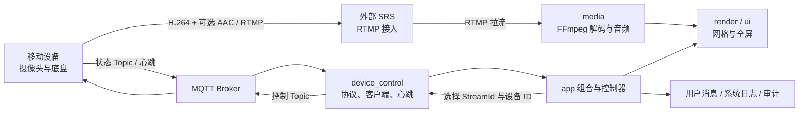
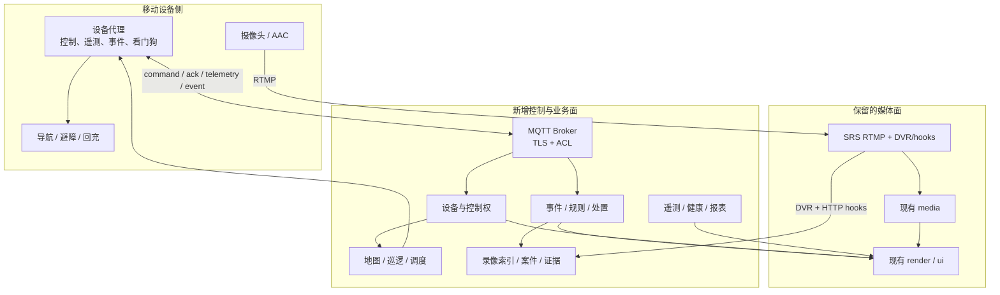

# RtmpMonitor 移动安防产品模块竞品调研与演进建议

> 调研日期：2026-08-15
> 文档性质：产品规划建议，不代表已经批准的研发路线或已经实现的功能
> 约束：保留现有 RTMP/SRS 接入、FFmpeg 解码和 CPU/OpenGL 渲染底座；新增业务能力优先走 MQTT、SRS 扩展能力和独立业务模块
> 场景假设：“移动安防”指带摄像头、扬声器和运动底盘的小车/巡逻设备，而不是单纯的手机监控 App

> 当前架构裁剪（产品与架构已联合接受）：在暂不改变 MQTT 返回值和设备硬件的约束下，当前可实施范围已收敛为单车本地
> 控制安全、诚实审计、平台事件、截图证据和默认关闭的 SRS DVR PoC；命令 ACK、多车、真实 RBAC、
> 遥测、地图与巡逻继续保留在长期路线。实施边界见
> [单车值守闭环架构设计](../architecture/mobile_security_single_vehicle_operator_loop_design.md)。

## 1. 结论先行

RtmpMonitor 已经完成了移动安防产品最难替换的两块底座：一块是稳定的多路 RTMP 实时视频，另一块是可独立演进的 MQTT 设备控制。当前短板不是“还能增加几个播放器按钮”，而是尚未形成安防业务闭环。

推荐优先补齐的产品链路是：

```text
设备可信上线
  → 定向控制并确认执行
  → 异常触发事件
  → 视频、地图和设备状态联动
  → 人员确认与处置
  → 录像、截图和操作记录归档
  → 巡逻复盘与设备运维
```

按产品优先级从高到低，建议依次建设：

1. 设备定向控制、命令回执与失联安全闭环。
2. 身份鉴权、角色权限、控制权租约与审计。
3. 告警与事件中心。
4. 录像、证据与案件管理。
5. 地图/GIS、电子围栏与多设备态势。
6. 巡逻任务、路线、排班与检查点。
7. 设备健康、网络、电量和运维中心。
8. 双向对讲、喊话、预录音和 SOS。
9. 边缘 AI 事件接入与目标检索。
10. 移动网络与主/子码流策略。
11. 事件调度、协同处置与统计报表。
12. 移动端/Web 端及第三方平台开放接口。

其中前四项应视为从“演示型遥控播放器”走向“可试点安防产品”的必要条件。地图和自主巡逻很吸睛，但在命令不能确认、操作没有权限、事件没有证据之前，不宜抢跑。

## 2. 当前项目功能与业务逻辑

### 2.1 已有功能模块

以下结论来自当前源码、CMake 目标、测试清单和项目文档，而不是只根据历史摘要推断。

| 领域 | 当前能力 | 产品判断 |
| --- | --- | --- |
| 视频接入 | 外部 SRS 接收 RTMP；FFmpeg 拉流、H.264 解码、断线重连；最多 16 路连接 | 已具备移动设备实时视频底座 |
| 渲染显示 | 动态网格、拖拽、单路全屏、监控墙、Contain/Cover、CPU 回退与 OpenGL YUV 渲染 | 已具备监控台基本观看体验 |
| 音频 | RTMP 中可选 AAC-LC 下行；全局只允许选择一路播放、静音和全屏联动 | 已具备“听现场”，尚无“向现场说话” |
| 设备档案 | 最多 16 条保存流；稳定 UUID、名称、RTMP URL、自动接入 | 可作为设备档案的早期载体，但数据模型仍偏“流”而不是“安防设备” |
| MQTT 控制 | 单个 Paho 客户端；启动/停止推流、前后左右、停车；摇杆和键盘双模式 | 已有远程控制通道与桌面交互 |
| 设备识别 | 从 RTMP URL 最后一个路径段提取设备 ID；视频卡可选择控制目标 | 已建立“视频卡—设备”绑定雏形 |
| 在线状态 | 独立状态 Topic、设备心跳、30 秒离线判定、Waiting/Online/Offline/Unavailable | 能判断最近是否收到设备心跳，但不能证明命令执行成功 |
| 日志审计 | 用户消息、结构化系统日志、审计日志、脱敏、轮转和有界队列 | 可复用为后续事件与操作审计基础 |
| 运维与诊断 | 播放/解码/渲染指标，SRS 健康监控，Windows/ARM64 构建与测试门禁 | 工程诊断较强，尚未产品化为设备健康中心 |
| 图像留存 | 全屏截图服务已经存在 | 是证据模块的最小入口，尚无统一录像、案件和证据保全 |

### 2.2 当前核心业务链路



典型操作过程如下：

1. 用户保存或新增 RTMP 地址，应用先创建本地播放连接；即使设备尚未推流，播放器也会按既有策略重试。
2. RTMP URL 的最后一个非空路径段被解释为设备 ID，视频卡据此显示心跳在线状态。
3. 用户单击视频卡选择控制目标，再通过摇杆、键盘或按钮发送 MQTT 命令。
4. `startStream` 会把当前视频卡的完整运行时 RTMP URL 放入 MQTT payload，设备开始推流后，已有播放器连接自动恢复。
5. 启动推流和移动命令只允许发给 Online 设备；停车和停止推流在目标存在时不受心跳过期阻断。

### 2.3 当前最关键的业务缺口

- 同一控制 Topic 的 payload 尚无目标设备 ID，当前只能安全地真正控制一台设备。
- MQTT 为明文 TCP、无用户名密码或证书、QoS 0；“客户端已接受发送”不等于“设备已执行”。
- 无 `request_id`、命令 TTL、幂等键、执行阶段回执、错误码、控制权抢占或固件看门狗认证。
- 在线心跳只表示“最近看见设备”，没有电量、定位、速度、网络、存储、温度、故障等遥测。
- 现有事件消息主要服务于软件运行状态，没有安防告警的受理、确认、分派、处置和关闭流程。
- 有截图但无录像时间线、事件前后片段、证据锁定、案件归档、校验和导出权限。
- 无地图、路线、检查点、电子围栏、自动返航/回充或多车调度。
- 无客户端上行语音，不能远程喊话、对讲或处理 SOS。

## 3. 竞品模块与公开实现方式

本节只根据厂商公开产品页、产品手册和官方文档整理，不包含逆向分析。厂商版本和许可组合可能变化，引用能力用于识别成熟产品模式，不代表应原样复制全部功能。

### 3.1 海康威视 HikCentral Professional

HikCentral 的产品结构值得参考的不是“大而全”，而是把监控、报警、地图、巡更和证据放在一个处置闭环里：

- 告警中心把告警关联视频和地图放在同一工作区，支持优先级、分类、备注、确认和视频墙联动。
- Guard Patrol 在电子地图上设计路线和排班，巡逻人员在检查点打卡，并允许通过移动端上报异常和生成巡逻报表。
- Evidence Management 把视频、图片、音频和文档归入案件，提供分类、检索、长期留存、权限、水印和内外部分享。
- On-board/移动能力强调定位、跟踪、路线回放、远程实时/录像查看、告警与健康监控。
- 视频侧还提供低带宽自适应、事件录像、计划录像和多种存储策略。

公开实现方式可以概括为“资源统一建模 + 事件关联 + 地图热点 + 录像/证据对象 + 权限与日志”，而不是让视频播放器自己承担全部业务。参考：[HikCentral Professional V3.0 产品页](https://display.hikvision.com/mena-en/products/software/HikCentral-Professional-series/hikcentral-professional/)、[V3.0 产品手册](https://www.hikvision.com/content/dam/hikvision/en/marketing/image/products/software/hikcentral/hikcentral-professional-subpage/Brochure-HikCentral-Professional-V3.0.pdf)、[HikCentral Web Client 功能目录](https://enpinfo.hikvision.com/hkwsen/unzip/20230315190951_95386_doc/index.html)。

### 3.2 大华 DSS

DSS 的公开产品结构更直接体现了“监控—事件—指挥—运维”分域：

- Monitor Center 聚合视频、地图和实时证据标记。
- Event Center 使用自定义触发器和跨系统联动，把告警、视频弹窗和处置动作放到同一流程。
- Command Center 采用在线事件登记、任务分派、现场处置、看板和统一证据存储的闭环。
- Maintenance Center 汇总服务器、设备和故障状态，并提供详情与报告。
- 产品矩阵将 Mobile Surveillance、Intelligent Inspection 和 Command Center 作为独立业务应用，而不是某个视频窗口的附属按钮。

这说明移动安防更适合按领域拆成可组合模块，事件中心负责流程编排，视频、地图、设备和人员只是被关联的资源。参考：[DSS 产品能力总览](https://www.dahuasecurity.com/products/software/software-products/explore-dss)、[DSS Professional](https://www.dahuasecurity.com/products/software/software-products/dss-professional)、[DSS 集成平台](https://www.dahuasecurity.com/products/software/ecosystem/integration-with-dss)。

### 3.3 Axis Camera Station Pro

Axis 对小型到中型产品尤其有参考价值，因为它把复杂能力做成了清晰的“触发器—动作”规则：

- Action Rules 可用移动侦测、I/O 等事件触发录像、邮件、移动通知或设备动作。
- 事件录像支持 prebuffer、postbuffer、触发间隔、事件分类和不同码流配置。
- 移动通知可以深链到指定摄像机，用户打开通知后直接查看相关实时画面。
- 地图是可导入的平面图，允许放置摄像机、门、音频区域、视图和动作按钮。
- 客户端同时提供告警确认、录像跳转、系统健康和多系统状态。

其实现思路适合本项目的第一阶段：先做少量确定性的规则和动作，不急于建设通用低代码平台。参考：[AXIS Camera Station Pro 用户手册](https://help.axis.com/en-us/axis-camera-station-pro)、[移动端手册](https://help.axis.com/en-us/axis-camera-station-mobile-app)、[功能指南](https://help.axis.com/download/um_camera_station_pro_feature_guide_t10203602_2602.pdf)。

### 3.4 Milestone XProtect

Milestone 最值得借鉴的是调查和证据可信性：

- Alarm Manager 统一内部和外部告警，关联处置说明与地图位置，并记录处理过程。
- Centralized Search 可按时间、摄像机、传感器、告警、事件、书签和元数据检索。
- Evidence Lock 防止特定视频、音频和元数据被正常保留策略删除。
- 导出证据可加密并进行完整性验证；Incident Manager 把视频片段、结构化字段、自由文本、状态和活动日志组织成一个事件项目。

这表明“录像文件”不是最终产品对象，“事件/案件 + 时间片段 + 操作轨迹 + 完整性”才是。参考：[XProtect 产品能力](https://www.milestonesys.com/products/software/xprotect/)、[调查与事件记录指南](https://doc.milestonesys.com/latest/en-US/standard_features/sf_sc/sf_investigate/current/sc_introduction_investigating.htm)、[Incident Manager](https://www.milestonesys.com/products/expand-your-solution/milestone-extensions/incident-manager/)。

### 3.5 Knightscope 与 SMP Robotics

移动巡逻机器人厂商的共性是把机器人看作“自动执行巡逻任务的移动传感器”，而不只是可遥控小车：

- Knightscope 将路线按时间和星期排程，机器人自主避障、低电量返航充电并恢复巡逻；远程中心负责告警复核、对讲、广播和升级处置。
- 其产品强调连续录像、实时告警、事件文档、完整审计和人机协同，明确保留人工判断与升级链路。
- SMP Robotics 同样强调预编程路线、避障、自动充电、热成像/可见光、双向语音、4G/Wi-Fi、位置与运行状态上报，并把视频和告警接入既有 VMS。

公开实现方式可以归纳为“地图路线 + 任务调度 + 本体自治 + 遥测健康 + 异常事件 + 远程人工接管”。参考：[Knightscope 自主巡逻说明](https://knightscope.com/blog/how-the-k5-robot-patrols-without-human-help?hs_amp=true)、[Knightscope 人机协同处置模型](https://knightscope.com/the-force)、[SMP Argus 安防巡逻机器人](https://smprobotics.com/products_autonomous_ugv/security-patrol-robot/)。

## 4. 建议模块优先级

排序综合考虑四个维度：人身/设备安全、安防业务价值、对后续模块的基础性、在现有底座上的实施成本。没有用过度精确的单一分数，避免在尚未取得客户权重和现场数据时制造虚假精度。

### 4.1 优先级总表

| 排名 | 模块 | 阶段 | 为什么现在做 | 最小可用范围 | 是否改变 RTMP 底座 |
| ---: | --- | --- | --- | --- | --- |
| 1 | 定向控制、回执与失联安全 | P0 | 当前只能“发出”，不能证明“执行”；多车和安全都依赖它 | 设备 ID、请求 ID、TTL、幂等、ACK/结果、停车优先、固件看门狗验收 | 否 |
| 2 | 鉴权、RBAC 与控制权 | P0 | 明文无认证不适合真实安防控制，且多人控制可能冲突 | MQTT TLS/凭据、用户角色、控制租约、强制接管、完整审计 | 否 |
| 3 | 告警与事件中心 | P0 | 安防产品必须从“看视频”升级为“处理异常” | 事件模型、分级、去重、确认、处置、关闭、视频联动 | 否 |
| 4 | 录像与证据管理 | P0 | 没有事件前后证据，告警和巡逻无法复盘 | 分段录像、事件前后片段、截图、案件、保留期、校验和导出 | 否 |
| 5 | 地图/GIS 与多设备态势 | P1 | 移动设备的核心上下文是“在哪儿、朝哪儿、是否越界” | 平面图、位置、轨迹、围栏、设备聚合、告警闪烁 | 否 |
| 6 | 巡逻任务与路线 | P1 | 从人工遥控走向可规模化巡逻，直接体现移动安防价值 | 路线、检查点、排班、开始/暂停/恢复、漏检与完成报告 | 否 |
| 7 | 设备健康与运维中心 | P1 | 多车后人工盯在线状态不可扩展 | 电量、网络、温度、存储、版本、故障、维护提醒 | 否 |
| 8 | 双向对讲、喊话与 SOS | P1 | 移动安防需要远程劝离、求助和现场沟通 | WebRTC/Opus 独立上行，按设备半双工对讲，广播音频，SOS | 否；使用独立实时语音通道 |
| 9 | 边缘 AI 事件与目标检索 | P2 | 降低人工盯屏，但必须建立在事件和证据模型之上 | 人/车/越界/徘徊/烟火等结构化元数据，人工复核 | 否 |
| 10 | 移动网络与码流策略 | P2 | 4G/5G 波动下固定高码率会影响控制和观看 | 网络质量、主/子码流切换、设备端码率命令、断网续传 | 否；仍使用 RTMP 承载视频 |
| 11 | 协同调度与运营报表 | P2 | 支撑值班、班组协作和服务质量管理 | 分派、升级、SLA、交接班、巡逻/告警/可用率报表 | 否 |
| 12 | 移动/Web 客户端与开放接口 | P3 | 扩大使用面，但不应先复制一个不完整的桌面端 | 只读态势、告警确认、受控对讲、REST/Webhook/SDK | 否 |

### 4.2 排名 1：定向控制、命令回执与失联安全

建议把当前命令扩展为明确的业务信封，例如：

```json
{
  "request_id": "<uuid>",
  "device_id": "<device-id>",
  "action": "stopCar",
  "issued_at": "<utc-time>",
  "ttl_ms": 1000,
  "sequence": 42,
  "data": {}
}
```

设备应返回 `accepted`、`executing`、`succeeded` 或 `failed`，并带相同 `request_id`、设备 ID、错误码和设备时间。QoS 1 可以减少传输丢失，但会带来重复投递，因此设备端仍必须按请求 ID 幂等。停车应拥有独立高优先级路径；连接丢失、控制租约过期和固件看门狗超时都应进入安全停车。桌面端的“已发送”与“设备已执行”必须使用不同状态和文案。

这一项既不需要把控制塞入 RTMP，也不需要为每辆车创建一个 Paho 客户端。可以采用设备级 Topic，如 `devices/<device-id>/command|ack|telemetry|event`，或保留共享 Topic 但把目标 ID 纳入强制校验的 payload。前者更利于 Broker ACL。

### 4.3 排名 2：身份鉴权、角色权限与控制权租约

至少区分管理员、值班员、观察员和审计员；高风险动作区分“可见、可执行、需二次确认”。同一设备同一时刻只授予一个控制租约，其他用户可申请接管，紧急停车不应被普通租约阻断。设备凭据、用户凭据和媒体访问令牌需要分开管理。

生产部署应评估 MQTT over TLS、每设备凭据或 mTLS、Broker Topic ACL、短期媒体发布/播放令牌和证书轮换。真实端点和密钥继续只保存在本机受限目录，不进入源码、示例或发布包。SRS 官方 HTTP callback 可在 `on_publish`/`on_play` 阶段接入业务鉴权，因此无需改写 RTMP 协议栈：[SRS HTTP Callback](https://ossrs.io/lts/en-us/docs/v5/doc/http-callback)。

### 4.4 排名 3：告警与事件中心

建议统一四类事件源：

- 设备事件：SOS、碰撞、倾倒、低电量、越界、传感器报警。
- 视频事件：移动、人车、入侵、徘徊、遮挡、画面丢失。
- 平台事件：RTMP 断流、MQTT 离线、存储不足、时间不同步。
- 人工事件：值班员手工标记、巡逻检查点异常、外部系统 Webhook。

事件状态最小闭环为 `New → Acknowledged → InProgress → Resolved → Closed`，同时记录优先级、来源、设备、位置、关联视频、责任人、处置说明和全部状态变化。第一阶段只实现确定性规则：事件类型 + 时间段 + 设备组 → 弹窗/声音/录像/通知/停车等动作；避免一开始建设通用脚本语言。

### 4.5 排名 4：录像、证据与案件管理

推荐先利用现有 SRS 旁路能力，不修改播放器的解码和渲染路径：

1. SRS 按短分段持续 DVR，并保留一个有限环形窗口。
2. SRS `on_dvr` callback 把文件、流 ID、开始时间和持续时间通知独立证据索引服务。
3. 事件发生后锁定前后相关分段，异步重封装为便于回放和导出的格式。
4. 当前截图服务产生的图片、事件日志、遥测快照和录像片段共同归入案件。
5. 证据对象记录 SHA-256、创建者、来源、保留期、访问权限和每次导出行为。

SRS 已公开支持 segment DVR 和 `on_dvr` 回调，可作为 PoC 起点：[SRS DVR](https://ossrs.net/lts/en-us/docs/v5/doc/dvr)。正式方案仍需验证断流分段、关键帧边界、磁盘满、时间同步、掉电恢复和 Windows/ARM64 部署。

### 4.6 排名 5～7：地图、巡逻与运维

地图模块先支持导入园区平面图，再根据现场条件选择室外 GIS。设备每 1～5 秒上报位置、航向、速度和定位质量；轨迹存储应降采样并设置保留期。电子围栏事件必须包含进入/离开、位置精度和持续时间，避免定位漂移造成告警风暴。

巡逻任务以“路线版本 + 检查点 + 时间窗 + 设备能力要求”建模。任务运行时记录到点、停留、采集、异常、人工接管、暂停、恢复和完成。自主导航、避障、自动回充属于设备本体能力，监控台负责下发任务、观察状态和接管，不应在 Qt UI 线程内实现导航算法。

运维中心优先展示电量、预计续航、充电状态、信号质量、RTMP/MQTT 时延、温度、磁盘、固件和传感器故障。只有达到阈值并持续一定时间才产生事件，原始遥测进入时序存储或按窗口聚合，不能逐条写审计日志。

### 4.7 排名 8～10：对讲、AI 与移动网络

双向语音不建议强塞进 RTMP。保留当前 RTMP AAC 下行作为“听现场”，客户端麦克风上行采用独立 WebRTC/Opus 通道，先做按设备半双工 Push-to-Talk，再评估全双工、回声消除和多人会议。所有自动喊话和预录音都应进入事件与审计链。

AI 优先在设备端或独立分析服务运行，向平台发送结构化事件和小图；平台负责规则、人工复核、证据和检索。第一批宜选人形/车辆、越界、徘徊和烟火等与场景直接相关的算法，并要求记录模型版本、阈值和人工确认结果。人脸和车牌等敏感能力需要单独的合规评审、权限和保留策略。

移动网络策略仍保留 RTMP：设备上报 4G/5G/Wi-Fi 信号和发送队列，平台通过 MQTT 指令切换预先定义的高/中/低码率档位或主/子流；视频仍通过原 RTMP URL 进入 SRS。控制消息和停车命令的网络优先级不得被录像上传占满。

## 5. 不改变 RTMP 底座的目标架构



建议继续遵守当前依赖方向：

- `media` 不依赖事件、地图、巡逻、证据或 UI；它只提供帧、音频包和播放状态。
- `render` 不依赖业务模块；告警边框、地图浮层等由 UI 组合状态。
- `device_control` 负责 MQTT 传输与协议对象，不直接写窗口、案件或数据库。
- `event`、`fleet`、`patrol`、`evidence` 和 `operations` 是独立业务模块，由应用组合根连接。
- 事件与任务的查询明显超过当前 JSON 档案能力时，再引入本地 SQLite；该变更涉及 schema、数据所有权和迁移，实施前按 R2 架构门禁评审。
- SRS DVR、HTTP callback、鉴权服务或 WebRTC 服务均作为伴随服务/独立进程，不把协议服务器塞进 Qt 主进程。

## 6. 推荐分期与验收指标

### Phase A：安全可控的单车试点

范围：排名 1～3 的最小版本。

- 冻结命令/ACK/遥测/事件协议 v1。
- 完成设备 ID、请求 ID、TTL、幂等、停车优先级和固件断网看门狗。
- 完成 TLS/凭据、三类最小角色、单设备控制租约和审计。
- 完成事件列表、分级、确认、关闭及在线/断流/SOS 三种事件。

门禁：受控台架连续执行不少于 1,000 次命令；命令结果可关联率 100%；紧急停车端到端 P95 和最大值由硬件团队共同签字；断网、重复消息、乱序、应用崩溃和 Broker 重启均不会导致持续运动。

### Phase B：可复盘的安防闭环

范围：排名 4，加上事件规则的录像联动。

- SRS 分段录像、环形保留、`on_dvr` 索引和事件前后片段。
- 案件、截图、录像、遥测快照、处理记录、权限和完整性校验。
- 统一时间线、搜索、回放和受控导出。

门禁：随机抽取事件的前后片段完整率、时间偏差、校验失败率、磁盘满恢复、异常断电恢复和越权访问全部达到约定标准；任何“已锁定”证据不会被普通保留策略删除。

### Phase C：多车、地图与巡逻

范围：排名 5～7。

- 多设备档案、地图位置、轨迹、围栏、设备聚合和告警联动。
- 路线版本、检查点、排班、任务状态、人工接管和巡逻报告。
- 电量、网络、温度、存储、版本和故障运维。

门禁：先以 2～4 台模拟设备跑通并发控制隔离，再做真实设备；错误设备收到命令必须为 0；路线完成率、检查点漏检率、位置漂移告警率和低电量返航成功率必须有现场数据。

### Phase D：主动处置与智能化

范围：排名 8～12，按客户场景拆分立项。

- WebRTC/Opus 半双工对讲、喊话和 SOS。
- 边缘 AI 事件、人工复核、目标搜索。
- 码率策略、断网续传、协同调度、报表、移动/Web 客户端和开放接口。

门禁：AI 以现场误报/漏报和人工复核成本验收，不以实验室准确率代替；对讲以声学延迟、回声、丢包和权限验收；移动网络以弱网场景的控制可用性优先于画质。

## 7. 产品指标建议

| 指标 | 说明 |
| --- | --- |
| 命令可确认率 | 发出的有效命令中，能在 TTL 内收到确定结果的比例 |
| 紧急停车延迟 | 从操作者触发到设备执行并回执的 P50/P95/最大值 |
| 错控率 | 命令被非目标设备接受或执行的次数，目标必须为 0 |
| 设备可用率 | 在线、可控、可推流三种状态分别统计，不能混成一个绿点 |
| 告警平均确认时间 MTTA | 从事件创建到人员确认 |
| 告警平均处置时间 MTTR | 从事件创建到解决/关闭 |
| 告警压缩率 | 原始事件经合并、抑制后减少的重复告警比例 |
| 证据完整率 | 告警是否具备约定的前后视频、截图、位置、遥测和操作记录 |
| 巡逻完成率 | 按时完成的任务与检查点比例，区分设备故障和人为取消 |
| 人工接管率 | 自主任务中需要人工接管的比例及原因分布 |
| 单设备月流量/存储 | 按实时、录像、回传和证据导出分别核算 |

## 8. 产品边界与暂不建议事项

- 暂不自研 RTMP Server、通用 GIS 引擎、通用工作流引擎或机器人导航算法。
- 暂不把事件、证据、地图和巡逻状态塞进 `MainWindow` 或 `MultiStreamPlaybackManager`。
- 暂不以“MQTT 已发送”宣传“车辆已执行”，也不以“心跳在线”宣传“设备安全可控”。
- 暂不优先做人脸库、车牌库或大模型自动决策；先完成权限、事件、证据和人工复核。
- 暂不默认开启任何公网 Broker、云服务、推送或真实设备端点。
- 暂不把手机 App 作为第一优先级；先把桌面端业务闭环和服务端契约做正确，再复用接口开发轻客户端。

## 9. 建议的下一步决策

产品负责人应先确认一个试点场景，例如“园区夜间单车遥控巡逻”或“仓库固定路线自动巡逻”。场景确定后，用一页 PRD 冻结以下内容：

1. 谁可以看、谁可以控制、谁可以强制接管。
2. 哪些异常必须产生告警，谁负责确认和关闭。
3. 哪些操作必须录像，前后各保留多久。
4. 单车还是多车，室内平面图还是室外 GIS，是否具备定位和自主导航。
5. 固件对 ACK、TTL、幂等、停车看门狗、电量和位置上报能支持到什么程度。
6. 试点环境允许的 Broker、证书、存储和网络边界。

在没有上述答案前，最值得立即启动的技术工作不是地图界面，而是与固件团队共同定义并台架验证“命令—回执—停车”协议。它对现有 RTMP 播放底座零侵入，却决定了后续所有移动安防模块是否可信。
