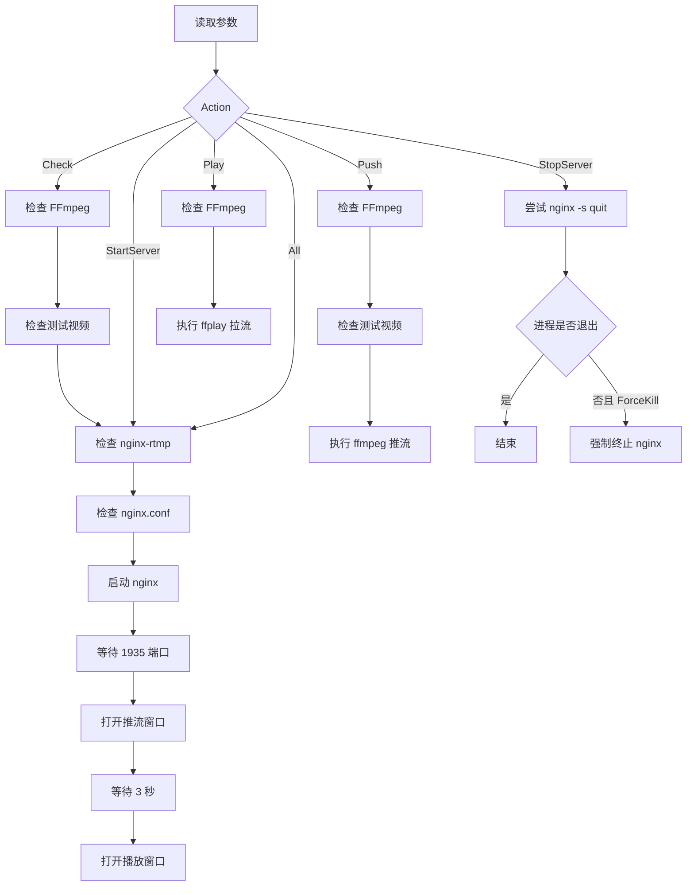

# RTMP 推流链路验证脚本说明

## 1. 文档目的

本文档用于说明项目中的 PowerShell 脚本：

```text
scripts/verify_rtmp_chain.ps1
```

该脚本用于在 Windows 环境下验证以下完整链路是否可用：

```text
本地 MP4
  ↓ ffmpeg 读取、缩放、H.264 编码
nginx-rtmp 接收与转发
  ↓
ffplay 拉取 RTMP 流并播放
```

当前脚本版本：

```text
2026-07-11-v5
```

脚本主要用于项目早期开发、环境迁移、故障排查和后续回归验证。它不负责 Qt 客户端中的 FFmpeg 解码，也不替代正式的多路视频播放模块。

---

## 2. 文件放置位置

推荐项目结构：

```text
E:\rtmpProject
├── docs
│   └── rtmp_chain_verification.md
├── include
├── scripts
│   └── verify_rtmp_chain.ps1
├── src
├── testdata
│   └── test.mp4
├── .gitignore
├── CMakeLists.txt
├── CMakePresets.json
└── README.md
```

脚本必须放在：

```text
E:\rtmpProject\scripts\verify_rtmp_chain.ps1
```

原因是脚本通过以下逻辑推导项目根目录：

```powershell
$ProjectRoot = Split-Path -Parent $PSScriptRoot
```

也就是说：

```text
脚本目录：E:\rtmpProject\scripts
脚本目录的父目录：E:\rtmpProject
默认测试视频：E:\rtmpProject\testdata\test.mp4
```

如果改变脚本所在目录，需要同步修改项目根目录的推导逻辑，或者执行脚本时显式传入 `-InputFile`。

---

## 3. 默认环境要求

脚本默认使用以下环境：

```text
FFmpeg：
已加入 PATH，可直接执行 ffmpeg、ffplay、ffprobe

nginx-rtmp：
E:\DevTools\nginx-rtmp

测试视频：
E:\rtmpProject\testdata\test.mp4

RTMP 地址：
rtmp://127.0.0.1:1935/live/camera001
```

nginx-rtmp 目录应至少包含：

```text
E:\DevTools\nginx-rtmp
├── conf
│   └── nginx.conf
├── logs
├── sbin
│   └── nginx.exe
└── temp
    └── hls
        └── live
```

FFmpeg 环境应支持：

```text
libx264 编码器
RTMP 协议
FLV 封装器
```

可手动验证：

```powershell
ffmpeg -hide_banner -encoders | findstr /I libx264
ffmpeg -hide_banner -protocols | findstr /I rtmp
ffmpeg -hide_banner -muxers | findstr /I flv
```

---

## 4. 脚本主要功能

脚本通过 `-Action` 参数选择操作。

| Action | 功能 |
|---|---|
| `Check` | 检查 FFmpeg、测试视频、nginx-rtmp 模块及 nginx 配置 |
| `StartServer` | 检查环境后启动 nginx-rtmp，并确认 1935 端口可连接 |
| `Push` | 使用 FFmpeg 循环推送测试视频 |
| `Play` | 使用 ffplay 低延迟拉取并播放 RTMP 流 |
| `All` | 启动 nginx，然后分别打开推流窗口和播放窗口 |
| `StopServer` | 尝试正常停止 nginx；配合 `-ForceKill` 可强制结束进程 |

不指定 `-Action` 时，默认执行：

```powershell
-Action Check
```

---

## 5. 快速使用

建议在项目根目录运行：

```powershell
cd E:\rtmpProject
```

### 5.1 环境检查

```powershell
powershell `
    -NoProfile `
    -ExecutionPolicy Bypass `
    -File ".\scripts\verify_rtmp_chain.ps1" `
    -Action Check
```

该操作会检查：

1. `ffmpeg`、`ffplay`、`ffprobe` 是否在 PATH 中；
2. FFmpeg 是否支持 `libx264`；
3. FFmpeg 是否支持 RTMP；
4. FFmpeg 是否支持 FLV 封装；
5. 测试视频是否存在；
6. 测试视频的编码、Profile、分辨率、像素格式、帧率和码率；
7. `nginx.exe` 和 `nginx.conf` 是否存在；
8. nginx 是否编译了 `nginx-rtmp-module`；
9. nginx 配置语法是否正确。

### 5.2 一键启动完整测试链路

```powershell
powershell `
    -NoProfile `
    -ExecutionPolicy Bypass `
    -File ".\scripts\verify_rtmp_chain.ps1" `
    -Action All
```

脚本会：

1. 检查 nginx-rtmp；
2. 检查 nginx.conf；
3. 启动 nginx；
4. 等待 1935 端口可连接；
5. 打开一个 FFmpeg 推流 PowerShell 窗口；
6. 等待约 3 秒；
7. 打开一个 ffplay 播放 PowerShell 窗口。

### 5.3 分步骤执行

启动服务器：

```powershell
.\scripts\verify_rtmp_chain.ps1 -Action StartServer
```

开始推流：

```powershell
.\scripts\verify_rtmp_chain.ps1 -Action Push
```

开始播放：

```powershell
.\scripts\verify_rtmp_chain.ps1 -Action Play
```

停止服务器：

```powershell
.\scripts\verify_rtmp_chain.ps1 -Action StopServer
```

强制停止服务器：

```powershell
.\scripts\verify_rtmp_chain.ps1 `
    -Action StopServer `
    -ForceKill
```

---

## 6. 正确退出顺序

执行 `-Action All` 后通常会出现：

```text
窗口 1：FFmpeg 推流
窗口 2：ffplay 播放
窗口 3：原始项目 PowerShell
```

推荐退出顺序：

### 6.1 停止推流

切换到 FFmpeg 推流窗口，按：

```text
q
```

也可以按 `Ctrl+C`，但优先使用 `q`。

### 6.2 停止播放

切换到 ffplay 播放窗口，按：

```text
q
```

也可以直接关闭播放窗口。

### 6.3 停止 nginx

回到项目 PowerShell：

```powershell
.\scripts\verify_rtmp_chain.ps1 `
    -Action StopServer `
    -ForceKill
```

### 6.4 验证进程和端口已释放

```powershell
Get-Process nginx,ffmpeg,ffplay -ErrorAction SilentlyContinue

Get-NetTCPConnection `
    -LocalPort 1935 `
    -State Listen `
    -ErrorAction SilentlyContinue
```

两条命令都没有输出，表示测试相关进程已全部退出。

---

## 7. 脚本参数说明

### 7.1 Action

```powershell
[string]$Action = "Check"
```

允许值：

```text
Check
StartServer
Push
Play
All
StopServer
```

不建议增加任意字符串，因为脚本通过 `ValidateSet` 限制了合法值。

### 7.2 NginxRoot

```powershell
[string]$NginxRoot = "E:\DevTools\nginx-rtmp"
```

用于指定 nginx-rtmp 的安装根目录。

更换安装位置时，可以直接传参：

```powershell
.\scripts\verify_rtmp_chain.ps1 `
    -Action Check `
    -NginxRoot "E:\OtherTools\nginx-rtmp"
```

也可以修改脚本中的默认值。

### 7.3 InputFile

```powershell
[string]$InputFile = ""
```

留空时，脚本自动使用：

```text
项目根目录\testdata\test.mp4
```

临时测试其他视频：

```powershell
.\scripts\verify_rtmp_chain.ps1 `
    -Action All `
    -InputFile "E:\Videos\camera_test.mp4"
```

推荐测试视频：

```text
编码：H.264
分辨率：1280×720 或 1920×1080
帧率：15、25 或 30 FPS
时长：10 秒到 2 分钟
```

即使原视频不是 H.264，当前推流命令也会使用 `libx264` 重新编码。

### 7.4 StreamUrl

```powershell
[string]$StreamUrl = "rtmp://127.0.0.1:1935/live/camera001"
```

RTMP 地址结构：

```text
rtmp://服务器地址:端口/application/stream-name
```

当前对应关系：

```text
服务器：127.0.0.1
端口：1935
application：live
流名称：camera001
```

测试另一条流：

```powershell
.\scripts\verify_rtmp_chain.ps1 `
    -Action All `
    -StreamUrl "rtmp://127.0.0.1:1935/live/camera002"
```

修改 `application` 时，还必须同步修改 nginx.conf 中的：

```nginx
application live {
    live on;
}
```

例如改为：

```nginx
application monitor {
    live on;
}
```

对应地址应改为：

```text
rtmp://127.0.0.1:1935/monitor/camera001
```

### 7.5 ForceKill

```powershell
[switch]$ForceKill
```

只在 `StopServer` 中使用。

作用是：如果 `nginx -s quit` 无法正常停止后台进程，则使用 `Stop-Process -Force` 强制终止剩余 nginx 进程。

---

## 8. 脚本执行逻辑

### 8.1 总体流程



### 8.2 Check 逻辑

`Check` 依次调用：

```text
Test-FFmpegEnvironment
Show-TestVideoInformation
Test-NginxEnvironment
```

它不会启动 nginx，也不会推流。

### 8.3 StartServer 逻辑

`StartServer` 会：

1. 先执行 nginx 环境和配置检查；
2. 查询是否已有 nginx 进程；
3. 如果 nginx 已运行且 1935 可连接，则不重复启动；
4. 如果有残留进程但 1935 不可连接，则先强制清理；
5. 使用 `.NET ProcessStartInfo` 启动 nginx；
6. 每 500 毫秒检查一次进程和 1935 端口；
7. 最多等待 10 秒；
8. 启动失败时输出 `logs\error.log` 的最后 20 行。

脚本没有直接使用普通 PowerShell 管道启动 nginx，因为 Windows nginx 会创建常驻后台进程。捕获输出管道可能导致脚本一直等待，看起来像“卡住”。

### 8.4 Push 逻辑

脚本执行的 FFmpeg 核心参数相当于：

```powershell
ffmpeg `
    -re `
    -stream_loop -1 `
    -i "test.mp4" `
    -c:v libx264 `
    -preset veryfast `
    -tune zerolatency `
    -vf "scale=1280:-2" `
    -r 30 `
    -b:v 2500k `
    -maxrate 2500k `
    -bufsize 5000k `
    -an `
    -f flv `
    "rtmp://127.0.0.1:1935/live/camera001"
```

参数含义：

| 参数 | 作用 |
|---|---|
| `-re` | 按正常播放速度读取文件 |
| `-stream_loop -1` | 无限循环测试视频 |
| `-c:v libx264` | 重新编码为 H.264 |
| `-preset veryfast` | 使用较快的软件编码速度 |
| `-tune zerolatency` | 减少编码缓存 |
| `-vf scale=1280:-2` | 缩放为 1280 宽，高度按比例自动计算 |
| `-r 30` | 输出 30 FPS |
| `-b:v 2500k` | 目标视频码率约 2.5 Mbps |
| `-maxrate 2500k` | 限制最大码率 |
| `-bufsize 5000k` | 设置码率控制缓冲区 |
| `-an` | 不推送音频 |
| `-f flv` | 使用 FLV 封装输出到 RTMP |

### 8.5 Play 逻辑

脚本执行的 ffplay 核心参数相当于：

```powershell
ffplay `
    -fflags nobuffer `
    -flags low_delay `
    -framedrop `
    "rtmp://127.0.0.1:1935/live/camera001"
```

参数含义：

| 参数 | 作用 |
|---|---|
| `-fflags nobuffer` | 尽量减少输入缓冲 |
| `-flags low_delay` | 启用低延迟倾向 |
| `-framedrop` | 播放来不及时允许丢帧 |

### 8.6 All 逻辑

`All` 不是在一个窗口中串行执行推流和播放，而是：

1. 在当前窗口启动 nginx；
2. 使用 `Start-Process` 新建一个 PowerShell 窗口运行 `Push`；
3. 等待约 3 秒；
4. 新建另一个 PowerShell 窗口运行 `Play`。

新窗口使用：

```text
-NoProfile
```

目的是避免用户 PowerShell 配置文件中的无效命令干扰脚本，例如已经失效的 Conda 初始化路径。

---

## 9. 如何修改推流参数

推流参数位于：

```powershell
function Start-TestPush
```

内部的：

```powershell
$arguments = @(...)
```

### 9.1 修改输出分辨率

当前：

```powershell
"-vf", "scale=1280:-2"
```

改为 1920×1080：

```powershell
"-vf", "scale=1920:1080"
```

改为 640 宽并保持比例：

```powershell
"-vf", "scale=640:-2"
```

### 9.2 修改帧率

当前：

```powershell
"-r", "30"
```

改为 25 FPS：

```powershell
"-r", "25"
```

初期测试建议使用 15、25 或 30 FPS。

### 9.3 修改码率

当前：

```powershell
"-b:v", "2500k",
"-maxrate", "2500k",
"-bufsize", "5000k"
```

720p 测试可使用：

```text
1500k 到 3000k
```

1080p 测试可使用：

```text
3000k 到 6000k
```

### 9.4 保留音频

当前脚本使用：

```powershell
"-an"
```

表示不推送音频。

需要推送 AAC 音频时，删除 `"-an"`，并添加：

```powershell
"-c:a", "aac",
"-b:a", "128k",
"-ar", "48000"
```

示例：

```powershell
"-c:v", "libx264",
"-preset", "veryfast",
"-tune", "zerolatency",
"-c:a", "aac",
"-b:a", "128k",
"-ar", "48000",
"-f", "flv"
```

### 9.5 修改编码速度

当前：

```powershell
"-preset", "veryfast"
```

常见选择：

```text
ultrafast
superfast
veryfast
faster
fast
medium
```

速度越快，CPU 压力通常越低，但相同画质下码率可能更高。

---

## 10. nginx.conf 相关修改

当前项目只需要 RTMP 推流和拉流，最小配置类似：

```nginx
rtmp {
    server {
        listen 1935;
        chunk_size 4096;

        application live {
            live on;
            record off;
        }
    }
}
```

当前 nginx.conf 还启用了 HLS，因此需要存在：

```text
E:\DevTools\nginx-rtmp\temp\hls\live
```

建议使用绝对路径：

```nginx
hls_path E:/DevTools/nginx-rtmp/temp/hls/live;
```

不要使用：

```nginx
hls_path temp/hls/live;
```

因为某些 Windows nginx 构建会按当前工作目录解析相对路径，从其他目录启动时可能报：

```text
CreateDirectory() "temp/hls/live" failed
```

如果项目现阶段完全不需要 HLS，也可以暂时关闭：

```nginx
hls off;
```

关闭前要确认配置中是否还有依赖 HLS 文件的 HTTP location。

修改 nginx.conf 后必须先验证：

```powershell
& "E:\DevTools\nginx-rtmp\sbin\nginx.exe" `
    -t `
    -p "E:\DevTools\nginx-rtmp\" `
    -c "conf\nginx.conf" `
    2>&1
```

只有出现：

```text
syntax is ok
test is successful
```

才可以重新启动 nginx。

---

## 11. 常见问题

### 11.1 找不到 ffmpeg

现象：

```text
找不到命令：ffmpeg
```

处理：

```powershell
where.exe ffmpeg
where.exe ffplay
where.exe ffprobe
```

确认 FFmpeg 的 `bin` 目录已加入用户 PATH。

### 11.2 nginx.conf 检查失败

查看日志：

```powershell
Get-Content `
    "E:\DevTools\nginx-rtmp\logs\error.log" `
    -Tail 50
```

重点检查：

```text
路径是否存在
端口是否被占用
hls_path 是否为有效路径
nginx.conf 是否有语法错误
```

### 11.3 1935 端口没有监听

检查：

```powershell
Get-Process nginx -ErrorAction SilentlyContinue

Get-NetTCPConnection `
    -LocalPort 1935 `
    -State Listen `
    -ErrorAction SilentlyContinue
```

如果只有 nginx 进程但没有端口监听，可能是残留进程。可执行：

```powershell
Get-Process nginx -ErrorAction SilentlyContinue |
    Stop-Process -Force
```

然后重新启动。

### 11.4 无法正常停止 nginx

某些 Windows nginx 构建可能出现：

```text
OpenEvent("Global\ngx_quit_xxx") failed
```

这通常表示 nginx 主进程状态异常或只剩孤立进程。

直接执行：

```powershell
.\scripts\verify_rtmp_chain.ps1 `
    -Action StopServer `
    -ForceKill
```

### 11.5 推流成功但播放器黑屏

检查：

```text
推流窗口中的 frame 是否持续增长
ffplay 是否连接到了正确的 URL
nginx.conf 中 application 名称是否为 live
是否等待到了 H.264 关键帧
```

可以等待几秒后重新打开播放器。

### 11.6 PowerShell 启动时报 Conda 错误

使用：

```powershell
powershell -NoProfile
```

脚本的 `All` 操作已经为新窗口添加 `-NoProfile`，不会加载用户 PowerShell Profile。

---

## 12. 修改脚本后的验证顺序

修改脚本后不要直接执行 `All`，建议按以下顺序回归：

### 第一步：语法和环境检查

```powershell
powershell `
    -NoProfile `
    -ExecutionPolicy Bypass `
    -File ".\scripts\verify_rtmp_chain.ps1" `
    -Action Check
```

### 第二步：单独启动服务器

```powershell
.\scripts\verify_rtmp_chain.ps1 -Action StartServer
```

检查：

```powershell
Get-Process nginx

Get-NetTCPConnection `
    -LocalPort 1935 `
    -State Listen
```

### 第三步：单独推流

```powershell
.\scripts\verify_rtmp_chain.ps1 -Action Push
```

确认 `frame`、`fps` 和 `time` 持续增长。

### 第四步：单独拉流

```powershell
.\scripts\verify_rtmp_chain.ps1 -Action Play
```

确认能够看到视频。

### 第五步：测试一键操作

```powershell
.\scripts\verify_rtmp_chain.ps1 -Action All
```

### 第六步：测试退出

```powershell
.\scripts\verify_rtmp_chain.ps1 `
    -Action StopServer `
    -ForceKill
```

---

## 13. Git 管理建议

建议提交：

```text
scripts/verify_rtmp_chain.ps1
docs/rtmp_chain_verification.md
```

不建议提交：

```text
testdata/test.mp4
FFmpeg 安装目录
nginx-rtmp 安装目录
运行时 HLS 切片
录像文件
日志文件
```

`.gitignore` 建议包含：

```gitignore
# Local test videos
testdata/

# Generated runtime data
runtime/

# Optional media outputs
*.flv
*.ts
*.m3u8
```

如果未来希望保留 `testdata` 目录但不提交视频，可以改为：

```gitignore
testdata/*
!testdata/.gitkeep
```

然后创建：

```text
testdata/.gitkeep
```

提交脚本与文档：

```powershell
git add ".\scripts\verify_rtmp_chain.ps1"
git add ".\docs\rtmp_chain_verification.md"
git add ".gitignore"

git status
git diff --cached

git commit -m "docs: add RTMP verification script guide"
git push
```

---

## 14. 当前脚本的定位

这个脚本解决的是：

```text
音视频环境是否正确
RTMP Server 是否可用
测试视频是否可推送
RTMP 流是否可拉取并播放
```

它不解决：

```text
Qt 程序接入 FFmpeg 开发库
Qt 中解复用和 H.264 解码
AVFrame 转 QImage
QThread 解码线程
多路视频显示
断线重连
OpenGL 渲染
```

当该脚本能够稳定运行时，可以认为外部 RTMP 基础设施已经可用。后续 Qt 客户端出现拉流问题时，可以先运行此脚本，区分问题属于：

```text
FFmpeg / nginx / 网络链路
```

还是属于：

```text
Qt / CMake / FFmpeg 开发库 / 解码代码
```
