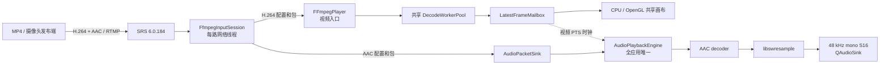
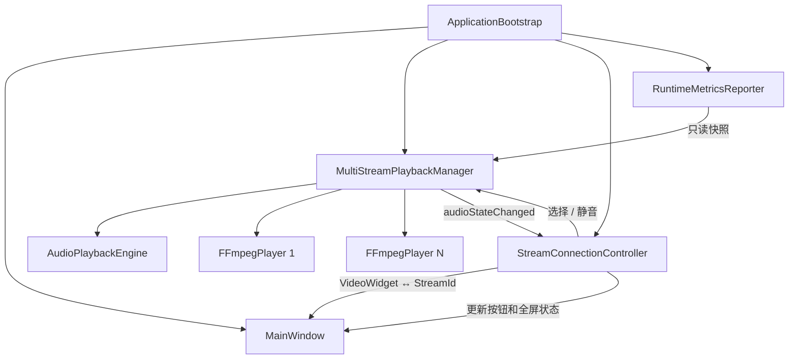

# RtmpMonitor 低延迟单向音频框架与 MP4 手工测试指南

## 1. 文档目的

本文对应当前源码，集中说明以下内容：

- 音频模块支持什么、不支持什么。
- 音频相关类分别负责什么，以及对象由谁创建和销毁。
- AAC 音频如何嵌入现有 RTMP、视频解码、渲染、UI 和诊断框架。
- 网络线程、视频解码线程、音频线程和 UI 线程如何协作。
- 如何在 Windows + WSL2 SRS 环境中手工执行 MP4 推流、服务端检查、RtmpMonitor 拉流和声音测试。
- 如何读取运行指标，以及怎样判断断续、“卡兹”声、积压、欠载或格式错误。

本文以实际源码、CMake 和 2026-08-15 的运行结果为准。若文档与代码冲突，应优先检查当前代码和测试结果并修正文档。

## 2. 当前能力和明确边界

当前版本只实现“设备/发布端到客户端”的单向音频下行：

```text
设备或 MP4
  -> H.264 + AAC-LC
  -> RTMP/FLV
  -> SRS
  -> RtmpMonitor
  -> AAC 解码
  -> 48 kHz mono S16 PCM
  -> 系统默认音频输出
```

当前输入约束：

| 项目 | 当前约束 |
|---|---|
| 容器/协议 | RTMP/FLV |
| 视频 | 必须存在，编码必须为 H.264 |
| 音频 | 可选；存在时必须为 AAC，推荐 AAC-LC |
| 发布规格 | 48 kHz、单声道、64 kbit/s |
| 客户端 PCM | 48 kHz、单声道、S16 |
| 同时播放 | 全应用最多一路 |
| 启动行为 | 默认不选择任何音频，保持静音 |
| 输出设备 | 系统默认音频输出 |

以下内容不属于当前版本：

- 客户端麦克风上行。
- 设备端扬声器和双向对讲。
- AEC、AGC、降噪和多路混音。
- 音量滑块、输出设备选择和音频状态持久化。
- 以 PCM 直接写入 RTMP/FLV；线上传输仍使用 AAC。
- WebRTC/Opus 双向语音。后续阶段应保留 RTMP 视频，并建立独立的 WebRTC/Opus 音频通道。

没有音频轨、音频不是 AAC 或输出设备不可用都是非致命音频状态。它们不会停止视频，不会改变 RTMP 重连策略，也不会影响 MQTT 设备控制。

## 3. 总体架构

### 3.1 运行时数据流



音频复用现有 `FfmpegInputSession` 和 `FFmpegPlayer` 的网络连接，不另开第二条 RTMP 拉流连接。解复用后，视频和音频才进入不同的处理路径。

### 3.2 对象组装和控制流



`ApplicationBootstrap` 是组合根。它创建 `MultiStreamPlaybackManager`、`MainWindow`、`StreamConnectionController` 和 `RuntimeMetricsReporter`，但不直接操作 AAC 解码器或 `QAudioSink`。

## 4. 类与职责

### 4.1 公共媒体类型

#### `PlaybackTypes.h`

位置：`include/common/media/PlaybackTypes.h`

主要音频类型：

- `AudioPlaybackState`
  - `Unavailable`：没有可用 AAC 配置、会话已失效或流中没有音频。
  - `Buffering`：该路已被选择并正在等待可播放 PCM。
  - `Playing`：正在向音频 Sink 写入，音量非零。
  - `Muted`：流支持音频，但当前未选择或音量被设为零。
  - `OutputError`：默认输出设备或输出格式不可用，或音频解码/输出发生错误。
- `AudioPlaybackMetrics`
  - 音频流、状态、收包数、解码数和丢弃数。
  - 欠载次数与欠载累计时长。
  - 压缩包队列、PCM 缓冲、请求/实际 Sink 缓冲。
  - 运行期内部输出延迟 P50/P95。
- `StreamId`
  - 音频选择绑定稳定的流 ID，而不是视频格位置。拖拽换位、全屏和网格重排不会改变音频绑定。

运行期 `outputLatencyP50Ms/P95Ms` 主要用于定位客户端内部处理，不等于发布端到扬声器的完整端到端延迟。正式资格报告使用独立观察接缝记录 Sink 实际写入时刻。

### 4.2 RTMP 输入和音视频分轨

#### `FfmpegInputSession`

位置：

- `src/common/media/FfmpegInputSession.h`
- `src/common/media/FfmpegInputSession.cpp`
- `src/common/media/FfmpegSessionTypes.h`

职责：

- 在每一路播放器的阻塞网络线程中执行一次 RTMP 打开、探测和读包。
- 使用 `rtmp_live=live`、`rtmp_buffer=0`、`tcp_nodelay=1`、`fflags=nobuffer`、`max_delay=0` 等低延迟输入参数。
- 识别必需的 H.264 视频轨和可选 AAC 音频轨。
- 将 `AVCodecParameters`、time base、轨道类型和 stream index 包装为内部 `FfmpegCodecConfiguration`。
- 使用 `FfmpegTrackKind::Video/Audio` 对包进行分轨。
- 通过 `av_packet_move_ref` 把 `AVPacket` 所有权移交给回调接收方。
- 通过 FFmpeg interrupt callback 响应停止和重连，不拥有重连策略。

`FfmpegCodecConfiguration` 是实现私有类型。FFmpeg 的 `AVCodecParameters`、`AVPacket` 和 `AVRational` 不会进入 UI 或 render 层。

#### `FFmpegPlayer`

位置：

- `include/common/media/FFmpegPlayer.h`
- `src/common/media/FFmpegPlayer.cpp`

职责：

- 每路拥有一个独立网络线程和重连状态机。
- 创建 `FfmpegInputSession`，接收分轨后的配置和包。
- 视频配置/包继续进入现有共享 `DecodeWorkerPool`。
- 音频配置/包通过非拥有指针 `AudioPacketSink*` 转发给全局音频引擎。
- 在停止、重连或新一代会话开始时调用 `invalidateAudioSession()`，防止旧会话音频残留。
- 不创建 AAC 解码器，不创建 `QAudioSink`，也不保存 UI 音频状态。

### 4.3 音频边界和音频引擎

#### `AudioPacketSink`

位置：`include/common/media/AudioPacketSink.h`

这是 `FFmpegPlayer` 与具体音频实现之间的窄接口：

- `submitAudioConfiguration()`：移交某一流、某一会话代次的音频配置。
- `submitAudioPacket()`：完整移交一个音频 `AVPacket` 的所有权。
- `invalidateAudioSession()`：使旧代次配置、队列和解码状态失效。

接口使用 `void*`/`shared_ptr<void>` 隐藏 FFmpeg 类型，防止上层公共头文件继续扩散 FFmpeg 依赖。

#### `AudioPlaybackEngine`

位置：

- `include/common/media/AudioPlaybackEngine.h`
- `src/common/media/AudioPlaybackEngine.cpp`

这是全应用唯一的音频播放服务，也是音频资源的最终所有者。

外部职责：

- 选择或清除唯一活动 `StreamId`。
- 切换静音。
- 接收 AAC 配置和包。
- 维护每路音频状态并发布 `stateChanged`。
- 发布 `AudioPlaybackMetrics`。
- 绑定对应视频的 `LatestFrameMailbox` 作为同步时钟。
- 在停止时等待音频线程退出并销毁所有音频资源。

内部 `Runtime` 的职责：

- 拥有专用 `QThread` 和该线程上的 `workerContext`。
- 在音频线程中创建和销毁 `AVCodecContext`、`AVFrame`、`SwrContext`、`QMediaDevices`、`QAudioSink`。
- 使用 FFmpeg AAC decoder 解码。
- 使用 `libswresample` 把任意受支持的 AAC 输出布局/采样格式转换为 48 kHz、mono、S16。
- 维护压缩包队列、PCM 队列、帧级时间戳探针和欠载状态。
- 观察系统默认输出变化，并在设备恢复时重建 Sink。

关键有界策略：

| 项目 | 当前值 | 行为 |
|---|---:|---|
| 压缩包数量 | 12 包 | 超出时丢最旧包 |
| 压缩包字节数 | 256 KiB | 单包过大直接丢弃；总量超出丢最旧包 |
| PCM 上限 | 100 ms | 按完整解码帧丢弃，不切断 PCM sample |
| 请求 Sink 缓冲 | 60 ms | 记录平台返回的实际值 |
| 欠载恢复预缓冲 | 40 ms | 重新积累后再恢复写入 |
| Sink 重试 | 5 ms | Sink 暂时写不下时主动重试，不等待下一个网络包 |

按完整 PCM 帧丢弃很重要。任意截断字节前缀可能在 S16 sample 中间制造不连续，听感上会表现为点击声或“卡兹”声。

非活动流的音频包在 `submitAudioPacket()` 入口立即释放，不进入 AAC 解码器，不占用 PCM 或输出资源。多路视频仍会正常接收和解码。

### 4.4 视频时钟

#### `LatestFrameMailbox`

位置：

- `include/common/media/LatestFrameMailbox.h`
- `src/common/media/LatestFrameMailbox.cpp`

它原本是视频 decoder 到 renderer 的容量 1 最新帧邮箱。音频模块只读使用以下时钟能力：

- `lastRenderedMediaTimestampMs()`：最近实际呈现视频帧的媒体时间。
- `audioSyncMediaTimestampMs()`：实际呈现时间在 100 ms 内仍新鲜时使用它；呈现停止更新时，回退到同一会话代次的最新解码视频 PTS。

回退用于全屏画布交接等短暂暂停呈现的场景。没有这个回退，音频会把正常 PCM 错判为落后数据并大量丢弃。

A/V 有限同步规则：

- 音频领先视频超过 45 ms：暂不释放该 PCM 帧，5 ms 后重试。
- 音频落后视频超过 125 ms：丢弃最旧完整 PCM 帧，追赶实时点。
- 时间戳缺失：不使用无效同步基准，仍保持有界队列。
- 会话代次不同：禁止使用上一代会话时间戳。

### 4.5 多路管理

#### `MultiStreamPlaybackManager`

位置：

- `include/common/media/MultiStreamPlaybackManager.h`
- `src/common/media/MultiStreamPlaybackManager.cpp`

职责：

- 唯一持有 `AudioPlaybackEngine`。
- 每增加一路 `FFmpegPlayer`，给它安装同一个 `AudioPacketSink`。
- 把每路 `LatestFrameMailbox` 注册为音频视频时钟。
- 对 app 层提供 `selectAudioStream()`、`clearAudioSelection()`、`setAudioMuted()`、状态和指标查询。
- 转发 `audioStateChanged` 和 `audioMetricsUpdated`。
- 删除或停止活动流时清除音频选择。

析构/停止顺序：

1. 停止指标定时器。
2. 请求所有网络输入停止。
3. 等待每路播放器网络线程停止并清理回调。
4. 清除所有播放器条目。
5. 停止并等待音频线程，销毁 Sink、解码器和重采样器。
6. 最后停止共享视频解码池。

### 4.6 应用控制和 UI

#### `StreamConnectionController`

位置：

- `include/common/app/StreamConnectionController.h`
- `src/common/app/StreamConnectionController.cpp`

它拥有 `VideoWidget ↔ StreamId` 的稳定映射，是 UI 请求进入媒体层的唯一转发点：

- 点击未选择视频格的“开启声音”：选择该路并取消静音。
- 点击当前活动路的“静音/开启声音”：切换全局静音。
- 接收 `audioStateChanged` 后更新对应视频格和全屏控制栏。

它不接触 `AVPacket`、AAC decoder、PCM 或 `QAudioSink`。

#### `VideoWidget`

位置：

- `include/common/ui/VideoWidget.h`
- `src/common/ui/VideoWidget.cpp`

标题覆盖层中的 `audioToggleButton` 显示音频状态：

| 状态 | 按钮文字 | 可点击 |
|---|---|---|
| `Unavailable` | 无音频 | 否 |
| `Buffering` | 缓冲 | 是 |
| `Playing` | 静音 | 是 |
| `Muted` | 开启声音 | 是 |
| `OutputError` | 音频错误 | 是 |

`VideoWidget` 只保存展示状态和 `selected` 标志，点击后发出 `audioToggleRequested(VideoWidget*)`。

#### `MainWindow`、`FullscreenVideoWindow`、`FullscreenControlBar`

- `MainWindow` 把视频格和全屏的音频请求统一转发为 `audioToggleRequested`。
- `FullscreenVideoWindow` 使用当前 `VideoWidget` 的状态更新控制栏。
- 全屏按 `M` 与点击控制栏按钮使用同一信号和同一状态机。
- 进入全屏不会自动开启声音；退出全屏保留当前选择和静音状态。

### 4.7 诊断和资格测试

#### `RuntimeMetricsReporter`

位置：`src/common/diagnostics/RuntimeMetricsReporter.cpp`

运行指标 schema 保持 v4，并增加根级 `audio` 对象。可以通过 `--metrics-file` 每秒原子写入 JSON。它只读取 `MultiStreamPlaybackManager` 的快照，不拥有音频资源。

#### `AudioPlaybackObserver`

位置：`include/common/media/AudioPlaybackObserver.h`

这是开发资格测试的只读观察接缝：

- 记录会话代次、音频 PTS、视频 PTS、收包、解码、PCM 入队和 Sink 写入时刻。
- 观察者以 `weak_ptr` 保存，不拥有引擎。
- 回调必须非阻塞。
- 正常应用不安装观察者。

#### `rtmp_monitor_audio_qualification`

位置：`src/tools/AudioQualificationMain.cpp`

资格程序直接使用生产 `FFmpegPlayer`、`AudioPlaybackEngine` 和 `QAudioSink`，但不创建完整 GUI。这样可以精确关联 FFmpeg 发布端 `-progress` 和 Sink 写入时间，又不会把 UI 自动化时间混入延迟样本。

正式验收由两类证据共同组成：

1. 资格程序：精确测量发布端到 Sink 写入延迟和稳定性。
2. 真实 RtmpMonitor GUI：验证实际拉流、声音开关、全屏、静音、重连和退出集成。

资格程序不是另一套音频实现；它复用同一个生产音频引擎。

## 5. 线程、所有权与跨线程规则

| 线程 | 主要对象 | 可以做什么 | 不应做什么 |
|---|---|---|---|
| Qt UI/app 线程 | `MainWindow`、`VideoWidget`、controller、manager façade | 选择音频、静音、更新状态、读取快照 | 解码 AAC、直接写 Sink |
| 每路网络线程 | `FFmpegPlayer` 网络循环、`FfmpegInputSession` | 阻塞打开/读取 RTMP、分轨、移交包 | 操作 UI、持有 Sink |
| 共享视频 worker | `DecodeWorkerPool` | 解码 H.264、提交最新视频帧 | 播放音频 |
| 唯一音频线程 | `AudioPlaybackEngine::Runtime` | AAC 解码、重采样、PCM 队列、Sink 和设备恢复 | 操作 QWidget |

所有权规则：

- `MultiStreamPlaybackManager` 唯一拥有音频引擎。
- `FFmpegPlayer` 只保存非拥有的 `AudioPacketSink*`；安装时播放器尚未运行。
- `submitAudioPacket()` 总是接管 `AVPacket`。不接收或不选择时也必须释放。
- PCM 仅存在于音频线程。
- 视频时钟通过 `shared_ptr/weak_ptr` 连接，音频引擎不延长已删除视频流的生命周期。
- 资格观察者为 `weak_ptr`，关闭前先解除观察者，再停止引擎。

## 6. 构建和运行依赖

生产媒体目标新增：

- Qt 6 Multimedia。
- FFmpeg `libswresample`。
- FFmpeg AAC decoder。

Windows 包必须包含：

- `Qt6Multimedia.dll`。
- `multimedia/windowsmediaplugin.dll`。
- `swresample-*.dll` 及现有 FFmpeg DLL。

Windows 包明确排除 Qt 自带的 `multimedia/ffmpegmediaplugin.dll`。RtmpMonitor 自己通过项目媒体层使用 FFmpeg，不依赖 Qt 的 FFmpeg 媒体后端。

Linux ARM64 sysroot需要 Qt Multimedia、ALSA 和 `libswresample`。RASTER 构建的音频依赖不能反向引入 OpenGL/EGL/GLES。

## 7. Windows 手工 MP4 推拉流测试

### 7.1 测试拓扑

建议打开三个 PowerShell 窗口：

```text
终端 A：启动和观察 WSL2 SRS
终端 B：FFmpeg 实时读取 MP4 并推流
终端 C：启动 RtmpMonitor 拉流、播放和写指标
```

手工测试必须真的经过 SRS。直接让 RtmpMonitor 打开本地 MP4 不能验证 RTMP 网络输入、SRS、重连和低延迟参数。

### 7.2 前置条件

- 已按 SRS 指南在 WSL2 安装 SRS 6.0.184。
- Windows 能运行 `ffmpeg.exe` 和同目录的 `ffprobe.exe`。
- MP4 同时包含正常视频和正常音频。
- Windows 有可用的默认音频输出设备。
- 已构建 `out/build-windows-x64/release/rtmp_monitor.exe`，或者已解压便携 ZIP。

以下命令都从仓库根目录执行。示例不保存含密码、Token 或签名参数的 URL。

### 7.3 第一步：定义本机变量

在终端 B 中执行：

```powershell
$Ffmpeg = (Get-Command ffmpeg.exe -ErrorAction Stop).Source
$Ffprobe = Join-Path (Split-Path -Parent $Ffmpeg) 'ffprobe.exe'
$Media = (Resolve-Path '.\out\qualification\audio\media\AliyunMediaSample.mp4').Path
$StreamUrl = 'rtmp://127.0.0.1:1935/live/manual-audio'

Get-Item -LiteralPath $Ffmpeg, $Ffprobe, $Media
```

这里优先使用资格脚本下载到项目忽略目录的正常样例。若该文件还不存在，先执行第 8.2 节的 `-Action Download`；若使用自己的 MP4，则把 `$Media` 右侧路径替换为该文件的真实绝对路径。`Resolve-Path` 只解析已经存在的文件，不会创建或下载示例路径。

检查输入文件：

```powershell
& $Ffprobe -v error `
  -show_entries 'format=duration:stream=index,codec_type,codec_name,sample_rate,channels' `
  -of json $Media
```

至少应看到一个 `video` 和一个 `audio` stream。输入 MP4 的原始编码可以不是 H.264/AAC，因为后续命令会转码；但只有音频、没有视频的文件无法用于本客户端测试。

检查编码器：

```powershell
& $Ffmpeg -hide_banner -encoders 2>&1 |
  Select-String 'libx264|\baac\b'
```

应同时找到 `libx264` 和 `aac`。如果缺少其中之一，请换用包含这两个编码器的 FFmpeg 构建，不要把未知编码格式直接 copy 到 RTMP。

### 7.4 第二步：启动 SRS

在终端 A 中执行：

```powershell
$Distro = 'Ubuntu-22.04-New'

powershell.exe -NoProfile -ExecutionPolicy Bypass `
  -File .\scripts\srs\srs_dev_wsl.ps1 `
  -Action Check -Distro $Distro

powershell.exe -NoProfile -ExecutionPolicy Bypass `
  -File .\scripts\srs\srs_dev_wsl.ps1 `
  -Action Start -Distro $Distro

powershell.exe -NoProfile -ExecutionPolicy Bypass `
  -File .\scripts\srs\srs_dev_wsl.ps1 `
  -Action Status -Distro $Distro
```

正常结果：

- RTMP 监听端口为 `1935`。
- 回环 HTTP API 为 `1985`。
- Status 显示脚本拥有的 SRS 进程仍存活。

也可以检查 API：

```powershell
Invoke-RestMethod 'http://127.0.0.1:1985/api/v1/versions'
```

如果 1935 已被未知进程占用，脚本会拒绝启动且不会终止未知进程。应先人工确认占用者，不要绕过所有权检查。

### 7.5 第三步：把 MP4 实时推送到 SRS

在终端 B 中执行以下推荐命令：

```powershell
& $Ffmpeg `
  -hide_banner -nostdin -loglevel info `
  -re -fflags +genpts -i $Media `
  -re -fflags +genpts -i $Media `
  -map '0:v:0' -map '1:a:0' `
  -c:v libx264 -preset ultrafast -tune zerolatency `
  -pix_fmt yuv420p -r 25 -g 25 -keyint_min 25 -bf 0 -sc_threshold 0 `
  -c:a aac -profile:a aac_low -ar 48000 -ac 1 -b:a 64k `
  -flags +global_header+low_delay `
  -flvflags no_duration_filesize -flush_packets 1 `
  -rtmp_buffer 0 -tcp_nodelay 1 `
  -f flv $StreamUrl
```

为什么同一个 MP4 使用两个独立 `-re` 输入：

- 一些 MP4 会按较大的视频块、音频块交错存储。
- 单个实时 demuxer 可能先连续输出一批视频包，再连续输出一批音频包。
- 对音视频轨分别实时读取，可以避免测试素材自身的交错布局制造音频突发。
- 两个输入都从文件开头开始，`-map 0:v:0` 只取第一个输入的视频，`-map 1:a:0` 只取第二个输入的音频。

FFmpeg 应持续输出帧数、时间、速度和码率，速度应大致为 `1x`。如果命令立即结束，先检查输入文件时长、编码器和 SRS 端口。

短 MP4 播放结束后，发布会正常停止，RtmpMonitor 随后进入重连。这不是客户端音频故障。

### 7.6 可选：为长时间测试离线准备连续文件

不建议在正式稳定性测试中直接使用实时 `-stream_loop -1`。文件循环边界可能产生一次没有新包的间隙，被误判为播放器欠载。

可以先离线生成足够长的 MP4，然后实时播放一次：

```powershell
$LongMedia = Join-Path (Split-Path -Parent $Media) 'manual-audio-900s.mp4'

& $Ffmpeg -hide_banner -loglevel warning `
  -stream_loop -1 -i $Media `
  -map '0:v:0' -map '0:a:0' -t 900 `
  -c copy -avoid_negative_ts make_zero -movflags +faststart `
  -y $LongMedia
```

生成后把 `$Media` 改为 `$LongMedia`，再执行上一节推流命令。该文件和测试报告应放在 `out/` 或其他忽略目录，不提交仓库。

### 7.7 第四步：从服务端检查拉流内容

FFmpeg 已推流后，在另一个 PowerShell 中执行：

```powershell
& $Ffprobe -v error `
  -rw_timeout 5000000 `
  -analyzeduration 1000000 -probesize 1048576 `
  -show_entries 'stream=index,codec_type,codec_name,sample_rate,channels' `
  -of json $StreamUrl
```

期望看到：

```text
video: h264
audio: aac, 48000 Hz, 1 channel
```

这一检查证明 SRS 上的流包含正确音视频轨，但不能代替 RtmpMonitor 播放测试。

### 7.8 第五步：启动 RtmpMonitor 拉流

在终端 C 中执行：

```powershell
$MetricsDirectory = '.\out\manual-audio-test'
New-Item -ItemType Directory -Path $MetricsDirectory -Force | Out-Null

& '.\out\build-windows-x64\release\rtmp_monitor.exe' `
  --renderer auto `
  --no-camera-autostart `
  --url $StreamUrl `
  --metrics-file "$MetricsDirectory\runtime-metrics.json"
```

也可以直接启动解压后的便携包：

```powershell
& '<解压目录>\RtmpMonitor-0.1.0-alpha.1-windows-x64\rtmp_monitor.exe' `
  --renderer auto `
  --no-camera-autostart `
  --url $StreamUrl `
  --metrics-file "$MetricsDirectory\runtime-metrics.json"
```

### 7.9 第六步：在 GUI 中开启声音

按以下顺序观察：

1. 视频格先进入“连接中”，随后显示画面。
2. 收到 AAC 配置后，右上角音频按钮从“无音频”变为“开启声音”。
3. 点击“开启声音”。全应用选择该 `StreamId`，取消静音并进入“缓冲”。
4. 开始写入音频后，按钮文字变为“静音”。
5. 应能持续听到正常音频，没有周期性断续、爆音或“卡兹”声。
6. 点击“静音”，声音应立即消失，但解码仍继续。
7. 再点击“开启声音”，不应重新等待网络连接。
8. 双击进入单路全屏；按 `M` 或点击全屏按钮切换静音。
9. 退出全屏后，活动音频路和静音状态应保持不变。

多路测试时：

- 点击另一视频格的“开启声音”会切换唯一活动音频源。
- 原活动流不再输出声音。
- 拖拽换位不会切换声音，因为绑定使用 `StreamId`。
- 删除活动流后恢复全局无选择和静音。

### 7.10 第七步：查看运行指标

应用运行数秒后，在另一个 PowerShell 中执行：

```powershell
$Metrics = Get-Content `
  -LiteralPath '.\out\manual-audio-test\runtime-metrics.json' `
  -Raw -Encoding UTF8 | ConvertFrom-Json

$Metrics.audio | Format-List
```

正常播放时重点检查：

| 字段 | 健康表现 |
|---|---|
| `state` | 开启声音后为 `playing`，静音后为 `muted` |
| `streamId` | 与活动视频格对应且不为 `0` |
| `packetsReceived` | 持续增长 |
| `decodedPackets` | 持续增长 |
| `packetsDropped` | 应保持很低；网络突发追赶时允许少量增长 |
| `underruns` | 稳定局域网测试应为 `0` |
| `underrunDurationMs` | 稳定测试应为 `0` |
| `pcmBufferedMs` | 有界，不应持续增长 |
| `actualSinkBufferMs` | 大于 `0`，本机实测约为 60 ms |

如果 `packetsReceived` 增长但 `decodedPackets` 不增长，优先检查 AAC 配置和会话代次。如果二者都增长而 `underruns` 持续增加，优先检查发布节奏、输出设备和 PCM 队列。

### 7.11 第八步：正常停止

停止顺序建议为：

1. 正常关闭 RtmpMonitor 窗口。
2. 在终端 B 按 `Ctrl+C` 停止 FFmpeg 发布。
3. 如果 SRS 是本次通过仓库脚本启动的，再执行：

```powershell
powershell.exe -NoProfile -ExecutionPolicy Bypass `
  -File .\scripts\srs\srs_dev_wsl.ps1 `
  -Action Stop -Distro $Distro
```

脚本只停止状态文件中身份匹配、由它自己启动的 SRS，不会终止未知 1935 占用者。

## 8. 自动资格测试入口

手工 GUI 测试用于确认实际声音和交互。需要可重复的延迟数字时，使用资格脚本：

### 8.1 检查环境

```powershell
powershell.exe -NoProfile -ExecutionPolicy Bypass `
  -File .\scripts\audio\qualify_mp4_audio.ps1 `
  -Action Check `
  -Distro 'Ubuntu-22.04-New' `
  -BuildDir '.\out\build-windows-x64\release' `
  -Ffmpeg '<ffmpeg.exe 完整路径>'
```

### 8.2 下载境内正常样例

```powershell
powershell.exe -NoProfile -ExecutionPolicy Bypass `
  -File .\scripts\audio\qualify_mp4_audio.ps1 `
  -Action Download `
  -Ffmpeg '<ffmpeg.exe 完整路径>'
```

素材来源固定为中国境内阿里云官方播放器样例，保存在 `out/qualification/audio/media/`，不提交 Git。

### 8.3 单轮、三轮和 10 分钟测试

```powershell
# 一轮；可以先用较短时长检查链路
powershell.exe -NoProfile -ExecutionPolicy Bypass `
  -File .\scripts\audio\qualify_mp4_audio.ps1 `
  -Action Run -DurationSeconds 320 -MinimumSamples 300 `
  -Distro 'Ubuntu-22.04-New' `
  -Ffmpeg '<ffmpeg.exe 完整路径>'

# 三轮正式延迟门禁
powershell.exe -NoProfile -ExecutionPolicy Bypass `
  -File .\scripts\audio\qualify_mp4_audio.ps1 `
  -Action RunThree -DurationSeconds 320 -MinimumSamples 300 `
  -Distro 'Ubuntu-22.04-New' `
  -Ffmpeg '<ffmpeg.exe 完整路径>'

# 一轮 600 秒稳定性测试
powershell.exe -NoProfile -ExecutionPolicy Bypass `
  -File .\scripts\audio\qualify_mp4_audio.ps1 `
  -Action Soak `
  -Distro 'Ubuntu-22.04-New' `
  -Ffmpeg '<ffmpeg.exe 完整路径>'
```

脚本会在需要时安全启动 SRS，并且只停止本次脚本拥有的 SRS。报告位于 `out/qualification/audio/`。

主门禁：

- P50 ≤100 ms。
- P95 ≤150 ms。
- 最大值 ≤250 ms。
- 至少 300 个有效样本。
- 欠载时间占比 ≤0.5%。
- 不出现持续超过 100 ms 的声音断裂。
- 音频领先视频不超过 45 ms，落后不超过 125 ms。

资格报告的时间范围是“FFmpeg 发布进度到客户端 QAudioSink 写入”，不包含声卡 DAC、扬声器和空气传播。

## 9. 常见问题排查

### 9.1 视频正常，但按钮一直显示“无音频”

依次检查：

1. `ffprobe` 是否能从 MP4 看到 audio stream。
2. 推流命令是否包含 `-map 1:a:0`。
3. SRS 上的拉流结果是否包含 `audio: aac`。
4. 是否误用了 `-an`。
5. 是否把 MP3、Opus 或 PCM 直接 copy 到 FLV；当前客户端只接受 AAC。

### 9.2 点击“开启声音”后显示“音频错误”

- 检查 Windows 默认输出设备是否存在。
- 检查系统是否禁用了该设备。
- 检查包内是否有 `Qt6Multimedia.dll` 和 `multimedia/windowsmediaplugin.dll`。
- 检查 `swresample-*.dll` 和 FFmpeg DLL 是否来自同一构建。
- 切换系统默认输出后等待应用重建 Sink；视频不应中断。

### 9.3 声音断断续续或出现“卡兹”声

优先检查：

1. `underruns` 和 `underrunDurationMs` 是否增长。
2. 推流是否接近 `speed=1x`。
3. 是否对短文件使用了实时无限循环；改为离线生成长文件。
4. 是否只用一个 block-interleaved MP4 demuxer；改用本文的双 `-re` 输入。
5. SRS 是否使用仓库低延迟配置。
6. CPU 是否被逐包 `-debug_ts` 日志、其他编码任务或杀毒扫描占满。
7. Windows 输出设备是否发生热插拔或格式切换。

不要为了掩盖断续而无限增大客户端队列。大队列可能让声音连续，但会把实时延迟变成数百毫秒甚至数秒。

### 9.4 声音连续，但明显落后视频

- 检查 `packetsDropped` 是否始终为 0 且 `pcmBufferedMs` 持续接近上限。
- 确认没有删除 `rtmp_buffer=0`、`fflags=nobuffer`、`max_delay=0` 等客户端参数。
- 确认 SRS 使用 `tcp_nodelay on`、`min_latency on`、`mw_latency 0` 和关闭 GOP cache 的仓库配置。
- 检查发布端是否使用 `-re`、无 B 帧、1 秒 GOP 和 `flush_packets=1`。
- 不要使用 `-debug_ts` 做长时间资格测试；逐包日志本身会阻塞发布端。

### 9.5 FFmpeg 报 Connection refused

- 先执行 SRS `Status`。
- 检查 Windows 到 `127.0.0.1:1935` 是否可达。
- 检查 WSL 发行版名称。
- 检查 SRS 启动日志和状态文件。
- 不要在未知程序占用 1935 时强制终止它。

### 9.6 MP4 播放结束后客户端重连

这是预期行为：发布端已经结束，RTMP 输入断开，现有播放器按原策略重连。重新执行同一个 FFmpeg 推流命令后，客户端应在同一 URL 自动恢复，不需要重新添加连接。

## 10. 当前验证结果和未验证边界

2026-08-15 的受控 Windows 软件链路结果：

| 轮次 | 时长 | 样本 | P50 | P95 | 最大值 | Sink 欠载 |
|---|---:|---:|---:|---:|---:|---:|
| 1 | 320 s | 340 | 87.540 ms | 108.842 ms | 117.354 ms | 0 |
| 2 | 320 s | 340 | 81.527 ms | 97.700 ms | 107.226 ms | 0 |
| 3 | 320 s | 341 | 87.488 ms | 112.289 ms | 124.841 ms | 0 |
| 稳定性 | 600 s | 647 | 89.561 ms | 111.632 ms | 125.396 ms | 0 |

真实 RtmpMonitor GUI 和最终 ZIP 解压目录均完成 MP4 → FFmpeg → SRS → 应用拉流、开启声音、静音和退出测试。全屏时钟修复后的 30 秒实测欠载为 0。

仍未验证：

- QAudioSink 之后的声卡 DAC、扬声器和空气传播延迟。
- 声卡回环线或校准声学回环三轮测量。
- ARM 真机 V4L2/ALSA 音频。
- 未知厂商输出设备和热插拔矩阵。
- 双向语音。

因此可以声明“发布端到 QAudioSink 写入的软件延迟门禁已通过”，不能声明“扬声器实际出声的声学端到端延迟已认证”。

## 11. 相关代码和测试索引

| 内容 | 路径 |
|---|---|
| 公共状态和指标 | `include/common/media/PlaybackTypes.h` |
| 音频包边界 | `include/common/media/AudioPacketSink.h` |
| 音频引擎 | `include/common/media/AudioPlaybackEngine.h`、`src/common/media/AudioPlaybackEngine.cpp` |
| 资格观察者 | `include/common/media/AudioPlaybackObserver.h` |
| RTMP 分轨 | `src/common/media/FfmpegInputSession.*`、`src/common/media/FfmpegSessionTypes.h` |
| 每路播放器 | `include/common/media/FFmpegPlayer.h`、`src/common/media/FFmpegPlayer.cpp` |
| 多路与单例所有权 | `include/common/media/MultiStreamPlaybackManager.h`、`src/common/media/MultiStreamPlaybackManager.cpp` |
| 视频同步时钟 | `include/common/media/LatestFrameMailbox.h`、`src/common/media/LatestFrameMailbox.cpp` |
| UI 转发 | `src/common/app/StreamConnectionController.cpp` |
| 视频格按钮 | `src/common/ui/VideoWidget.cpp` |
| 全屏静音 | `src/common/ui/FullscreenVideoWindow.cpp`、`src/common/ui/FullscreenControlBar.cpp` |
| 运行指标 | `src/common/diagnostics/RuntimeMetricsReporter.cpp` |
| MP4 资格程序 | `src/tools/AudioQualificationMain.cpp` |
| Windows 资格脚本 | `scripts/audio/qualify_mp4_audio.ps1` |
| Linux V4L2/ALSA 发布 | `scripts/audio/publish_av_reference.sh` |
| 音频单元测试 | `tests/AudioPlaybackEngineTest.cpp` |
| 多路选择/指标测试 | `tests/MultiStreamPlaybackManagerTest.cpp` |
| UI/全屏测试 | `tests/VideoGridSmokeTest.cpp` |
| 视频时钟测试 | `tests/VideoRenderCoreTest.cpp` |
| 延迟报告门禁测试 | `tests/audio_latency_report_test.py` |

SRS 的安装、服务所有权和故障恢复另见：

- `docs/versions/rtmp-v1/guides/build-and-testing/srs_beginner_guide.md`
- `docs/versions/rtmp-v1/guides/build-and-testing/srs_failure_recovery.md`
- `docs/versions/rtmp-v1/architecture/srs_server_integration_plan.md`
