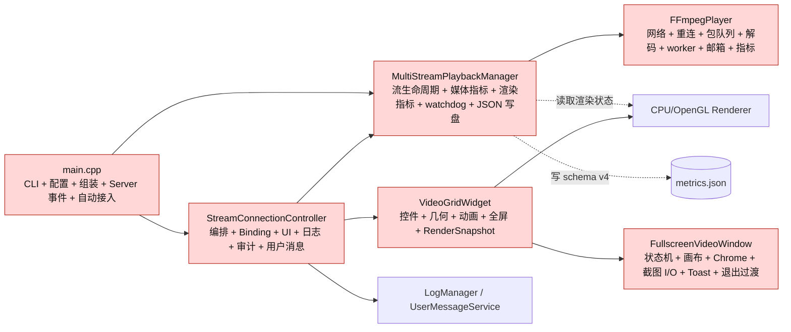
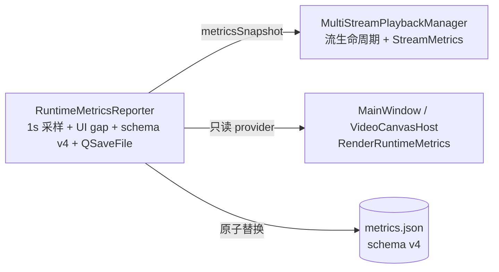
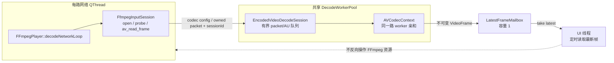
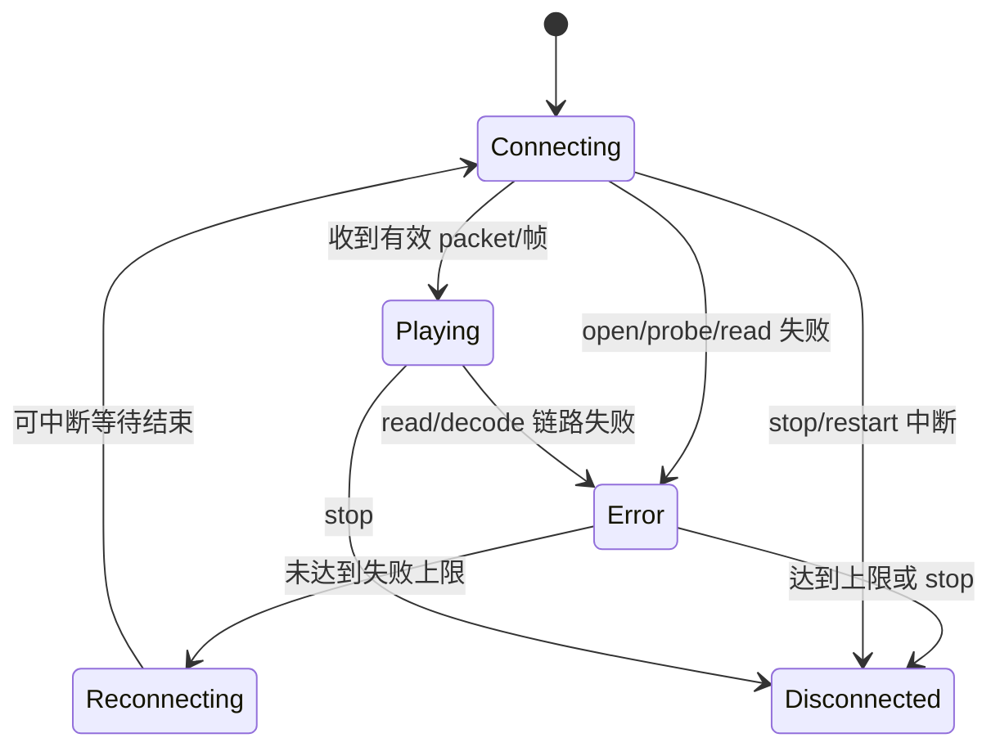
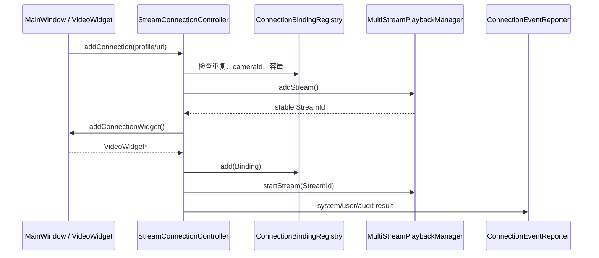
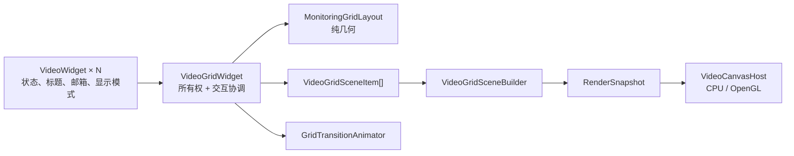
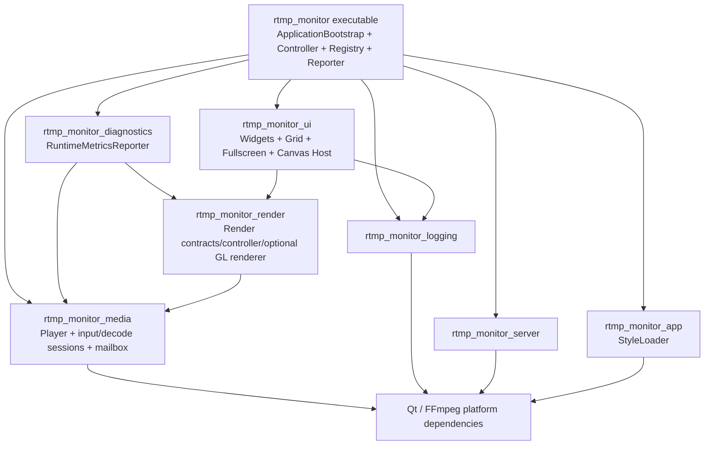
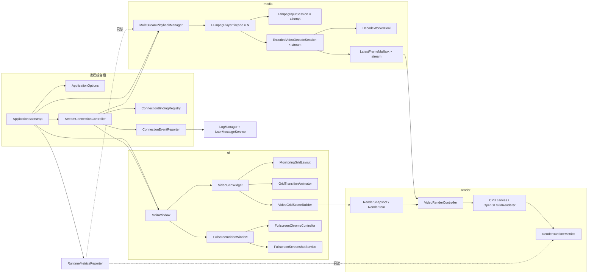
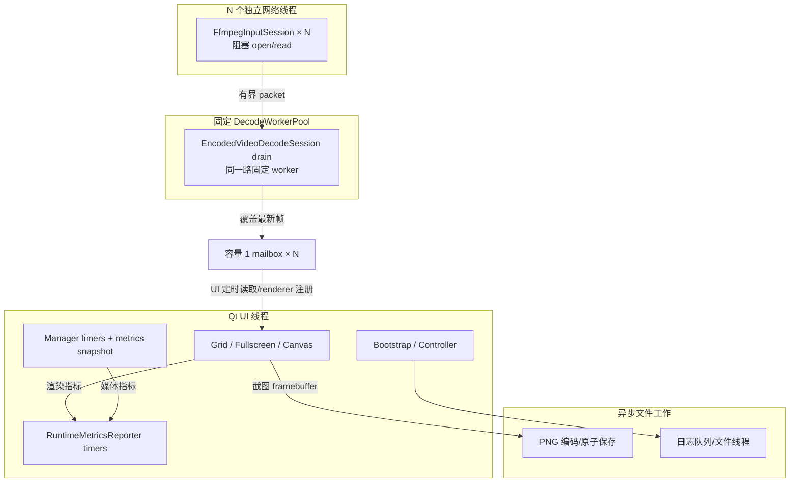

# RtmpMonitor 渐进式架构解耦设计与实施过程

> 状态：已实现；2026-08-13 Windows Debug 全目标构建与 CTest 21/21、Windows
> Release、Linux ARM64 RASTER/GLES3 交叉构建通过。RASTER 产物动态依赖中不含 Qt
> OpenGL、EGL 或 GLES。
>
> 本文描述的是当前仓库中已经落地的解耦过程，而不是下一阶段的理想架构提案。代码、
> CMake 和测试结果与本文冲突时，以代码、CMake 和测试结果为准。

## 1. 为什么要做这次解耦

项目在解耦前已经具备多路 RTMP 拉流、断线重连、容量 1 最新帧邮箱、CPU/OpenGL
渲染、动态网格、全屏、截图、日志和 schema v4 指标等能力。问题不是“功能不能工作”，
而是若干核心类同时跨越多个变化方向：

- `MultiStreamPlaybackManager` 同时了解媒体生命周期、渲染指标、UI watchdog、JSON schema
  和文件写入。
- `FFmpegPlayer` 同时实现网络打开、解复用、阻塞读取、重连、有界包队列、解码器状态、
  worker 投递、帧邮箱和指标。
- `StreamConnectionController` 同时保存绑定、校验重复设备、操作 UI、映射错误、写系统
  日志、写审计并发布用户消息。
- `FullscreenVideoWindow` 同时处理全屏状态机、画布、控制栏动画、光标隐藏、截图 I/O、
  Toast 和退出过渡。
- `VideoGridWidget` 同时负责控件所有权、几何计算、交换动画、全屏协调和渲染场景构建。
- `main.cpp` 同时负责 CLI、配置、平台初始化、对象组装、Server 事件翻译和摄像头自动接入。

这些职责放在同一类里会产生四类成本：

1. **跨层依赖成本**：媒体层一旦包含渲染或 UI 类型，媒体测试和无图形 ARM64 构建也会
   被迫携带图形依赖。
2. **线程风险**：网络、解码、UI 和文件 I/O 的生命周期写在同一实现中，修改一个阶段
   容易破坏停止、重连或过期任务丢弃语义。
3. **变更扩散**：增加一个指标字段、调整一条用户消息或修改网格算法，都要进入承担主
   业务生命周期的大类。
4. **测试困难**：纯几何、绑定校验、JSON 组装等逻辑被 QWidget、FFmpeg 或线程初始化
   包围，无法低成本单独验证。

因此，本轮目标不是追求更多类，也不是按文件行数机械拆分，而是让每个变化原因落到
清晰边界，并保持已经验证的运行行为不变。

## 2. 范围、硬约束与非目标

### 2.1 必须保持的兼容契约

解耦过程把下列行为当作冻结契约：

| 契约 | 保持内容 |
| --- | --- |
| CLI | 现有选项、默认值、错误退出和配置优先级不变 |
| 指标 | schema v4 字段、单位、renderer fallback 信息、空样本默认值和脱敏行为不变 |
| 流身份 | `StreamId` 在一路流生命周期内稳定，不使用网格索引代替业务身份 |
| 帧传递 | `LatestFrameMailbox` 容量仍为 1，新帧覆盖尚未消费的旧帧 |
| 网络恢复 | 连续失败上限、重连延迟、可中断等待和手动重连语义不变 |
| 并发 | 每路独立阻塞网络线程，共享固定解码 worker，同一路保持 worker 亲和 |
| 过期隔离 | stop/restart 后旧 session 的包、帧、错误和状态不得污染新 session |
| 渲染 | CPU/OpenGL 选择、自动回退、RASTER/GLES3 裁剪边界不变 |
| UI | 动态网格、拖拽交换、临时全屏、EGLFS 画布内全屏、截图和退出过渡不变 |

### 2.2 本轮不做什么

- 不更换 Qt、FFmpeg 或 RTMP Server。
- 不增加硬件解码、零拷贝、PBO、共享 OpenGL Context 或新产品功能。
- 不因为 `LogManager`、`OpenGLGridRenderer` 文件较大就拆分；它们当前的公共职责与资源
  生命周期仍然内聚。
- 不把交叉构建等同于 ARM 真机认证，也不把快速测试等同于 1/4/8 路 600 秒资格测试。
- 不强行把所有 `app/` 源码做成一个库。当前组合根和连接协调器仍直接编入最终可执行
  目标，这一点在第 10 节单独说明。

## 3. 如何判断耦合优先级

本轮使用四个维度排序，而不是使用文件行数排序：

| 维度 | 判断问题 | 高风险示例 |
| --- | --- | --- |
| 跨层依赖 | 下层是否反向知道上层类型或策略 | 媒体管理器读取渲染指标并写 UI watchdog |
| 线程风险 | 一次修改是否跨网络、worker、UI 或文件线程 | 在播放器重构时改变阻塞读取的中断路径 |
| 变更扩散 | 一个需求是否迫使多个无关职责同时修改 | schema 字段变化需要进入多路生命周期管理器 |
| 可测试性 | 逻辑是否只能带着重量级运行环境验证 | 网格几何必须创建窗口和画布才能测试 |

据此形成的实施顺序如下：

| 优先级 | 热点 | 先处理的原因 | 拆分结果 |
| --- | --- | --- | --- |
| P0.1 | `MultiStreamPlaybackManager` / 指标类型 | 存在 media 对 render/UI 语义的反向了解 | `RuntimeMetricsReporter`、`RenderRuntimeMetrics` |
| P0.2 | `FFmpegPlayer` | 线程、网络、FFmpeg 资源和重连风险最高 | `FfmpegInputSession`、`EncodedVideoDecodeSession` |
| P1.1 | `StreamConnectionController` | 业务编排与日志/UI/注册混合，变更扩散明显 | `ConnectionBindingRegistry`、`ConnectionEventReporter` |
| P1.2 | `FullscreenVideoWindow` | 状态机与动画、计时器、截图 I/O 混合 | `FullscreenChromeController`、`FullscreenScreenshotService` |
| P2 | `VideoGridWidget` | 纯计算、动画资源和场景转换被控件生命周期包围 | `MonitoringGridLayout`、`GridTransitionAnimator`、`VideoGridSceneBuilder` |
| P3 | `main.cpp` | 组合根过长但线程风险低于媒体主链路 | `ApplicationOptions`、`ApplicationBootstrap` |

优先级代表实施顺序，不代表低优先级不重要。媒体与诊断先拆，是因为错误的依赖方向和
线程生命周期一旦失控，会比 UI 类过长产生更直接的稳定性风险。

## 4. 解耦前的结构与主要问题

下面的图是职责关系图，不是精确的 CMake target 图。红色节点表示同时承载多个变化
原因的大类。



这个结构能运行，但存在以下典型修改冲突：

- 想调整指标写盘频率，需要修改管理流生命周期的 Manager。
- 想修复 FFmpeg 打开超时，容易碰到解码队列和 AVCodecContext 清理代码。
- 想增加一种 cameraId 重复规则，需要进入同时负责审计和 QWidget 操作的 Controller。
- 想改变截图命名或原子保存策略，需要进入全屏状态机。
- 想单测 16:9 网格几何，需要构造完整的 `VideoGridWidget`。

## 5. 总体拆解策略

本轮没有直接重写核心类，而是使用“建立边界—委托—迁移—删除旧职责—回归”的渐进
方式。每个优先级都遵循同一套步骤：

1. **冻结外部行为**：先列出公共 API、信号、CLI、schema、线程和 UI 行为。
2. **建立新边界**：新增小类或数据契约，不立即删除旧 façade。
3. **让旧类委托新边界**：调用方仍通过原入口工作，降低一次性改动范围。
4. **迁移状态与资源所有权**：明确 mutex、timer、QPointer、FFmpeg 资源或文件写入由谁
   拥有，而不是只移动函数。
5. **删除反向依赖和重复字段**：确认新路径工作后，移除旧 provider、写盘函数或容器。
6. **建立自动门禁**：用 CTest、构建目标和依赖扫描阻止旧耦合重新出现。
7. **再进入下一优先级**：避免媒体主链路和 UI 主链路同时大规模改写。

这种方式保留了四个兼容 façade/协调器：

- `FFmpegPlayer` 仍是单路播放公共入口。
- `StreamConnectionController` 仍是添加、移除和重连用例入口。
- `FullscreenVideoWindow` 仍拥有全屏状态机。
- `VideoGridWidget` 仍拥有 `VideoWidget` 和高层交互状态。

拆分类是为了缩小每个类的变化原因，不是让调用方自己拼装所有细节。

## 6. P0.1：从媒体管理器移出诊断与渲染指标

### 6.1 原耦合

原 `MultiStreamPlaybackManager` 除了管理 `FFmpegPlayer`，还需要：

- 接收渲染指标 provider；
- 观察 UI timer gap；
- 组装 schema v4；
- 知道 renderer fallback、OpenGL vendor/version 等字段；
- 创建目录并写 `metrics.json`。

这使 media 层知道 render/UI 的概念，也让“媒体生命周期”和“诊断输出格式”形成共同
修改点。

### 6.2 拆分过程

1. 把渲染运行时契约移动到
   [`RenderRuntimeMetrics.h`](../../../../include/common/render/RenderRuntimeMetrics.h)，让字段归属
   产生它们的 render 边界。
2. 新增
   [`RuntimeMetricsReporter`](../../../../include/common/diagnostics/RuntimeMetricsReporter.h)，作为
   media 和 render 上方的只读组合层。
3. Reporter 持有 `MultiStreamPlaybackManager*`，通过 `metricsSnapshot()` 读取媒体快照；
   通过 `std::function<RenderRuntimeMetrics()>` 读取当前渲染快照。
4. 将一秒采样计时器、33 ms UI watchdog、schema v4 JSON 组装、目录创建和 `QSaveFile`
   原子提交迁入 Reporter。
5. 从 Manager 删除渲染 provider、UI watchdog 和指标文件职责；Manager 只保留流指标的
   采样和发布。
6. 由组合根创建 Reporter，并连接 MainWindow/画布提供的只读渲染指标。

### 6.3 拆分后的关系



这里的关键不是简单把 `writeMetricsFile()` 搬到另一个文件，而是改变依赖方向：诊断层
可以同时知道 media 和 render；media/render 不知道诊断层，也不因为是否启用写盘而改变
自己的生命周期。

### 6.4 为什么这样拆

- schema 是跨子系统的观察结果，不属于任何单一被观察子系统。
- UI gap 只能在 UI 事件循环中有意义，不能伪装成媒体指标。
- renderer fallback 是渲染决策，类型应由 render 层拥有。
- 文件原子替换是一种输出策略，不能成为多路播放器的关闭前置条件。

### 6.5 好处

- media 不再包含 render/UI 头文件，可以单独构建、测试和用于纯 RASTER 路径。
- 修改 schema、采样频率或文件格式不影响流增删、停止和重连。
- 可在零路流时单独验证 schema 默认值。
- `QSaveFile::commit()` 失败只影响一次诊断快照，不改变播放器状态。
- 将来增加 Prometheus、内存环形缓冲或远程诊断输出时，可以新增 Reporter sink，而不改
  Manager。

### 6.6 保持不变与验证

- schema version 仍为 4；字段、单位和 renderer fallback 信息保持兼容。
- 输出不包含 RTMP URL 或私密 path。
- 空输出路径时不写文件；零路流时仍能写出完整默认结构。
- [`MultiStreamPlaybackManagerTest.cpp`](../../../../tests/MultiStreamPlaybackManagerTest.cpp) 覆盖原子
  写入、字段、fallback、脱敏和空样本默认值。

## 7. P0.2：把 FFmpegPlayer 变成稳定 façade

### 7.1 原耦合

`FFmpegPlayer` 的公共身份是“一路播放器”，但实现内部同时存在三个不同生命周期：

1. **一次输入尝试**：打开 RTMP、探测流、找到视频轨、循环 `av_read_frame()`、响应中断。
2. **一个解码 session**：拥有配置、包队列、AVCodecContext、转换状态、邮箱和累计指标。
3. **一路播放器生命周期**：start/stop、重连策略、Qt 状态信号和 session generation。

把三者写在同一状态集合里，会让一次网络打开失败与长期解码状态清理互相影响。

### 7.2 拆分后的职责

| 组件 | 拥有什么 | 不拥有什么 |
| --- | --- | --- |
| `FFmpegPlayer` façade | 公共 start/stop/signals/metrics、网络 QThread、重连策略、session generation | 单次 `AVFormatContext` 细节、直接 UI 操作 |
| `FfmpegInputSession` | 一次 `AVFormatContext` 打开/探测/读取、interrupt callback、向外移交 packet/configuration | 重连次数、Qt 状态、解码器、长期队列 |
| `EncodedVideoDecodeSession` | 有界包/AU 队列、解码器状态、worker 调度标志、邮箱、generation 与解码/呈现指标 | URL、连接退避、QWidget/OpenGL、WebRTC 对象 |
| `DecodeWorkerPool` | 固定 worker、按流调度任务 | 阻塞网络读取、UI 展示 |

`FfmpegInputSession` 位于 `src/common/media/`，属于实现私有头文件。原私有
`StreamDecodeSession` 已在 WebRTC V2 Week 3 迁出为 media-owned `EncodedVideoDecodeSession`；
`FFmpegPlayer` 通过私有 FFmpeg access seam 复用它，外部 publisher/transport 只能提交协议无关
Annex-B AU，不能操作半初始化的 FFmpeg 状态。

### 7.3 拆分过程

1. 先保留 `FFmpegPlayer::start()`、`requestStop()`、`stop()`、signals 和 metrics API。
2. 定义一次输入尝试的结果 `FfmpegInputResult`，只返回错误类别、native code、描述和是否
   收到过 packet。
3. 把 `AVFormatContext`、低延迟打开参数、stream probe、packet clone/移交与中断回调迁入
   `FfmpegInputSession::run()`。
4. 输入 session 通过两个回调交出 codec configuration 和 owned packet；它不直接访问
   解码队列内部字段。
5. 把有界队列、decoder reset、关键帧恢复、worker 调度和邮箱提交集中到
   `EncodedVideoDecodeSession`。
6. `FFmpegPlayer::decodeNetworkLoop()` 只编排“创建一次输入 session → 处理结果 → 更新失败
   计数 → 等待重连或退出”。
7. 保留 `sessionId_` generation 检查；所有配置、packet、状态、错误和重连通知在提交前
   检查 generation。

### 7.4 线程与数据流



### 7.5 重连与 session 隔离



每次 start/restart 都推进 generation。旧 session 即使还有排队 worker 任务，也会因为
`packet.sessionId != current sessionId` 或 owner generation 不匹配而被丢弃。stop 仍采用：

```text
requestStop()
  → 设置 atomic stop
  → FFmpeg interrupt callback 打断阻塞 I/O
  → condition_variable 唤醒重连等待
  → stop() join 网络线程
  → generation 失效旧任务并清理解码 session
```

### 7.6 为什么这样拆

- “一次网络尝试”天然具有短生命周期，适合 RAII 管理 `AVFormatContext`。
- 解码器和包队列必须共享同一互斥与 worker 亲和，不能拆成互不协调的多个公共对象。
- 重连是播放器用例策略，不应由一次 input session 自己递归重试。
- façade 保持不变，可以让 Manager、Controller 和测试无需同时重写。

### 7.7 好处

- 网络打开/读取问题可以在不触碰 AVCodecContext 状态机的情况下修改。
- 解码队列与邮箱可以在不建立真实网络连接时审查和测试。
- 单路故障仍被限制在该路网络线程和 decode session，不拖垮其他流。
- stop/restart 的资源所有权更清楚，降低悬挂 packet、重复 free 和旧回调污染风险。
- 将来支持不同输入协议时，可以替换 input session，而无需暴露解码内部结构。

## 8. P1.1：让连接控制器只编排用例

### 8.1 原耦合

添加一路连接原本要求 Controller 同时做：参数规范化、重复校验、容量校验、调用 Manager、
创建 VideoWidget、保存 StreamId 映射、连接 QWidget 信号、发布用户消息、写系统日志、写
审计记录。删除和手动重连又重复相同的查找与报告逻辑。

### 8.2 拆分结果

#### ConnectionBindingRegistry

[`ConnectionBindingRegistry`](../../../../include/common/app/ConnectionBindingRegistry.h) 集中保存：

- 稳定 `StreamId`；
- display name、URL 和 cameraId；
- `QPointer<VideoWidget>`；
- 最近用户失败原因和 removing 标志；
- 名称/URL/cameraId 去重、16 路容量、双向安全查询和下一个摄像头编号。

Registry 是会话内注册表，不写回摄像头 profile，也不启动播放器、操作布局或产生日志。
使用 `QPointer` 的原因是 UI 可能先被 Qt 父子所有权销毁；查询失效控件时必须安全得到
空指针，而不是保留悬挂 QWidget 指针。

#### ConnectionEventReporter

[`ConnectionEventReporter`](../../../../include/common/app/ConnectionEventReporter.h) 集中处理：

- `PlaybackErrorCode → UserFailureReason` 映射；
- `LogContext` 构造；
- 系统日志；
- 用户事件；
- 添加、删除、手动重连等审计记录。

Reporter 不决定是否添加/删除连接，也不操作播放器和 QWidget。它只把已经发生的业务
结果投影到三种不同输出。

#### StreamConnectionController

Controller 现在负责高层事务顺序：

```text
校验请求
  → Registry 检查重复与容量
  → Manager 创建 StreamId
  → MainWindow 创建 VideoWidget
  → Registry 提交 Binding
  → 连接 widget 信号
  → Reporter 发布结果
  → 可选启动流
```

若 UI 创建失败，Controller 负责回滚已创建的媒体流；若删除过程失败，Controller 决定
保留或恢复 Binding。Registry 和 Reporter 都不自行发起这种跨模块事务。

### 8.3 拆分后的用例关系



### 8.4 为什么这样拆

- Binding 是一致性数据结构，应该有唯一维护者。
- 日志、审计和用户消息是同一业务事件的不同投影，但不是业务事务本身。
- Controller 最适合保留跨 UI/media 的补偿和执行顺序，因为它位于用例边界。
- Registry 使用 UI 类型的弱引用，因此仍属于 app/controller 边界，不下沉到 media。

### 8.5 好处

- 重复 cameraId、容量和 StreamId/UI 映射规则只修改 Registry。
- 错误文案、审计字段和日志聚合只修改 Reporter。
- Controller 测试可以分别断言业务结果、用户消息、系统日志和审计日志。
- UI 销毁后查询不会解引用悬挂指针。
- 添加/删除事务的回滚路径更容易审查。

## 9. P1.2：拆分全屏状态机、Chrome 与截图 I/O

### 9.1 边界划分

| 组件 | 保留/新增职责 |
| --- | --- |
| `FullscreenVideoWindow` | Windowed/Entering/Fullscreen/Exiting 状态机、全屏画布、退出冻结层、Toast 展示和对外信号 |
| `FullscreenChromeController` | reveal zone、控制栏显隐、180 ms 动画、250 ms 延时隐藏、2 s 光标隐藏和几何定位 |
| `FullscreenScreenshotService` | 输出目录、脱敏安全文件名、序号、后台 PNG 编码、`QSaveFile` 原子输出和结果信号 |

### 9.2 拆分过程

1. 先保留 `FullscreenVideoWindow::enterFullscreen()`、`exitFullscreen()` 和现有对外信号。
2. 将控制栏动画对象、hide timer、cursor timer 和 pointer 区域状态迁入 Chrome Controller。
3. Window 只在状态变化、鼠标活动或 resize 时把事件转给 Chrome Controller。
4. 定义截图服务输入为 framebuffer、设备名、`StreamId` 和输出目录；服务不读取 Window
   的 transition state。
5. 截图服务发出 started/completed/failed，Window 再决定 Toast 内容和何时隐藏。
6. 保留退出 750 ms 安全超时、raster 冻结层以及主画布首次呈现后的显式完成信号。

### 9.3 为什么截图服务仍在 UI target

它虽然不访问全屏状态机，但使用 `QImage`、Qt 异步任务和 Qt 信号，服务对象的结果也回到
UI 事件循环。把它放入 media 或 diagnostics 会制造更差的依赖方向。因此本轮拆的是类
职责，不是为每个类都创建新 CMake library。

### 9.4 好处

- 修改控制栏动画和光标策略不再触碰全屏进入/退出状态机。
- 修改截图目录、命名、编码或原子保存不再触碰画布和全屏过渡。
- 后台 PNG 失败通过信号返回，不会把 Window 卡在错误状态。
- 截图服务可以用构造的 `QImage` 验证成功/失败，不要求真实全屏窗口。
- Window 仍是唯一全屏状态机所有者，避免多个控制器争夺 transition state。

## 10. P2：拆分网格几何、动画和渲染场景

### 10.1 原耦合

`VideoGridWidget` 同时保存 `VideoWidget` 所有权和交互状态，又承担三个可独立变化的算法：

- 给定数量和可用尺寸计算行列、格子、边距和 16:9 viewport；
- 创建多个 overlay/animation 并保证完成回调只执行一次；
- 把 UI 控件状态转换为 renderer 使用的 `RenderSnapshot`。

### 10.2 三个新边界

#### MonitoringGridLayout

纯函数输入：widget count、最大数量、最大维度、可用尺寸、chrome 尺寸、边距、间距和目标
比例。输出：`GridDimensions` 与 `MonitoringGridGeometry`。

它不持有 QWidget，不启动动画，也不修改布局。整数像素、居中、最大有效面积和近似 16:9
约束可以作为确定性输入输出测试。

#### GridTransitionAnimator

接收若干 `GridTransition{overlay,startGeometry,endGeometry}`、可选 fade-in overlay 和完成
回调，集中拥有 `QParallelAnimationGroup` 生命周期。`VideoGridWidget` 只负责决定“谁从
哪里移动到哪里”，不再自己管理动画对象销毁和重复完成。

#### VideoGridSceneBuilder

接收 UI 中立的 `VideoGridSceneItem`，生成 render 层的 `RenderSnapshot`。它负责字段映射，
不读取 `VideoWidget`、不注册 mailbox、不调用 OpenGL。

### 10.3 保留在 VideoGridWidget 的职责

- 创建、持有和移除 `VideoWidget`；
- 维护 Idle/Adding/Swapping/EnteringFullscreen/Fullscreen/ExitingFullscreen 等高层交互状态；
- 协调拖拽交换和全屏进入/退出；
- 从各 Widget 收集场景输入；
- 把构建好的 Snapshot 提交给 `VideoCanvasHost`。

这很重要：拆分后 Widget 不是“空壳”，它仍然是网格交互聚合根，只是不再实现纯算法和
通用动画资源管理。

### 10.4 场景转换



### 10.5 为什么这样拆

- 几何是确定性的纯逻辑，变化原因是屏幕比例与布局规则。
- 动画的变化原因是时长、插值和对象生命周期。
- Scene Builder 的变化原因是 UI 与 renderer 的契约映射。
- Widget 所有权和交互事务必须继续集中，否则拖拽、删除和全屏会出现多写者。

### 10.6 好处

- 0、1、4、16 路和异常尺寸几何可以快速测试。
- 动画中途删除控件时依靠 `QPointer` 避免悬挂 overlay。
- renderer 不读取 QWidget；CPU/OpenGL 共用同一种 Snapshot。
- 将来调整布局算法不需要修改 OpenGL renderer。
- 将来增加 renderer 字段时，映射集中在 Scene Builder，而不是散落在多处 UI 事件中。

## 11. P3：精简入口并建立组合根

### 11.1 ApplicationOptions

[`ApplicationOptions`](../../../../include/common/app/ApplicationOptions.h) 集中 CLI 定义、默认值、
输入校验以及 `--version`/invalid/ready 三态解析结果。解析得到的是普通值对象，不创建
MainWindow、播放器或 Server monitor。

### 11.2 ApplicationBootstrap

[`ApplicationBootstrap`](../../../../include/common/app/ApplicationBootstrap.h) 负责：

- 平台 surface format 和 `QApplication` 初始化；
- CLI 解析；
- 日志、样式和配置加载；
- renderer/display FPS 策略选择；
- 创建 Manager、MainWindow、Controller、Reporter 和 Server monitor；
- 翻译 Server 健康事件；
- 按原优先级预装 `--url` 和自动接入 camera profiles；
- 保证退出时 Manager、日志和相关对象按既有顺序收尾。

[`main.cpp`](../../../../src/main.cpp) 最终只保留：

```cpp
int main(int argc, char *argv[])
{
    return ApplicationBootstrap::run(argc, argv);
}
```

### 11.3 为什么组合根可以知道所有模块

组合根的职责就是在进程边界装配具体实现，因此它可以依赖 media、render、ui、server、
logging 和 diagnostics。关键限制是这些被组合模块不能为了取得另一个模块的对象而反向
依赖 Bootstrap。

### 11.4 当前 CMake 事实

目录名 `app/` 表示应用职责，但不等于所有这些文件都属于 `rtmp_monitor_app` 静态库：

- `rtmp_monitor_app` 当前只包含 `StyleLoader` 等通用应用支持。
- `ApplicationOptions`、`ApplicationBootstrap`、`ConnectionBindingRegistry`、
  `ConnectionEventReporter` 和 `StreamConnectionController` 直接编入最终
  `rtmp_monitor` 可执行目标。

这样做使组合根可以合法链接所有具体模块，也避免为了一个“纯 app 库”制造 app ↔ ui/media
循环。未来如果要复用这些用例，可以再按接口注入拆成 application library；本轮没有这个
复用需求，不提前抽象。

### 11.5 好处

- CLI 单元不再被对象组装细节淹没。
- 启动顺序和配置优先级集中在一个可审查位置。
- `main()` 不再随产品功能增长。
- 平台 bootstrap 仍可在 Linux 构建中加入 surface/render policy，而不污染媒体类。

## 12. 拆分后的当前架构

### 12.1 CMake target 依赖图

下图箭头表示“调用方/上层 target 依赖被调用方/下层 target”，与视频数据流方向不同。



核心编译依赖规则是：

```text
ui ──depends on──> render ──depends on──> media
diagnostics ──depends on──> media + render
media ──must not depend on──> render or ui
render ──must not depend on──> ui
```

如果使用“运行时生产数据”的视角，方向则是：media 生产帧/媒体指标，render 消费帧并
生产渲染指标，ui 展示状态，diagnostics 从 media/render 拉取只读快照。文档中必须明确
是哪一种箭头，避免把数据流和编译依赖混为一谈。

### 12.2 组件职责图



### 12.3 运行时线程图



线程边界的硬规则：

- 网络线程只做阻塞输入和 packet 移交，不访问 QWidget/OpenGL。
- 解码 worker 只访问实现私有解码 session、FFmpeg 解码资源和线程安全邮箱。
- GPU 上传和绘制只发生在拥有图形上下文的 UI 线程。
- Reporter 的 timer 与 UI watchdog 在 UI 线程；写单个小型 JSON 使用 `QSaveFile` 原子替换。
- PNG 编码与日志文件写入不阻塞媒体网络/解码线程。

## 13. 依赖方向门禁

仅靠文档约定很容易在后续需求中回退，因此新增
[`CheckLayerDependencies.cmake`](../../../../cmake/CheckLayerDependencies.cmake)，并注册为
`rtmp_monitor_layer_dependency_test`：

- 扫描 `include/common/media` 与 `src/common/media`，禁止包含 `render/` 或 `ui/` 头文件。
- 扫描 `include/common/render` 与 `src/common/render`，禁止包含 `ui/` 头文件。

该门禁解决的是最危险的反向 include，不是完整 C++ 架构分析器。它暂时不会检查：

- 通过前置声明或回调形成的语义耦合；
- CMake `target_link_libraries` 中所有可能的循环；
- app/diagnostics 对具体实现的依赖；
- 文件放错目录但没有违规 include 的情况。

因此新增边界时仍需同时审查源文件归属、CMake target 和运行时所有权，不能只看门禁通过。

## 14. 验证策略

### 14.1 为什么每阶段都要回归

解耦最容易出现的错误不是编译失败，而是行为细节漂移，例如：

- stop 仍返回，但阻塞 `av_read_frame()` 没有被及时中断；
- 旧 worker 任务在 restart 后向新邮箱提交旧帧；
- schema 字段存在，但默认值或单位变化；
- UI 控件被删后 Registry 留下悬挂指针；
- 全屏退出信号顺序变化导致主画布黑屏；
- RASTER 构建因为一个头文件重新链接 OpenGL。

所以每一阶段都需要“结构测试 + 行为回归”，而不是最后只运行一次主程序。

### 14.2 当前自动验证覆盖

| 边界 | 主要验证 |
| --- | --- |
| diagnostics | schema v4、完整字段、fallback、空样本、脱敏、`QSaveFile` 输出 |
| media | stop 幂等、16 路停止、真实解码入口、队列/邮箱/metrics 生命周期 |
| connection | profile URL、重复 cameraId、容量、添加/删除/重连、用户/系统/审计分离与脱敏 |
| fullscreen/grid | 动态增删、拖拽交换、全屏往返、退出超时、Snapshot/邮箱释放、CPU/GL smoke |
| layers | media 不包含 render/ui，render 不包含 ui |
| platform | Windows Debug/Release；ARM64 RASTER/GLES3 交叉构建与 ELF 动态依赖检查 |

最终已验证基线：

- Windows Debug 全目标构建通过，CTest 21/21。
- Windows Release 构建通过。
- Linux ARM64 RASTER 与 GLES3 交叉构建通过。
- RASTER 动态依赖不含 Qt OpenGL、EGL、GLES；GLES3 保留预期图形依赖。

这些结果证明结构调整没有破坏已覆盖行为，但不代表 ARM 真机图形能力或 Windows
1/4/8 路 600 秒性能资格已经完成。

## 15. 解耦带来的实际收益

| 变化场景 | 解耦前需要进入 | 解耦后主要入口 | 收益 |
| --- | --- | --- | --- |
| 增加 schema 字段 | Manager + render/UI | `RuntimeMetricsReporter` + 对应指标契约 | 不触碰流生命周期 |
| 调整 RTMP 打开参数 | `FFmpegPlayer` 大状态机 | `FfmpegInputSession` | 不触碰解码队列 |
| 调整解码背压 | 网络/重连混合实现 | `EncodedVideoDecodeSession` | 明确互斥、generation 和 worker 所有权 |
| 增加 cameraId 规则 | Controller 全流程 | `ConnectionBindingRegistry` | 规则单点维护 |
| 修改用户错误文案 | Controller 多个槽 | `ConnectionEventReporter` / message service | 系统日志和业务事务不受影响 |
| 调整控制栏隐藏 | 全屏状态机 | `FullscreenChromeController` | 不影响退出过渡和画布 |
| 修改截图命名/目录 | 全屏 Window | `FullscreenScreenshotService` | 不访问全屏状态 |
| 修改 16:9 网格算法 | QWidget + renderer | `MonitoringGridLayout` | 可做纯输入输出测试 |
| 修改 Snapshot 映射 | 多处 Widget 代码 | `VideoGridSceneBuilder` | CPU/GL 共用契约 |
| 增加 CLI 校验 | `main.cpp` 组装代码 | `ApplicationOptions` | 解析与启动分离 |

更长期的收益包括：

- **更低的认知负担**：评审者可以按一次变化的边界阅读，而不必理解整个程序。
- **更小的回归半径**：网络、解码、诊断、UI 动画和文件 I/O 的修改相互隔离。
- **更好的平台裁剪**：media/render/ui 的编译依赖可以被 CMake 和 ARM64 产物检查约束。
- **更可靠的线程审计**：每种资源有明确线程与生命周期所有者。
- **更容易替换策略**：输入 session、指标 sink、布局算法和截图保存策略都有清晰替换点。

## 16. 当前仍然存在的耦合与后续边界

解耦不是结束状态。当前有意保留以下耦合：

1. **render 依赖 media 的帧与 StreamId 契约**：渲染必须消费 `VideoFrame` 和 mailbox，当前
   没有必要再造一套完全独立的数据模型。
2. **ui 依赖 render**：`VideoCanvasHost`、`RenderSnapshot` 和 renderer metrics 是 UI 显示
   的直接能力，依赖方向正确。
3. **Registry 含 `QPointer<VideoWidget>`**：它是会话内 UI/media Binding Registry，不是纯
   领域仓储；若未来需要 headless application service，再把 UI handle 抽成端口。
4. **ApplicationBootstrap 和 Controller 编入 executable**：当前只有一个产品进程，没有
   第二个前端复用用例，不为抽象而抽象。
5. **`EncodedVideoDecodeSession` 是 media-owned 公共类型**：它允许组合根通过 generation handle
   提交协议无关 H.264 AU，但 FFmpeg packet/configuration 入口仍由私有 access seam 限制；transport
   与 publisher source 不得直接依赖 media。
6. **Fullscreen Window 仍负责 Toast**：Toast 是全屏交互反馈和 transition state 的一部分，
   当前无需再拆一个通知控制器。
7. **`LogManager` 与 `OpenGLGridRenderer` 暂不拆**：两者实现虽大，但资源和公共职责仍内聚；
   应优先补边界测试，不以行数作为拆类理由。

后续只有在出现新的真实变化原因时才继续拆分，例如：

- 第二种指标输出需要可插拔 sink；
- 第二个前端或 headless daemon 需要复用 application use cases；
- 支持 RTSP/SRT 等多种 input session；
- 真机数据要求 hardware decoder session；
- 多种截图存储后端需要独立接口。

## 17. 新需求应该从哪里修改

| 新需求 | 首选入口 | 必须同步检查 |
| --- | --- | --- |
| 新增媒体指标 | `StreamMetrics`、decode session snapshot | Reporter schema、测试和脚本兼容 |
| 新增渲染指标 | `RenderRuntimeMetrics`、renderer | Reporter schema 和 CPU fallback 默认值 |
| 修改重连策略 | `FFmpegPlayer::decodeNetworkLoop()` / options | stop 可中断性、失败上限和事件顺序 |
| 修改 FFmpeg 打开/读取 | `FfmpegInputSession` | interrupt callback、错误映射、真实流测试 |
| 修改队列或关键帧恢复 | `EncodedVideoDecodeSession` | 上限、worker 亲和、session generation、性能 |
| 新增连接唯一性规则 | `ConnectionBindingRegistry` | profile 接入和容量测试 |
| 修改日志/审计/用户事件 | `ConnectionEventReporter` | 脱敏、去重和三类输出边界 |
| 修改全屏控制栏 | `FullscreenChromeController` | 鼠标区域、动画中断和 cursor timer |
| 修改截图存储 | `FullscreenScreenshotService` | 原子写入、失败信号和路径脱敏 |
| 修改网格比例/间距 | `MonitoringGridLayout` | 0～16 路、普通窗口和监控墙模式 |
| 修改场景字段 | `VideoGridSceneBuilder` + render contract | CPU/GL 两条 renderer |
| 新增 CLI | `ApplicationOptions` | Bootstrap 消费、默认值和 `--version` 快速退出 |
| 修改启动顺序 | `ApplicationBootstrap` | 日志初始化、Server monitor、自动接入和关闭顺序 |

## 18. 代码导航

### 18.1 组合与连接

- [`ApplicationOptions.h`](../../../../include/common/app/ApplicationOptions.h)
- [`ApplicationBootstrap.cpp`](../../../../src/common/app/ApplicationBootstrap.cpp)
- [`StreamConnectionController.cpp`](../../../../src/common/app/StreamConnectionController.cpp)
- [`ConnectionBindingRegistry.cpp`](../../../../src/common/app/ConnectionBindingRegistry.cpp)
- [`ConnectionEventReporter.cpp`](../../../../src/common/app/ConnectionEventReporter.cpp)

### 18.2 媒体与并发

- [`MultiStreamPlaybackManager.cpp`](../../../../src/common/media/MultiStreamPlaybackManager.cpp)
- [`FFmpegPlayer.cpp`](../../../../src/common/media/FFmpegPlayer.cpp)
- [`FfmpegInputSession.cpp`](../../../../src/common/media/FfmpegInputSession.cpp)
- [`DecodeWorkerPool.cpp`](../../../../src/common/media/DecodeWorkerPool.cpp)
- [`LatestFrameMailbox.cpp`](../../../../src/common/media/LatestFrameMailbox.cpp)

### 18.3 渲染、网格与全屏

- [`RenderRuntimeMetrics.h`](../../../../include/common/render/RenderRuntimeMetrics.h)
- [`VideoGridWidget.cpp`](../../../../src/common/ui/VideoGridWidget.cpp)
- [`MonitoringGridLayout.cpp`](../../../../src/common/ui/MonitoringGridLayout.cpp)
- [`GridTransitionAnimator.cpp`](../../../../src/common/ui/GridTransitionAnimator.cpp)
- [`VideoGridSceneBuilder.cpp`](../../../../src/common/ui/VideoGridSceneBuilder.cpp)
- [`FullscreenVideoWindow.cpp`](../../../../src/common/ui/FullscreenVideoWindow.cpp)
- [`FullscreenChromeController.cpp`](../../../../src/common/ui/FullscreenChromeController.cpp)
- [`FullscreenScreenshotService.cpp`](../../../../src/common/ui/FullscreenScreenshotService.cpp)

### 18.4 诊断与门禁

- [`RuntimeMetricsReporter.cpp`](../../../../src/common/diagnostics/RuntimeMetricsReporter.cpp)
- [`CMakeLists.txt`](../../../../CMakeLists.txt)
- [`CheckLayerDependencies.cmake`](../../../../cmake/CheckLayerDependencies.cmake)
- [`MultiStreamPlaybackManagerTest.cpp`](../../../../tests/MultiStreamPlaybackManagerTest.cpp)
- [`StreamConnectionControllerTest.cpp`](../../../../tests/StreamConnectionControllerTest.cpp)
- [`VideoGridDynamicTest.cpp`](../../../../tests/VideoGridDynamicTest.cpp)
- [`VideoGridSmokeTest.cpp`](../../../../tests/VideoGridSmokeTest.cpp)

## 19. 评审清单

后续提交涉及上述边界时，代码评审至少确认：

- [ ] media 没有包含 render/ui 头文件，render 没有包含 ui 头文件。
- [ ] 新类型放在产生该数据的层，而不是最先使用它的上层。
- [ ] 网络线程和 decode worker 没有访问 QWidget/OpenGL。
- [ ] stop/restart 后所有异步提交都检查当前 session generation。
- [ ] packet 队列、帧邮箱、日志队列等异步缓冲仍有明确上限。
- [ ] UI 异步回调保存 QWidget 时使用 `QPointer` 或等价生命周期保护。
- [ ] 指标、日志和错误文本不输出完整 RTMP URL、token 或私密 stream key。
- [ ] 新增 schema 字段有默认值、单位、空样本和 fallback 测试。
- [ ] 组合根的启动、自动接入和关闭顺序没有因局部重构改变。
- [ ] Windows Debug 全量 CTest 通过；涉及平台/渲染依赖时同步检查 Release 和 ARM64
      RASTER/GLES3。

## 20. 总结

本次解耦的核心结果不是“六个大类变成十几个小类”，而是建立了可执行的变化边界：

- media 只生产流、帧和媒体指标；
- render 只消费渲染输入并生产渲染结果；
- diagnostics 在上层组合观察值；
- Controller 编排连接用例，Registry 维护一致性，Reporter 投影事件；
- 全屏状态机不再拥有 Chrome 策略和截图存储；
- 网格聚合根不再实现纯几何、通用动画和场景字段映射；
- Bootstrap 成为唯一了解全部具体模块的组合根。

依赖门禁、线程所有权、兼容 façade 和分阶段回归共同保证了这次拆分是“保行为的渐进式
解耦”，而不是一次高风险重写。

## 21. 保存推流与单车 MQTT 扩展（2026-08-13）

本节只记录该扩展与整体解耦架构之间的关系。新增类的职责、数据 schema、MQTT 协议、
界面使用、本地/公网测试步骤和故障排查见
[保存推流与单车 MQTT 控制：设计、使用与测试指南](saved_stream_and_mqtt_device_control.md)。

本次新增功能没有回填到既有 `MainWindow`、`StreamConnectionController` 或媒体管理器：

- `rtmp_monitor_profiles` 独立拥有 `SavedStreamProfile`、schema v1 校验和 `QSaveFile`
  原子持久化；`SavedStreamController` 仅在应用层编排列表 UI 与既有连接 façade。
- `rtmp_monitor_device_control` 独立拥有协议 JSON、全局 MQTT 配置和唯一 Paho
  `MQTTAsync` session；客户端在 CONNACK 后订阅同一发布 Topic，只有 SUBACK 成功才允许发布，
  收到的消息经有界 inbox 返回 UI 仅作观察。Paho 回调通过 Qt queued invocation 返回 owner 线程，并以 generation
  丢弃旧 session 事件。
- 桌面输入继续在 UI 边界内细分：`VirtualJoystickWidget` 独立拥有鼠标捕获、死区、四向迟滞
  和回中动画；应用级 `DeviceControlInputRouter` 独立拥有键盘解锁、按键顺序和快捷键作用域。
  `DeviceControlPanel` 只展示状态并转发意图，`DeviceControlController` 仍唯一拥有运动状态、
  安全停车去重和日志投影。面板隐藏、应用失活、全屏、退出或连接中断都会收敛输入状态；断线时
  无法到达设备的停车在重连后补发，但不能替代设备侧失联看门狗。
- 组合根保持启动顺序 `--url -> 部署摄像头档案 -> 保存列表 -> MQTT`，退出时先停车并断开
  MQTT，再停止媒体。保存项与先建立 URL 重复时由现有 Registry 拒绝，不能认领并断开 CLI
  或部署来源的会话。

编译依赖为 `app/composition -> profiles`、`app/composition -> device_control` 和
`ui -> profiles/device_control types`。新增门禁禁止 media/render 依赖 profiles/MQTT，也禁止
device_control 包含 UI/media/render。公网 MQTT 只是外部基础设施，不进入 media/server 边界。

设备控制桌面化后 Windows Debug 独立目录完成 217/217 构建步骤（全目标）和 CTest 27/27，新增摇杆和
键盘路由器均可脱离 MQTT 独立测试；Release 全目标构建通过。ARM64 RASTER/GLES3 重新配置、
全目标交叉构建、AArch64 ELF/动态依赖门禁和 QEMU 纯逻辑测试通过；Fake Broker 覆盖初始失败
重试、断线重连、QoS 0 发布和 DISCONNECT。
RASTER 没有因 MQTT 引入 Qt OpenGL/EGL/GLES。Windows 分发继续审计 Release、版本、许可证、
PE 依赖和微软签名，但按交付约束不计算或比对哈希，也不生成 SHA-256 文件。公网 Broker 仅做
CONNECT/CONNACK，实车命令仍等待现场架空或清场确认。
