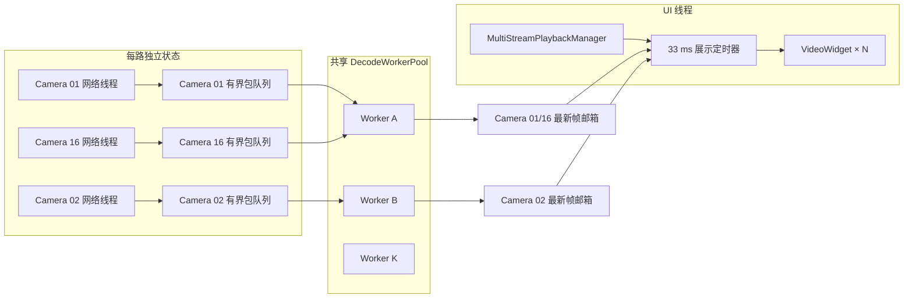
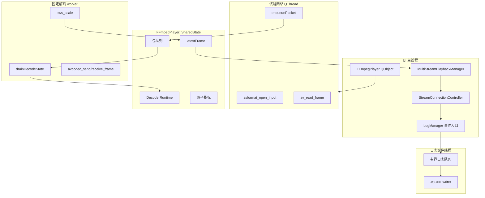
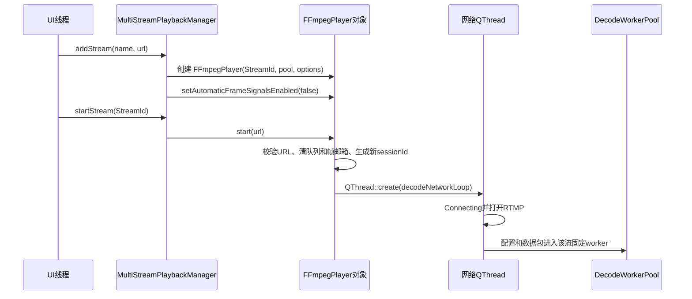
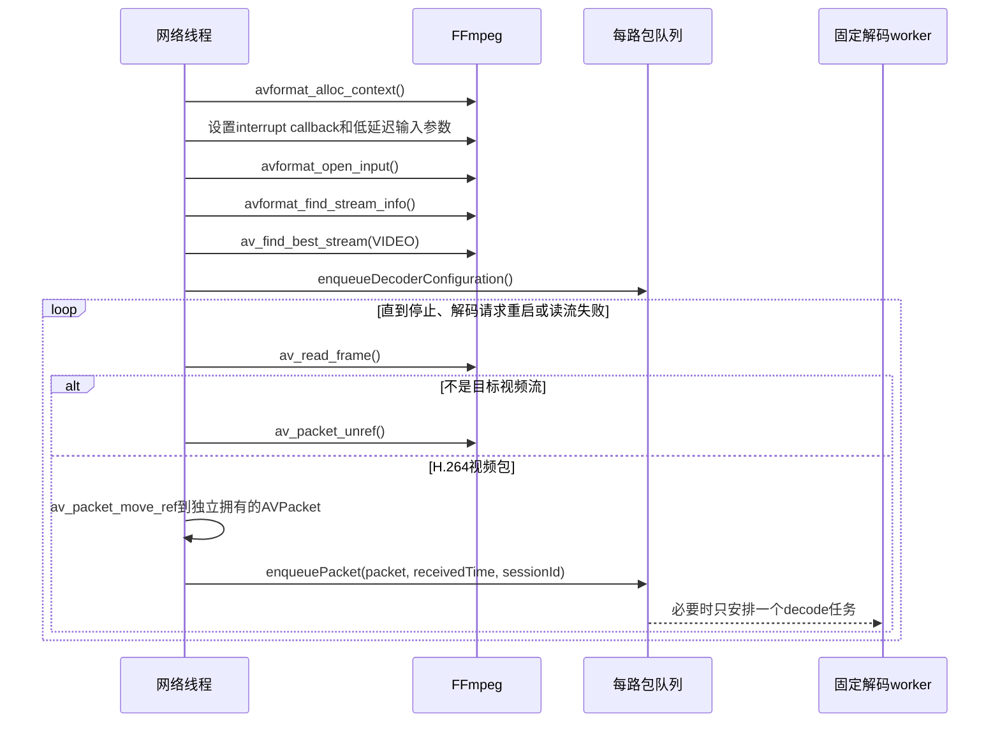
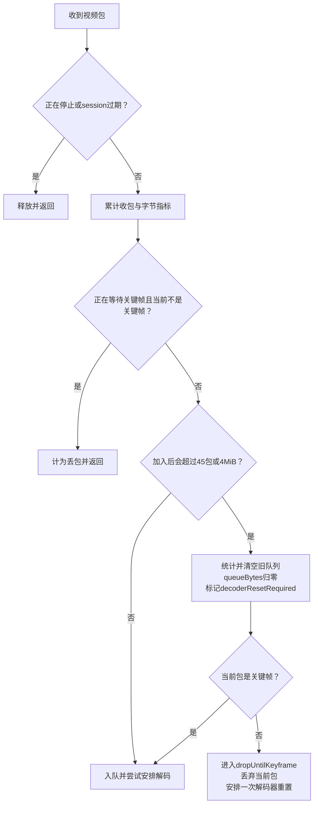
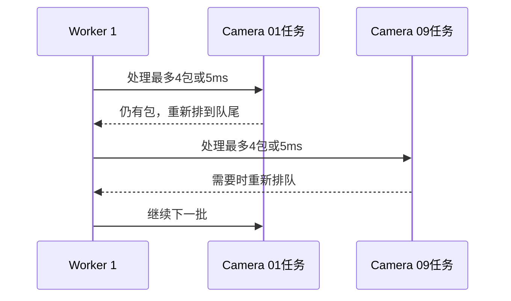
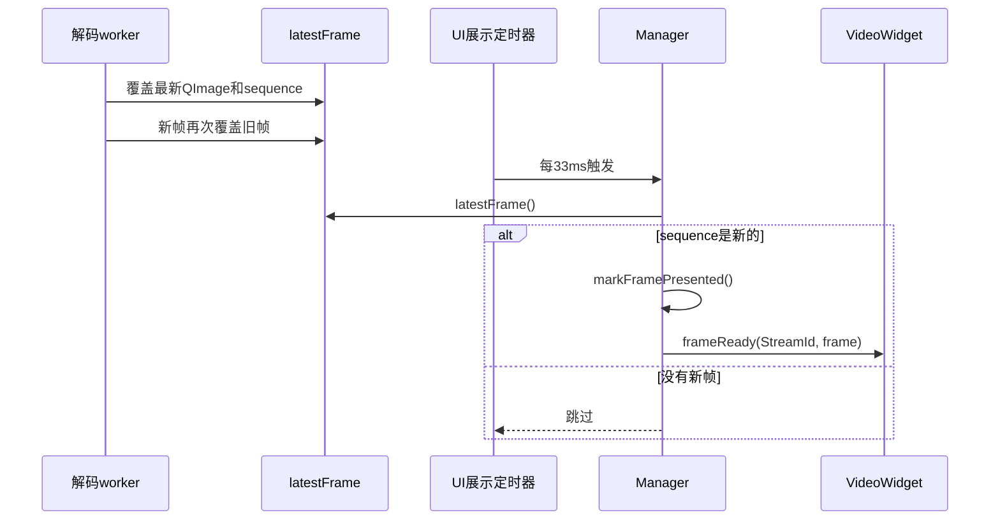
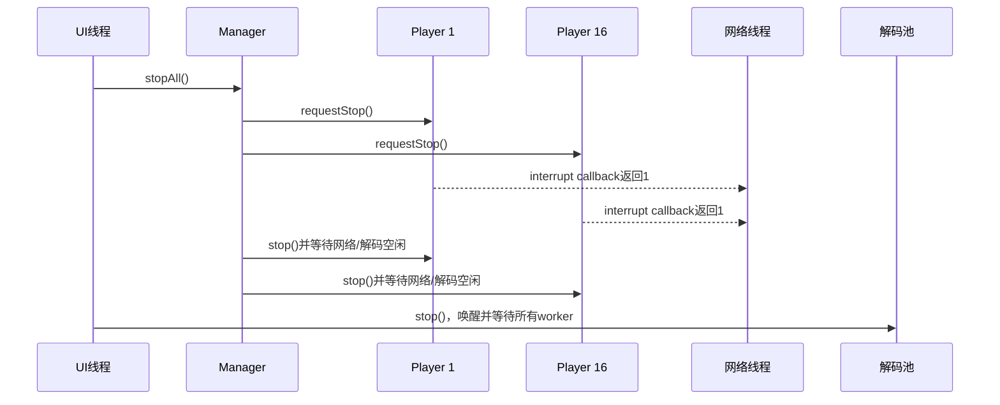
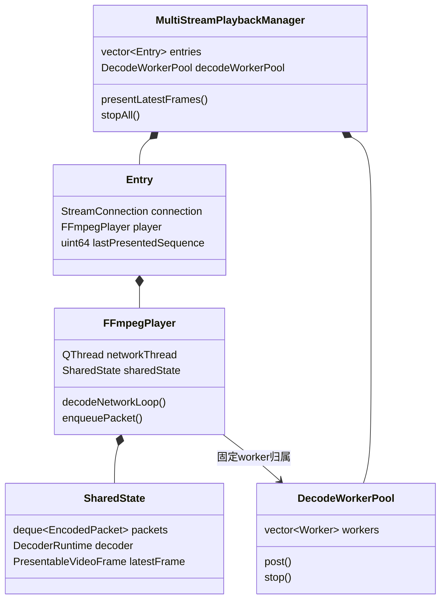

# Week 4：多路媒体与并发深度学习

> 文档分类：架构与深入学习。

> 本文是
> [Week 4～5 代码框架、维护与深入学习指南](week4_week5_architecture_guide.md)
> 中“多路媒体与并发”路线的详细教材。阅读前建议先熟悉 Week 3 的单路
> `FFmpegPlayer`，但不要求已经掌握并发编程。

## 1. 学习目标和阅读方法

读完本文后，你应该能够回答：

1. 为什么 16 路 RTMP 不能简单地全部放进一个线程？
2. 为什么每路有独立网络线程，却不为每路建立一组独立解码 worker？
3. 网络包队列为什么同时限制包数和字节数？
4. 队列溢出后为什么需要等待关键帧，而不是随便继续解码？
5. `decodeScheduled`、每批 4 包和 5 ms 时间片分别解决什么问题？
6. 为什么 UI 只取最新帧，而不接收所有解码帧？
7. `sessionId`、interrupt callback 和两阶段停止如何避免旧回调和线程泄漏？

第一次阅读不需要理解
[`FFmpegPlayer.cpp`](../../../../../src/common/media/FFmpegPlayer.cpp)
的每一行。建议先看第 2～7 节理解设计，再按第 8～11 节进入类和函数。

## 2. 并发编程基础

### 2.1 进程、线程和任务

- **进程**：正在运行的 `rtmp_monitor` 程序，拥有自己的地址空间和系统资源。
- **线程**：进程中的执行路径。不同线程可以同时执行，但共享进程内存。
- **任务**：一段等待某个 worker 执行的函数。任务不一定拥有独立线程。

本项目中同时存在：

- Qt UI 主线程；
- 每路 `FFmpegPlayer` 的网络 `QThread`；
- `DecodeWorkerPool` 中固定数量的解码 `QThread`；
- 日志文件 writer 线程。

网络线程和解码 worker 是不同概念。网络线程长期服务某一路连接；解码 worker 从任务
队列中不断取短任务执行。

### 2.2 共享数据和数据竞争

如果两个线程同时读写同一块内存，并且没有同步，就可能发生数据竞争。例如网络线程
向包队列尾部添加数据，同时解码线程从队首取数据。如果没有锁，容器内部结构可能被
破坏，轻则数据错误，重则崩溃。

项目主要使用以下同步工具：

| 工具 | 适合场景 | 项目示例 |
|---|---|---|
| `std::mutex` | 需要同时保护多个相关字段或容器操作 | 包队列、最新帧、展示目标 |
| `std::atomic` | 简单计数器或布尔标记的独立读写 | 停止标记、包数量、帧数量 |
| `std::condition_variable` | 没有工作时睡眠，或等待状态变化 | worker 等待任务、重连等待、停止等待 |
| Qt queued invocation | 把操作安全地投递到 QObject 所在线程 | 状态和错误回到 UI 线程 |

### 2.3 临界区

从锁住 mutex 到解锁之间的代码叫临界区。临界区应该尽量短：

```text
正确思路：
  加锁 → 从队列移动少量包到局部变量 → 解锁 → 执行耗时解码

不合适的思路：
  加锁 → 在持锁期间执行 avcodec_send_packet、sws_scale → 解锁
```

FFmpeg 解码和像素转换可能耗时。如果解码时一直持有 `queueMutex`，网络线程就无法
继续入队，其他停止操作也可能长时间等待。

### 2.4 生产者消费者模型

网络线程产生 `AVPacket`，解码 worker 消费 `AVPacket`：

```text
生产者：av_read_frame() → packets.push_back()
消费者：packets.pop_front() → avcodec_send_packet()
```

生产者和消费者速度不会始终一致。网络发生突发时，包到达速度可能暂时高于解码速度，
因此两者之间需要队列；队列又不能无限增长，因此需要背压规则。

### 2.5 条件变量为什么比轮询和 sleep 好

worker 没任务时不应该循环检查队列，否则会空耗 CPU。它在条件变量上休眠，`post()`
加入任务后再唤醒。

重连等待也使用条件变量。它通常等待 3 秒，但 `requestStop()` 可以提前唤醒它。相比
直接 `sleep(3s)`，程序关闭时不需要等完整的 3 秒。

## 3. 从 RTMP 到画面的媒体基础

### 3.1 RTMP、FLV 和 H.264 的关系

可以把这条链理解成：

```text
RTMP 负责网络传输
  → FLV 等容器组织音视频数据和时间信息
  → H.264 是视频压缩格式
  → 解码后得到 YUV 像素
  → 转成 RGB888 后放入 QImage 显示
```

FFmpeg 的 `AVFormatContext` 负责打开输入和解复用，`AVCodecContext` 负责 H.264
解码。它们不是同一个对象，也不一定在同一个线程中使用。

### 3.2 `AVPacket`、`AVFrame` 和 `QImage`

| 类型 | 含义 | 大小特点 |
|---|---|---|
| `AVPacket` | 压缩后的 H.264 数据包 | 相对较小，大小不固定 |
| `AVFrame` | 解码后的原始视频帧，通常是 YUV | 比压缩包大很多 |
| `QImage` | 供 Qt UI 使用的 RGB 图像 | 体积大，复制和排队成本高 |

以 1280×720 RGB888 为例，一帧约占 2.6 MiB。16 路 30 FPS 如果把每一帧都排入
Qt 事件队列，内存和 UI 延迟都会迅速增长。因此项目只保留每路最新的一张 `QImage`。

### 3.3 关键帧和参考帧

H.264 的普通 P 帧通常依赖前面的参考帧。关键帧（常见为 IDR）能够作为新的解码起点。
如果队列溢出时丢掉了部分参考包，却继续把后续普通帧交给解码器，可能出现：

- 解码错误；
- 长时间花屏；
- 画面内容不完整；
- 错误不断累积。

所以当前实现会清理积压、重置解码器并等待下一关键帧，再恢复正常解码。

## 4. 为什么采用当前架构

### 4.1 方案一：所有网络和解码都放在一个线程

优点是代码看起来简单，线程数量少；问题是任何一路的
`avformat_open_input()`、`av_read_frame()` 或 DNS 超时都会阻塞整个线程。

结果可能是 Camera 03 断线时，Camera 01～16 都停止读包。它不满足单路故障隔离。

### 4.2 方案二：每一路拥有网络线程和多线程解码器

故障隔离较好，但 16 路播放器会重复创建大量线程。若每个 H.264 解码器再使用多个
内部线程，线程总数、上下文切换和内存都会膨胀。

线程更多不等于吞吐一定更高。CPU 核心数量有限，过多线程会互相争抢。

### 4.3 当前方案：独立网络 + 共享解码 + 统一展示



这套结构的目标是：

- **故障隔离**：每路网络阻塞互不影响。
- **资源可控**：解码 worker 数固定，默认最多 8 个。
- **线程安全**：同一路固定到同一个 worker，`AVCodecContext` 串行访问。
- **公平调度**：每路只处理有限包数或有限时间，然后把 worker 让给其他流。
- **低延迟**：包队列和帧邮箱都有容量边界，主动丢弃过时数据。
- **可停止**：网络阻塞、重连等待和 worker 等待都可以被唤醒。

## 5. 线程边界和所有权



几个容易混淆的点：

1. `FFmpegPlayer` 这个 QObject 本身仍属于 UI 线程。
2. `decodeNetworkLoop()` 在该播放器创建的网络线程中执行。
3. `drainDecodeState()` 在共享池中该流固定所属的 worker 执行。
4. `SharedState` 使用 `shared_ptr`，解码任务捕获它后，即使任务异步排队，状态对象也
   不会提前销毁。
5. `owner` 是回到 `FFmpegPlayer` 的观察指针。析构前先安全停止任务，再置空 owner。
6. 媒体状态在 UI 线程进入 `LogManager`，真正的 JSONL 磁盘写入由日志文件线程完成。

## 6. 启动、读流和首帧时序

### 6.1 创建并启动一路流



`start()` 必须在播放器对象所属的 UI 线程调用。它不执行阻塞网络连接，而是创建网络
线程后立即返回，因此添加连接不会卡住界面。

### 6.2 网络线程的实际流程



网络线程设置的主要输入参数包括：

- `rw_timeout = 3,000,000` 微秒；
- `fflags = nobuffer`；
- `probesize = 32768`；
- `analyzeduration = 1,000,000` 微秒；
- `rtmp_live = live`。

这些参数偏向实时预览：减少探测和缓存，但并不保证任何网络环境下都绝对低延迟。

`av_read_frame()` 返回的复用 packet 会被 FFmpeg 重复使用，因此代码通过
`av_packet_move_ref()` 把数据所有权转移到独立 packet，再放入异步队列。

## 7. 包队列如何设计

### 7.1 队列保存什么

每个排队项是 `EncodedPacket`：

```text
AVPacket* packet
qint64 receivedMonotonicMs
uint64_t sessionId
```

- `packet`：压缩后的 H.264 数据。
- `receivedMonotonicMs`：客户端收到包的单调时钟时间，用于内部延迟统计。
- `sessionId`：标识它属于哪次播放会话，防止重连前的旧包进入新解码器。

`EncodedPacket` 析构时调用 `av_packet_free()`，因此清空 `shared_ptr` 队列也会释放
FFmpeg packet。

### 7.2 相关字段

`SharedState` 中与队列相关的字段是：

| 字段 | 作用 |
|---|---|
| `queueMutex` | 保护队列、字节数、解码调度标记和解码器切换状态 |
| `idleCondition` | `stop()` 等待当前解码任务完全退出 |
| `packets` | `std::deque`，网络线程尾部入队，worker 头部出队 |
| `queueBytes` | 当前队列中 packet 字节总量 |
| `codecConfiguration` | 最新流参数，供 worker 创建解码器 |
| `configurationSessionId` | 这份解码配置所属会话 |
| `decoderResetRequired` | worker 下一轮必须重建/刷新解码器 |
| `dropUntilKeyframe` | 是否丢弃普通帧直到关键帧 |
| `decodeScheduled` | 该流是否已有解码任务排队或执行 |
| `stopping` | 阻止新入队并要求 worker 清理退出 |

### 7.3 为什么同时限制包数和字节数

默认限制来自 `PlaybackPerformanceOptions`：

```text
maximumQueuedPackets = 45
maximumQueuedBytes   = 4 MiB
```

只限制包数不够，因为 packet 大小不同；只限制字节数也不够，因为大量很小的 packet
仍会增加容器和调度开销。任一上限触发都视为积压。

这些上限不是为了保证“一包不丢”，而是为了保证：

- 内存使用有界；
- 延迟不会因为补播旧包持续增长；
- 一路拥塞不会拖垮全部 16 路。

### 7.4 `enqueuePacket()` 的完整判断



溢出时不是简单丢一个旧包，而是清空整段不连续数据。原因是 H.264 帧之间存在参考
关系，任意删除中间包后继续解码并不可靠。

若当前包本身就是关键帧，它可以成为新的起点，因此清空后立即保留；否则进入
`dropUntilKeyframe`，直到关键帧出现。

### 7.5 `scheduleDecodeLocked()` 为什么需要 `decodeScheduled`

假设网络线程快速收到 100 个包。如果每个包都向 worker 池投递一个任务，同一路会在
worker 任务队列中堆积 100 个任务。即使后来重连或清空包队列，这些过期任务仍需要
被逐个唤醒。

当前规则是每路只维持一条解码任务链，而不是每个 packet 都 post 一个任务：

```text
decodeScheduled == true
  → 只把新包放入 packets，不重复 post

decodeScheduled == false
  → 设置为 true，再向固定 worker post 一个 drainDecodeState
```

任务执行结束前可能为自己衔接一个后继任务，此时会短暂存在“当前任务正在执行、后继
任务已经排队”，但网络入包不会再额外 post。因此在当前唯一调用方约束下，worker
任务队列中的媒体任务数量受流数量限制，而不是受 packet 数量限制。

## 8. 共享解码池和公平调度

### 8.1 Worker 的结构

每个 `DecodeWorkerPool::Worker` 包含：

```text
一个 QThread
一个 mutex
一个 condition_variable
一个 std::deque<std::function<void()>>
一个 stopping 标记
```

`runWorker()` 的循环是：

```text
等待 stopping 或 tasks 非空
  → 取出队首任务
  → 解锁
  → 执行任务
  → 返回继续等待下一任务
```

任务执行时不持有 worker 的 mutex，因此其他流仍然可以向该 worker 投递任务。

### 8.2 按流亲和

worker 下标由稳定 key 计算：

```cpp
workerIndex = StreamId % workerCount;
```

例如 8 个 worker 时，Stream 1 和 Stream 9 可能属于同一 worker。它们会串行共享该
worker，但同一流永远不会突然切换到另一个 worker。

这样做的核心原因是 `AVCodecContext` 不是为多个外部线程同时调用而设计的。固定归属
让同一路的解码器始终被同一线程串行使用，不需要在每次 FFmpeg 调用外再加一层大锁。

### 8.3 为什么还要限制每批 4 包或 5 ms

如果 Camera 01 的队列中有 45 个包，并一次性全部处理，它可能长时间占用 worker，
同一 worker 上的 Camera 09 就得不到调度。

`drainDecodeState()` 每轮：

- 最多从队列取 4 个包；
- 处理过程中达到 5 ms 后，把尚未处理的本批包放回队首；
- 若仍有数据，再把自己的任务投递到 worker 队尾。



这是一种协作式公平调度。批次太大时单路吞吐可能高，但其他路延迟上升；批次太小时
任务切换开销增加。修改这两个常量必须重新做 16 路性能测试。

## 9. 解码、转换和最新帧邮箱

### 9.1 `drainDecodeState()` 的三个阶段

**阶段一：短时间持锁取快照**

- 读取 `stopping`、`decoderResetRequired` 和最新配置；
- 从队首移动最多 4 个包到局部 `batch`；
- 更新 `queueBytes`；
- 释放 `queueMutex`。

**阶段二：不持队列锁执行耗时工作**

- 需要时创建或重建 `AVCodecContext`；
- 设置 `AV_CODEC_FLAG_LOW_DELAY`；
- 把 FFmpeg 解码器内部 `thread_count` 设为 1；
- `avcodec_send_packet()`；
- 循环 `avcodec_receive_frame()`；
- 按展示节奏决定是否执行 `sws_scale()`。

**阶段三：重新加锁完成调度**

- 未处理完的 `deferredBatch` 放回队首；
- 根据是否还有包决定再次 post；
- 完全空闲时把 `decodeScheduled` 设为 false；
- 停止时清队列、释放解码器并通知 `idleCondition`。

### 9.2 解码 FPS 和展示 FPS 为什么不同

项目允许解码器尽量跟上源帧率，但 RGB 转换和 UI 展示有单独节奏：

| 场景 | 转换/展示上限 | 最大转换尺寸 |
|---|---:|---:|
| 网格 | 15 FPS | 640×360 |
| 全屏 | 30 FPS | 1280×720 |

`decodedFrames` 表示解码得到的帧，`convertedFrames` 表示转为 `QImage` 的帧，
`presentedFrames` 表示 UI 实际取走的帧。三者不同是正常的。

像素转换和 `QImage` 分配成本较高。16 路网格没有必要把每路 30 FPS 的所有帧都转成
RGB 并显示。

### 9.3 最新帧邮箱

worker 生成 `PresentableVideoFrame` 后，在 `frameMutex` 保护下直接覆盖：

```text
latestFrame = 新帧
```

邮箱没有 `deque<QImage>`，容量始终是 1。每帧带递增 `sequence`，Manager 保存
`lastPresentedSequence`：

```text
frame.image为空              → 跳过
frame.sequence已展示过       → 跳过
出现更大sequence             → markFramePresented并发出frameReady
```

Manager 的展示 `QTimer` 每 33 ms 轮询一次全部流。播放器在 Manager 模式下关闭
`automaticFrameSignals`，避免每个 worker 为每帧向 UI 投递 queued signal。



这是实时系统常用的“保持最新状态”模式。录像系统则不同，录像通常不能随意丢帧，
需要另一套持久化和背压策略。

## 10. 断流、重连和安全关闭

### 10.1 断流后的网络循环

网络失败后：

1. 若本次连接曾收到有效包，先把此前连续失败次数清零；
2. 当前断流计为一次新失败；
3. 发出 `Error` 和具体错误；
4. 达到非零失败上限时停留在 `Error`；
5. 否则发出 `Reconnecting` 和重连安排；
6. 可中断等待 3 秒，再次进入 `Connecting`。

解码 worker 遇到严重错误时会设置 `restartRequested_`，网络线程的 interrupt
callback 也会看到它，从阻塞 FFmpeg 调用中退出并回到同一个重连循环。

### 10.2 interrupt callback

FFmpeg 阻塞网络调用无法只靠普通 Qt 信号立即返回。输入 context 设置了
`AVIOInterruptCB`，FFmpeg 会周期性调用：

```text
stopRequested == true
或 restartRequested == true
  → 返回1，要求FFmpeg中断当前I/O
```

它是当前设计能够安全关闭阻塞网络调用的关键，不能用 `QThread::terminate()` 代替。

### 10.3 session id 如何过滤旧结果

`start()` 创建新会话时递增 `sessionId_`。状态、错误、包和解码配置都携带本次
session id。

异步回调回到 UI 线程前再次比较：

```text
回调sessionId == 当前sessionId → 接受
回调sessionId != 当前sessionId → 旧会话结果，忽略
```

`stop()` 完成后也会递增 session id，使仍在 Qt 队列里的旧状态或旧错误失效。

### 10.4 两阶段批量停止



如果对 Player 1 先完整 `stop()`，再向 Player 2 发停止请求，那么等待 Player 1 时其余
网络线程仍可能阻塞。先广播 `requestStop()` 可以让所有路同时开始退出。

## 11. 按类和函数阅读代码



Manager 拥有全部 Entry 和唯一解码池；每个 Entry 拥有一路 Player；Player 拥有或共享
跨线程状态，但只借用 Manager 的解码池。

### 11.1 `PlaybackTypes`

源码：
[`PlaybackTypes.h`](../../../../../include/common/media/PlaybackTypes.h)

#### `StreamId`

全局稳定的无符号整数身份。添加后不会因为拖拽、网格重排或删除其他设备而变化。
它用于：

- Manager 查找 `Entry`；
- Controller 查找 UI 绑定；
- 选择固定解码 worker；
- 指标和日志关联设备。

#### `StreamConnection`

保存 `id`、显示名称和 URL。它是连接配置，不保存线程或解码器。

#### `PresentationTarget`

保存当前视口大小和是否全屏。UI 线程更新，worker 在
`presentationMutex` 保护下读取，用于决定 RGB 转换尺寸和节奏。

#### `PresentableVideoFrame`

- `image`：RGB888 `QImage`；
- `sequence`：邮箱版本号；
- `receivedMonotonicMs`：内部延迟起点；
- `sourceTimestampMs`：仅延迟标记测试使用。

#### `StreamMetrics`

它是某个时刻的指标快照，不是共享状态本身。累计计数主要来自 atomic，队列长度和
延迟样本在相应 mutex 下复制。

#### `PlaybackPerformanceOptions`

集中保存 worker 数、展示 FPS、尺寸、队列上限、重连间隔和失败上限。修改默认值时要
同时检查命令行、测试和验收文档。

### 11.2 `DecodeWorkerPool`

源码：
[`DecodeWorkerPool.h`](../../../../../include/common/media/DecodeWorkerPool.h)、
[`DecodeWorkerPool.cpp`](../../../../../src/common/media/DecodeWorkerPool.cpp)

#### 构造函数

**调用线程**：UI 线程，由 Manager 构造函数调用。<br>
**作用**：按配置创建固定数量 `Worker` 和 `QThread`，每个线程执行
`runWorker()`。<br>
**维护风险**：创建数量过大可能造成上下文切换；过小则多个流争用同一 worker。

#### 析构函数和 `workerCount()`

析构函数调用幂等的 `stop()`，避免 worker 线程带着池对象一起销毁。`workerCount()`
只是返回当前 worker 数，不启动或停止任何线程。

#### `workerIndexFor(stableKey)`

**输入**：通常是 `StreamId`。<br>
**输出**：`stableKey % workers_.size()`。<br>
**作用**：保证同一稳定 key 始终返回同一个 worker。

#### `post(workerIndex, task)`

**调用线程**：可能是网络线程或解码 worker。<br>
**同步**：锁住目标 worker 的 mutex，把任务放入队尾，然后通知条件变量。<br>
**失败**：参数无效或 worker 已停止时返回 false。

#### `runWorker(Worker*)`

**调用线程**：对应 worker 的 `QThread`。<br>
**作用**：条件变量等待任务，取出一个任务后在锁外执行。<br>
**退出**：`stopping` 且任务队列为空时退出。

#### `stop()`

**调用线程**：Manager 析构所在的 UI 线程。<br>
**过程**：设置每个 worker 的停止标记、全部唤醒、逐个 `wait()`，最后清空 worker。<br>
**幂等性**：`stopped_` 防止重复停止。

### 11.3 `FFmpegPlayer`

源码：
[`FFmpegPlayer.h`](../../../../../include/common/media/FFmpegPlayer.h)、
[`FFmpegPlayer.cpp`](../../../../../src/common/media/FFmpegPlayer.cpp)

#### 成员按职责分组

| 组 | 主要成员 | 所属/访问线程 |
|---|---|---|
| 解码池 | `ownedDecodeWorkerPool_`、`decodeWorkerPool_` | UI 创建，worker 执行任务 |
| 跨线程状态 | `sharedState_` | 网络、worker、UI 共享 |
| 网络会话 | `networkThread_` | UI 创建/等待，内部执行网络循环 |
| 身份与配置 | `streamId_`、`displayName_`、`options_` | 启动前确定，之后只读 |
| 会话控制 | `stopRequested_`、`restartRequested_`、`sessionId_` | atomic 跨线程访问 |
| 重连等待 | `reconnectMutex_`、`reconnectCondition_` | 网络等待，UI/worker 唤醒 |
| UI 状态 | `state_`、FPS 采样字段 | 只在 QObject 所属线程更新 |

#### `SharedState` 的锁划分

| 数据 | 保护方式 | 原因 |
|---|---|---|
| 包队列、解码调度和 decoder | `queueMutex` | 多字段需要一致更新 |
| 最新帧 | `frameMutex` | worker 覆盖、UI 复制 |
| 展示目标 | `presentationMutex` | UI 写、worker 读 |
| 延迟样本 vector | `latencyMutex` | UI 和 worker 都会更新/读取 |
| 累计计数和简单时间 | atomic | 独立字段频繁更新，避免大锁 |

这些锁不能随意合并成一个“全局大锁”，否则网络、解码、UI 和指标读取会互相阻塞。

#### 文件内 RAII 辅助类型

`FFmpegPlayer.cpp` 还定义了几种只在实现文件使用的资源包装：

- `FFmpegNetworkRuntime`：进程级初始化和反初始化 FFmpeg 网络模块；
- `FormatContextHandle`：离开作用域时关闭 `AVFormatContext`；
- `DictionaryHandle`：释放输入参数字典；
- `CodecConfiguration`：拥有复制后的 `AVCodecParameters` 和 time base；
- `EncodedPacket`：拥有异步队列中的 `AVPacket`；
- `DecoderRuntime`：集中释放 `AVCodecContext`、`AVFrame` 和 `SwsContext`。

它们用析构函数表达资源所有权，确保网络循环在任意错误分支退出时仍能释放 FFmpeg
资源。新增 FFmpeg 指针时应优先建立同类包装，不要在大量分支手写释放代码。

#### 构造函数和析构函数

单路兼容构造函数会在需要时拥有自己的解码池；Manager 使用的构造函数接收共享池、
稳定 `StreamId` 和性能参数，并计算固定 worker index。

析构函数先调用 `stop()`，确认网络和解码任务退出，再把 `SharedState::owner` 置空。
不能先置空或销毁状态再等待 worker。

#### `start(rtmpUrl)`

**调用线程**：UI 线程。<br>
**主要步骤**：

1. 拒绝重复启动并校验 RTMP URL；
2. 等待并清理已经结束的旧网络线程；
3. 清除停止/重启标记并生成新 session id；
4. 在 `queueMutex` 下清队列和旧配置，要求下次重建解码器；
5. 在 `frameMutex` 下清最新帧；
6. 创建网络 QThread 执行 `decodeNetworkLoop()`。

**输出**：线程成功创建时返回 true，不代表已经连接成功。

#### `decodeNetworkLoop(url, sessionId)`

**调用线程**：该路网络线程。<br>
**主要步骤**：

1. 发出 `Connecting`；
2. 创建 format context，安装 interrupt callback；
3. 设置低延迟输入参数；
4. 打开输入、读取流信息、找到 H.264 视频流；
5. 把 codec parameters 复制为跨线程配置；
6. 循环读取 packet，只保留目标视频流；
7. 失败后执行 Error、失败上限和 3 秒重连逻辑。

**维护风险**：不要在此直接创建或操作 QWidget；不要让网络线程长期执行像素转换。

#### `enqueueDecoderConfiguration()`

**调用线程**：网络线程。<br>
**同步**：`queueMutex`。<br>
**作用**：清除上一段队列，保存新参数，标记解码器重建，清除等待关键帧状态，并安排
worker。重连后即使编码参数看起来一样，也按新会话重新建立解码状态。

#### `enqueuePacket()`

**调用线程**：网络线程。<br>
**作用**：包装 packet、检查 session、更新指标、执行背压/关键帧规则、入队并安排
解码。
**维护风险**：这里的锁内代码必须短；不要在锁内调用耗时 FFmpeg 解码。

#### `scheduleDecodeLocked()`

**调用线程**：持有 `queueMutex` 的网络线程或 worker。<br>
**前置条件**：调用者已经持有队列锁。<br>
**作用**：以 `decodeScheduled` 实现每路最多一个解码任务，并投递到固定 worker。

函数名中的 `Locked` 是重要提示：不要在未持锁时调用，也不要在内部再次锁同一个
非递归 mutex。

#### `drainDecodeState()`

**调用线程**：固定解码 worker。<br>
**作用**：取有限批次、维护解码器、发送 packet、接收 frame、按节奏转换 RGB、写入
最新帧邮箱，再决定空闲或重新排队。
**错误处理**：解码错误发回 owner，并设置 `restartRequested_` 让网络会话重新建立。

这是媒体层最复杂的函数。阅读时应按“锁内取数据 → 锁外解码 → 锁内重新调度”三段
理解，不要从第一行一直顺序死记。

#### `latestFrame()` 和 `markFramePresented()`

`latestFrame()` 在 `frameMutex` 下复制邮箱快照；`markFramePresented()` 在 UI 实际
接受新 sequence 后更新展示帧数和内部延迟样本。

#### 查询、展示配置和指标函数

- `isRunning()`：在 UI 线程查询网络 QThread 是否仍在运行；
- `setAutomaticFrameSignalsEnabled()`：单路兼容模式使用逐帧投递，Manager 模式关闭；
- `setPresentationTarget()`：在 `presentationMutex` 下更新网格/全屏目标；
- `metricsSnapshot()`：组合 atomic 计数、队列快照、最近 FPS 和延迟分位数；
- `deliverLatestFrame()`：仅为自动帧信号兼容路径服务，校验 session 和 sequence 后
  发出 `frameReady(QImage)`。

#### `postState()`、`postError()`、`postReconnectScheduled()`

**调用线程**：网络或解码 worker。<br>
**作用**：通过 `QMetaObject::invokeMethod(..., Qt::QueuedConnection)` 回到播放器
QObject 所在线程，并再次检查 session id。

#### `setStateOnOwnerThread()`

**调用线程**：播放器 QObject 所属的 UI 线程。<br>
**作用**：状态真正变化时才更新并发出 `stateChanged`，避免相同状态重复信号。

#### `requestStop()` 和 `stop()`

`requestStop()` 只设置 atomic 标记并唤醒重连等待，适合 Manager 第一阶段广播。

`stop()` 负责完整回收：

- 请求停止；
- 等待网络线程；
- 设置队列 stopping；
- 等待当前解码任务退出；
- 清 packet、decoder、配置和最新帧；
- 使旧 session 失效；
- 状态回到 `Disconnected`。

#### `waitForReconnect()` 和 `interruptCallback()`

前者执行可中断的超时等待；后者被 FFmpeg 网络代码调用，看到 stop/restart 标记时
请求中断当前 I/O。两者共同保证“等待重连”和“阻塞网络读取”都能退出。

### 11.4 `MultiStreamPlaybackManager`

源码：
[`MultiStreamPlaybackManager.h`](../../../../../include/common/media/MultiStreamPlaybackManager.h)、
[`MultiStreamPlaybackManager.cpp`](../../../../../src/common/media/MultiStreamPlaybackManager.cpp)

#### `Entry`

每路保存：

```text
StreamConnection connection
unique_ptr<FFmpegPlayer> player
uint64_t lastPresentedSequence
```

Manager 拥有 player。`lastPresentedSequence` 属于展示调度，不放进 `VideoWidget`，
因为 Manager 才是判断某路邮箱是否出现新帧的地方。

#### 构造函数

- 解析 worker 数，创建唯一共享 `DecodeWorkerPool`；
- 创建 33 ms 精确定时器执行 `presentLatestFrames()`；
- 创建 1 秒定时器执行 `publishMetrics()`。

这些定时器在 Manager 所属 UI 线程运行。

析构函数先停两个定时器，再 `stopAll()`、清空 Entry，最后停止共享解码池。这个顺序
保证 UI 不再轮询正在释放的播放器，也保证 Player 全部停止后才销毁 worker。

#### `addStream()`

**作用**：检查 16 路上限，生成单调递增 `StreamId`，创建播放器并连接状态信号。<br>
**关键设置**：`setAutomaticFrameSignalsEnabled(false)`，切换到 Manager 统一轮询模式。

#### `startStream()`、`stopStream()`、`restartStream()`

- `startStream()` 使用 Entry 中保存的 URL 启动。
- `stopStream()` 保留 Entry，只停止播放器。
- `restartStream()` 完整 stop，重置 `lastPresentedSequence`，再 start。

三者都使用稳定 `StreamId` 查找 Entry。

#### `removeStream()`

先停止播放器，再从 `entries_` 删除。`unique_ptr` 保证 Player 资源随 Entry 销毁，但
显式 stop 仍是线程安全前提。

#### 查询与查找函数

- `streamCount()`、`decodeWorkerCount()` 和 `streamIds()` 提供管理器快照；
- `entryFor(StreamId)` 是所有按 ID 操作的统一查找入口；
- `isStreamRunning()` 转发到对应 Player；
- 查找失败时返回空指针、false 或空指标，不使用网格下标兜底。

#### 展示目标和指标配置

- `setPresentationTarget()` 把网格/全屏视口转发给对应 Player；
- `streamMetrics()` 和 `metricsSnapshot()` 获取一路或全部流的快照；
- `setMetricsOutputPath()`/`metricsOutputPath()` 只管理指标文件路径，不创建线程；
- 实际文件写入由 1 秒指标定时器触发。

#### `startAll()` 和 `stopAll()`

`startAll()` 顺序发起每路异步网络线程；启动调用本身不等待 RTMP 成功。

`stopAll()` 先对全部路 `requestStop()`，再逐路 `stop()`，实现前述两阶段关闭。

#### `presentLatestFrames()`

**调用线程**：UI 线程，每 33 ms。<br>
**步骤**：

1. 记录 UI timer 最大间隔；
2. 遍历 Entry；
3. 复制 player 最新帧；
4. image 为空或 sequence 未变化则跳过；
5. 更新 `lastPresentedSequence`；
6. 记录 presented 指标；
7. 发出 `frameReady(StreamId, frame)`。

#### `publishMetrics()` 和 `writeMetricsFile()`

每秒获取各播放器快照，发出 `metricsUpdated`。配置了路径时使用 `QSaveFile` 原子替换
JSON，避免外部脚本读到只写了一半的文件。指标中不包含 URL。

#### 媒体层的应用边界

Manager 对外只暴露带 `StreamId` 的帧、状态、错误、重连和指标信号。
[`StreamConnectionController`](../../../../../src/common/app/StreamConnectionController.cpp)
根据 ID 找到 `VideoWidget` 并更新 UI。媒体层不保存 QWidget 指针。

## 12. 线程安全总表

| 操作/数据 | UI线程 | 网络线程 | 解码worker | 同步方式 |
|---|:---:|:---:|:---:|---|
| Manager 增删/启停 Entry | 读写 | 不访问 | 不访问 | UI 线程限定 |
| `stopRequested_`、`restartRequested_` | 读写 | 读写 | 读写 | atomic |
| `sessionId_` | 读写 | 读 | 读 | atomic |
| packet deque、queueBytes | 停止时写 | 入队 | 出队/回队 | `queueMutex` |
| DecoderRuntime | 停止且空闲时释放 | 不访问 | 使用 | worker 归属 + `queueMutex` 协调 |
| latestFrame | 读/清空 | 不访问 | 覆盖 | `frameMutex` |
| PresentationTarget | 写 | 不访问 | 读 | `presentationMutex` |
| 延迟样本 | 读/写 | 不访问 | 写 | `latencyMutex` |
| 累计指标 | 读 | 写 | 写 | atomic |
| `state_`、FPS采样字段 | 读写 | 通过消息投递 | 通过消息投递 | QObject/UI 线程限定 |

判断一个字段是否安全时，要同时回答两个问题：

1. 哪些线程会访问它？
2. 它是由线程归属、mutex 还是 atomic 保证安全？

“目前看起来只有一个线程写”不是充分保证，必须从调用链验证。

## 13. 推荐断点和观察路线

| 断点 | 观察内容 |
|---|---|
| `MultiStreamPlaybackManager::addStream()` | `nextStreamId_`、worker 数、Entry |
| `FFmpegPlayer::start()` | 当前线程、旧/新 session id |
| `decodeNetworkLoop()` | 网络线程名、连接状态、video stream index |
| `enqueuePacket()` | packet size、关键帧标志、队列包数/字节数 |
| `scheduleDecodeLocked()` | `decodeScheduled`、worker index |
| `DecodeWorkerPool::post()` | 目标 worker、任务队列长度 |
| `drainDecodeState()` | batch 大小、decoder session、是否重置 |
| `presentLatestFrames()` | frame sequence、lastPresentedSequence |
| `requestStop()` | stop 标记和重连条件变量 |
| `interruptCallback()` | 是 stop 还是 restart 导致中断 |

Visual Studio 调试时可以打开 Threads 窗口，观察类似
`streamPlayer3NetworkThread`、`DecodeWorker01` 的线程名。不要只看调用栈而忽略当前
线程。

## 14. 三个学习实验

### 14.1 追踪一个 packet 到界面

1. 只启动一路流。
2. 在 `av_read_frame()` 后、`enqueuePacket()`、`drainDecodeState()` 和
   `presentLatestFrames()` 设置断点。
3. 记录 packet 的 session id 和接收时间。
4. 观察它经过哪个 worker。
5. 观察解码后的 frame sequence，最后确认 Controller 按同一 `StreamId` 更新 UI。

目标是亲自画出一张包含线程切换的数据流图。

### 14.2 降低队列上限观察背压

在测试配置中临时把最大包数设得很小，不修改正式默认值：

1. 观察 `wouldOverflow` 触发；
2. 观察旧 packets 被清空；
3. 检查 `decoderResetRequired` 和 `dropUntilKeyframe`；
4. 确认关键帧到来后恢复；
5. 查看 `packetsDropped` 指标增长。

实验后恢复配置，并运行媒体相关测试。

### 14.3 停止一路 publisher

1. 启动 16 路测试。
2. 停止 Camera 03 publisher。
3. 观察 Camera 03 网络线程进入 Error/Reconnecting。
4. 确认其他网络线程和 worker 继续工作。
5. 恢复 publisher，观察新配置、decoder reset 和 Playing。
6. 在重连等待期间关闭程序，确认等待被立即唤醒。

## 15. 常见问题

### 为什么不用一个通用线程池同时处理网络和解码？

FFmpeg 网络 API 可能阻塞数秒。若它占住通用 worker，解码任务就得不到执行。网络线程
独立后，阻塞范围被限制在单路。

### 为什么不把包队列扩大到几百或几千？

更大的队列只是把丢帧问题变成长延迟和高内存问题。实时监控需要尽快追上当前画面，
不是完整补播历史。

### 为什么不用每帧一个 Qt signal？

跨线程 queued signal 会在 UI 事件队列中保存参数。大量 `QImage` 来不及处理时会造成
积压。统一轮询最新帧让每路最多保留一张。

### 为什么 FFmpeg 解码器内部线程数设为 1？

外部已经有共享 worker 并行处理多路。若每个 `AVCodecContext` 再扩张内部线程，16 路
会产生过多线程。是否改为多线程必须依据性能报告，而不是仅凭单路经验。

### 修改 4 包或 5 ms 会发生什么？

- 增大：单路吞吐可能提高，但同 worker 的其他流等待更久。
- 减小：公平性可能提高，但任务重新排队和锁开销增加。

必须同时观察最低解码 FPS、展示 FPS、队列占用、CPU 和延迟。

### 为什么不能使用 `QThread::terminate()`？

强制终止可能发生在 FFmpeg、mutex 或内存分配操作中，资源状态无法保证一致。当前
interrupt callback、atomic 停止标记和条件变量已经提供可控退出路径。

### Worker 的任务 deque 本身为什么没有固定容量？

媒体调用方通过每路 `decodeScheduled` 保证同一路只有一条解码任务链；执行结束前至多
衔接一个后继任务。流数量又限制为 16，因此正常媒体任务不会按 packet 数无限增长。
如果以后让其他模块也向此池任意 post，必须重新评估并增加全局任务上限。

## 16. 自检清单

- [ ] 能区分网络线程、解码 worker 和 UI 线程。
- [ ] 能解释 `queueMutex` 为什么不能覆盖整个解码过程。
- [ ] 能手画 packet 队列溢出后的关键帧恢复流程。
- [ ] 能解释 `decodeScheduled` 与 worker 任务队列的关系。
- [ ] 能解释同一路固定 worker 的线程安全意义。
- [ ] 能说出每批 4 包/5 ms 对公平性的作用。
- [ ] 能解释 `latestFrame + sequence` 如何替代逐帧 UI 队列。
- [ ] 能说明 session id 如何阻止旧会话结果污染新会话。
- [ ] 能说明两阶段 `stopAll()` 为什么比逐路直接停止更快。
- [ ] 修改队列或调度参数后，知道需要运行哪些测试和性能验收。

## 17. 推荐继续阅读

- [Week 4～5 总体框架指南](week4_week5_architecture_guide.md)
- [Week 3 FFmpeg 单路播放器](../../weeks/week3/week3_ffmpeg_player.md)
- [Week 4 16 路架构与验收](../../weeks/week4/week4_sixteen_stream_validation.md)
- [Week 4 模块变更与测试记录](../../weeks/week4/week4_release_test_and_module_changes.md)
- [Week 5 状态、日志与重连](../../weeks/week5/week5_device_status_and_logging.md)
- [代码规范](../development/code_style_guide.md)
- [`FFmpegPlayerLifecycleTest`](../../../../../tests/FFmpegPlayerLifecycleTest.cpp)
- [`MultiStreamPlaybackManagerTest`](../../../../../tests/MultiStreamPlaybackManagerTest.cpp)

建议完成本文三个实验后，再阅读 `FFmpegPlayer.cpp` 的全部实现。此时每个 mutex、
atomic 和状态字段都会对应到一个具体问题，而不是孤立的语法。
