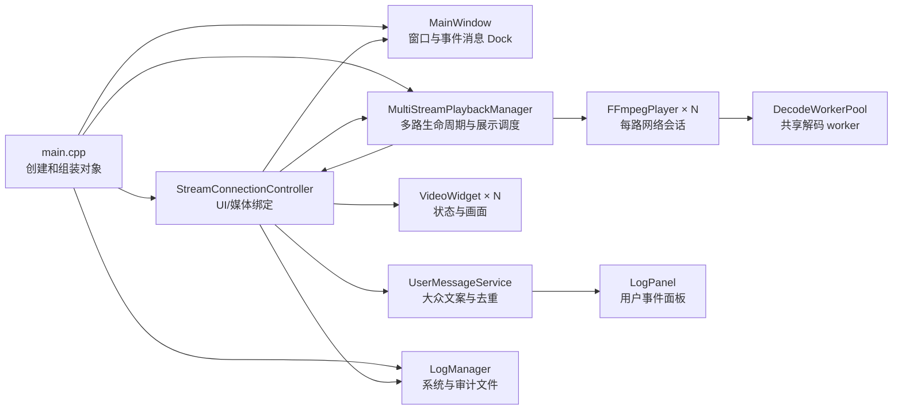

# Week 4～5 代码框架、维护与深入学习指南

> 文档分类：架构与深入学习。

> 适合读者：已经了解 Week 1～3，知道 Qt Widgets、RTMP 和单路
> `FFmpegPlayer` 的基本作用，但还没有接触多路调度、并发队列、统一状态和日志系统。

## 1. Week 4 和 Week 5 分别解决了什么

Week 3 的核心问题是“如何播放一路 RTMP”。Week 4 和 Week 5 没有推翻单路播放器，
而是在它外面逐层增加管理能力：

| 阶段 | 主要问题 | 解决结果 |
|---|---|---|
| Week 3 | 一路流如何拉取、解码和显示 | `FFmpegPlayer` 能独立播放一路 RTMP |
| Week 4 | 如何动态管理和同时播放最多 16 路 | 稳定 ID、多路管理器、共享解码池、动态网格 |
| Week 5 | 断流后如何恢复，现场如何定位问题 | 统一状态、3 秒重连、用户事件、系统日志和审计日志 |

理解这两周代码时，可以先记住一句话：

> `FFmpegPlayer` 仍然只负责一路流；`MultiStreamPlaybackManager` 管理很多播放器；
> `StreamConnectionController` 把媒体对象和界面对象绑定起来。

## 2. 总体框架



这里存在两条不同的数据方向：

- 视频数据：网络 → 压缩包队列 → 解码池 → 最新帧 → `VideoWidget`。
- 状态事件：播放器 → 多路管理器 → Controller → 状态文本和日志。

不要把这两条通路混在一起。视频帧量大，需要背压和限帧；状态事件量小，适合使用
Qt 信号槽。

## 3. 主要模块及维护边界

| 模块 | 负责什么 | 不负责什么 | 常见修改场景 |
|---|---|---|---|
| [`main.cpp`](../../../../../src/main.cpp) | 参数解析、创建对象、启动和关闭顺序 | 具体播放算法 | 增加全局命令行配置 |
| [`StreamConnectionController`](../../../../../include/common/app/StreamConnectionController.h) | 用 `StreamId` 绑定播放器、设备信息和视频格 | 解码、网格布局 | 增加设备操作或状态/日志事件 |
| [`MultiStreamPlaybackManager`](../../../../../include/common/media/MultiStreamPlaybackManager.h) | 动态增加、启动、重连、移除多路流；统一展示定时器和指标 | 具体 FFmpeg 解码细节 | 增加多路级控制或指标 |
| [`FFmpegPlayer`](../../../../../include/common/media/FFmpegPlayer.h) | 一路网络会话、包队列、解码状态和最新帧 | 管理其他设备和 UI | 修改单路拉流、重连或解码 |
| [`DecodeWorkerPool`](../../../../../include/common/media/DecodeWorkerPool.h) | 固定数量 worker、按流分配任务 | 网络连接和 UI | 修改解码调度策略 |
| [`MainWindow`](../../../../../include/common/ui/MainWindow.h) | 主窗口、空状态页、日志 Dock、状态文字映射 | 保存媒体状态 | 修改窗口级功能 |
| [`VideoGridWidget`](../../../../../include/common/ui/VideoGridWidget.h) | 0～16 路布局、拖拽、移除和全屏协调 | 播放器生命周期 | 修改宫格交互或排列 |
| [`VideoWidget`](../../../../../include/common/ui/VideoWidget.h) | 显示设备名、状态和单路画面 | 拉流和解码 | 修改单个视频格的表现 |
| [`LogManager`](../../../../../include/common/logging/LogManager.h) | 系统/审计分流、脱敏、过滤和异步轮转文件 | 决定用户文案和审计时机 | 增加日志字段或输出方式 |
| [`LogPanel`](../../../../../include/common/ui/LogPanel.h) | 显示有界用户事件消息 | 显示系统日志或写文件 | 修改底部事件面板交互 |

一个实用判断方法是：如果需求中出现“某一路怎么解码”，先找 `FFmpegPlayer`；出现
“多路怎么管理”，先找 Manager；出现“界面和播放器怎么对应”，先找 Controller。

## 4. 四条核心调用链

### 4.1 程序启动

入口是 [`main()`](../../../../../src/main.cpp)：

```text
创建 QApplication
  → 解析 --url、解码线程、重连和日志参数
  → 初始化 LogManager 和样式
  → 创建 MultiStreamPlaybackManager
  → 创建 MainWindow
  → 创建 StreamConnectionController
  → 预装命令行 URL（如果有）
  → 显示窗口并进入 Qt 事件循环
```

这些对象主要创建在 UI 线程。`main` 只负责“组装”，具体逻辑交给各模块。这样做的
好处是以后增加参数时不需要进入媒体内部，修改播放器时也不需要改窗口创建代码。

普通启动没有 `--url`，所以先显示空状态页。测试脚本会重复传入最多 16 个 `--url`，
Controller 再逐个创建连接。

### 4.2 从添加连接到显示第一帧

用户点击“添加新的连接”后的实际调用顺序是：

```text
MainWindow::addConnectionRequested
  → StreamConnectionController::showConnectionDialog()
  → StreamConnectionController::addConnection()
  → MultiStreamPlaybackManager::addStream()
  → 创建 FFmpegPlayer，并得到稳定 StreamId
  → MainWindow::addConnectionWidget()
  → 创建 VideoWidget
  → Controller 保存 Binding{StreamId, 名称, URL, VideoWidget}
  → MultiStreamPlaybackManager::startStream()
  → FFmpegPlayer::start()
  → 创建该路网络 QThread
```

`Binding` 是理解 Week 4 的关键。它保证 Camera 03 即使被拖到另一个格子，播放器和
状态仍然属于 Camera 03。网格索引会变化，`StreamId` 不会变化，因此业务代码不能用
“第几个格子”代替设备身份。

第一帧的数据通路如下：

```text
网络 QThread：av_read_frame()
  → FFmpegPlayer 的有界压缩包队列
  → DecodeWorkerPool 中该流固定所属的 worker
  → H.264 解码与按展示节奏进行 YUV→RGB
  → 覆盖 FFmpegPlayer 的最新帧邮箱
  → UI 线程定时执行 MultiStreamPlaybackManager::presentLatestFrames()
  → frameReady(StreamId, frame)
  → Controller 根据 StreamId 找到 VideoWidget
  → VideoWidget::displayFrame()
```

注意，UI 没有接收每一张解码帧的无限信号队列，而是定时取“当前最新的一张”。实时
监控更关心当前画面，而不是把已经过时的帧全部显示完。

### 4.3 断流、错误、重连和日志

设备状态定义在
[`PlaybackTypes.h`](../../../../../include/common/media/PlaybackTypes.h)：

```text
Disconnected → Connecting → Playing
                         ↘ Error → Reconnecting → Connecting
```

当 `avformat_open_input()`、流信息读取、解码或 `av_read_frame()` 失败时：

```text
FFmpegPlayer 发出 Error 状态和 errorOccurred(PlaybackError)
  → 达到失败上限：保留 Error，停止该路自动重连
  → 未达到上限：发出 Reconnecting 和 reconnectScheduled()
  → 条件变量等待 3 秒
  → 再次进入 Connecting
```

Manager 为这些信号附加 `StreamId`，Controller 再执行三件彼此独立的事：

1. 调用 `MainWindow::updateDeviceStatus()` 更新对应 `VideoWidget`。
2. 调用 `UserMessageService` 生成普通用户能理解且经过限频的事件消息。
3. 按事件性质调用 `LogManager::logSystem()` 或 `logAudit()`。

三类输出不能复用同一段文本：

```text
UserEvent → UserMessageService → LogPanel
SystemLogEntry → system.jsonl
AuditRecord → audit.jsonl
```

系统和审计各自使用有界队列和文件线程，媒体线程不会等待磁盘。详细设计见
[用户事件、系统日志与审计日志架构](logging_architecture.md)。

### 4.4 手动重连、移除和关闭

右键操作从 `VideoWidget` 发出请求信号：

- “重新连接”经过 Controller 调用 `restartStream()`，内部先安全停止旧会话，再使用
  原 URL 启动新会话；连续失败计数从头开始。
- “断开并移除”先让 Manager 停止并删除播放器，再让 MainWindow 从网格移除
  `VideoWidget`。

程序关闭采用两阶段停止：

```text
第一遍：对所有 FFmpegPlayer 调用 requestStop()
  → interrupt callback 打断所有阻塞网络调用
  → 唤醒重连等待

第二遍：逐路调用 stop()
  → 等待网络线程退出
  → 清理包队列、帧邮箱和解码状态

最后：停止 DecodeWorkerPool，刷新并关闭日志线程
```

先同时发出停止请求，再逐个等待，可以避免等待第一路时其余 15 路仍继续阻塞。

## 5. Week 4 数据通路中的五个关键设计

### 5.1 每路独立网络线程

FFmpeg 的打开和读取接口可能阻塞。如果 16 路共用一个网络线程，一路 DNS 或连接
超时会拖住其他设备。因此每个 `FFmpegPlayer` 保留独立网络线程。

### 5.2 共享解码池

如果每路播放器都创建很多解码线程，16 路会产生过多线程。当前使用固定大小的
`DecodeWorkerPool`，并把同一个 `StreamId` 固定映射到同一个 worker。

“按流亲和”不仅减少线程数量，还保证同一个 `AVCodecContext` 不会被多个线程同时
访问。

### 5.3 有界队列和背压

生产者是网络线程，消费者是解码 worker。网络短时间比解码快时，队列会增长。队列
达到包数或字节数上限后会丢弃积压，并等待关键帧恢复，而不是无限占用内存。

这就是背压：下游处理不过来时，系统必须有明确的限制和丢弃策略。

### 5.4 session id

停止、重连或手动重启后，旧线程可能还有排队事件。session id 用来区分“当前会话”
和“已经过期的旧会话”。回调发现 session id 不匹配时会忽略旧结果，避免旧错误或旧
画面覆盖新连接。

### 5.5 单帧邮箱

播放器只保存最新待展示帧，后到的帧覆盖旧帧。它相当于容量为 1 的邮箱，避免 Qt
事件队列堆积大量 `QImage`。

## 6. Week 5 需要掌握的知识

### 6.1 状态和错误不是一回事

`DeviceStatus::Error` 表示当前阶段，`errorOccurred(PlaybackError)` 提供错误类别、
底层错误码、技术描述和可恢复性。状态适合界面判断和统计，完整错误只用于系统日志；
用户界面根据错误类别映射大众文案，不解析或显示技术描述。

### 6.2 条件变量与可中断等待

重连不能简单地在线程中 `sleep(3000)`，否则关闭程序时必须等休眠结束。条件变量的
等待可以被停止请求唤醒，所以关闭和手动重连能立即继续。

### 6.3 QObject 所有权和媒体资源

Qt 父对象会销毁子控件，但 FFmpeg 上下文、工作线程和标准库队列仍需要显式停止。
“控件会自动释放”不等于“后台线程会自动安全退出”。

跨异步操作保存 UI 指针时使用 `QPointer`，控件被删除后它会自动变为 `nullptr`。

### 6.4 结构化日志

`SystemLogEntry` 保存技术运行信息，`AuditRecord` 保存操作者、动作、对象和结果；
两者写入独立 JSONL。`UserMessage` 只进入底部事件面板，不落盘。

原始 URL 可能含账号、token 或流密钥，因此所有输出前都必须经过统一脱敏。不要在
业务模块中绕过 `LogManager` 直接打印完整 URL。

### 6.5 CMake 模块依赖

日志库只依赖 Qt Core；UI 使用日志库；媒体层通过信号暴露状态，不直接依赖日志 UI。
这种依赖方向可以避免媒体、日志和窗口互相链接形成循环。

## 7. 常见维护任务从哪里改

| 维护任务 | 第一入口 | 还要同步检查 |
|---|---|---|
| 增加设备状态 | `PlaybackTypes.h` | Player 状态转换、Manager 信号、MainWindow 文本、测试 |
| 调整重连间隔或失败上限 | `PlaybackPerformanceOptions`、`FFmpegPlayer::decodeNetworkLoop()` | 命令行校验、日志内容、生命周期测试 |
| 增加一条设备日志 | Controller 的对应事件处理 | 日志级别、是否需要重复聚合、是否包含敏感信息 |
| 增加指标字段 | `StreamMetrics` | Player 快照、Manager JSON、测试和脚本文档 |
| 修改视频格布局 | `VideoGridWidget` | 拖拽、全屏、动态移除测试 |
| 修改解码调度 | `DecodeWorkerPool`、`drainDecodeState()` | 按流亲和、关闭等待、16 路性能 |
| 修改日志轮转 | `LoggingOptions`、`LogManager` | 队列溢出、关闭刷新和日志测试 |

### 7.1 单路黑屏如何排查

1. 看该路状态是 `Connecting`、`Reconnecting`、`Error` 还是 `Playing`。
2. 看日志中的 `stream_error` 和 `reconnect`。
3. 看指标中的包数量、解码 FPS、展示 FPS、队列和最后帧年龄。
4. 有包但无解码帧时检查解码器和关键帧恢复。
5. 有解码帧但无展示帧时检查最新帧邮箱、展示定时器和 `StreamId` 绑定。

### 7.2 所有流都失败如何排查

先检查公共依赖：RTMP Server、网络、FFmpeg 初始化、解码 worker 和 UI 定时器。不要
一开始就修改某个 `VideoWidget`，因为 16 路同时失败通常不是单个控件的问题。

### 7.3 维护时应避免的写法

- 用网格索引保存设备身份。
- 在 UI 线程调用阻塞式 FFmpeg 网络 API。
- 从工作线程直接操作 QWidget。
- 使用无上限包队列、帧队列或日志队列。
- 用 `QThread::terminate()` 强制杀线程。
- 在日志中输出完整 RTMP URL 或鉴权信息。
- 为同一路 `AVCodecContext` 同时安排多个 worker。

## 8. 如果想仔细研究框架，应该从哪里开始

下面四条路线可以独立学习。建议按 1 → 2 → 3 → 4 的顺序进行。

### 8.1 路线一：应用组织与 Qt 调用链

**推荐阅读顺序**

1. [`main.cpp`](../../../../../src/main.cpp)
2. [`StreamConnectionController.cpp`](../../../../../src/common/app/StreamConnectionController.cpp)
3. [`MainWindow.cpp`](../../../../../src/common/ui/MainWindow.cpp)
4. [`VideoGridWidget.cpp`](../../../../../src/common/ui/VideoGridWidget.cpp)
5. [`VideoWidget.cpp`](../../../../../src/common/ui/VideoWidget.cpp)

**先掌握**

- Qt 信号与槽、lambda 槽。
- QObject 父子所有权。
- `QPointer` 与普通指针的区别。
- `QMainWindow`、`QDockWidget` 和布局系统。

**建议断点**

- `main()`
- `StreamConnectionController::addConnection()`
- `MultiStreamPlaybackManager::addStream()`
- `MainWindow::addConnectionWidget()`
- `StreamConnectionController::connectVideoWidget()`

在一次添加连接过程中观察 `StreamId`、`Binding::videoWidget` 和对象的
`QObject::thread()`。

**小练习**

增加一条“设备添加成功”的 UI 状态栏提示，不修改媒体层。

**学完后自检**

- 为什么 Controller 必须存在，不能让 MainWindow 直接管理 FFmpeg？
- 拖拽交换后，为什么播放器仍能找到正确的视频格？
- 哪些对象由 Qt 父对象释放，哪些资源必须显式停止？

深入参考：[Week 2 功能调用流程](../../weeks/week2/week2_feature_call_flow.md) 和
[Week 4 动态连接模型](../../weeks/week4/week4_sixteen_stream_validation.md#2-动态连接模型)。

### 8.2 路线二：多路媒体与并发

**推荐阅读顺序**

1. [`MultiStreamPlaybackManager.cpp`](../../../../../src/common/media/MultiStreamPlaybackManager.cpp)
2. [`FFmpegPlayer.cpp`](../../../../../src/common/media/FFmpegPlayer.cpp)
3. [`DecodeWorkerPool.cpp`](../../../../../src/common/media/DecodeWorkerPool.cpp)
4. [`PlaybackTypes.h`](../../../../../include/common/media/PlaybackTypes.h)

先阅读 `addStream()`、`startStream()` 和 `presentLatestFrames()`，再进入
`FFmpegPlayer::start()`、`decodeNetworkLoop()`、`enqueuePacket()` 和
`drainDecodeState()`，最后看 `DecodeWorkerPool::post()` 与 `runWorker()`。

**先掌握**

- `QThread` 与线程归属。
- `std::mutex`、`std::atomic`、`std::condition_variable`。
- 生产者消费者模型和有界队列。
- FFmpeg 的解复用、`AVPacket`、解码和像素格式转换。

**建议断点**

- `FFmpegPlayer::decodeNetworkLoop()`
- `FFmpegPlayer::enqueuePacket()`
- `DecodeWorkerPool::post()`
- `FFmpegPlayer::drainDecodeState()`
- `MultiStreamPlaybackManager::presentLatestFrames()`

观察当前线程、`sessionId`、队列包数、worker index、最新帧 sequence 和
`lastPresentedSequence`。

**小练习**

选择一路视频，从 `av_read_frame()` 开始追踪一个包，直到
`VideoWidget::displayFrame()`，画出自己的线程切换图。

**学完后自检**

- 为什么网络线程不能直接承担所有解码工作？
- 为什么同一路必须固定到同一个 worker？
- 为什么丢旧帧比扩大队列更适合实时监控？
- 关闭时为什么要先请求全部停止，再逐路等待？

深入参考：[Week 4 线程与所有权](../../weeks/week4/week4_sixteen_stream_validation.md#3-线程与所有权)
和 [Week 3 播放器实现](../../weeks/week3/week3_ffmpeg_player.md)。如果要按线程、队列和函数继续深入，
阅读 [Week 4 多路媒体与并发深度学习](week4_media_concurrency_deep_dive.md)。

### 8.3 路线三：状态、重连与日志

**推荐阅读顺序**

1. [`PlaybackTypes.h`](../../../../../include/common/media/PlaybackTypes.h)
2. `FFmpegPlayer::decodeNetworkLoop()` 和 `setStateOnOwnerThread()`
3. `MultiStreamPlaybackManager` 的状态信号转发
4. `StreamConnectionController` 的状态、错误和重连槽
5. `UserMessageService` 的文案映射和重复抑制
6. [`LogManager.cpp`](../../../../../src/common/logging/LogManager.cpp)
7. [`LogPanel.cpp`](../../../../../src/common/ui/LogPanel.cpp)

**先掌握**

- 状态机和事件的区别。
- Qt 跨线程 queued connection。
- 条件变量的超时等待和唤醒。
- JSON Lines、日志级别、日志轮转和敏感数据脱敏。

**建议断点**

- `FFmpegPlayer::setStateOnOwnerThread()`
- `FFmpegPlayer::postReconnectScheduled()`
- Controller 构造函数中的三个 Manager 信号槽
- `MainWindow::updateDeviceStatus()`
- `LogManager::logSystem()`、`logAudit()` 和异步 sink 的 worker loop
- `UserMessageService::publish()` 和 `LogPanel::appendMessage()`

停止一个 publisher，观察 `Error → Reconnecting → Connecting → Playing`，同时查看
连续失败次数、日志上下文、脱敏 URL 和执行磁盘写入的线程。

**小练习**

为“设备恢复 Playing”增加一条独立事件名的 Info 日志，并补充日志测试；不得记录
完整 URL。

**学完后自检**

- 为什么状态信号和错误字符串要分开？
- 为什么重连等待不能直接使用不可中断的 sleep？
- 日志文件很慢时，为什么不会拖住视频线程？
- 清空事件面板为什么不会删除系统或审计文件？

深入参考：[Week 5 状态、日志与重连](../../weeks/week5/week5_device_status_and_logging.md)
和 [日志体系架构](logging_architecture.md)。

### 8.4 路线四：测试与安全维护

**推荐阅读顺序**

1. [`FFmpegPlayerLifecycleTest.cpp`](../../../../../tests/FFmpegPlayerLifecycleTest.cpp)
2. [`MultiStreamPlaybackManagerTest.cpp`](../../../../../tests/MultiStreamPlaybackManagerTest.cpp)
3. [`LogManagerTest.cpp`](../../../../../tests/LogManagerTest.cpp)
4. [`LogPanelTest.cpp`](../../../../../tests/LogPanelTest.cpp)
5. 16 路验收脚本及其文档

**先掌握**

- Qt Test、`QSignalSpy` 和异步 `QTRY_*` 断言。
- 单元测试、集成测试、真实流测试的边界。
- 临时目录、敏感信息断言和线程退出测试。

**建议观察**

- 测试如何等待异步信号，而不是固定 sleep。
- 如何证明单路失败不影响其他路。
- 如何验证最终状态、重连次数、URL 脱敏和轮转文件。
- 为什么真实 ARM64 构建通过不等于设备运行验收通过。

**小练习**

给 `StreamMetrics` 增加一个简单累计字段，并完成结构体、JSON 和自动测试的同步修改。

**学完后自检**

- 哪些修改只需单元测试，哪些必须跑 16 路真实流？
- 如何测试线程能在规定时间内退出？
- 如何防止测试把日志、素材和 PID 文件提交到 Git？

深入参考：[Week 4 自动化和性能验收](../../weeks/week4/week4_sixteen_stream_validation.md#6-自动化测试)
与 [跨平台构建](../build-and-testing/cross_platform_build.md)。

## 9. 推荐的日常阅读和调试方法

第一次阅读不要试图理解 `FFmpegPlayer.cpp` 的每一行。建议使用以下顺序：

1. 先在头文件中看公开接口、信号和成员职责。
2. 从 `main()` 画出对象关系。
3. 选择“添加设备”或“断流重连”一个场景，只追踪这一条链。
4. 用断点确认线程切换和 `StreamId`，不要只靠猜测。
5. 最后再进入队列、解码和关闭细节。

修改前先判断需求属于 UI、应用协调、多路管理、单路媒体还是日志层。修改后至少运行
与该层对应的测试；涉及线程、重连或媒体生命周期时，再执行完整 CTest 和真实流短
验收。

更多当前实现和验收边界见：

- [Week 4 新对话交接](../../weeks/week4/week4_conversation_handoff.md)
- [Week 4 16 路架构与验收](../../weeks/week4/week4_sixteen_stream_validation.md)
- [Week 4 模块变更记录](../../weeks/week4/week4_release_test_and_module_changes.md)
- [Week 5 状态、日志与重连](../../weeks/week5/week5_device_status_and_logging.md)
