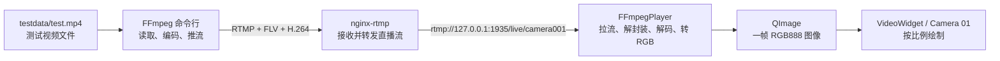
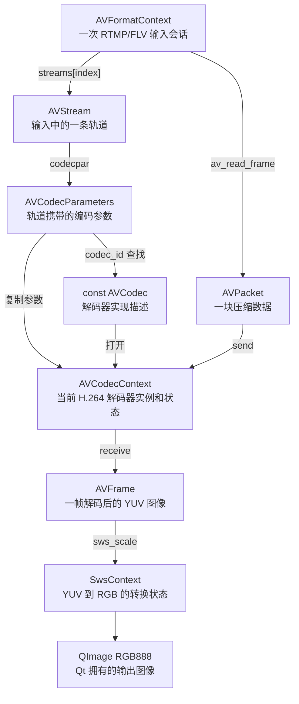
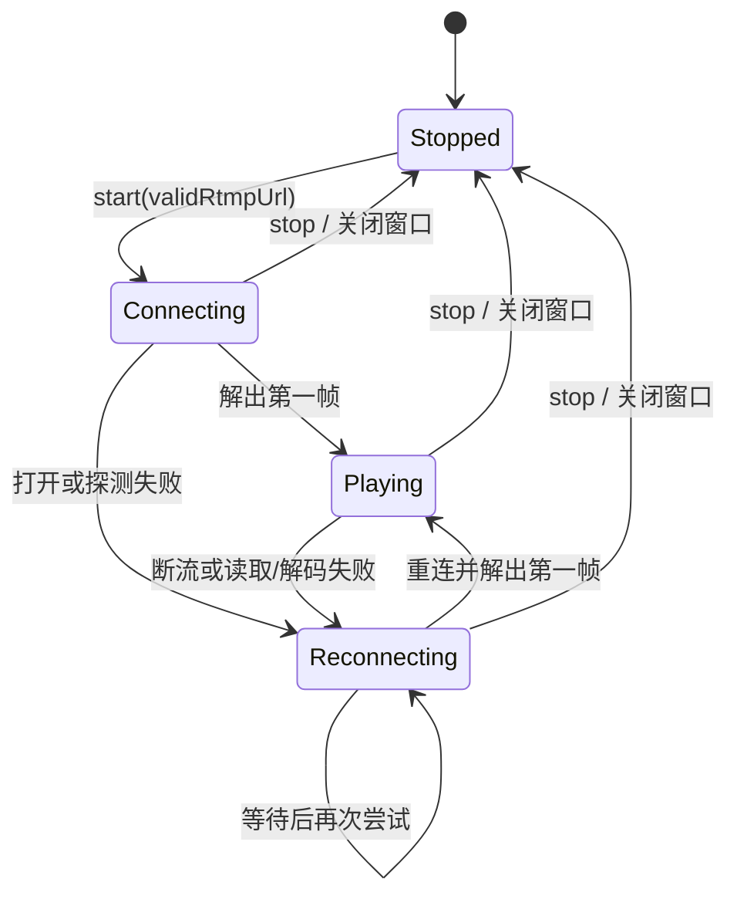
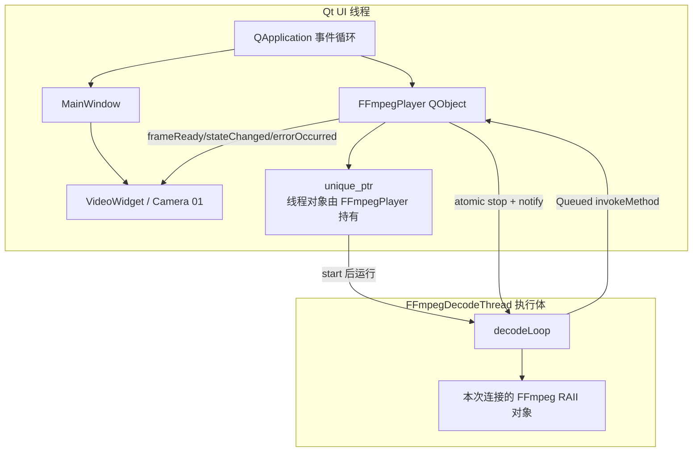
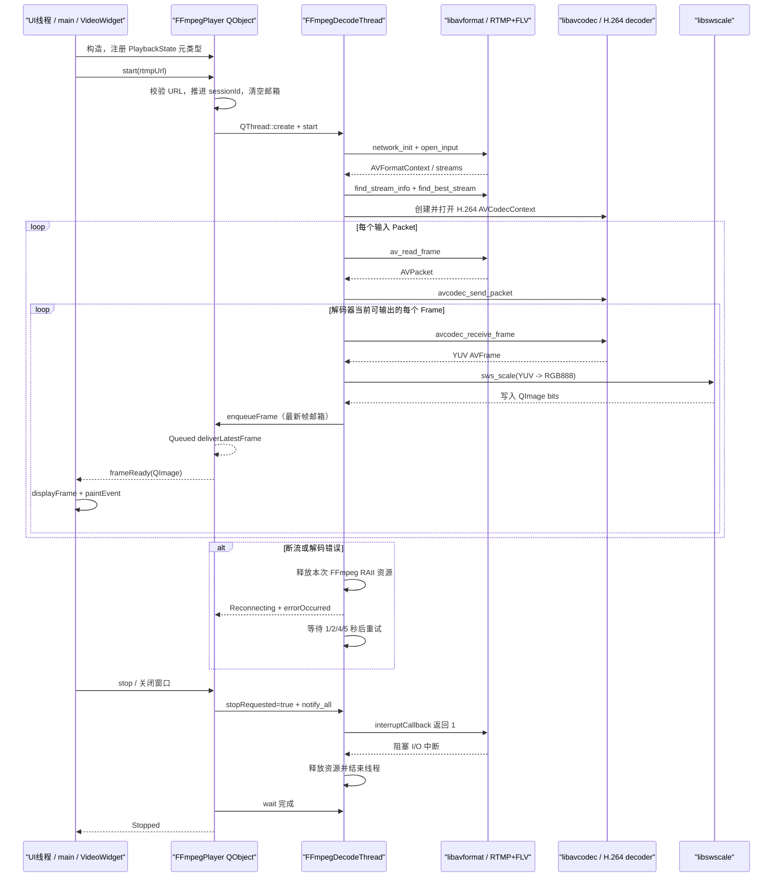

# 第三周：从零理解并测试 FFmpegPlayer

> 历史记录：本文保留当时的实现和命令背景；被退役脚本不应在新环境直接执行。参见[遗留脚本索引](../../archive/legacy_test_scripts.md)。

> 文档分类：Week 3 实现与测试。

## 1. 这份文档解决什么问题

第三周模块完成了一件具体的事情：Qt 程序从一个 RTMP 地址接收 H.264 视频，
使用 FFmpeg 解码成图像，再把图像显示在 `Camera 01` 中。

这份文档面向没有音视频开发经验的读者，建议按下面的顺序阅读：

1. 先照着“手工测试”跑通画面、断流、重连和退出。
2. 再学习如何使用脚本和 CTest 自动检查。
3. 最后从音视频基础概念开始阅读代码实现。

本阶段只播放一路视频，不处理音频、RTMPS、录像、硬件解码和多路播放。
`Camera 02`～`Camera 16` 仍然只是 UI 槽位。

## 2. 先建立完整的链路概念

手工测试时，数据会经过下面这些组件：



可以先把它理解成电视直播：

- MP4 文件是预先录好的节目。
- FFmpeg 命令行是推流设备，负责不断播放这段节目并送出去。
- nginx-rtmp 是电视台的转播服务器。
- `FFmpegPlayer` 是接收机和解码器。
- `VideoWidget` 是屏幕。

### 2.1 四个容易混淆的层次

| 层次 | 本项目使用的技术 | 它解决的问题 | 类比 |
| --- | --- | --- | --- |
| 传输协议 | RTMP | 数据怎样从推流端送到服务器和播放器 | 快递运输规则 |
| 封装格式 | FLV | 怎样把时间戳、视频数据等组织成一条流 | 快递箱及装箱清单 |
| 视频编码 | H.264 | 怎样压缩视频，减少网络带宽 | 把大文件压缩成压缩包 |
| 像素格式 | YUV、RGB888 | 解码后每个像素怎样保存颜色 | 图片内部的颜色排列方式 |

因此，“RTMP 视频”不是一种编码格式。更准确的描述是：项目通过 RTMP
传输 FLV 封装的数据，其中的视频使用 H.264 编码；解码后再转换为 RGB888
供 Qt 显示。

## 3. Windows 手工测试

### 3.1 默认路径和地址

当前机器使用下面的路径：

| 内容 | 默认位置 |
| --- | --- |
| 项目根目录 | `E:\rtmpProject` |
| FFmpeg 命令行 | `E:\DevTools\ffmpeg-8.1.2-full_build\bin` |
| nginx-rtmp | `E:\DevTools\nginx-rtmp` |
| 测试视频 | `E:\rtmpProject\testdata\test.mp4` |
| Debug 程序 | `E:\rtmpProject\out\build-windows-x64\debug\rtmp_monitor.exe` |
| 默认直播地址 | `rtmp://127.0.0.1:1935/live/camera001` |

nginx 配置中的 `listen 1935` 表示监听 RTMP 标准端口；`application live`
对应 URL 中的 `/live`；最后的 `camera001` 是这一路流的名称。

### 3.2 测试前检查

打开 PowerShell，执行：

```powershell
cd E:\rtmpProject

Get-Command ffmpeg, ffplay, ffprobe
Test-Path E:\DevTools\nginx-rtmp\sbin\nginx.exe
Test-Path E:\DevTools\nginx-rtmp\conf\nginx.conf
Test-Path E:\rtmpProject\testdata\test.mp4
Test-Path E:\rtmpProject\out\build-windows-x64\debug\rtmp_monitor.exe
```

三个 `Get-Command` 应指向 E 盘 FFmpeg，四个 `Test-Path` 都应输出 `True`。

还可以检查测试视频是否存在 H.264 视频流：

```powershell
ffprobe -v error `
    -select_streams v:0 `
    -show_entries stream=codec_name,width,height,r_frame_rate,pix_fmt `
    -of default=noprint_wrappers=1 `
    E:\rtmpProject\testdata\test.mp4
```

即使原视频不是 H.264，后面的推流命令也会用 `libx264` 重新编码为 H.264。

如果还没有构建 Debug 程序，请在 Visual Studio Developer PowerShell 中执行：

```powershell
cd E:\rtmpProject
cmake --preset Qt-Debug
cmake --build out/build-windows-x64/debug
```

### 3.3 窗口一：启动 nginx-rtmp

打开第一个 PowerShell：

先检查是否已经有服务器在监听。若下面的命令有输出，说明 nginx 可能已经启动，
不要重复启动；可以直接进入 3.4，或者先按照 3.8 优雅停止旧实例。

```powershell
Get-NetTCPConnection -LocalPort 1935 -State Listen -ErrorAction SilentlyContinue
```

确认没有旧监听后执行：

```powershell
cd E:\DevTools\nginx-rtmp

New-Item -ItemType Directory -Force `
    E:\DevTools\nginx-rtmp\temp\hls\live | Out-Null

.\sbin\nginx.exe -t `
    -p "E:\DevTools\nginx-rtmp" `
    -c "conf\nginx.conf"
```

看到下面两类信息表示配置正确：

```text
syntax is ok
test is successful
```

然后启动服务器：

```powershell
.\sbin\nginx.exe `
    -p "E:\DevTools\nginx-rtmp" `
    -c "conf\nginx.conf"
```

检查 1935 端口：

```powershell
Get-NetTCPConnection -LocalPort 1935 -State Listen
Get-Process nginx
```

Windows 版 nginx 通常会出现一个主进程和一个工作进程，这是正常现象。

### 3.4 窗口二：使用 FFmpeg 循环推流

打开第二个 PowerShell：

```powershell
cd E:\rtmpProject

ffmpeg `
    -re `
    -stream_loop -1 `
    -i E:\rtmpProject\testdata\test.mp4 `
    -c:v libx264 `
    -preset veryfast `
    -tune zerolatency `
    -vf "scale=1280:-2" `
    -r 30 `
    -b:v 2500k `
    -maxrate 2500k `
    -bufsize 5000k `
    -an `
    -f flv `
    rtmp://127.0.0.1:1935/live/camera001
```

关键参数的含义：

| 参数 | 含义 |
| --- | --- |
| `-re` | 按正常播放速度读取文件，不瞬间把整个文件发送完 |
| `-stream_loop -1` | 文件播放结束后从头循环 |
| `-c:v libx264` | 把视频编码为 H.264 |
| `-tune zerolatency` | 减少直播编码缓冲 |
| `scale=1280:-2` | 宽度缩放到 1280，高度按比例计算并保持偶数 |
| `-r 30` | 输出 30 帧每秒 |
| `-an` | 本阶段不推送音频 |
| `-f flv` | 使用适合 RTMP 的 FLV 封装 |

持续出现 `frame=`、`fps=`、`time=` 和 `bitrate=` 表示 FFmpeg 正在推流。
这个窗口必须保持运行。

### 3.5 可选：先用 ffplay 排除服务器问题

如果想先确认 FFmpeg → nginx-rtmp 这一段没有问题，可以在第三个窗口执行：

```powershell
ffplay -fflags nobuffer -flags low_delay -framedrop `
    rtmp://127.0.0.1:1935/live/camera001
```

ffplay 能显示而 Qt 程序不能显示，问题通常在播放器构建、DLL 或 Qt 显示链路；
ffplay 也不能显示，则应先排查 nginx、推流命令和 URL。

关闭 ffplay 或按 `q`，再继续测试 Qt 程序。

### 3.6 窗口三：启动 Qt 播放器

普通 PowerShell 需要让系统能找到 Qt DLL：

```powershell
cd E:\rtmpProject
$env:PATH = "E:\QT6\6.6.1\msvc2019_64\bin;$env:PATH"

.\out\build-windows-x64\debug\rtmp_monitor.exe
```

不传参数时，程序使用默认地址 `camera001`。也可以显式指定：

```powershell
.\out\build-windows-x64\debug\rtmp_monitor.exe `
    --url rtmp://127.0.0.1:1935/live/camera001
```

也可以直接从 Qt Creator 启动，此时 Qt Creator 会为程序配置对应 Kit 的运行环境。

首次连接时，Camera 01 会显示“正在连接 RTMP...”。解出第一帧后状态文字隐藏，
视频按原始宽高比居中绘制；窗口比例与视频不一致时，剩余区域保持黑色。

### 3.7 必须完成的手工验收

#### 正常播放

确认：

- Camera 01 连续显示视频，而不是停在一张图片上。
- 人物和物体没有明显拉伸，画面宽高比正确。
- Camera 02～Camera 16 仍是普通占位窗口。
- 拖拽 Camera 01 或进入全屏时，显示的是同一个视频区域。

#### 停止推流

切换到 FFmpeg 推流窗口，按 `q`。预期结果：

1. Qt 程序不崩溃。
2. 旧画面被清除，视频区域恢复黑色。
3. Camera 01 显示“连接中断，正在重连...”或具体重试信息。
4. 播放器按 1、2、4、5 秒上限退避重试。

清除最后一帧很重要：监控软件如果一直保留旧画面，用户可能误以为画面仍是实时的。

#### 恢复推流

在第二个 PowerShell 中重新执行 3.4 的 FFmpeg 命令，URL 必须保持相同。
预期 Camera 01 自动恢复画面，不需要重启 Qt 程序。

#### 测试安全关闭

分别在下面三种状态关闭 Qt 窗口：

1. 正常播放中。
2. nginx 已启动，但还没有推流，界面正在连接。
3. 停止推流后，界面正在重连。

预期进程在网络超时范围内退出，并且控制台中没有：

```text
QThread: Destroyed while thread is still running
```

也不应出现访问冲突、双重释放或长时间残留的 `rtmp_monitor.exe`。

### 3.8 正确清理测试环境

建议按下面的顺序停止：

1. 关闭 Qt 程序。
2. 在 FFmpeg 窗口按 `q`。
3. 优雅停止 nginx。

```powershell
cd E:\DevTools\nginx-rtmp
.\sbin\nginx.exe `
    -p "E:\DevTools\nginx-rtmp" `
    -c "conf\nginx.conf" `
    -s quit
```

最后检查：

```powershell
Get-Process nginx, ffmpeg, rtmp_monitor -ErrorAction SilentlyContinue
Get-NetTCPConnection -LocalPort 1935 -State Listen -ErrorAction SilentlyContinue
```

没有输出表示进程和端口已经释放。只有在优雅退出失败时，才使用项目脚本的
`-ForceKill`，不要随意结束与本次测试无关的进程。

## 4. 自动化测试

自动化测试分为基础链路脚本、普通 CTest 和真实流集成测试三层。它们覆盖的目标
不同，不能只运行其中一个就认为所有功能都已验证。

### 4.1 使用脚本检查 RTMP 基础链路

在项目根目录执行环境检查：

```powershell
cd E:\rtmpProject
powershell -NoProfile -ExecutionPolicy Bypass `
    -File .\scripts\verify_rtmp_chain.ps1 `
    -Action Check
```

常用动作：

| Action | 行为 |
| --- | --- |
| `Check` | 检查 FFmpeg、测试视频、nginx 模块和配置 |
| `StartServer` | 检查配置并启动 nginx-rtmp |
| `Push` | 在当前窗口循环推送测试视频 |
| `Play` | 使用 ffplay 拉流 |
| `All` | 启动服务器，并另外打开 FFmpeg 推流和 ffplay 窗口 |
| `StopServer` | 尝试优雅停止 nginx，可配合 `-ForceKill` |

一键启动基础链路：

```powershell
powershell -NoProfile -ExecutionPolicy Bypass `
    -File .\scripts\verify_rtmp_chain.ps1 `
    -Action All
```

注意：`All` 打开的是 ffplay，不会启动 `rtmp_monitor.exe`。它证明 FFmpeg、
nginx-rtmp 和 RTMP 地址可用，但不能替代 Qt 播放器测试。

结束后执行：

```powershell
powershell -NoProfile -ExecutionPolicy Bypass `
    -File .\scripts\verify_rtmp_chain.ps1 `
    -Action StopServer `
    -ForceKill
```

### 4.2 Windows Debug 构建和普通 CTest

在 Visual Studio Developer PowerShell 中执行：

```powershell
cd E:\rtmpProject
cmake --preset Qt-Debug
cmake --build out/build-windows-x64/debug
ctest --test-dir out/build-windows-x64/debug --output-on-failure
```

当前包含三个测试目标：

| 测试 | 主要检查内容 |
| --- | --- |
| `rtmp_monitor_ui_smoke_test` | VideoWidget 图像显示、清黑、全屏和 QSS |
| `rtmp_monitor_dynamic_grid_test` | 1～16 路网格、交换和状态互斥 |
| `rtmp_monitor_ffmpeg_player_test` | URL 校验、重复停止、连接失败、重连等待和线程退出 |

普通 CTest 不要求本机一直运行 RTMP 服务。如果没有设置
`RTMP_MONITOR_TEST_URL`，真实流测试会显示 `SKIP`，这不是失败。

### 4.3 Windows Release 构建

```powershell
cmake --preset Qt-Release
cmake --build out/build-windows-x64/release
```

当前机器上曾出现过一个测试驱动环境问题：同一个 CTest 进程连续运行 Release
测试时，首项通过后，后续进程可能在进入测试代码前以 `0xc0000139` 退出；改变
顺序后仍然总是首项通过。三个测试分别运行均能通过，因此遇到此现象时使用：

```powershell
$tests = @(
    "rtmp_monitor_ui_smoke_test",
    "rtmp_monitor_dynamic_grid_test",
    "rtmp_monitor_ffmpeg_player_test"
)

foreach ($test in $tests) {
    ctest --test-dir out/build-windows-x64/release `
        -R "^$test$" `
        --output-on-failure
}
```

不要把真正的断言失败、DLL 缺失或程序崩溃简单归因于这个现象；只有确认各测试
单独通过后，才能判断为连续调度环境问题。

### 4.4 自动验证真实 RTMP 解码

先保持 nginx 和 3.4 的 FFmpeg 推流窗口运行，再打开 Visual Studio Developer
PowerShell：

```powershell
cd E:\rtmpProject
$env:PATH = "E:\QT6\6.6.1\msvc2019_64\bin;$env:PATH"
$env:RTMP_MONITOR_TEST_URL = `
    "rtmp://127.0.0.1:1935/live/camera001"

ctest --test-dir out/build-windows-x64/debug `
    -R "^rtmp_monitor_ffmpeg_player_test$" `
    --output-on-failure

Remove-Item Env:RTMP_MONITOR_TEST_URL
```

设置该环境变量后，`decodesConfiguredLiveStream()` 会真正启动 `FFmpegPlayer`，
等待最多 15 秒，并验证：

- 收到了 `frameReady` 信号。
- `QImage` 不是空图像。
- 图像格式严格为 `QImage::Format_RGB888`。
- 宽度和高度大于 0。
- 测试结束后播放器线程正常停止。

15 秒不是正常播放延迟目标，而是给自动测试预留服务器连接、流探测和等待首个
H.264 关键帧的上限。

### 4.5 Linux ARM64 交叉构建

在 Windows PowerShell 中执行：

```powershell
wsl.exe -d Ubuntu-22.04-New -u root -- bash -lc `
    'cd /mnt/e/rtmpProject && cmake --preset Linux-ARM64-Debug && cmake --build --preset Linux-ARM64-Debug'
```

检查架构和动态依赖：

```powershell
wsl.exe -d Ubuntu-22.04-New -u root -- bash -lc `
    'cd /mnt/e/rtmpProject && file out/build-linux-arm64/debug/rtmp_monitor && aarch64-linux-gnu-readelf -d out/build-linux-arm64/debug/rtmp_monitor | grep NEEDED'
```

产物应为 `ARM aarch64`，并依赖 ARM64 的 `libavformat.so.62`、
`libavcodec.so.62`、`libavutil.so.60` 和 `libswscale.so.9`。

交叉编译只能证明源码能生成 AArch64 ELF，不能证明真实设备上的 QPA、窗口、GPU、
网络和长期播放正常。最终仍需把程序和同 ABI 的 `.so` 部署到 ARM64 设备测试。

## 5. 音视频基础：从“视频文件”到“屏幕像素”

### 5.1 视频其实是一连串图片

视频可以先理解成很多张连续图片。例如 30 FPS 表示每秒显示 30 张图片。每张
图片称为一帧，1920×1080 表示一帧包含 1920 列、1080 行像素。

如果直接保存所有原始像素，数据量会非常大。1920×1080 的 RGB888 一帧大约是：

```text
1920 × 1080 × 3 字节 ≈ 5.93 MB
```

30 FPS 每秒就接近 178 MB。因此网络视频必须使用 H.264 之类的编码器压缩。

### 5.2 编码和解码

- 编码：把原始图像压缩成 H.264 数据，通常发生在摄像头或推流端。
- 解码：把 H.264 数据还原成可以处理的图像帧，发生在播放器中。

H.264 不一定为每一帧保存完整图片。关键帧可以独立解码，其他帧可能只记录与
前后画面的差异。因此播放器刚加入直播时，有时需要等待下一个关键帧才能显示。

### 5.3 AVPacket 和 AVFrame

FFmpeg 使用两个非常重要的结构：

- `AVPacket`：从网络和封装层读取的压缩数据包，里面通常还是 H.264 压缩数据。
- `AVFrame`：解码器输出的一帧原始图像，本项目收到的通常是 YUV。

可以把 Packet 看成压缩包，把 Frame 看成解压后的图片。它们并不保证一一对应：
一个 Packet 可能产生多帧，解码器也可能需要积累多个 Packet 才输出一帧。这就是
代码必须分别调用 `avcodec_send_packet()` 和循环调用
`avcodec_receive_frame()` 的原因。

### 5.4 为什么还要从 YUV 转换到 RGB

视频编码通常使用 YUV，因为它更适合压缩，也能利用人眼对亮度和颜色敏感度的
差异。Qt 的 `QImage::Format_RGB888` 则按红、绿、蓝各一个字节保存像素，适合
直接绘制。

FFmpeg 解码得到 YUV 后，`libswscale` 负责颜色空间和像素格式转换：

```text
H.264 AVPacket
  -> 解码器
YUV AVFrame
  -> sws_scale
RGB888 QImage
  -> QPainter
屏幕画面
```

## 6. FFmpeg 开发库入门：先学会读懂 C API

前面的手工测试使用的是 `ffmpeg.exe` 和 `ffplay.exe`。它们是已经编译好的命令行
程序。`FFmpegPlayer.cpp` 使用的则是 FFmpeg **开发库**：程序直接调用 FFmpeg
提供的 C 函数，并自己管理上下文、指针、错误码和资源生命周期。

这两种方式的关系可以理解为：

```text
ffmpeg.exe
  -> FFmpeg 官方已经写好的完整应用
  -> 通过命令行参数控制

FFmpegPlayer.cpp
  -> 我们自己写应用
  -> 直接调用 libavformat/libavcodec/libavutil/libswscale
```

### 6.1 为什么头文件放在 extern "C" 中

播放器包含 FFmpeg 头文件的代码是：

```cpp
extern "C" {
#include <libavcodec/avcodec.h>
#include <libavformat/avformat.h>
#include <libavutil/error.h>
#include <libswscale/swscale.h>
}
```

FFmpeg 的公开 API 是 C API，而当前源文件由 C++ 编译器编译。C++ 为了支持函数
重载，会对函数名进行 name mangling（名称修饰）；C 编译器不会使用同一套规则。

`extern "C"` 告诉 C++ 编译器：“这些函数使用 C 链接规则”。否则，编译阶段可能
看得到声明，但链接器会寻找一个经过 C++ 修饰的错误函数名，最终报告 unresolved
external symbol。

它不会把整个 C++ 文件变成 C，也不会改变 `FFmpegPlayer` 类；作用范围只有花括号
中的 C 函数声明。

### 6.2 四个 FFmpeg 库怎样合作

| 库 | 头文件前缀 | 本模块实际职责 | 典型对象或函数 |
| --- | --- | --- | --- |
| libavformat | `libavformat/` | 网络协议、FLV 解封装、stream 探测、读取 Packet | `AVFormatContext`、`avformat_open_input()`、`av_read_frame()` |
| libavcodec | `libavcodec/` | 根据 H.264 压缩数据生成原始视频帧 | `AVCodecContext`、`avcodec_send_packet()`、`avcodec_receive_frame()` |
| libavutil | `libavutil/` | 公共数据结构、像素格式、字典、错误处理 | `AVFrame`、`AVDictionary`、`av_strerror()` |
| libswscale | `libswscale/` | 像素格式和图像尺寸转换 | `SwsContext`、`sws_scale()` |

`avformat` 不负责把 H.264 变成图片，它只负责把 RTMP/FLV 中的视频 Packet 找出来；
`avcodec` 不负责把图片画到 Qt，它只负责解码；`swscale` 也不是解码器，它只转换
已经解码出来的像素。

### 6.3 FFmpeg 常见返回值规则

很多 FFmpeg 函数使用整数返回状态：

```text
返回值 >= 0：成功，具体正数含义由函数决定
返回值 < 0 ：失败或特殊控制状态
```

例如：

```cpp
const int status = avformat_find_stream_info(formatContext.value, nullptr);
if (status < 0) {
    // 失败
}
```

负数不是可直接阅读的文字。当前项目使用 `av_strerror()` 转换：

```cpp
QString ffmpegError(int errorCode)
{
    std::array<char, AV_ERROR_MAX_STRING_SIZE> buffer {};
    if (av_strerror(errorCode, buffer.data(), buffer.size()) < 0) {
        return QStringLiteral("未知 FFmpeg 错误 (%1)").arg(errorCode);
    }
    return QString::fromUtf8(buffer.data());
}
```

这里的步骤是：

1. 准备一个固定大小的字符数组 `buffer`。
2. 把 FFmpeg 错误码交给 `av_strerror()`。
3. FFmpeg 把可读错误写进字符数组。
4. 将 UTF-8 C 字符串转换为 `QString`。

### 6.4 EAGAIN 和 EOF 为什么不总是错误

解码器使用“发送输入、接收输出”模型，所以两个负数状态需要单独理解：

| 状态 | 在 receive 端的含义 | 本模块的处理 |
| --- | --- | --- |
| `AVERROR(EAGAIN)` | 当前没有更多 Frame；需要送入更多 Packet | 正常返回读取循环 |
| `AVERROR_EOF` | 解码器已经完全结束，不会再产生 Frame | 正常结束本轮接收 |
| 其他负数 | 真正的解码错误 | 转成文字并结束本次连接 |

`EAGAIN` 的英文是“try again”。它不是“网络重连”的 retry，而是解码器内部状态机
在说：“现在这个方向暂时不能继续，请先处理另一边”。

当 `avcodec_send_packet()` 返回 EAGAIN 时，表示解码器还有输出没有取走，代码先
调用 `receiveFrames()` 排空输出，再重新发送同一个 Packet。

### 6.5 裸指针、二级指针和 nullptr

FFmpeg 是 C API，很多对象通过指针表示：

```cpp
AVFormatContext *context = nullptr;
```

- `AVFormatContext` 是对象类型。
- `AVFormatContext *` 是指向对象的指针。
- `nullptr` 表示当前没有指向有效对象。

有些释放函数接收二级指针，例如：

```cpp
avcodec_free_context(&context);
```

假设 `context` 的类型是 `AVCodecContext *`，那么 `&context` 的类型就是
`AVCodecContext **`。FFmpeg 不仅需要释放对象，还会把调用者手中的指针改成空，
降低释放后继续误用悬空指针的风险。

同样，`avformat_open_input()` 的第一个参数是 `AVFormatContext **`：函数可能需要
创建、替换或在失败时清理上下文，所以需要修改调用者保存的指针。

### 6.6 alloc、open、unref、free、close 的区别

这些词看起来相似，但生命周期层级不同：

| 操作 | 含义 | 例子 |
| --- | --- | --- |
| `alloc` | 分配一个可以反复使用的对象壳和内部状态 | `av_packet_alloc()` |
| `open` | 根据参数真正打开网络输入或初始化解码器 | `avformat_open_input()`、`avcodec_open2()` |
| `unref` | 清除本轮承载的数据，但保留对象本身供下一轮复用 | `av_packet_unref()`、`av_frame_unref()` |
| `free` | 销毁对象并释放其内存 | `av_packet_free()`、`av_frame_free()` |
| `close_input` | 关闭输入并释放 format context | `avformat_close_input()` |

循环内需要的是 `unref`，循环结束需要的是 `free`。如果每读一个 Packet 就 free，
下一轮必须重新 alloc；如果只 unref 却从不 free，程序退出时会泄漏对象本身。

### 6.7 FFmpeg 对象关系图



### 6.8 AVFormatContext：一次输入会话的总管

`AVFormatContext` 代表已经打开或即将打开的一次媒体输入。当前项目中，它保存：

- RTMP/底层 I/O 状态。
- FLV 解封装器状态。
- 输入包含的 `streams` 数组。
- 每条 stream 的时间基和编码参数。
- `interrupt_callback`。

它不是一个视频帧，也不是解码器。`av_read_frame(formatContext, packet)` 通过它读取
“下一块已解封装的压缩数据”。

资源拥有者是一次 `decodeAttempt`。离开本次尝试时，`FormatContextHandle` 析构并
调用 `avformat_close_input()`，同时关闭网络和解封装状态。

### 6.9 AVStream 与 stream_index

一个 FLV 输入可以有视频和音频。FFmpeg 为每条轨道建立 `AVStream`：

```text
streams[0] -> 可能是 H.264 视频
streams[1] -> 可能是 AAC 音频
```

`av_find_best_stream()` 返回选中视频流的整数下标 `videoStreamIndex`。以后每个
Packet 都带有 `packet->stream_index`，只有它等于 `videoStreamIndex` 才送入视频
解码器。

当前推流命令使用 `-an`，通常没有音频；代码仍然保留 stream 筛选，因为真实设备
以后很可能同时发送音频或其他数据。

### 6.10 AVCodecParameters 与 AVCodecContext

这两个名字很像，但职责不同：

- `AVCodecParameters` 是解封装器从 stream 中读到的静态描述，例如 codec id、宽高
  和额外编码数据。它属于 `AVStream`，播放器不负责释放。
- `AVCodecContext` 是真正工作的解码器实例，包含参数、缓存、参考帧和运行状态。
  它由播放器创建并释放。

代码通过：

```cpp
avcodec_parameters_to_context(codecContext.get(), codecParameters);
```

把 stream 的参数复制到解码器上下文。不能把 `codecpar` 直接当作解码器使用。

`const AVCodec *decoder` 则是“某一种解码器实现的描述”，例如 FFmpeg 内置 H.264
decoder。它由 FFmpeg 全局管理，当前代码只借用这个指针，不释放它。

### 6.11 AVPacket：可复用的压缩数据容器

`AVPacket` 保存本次读取的压缩数据和附加信息，常见字段包括：

- `data` 和 `size`：压缩字节。
- `stream_index`：属于哪一条 stream。
- `pts/dts`：时间戳。

当前代码只分配一个 Packet 对象：

```cpp
PacketPtr packet(av_packet_alloc());
```

每次 `av_read_frame()` 往同一个对象填入新数据；处理结束后
`av_packet_unref(packet.get())` 释放本轮引用的数据，让对象回到可复用状态。

### 6.12 AVFrame：可复用的解码输出容器

`AVFrame` 不一定只用于视频，但在本模块中代表一帧解码后的图像。代码实际读取：

| 字段 | 含义 |
| --- | --- |
| `width/height` | 图像尺寸 |
| `format` | FFmpeg 的像素格式编号 |
| `data[0..]` | 各个像素平面的起始地址 |
| `linesize[0..]` | 各平面一行在内存中占多少字节 |

YUV420P 一般使用三个平面：Y、U、V 分开保存，所以不能假设所有像素都连续放在
`data[0]`。`sws_scale()` 正是通过 `data` 和 `linesize` 数组理解这些平面。

每次转换完调用 `av_frame_unref()`，释放解码器交给这次 Frame 的缓冲引用，同时
保留 AVFrame 对象供下一次 `receive_frame()` 使用。

### 6.13 data 与 linesize：为什么“一行字节数”不一定等于宽度

为了 SIMD、CPU 对齐和不同像素格式，图像内存每行末尾可能有 padding。比如 RGB888
理论上一行是 `width × 3` 字节，但 QImage 可能把行跨度对齐到更适合访问的边界。

因此代码不能自己假设紧密排列，而要分别传入：

```cpp
destinationData[0] = image.bits();
destinationLinesize[0] = static_cast<int>(image.bytesPerLine());
```

源 Frame 也必须使用 FFmpeg 给出的 `frame->data` 和 `frame->linesize`。如果忽略
linesize，常见结果是画面倾斜、花屏、颜色错位或越界访问。

### 6.14 AVDictionary：给输入模块传字符串选项

FFmpeg 的不同协议和 demuxer 支持大量可选参数，C API 使用 `AVDictionary` 传递：

```cpp
av_dict_set(&inputOptions.value, "rtmp_live", "live", 0);
av_dict_set(&inputOptions.value, "rw_timeout", "3000000", 0);
```

key 和 value 都是 C 字符串。`rw_timeout` 使用微秒，所以 3,000,000 表示约 3 秒。
字典只用于打开输入，本次尝试结束时由 `av_dict_free()` 释放。

### 6.15 SwsContext：保存像素转换配置

`SwsContext` 保存源尺寸、源像素格式、目标尺寸、目标格式和缩放算法等状态。
创建这些状态有成本，所以代码使用 `sws_getCachedContext()`：

- 条件没变：复用已有 context。
- 宽高或像素格式变了：更新或重建 context。
- 返回空：转换上下文创建失败。

最后由 `sws_freeContext()` 释放。

### 6.16 本模块的资源所有权总表

| 对象 | 谁创建/取得 | 谁拥有 | 何时清空本轮数据 | 最终释放 |
| --- | --- | --- | --- | --- |
| `AVFormatContext` | `avformat_alloc_context/open_input` | `FormatContextHandle` | 不适用 | `avformat_close_input` |
| `AVStream` | format context 提供 | format context | 不适用 | 随 format context |
| `AVCodecParameters` | stream 提供 | stream | 不适用 | 随 stream |
| `const AVCodec` | FFmpeg 查找返回 | FFmpeg 全局 | 不适用 | 当前代码不释放 |
| `AVCodecContext` | `avcodec_alloc_context3` | `CodecContextPtr` | 解码器内部管理 | `avcodec_free_context` |
| `AVPacket` | `av_packet_alloc` | `PacketPtr` | `av_packet_unref` | `av_packet_free` |
| `AVFrame` | `av_frame_alloc` | `FramePtr` | `av_frame_unref` | `av_frame_free` |
| `AVDictionary` | `av_dict_set` 间接分配 | `DictionaryHandle` | 不适用 | `av_dict_free` |
| `SwsContext` | `sws_getCachedContext` | `SwsContextHandle` | 不适用 | `sws_freeContext` |
| RGB `QImage` | QImage 构造函数 | Qt 隐式共享对象 | 邮箱覆盖/局部析构 | 引用计数归零 |

掌握这张表后，再读错误分支会容易很多：无论在哪个 `return` 离开
`decodeAttempt`，局部 RAII 对象都会按创建的相反顺序析构。

### 6.17 FFmpegPlayer.cpp 开头的辅助代码

FFmpeg 头文件下面有：

```cpp
namespace {
    // 常量、辅助函数和 RAII 类型
}
```

没有名字的 namespace 称为匿名命名空间。里面的名字只在当前 `.cpp` 翻译单元可见，
不会成为 FFmpegPlayer 对外接口，也不会和其他源文件的同名 helper 冲突。

#### 两组常量

```cpp
constexpr int kNetworkTimeoutMicroseconds = 3'000'000;
constexpr std::array<int, 4> kReconnectDelaysMs {
    1'000, 2'000, 4'000, 5'000
};
```

`constexpr` 表示值在编译期确定。单引号只是 C++ 数字分隔符，不改变数值；
`3'000'000` 就是 3000000。

#### ffmpegError

`ffmpegError(int)` 集中完成“负数 FFmpeg error code → QString”。这样每个失败分支
只需要写自己的上下文，例如“打开 RTMP 输入失败”，不用重复字符数组处理。

#### 六种 RAII helper

```text
FormatContextHandle  -> 自己的析构函数调用 avformat_close_input
CodecContextDeleter  -> 给 unique_ptr 调 avcodec_free_context
PacketDeleter        -> 给 unique_ptr 调 av_packet_free
FrameDeleter         -> 给 unique_ptr 调 av_frame_free
DictionaryHandle     -> 自己的析构函数调用 av_dict_free
SwsContextHandle     -> 自己的析构函数调用 sws_freeContext
```

为什么 format/dictionary 使用带 `value` 字段的 struct，而 codec/packet/frame 使用
`unique_ptr + deleter`？两种方式都能实现 RAII，只是 FFmpeg 各释放函数签名不同。
像 `avformat_close_input(&pointer)`、`av_dict_free(&pointer)` 需要方便地传二级指针；
unique_ptr 自定义 deleter 内部也可以取得局部指针再传地址。

类型别名：

```cpp
using CodecContextPtr =
    std::unique_ptr<AVCodecContext, CodecContextDeleter>;
```

让后续声明保持简短，同时把“这个裸 C 指针由谁释放”写进类型本身。

#### DecodeAttemptResult

这个小 struct 是一次连接尝试返回给重连外层的结果：

```cpp
struct DecodeAttemptResult
{
    bool decodedFrame = false;
    QString errorMessage;
};
```

不用异常抛出，而是把“是否曾成功出帧”和“最后错误”一起返回。外层据此决定退避
是否归零、是否显示错误，以及是否继续等待重连。

## 7. FFmpegPlayer 类逐项拆解

### 7.1 阅读源码的入口

阅读本章时可以同时打开下面几个文件：

- [`src/main.cpp`](../../../../../src/main.cpp)：应用入口和对象组合。
- [`FFmpegPlayer.h`](../../../../../include/common/media/FFmpegPlayer.h)：播放器类的完整声明。
- [`FFmpegPlayer.cpp`](../../../../../src/common/media/FFmpegPlayer.cpp)：拉流、解码、重连和退出实现。
- [`VideoWidget.cpp`](../../../../../src/common/ui/VideoWidget.cpp)：QImage 显示和比例绘制。
- [`CMakeLists.txt`](../../../../../CMakeLists.txt)：FFmpeg 链接及 DLL 部署。
- [`FFmpegPlayerLifecycleTest.cpp`](../../../../../tests/FFmpegPlayerLifecycleTest.cpp)：生命周期和真实流测试。

建议先读 `.h` 文件，弄清类对外能做什么、内部保存什么；再读 `.cpp` 文件跟踪这些
成员怎样协作。

### 7.2 类声明第一行是什么意思

```cpp
class FFmpegPlayer final : public QObject
{
    Q_OBJECT
```

逐项解释：

- `class FFmpegPlayer`：定义一个名为 FFmpegPlayer 的 C++ 类。
- `: public QObject`：公开继承 Qt 的 QObject，因此具有父子生命周期、线程归属、
  信号槽和元对象能力。
- `final`：禁止再从 FFmpegPlayer 派生子类。当前实现包含严格的线程和资源不变量，
  避免子类覆盖行为破坏停止顺序。
- `Q_OBJECT`：让 Qt 的 moc 生成元对象代码，使 signals、`Q_ENUM`、类型信息等功能
  可用。它不是普通 C++ 关键字，而是 Qt 宏。

这里要区分“对象所在线程”和“对象内部创建的工作线程”：

- `FFmpegPlayer player;` 在 `main()` 中创建，所以播放器 QObject 属于 UI 线程。
- `decodeThread_` 是播放器持有的另一个 QThread，真正执行阻塞解码循环。
- 把播放器移入工作线程和让播放器内部持有工作线程是两种不同设计。本项目采用后者。

### 7.3 构造函数、析构函数和禁止复制

```cpp
explicit FFmpegPlayer(QObject *parent = nullptr);
~FFmpegPlayer() override;

FFmpegPlayer(const FFmpegPlayer &) = delete;
FFmpegPlayer &operator=(const FFmpegPlayer &) = delete;
FFmpegPlayer(FFmpegPlayer &&) = delete;
FFmpegPlayer &operator=(FFmpegPlayer &&) = delete;
```

`explicit` 防止编译器把一个 `QObject *` 意外隐式转换成 FFmpegPlayer。

析构函数标记 `override`，说明它覆盖 QObject 的虚析构函数。实现只有一行
`stop()`，但这一行非常重要：即使上层忘记显式停止，析构时仍会请求线程退出并
等待资源释放。

复制和移动全部删除，因为对象内部包含：

- QObject 的身份和线程归属。
- 一个正在运行的 QThread。
- mutex、condition variable 和原子变量。
- 只应由一个播放器拥有的连接状态。

这些东西不存在安全、明确的“复制一份播放器”语义。其实 QObject 本身也不可复制，
这里显式列出可以让类的使用约束更醒目。

### 7.4 PlaybackState 与 Qt 元对象系统

```cpp
enum class PlaybackState {
    Stopped,
    Connecting,
    Playing,
    Reconnecting,
};
Q_ENUM(PlaybackState)
```

`enum class` 是强类型枚举，使用时必须写
`FFmpegPlayer::PlaybackState::Playing`，不会和其他整数或枚举混用。

四个状态含义：

| 状态 | 精确定义 |
| --- | --- |
| `Stopped` | 没有有效播放会话，或停止流程已经完成 |
| `Connecting` | 第一次尝试打开并探测 RTMP 输入 |
| `Playing` | 当前会话至少成功解出过一帧 |
| `Reconnecting` | 连接/读取/解码失败后正在等待或再次尝试 |

`Q_ENUM` 把枚举放入 FFmpegPlayer 的元对象，可用于 Qt 反射、调试和 QVariant。
类外还有：

```cpp
Q_DECLARE_METATYPE(FFmpegPlayer::PlaybackState)
```

它告诉 Qt 元类型系统这个 C++ 类型可以由 QVariant 和排队连接携带。构造函数又执行：

```cpp
qRegisterMetaType<FFmpegPlayer::PlaybackState>();
```

这是运行时注册。当前使用 lambda 投递状态，但测试中的 `QSignalSpy` 也需要把信号
参数放入 QVariant，因此注册仍有价值。

播放状态机如下：



### 7.5 三个公共成员函数

#### start

```cpp
bool start(const QString &rtmpUrl);
```

- 输入：用户指定的 URL 字符串。
- 输出：`true` 只表示 URL 合法且线程成功启动，不表示已经连接或已经有画面。
- 调用线程：必须是 FFmpegPlayer 所属线程，也就是当前 UI 线程。
- 失败情况：已经运行，或 URL 不是合法的 `rtmp://` 地址。

网络连接结果是异步到来的，所以不能把 `start()` 的 bool 当成播放成功。

#### stop

```cpp
void stop();
```

- 输入/返回值：没有。
- 调用线程：UI 线程。
- 行为：设置停止标志、唤醒重连、等待工作线程结束、清空邮箱、使旧 session 失效。
- 幂等性：没有启动时调用、连续调用多次都安全。

它是同步等待函数，但工作线程通过中断回调和条件变量尽快响应，因此不会故意等待
完整的重连退避时间。

#### isRunning

```cpp
[[nodiscard]] bool isRunning() const noexcept;
```

- `[[nodiscard]]`：提醒调用者不要无意忽略查询结果。
- `const`：函数不改变可观察的播放器状态。
- `noexcept`：承诺不抛出 C++ 异常。
- 返回条件：`decodeThread_` 存在并且 `QThread::isRunning()` 为 true。

### 7.6 三个信号

```cpp
void frameReady(const QImage &image);
void stateChanged(FFmpegPlayer::PlaybackState state);
void errorOccurred(const QString &message);
```

| 信号 | 谁最终发出 | 接收者 | 设计重点 |
| --- | --- | --- | --- |
| `frameReady` | UI 线程中的 `deliverLatestFrame()` | Camera 01 | QImage 已独立于 AVFrame 生命周期 |
| `stateChanged` | UI 线程中的 `setStateOnOwnerThread()` | 状态显示 lambda | 相同状态不会重复发送 |
| `errorOccurred` | 排队回 UI 线程的 lambda | 状态显示 lambda/测试 | 不包含完整 URL，避免泄露凭据 |

虽然解码在线程中运行，公开信号仍安排到播放器所属的 UI 线程发出。这使接收方能
直接更新 QWidget，也让类的线程契约更容易理解。

### 7.7 八个私有成员函数

| 函数 | 执行线程 | 输入 | 责任 |
| --- | --- | --- | --- |
| `decodeLoop(QString, uint64_t)` | 解码线程 | URL、session id | FFmpeg 网络初始化、单次连接、重连总循环 |
| `enqueueFrame(QImage, uint64_t)` | 解码线程 | RGB 图像、session id | 覆盖邮箱并按需安排一次 UI 投递 |
| `deliverLatestFrame(uint64_t)` | UI 线程 | session id | 取走邮箱最新帧并发出 `frameReady` |
| `postState(PlaybackState, uint64_t)` | 解码线程调用，UI 执行 lambda | 状态、session id | 安全投递状态并过滤旧 session |
| `postError(QString, uint64_t)` | 解码线程调用，UI 执行 lambda | 错误、session id | 安全投递错误并过滤旧 session |
| `setStateOnOwnerThread(PlaybackState)` | UI 线程 | 新状态 | 去重并发出 `stateChanged` |
| `waitForReconnect(int)` | 解码线程 | 毫秒延迟 | 可被 stop 唤醒的退避等待 |
| `interruptCallback(void *)` | FFmpeg 网络调用所在的解码线程 | opaque 指针 | 让 FFmpeg 查询是否应中断阻塞 I/O |

`interruptCallback` 必须是 `static`，因为 C API 只接受普通函数指针，不能直接接受
带隐藏 `this` 参数的非静态成员函数。播放器地址通过 `void *opaque` 另外传入。


### 7.8 所有成员变量逐项说明

| 成员 | 主要访问线程 | 保护方式 | 含义和不变量 |
| --- | --- | --- | --- |
| `decodeThread_` | UI | 只允许 UI 访问 | 空表示没有线程对象；非空时由唯一 FFmpegPlayer 拥有 |
| `stopRequested_` | UI 写，解码线程读 | atomic | true 后当前会话只能走向退出，下一次 start 才重置 false |
| `sessionId_` | UI 推进，两线程读取 | atomic | 单调递增；排队任务的 id 必须等于当前值才有效 |
| `reconnectMutex_` | UI/解码 | mutex | 只用于配合重连条件变量，不保护 FFmpeg 对象 |
| `reconnectCondition_` | UI 通知，解码等待 | condition variable | stop 必须能立即唤醒退避等待 |
| `frameMutex_` | UI/解码 | mutex | 保护下面的 `pendingFrame_` 和 `frameDeliveryScheduled_` |
| `pendingFrame_` | 两线程 | `frameMutex_` | 邮箱最多保存一张最新图像，允许新帧覆盖旧帧 |
| `frameDeliveryScheduled_` | 两线程 | `frameMutex_` | true 表示已经有一次 UI 投递在途，不能重复无限排队 |
| `state_` | UI | UI 线程串行访问 | 保存最后已公开状态，相同状态不重复发信号 |

为什么 `decodeThread_` 和 `state_` 没有 mutex？因为类通过
`Q_ASSERT(QThread::currentThread() == thread())` 规定相关公共操作只能在对象所属
线程调用；单线程串行访问本身就是保护。跨线程共享的数据才使用 atomic 或 mutex。

### 7.9 atomic、mutex 和 condition_variable 各解决什么

三种同步工具不能互相随意替代：

- `std::atomic_bool`：适合 stop 这种很小、频繁读取的标志，不需要锁整个对象。
- `std::mutex`：保护需要作为一个整体保持一致的多步操作，例如同时更新邮箱图像和
  “是否已安排投递”的布尔值。
- `std::condition_variable`：让线程睡眠等待事件，并能被另一个线程主动唤醒；比每隔
  几毫秒轮询 stop 标志更高效。

`std::memory_order_release/acquire` 建立跨线程可见性：UI 线程 release 写入停止或
session 变化，工作线程 acquire 读取后能看到该写入之前的相关状态。初学阶段可以
把它理解为“明确告诉 CPU 和编译器，这不是只在当前线程内部使用的普通变量”。

### 7.10 对象和线程所有权图



QThread 对象本身在 UI 线程被创建和持有，但它管理的执行体在工作线程运行。这也是
为什么“QThread 对象在哪个线程”和“QThread 启动的代码在哪个线程”不能混为一谈。

### 7.11 类必须始终保持的核心不变量

阅读实现时，可以持续检查下面几条规则：

1. FFmpeg 上下文、Packet、Frame 和 SwsContext 只在解码线程创建和使用。
2. QWidget 只在 UI 线程更新。
3. `decodeThread_` 只在 UI 线程读取、等待和销毁。
4. 邮箱两个字段永远在持有 `frameMutex_` 时一起检查和修改。
5. 公开的排队任务必须比较 session id，旧会话不能更新新会话。
6. `stop()` 返回时内部线程已经结束，不允许“让线程自己以后再退出”。
7. 任意连接错误都先释放本次 FFmpeg 资源，再等待重连。

## 8. 按一次真实播放会话理解完整执行顺序

这一章不再按“函数清单”讲解，而是把程序从启动到关闭按时间顺序走一遍。每一步
都要回答五个问题：输入是什么、输出是什么、在哪个线程、谁拥有资源、失败后去哪。

### 8.1 先看完整时序图



### 8.2 第一步：main.cpp 创建对象并绑定 Camera 01

程序入口先使用 `QCommandLineParser` 定义 `--url`，默认值是 `camera001`。然后：

1. 创建 `MainWindow`。
2. 创建一个 `FFmpegPlayer`。
3. 通过 `primaryVideoWidget()` 获取 Camera 01。
4. 把 `frameReady` 连接到 `VideoWidget::displayFrame()`。
5. 把状态和错误信号连接到状态文字及 `clearFrame()`。
6. 显示窗口后调用 `player.start(url)`。
7. Qt 事件循环结束后调用 `player.stop()`。

UI 类不主动创建网络连接，因此 `MainWindow` 和 `VideoWidget` 仍能独立进行纯 UI
测试。

关键连接是：

```cpp
QObject::connect(
    &player, &FFmpegPlayer::frameReady,
    primaryVideoWidget, &VideoWidget::displayFrame
);
```

执行卡片：

| 项目 | 内容 |
| --- | --- |
| 输入 | 命令行 `--url`；缺省时使用 `camera001` |
| 输出 | 一个 UI 线程播放器对象，以及三组信号槽连接 |
| 线程 | UI 线程 |
| 所有权 | `mainWindow` 和 `player` 都是 main 栈对象；离开 main 时自动析构 |
| 失败 | Camera 01 不存在时不启动；URL 不合法时 start 返回 false 并发错误信号 |

状态连接中的 `Connecting/Reconnecting` 会先调用 `clearFrame()`，这解释了为什么
断流时旧画面立即变黑。`Playing` 先显示“正在缓冲视频帧...”，第一张
`frameReady` 到达后 `displayFrame()` 隐藏状态标签。

### 8.3 第二步：构造 FFmpegPlayer

```cpp
FFmpegPlayer::FFmpegPlayer(QObject *parent)
    : QObject(parent)
{
    qRegisterMetaType<FFmpegPlayer::PlaybackState>();
}
```

此时没有网络、没有线程，也没有分配 FFmpeg context。成员使用类内默认值：

```text
decodeThread_ = nullptr
stopRequested_ = false
sessionId_ = 0
pendingFrame_ = null QImage
frameDeliveryScheduled_ = false
state_ = Stopped
```

构造函数只建立 QObject 身份并注册枚举类型。把耗时连接放在 `start()` 而不是构造
函数中，可以让对象安全创建、连接信号槽后再明确启动，也方便测试未启动的 stop。

| 项目 | 内容 |
| --- | --- |
| 输入 | 可选 QObject parent；main 中没有传 parent |
| 输出 | 状态为 Stopped 的播放器对象 |
| 线程 | UI 线程，QObject 的 thread affinity 在这里确定 |
| 所有权 | main 栈变量拥有播放器 |
| 失败 | 本步骤没有 FFmpeg I/O；元类型注册不需要调用者处理返回值 |

### 8.4 第三步：start 检查线程、运行状态和 URL

`start()` 只接受合法的 `rtmp://` 地址。播放器已经运行时再次调用会被拒绝，避免
两个解码循环共享同一对象。

通过校验后，它会：

- 清除上一次待投递的帧。
- 重置原子停止标记。
- 生成新的 session id。
- 使用 `QThread::create()` 创建专用线程。
- 在线程中执行 `decodeLoop()`。

网络读取和视频解码可能阻塞或消耗较多 CPU。如果把它们放在 UI 线程，Qt 无法
及时处理鼠标、绘制和关闭事件，窗口就会“未响应”。

Qt 规定 QWidget 及其子类只能在 UI 线程操作，所以工作线程不能直接调用
`VideoWidget::displayFrame()`。它只能把图像安全地投递回播放器所属的 UI 线程。

先看第一行：

```cpp
Q_ASSERT(QThread::currentThread() == thread());
```

- `QThread::currentThread()`：当前正在执行 `start()` 的线程。
- `thread()`：这个 QObject 所属的线程。
- 两者必须相同，否则 Debug 构建立即暴露错误调用。

接着检查：

```cpp
if (isRunning()) {
    emit errorOccurred(tr("播放器已经在运行。"));
    return false;
}
```

禁止重复 start，避免两个 worker 同时写同一个邮箱、状态和停止标志。

如果 `decodeThread_` 还保存着一个已经结束但尚未销毁的线程对象，代码先
`wait()` 再 `reset()`。`wait()` 对已经结束的线程会很快返回；`reset()` 销毁
QThread 对象本身。

URL 使用 `QUrl::StrictMode` 解析，并同时检查：

```text
QUrl 本身有效
scheme 等于 rtmp（大小写不敏感）
host 非空
path 非空
```

所以空字符串、HTTP URL 和 `rtmp:///live/camera001` 都会被拒绝。这里只支持
`rtmp://`，不会把 `rtmps://` 默默降级。

| 项目 | 内容 |
| --- | --- |
| 输入 | `QString rtmpUrl` |
| 输出 | 检查失败返回 false；通过后继续创建会话 |
| 线程 | UI 线程 |
| 所有权 | 此时仍没有新 FFmpeg 资源 |
| 失败 | 发出可读错误，状态保持/恢复 Stopped，不创建工作线程 |

### 8.5 第四步：建立新 session、清空邮箱并启动 QThread

URL 通过后：

```cpp
stopRequested_.store(false, std::memory_order_release);
const std::uint64_t newSessionId =
    sessionId_.fetch_add(1, std::memory_order_acq_rel) + 1;
```

`fetch_add(1)` 返回增加前的值，所以还要 `+ 1` 得到本次实际 id。这个 id 被 lambda
按值捕获，之后不会因为全局 `sessionId_` 改变而自行变化。

清空邮箱必须持锁：

```cpp
{
    const std::lock_guard<std::mutex> lock(frameMutex_);
    pendingFrame_ = QImage();
    frameDeliveryScheduled_ = false;
}
```

花括号故意缩短锁的作用域。离开花括号时 `lock_guard` 析构并自动解锁，创建/启动
线程时不持有 `frameMutex_`。

线程创建：

```cpp
decodeThread_.reset(QThread::create(
    [this, rtmpUrl, newSessionId] {
        decodeLoop(rtmpUrl, newSessionId);
    }
));
decodeThread_->setObjectName(QStringLiteral("FFmpegDecodeThread"));
decodeThread_->start();
```

lambda 捕获：

- `this`：允许调用当前播放器的私有方法和成员。
- `rtmpUrl`：按值复制，调用者原字符串销毁后仍有效。
- `newSessionId`：按值复制，固定属于本次播放。

`QThread::create()` 只创建线程对象；真正的 lambda 在 `start()` 后才在新线程执行。
线程名便于调试器和日志识别。

| 项目 | 内容 |
| --- | --- |
| 输入 | 已验证 URL、新 session id |
| 输出 | `decodeThread_` 非空并开始运行；`start()` 返回 true |
| 线程 | 创建动作在 UI；lambda 执行在 FFmpegDecodeThread |
| 所有权 | `unique_ptr<QThread>` 独占 QThread；lambda只借用 this，因此析构前必须 wait |
| 失败 | 当前代码假设 QThread 创建成功；连接错误会在 worker 中异步上报 |

再次强调：`start()` 返回 true 只表示工作线程已启动。此刻可能还没有连接到 nginx，
更没有解出第一帧。

### 8.6 第五步：decodeLoop 初始化网络并搭建重连外层

工作线程进入：

```cpp
void FFmpegPlayer::decodeLoop(QString rtmpUrl, std::uint64_t sessionId)
```

两个参数都是按值传入，属于这次 worker。第一步调用：

```cpp
if (avformat_network_init() < 0) {
    postError(tr("FFmpeg 网络模块初始化失败。"), sessionId);
    postState(PlaybackState::Stopped, sessionId);
    return;
}
```

然后 URL 转为 UTF-8 `QByteArray encodedUrl`，因为 FFmpeg C API 接收 `const char *`，
不认识 QString 的 UTF-16 内存。

外层状态变量：

```cpp
int reconnectDelayIndex = 0;
bool firstAttempt = true;
```

- index 0 对应 1 秒。
- firstAttempt 决定第一次发 Connecting，后续发 Reconnecting。

函数内部定义 `decodeAttempt` lambda，表示“一次从打开输入到断流/失败返回的完整
会话”。外层 while 负责反复调用它，内层 lambda 负责一次连接。这样一次失败后，
所有局部 FFmpeg 对象可以先析构，再进入下一次尝试，不会复用脏上下文。

| 项目 | 内容 |
| --- | --- |
| 输入 | URL 和固定 session id |
| 输出 | 成功时持续产帧；失败时进入重连；停止时退出线程 |
| 线程 | FFmpegDecodeThread |
| 所有权 | encodedUrl 和重连计数属于 decodeLoop 栈帧 |
| 失败 | 网络模块初始化失败时排队发错并结束；其他失败由 decodeAttempt 返回 |

### 8.7 第六步：decodeAttempt 创建输入上下文和打开选项

每次连接尝试都会创建独立的一组 FFmpeg 资源：

1. `avformat_alloc_context()` 创建输入上下文。
2. 安装 `AVIOInterruptCB`，允许 `stop()` 中断阻塞网络调用。
3. 设置 `rtmp_live=live`、约 3 秒 `rw_timeout` 和低缓冲参数。
4. `avformat_open_input()` 连接 RTMP 地址。
5. `avformat_find_stream_info()` 探测流中的轨道和编码信息。
6. `av_find_best_stream()` 选择视频流，忽略音频和其他数据。
7. 确认视频编码是 H.264。

一个直播流可以同时包含视频、音频、字幕等多个 stream。当前模块只选择其中的
视频流，遇到非 H.264 视频会报告不支持。

`DecodeAttemptResult result` 有两个输出字段：

```cpp
struct DecodeAttemptResult
{
    bool decodedFrame = false;
    QString errorMessage;
};
```

- `decodedFrame` 记录本次连接是否曾经成功出过画面，重连退避会用它重置 index。
- `errorMessage` 为空可能是 stop 主动中断；非空表示需要展示的失败原因。

创建 format context：

```cpp
FormatContextHandle formatContext;
formatContext.value = avformat_alloc_context();
```

`FormatContextHandle` 是栈上 RAII 壳；真正的 C 对象在堆上。分配失败返回 nullptr，
代码立即返回错误，RAII 析构看到空指针什么也不做。

安装中断回调：

```cpp
formatContext.value->interrupt_callback = {
    &FFmpegPlayer::interruptCallback,
    this
};
```

结构中的第一个值是 C 函数指针，第二个 `opaque` 是用户自定义地址。FFmpeg 调用
函数时会把 `this` 原样传回，static callback 再转换为 FFmpegPlayer 指针读取原子
停止标志。

输入选项逐项解释：

| key | value | 作用 | 取舍 |
| --- | --- | --- | --- |
| `rtmp_live` | `live` | 明确按直播流处理 | 不等待录播语义 |
| `rw_timeout` | `3000000` | 网络读写约 3 秒超时，单位微秒 | 限制阻塞上限，但过短会对差网络更敏感 |
| `fflags` | `nobuffer` | 请求减少 format 层额外缓冲 | 降低延迟，可能降低抖动容忍度 |
| `probesize` | `32768` | 限制探测读取的数据量 | 更快开始，但复杂流可能信息不足 |
| `analyzeduration` | `1000000` | 最多约 1 秒分析媒体 | 更快开始，但过短可能探测不全 |

这些是“请求给 FFmpeg 的选项”，不是所有协议都保证完全相同的行为。字典由 FFmpeg
读取，剩余项最终仍由 `DictionaryHandle` 释放。

| 项目 | 内容 |
| --- | --- |
| 输入 | UTF-8 URL、固定的超时/低缓冲选项 |
| 输出 | 准备好但尚未连接的 AVFormatContext |
| 线程 | FFmpegDecodeThread |
| 所有权 | FormatContextHandle 和 DictionaryHandle 属于本次 lambda |
| 失败 | 分配失败立即返回；还没有 decoder、Packet 或 Frame |

### 8.8 第七步：打开 RTMP、探测 FLV 并选择 H.264 stream

```cpp
int status = avformat_open_input(
    &formatContext.value,
    encodedUrl.constData(),
    nullptr,
    &inputOptions.value
);
```

五个关键点：

1. 传 `&formatContext.value` 是二级指针，函数可以修改 context 指针。
2. URL 是以 `\0` 结尾的 UTF-8 C 字符串。
3. 第三个参数为 nullptr，表示让 FFmpeg 自动选择 input format，而不是硬指定 FLV。
4. 第四个参数是输入选项字典的地址。
5. 返回负数表示打开失败；若 stop 已请求，则不把主动中断误报成网络故障。

打开成功只证明连接和初步格式识别完成。接着：

```cpp
status = avformat_find_stream_info(formatContext.value, nullptr);
```

FFmpeg 读取并分析一些 Packet，填充 streams、codecpar、宽高等信息。直播刚开始时
可能需要等待数据到来，因此这一步也受 interrupt callback 和 rw_timeout 影响。

选择视频：

```cpp
const AVCodec *decoder = nullptr;
const int videoStreamIndex = av_find_best_stream(
    formatContext.value,
    AVMEDIA_TYPE_VIDEO,
    -1,
    -1,
    &decoder,
    0
);
```

参数含义：

| 参数 | 当前值 | 含义 |
| --- | --- | --- |
| context | `formatContext.value` | 在这个输入中查找 |
| media type | `AVMEDIA_TYPE_VIDEO` | 只要视频 |
| wanted stream | `-1` | 不强制指定某个下标 |
| related stream | `-1` | 不根据关联轨道偏好 |
| decoder out | `&decoder` | 同时返回合适的 decoder 描述 |
| flags | `0` | 无附加标志 |

函数成功时返回 stream index；失败返回负数。然后从：

```cpp
formatContext.value->streams[videoStreamIndex]->codecpar
```

取得 `AVCodecParameters`。代码明确检查 `codec_id == AV_CODEC_ID_H264`，所以即使
FFmpeg 能解码其他格式，第三周模块仍按边界拒绝它们。

| 项目 | 内容 |
| --- | --- |
| 输入 | RTMP URL、输入选项和服务器发送的数据 |
| 输出 | 已打开的 format context、视频下标、借用的 codecpar 和 decoder |
| 线程 | FFmpegDecodeThread，可能阻塞网络读取 |
| 所有权 | format context 拥有 streams/codecpar；decoder 由 FFmpeg 全局拥有 |
| 失败 | 保存不含完整 URL 的错误并返回；RAII 自动关闭输入 |

### 8.9 第八步：把 stream 参数复制到 H.264 解码器

代码根据视频流参数找到解码器，随后：

1. `avcodec_alloc_context3()` 创建解码上下文。
2. `avcodec_parameters_to_context()` 把流参数复制进去。
3. 增加低延迟标记。
4. `avcodec_open2()` 真正打开解码器。
5. 分配可复用的 `AVPacket` 和 `AVFrame`。

分配一次并循环复用，比每收到一个包就重新分配更稳定，也能减少内存开销。

创建 context：

```cpp
CodecContextPtr codecContext(avcodec_alloc_context3(decoder));
```

`CodecContextPtr` 是带自定义 deleter 的 `std::unique_ptr`。它的 `.get()` 返回借用的
裸指针给 C API，但 unique_ptr 仍然拥有对象。

复制参数：

```cpp
status = avcodec_parameters_to_context(
    codecContext.get(), codecParameters
);
```

这一步把 stream 描述复制进 decoder 实例，而不是保存一个可能随 format context
销毁的引用。随后：

```cpp
codecContext->flags |= AV_CODEC_FLAG_LOW_DELAY;
status = avcodec_open2(codecContext.get(), decoder, nullptr);
```

`|=` 表示保留原有 flags，同时增加 LOW_DELAY。`avcodec_open2` 初始化解码器内部
缓冲、参考帧和实现状态；成功后才能 send Packet。

最后一次性分配可复用容器：

```cpp
PacketPtr packet(av_packet_alloc());
FramePtr frame(av_frame_alloc());
SwsContextHandle swsContext;
```

SwsContext 此时仍为空，要等第一帧的真实宽高和像素格式出现后才创建。

| 项目 | 内容 |
| --- | --- |
| 输入 | decoder 描述和 stream codecParameters |
| 输出 | 已打开的 AVCodecContext、空 Packet/Frame 容器 |
| 线程 | FFmpegDecodeThread |
| 所有权 | 三个 RAII 句柄属于本次连接 |
| 失败 | 任一 alloc/open 失败都返回；已创建对象按逆序自动释放 |

### 8.10 第九步：定义 receiveFrames，准备排空解码器输出

核心循环可以简化为：

```text
while 没有收到停止请求:
    av_read_frame()              从 RTMP/FLV 读取一个 Packet
    如果不是目标视频流: 丢弃
    avcodec_send_packet()        送入 H.264 解码器
    while 可以取出图像:
        avcodec_receive_frame()  取得一个 AVFrame
        转换并发送给 UI
```

`EAGAIN` 不是普通意义上的失败，它表示解码器暂时需要先输出已有 Frame，或需要
更多 Packet。实现会正确处理 `send/receive` 两边的 `EAGAIN`，也会取完一个
Packet 可能产生的所有 Frame。

源码先定义一个捕获局部变量的 lambda：

```cpp
const auto receiveFrames = [&]() -> QString {
    while (!stopRequested_.load(std::memory_order_acquire)) {
        const int receiveStatus =
            avcodec_receive_frame(codecContext.get(), frame.get());
        // 处理状态、转换、投递
    }
    return {};
};
```

`[&]` 表示按引用捕获当前作用域需要的变量，包括 `codecContext`、`frame`、
`swsContext`、`result`、`playingStatePosted` 和 `sessionId`。lambda 只在这些局部
变量仍存活的 `decodeAttempt` 内同步调用，因此引用不会悬空。

返回 `QString` 的约定：

```text
空 QString  -> 没有错误；可能是 EAGAIN、EOF 或 stop
非空 QString -> 需要结束本次连接的解码/转换错误
```

收到 Frame 后先验证：

```cpp
frame->width > 0
frame->height > 0
frame->format >= 0
```

这可以防止用无效尺寸创建 QImage 或把未知格式交给 swscale。

`playingStatePosted` 只属于本次连接，初始 false。第一帧转换成功时发一次 Playing，
后续每帧不重复发状态；真正的图像仍然每帧交给邮箱。

| 项目 | 内容 |
| --- | --- |
| 输入 | 已打开的 decoder 及其当前缓存输出 |
| 输出 | 0 到多张 RGB 图像，或一条错误字符串 |
| 线程 | FFmpegDecodeThread |
| 所有权 | Frame 对象由 FramePtr 持有；每轮 Frame 数据由 receive 填充 |
| 失败 | 非 EAGAIN/EOF 的负数转文字；本次连接随后退出 |

### 8.11 第十步：av_read_frame、stream 筛选和 send/receive 状态机

外层读取循环：

```cpp
while (!stopRequested_.load(std::memory_order_acquire)) {
    status = av_read_frame(formatContext.value, packet.get());
    // 筛选、send、receive
}
```

`av_read_frame()` 的名字容易误导：它读出的不是解码后的 AVFrame，而是下一块
**AVPacket**。函数已经通过 format context 完成 RTMP 读取和 FLV 解封装。

返回负数时：

- 如果 stop 已请求，视为正常中断，不写错误。
- 否则记录“视频流已中断”和 FFmpeg 错误文字，跳出循环。

筛选非视频 Packet：

```cpp
if (packet->stream_index != videoStreamIndex) {
    av_packet_unref(packet.get());
    continue;
}
```

为什么必须先 unref 再 continue？因为 Packet 当前可能持有音频数据的缓冲引用；不
清空就让下一次 `av_read_frame()` 覆盖，会违反 API 的复用契约并可能积累引用。

发送视频 Packet：

```cpp
status = avcodec_send_packet(codecContext.get(), packet.get());
```

正常情况随后立刻 `av_packet_unref()`。解码器在 send 成功时已经取得自己需要的
引用或复制，调用者不需要把这个 Packet 一直保留到 receive 完成。

#### send 返回 EAGAIN 的特殊分支

```text
send_packet 返回 EAGAIN
  -> 解码器输出侧还有 Frame 没取完
  -> 调用 receiveFrames() 排空
  -> 再发送同一个尚未 unref 的 Packet
  -> 然后 unref Packet
```

如果排空时出错，代码在 break 前显式 unref 当前 Packet，保证所有离开分支都不
遗留本轮数据。

发送成功后再次调用 `receiveFrames()`，因为一个 Packet 可能输出 0、1 或多帧。
receive 循环直到 EAGAIN/EOF，确保输出侧被排空后才读取下一个 Packet。

| 情况 | send 结果 | receive 结果 | 下一步 |
| --- | --- | --- | --- |
| 解码器接受输入但暂时无帧 | 0 | EAGAIN | 读取下一个 Packet |
| 一个 Packet 产生一帧 | 0 | Frame，然后 EAGAIN | 转换一帧，再读取 |
| 一个 Packet 产生多帧 | 0 | 多次 Frame，然后 EAGAIN | 每帧都转换，再读取 |
| 输出未排空 | EAGAIN | 先收到 Frame | 排空后重发原 Packet |
| 解码失败 | 0 或负数 | 其他负数 | 结束本次连接并重连 |

| 项目 | 内容 |
| --- | --- |
| 输入 | format context 中的下一块数据 |
| 输出 | 视频 Packet 被 decoder 消费，可能产生 0～多帧 |
| 线程 | FFmpegDecodeThread |
| 所有权 | PacketPtr 始终拥有 Packet 对象；unref 管理每轮数据引用 |
| 失败 | 读取/发送/接收错误进入 DecodeAttemptResult，随后释放会话 |

### 8.12 第十一步：逐参数理解 sws_getCachedContext 和 sws_scale

收到有效 AVFrame 后，代码根据当前宽度、高度和像素格式调用
`sws_getCachedContext()`。如果直播中分辨率或像素格式变化，它会更新转换上下文。

随后创建一张 `QImage::Format_RGB888`，把 `image.bits()` 和每行字节数交给
`sws_scale()`。转换结果直接写进 QImage，不需要再复制一份 RGB 缓冲区。

每一帧 QImage 都拥有受引用计数保护的图像数据。即使解码线程复用 AVFrame 或
局部变量离开作用域，UI 保存的 QImage 仍然有效。

`sws_getCachedContext()` 的调用包含源和目标两组描述：

```cpp
SwsContext *updatedContext = sws_getCachedContext(
    swsContext.value,                         // 旧 context，可复用
    frame->width, frame->height,              // 源尺寸
    static_cast<AVPixelFormat>(frame->format),// 源像素格式
    frame->width, frame->height,              // 目标尺寸：当前不缩放
    AV_PIX_FMT_RGB24,                         // 目标格式
    SWS_BILINEAR,                             // 双线性算法
    nullptr, nullptr, nullptr                 // 无自定义 filter/参数
);
```

虽然函数名属于 swscale，本项目目标宽高等于源宽高，所以这里只做像素格式/颜色空间
转换；保留尺寸参数可以自然适应流分辨率变化。

`AV_PIX_FMT_RGB24` 和 `QImage::Format_RGB888` 都表示每像素连续三个 8-bit 分量，
因此可以直接把转换目标指向 QImage：

```cpp
QImage image(frame->width, frame->height, QImage::Format_RGB888);

std::array<std::uint8_t *, 4> destinationData {
    image.bits(), nullptr, nullptr, nullptr
};
std::array<int, 4> destinationLinesize {
    static_cast<int>(image.bytesPerLine()), 0, 0, 0
};
```

数组为什么有 4 项？FFmpeg 的图像接口要兼容多平面格式，最多通过若干 data 指针
表示不同平面。RGB24 是 packed 单平面，只使用下标 0，其余设为空/0。

`sws_scale()` 参数：

```cpp
const int convertedRows = sws_scale(
    swsContext.value,       // 转换配置
    frame->data,            // 源各平面地址
    frame->linesize,        // 源各平面行跨度
    0,                      // 从源图像第 0 行开始
    frame->height,          // 处理完整高度
    destinationData.data(), // 目标平面地址
    destinationLinesize.data() // 目标行跨度
);
```

返回值是实际输出的行数，`<= 0` 被视为失败。代码在 sws 返回后立即
`av_frame_unref()`：RGB 已经写入独立 QImage，不再需要源 YUV 缓冲。

这里没有 `memcpy` 第二次复制。数据流是：

```text
AVFrame 的 YUV 平面 --sws_scale直接写--> QImage 自己的 RGB 内存
```

| 项目 | 内容 |
| --- | --- |
| 输入 | 一帧有效 YUV AVFrame |
| 输出 | 独立的 RGB888 QImage |
| 线程 | FFmpegDecodeThread |
| 所有权 | swsContext 属于会话；QImage 是局部值对象，随后移动到邮箱 |
| 失败 | context/QImage 分配失败或转换行数无效，结束本次连接 |

### 8.13 第十二步：明确 Packet/Frame 的 unref 时机

对象和本轮数据必须分开看：

```text
PacketPtr ----拥有----> AVPacket 对象
                         └─ 当前 data 引用：每个 Packet 后 unref

FramePtr  -----拥有----> AVFrame 对象
                         └─ 当前图像缓冲引用：每个 Frame 转换后 unref
```

本实现的关键 unref 路径：

| 路径 | Packet unref | Frame unref |
| --- | --- | --- |
| 非目标 stream | continue 前 | 没有收到 Frame |
| send 成功 | send 后立即 | 每次 sws 转换后 |
| send EAGAIN，排空成功 | 重发后 | 排空的每一帧 |
| send EAGAIN，排空失败 | break 前显式 | 失败分支已处理当前 Frame |
| Frame 尺寸/格式无效 | Packet 稍后按 send 路径 | 返回错误前 |
| sws context/QImage 失败 | Packet 稍后按 send 路径 | 返回错误前 |

最终 free 不在循环里手写：PacketPtr 和 FramePtr 离开作用域时分别调用
`av_packet_free()`、`av_frame_free()`。这样既高效复用对象，又完整释放生命周期。

### 8.14 第十三步：enqueueFrame 把 QImage 放进最新帧邮箱

如果解码线程每解出一帧都无条件向 Qt 事件队列追加任务，而 UI 绘制速度跟不上，
队列会不断增长。结果不是画面更完整，而是延迟越来越大，甚至消耗大量内存。

当前实现使用“最新帧邮箱”：

- 邮箱中只保存最新一张 QImage。
- 新帧到来时覆盖还没有显示的旧帧。
- 同一时间最多安排一个待处理的 UI 投递事件。
- UI 取走图像后才允许安排下一次投递。

这种“生产速度大于消费速度时限制积压”的机制称为背压。实时监控关注最新画面，
所以丢掉来不及显示的旧帧通常比按顺序播放过时画面更合理。

真实代码先准备一个局部布尔值：

```cpp
bool scheduleDelivery = false;
```

然后在持锁区域内完成一个不可拆分的状态转换：

```cpp
{
    const std::lock_guard<std::mutex> lock(frameMutex_);
    if (sessionId != sessionId_.load(std::memory_order_acquire)) {
        return;
    }
    pendingFrame_ = std::move(image);
    if (!frameDeliveryScheduled_) {
        frameDeliveryScheduled_ = true;
        scheduleDelivery = true;
    }
}
```

逐句理解：

1. 旧 session 的图像直接丢弃。
2. `std::move(image)` 把局部 QImage 句柄移动进邮箱，避免无意义的引用计数操作；
   QImage 本身又是隐式共享类型，不会复制整张像素缓冲。
3. 如果已有 UI 事件在途，只覆盖图像，不再发第二个事件。
4. 如果没有事件在途，把两个布尔都设为 true，离开锁后再安排事件。

为什么 `invokeMethod` 放在锁外？Qt 投递不需要持有邮箱锁；缩短临界区能让 UI 更快
取得锁，也避免将来连接方式改变时出现重入死锁。

```cpp
QMetaObject::invokeMethod(
    this,
    [this, sessionId] { deliverLatestFrame(sessionId); },
    Qt::QueuedConnection
);
```

`this` 是 UI 线程 QObject，所以 queued lambda 的执行目标是 UI 线程。

| 项目 | 内容 |
| --- | --- |
| 输入 | 一张 RGB888 QImage 和来源 session id |
| 输出 | 邮箱更新；必要时新增一个 UI 事件 |
| 线程 | enqueue 在 worker；队列目标是 UI |
| 所有权 | QImage 从局部变量移动到 pendingFrame_ |
| 失败/丢弃 | 旧 session 或 UI 跟不上时允许丢旧帧，不视为播放错误 |

### 8.15 第十四步：deliverLatestFrame、postState 和 postError 回到 UI

解码线程通过 `QMetaObject::invokeMethod(..., Qt::QueuedConnection)` 安排 UI 任务。
`deliverLatestFrame()` 在 `FFmpegPlayer` 所属线程执行，再发出 `frameReady`。

因为播放器对象和 `VideoWidget` 都在 UI 线程，最终的槽函数可以安全更新 QWidget，
不会发生跨线程直接绘制。

`deliverLatestFrame()` 首先断言当前确实在对象所属线程。随后在锁内：

1. 再次检查 session id，防止事件排队期间会话已经停止。
2. 把 `pendingFrame_` 移动到局部 `frame`。
3. 邮箱恢复为空。
4. `frameDeliveryScheduled_` 恢复 false，允许 worker 安排下一次事件。

离开锁后才执行：

```cpp
if (!frame.isNull()) {
    emit frameReady(frame);
}
```

信号发射和 VideoWidget 绘制不应占用 `frameMutex_`。否则 UI 槽函数耗时期间 worker
无法更新最新帧。

状态和错误使用相同的 queued 思路，但没有共享邮箱：

```cpp
QMetaObject::invokeMethod(
    this,
    [this, state, sessionId] {
        if (sessionId == sessionId_.load(std::memory_order_acquire)) {
            setStateOnOwnerThread(state);
        }
    },
    Qt::QueuedConnection
);
```

`setStateOnOwnerThread()` 比较 `state_`，相同状态直接 return，避免 UI 反复收到相同
信号。`postError()` 同样先比较 id，再发 `errorOccurred(message)`。

| 项目 | 内容 |
| --- | --- |
| 输入 | worker 排队的图像/状态/错误和 session id |
| 输出 | UI 线程公开信号 |
| 线程 | lambda 和 emit 均在 UI 线程 |
| 所有权 | 局部 QImage 在 signal 期间有效，接收方保存后共享像素所有权 |
| 失败/丢弃 | id 不匹配或邮箱为空时静默丢弃过期事件 |

### 8.16 第十五步：VideoWidget 保存并按比例绘制 QImage

`displayFrame()` 把 QImage 保存到私有 `VideoSurface`，隐藏状态文字并调用
`update()`。真正绘制发生在 Qt 后续触发的 `paintEvent()` 中。

绘制时先使用 `Qt::KeepAspectRatio` 计算目标大小，再计算居中的矩形，最后使用
`QPainter::drawImage()`。视频区域本身保持黑色，所以没有被画面覆盖的区域自然
形成黑边，而不是拉伸视频。

`clearFrame()` 删除当前图像并重新显示状态标签。断流状态会先调用它，因此不会
把旧画面误当成实时视频。

`VideoSurface::setFrame()` 执行的是 QImage 值赋值。QImage 使用隐式共享，通常只
增加内部引用计数；工作线程创建的像素缓冲不会因为 `frameReady` 返回就失效。

`update()` 不是立即在当前调用栈绘图，而是通知 Qt 在合适时机发送 paint event。
这允许 Qt 合并多次刷新请求。

目标矩形计算：

```cpp
QSize targetSize = frame_.size();
targetSize.scale(size(), Qt::KeepAspectRatio);
```

例如视频是 16:9，而控件更高，目标宽度会填满，剩余高度上下对称留黑；控件更宽
时则左右留黑。随后 `(width-targetWidth)/2` 和 `(height-targetHeight)/2` 计算居中
左上角。

| 项目 | 内容 |
| --- | --- |
| 输入 | UI 线程收到的 RGB888 QImage |
| 输出 | 下一次 paint event 绘制的视频 |
| 线程 | UI 线程 |
| 所有权 | VideoSurface 的 `frame_` 持有 QImage 共享数据 |
| 失败 | 空图像被 displayFrame 忽略；clearFrame 主动恢复黑底和状态 |

### 8.17 第十六步：断流返回、释放本次会话并退避重连

一次连接、读取或解码失败后，本次 FFmpeg 会话的资源先全部释放，再进入等待。
连续失败时，重试间隔依次为：

```text
1 秒 -> 2 秒 -> 4 秒 -> 5 秒 -> 5 秒……
```

成功解出第一帧后，退避重新从 1 秒开始计算。这样可以在短暂断网时尽快恢复，
又避免服务器长期不可用时每毫秒疯狂重连。

内层 `decodeAttempt()` 返回时，它创建的 FFmpeg 局部资源已经开始析构。外层拿到：

```cpp
DecodeAttemptResult result = decodeAttempt();
```

第一件事是再次检查 stop。如果这是主动停止，就直接 break，不显示“几秒后重试”。

退避计算的真实顺序：

```cpp
if (result.decodedFrame) {
    reconnectDelayIndex = 0;
}
const int reconnectDelayMs = kReconnectDelaysMs.at(reconnectDelayIndex);
if (!result.decodedFrame) {
    reconnectDelayIndex = std::min(reconnectDelayIndex + 1, 3);
}
```

所以：

- 第一次完全没出帧：本次等 1 秒，下次 index 变为 1。
- 第二次完全没出帧：等 2 秒。
- 第三次：等 4 秒。
- 之后：等 5 秒且保持上限。
- 如果本次曾经成功出帧后才断流：index 先重置，本次等 1 秒。

然后排队发送 Reconnecting；若有错误消息，拼上“几秒后重试”。完整 URL 从未加入
错误文字，因此包含用户名、token 的地址不会被界面日志回显。

```cpp
if (!waitForReconnect(reconnectDelayMs)) {
    break;
}
```

`waitForReconnect` 使用带谓词的 `condition_variable::wait_for`。超时返回后继续下一次
连接；stop 设置 atomic 并 `notify_all()` 时，谓词为 true，函数立即返回 false。

| 项目 | 内容 |
| --- | --- |
| 输入 | 本次连接是否曾出帧、错误文字、当前退避 index |
| 输出 | Reconnecting 状态；超时后新 decodeAttempt，或 stop 后退出 |
| 线程 | FFmpegDecodeThread |
| 所有权 | 进入等待前，本次 FFmpeg 资源已经释放 |
| 失败 | 重连本身没有“最终失败次数”；会持续到 stop |

### 8.18 第十七步：从关闭窗口反向追踪 stop

仅设置一个布尔变量并不能保证线程退出，因为线程可能正阻塞在
`avformat_open_input()`、`avformat_find_stream_info()` 或
`av_read_frame()` 中。

`stop()` 会同时做三件事：

1. 原子地设置停止标记。
2. 唤醒正在等待下一次重连的条件变量。
3. FFmpeg 的 `AVIOInterruptCB` 在网络操作中读取停止标记并要求中断。

最后 UI 线程调用 `QThread::wait()`，等工作线程真正释放资源后再销毁线程对象。
实现没有使用危险的 `QThread::terminate()`。

Qt 窗口关闭后 `app.exec()` 返回，main 紧接着调用：

```cpp
player.stop();
```

stop 的精确顺序：

#### 第一步：发布停止请求

```cpp
stopRequested_.store(true, std::memory_order_release);
reconnectCondition_.notify_all();
```

- worker 正在普通循环：下一次 while 条件看到 true。
- worker 正在重连 wait_for：notify 立即唤醒。
- worker 正在 FFmpeg 阻塞 I/O：interrupt callback 读取 true。

#### 第二步：中断 FFmpeg I/O

```cpp
int FFmpegPlayer::interruptCallback(void *opaque) noexcept
{
    const auto *player = static_cast<const FFmpegPlayer *>(opaque);
    return player->stopRequested_.load(std::memory_order_acquire) ? 1 : 0;
}
```

`void *` 是 C API 常用的无类型用户数据。`static_cast` 恢复原播放器类型。返回 0
表示继续 I/O，返回 1 表示请求中断。callback 只读 atomic，不加 mutex、不操作 UI，
因此适合在 FFmpeg I/O 内部频繁调用。

中断会让 open/find/read 返回负数。decodeAttempt 的错误分支先检查 stop，所以不会
把用户关闭窗口显示成“网络断开”。

#### 第三步：等待线程真正结束

```cpp
if (decodeThread_ != nullptr) {
    decodeThread_->wait();
    decodeThread_.reset();
}
```

`wait()` 是生命周期屏障：返回时 lambda 不再访问 `this`，局部 FFmpeg RAII 资源
已经析构，之后才可以销毁 QThread 对象和播放器。不能用 sleep 猜线程何时结束，
也不能用 `terminate()` 在任意指令处强杀。

#### 第四步：使旧事件失效并恢复 Stopped

```cpp
sessionId_.fetch_add(1, std::memory_order_acq_rel);
```

先推进 id，再持锁清空邮箱。旧的 queued frame/state/error 即使随后执行，也因 id
不同而被过滤。最后 `setStateOnOwnerThread(Stopped)` 由 UI 线程发布最终状态。

| 项目 | 内容 |
| --- | --- |
| 输入 | UI 关闭或调用者显式 stop |
| 输出 | worker 已结束、邮箱为空、状态 Stopped |
| 线程 | stop 在 UI；中断回调和清理在 worker |
| 所有权 | wait 后才 reset QThread；所有 FFmpeg 对象已销毁 |
| 失败 | stop 可重复；网络最多受协议响应中断/超时约束，不使用强杀 |

#### 8.18.1 wait 返回前的 RAII 析构顺序

FFmpeg C API 需要成对调用释放函数，例如：

| 资源 | 释放方式 |
| --- | --- |
| `AVFormatContext` | `avformat_close_input()` |
| `AVCodecContext` | `avcodec_free_context()` |
| `AVPacket` | `av_packet_free()` |
| `AVFrame` | `av_frame_free()` |
| `AVDictionary` | `av_dict_free()` |
| `SwsContext` | `sws_freeContext()` |

代码把它们包装在局部 RAII 对象和 `std::unique_ptr` 中。函数从任意错误分支返回时，
C++ 都会自动执行析构函数，因此不必在每个 `return` 前手写一长串释放代码。

局部对象大致按创建的相反顺序销毁：

```text
SwsContextHandle
  -> FramePtr
  -> PacketPtr
  -> CodecContextPtr
  -> DictionaryHandle
  -> FormatContextHandle（关闭 RTMP/FLV 输入）
```

具体临时 lambda 等对象也会析构，但上面是音视频资源的关键顺序。解码器引用的帧、
Packet 先释放，最后关闭输入 context。即使错误发生在打开 decoder、转换图像或读取
Packet 的任意位置，已经构造成功的前序对象仍会自动清理。

`decodeLoop()` 最外层退出后调用 `avformat_network_deinit()`，再排队发布 Stopped。
如果 UI stop 已推进 session，这个 worker 排队的旧 Stopped 会被过滤，而 stop 自己
会同步设置 Stopped；两条路径不会让旧会话覆盖新会话。

### 8.19 第十八步：session id 过滤晚到的排队任务

Qt 排队信号可能在 `stop()` 前已经进入事件队列。如果立即开始新会话，旧任务有
可能晚到并覆盖新会话状态。

每次 start/stop 都会推进 session id。排队任务执行时先比较自己携带的 id，只有
仍属于当前会话才允许更新状态或图像。过期任务会被丢弃。

用一个时间线理解：

```text
session 1 worker 排队 frame A
  -> UI 还没处理
用户调用 stop
  -> sessionId 从 1 变 2
frame A 的 UI lambda 终于执行
  -> 发现携带 1 != 当前 2
  -> 丢弃
下一次 start
  -> sessionId 从 2 变 3
  -> 新任务只接受 3
```

session id 解决的是“事件晚到”，stop atomic 解决的是“线程该退出”，mutex 解决的是
“邮箱字段不能竞争”。它们针对三个不同问题，不能只保留其中一个。

### 8.20 四条完整路径对照

| 路径 | 状态变化 | FFmpeg 行为 | UI 行为 | 结束条件 |
| --- | --- | --- | --- | --- |
| 成功播放 | Stopped→Connecting→Playing | open、probe、decode、持续 read | 第一帧后隐藏状态并绘制 | 用户 stop 或流中断 |
| 首次连接失败 | Connecting→Reconnecting | open/probe 返回负数，RAII 关闭输入 | 清黑并显示错误/重试时间 | 等待后重新 decodeAttempt |
| 播放中断 | Playing→Reconnecting | read/send/receive 失败，释放完整会话 | 立即清掉最后一帧 | 1 秒起退避并自动恢复 |
| 主动关闭 | 任意状态→Stopped | interrupt callback/condition 唤醒，循环退出 | 旧任务按 session 丢弃 | wait 完成后 stop 返回 |

学习调试时先判断自己处于哪条路径，再看相应状态、错误和资源释放点，不要只盯着
最后一个 FFmpeg 返回码。

## 9. CMake、动态库和跨平台边界

媒体代码被编译成独立的 `rtmp_monitor_media` 静态目标，但 FFmpeg 本身仍采用 LGPL
动态链接。

播放器使用四个库：

| 库 | 本项目用途 |
| --- | --- |
| `avformat` | RTMP/FLV 输入、流探测、读取 Packet |
| `avcodec` | H.264 解码 |
| `avutil` | FFmpeg 基础类型、错误和通用工具 |
| `swscale` | YUV 到 RGB888 转换和缩放 |

Windows 通过 vcpkg 的 `x64-windows` triplet 链接。CMake 会按 Debug/Release 从
对应目录复制：

```text
avformat-62.dll
avcodec-62.dll
avutil-60.dll
swscale-9.dll
```

不要混用 Debug/Release DLL，也不要把这些 DLL 目录永久塞进全局 PATH。Qt DLL
仍由 Qt Kit 或后续部署步骤提供。

Linux ARM64 通过 sysroot-aware pkg-config 查找 `/usr/local` 中的 ARM64 `.so`，
不能误链接 WSL 宿主的 x86_64 库。

发布时还需要遵守 LGPL：提供许可证声明、对应 FFmpeg 源码获取方式和实际构建参数，
并允许用户替换动态库。不要在未重新评估许可证的情况下启用 GPL/nonfree 组件。

## 10. 自动测试分别证明了什么

### 10.1 URL 和生命周期测试

- 空 URL、HTTP URL 和缺少主机的 RTMP URL会被拒绝。
- 尚未启动时调用 stop，以及重复 stop，都不会崩溃。
- 连接未监听端口后能进入 Reconnecting。
- 重连等待可以被 stop 立即唤醒。
- 播放器停止后不再报告线程仍在运行。

### 10.2 VideoWidget 测试

测试创建一张纯色 RGB888 图像，交给 `displayFrame()`，检查状态标签隐藏和绘制区域
颜色；随后调用 `clearFrame()`，确认黑底和状态提示恢复。

### 10.3 真实流测试

只有设置 `RTMP_MONITOR_TEST_URL` 时才运行。它证明 FFmpegPlayer 确实能从 RTMP
输入解出视频并生成 Qt 可用的 RGB888 图像，但它仍不能完全代替肉眼检查宽高比、
连续播放、断流清黑和恢复推流。

## 11. 常见问题

| 现象 | 可能原因 | 检查和处理 |
| --- | --- | --- |
| 1935 没有监听 | nginx 未启动或配置失败 | 先执行 `nginx -t`，再检查 `Get-NetTCPConnection` 和 nginx 错误日志 |
| FFmpeg 提示连接被拒绝 | nginx 未启动、端口错误 | 确认 URL 使用 `127.0.0.1:1935` |
| ffplay 和 Qt 都黑屏 | 推流未成功、URL 不一致 | 检查 FFmpeg 窗口是否持续输出 `frame=`，并核对 `/live/camera001` |
| ffplay 有画面但 Qt 黑屏 | 构建或运行库问题、视频非 H.264 | 检查程序目录 DLL、CTest 输出和 FFmpegPlayer 状态文字 |
| 提示只支持 H.264 | 推流源使用其他编码 | 推流时明确使用 `-c:v libx264` |
| 找不到 `avformat-62.dll` 等 | CMake 未使用 vcpkg 或 DLL 未复制 | 重新用 Qt preset 配置并构建，检查应用输出目录 |
| 找不到 Qt6 DLL | 普通 PowerShell 没有 Qt PATH | 临时把 `E:\QT6\6.6.1\msvc2019_64\bin` 加入当前窗口 PATH，或从 Qt Creator 启动 |
| 画面越播越延迟 | 网络/服务器积压或低延迟参数不合适 | 先确认当前代码的最新帧邮箱仍生效，再检查推流端和服务器缓存 |
| 停止推流后不恢复 | 推流未使用同一 URL，或服务器已停止 | 保持 nginx 运行，并重新推送到完全相同的 `camera001` |
| 窗口关闭后进程残留 | 网络调用没有被中断或 DLL/线程异常 | 运行生命周期测试，检查是否出现 QThread 警告；不要用 `terminate()` 掩盖问题 |
| PowerShell 启动时报 Conda 路径错误 | 用户 profile 引用了不存在的 Conda | 使用 `powershell -NoProfile` 执行脚本；再单独修复 PowerShell profile |
| nginx 退出后仍有进程 | Windows nginx 优雅退出失败 | 使用验证脚本的 `StopServer -ForceKill`，并再次检查 1935 端口 |
| Release 连续 CTest 报 `0xc0000139` | 当前机器的连续进程加载环境问题 | 先按测试名逐项运行；若单项也失败，应继续按 DLL/崩溃问题排查 |

## 12. 第三周验收清单

- [ ] nginx 配置检查成功，1935 正在监听。
- [ ] FFmpeg 能把 `test.mp4` 循环推送到 `camera001`。
- [ ] ffplay 能播放同一地址，证明基础 RTMP 链路正常。
- [ ] Qt 程序的 Camera 01 能连续显示画面且宽高比正确。
- [ ] 停止推流后画面清黑并显示重连状态，程序不崩溃。
- [ ] 恢复同一地址的推流后，画面自动恢复。
- [ ] 播放中、连接中和重连中关闭窗口都能正常退出。
- [ ] Debug 普通 CTest 通过。
- [ ] 设置 `RTMP_MONITOR_TEST_URL` 后，真实 RGB888 集成测试通过。
- [ ] ARM64 交叉构建产物是 AArch64 ELF，并只依赖 ARM64 FFmpeg `.so`。
- [ ] 测试结束后没有 nginx、FFmpeg、rtmp_monitor 残留进程和 1935 监听。

完成以上项目后，第三周“一路 RTMP 拉流、H.264 软件解码、RGB888 转换、Qt 显示、
断线重连和安全退出”才算形成完整闭环。
