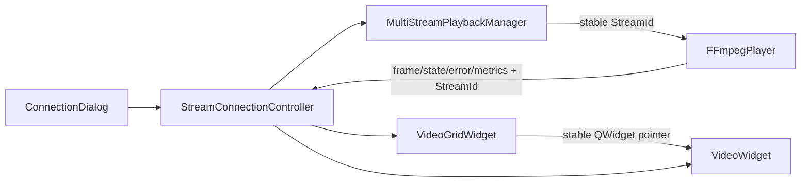
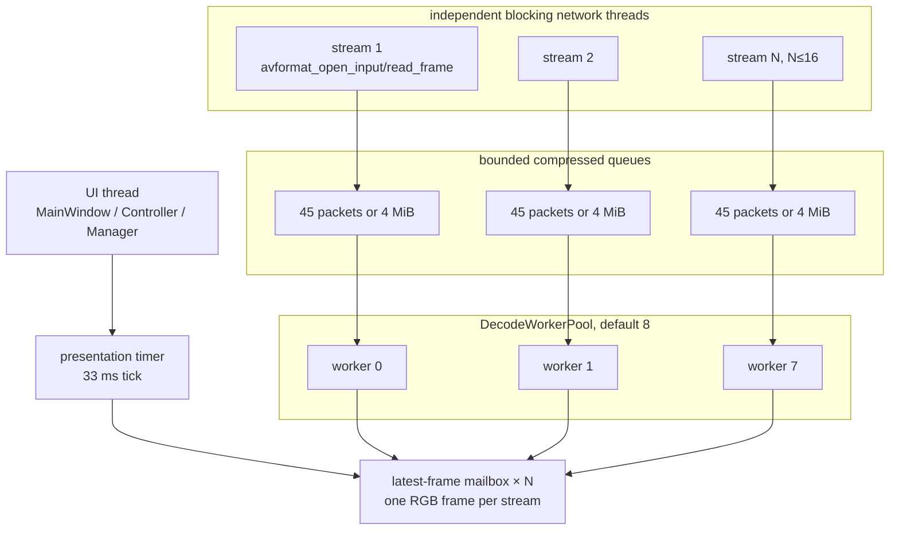

# Week 4：16 路动态连接、解码架构与性能验收

> 历史记录：本文中的本机 16 路测试编排已经退役；C++ 测试与 CTest 仍保留。参见[遗留脚本索引](../../archive/legacy_test_scripts.md)。

> 文档分类：Week 4 实现与测试。

## 1. 实施结论

完成日期：2026-07-27。

本轮把四路固定播放扩展为 0～16 路动态连接，并将原来的“每路线程同时负责网络、
解码和 RGB 转换”拆成三层：

1. 每路独立网络/解复用 `QThread`；
2. 固定大小、按流亲和的共享 `DecodeWorkerPool`；
3. UI 线程中的统一最新帧展示调度器。

普通启动为空状态，不连接任何默认地址。连接对话框或重复的 `--url` 参数创建真实
连接。每一路使用稳定 `StreamId` 绑定播放器、控件、状态和指标，拖拽后的网格位置
不参与路由。

Windows Debug 编译和完整 CTest 已通过。2026-07-28 的预录视频与双屏实况短窗口
真实链路观测到：

```text
streamCount = 16
playing = 16
decodeWorkerCount = 8
live source latency P95 = 169..177 ms
live source latency max = 275 ms
maximumUiTimerGapMs = 169 ms
```

两个脚本现通过隐藏、唯一编号的启动器提交长驻子进程，`Start` 不再等待 nginx、
FFmpeg、时钟或客户端退出。本机视频 `Start` 在 8 秒内返回，实况 `Start` 在 5 秒内
返回。该记录仍只证明功能路径和 30 秒短窗口门槛，不能替代 10 分钟性能资格测试；
本文不会把未执行的长测写成“通过”。

## 2. 动态连接模型

### 2.1 空状态和连接对话框

`MainWindow` 启动时显示中央“添加新的连接”按钮，工具栏提供同名动作。
`ConnectionDialog` 包含：

- 设备名称：默认取最小未占用编号，例如 `Camera 01`。
- RTMP URL：默认生成匹配编号的
  `rtmp://127.0.0.1:1935/live/camera001`。
- “添加并连接”：通过本地校验后立即创建格子并异步连接。

校验规则：

- 名称去除首尾空格后不能为空。
- URL 必须是绝对 `rtmp://` 地址，且 host 和 path 非空。
- 当前会话不能存在完全相同的名称或 URL。
- 已有 16 路时拒绝继续添加。
- 对话框不做同步网络探测，因此无效地址不会冻结 UI。

### 2.2 稳定绑定



`StreamConnectionController` 保存 `StreamId -> QPointer<VideoWidget>` 映射。拖拽只改变
`VideoGridWidget` 内的控件顺序；画面、标题、状态和右键操作继续属于同一个对象。

视频格右键菜单：

- **重新连接**：只重启对应 `StreamId` 的网络会话和解码状态。
- **断开并移除**：确认后停止该路、解除控制器映射、移除控件并重新布局。

## 3. 线程与所有权



### 3.1 网络线程

每个 `FFmpegPlayer` 保留一个长生命周期 `QThread`，仅执行：

- `avformat_open_input`；
- `avformat_find_stream_info`；
- `av_read_frame`；
- H.264 视频包筛选、复制和入队；
- 中断、错误分类和 1/2/4/5 秒退避重连。

阻塞网络调用不进入通用线程池。单路 DNS、TCP、RTMP 或 I/O 失败只更新该流，其他
15 路网络线程和解码任务继续运行。

### 3.2 共享解码池

worker 数解析：

```text
--decode-threads 显式值：限制到 1～16
默认值：clamp(logicalCoreCount / 2, 1, 8)
当前 16 逻辑线程电脑：8 workers
```

同一 `StreamId` 固定映射到同一个 worker，保证其 `AVCodecContext` 不并发、也不在
运行期间跨 worker。每个 FFmpeg 解码器的 `thread_count` 固定为 1，避免 16 个
解码器各自再创建内部线程。

一次调度最多处理 4 个压缩包；若已经使用 5 ms，则把剩余包按原顺序放回队首并让出。
若此时流已停止、重置或发生解码错误，剩余旧包直接计入丢包，不进入新会话。

### 3.3 队列背压和关键帧恢复

每路队列满足任一条件即视为溢出：

```text
packet count >= 45
or
compressed bytes >= 4 MiB
```

溢出后：

1. 清理未解码积压并累计 `packetsDropped`；
2. 标记 decoder discontinuity；
3. flush 当前解码状态；
4. 丢弃非关键帧，直到下一 IDR/关键帧；
5. 从关键帧恢复并累计恢复/重连指标。

该策略选择“丢帧保实时”，避免弱 CPU 或网络突发使延迟随运行时间持续增长。

### 3.4 RGB 转换和 UI 调度

解码 FPS 与展示 FPS 分离。每一帧都可参与 H.264 解码，但只有到达展示节奏时才执行
`sws_scale`：

| 场景 | 最大展示 FPS | 最大 RGB 尺寸 |
|---|---:|---:|
| 普通网格 | 15 | 640×360 |
| 单路全屏 | 30 | 1280×720 |

输出保持宽高比且不会放大超过源分辨率。`VideoWidget` 尺寸或全屏状态变化会调用
`setPresentationTarget(streamId, viewportSize, fullscreen)`。

UI 定时器每 33 ms 检查所有流，但普通网格帧只会按约 66 ms 节奏产生。每路邮箱只
保存最新一张 `PresentableVideoFrame`，新帧覆盖未显示旧帧，不向 Qt 事件队列堆积
大量 `QImage`。

## 4. 核心接口

动态管理器：

```cpp
StreamId addStream(const StreamConnection &connection);
bool removeStream(StreamId streamId);
bool restartStream(StreamId streamId);

bool startStream(StreamId streamId);
void stopStream(StreamId streamId);
int startAll();
void stopAll();

void setPresentationTarget(
    StreamId streamId,
    const QSize &viewportSize,
    bool fullscreen
);

QList<StreamId> streamIds() const;
StreamMetrics streamMetrics(StreamId streamId) const;
```

事件均携带稳定 ID：

```cpp
void frameReady(StreamId streamId, const PresentableVideoFrame &frame);
void stateChanged(
    StreamId streamId,
    FFmpegPlayer::PlaybackState state
);
void errorOccurred(StreamId streamId, const QString &message);
void metricsUpdated(StreamId streamId, const StreamMetrics &metrics);
```

`stopAll()` 先同时设置所有网络中断和队列停止，再等待各网络线程及当前解码任务，
最后关闭共享 worker；析构重复调用安全，不使用 `QThread::terminate()`。

## 5. 指标 JSON

通过 `--metrics-file <path>` 启用。管理器用 `QSaveFile` 每秒原子替换目标文件，
不写入 URL、用户名、密码或 query。

根对象：

```json
{
  "schemaVersion": 1,
  "generatedAtUtc": "2026-07-27T12:00:00.000Z",
  "processId": 12345,
  "decodeWorkerCount": 8,
  "streamCount": 16,
  "maximumUiTimerGapMs": 98,
  "streams": []
}
```

每路字段：

| 字段 | 说明 |
|---|---|
| `streamId`、`displayName` | 稳定 ID 和非敏感显示名 |
| `state` | stopped/connecting/playing/reconnecting |
| `packetsReceived`、`packetBytesReceived` | 网络入包累计 |
| `packetsDropped` | 队列背压或会话失效丢弃累计 |
| `decodedFrames` | H.264 解码帧累计 |
| `convertedFrames`、`presentedFrames` | RGB 转换和真正提交 UI 累计 |
| `queuePackets`、`queueBytes` | 当前压缩队列深度 |
| `decodeFps`、`displayFps` | 最近采样窗口速率 |
| `reconnectCount` | 重连累计 |
| `lastFrameAgeMs` | 最新画面年龄 |
| `internalLatencyP95Ms` | 收包到展示的内部管线 P95 |
| `sourceLatencyP50Ms/P95Ms/MaxMs` | 启用 marker 后的源到显示延迟 |
| `sourceLatencySamples` | 校验通过的 marker 样本数 |

## 6. 自动化测试

### 6.1 CTest

Windows Developer PowerShell：

```powershell
cmake -S . -B out\build-windows-x64\debug -G Ninja `
  -DCMAKE_BUILD_TYPE=Debug `
  -DBUILD_TESTING=ON `
  -DCMAKE_PREFIX_PATH=E:\QT6\6.6.1\msvc2019_64
cmake --build out\build-windows-x64\debug
ctest --test-dir out\build-windows-x64\debug -C Debug --output-on-failure
```

当前结果：

```text
rtmp_monitor_ui_smoke_test       Passed
rtmp_monitor_dynamic_grid_test  Passed
rtmp_monitor_ffmpeg_player_test Passed
rtmp_monitor_multi_stream_test  Passed
100% tests passed, 0 failed
real time: 22.22 s
```

覆盖：

- 0 路空状态、连接对话框、URL 校验和重复拒绝；
- 0～16 路布局、动态移除、16 路上限和右键入口；
- 16 个唯一稳定 `StreamId`，删除后新 ID 不复用；
- 解码 worker 稳定分配；
- 第一条无效时其余 15 路仍启动；
- 单路停止不影响其他路；
- 16 路不可用地址时 `stopAll()` 有界退出；
- 指标 JSON 原子可解析、包含 16 路且不含 URL。

可选真实 RTMP CTest：

```powershell
$env:RTMP_MONITOR_TEST_URLS = (
  1..16 | ForEach-Object {
    "rtmp://127.0.0.1:1935/live/camera{0:D3}" -f $_
  }
) -join ";"
ctest --test-dir out\build-windows-x64\debug -C Debug `
  -R rtmp_monitor_multi_stream_test --output-on-failure
```

### 6.2 预录视频脚本

文件：`scripts/test_16_stream_video.ps1`。

| Action | 用途 | 截止 |
|---|---|---:|
| `Check` | FFmpeg/ffprobe、编码器、filter、协议、nginx、素材和程序 | 每个外部检查 ≤10 s |
| `Prepare` | 顺序生成/复用 16 个 720p30 标签素材 | 每个外部进程 ≤60 s |
| `Start` | 提交隐藏启动器；后台启动 nginx、16 个 copy publisher 和应用 | ≤10 s 返回 |
| `Status` | PID、端口、CPU、内存和逐流指标快照 | 不等待长驻进程 |
| `Test` | 等待 16/16 playing | 循环 ≤55 s，宿主 ≤59 s |
| `StopStream/StartStream` | Camera N 故障注入和恢复 | 只操作记录 PID |
| `StopStreams/StartStreams` | 全失败/恢复场景 | 逐路输出进度 |
| `RunAutomated` | 预热、连续采样、Camera 03 故障和报告 | 显式时长 |
| `Stop` | 安全清理本次 PID | 幂等 |

测试素材使用不同底色和 `CAMERA 001`～`CAMERA 016` 标签，统一为 H.264、
1280×720、30 FPS、GOP 30、YUV420P、无 B 帧。发布使用 `-c copy`，避免 16 个
编码器污染播放器 CPU 数据。

日志：

```text
out/logs/16-stream-video/
```

PID：

```text
out/runtime/16-stream-video/pids.json
```

`Stop` 只处理 PID 文件中进程名、可执行文件绝对路径、启动时间都匹配的进程，避免
PID 复用误杀。状态文件用同目录临时文件替换；失败会输出所有日志最后 100 行并返回
非零。

`Start`、`StartStream`、`StartStreams` 和 `StartApp` 使用独立的唯一 launcher
文件，避免重复启动时共享 stdout/stderr 文件造成阻塞。外层命令只负责提交，实际
结果由 `Status` 从 launcher result JSON 读取。

### 6.3 双屏实况延迟脚本

文件：`scripts/test_16_stream_live_latency.ps1`。

当前电脑屏幕布局：

```text
主屏：1920×1080，坐标 0,0
副屏：1536×864，坐标 1920,0
```

副屏 WPF 窗口每 100 ms 更新可见 UTC 时钟和标记，并在顶部画出：

- UTC Unix 毫秒低 32 位；
- CRC-8 多项式 `0x07`；
- 32+8 个黑白单元。

一个 FFmpeg `gdigrab` 进程只编码一次副屏，再通过 tee/fifo 发布到 16 个 RTMP
地址。应用在 `--latency-marker` 模式解码标记，并在帧真正交给 `VideoWidget` 时
计算源到显示延迟。正常生产路径不解析 marker。

100 ms 保持时间保证 30 FPS 采集至少得到多个完整标记帧，避免在 40 个 WPF 单元
更新中途采到新旧混合值。解析器只在测试模式对有限的混合 DPI 几何候选做 CRC-8 和
10 秒时间窗校验，因此兼容当前主屏/副屏缩放差异，不增加生产播放路径负担。

`Capture` 保存主屏审计截图；`RunAutomated` 每分钟截图并生成逐路 P50/P95/最大值
JSON 与 Markdown 报告。

### 6.4 总控

文件：`scripts/run_16_stream_automated_tests.ps1`。

```powershell
powershell.exe -NoProfile -ExecutionPolicy Bypass `
  -File .\scripts\run_16_stream_automated_tests.ps1 `
  -Action Run -Suite All
```

套件：

- `Unit`：Windows Debug 配置、构建、完整 CTest；
- `Video`：预录 16 路；
- `LiveLatency`：双屏实况；
- `All`：按上述顺序执行。

任一步失败都会调用两个脚本的安全 `Stop`，保留日志，并写：

```text
out/16-stream-validation/summary.json
out/16-stream-validation/summary.md
```

## 7. 当前电脑的手工验收

### 7.1 前置条件

当前电脑：

- Windows 11 专业版；
- AMD Ryzen 7 6800H，16 个逻辑线程；
- 约 16 GiB 内存；
- 主屏 1920×1080；
- 副屏 1536×864，位于主屏右侧；
- 应用固定放在主屏工作区。

默认路径：

```text
FFmpeg  E:\DevTools\ffmpeg-8.1.2-full_build\bin\ffmpeg.exe
ffprobe E:\DevTools\ffmpeg-8.1.2-full_build\bin\ffprobe.exe
nginx   E:\DevTools\nginx-rtmp
视频    E:\rtmpProject\testdata\test.mp4
程序    E:\rtmpProject\out\build-windows-x64\debug\rtmp_monitor.exe
```

所有操作使用独立终端：

```powershell
powershell.exe -NoProfile
Set-Location E:\rtmpProject
```

`Start` 正常应在 10 秒内返回；返回后用 `Status` 查看隐藏启动器状态。若仍未返回，
可终止外层命令，另开终端执行 `-Action Stop`，并查看 `out/logs/16-stream-video`
最后 100 行。`Stop` 只清理 PID 文件中通过路径、名称和启动时间复核的进程。

### 7.2 空状态与对话框

1. 双击或从终端普通启动 `rtmp_monitor.exe`，不传 `--url`。
2. 确认窗口中央有“添加新的连接”，工具栏也有同名按钮。
3. 点击中央按钮，确认名称为 `Camera 01`，URL 为 `camera001`。
4. 清空名称，确认不能提交。
5. 输入 `http://127.0.0.1/test`，确认提示只接受 RTMP。
6. 恢复合法值并提交。确认对话框立即关闭、格子创建、网络连接异步进行。
7. 再打开对话框，输入完全相同名称或 URL，确认被拒绝。
8. 右键该格，确认有“重新连接”和“断开并移除”。
9. 选择移除并确认，确认恢复空状态。

通过标准：验证过程中 UI 不冻结；非法输入不创建格；移除后无残留黑格。

### 7.3 一次加载 16 路

在外部终端依次执行：

```powershell
$s = ".\scripts\test_16_stream_video.ps1"
powershell.exe -NoProfile -ExecutionPolicy Bypass -File $s -Action Check
powershell.exe -NoProfile -ExecutionPolicy Bypass -File $s -Action Prepare
powershell.exe -NoProfile -ExecutionPolicy Bypass -File $s -Action Start
powershell.exe -NoProfile -ExecutionPolicy Bypass -File $s -Action Status
powershell.exe -NoProfile -ExecutionPolicy Bypass -File $s -Action Test
```

`Start` 应在 10 秒内回到提示符；`Test` 最长 60 秒并至少每 5 秒输出一次。

把应用最大化到主屏，等待最多 20 秒，检查：

1. 网格为 4×4。
2. 16 个标题为 Camera 01～16。
3. 画面标签分别为 `CAMERA 001`～`016`，无重复和串路。
4. 每格保持 16:9，无横向或纵向拉伸。
5. 运动连续，状态文字在播放后消失。
6. `Status` 显示 16/16 publisher、16 streams、8 workers。
7. 任务管理器记录 `rtmp_monitor.exe` CPU、内存和 16 个 FFmpeg copy 进程；
   只作为手工记录，硬门槛以 10 分钟报告为准。

### 7.4 Camera 03 故障隔离

```powershell
powershell.exe -NoProfile -ExecutionPolicy Bypass -File $s `
  -Action StopStream -StreamNumber 3
```

观察至少 10 秒：

- 只有 Camera 03 清黑并显示 I/O error/重连退避；
- Camera 01、02、04～16 不清黑、不显示重连；
- 其他 15 路画面继续更新。

恢复：

```powershell
powershell.exe -NoProfile -ExecutionPolicy Bypass -File $s `
  -Action StartStream -StreamNumber 3
```

通过标准：Camera 03 在 8 秒内重新显示 `CAMERA 003`，其余 15 路未中断。

### 7.5 Camera 12 右键操作

1. 右键 Camera 12，选择“重新连接”。
2. 只允许 Camera 12 短暂进入连接/重连，其余格继续播放。
3. 再次右键 Camera 12，选择“断开并移除”，在确认框中确认。
4. 网格保留 15 个真实格并重排；其他标题和画面不变。
5. 点击工具栏“添加新的连接”。
6. 名称输入 `Camera 12`，URL 输入
   `rtmp://127.0.0.1:1935/live/camera012`，提交。
7. 确认恢复 16 路并显示 `CAMERA 012`。

### 7.6 Camera 01/16 拖拽

1. 在 Camera 01 标题或边框按住左键。
2. 拖到 Camera 16 中央，看到目标高亮后释放。
3. 等待约 220 ms 动画。
4. 确认 Camera 01 标题、状态和 `CAMERA 001` 画面整体到原 Camera 16 位置。
5. Camera 16 同理到原 Camera 01 位置。
6. 拖回原位。

只交换画面而标题不动、或错误/状态留在旧位置，均判失败。

### 7.7 Camera 08/16 全屏

1. 双击 Camera 08 标题区域进入主屏全屏。
2. 确认运动不中断，指标中该路展示上限由 15 FPS 变为 30 FPS。
3. 鼠标移动到屏幕底部 120 像素区域，确认控制栏出现，并约 2.5 秒后隐藏。
4. 按 `Esc` 退出。
5. 对 Camera 16 重复；这次再次双击退出。
6. 返回 4×4 后确认位置、标题、画面和状态不变。

### 7.8 三种关闭状态

健康状态：

1. 16 路全部播放时按 `Alt+F4`。
2. 5 秒后执行 `Status` 或任务管理器检查，无 `rtmp_monitor.exe`。

部分重连：

1. `Start` 后停止 Camera 03。
2. Camera 03 显示重连时按 `Alt+F4`。
3. 5 秒内应用退出；之后恢复 publisher 供下一项使用。

全部失败：

1. `Start` 后执行 `-Action StopStreams`。
2. 等四格……直到全部 16 格进入重连。
3. 按 `Alt+F4`，5 秒内应用退出。

最终清理：

```powershell
powershell.exe -NoProfile -ExecutionPolicy Bypass -File $s -Action Stop
```

确认脚本 PID 文件记录的应用、16 个 FFmpeg 和测试 nginx 均已清理。若测试前已有
nginx，脚本只复用且不停止它。

### 7.9 双屏延迟

1. Windows“设置 → 系统 → 显示”选择“扩展这些显示器”。
2. 确认副屏位于主屏右侧，分辨率 1536×864。
3. 关闭可能遮挡副屏的置顶窗口。
4. 外部终端运行：

```powershell
$l = ".\scripts\test_16_stream_live_latency.ps1"
powershell.exe -NoProfile -ExecutionPolicy Bypass -File $l -Action Check
powershell.exe -NoProfile -ExecutionPolicy Bypass -File $l -Action Start
powershell.exe -NoProfile -ExecutionPolicy Bypass -File $l -Action Status
powershell.exe -NoProfile -ExecutionPolicy Bypass -File $l -Action Capture
```

5. 副屏应全屏显示 Source UTC 时钟和顶部 40 个标记单元。
6. 主屏顶部应有 Reference UTC 时钟，应用 16 格位于主屏。
7. `Status` 中 16 路都应出现 `sourceLatencySamples > 0`。
8. `Capture` 后检查主屏 PNG 同时包含参考时钟和 4×4。
9. 执行 10 分钟 `RunAutomated`，查看逐路 P50/P95/最大值。
10. 最后执行 `Stop`。

## 8. 性能硬门槛和报告解读

预热后连续 10 分钟：

| 指标 | 门槛 |
|---|---:|
| 解码 FPS | 16 路均有至少 95% 窗口 ≥27 |
| 网格展示 | 12～15 FPS |
| 源到显示延迟 | 每路 P95 ≤750 ms，单样本最大 ≤1500 ms |
| 应用 CPU | 平均 ≤85% |
| 工作集 | 峰值 ≤2048 MiB |
| 队列 | >75% 不连续超过 5 s |
| UI 调度 | 最大卡顿 <500 ms |
| Camera 03 恢复 | ≤8 s |
| 三种关闭 | ≤5 s |

报告失败时不要只看总布尔值：

- `decodeFps` 低而 CPU 接近 85%：软件解码已成为瓶颈，下一步评估 D3D11VA/VPU。
- `decodeFps` 正常、`displayFps` 低：检查 UI 卡顿和 RGB 转换。
- `queuePackets` 持续上升：公平调度或 worker 数不足。
- 队列经常清空且 `packetsDropped` 快速增加：输入突发或 CPU 无法跟上。
- 内部延迟低但源延迟高：问题在采集/编码/RTMP server 前半链路。
- marker 样本为 0：先检查副屏尺寸、顶部标记未被遮挡、`--latency-marker` 和截图。

验收记录：

| 日期 | 场景 | 结果 | 平均 CPU | 峰值内存 | 最差 P95 | UI 最大卡顿 | 关闭耗时 | 备注 |
|---|---|---|---:|---:|---:|---:|---:|---|
| | 16 路预录 | | | | N/A | | | |
| | 双屏实况 | | | | | | | |
| | Camera 03 | | | | | | | |
| | 三种关闭 | | | | | | | |

## 9. ARM64 边界

当前电脑能完成 Windows 功能/性能测试和 Linux ARM64 交叉构建。交叉构建检查主程序
和所有测试目标是否可生成 ELF64/AArch64，并检查动态依赖架构；它不能验证：

- 目标盒子的 Qt QPA 插件；
- Wayland/X11/EGLFS；
- 实际 ARM 核心的软件解码能力；
- 厂商 VPU/GPU；
- ARM64 网络驱动和 16 路长期稳定性。

本轮不引入 OpenGL、Windows 硬件解码或 ARM64 VPU。只有 Windows 10 分钟报告证明
软件路径无法满足门槛，或目标盒子实测数据明确后，才设计对应硬件后端。

## 10. 已验证与待验证

已验证：

- Windows Debug 增量构建成功，CTest 4/4 通过（22.00 秒）；
- PowerShell 三个 16 路脚本通过语法检查；
- FFmpeg、ffprobe、libx264、drawtext、RTMP/FLV、nginx、测试视频和双屏存在；
- 16 个 720p30 标签素材生成成功；
- 视频分阶段测试达到 16/16 playing、8 workers；Camera 03 停止只影响该路，恢复后
  回到 16/16；停止后无残留客户端；
- 30 秒双屏实况自动测试通过：16/16 路均有样本，P95 169～177 ms、最大 275 ms、
  平均 CPU 43.3%、峰值工作集 194.7 MiB、UI gap 169 ms；
- 测试进程可按 PID/路径/名称/启动时间安全清理。
- 主程序和四个测试目标均通过 Linux ARM64 交叉构建并确认为 ELF64/AArch64。

仍需完成：

- 10 分钟预录视频硬门槛；
- 10 分钟双屏逐路源到显示延迟；
- Camera 12 右键移除/重新添加；
- Camera 01/16 手工拖拽；
- Camera 08/16 手工全屏；
- 三种关闭状态的人工计时；
- 真实 ARM64 盒子播放与性能。
