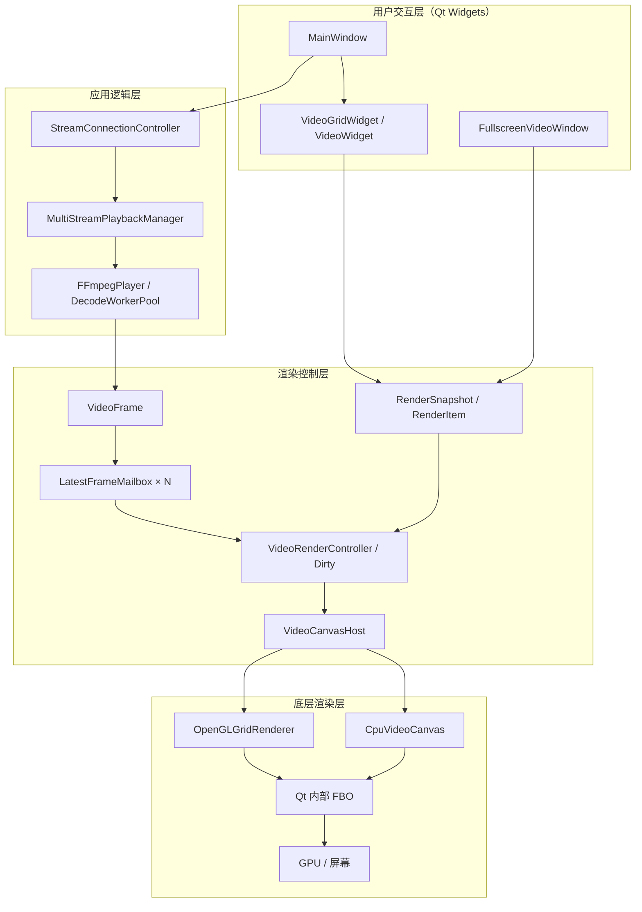
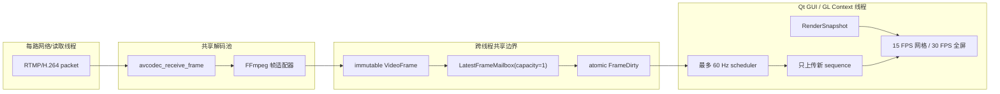
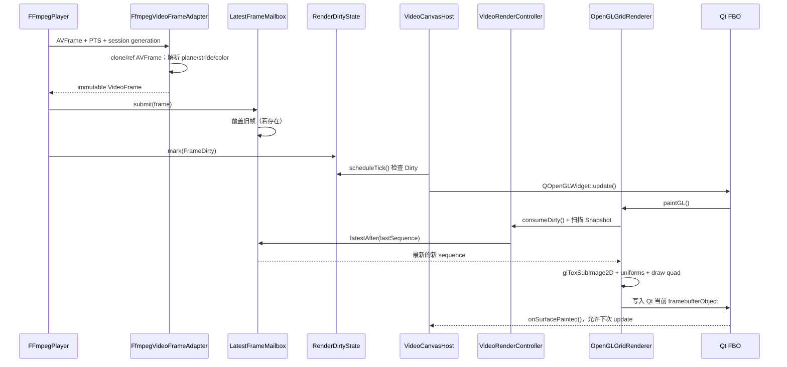
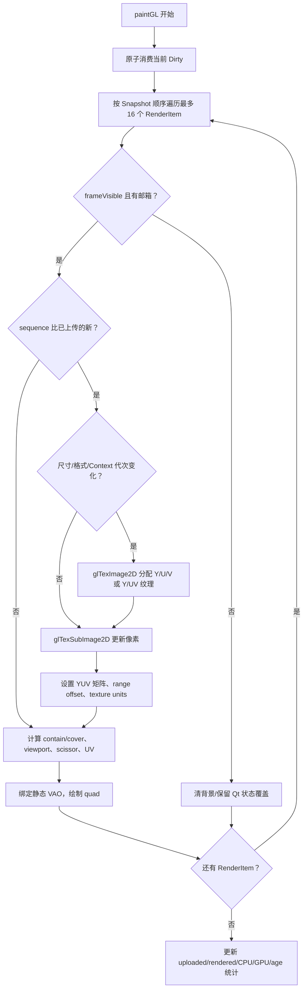
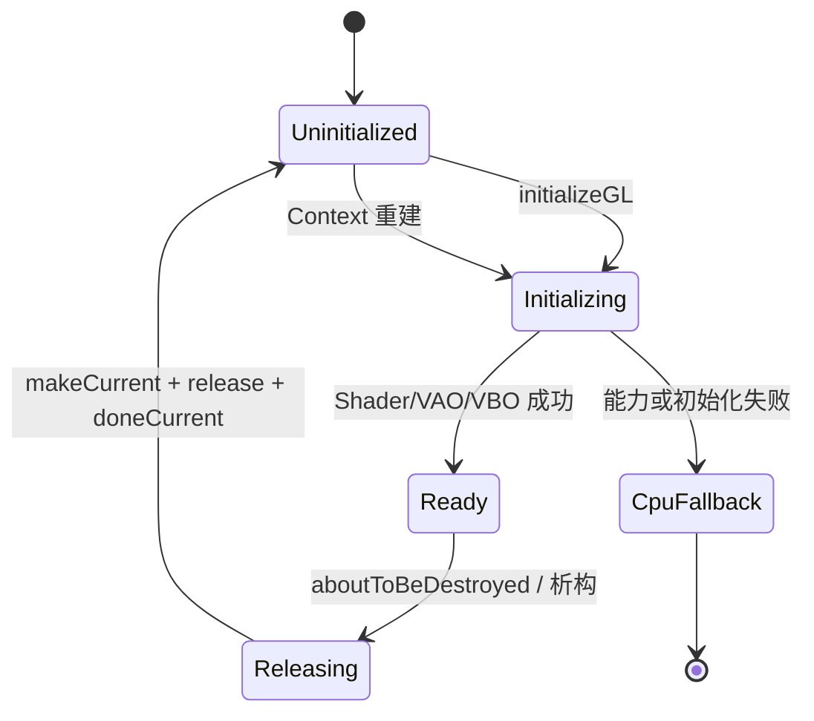
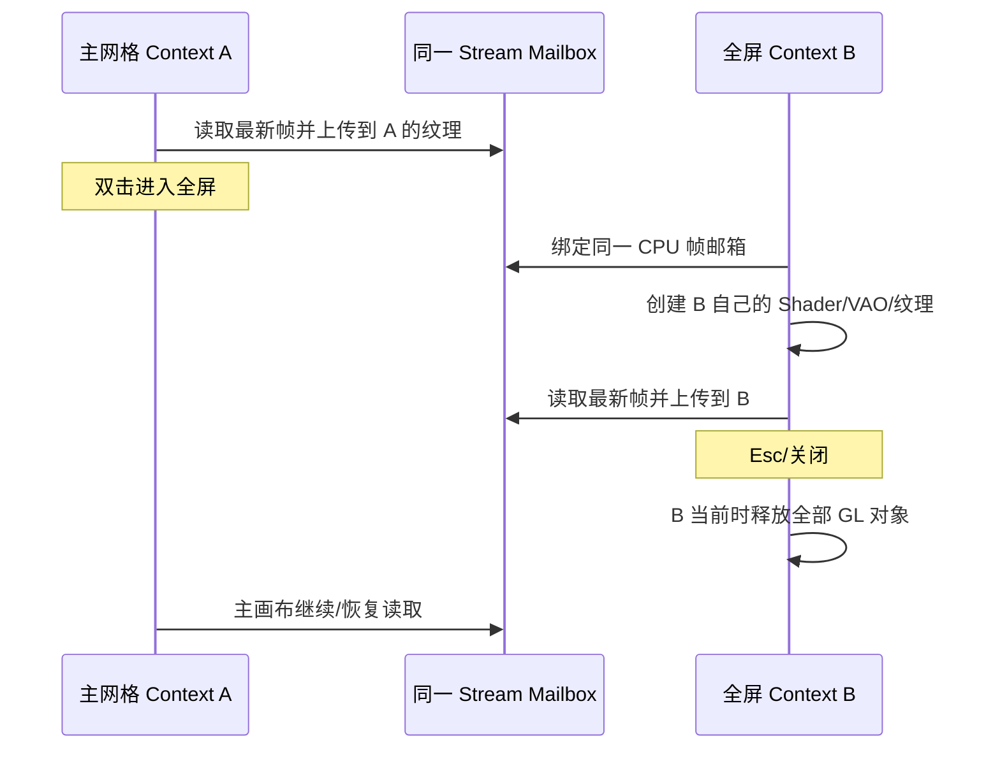

# Week 6 产品视频渲染框架教学篇

本文面向已经完成 LearnOpenGL 入门和第一章、知道“顶点—Shader—纹理—屏幕”基本关系，但还不熟悉 Qt、多线程视频和 YUV 的读者。阅读目标不是背 API，而是能够回答三个问题：一帧为什么这样流动、每个类为什么存在、黑屏或性能异常应该从哪一层查。

## 1. 先建立整体心智模型

LearnOpenGL 的经典例子通常是：CPU 准备顶点和纹理，调用 `glDraw*`，GPU 运行 Vertex/Fragment Shader，结果写到窗口。这个项目在它外面增加了网络、解码、多路调度、Qt FBO、生命周期和回退。



关键分界是：`RenderSnapshot` 描述“画在哪里、显示什么状态”，邮箱保存“最新像素是什么”。Snapshot 不复制高频帧，帧也不知道自己要画到哪个 QWidget。

## 2. 线程与数据流



为什么不让解码线程直接调用 OpenGL？OpenGL 命令作用于“当前线程的当前 Context”。Qt 的 `QOpenGLWidget` Context 通常属于 GUI 线程，跨线程调用会造成未定义行为、Context 切换成本和析构竞态。第一版把所有 GL 资源操作集中在 GUI/Context 线程，先把正确性和生命周期做稳。

为什么邮箱容量只有 1？实时监控最重要的是“现在”，不是把旧帧排队补播。假设解码 30 FPS、网格只显示 15 FPS，队列若无限增长，延迟会越来越大；容量 1 让新帧覆盖未显示的旧帧，延迟保持有界，覆盖数作为指标记录。

## 3. 一帧从 AVFrame 到 Qt FBO



`AVFrame::data` 经常指向解码器会复用的缓冲，不能把裸指针长期交给 UI。适配器优先 clone/ref AVFrame，让 `VideoFrame` 的类型擦除 `shared_ptr` 持有真实所有者；只有不可引用或异常 stride 场景才复制 plane。这样 `VideoFrame` 值被跨线程复制时，像素仍然有效。

`sessionGeneration` 防止旧连接在停止/重连边界后提交“幽灵帧”；`sequence` 让 Renderer 知道某路是否真的出现新帧；PTS、time base 和时间戳用于延迟指标，而不是决定 UI 控件生命周期。

## 4. `paintGL()` 内到底发生什么



画 16 路不是创建 16 套几何。所有路共用一个静态 Quad、VAO 和 VBO；每次绘制只改变 viewport/scissor、UV、纹理绑定和颜色 uniform。Qt 已经为 `QOpenGLWidget` 创建内部 FBO，所以 Renderer 不再为每路创建 FBO。

## 5. 每个类的职责

| 类/类型 | 只负责什么 | 不应该负责什么 |
|---|---|---|
| `FFmpegPlayer` | 读取/解码一路流，把支持的帧提交邮箱，报告状态和错误 | 不按 QWidget 尺寸缩放，不生成逐帧 QImage，不调用 GL |
| `FfmpegVideoFrameAdapter` | 将 AVFrame 的格式、plane、stride、PTS、颜色元数据和所有权转换为 `VideoFrame` | 不决定布局和显示 FPS |
| `VideoFrame` | 不可变的 YUV 帧值；持有 plane view 和共享所有者 | 不知道 Stream UI 在哪里 |
| `LatestFrameMailbox` | 保存每路最新帧，按 sequence 读取，统计覆盖/清空 | 不成为可增长播放队列 |
| `MultiStreamPlaybackManager` | 管理多路 Player、共享解码池、状态、错误和指标汇总 | 不发送逐帧 QImage 给 QWidget |
| `StreamConnectionController` | 把设备/URL、稳定 StreamId、连接和重连业务串起来 | 不管理纹理或 Shader |
| `VideoWidget` | 标题、状态、选择、右键、拖拽、双击全屏入口和视频区域几何锚点 | 不保存 QImage，不持有 GLuint |
| `VideoGridWidget` | 0～16 路逻辑顺序、网格/动画、从真实几何生成 Snapshot | 不逐路绘制像素 |
| `RenderItem` | 一路的 StreamId、tile/video rect、contain/cover、状态和可见性 | 不携带帧数据 |
| `RenderSnapshot` | 某一时刻全部 RenderItem 的不可变低频描述、DPI 和画布大小 | 不随每帧复制 YUV |
| `VideoRenderController` | 绑定 StreamId→Mailbox、保存 Snapshot、消费新 sequence、管理 Dirty | 不创建 Qt 窗口或 Context |
| `VideoCanvasHost` | 选择 GL/CPU 后端、15/30 FPS 调度、`paintPending`、fallback 和运行诊断 | 不直接拥有 Context 绑定的 GLuint |
| `CpuVideoCanvas` | 诊断/回退：把 `VideoFrame` 转成 QImage 后由 QPainter 合成 | 不作为未来零拷贝主路径 |
| `OpenGLGridRenderer` | Shader、VAO/VBO、YUV 纹理、上传、颜色 uniform 和多路合成 | 不管理设备连接和 QWidget 交互 |
| `FullscreenVideoWindow` | 按 StreamId 绑定同一邮箱，创建临时画布，处理退出和控制栏 | 不搬运主网格的渲染 QWidget，不共享 GLuint |

本轮首帧黑屏也说明了职责边界的重要性：`VideoWidget::showFrame()` 改变“业务帧可见”，必须通过可靠的成员槽让 `VideoGridWidget` 重建 Snapshot；QWidget 的瞬时 show/hide 不能被误写成长期业务状态。

## 6. 把 LearnOpenGL 概念映射到项目

### 6.1 `QOpenGLWidget`、Context 和 Qt FBO

Context 可以理解为 OpenGL 状态与对象命名空间。`initializeGL()` 在 Context 当前时创建 Shader/VAO/VBO，`paintGL()` 在同一 Context 当前时绘制，`resizeGL()`/Qt 事件更新视口信息。

普通教程常画到默认 framebuffer 0；`QOpenGLWidget` 为了与 Qt Widgets 合成，会把内容画到内部 FBO。项目必须使用 Qt 当前 framebuffer，不应擅自绑定 0。Qt 随后把该 FBO 组合到窗口。

### 6.2 VAO、VBO 和静态 Quad

VBO 保存四个顶点的位置与 UV；VAO 记录顶点属性解释。Quad 用 `GL_TRIANGLE_STRIP` 以四个顶点形成两个三角形：

```text
(-1,+1) ---- (+1,+1)
   |        /    |
   |      /      |
   |    /        |
(-1,-1) ---- (+1,-1)
```

不同视频格子不需要改顶点数据。viewport 把标准化坐标映射到某个屏幕矩形，UV 选择源图区域。

### 6.3 Vertex Shader 与 Fragment Shader

Vertex Shader 传递位置和 UV；Fragment Shader 为每个目标像素采样 Y/U/V 或 Y/UV，并执行 YUV→RGB。Desktop 使用 `#version 330 core`，ES3 使用 `#version 300 es`；ES Fragment Shader 还要声明浮点精度。C++ 端使用一致的 attribute/uniform 语义，使两套 Shader 共用上传和绘制流程。

### 6.4 Texture unit 与 YUV plane

YUV420P 有独立 Y、U、V plane，所以使用三个 `GL_R8` 纹理；NV12 的 U/V 交错，使用一个 `GL_R8` Y 纹理和一个 `GL_RG8` UV 纹理。Texture unit 就像 Shader 可见的“纹理插槽”，uniform 指明 sampler 应读取哪一个 unit。

4:2:0 表示色度宽高各约为亮度的一半。奇数尺寸时不能简单写 `width/2`，应按 `(width+1)/2` 处理有效 plane 尺寸。

### 6.5 `glTexImage2D` 与 `glTexSubImage2D`

`glTexImage2D` 定义存储大小和格式，可能触发 GPU 内存分配；`glTexSubImage2D` 只更新已存在存储。项目只在首次帧、分辨率/像素格式变化或 Context 重建时前者，普通帧用后者。这样减少分配抖动，也让“预热后纹理字节稳定”成为可检测门禁。

### 6.6 stride、alignment、row length 和 staging

视频 plane 的一行在内存中可能有 padding，所以 `stride` 不一定等于有效 `rowBytes`。`GL_UNPACK_ALIGNMENT=1` 避免 OpenGL按默认 4 字节对齐误读；正常正 stride 可用 `GL_UNPACK_ROW_LENGTH` 告诉驱动下一行在哪里。

负 stride 表示图像行方向相反，或 stride 不能换算成完整像素数；此时直接设置 row length 不可靠。项目使用可复用 staging buffer 逐行整理成紧密数据，再上传。典型 stride bug 是画面倾斜、隔行错位或颜色块，而不是必然黑屏。

### 6.7 viewport、scissor、UV、contain 和 cover

- viewport：把 Quad 映射到格子里的目标矩形。
- scissor：禁止片元写出该视频格子，避免覆盖相邻格子。
- UV：选择源纹理的采样范围。
- contain：完整显示源图，剩余区域为黑边。
- cover：填满目标区域，超出比例的源图通过 UV 从中央裁掉。

高 DPI 下 Snapshot 保存逻辑坐标和 devicePixelRatio，真正 GL viewport/scissor 使用物理像素；混淆两者会造成偏移或只画到一部分。

### 6.8 BT.601/709/2020 与 Limited/Full

YUV 不是一种唯一颜色。矩阵系数决定 Y、Cb、Cr 如何组合成 RGB；range 决定数字黑白点。Limited 的 8-bit Y 通常使用视频范围，Full 使用完整数值范围，因此 Shader 要先加 offset/缩放再乘 3×3 矩阵。

元数据缺失时，项目按 HD→BT.709、SD→BT.601、YUV→Limited 回退，并每种格式代次只记一次诊断。支持 8-bit SDR、BT.601/709/2020 NCL；PQ/HLG 不假装被正确显示，而是报告 unsupported。

### 6.9 Dirty、`paintPending` 与实时原则

Dirty 是“发生了什么变化”的位集合：Frame、Layout、Overlay、Resource、Viewport、ColorMetadata。多个变化可原子合并成一次 paint。解码 16×30 FPS 时，若每帧都向 Qt 事件队列投递一次 update，事件数量会随总输入 FPS 线性增长；当前 scheduler 直接按目标周期检查（网格约 67 ms/15 FPS，全屏约 33 ms/30 FPS，且不超过 60 Hz），`paintPending` 防止上一帧还未绘制就重复排队。不要再在固定 16 ms tick 上叠加“至少 66 ms”判断，否则只能等到第 5 个 tick、把 15 FPS 量化成约 12.5 FPS。

绘制开始时只消费当时的 Dirty；绘制过程中到达的新 Dirty 留给下一 tick，不会丢。窗口隐藏时保留 Dirty 但不持续 update，恢复时补 Resource/Viewport Dirty。

## 7. 为什么不用这些看似更“高级”的方案

### 每路一个 `QOpenGLWidget`

16 路会带来 16 个 Context/FBO、更多 Qt 合成和 Context 切换；拖拽、全屏和未来硬件帧导入也更复杂。单画布把 16 路当作 16 次轻量 draw，布局仍由 `VideoWidget` 几何决定。

### PBO、共享 Context、上传线程

它们可能进一步隐藏上传等待，但会引入 fence、ring buffer、Context 共享失败、对象所有权和退出竞态。第一版先通过持久纹理、容量 1 邮箱和单 Context 得到可测基线；只有 timer/query 证明上传确实是瓶颈，才增加复杂度。

### 全屏共享 GLuint

Windows 全屏只短期存在第二个 Context。两画布共享的是 CPU 侧 `VideoFrame`/Mailbox，不共享纹理句柄，避免 Context share group 和析构顺序风险。代价是全屏期间同一路可能在两个 Context 各有一份纹理；主画布可暂停该路上传降低重复工作。

## 8. Context 生命周期与资源释放





GLuint 只是某个 Context/share group 中的名字，不是普通进程全局资源。Context 不当前时调用 `glDelete*` 可能无效或删除错误命名空间中的对象。因此 `aboutToBeDestroyed`、派生类析构入口和应用退出都要先断开回调，再 `makeCurrent()`，释放纹理、Shader、VAO/VBO，最后 `doneCurrent()`。Context 丢失后保留 Snapshot 和 Mailbox，重建时从最新帧重新上传。

## 9. 从症状反推层级

| 症状 | 优先检查 |
|---|---|
| 状态已 Playing、所有格子黑；全屏后一起出现 | Snapshot/Dirty/信号连接/主画布调度 |
| 只有一路花屏或斜纹 | plane、stride、格式代次、单路纹理 |
| 颜色整体偏灰/偏色 | matrix、range、texture unit、UV plane 顺序 |
| 越播越慢 | 邮箱是否容量 1、事件是否逐帧增长、frame age、队列长度 |
| GL 请求却是 CPU | schema v3 的 fallback reason、vendor/version、Shader 日志 |
| 关闭/全屏切换崩溃 | Context 当前性、回调断开、邮箱/窗口析构顺序 |

结合 `renderer.activeBackend`、`renderStatistics`、每流 mailbox/age/latency 指标，先确定故障属于输入、解码、共享边界、Snapshot、上传还是最终 draw，不要只凭“黑屏”猜 nginx 或 Shader。
