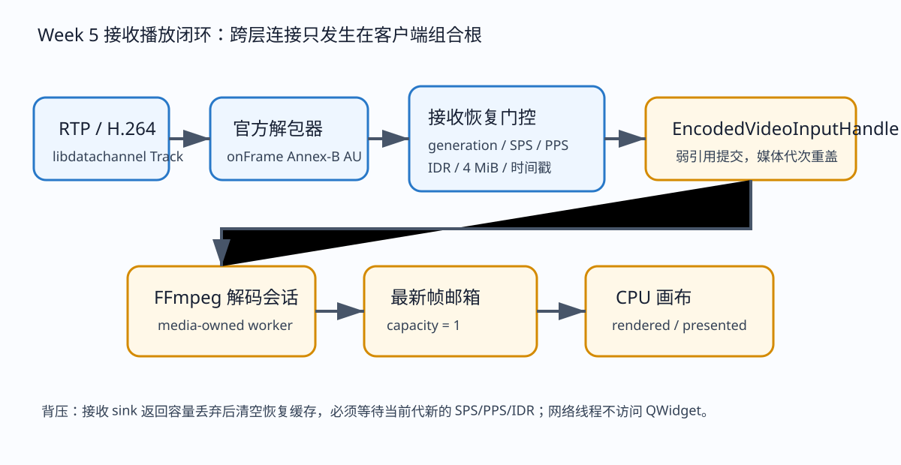
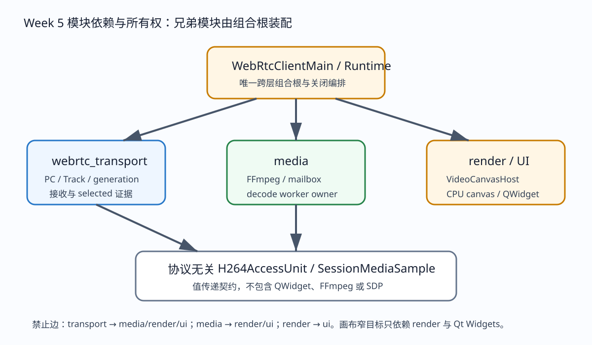

# WebRTC V2 Week 6：双机 LAN 测试包、便携信令根与交付说明

> 阅读时间：约 25～35 分钟。本文先完整回顾 Week 5 接收播放基线，再说明 Week 6 怎样在不破坏模块边界的前提下，把同一个测试客户端变成可复制到两台 Windows 电脑上的 LAN 资格测试包。文中的“已完成”只指代码、构建、自动测试和同机双包黑盒；真实双机条目必须以用户后来收集的四份报告为准。

## 1. Week 6 到底做了什么

Week 6 的主要任务不是继续增加视频功能，也不是把测试客户端接进正式产品主窗口，而是把 Week 5 已经打通的 publisher/viewer 闭环变成一个可以脱离源码目录运行、可以由普通文件搬运完成协商、可以在两台局域网电脑上产生可审查证据的 Release 测试包。为此，本周新增了三类能力。第一类是 transport 事实证据：endpoint 在真正连接后询问 libdatachannel 当前选中的 ICE candidate pair，只保留本地类型、远端类型、本地传输和远端传输四个枚举值。第二类是便携布局：客户端看到可执行文件同级存在 `package-manifest.json` 时，不再寻找 Git 仓库，而是在包内使用自己的 `session-exchange`；开发运行仍保持原来的仓库交换目录。第三类是交付工具：一个打包器、一个开发机资格总控、一个随包双机 runner 和一个纯 manifest/report 模块各自承担窄职责。

这三个变化共同回答了 Week 6 的核心问题：用户把两个相同 ZIP 分别解压到 PC A 和 PC B 后，双方怎样知道它们使用同一份代码和样本，怎样在不编辑 SDP 的情况下交换 Offer/Answer，怎样确认真正的媒体走的是局域网 host/host UDP，怎样确认 viewer 不只是“连上了”而是真的经历 RTP、AU、解码和呈现，怎样在一方退出后得到终态，怎样证明每轮结束没有测试进程和信令文件残留。

本周明确没有做以下事情：没有加入公网 STUN/TURN，没有建设 WebSocket/WSS 信令服务器，没有加入账号、鉴权、TLS、RBAC，没有支持摄像头，没有支持多画面，没有把 viewer 合并进正式产品 UI，也没有改变设置 schema。这样控制范围的原因不是忽视这些能力，而是它们拥有不同的部署、产品和生命周期问题；在 LAN 文件信令还没有通过真实双机之前把它们混进来，只会让故障无法定位。

## 2. Week 5 深度基线回顾：为什么 Week 6 可以只做交付能力

Week 5 解决的是“收到媒体之后怎样复用现有播放框架”的问题。此前 Week 4 已经能够从固定 MP4 中读取 H.264，按媒体时间节奏提交给 SendOnly Track；但 ReceiveOnly endpoint 还不能把 RTP 变成用户可见画面。Week 5 没有另写一套解码器或绘图器，而是把 transport 输出收敛为协议无关 `SessionMediaSample`，再从客户端组合根接入媒体层的 `EncodedVideoInputHandle`。这条边界决定了 Week 6 的包只是重新定位输入文件和信令根，不需要改变播放器、mailbox 或画布。

接收 Track 安装的是 libdatachannel 0.24.5 官方 `H264RtpDepacketizer`，分隔符选择 `StartSequence`，并串接 `RtcpReceivingSession`。RTP 分片、FU-A、聚合和顺序问题由经过验证的库实现承担，项目不复制 RFC 6184。`onFrame` 得到 Annex-B access unit 后进入 transport 私有的 `H264ReceivePipeline`。这个 pipeline 不是 decoder；它只检查 Annex-B 结构、识别 SPS/PPS/IDR、控制 4 MiB 上限、缓存当前 endpoint generation 的参数集、恢复 32 位 RTP 90 kHz 时间戳并产生从零开始的单调微秒时间。

首次起播必须在当前 generation 获得 SPS、PPS 和 IDR。若 IDR 到达时参数集分散在前面的 AU，pipeline 会前置缓存；若发生畸形 AU、超限 AU、下游容量丢弃或资源失败，它会清空恢复状态，等待下一套能够独立解码的关键帧。这个规则很重要：capacity-1 mailbox 的设计目标是低延迟，它可以主动丢旧帧；如果接收层在丢帧后继续把 P 帧当作连续码流交给 decoder，画面可能长期花屏或表现为偶然恢复。Week 5 的策略让丢弃是明确状态转换，而不是隐藏的“尽量播放”。

`EncodedVideoInputHandle` 是组合根持有的媒体入口。receive sink 只捕获它的弱引用，收到 `SessionMediaSample` 后取出 `H264AccessUnit` 调用 `submit`。handle 不信任 transport 携带的媒体代次，而是重新盖上当前媒体 generation；因此 endpoint generation 和 decode generation 可以分别演进，旧 endpoint 回调不会复活已关闭的媒体会话。`EncodedVideoDecodeSession` 拥有 FFmpeg codec context、提交队列、decode worker、generation 和停止条件。解码成功的 `VideoFrame` 进入 `LatestFrameMailbox`，邮箱容量固定为一，writer 替换旧帧，UI/render reader 根据 sequence 判断是否出现新画面。

`VideoCanvasHost` 和 `CpuVideoCanvas` 仍是既有画布实现。Week 5 只是把它们从高扇入完整 UI target 中抽成 `rtmp_monitor_video_canvas` 窄目标，测试客户端因而不需要链接主窗口、设置页、设备控制或事件中心。viewer controller 在 Qt UI 线程创建 manager、输入 handle、单画面窗口和 CPU canvas，并读取 decoded/rendered/presented 证据。只有 mailbox sequence 和 render/present 计数实际增加后，客户端才发出 `frame_presented`，所以事件不是“调用了绘制函数”的乐观日志。

## 3. Week 5 的模块关系、线程和关闭语义

Week 5 的关键架构收益不是文件数量增加，而是变化原因分离。`webrtc_transport` 只知道 WebRTC session 契约和 H.264 值契约，不包含 media、render 或 ui 头文件。publisher source 只知道 MP4/FFmpeg demux 与 H.264 submit port，不知道 PeerConnection。media 只知道 H.264 AU、FFmpeg 解码、帧和 mailbox，不知道 SDP。render/UI 只读取帧，不知道 RTP。跨层具体对象只在 `WebRtcClientMain`、`WebRtcClientRuntime` 和 `WebRtcViewerController` 这组测试客户端组合代码里相遇。

线程方面，libdatachannel 回调线程负责接收和轻量门控，sink 在 endpoint 状态锁外执行；decode worker 负责 FFmpeg；Qt UI 线程拥有 QWidget 与画布；control worker 负责文件信令、endpoint 和 publisher source 编排。任何网络或解码线程都不能直接触碰 QWidget。`receiveCallbackMutex` 的用途非常窄：它让 `beginClose` 能够等待正在执行的 sink 离开，并在增加 generation、清空 sink 后保证不会再开始新的有效提交；它不是用来保护 decoder 或 UI。

关闭顺序是：先设置取消标志唤醒信令等待，再调用 endpoint `beginClose` 使 generation 和回调失效，然后停止并汇合 publisher source/control worker，再关闭 Track 和 PeerConnection，再关闭媒体 handle、移除流，最后注销画布和销毁窗口。`rtc::Cleanup()` 由 main 在全部对象销毁后调用一次。每一步可重复，锁内不 join。Week 5 自动测试已经覆盖重复 close、旧 send port、generation、接收恢复和正常两进程完成；桌面窗口先关的人工交互场景当时仍是待用户执行。本周新增的是 endpoint 级对端关闭收敛和迟到 sink 不再增加的补充复验，它不能被写成 Week 5 当时已做过的窗口人工测试。

## 4. Week 6 transport 变化：selected pair 不是 SDP 候选列表

旧的 `candidateTypes` 来自本地 description 中收集到的候选类型。它只能说明本端生成过哪些 candidate，不能证明连接最终选中了哪一对。例如本机 description 可能包含 host，而底层检查实际把远端地址识别为 peer-reflexive；若只看 description 就声称“host/host UDP”，证据是不成立的。Week 6 在 `EndpointConnectionResult` 中保留旧字段以兼容现有调用方，同时增加可选的 `EndpointCandidatePair selectedPair`。

endpoint 在 `waitConnected` 观察到 Connected 后，通过 libdatachannel 0.24.5 的 `getSelectedCandidatePair()` 读取本地与远端 `rtc::Candidate`。转换函数只接受类型和 transport 枚举：Host 输出 `host`，ServerReflexive 和 PeerReflexive 对外统一为不含地址语义的 `srflx`，Relayed 输出 `relay`；UDP 输出 `udp`，各种 TCP 模式统一输出 `tcp`。`unknown` 只用于无法分类，资格门禁不接受它。地址、端口、candidate 原文、SDP、ICE 用户名密码和 fingerprint 从未写入 DTO，因此客户端 JSONL 不需要先拿到敏感文本再做字符串脱敏。

同机测试中出现 `host/srflx + udp` 是底层 ICE 检查的合法结果，不能强改为 host/host 来迎合门禁。Week 6 同机黑盒只接受 `host|srflx|relay` 这些安全分类与 UDP，报告明确标记 `sameMachinePortable=true`、`lanClaimed=false`。只有两台真实电脑的四份 runner 报告都给出 `host/host + udp`，`VerifyLan` 才允许 W6-GATE 通过。这种区分让事实比预期更重要。

## 5. Week 6 断线状态：为什么 Connected 后不能回到 Connecting

当前 endpoint 没有重连策略、ICE restart API 或新的信令轮次。旧实现把所有非 Connected、非 Failed、非 Closed 状态都映射为 Connecting，于是已连接的对端退出后，libdatachannel 报告 Disconnected 时界面可能重新显示“连接中”，直到更晚才 Failed。这个状态给人的暗示是系统正在恢复，但实际上没有任何恢复动作。

本周给 shared state 增加 `hasConnected`。首次 Connected 时置位；此后收到 Disconnected、Failed 或 Closed 都统一进入 `EndpointState::Failed`，唤醒等待者。协商建立前的 Disconnected 仍可保持 Connecting，因为 ICE 建连期间的状态波动不等同于丢失既有会话。viewer media loop 观察到 Failed 时发出一次稳定 `connection_lost`，随后依据已有媒体证据决定能否正常完成；它不会把终态重新投影为 Connecting。

endpoint 测试对两种信令拓扑都建立真实 RTP，取得选中 pair，发送可恢复 AU，再关闭 sender。对端必须在有界时间进入 Failed。libjuice 的默认失联检测在本机实测约需要三十秒，所以测试上限设为三十五秒而不是伪造即时断线。关闭之后记录 receive sink 计数并短暂等待，计数不能再变化；随后重复 close，队列必须为零。这个测试证明的是 endpoint 自动生命周期，不替代“用户点关闭 viewer 窗口”的 UI 人工场景。

## 6. `WebRtcClientRuntimePaths`：把路径政策从 runtime 编排中拿出来

Week 5 runtime 通过当前目录和 executable 目录向上寻找同时具有 `.git` 与 `CMakeLists.txt` 的仓库根，再调用 `SessionPackageStore::exchangeRootForRepository`。这对开发构建是安全的，但 ZIP 解压目录没有 `.git`，所以会稳定返回 `unsafe_path`。直接增加任意 `--exchange-dir` 看似方便，却会把路径边界、用户输入和清理范围扩散到 CLI、文档与脚本，而且容易让自动清理误碰用户目录。

Week 6 新增私有纯值组件 `WebRtcClientRuntimePaths`。它接收 application directory 与 current directory，返回 layout、exchange root 和 sample path。优先级固定：若 executable 同级有普通文件 `package-manifest.json`，选择 Portable，交换目录为 `<exe-dir>/session-exchange`；否则尝试原有仓库发现并选择 Repository；都失败才返回 Invalid。marker 优先意味着即使测试包碰巧解压到 Git 仓库子目录，它仍不会污染仓库交换目录。sample 永远是 `<exe-dir>/webrtc-assets/sample.mp4`，publisher 只支持固定 `--source sample`。

这个类不创建目录、不读 manifest 内容、不启动线程、不拥有 SessionPackageStore，也不判断媒体角色。它的独立变化原因只是“运行布局政策”。runtime 取得成功解析后发出 `runtime_ready`，其中只有 `layout: repository|portable`，没有绝对路径。表驱动测试覆盖仓库布局、便携 marker 优先、无布局、重复解析一致和 package-local sample 路径。信令存储的 DACL、原子写、schema v1 验证和受管文件名仍由原 `SessionPackageStore` 负责。

## 7. 客户端类职责逐项说明

### 7.1 `WebRtcEndpointSession`

职责是拥有一个 PeerConnection、一个本地 Track、可能的远端 Track 引用、endpoint generation、有界发送队列、接收 pipeline 与连接状态。公共入口包括建立 Offer、接受 Offer 并生成 Answer、接受 Answer、等待连接、创建 send port、安装 receive sink、读取 snapshot、beginClose 和 close。Week 6 新增的 selected pair 也由它产生，因为只有 transport 能直接询问 PeerConnection。

它不负责文件信令、不负责 MP4、不负责 FFmpeg 解码、不负责 QWidget、不负责打包。回调可能位于 libdatachannel 线程；snapshot 以锁保护的值返回；sink 在状态锁外调用。失败语义区分参数/角色/媒体不兼容、库失败、超时和连接失败。关闭者是 `WebRtcClientRuntime`，析构提供最后的幂等兜底。

### 7.2 `H264ReceivePipeline`

职责是把已经由官方 depacketizer 还原的 Annex-B AU 转换为可交付 sample，并维护当前 generation 的恢复状态。关键输入是 generation、字节和 RTP timestamp，输出包括 Accepted、WaitingForKeyframe 或 InvalidAccessUnit 以及可选 sample。它拥有 SPS/PPS 缓存、时间戳展开基线和等待关键帧状态。

它不解析 RTP header、不重组 FU-A、不调用 decoder、不知道 mailbox。它在 endpoint 回调线程中执行；数据上限 4 MiB；generation 变化或下游容量丢弃会 reset。这样的边界避免 transport 同时成为网络栈和媒体播放器。

### 7.3 `WebRtcClientOptions`

职责是定义稳定 CLI：媒体角色 publisher/viewer、信令角色 offer/answer、publisher 固定 source sample、1000～600000 毫秒 timeout。它拒绝 viewer 携带 source，也拒绝 publisher 缺 source。本周只去掉帮助文字中的 Week 5 硬编码，选项、默认值和退出码没有变化。

它不发现文件、不启动 QApplication、不创建 endpoint。解析发生在主线程、任何资源初始化之前，所以 `--help` 和非法参数不会进入 WebRTC 会话。

### 7.4 `WebRtcClientRuntimePaths`

职责、输入和优先级见上一节。owner 是 runtime 的值成员；没有线程亲和；失败只表现为 Invalid，runtime 翻译成 `unsafe_path`。它不接受用户任意路径，这是保持本地文件边界的关键。

### 7.5 `WebRtcClientRuntime`

职责是在一个可取消 worker 上编排 SessionPackageStore、endpoint、可选 publisher source 和稳定 JSONL。它拥有 worker、stopRequested、endpoint unique pointer、source unique pointer，并从 viewer controller 接收弱媒体 sink 和证据对象。它发出 `runtime_ready`、`description_exported`、`connected`、`media_received`、`connection_lost`、`completed` 或 `failed`。

它不拥有 QWidget，也不实现 SDP、RTP、解码和渲染算法。requestStop 只设置取消并调用 beginClose/source stop；join 在锁外。Offer/Answer 文件在使用后由 store 删除。connected 事件中的 `selectedCandidatePair` 来自 typed DTO，不扫描 SDP。publisher 自然结束时停止 source 和 endpoint；viewer 等待媒体或终态，再读取 evidence。

### 7.6 `WebRtcViewerController` 与 `WebRtcViewerEvidence`

controller 只在 Qt UI 线程创建 `MultiStreamPlaybackManager`、`EncodedVideoInputHandle`、单窗口 `VideoCanvasHost` 和 CPU canvas，注册流并定期观察实际计数。evidence 是跨 worker 读取的两个原子事实：decoded 与 presented。controller 关闭 handle、移除流、注销画布并销毁窗口。

它不创建 PeerConnection、不读取信令文件、不判断 candidate。`frame_decoded` 与 `frame_presented` 由真实指标跃迁触发。Week 6 没有新增正式产品 UI；这个 controller 仍属于测试客户端。

### 7.7 `EncodedVideoInputHandle` 与 `EncodedVideoDecodeSession`

handle 是 media 层的 generation façade。调用方提交协议无关 H.264 AU，handle 将其绑定到当前媒体 session，close 后返回 Closed 或 InvalidGeneration。decode session 拥有有界队列、FFmpeg codec、worker、状态回调和停止顺序；队列压力后等待关键帧，避免旧依赖链污染恢复。

两者不认识 WebRTC、SDP 或 selected pair。Week 6 没有修改其公共接口，说明便携交付没有把部署概念下沉到媒体层。

### 7.8 `LatestFrameMailbox`、`VideoCanvasHost` 与 `CpuVideoCanvas`

mailbox 只保留最新帧和递增 sequence，容量为一；它用可控丢弃换取展示低延迟。host 负责在 CPU/OpenGL canvas 之间提供窄宿主行为，本测试固定 CPU。CPU canvas 把帧转换为可显示 framebuffer，维护 rendered/presented 指标，并在 UI 线程绘制。

它们不处理网络断线，不读取 package manifest。Week 6 自动化仍检查非黑画面，因为“decoder 输出过帧”与“用户能看到有效内容”是不同证据层。

## 8. 四个 PowerShell 组件为什么分开

`QualificationCommon.psm1` 是 Week 4～6 共享的受管进程和工具层：发现 VS/CMake/CTest/FFmpeg，记录 PID、完整 executable 路径和启动时间，等待 JSONL，安全停止，只扫描受管日志。本周新增 `Assert-QualificationConcretePath`，在 `Test-Path` 之前拒绝 `<qt-root>`、`<vcpkg-root>` 等尖括号占位符，从根本上修复用户复制文档命令后得到“路径中具有非法字符”的体验。

`Week6LanCommon.psm1` 是纯 manifest/report 合同层。它不启动进程、不复制文件，只产生 package manifest、读取并验证 schema v1、判断单份 LAN 报告和四份报告集合。报告集合必须正好覆盖 publisher/offer、viewer/answer、viewer/offer、publisher/answer，package ID 唯一，每份轮数全过，viewer 有 RTP/AU/decoded/presented，pair 是 host/host UDP，cleanupPassed 为真。

`package_week6.ps1` 只从 Release build staging：复制 client、实际运行 DLL、qwindows/qoffscreen、固定 sample、runner、模块、测试指南和六类许可；ffprobe 再验证样本；生成 manifest；最后压 ZIP。它不会配置 CMake，不运行拓扑，不判定 LAN，不复制 PDB/LIB/EXP。

`qualify_week6.ps1` 是开发机总控。Check 做真实路径和工具检查；SelfTest 做 PowerShell 解析、占位符负向测试和纯合同测试；Run 生成样本，fresh 构建 Debug OFF/ON 与 Release ON，运行完整 CTest，打包并展开两个独立副本，两种拓扑各十轮；VerifyLan 只聚合用户双机报告；Status/Stop 处理受管状态。

`week6_lan_test.ps1` 随包分发，只管理一台电脑的一侧。它把内部 `session-exchange` 与用户可操作的 `handoff/inbox`、`handoff/outbox` 分开：内部文件由客户端 schema store 使用，runner 只把完整原子 JSON 复制到 outbox，用户把整个文件复制到对端 inbox，runner 再导入。用户无需也不应打开或编辑 SDP。

## 9. 便携包 manifest 与许可

`package-manifest.json` 记录 schemaVersion、packageId、WebRTC 计划版本、应用版本、完整 source commit、windows-x64、Release、样本 ffprobe 属性以及每个文件的相对路径和字节数。packageId 由计划名与提交短 ID 构成，用于让四份报告证明来自同一构建。按照仓库既有产品决定，本包不增加内容哈希、代码签名或“防篡改”声明；manifest 是可追踪清单，不是密码学证明。

包内许可与实际 DLL 对齐，至少包括 Qt、FFmpeg、libdatachannel、libjuice、libsrtp 和 OpenSSL。打包器从 Qt 安装和 vcpkg port 的 copyright 文件复制，缺任一必需许可就失败。WebRTC 包不会复用正式 RTMP 产品的高扇入 notice，也不捎带主程序、设备控制或 MQTT 组件。包扫描拒绝 PDB、LIB、EXP、源码、CMake cache、构建目录、日志、状态和 session 文件；运行生成的 handoff/logs/results 位于解压目录并应在发布干净包前不存在。

固定样本由 FFmpeg `testsrc2` 合成六秒：1280×720、30 fps、H.264 Constrained Baseline、level 3.1、无 B 帧、固定 GOP。它使两台电脑看到相同动态内容，不依赖开发者私有视频。打包前和资格运行前都用 ffprobe 验证 codec/profile/level/width/height/rate/has_b_frames，任何偏差都中止。

## 10. 自动测试怎样分层证明

C++ endpoint 测试证明 typed selected pair、两种信令角色、真实 RTP、peer close 终态、迟到回调、generation 和重复关闭。runtime path 测试证明 marker 优先与无任意目录。既有 H.264 测试继续覆盖 codec/fmtp、官方 depacketizer API、缺片、畸形/超限 AU、SPS/PPS/IDR、timestamp wrap 和容量返回。viewer pipeline 测试继续连接真实 transport、FFmpeg decoder、capacity-1 mailbox 和 CPU canvas，并检查非黑 framebuffer。

Debug OFF 完整构建确保关闭 WebRTC 时没有客户端、viewer 入口或 datachannel DLL；Debug ON 是开发配置全回归；Release ON 证明打包输入能优化构建且完整 CTest。Week 5 脚本不再把 39/44 写死，而是要求 CTest 全成功并检查关键名称，避免 Week 6 新增一个 path test 后旧脚本因“总数变化”误报。

便携黑盒从 ZIP/阶段包复制出 package A 和 package B。两个 client 的 current directory 都是各自包根，各自 marker 选择 portable；自动 broker 只复制完整 `*.offer.json` 和 `*.answer.json`。两拓扑各十轮，每轮检查 runtime_ready、connected pair、viewer RTP/AU/decode/present、publisher send 和零交换文件。由于两副本仍在同一台电脑，这一层只证明布局、DLL、Qt plugin、样本、信令搬运和完整媒体闭环。

## 11. 人工双机门禁怎样判定

PC A 运行 publisher/Offerer 与 viewer/Offerer 两组，PC B 运行 viewer/Answerer 与 publisher/Answerer 两组。每个组合十轮，双方从同一 ZIP 解压，报告 packageId 必须相同。用户在 outbox 出现完整 JSON 后复制到对端 inbox，runner 自动导入。viewer 每轮必须收到 RTP、有效 AU、decoded 与 presented；pair 必须是 host/host UDP；每轮结束不能有 owned process、session-exchange、inbox/outbox 或 state 残留。

生命周期还要分别做 viewer 先关和 publisher 先关。runner 的结构化报告记录 lifecycle 名称，用户同时观察窗口响应和对端 `connection_lost`/终态。四份主要角色报告加生命周期材料放到一个本地目录，再由开发仓库执行 `qualify_week6.ps1 -Action VerifyLan -ResultRoot ...`。聚合器只读脱敏字段，不需要原始 SDP 或 IP。

当前执行环境没有第二台获准 Windows 电脑，所以 W6-LAN-01、W6-LAN-02、W6-LAN-03、W6-LIF-01 和最终 W6-GATE 必须写“等待用户双机执行”。同机 host/srflx 或 loopback 不能替代，远程公网主机也不能在未授权时加入测试。

## 12. 失败语义和排障边界

`unsafe_path` 表示既没有 package marker 也找不到仓库根；不要通过创建假 `.git` 绕过，应确认从完整包根启动。`file_not_found` 表示 publisher 的 `webrtc-assets/sample.mp4` 不在固定位置。`incompatible_media` 表示对端 SDP 的 video direction、PT 102、H264/90000 或固定 fmtp 不匹配。`connection_timeout` 是协商后没有在期限连接；`connection_lost` 是已经连接后对端消失，二者不能混写。

若 connected 没有 selectedCandidatePair，同机自动化失败，双机报告也不能声称 LAN。若 pair 不是 host/host，先检查两台电脑是否确实位于同一可互通局域网、Windows 防火墙是否允许程序 UDP、是否启用了把流量导向虚拟网卡的 VPN；不要为了过门禁把 srflx/relay 改写成 host。若 viewer 有 RTP 没 AU，检查 packetization/fmtp；有 AU 没 decoded，检查恢复关键帧和 FFmpeg；decoded 但没 presented，检查 mailbox sequence、offscreen/qwindows plugin 和 CPU framebuffer。

若 runner state 存在，先运行 Status 核对 PID，再运行 Stop。Stop 会验证 PID 对应 executable 路径和启动时间，避免误杀复用 PID 的无关进程。不要直接删除 state 后留下进程。若 outbox 有文件但对端没反应，复制整个 JSON 文件到 inbox，保持文件名，不要复制内容片段。每轮完成 runner 会清理受管交换文件；报告和日志保留供审查，但不进入 Git。

## 13. 架构影响

本次风险等级为 R2，因为增加了公共 DTO 字段、私有路径组件、断线生命周期语义、构建源清单和外部脚本合同。职责变化是：endpoint 增加“读取并脱敏 selected pair”和“已连接后终态收敛”；runtime paths 独立拥有布局政策；脚本分别拥有打包、资格编排、单机侧运行和纯报告规则。没有把部署或 report 概念塞进 media/render/ui。

编译依赖变化只发生在客户端私有源和测试：runtime paths 依赖 Qt Core 与既有 webrtc signaling 的 repository discovery；transport 继续只依赖 H.264/WebRTC 契约与 libdatachannel；media/render/ui 依赖方向不变。公共 CLI 和 schema v1 不变，`candidateTypes` 保留，`selectedPair` 是 additive。endpoint owner、线程、generation 和关闭者不变；新字段是连接建立时复制的值，没有额外线程或无界缓存。

验证包括层依赖脚本、PowerShell 5.1 parser、表驱动路径测试、两种 endpoint 拓扑、peer-close 有界终态、全量 OFF/ON/Release CTest、便携双副本拓扑和包扫描。真实双机性能与用户观感仍是未验证项，必须在对应环境执行。

## 14. 如何嵌入现有框架

构建开启 `RTMP_MONITOR_ENABLE_WEBRTC=ON` 时，CMake 才创建 transport、publisher、测试 client 和 Week 6 path test；OFF 时新增源完全不进入产品。client target 仍链接 signaling、transport、publisher source、media 和窄 video canvas，组合根通过构造函数传入 sink/evidence。正式 `rtmp_monitor` target 没有调用 Week 6 path resolver，也不会读取 package-manifest。

运行时，从 main 到 runtime 是应用控制流；从 endpoint sink 到 media handle 是数据流；从 mailbox 到 canvas 是呈现流；从 viewer evidence 回 runtime 是只读诊断流。selected pair 只跟随 connected JSONL，不进入媒体 sample。PowerShell 只观察进程输出和受管文件，不链接或调用 C++ 内部对象。这个嵌入方式保持“测试交付工具包”与“正式产品播放器”之间清晰界面，为 Week 8 产品 UI 集成保留独立设计空间。

## 15. 本周交付清单与后续

代码层交付 `EndpointCandidatePair`、additive connection result、post-connected failure state、`connection_lost`、`WebRtcClientRuntimePaths`、runtime_ready portable/repository 证据和测试。工具层交付四个 PowerShell 文件、Release manifest、固定样本规则、许可收集、两个独立包副本黑盒和双机报告聚合。文档层交付本文、独立测试指南、事实结果、六张 SVG、ADR-037 以及项目索引/快照/交接更新。

Week 7 才应根据真实双机结果决定是否需要处理特定网卡、防火墙提示或弱网行为；Week 8 才讨论正式产品 UI。若双机报告暴露真实代码缺陷，应先记录可复现条件和脱敏证据，再在现有 owner 边界内修复。不要以“以后可能公网”作为理由提前加入 TURN、认证或任意信令目录。Week 6 的价值正是把一个复杂闭环压缩成可搬运、可重复、可判真的局域网实验，而不是把未来所有功能一次堆进测试客户端。

## 16. 从一帧视频的角度逐步走完整条链路

为了避免把“连接成功”误解为“播放成功”，可以跟随一帧关键帧逐步检查。publisher source 打开固定 MP4 后先验证只有一条 H.264 视频流、profile 与 level 符合固定协商、没有 B 帧。demux 读到 packet 后根据 AVCC extradata 与 packet 内容生成 Annex-B access unit，把解码时间/显示时间换算成单调媒体微秒，并通过 submit port 进入 endpoint 的容量二发送队列。发送队列容量很小是有意的：测试目标是实时播放，不是完整转码；publisher 跟不上网络时应丢弃并等待关键帧，而不是积累数秒延迟。

sender worker 只有在 endpoint Connected 且队列非空时取出 AU。`H264RtpPacketizer` 依据 1200 字节最大分片把 NAL 单元转成 RTP，`RtcpSrReporter` 提供发送者报告，`RtcpNackResponder` 处理必要反馈。这里不会把文件路径、session ID 或信令对象塞进媒体 handler。Track 关闭、sendFrame 抛错或 generation 过期都会增加明确的 send failure/drop 证据，并清队列重新等待关键帧。

receiver Track 的 handler 顺序值得注意：`H264RtpDepacketizer` 负责从 RTP 恢复 AU，`RtcpReceivingSession` 负责接收侧 RTCP 会话，`IncomingRtpCounter` 只数合法版本和 PT 102 的 RTP 包。计数器不读取 payload，不记录 SSRC 或地址。官方 depacketizer 触发 onFrame 后，字节复制成受项目 H.264 契约约束的 vector；pipeline 扫描三字节或四字节 start code，拒绝没有 NAL、超过上限或结构不完整的数据。

如果这是一组当前代 SPS、PPS 和 IDR，pipeline 产生 `SessionMediaSample`。sink 在 endpoint 锁外调用弱 handle；handle 仍有效时，媒体层用自身 generation 包装 AU，decode queue 接受。FFmpeg worker 发送 packet、接收 frame、转换为项目 `VideoFrame`。mailbox 用新 frame 替换旧 frame，sequence 增一。UI timer 看到新 sequence 后让 CPU canvas 更新 framebuffer，rendered/presented 计数增加。viewer controller 才把 decoded/presented 原子事实置真，runtime 最终发事件。任何一层缺证据都能把故障限定在前一层和后一层之间。

普通 P 帧的路径相同，但它依赖先前参考帧。一旦 mailbox 或 decode input 报容量丢弃，接收 pipeline 不能只“下一帧继续”，必须 resetRecovery。后续 P 帧被标为 WaitingForKeyframe；新的 SPS/PPS/IDR 才恢复。这也是为什么测试要故意制造容量丢弃并验证下一关键帧恢复，而不是只播放一段理想样本。

## 17. 两种信令拓扑为何都必须保留

媒体角色与信令角色是两条正交轴。publisher 表示发送 H.264，viewer 表示接收并播放；Offerer 表示先创建 local offer，Answerer 表示等待 offer 后创建 answer。WebRTC SDP 的方向是在各自 description 里相对本端表达的，SendOnly 不天然等于 Offerer，ReceiveOnly 也不天然等于 Answerer。如果代码把它们绑定，真实产品在由 viewer 发起观看请求、publisher 后响应的场景就会失败。

拓扑一中 publisher/Offerer 先安装 SendOnly Track 并产生 offer；viewer/Answerer 在协商前已经安装 receive sink 和 ReceiveOnly Track，解析 offer 后验证远端方向可发送、PT 与 fmtp 正确，再创建 answer。拓扑二中 viewer/Offerer 先安装 ReceiveOnly Track、创建 offer；publisher/Answerer 解析远端 RecvOnly 后创建 SendOnly answer。两条路径最终都调用同一 `waitConnected` 与 selected-pair 采集，不允许一条路径使用 typed description，另一条路径退回 SDP 字符串猜测。

文件信令也有差异。Offerer 写入带随机 session UUID 的 offer 包，再只接受相同 session ID 的 answer；Answerer在没有已知 session ID 时要求交换目录中恰好一个有效 offer，读取后立即移除远端 offer，再用其 session ID 写 answer。若有多个有效 offer，返回 ambiguous_input，避免误配会话。包 runner 搬运文件时必须保持文件名，因为角色后缀和 UUID 都是 store 边界的一部分。

自动化让两种拓扑交替运行，而不是先把一种连续跑完再跑另一种，可以更容易发现上轮遗留文件导致的角色串线。每轮前只清理两个包副本明确的 session-exchange，每轮后要求两边都为零。双机人工测试则用四份角色报告把两条拓扑的两侧分别留证，防止只收集 viewer 一侧而无法证明 publisher 用的是相同 package ID。

## 18. selected pair 证据的威胁模型与适度边界

用户要求不要过度投入安全工程，因此本周没有建立密钥管理、报告签名、可信时间戳或远程认证。但“不过度安全”不等于把完整 SDP、IP 和端口写进日志。这里采用的边界很小：既然资格判定只需要知道候选类别和 UDP/TCP，就让 transport 直接产生四个枚举字符串，后续任何层都拿不到地址。它同时降低隐私风险和脚本复杂度，不需要正则表达式不断追赶 candidate 格式。

`candidateTypes` 继续存在是兼容考虑。Week 4/5 的脚本和调用方用它证明 host-only gathering；突然删除会无必要破坏契约。`selectedPair` 是可选，因为库查询可能在极短竞态或异常中暂时没有结果。正常 connected 资格把缺失视为失败，但 API 本身不把“连接已成却没拿到证据”伪装成库崩溃。这样调用方可以区分媒体连接和资格证据两个事实。

PeerReflexive 的处理是一个实际案例。libjuice 在同机检查中可能把远端已验证地址标为 peer-reflexive，即便双方 SDP 只发布 host candidate。公开 DTO 的允许集合按计划只有 host、srflx、relay，因此转换把 ServerReflexive 与 PeerReflexive 归为 `srflx`。这不是为了证明公网可达，而是避免公开更细分类和地址关联。同机资格允许安全类型；双机 LAN 资格仍要求两边报告 host/host。若真实双机得到 srflx，报告应失败并排查路由/VPN，不能改转换函数让它“看起来通过”。

输出扫描覆盖 stdout、stderr、state 和交换目录。禁止模式包括 candidate 行、fingerprint、ice-ufrag、ice-pwd、stun/turn、token、RTMP URL 和 Windows 绝对路径。manifest 允许 source commit 和相对路径，不允许开发机路径。报告允许用户手写 PC-A/PC-B 环境标签和 OS 版本，不记录机器名、用户名或网卡地址。这个边界足以满足可审查资格，又没有引入额外安全子系统。

## 19. 路径与清理为什么采用 marker 而不是可配置目录

任意路径选项会引出三个问题。第一，store 的 owner-only 权限和安全根检查必须理解用户提供路径是否符号链接、网络盘或父目录；第二，Stop 和清理必须证明目标属于本轮，不能递归删除误填目录；第三，双机文档需要解释大量转义和权限差异。固定 marker 把答案变成“包只写包内，仓库只写 out 内”，所有删除目标都能先解析为绝对路径并验证前缀。

portable marker 只是布局选择器，不是信任根。客户端不依赖 manifest 中可变字段决定 executable 或 DLL，不从 manifest 读取命令，也不加载任意路径。打包器生成内容完整的 manifest，runner 用它比较 package ID 和配置；即使 manifest 被手改，最坏只是资格报告不可信，不会扩大进程权限。按仓库既有决定不增加内容哈希，因此文档明确不声称防篡改。

内部 `session-exchange` 和 handoff 分离同样是清理设计。客户端可以在完成协商后删除它拥有的 local/remote package；runner 的 outbox 则是给用户看的传递副本。把它们混在一起会导致客户端过早删除用户尚未复制的文件，或 runner 把旧副本误当新 offer。每轮 runner 先清三个受管目录，只处理 `*.json` 普通文件，输出出现后提示复制，结束再清理。结果与日志目录不参与信令，因此保留证据不会影响下一轮。

脚本状态记录 PID、完整 executable path 和 UTC start time。Stop 找到 PID 后同时比较路径和启动时间，只有匹配才关闭；若 PID 被系统复用给无关程序，脚本保留状态并报 identity mismatch。先尝试 CloseMainWindow，三秒后才强制停止。这些规则是仓库已有受管进程边界的复用，不是 Week 6 新造的复杂安全框架。

## 20. 包中每一类文件的来源与用途

根目录的 `rtmp_monitor_webrtc_client.exe` 是唯一业务 executable。它是 console subsystem，方便收集 JSONL；viewer 仍创建 QWidget，publisher 不显示媒体窗口。Qt Core/Gui/Widgets/OpenGL 相关 DLL 支撑 QApplication、JSON、窗口和画布；FFmpeg avformat/avcodec/avutil/swscale/swresample 支撑 MP4 读取和解码；datachannel、juice、srtp2、OpenSSL 支撑 WebRTC、ICE、SRTP 和 DTLS。打包器从 Release runtime 目录复制实际 DLL，而不是维护一张容易过期的猜测列表。

`platforms/qwindows.dll` 支撑真实桌面，`qoffscreen.dll` 支撑自动化。用户之前看到“no Qt platform plugin could be initialized”弹窗，是 executable 找不到平台插件；本包把两个插件固定放在 Qt 约定子目录，资格先检查文件，再在收敛 PATH 下分别做帮助、非法参数和 offscreen 运行。Debug 后缀插件不会进入 Release 包。

`webrtc-assets/sample.mp4` 是唯一媒体资产。`package-manifest.json` 是布局 marker 与清单。`week6_lan_test.ps1` 是单侧 runner；`QualificationCommon.psm1` 和 `Week6LanCommon.psm1` 是它的函数依赖；`TESTING_GUIDE.md` 是完整离线操作说明。`licenses/` 的每个文件按组件命名，便于审查者从 DLL 反查许可。包不包含主产品配置、MQTT、RTMP URL、用户视频、PDB、import lib、CMake 文件或测试源码。

运行后出现的 `session-exchange`、`handoff`、`logs`、`results` 和 state 都是运行数据，不在原始 ZIP 中。资格扫描全新展开目录时若发现它们已有内容就失败，确保分发物没有混入上一轮会话。用户执行后可保留 `results` 和脱敏日志用于提交反馈，其他目录由 Stop/轮次清理归零。所有这些产物留在 Git 忽略的 `out/` 或用户解压目录，不提交 GitHub。

## 21. 自动化门禁逐项失败意味着什么

OFF 配置失败通常意味着新增源或链接没有被 `RTMP_MONITOR_ENABLE_WEBRTC` 正确包围，或者层门禁发现下层 include 了外层。此时不能只跳过 OFF，因为“默认关闭”是产品边界。ON Debug 编译失败主要定位公共头、回调和测试；ON CTest 失败要看具体层。endpoint test 失败说明传输状态、协商或 generation；runtime paths test 失败说明布局政策；viewer pipeline 失败说明跨 transport/media/render 的真实闭环。

Release CTest 失败不能用 Debug 通过代替，因为优化、运行 DLL 和 Qt plugin 名称不同。package script 失败时，先看 Release runtime 是否存在 executable 和 DLL，再看许可源和 sample。manifest 自检失败说明 schema/版本/文件表不一致。ZIP 全新展开的帮助失败通常是 DLL 闭合，viewer offscreen 失败通常是 platform plugin，publisher file_not_found 是 sample 布局。

同机拓扑若卡在 offer，检查 package A `session-exchange`；卡在 answer，检查 offer 是否完整复制到 B 以及 Answerer 是否启动；连接超时看两侧 connected/failed，但不要把 SDP贴入 issue。viewer 有 `media_received` 没 `frame_decoded`，聚焦 H.264 恢复与 FFmpeg；有 decoded 没 presented，聚焦 mailbox/canvas。完成后交换文件非零说明 store ownership 或 broker 时序有回归，必须修复而不是脚本强删后忽略。

Week 4/5 回归的目的不是重复 Week 6，而是确认共享模块改动没有改变原 CLI 与行为。Week 5 总数不再硬编码，仍要求关键 endpoint/viewer test 存在；Week 4 SelfTest/Run 继续验证 publisher 和测试 peer。最终输出扫描包含 stderr，是因为 Qt loader 或第三方库可能把绝对路径写到 stderr，单扫 JSONL 不充分。

## 22. 手工画面观察的具体标准

viewer 窗口应显示不断变化的 1280×720 `testsrc2` 图案，不是单色、不全黑、不停在第一帧。窗口拖动、遮挡再恢复、最小化再恢复时主线程应响应；由于测试固定 CPU canvas，不评价 OpenGL 性能。六秒 publisher 自然结束后，viewer 可以在失联检测或自身媒体期限后结束，但不应重新长期显示 Connecting。日志应有 connected、media_received、frame_decoded、frame_presented 和 completed，断线路径可有 connection_lost。

拓扑一和拓扑二看到的画面应相同，因为媒体角色没变；区别只在谁先产生 offer。若一种出画另一种不出画，优先检查 SDP direction/调用顺序，而不是 decoder。连续十轮中窗口位置不重要，重要的是每轮使用新进程、新 session UUID、新 generation，结束后无残留。第二轮若立即 ambiguous_input，说明第一轮文件没有清理；若第二轮只有 P 帧花屏，说明恢复门控或样本起点不正确。

viewer 先关时，先在 viewer 窗口触发关闭或使用 runner 指定生命周期步骤，publisher 应在有界时间出现发送失败或终态并退出，不能留下后台 worker。publisher 先关时，viewer 应停止收到新 RTP，随后 connection_lost/终态，已有呈现证据保留。重复启动同一解压目录前运行 Status；显示 idle 且交换目录空才能开始。人工记录应填写开始时间、结束时间、角色、轮次、画面、退出顺序和报告文件名，不要记录 IP。

双机防火墙提示若出现，应只允许本次明确 executable 在受控专用/家庭网络测试；不要为方便关闭整个防火墙，也不要把公网网络加入范围。若企业策略不允许放行，诚实记录环境阻塞，W6-GATE 保持待执行。当前范围没有 TURN，因此不同 VLAN、客户端隔离 Wi-Fi 或 NAT 两侧失败是预期边界，不应通过新增公网服务绕过本周验收。

## 23. 类与脚本的所有权矩阵补充

`WebRtcEndpointSession` 由 runtime 的 unique pointer 唯一持有；PeerConnection 和 Track 只在其 shared state 内共享给回调；beginClose 增 generation，close move 出资源后在锁外 reset callback/close。`H264ReceivePipeline` 是 shared state 的值成员，不被外部共享。send port 和 receive callback捕获 weak shared state 与 generation，因此不会延长 endpoint 生命周期。

`WebRtcClientRuntimePaths` 是 runtime 值成员，解析结果只在 control worker 写、后续同一 worker 读。`WebRtcClientRuntime` 由 main 栈/unique owner 持有，requestStop 可从 UI 线程调用，resources mutex 只保护 endpoint/source 指针短访问。`Mp4H264PublisherSource` 由 runtime unique pointer 持有，它自己的 worker 由 stop/wait 汇合。`WebRtcViewerController` 位于 UI 线程，媒体 handle 用 shared pointer 持有，sink 只用 weak pointer，避免 runtime 与 controller 循环所有权。

`EncodedVideoDecodeSession` 的 state/worker 由 media manager 建立和销毁；`LatestFrameMailbox` 跟随流绑定；canvas 注册关系由 viewer controller 建立、按反序解除。evidence 原子值是只读投影，不反向控制 media。这样的矩阵让每个资源只有一个停止负责人，观察者不能为了写日志改变 producer 状态。

PowerShell 中 package script 拥有 stage/ZIP 的创建，qualifier 拥有构建目录和同机副本，package runner 只拥有其解压根内状态。common modules没有运行资源。用户拥有 outbox 文件跨机复制动作和最终报告目录。Git 只拥有源码、脚本、文档和 SVG，不拥有 ZIP、日志或双机现场材料。任何清理前脚本都把目标规范化并检查在仓库 out 或 package root 下。

## 24. 与后续 Week 7、Week 8 的清晰交界

Week 6 完成后，Week 7 若按路线处理网络适应，应以真实双机报告中的可复现现象为输入，例如特定 Wi-Fi 网卡失联检测过慢、局域网丢包导致恢复频繁、Windows 防火墙部署提示不清楚。它可以调整 transport 策略或资格指标，但仍不应让 media 依赖 candidate。若需要 ICE restart，那是新的公共生命周期和信令轮次，风险至少 R2，不能偷偷塞进当前 `connection_lost` 分支。

Week 8 正式 UI 集成需要决定产品中的入口、窗口/网格复用、用户选择 publisher/viewer 的产品语义、配置持久化和错误展示。Week 5/6 的 `WebRtcViewerController` 是测试组合根，不应直接被主产品 window include。可复用的是协议无关 media handle、mailbox、窄 canvas target 和 endpoint API；产品应用层应创建自己的 use case/controller。这样正式 UI 不会继承文件搬运 runner、package marker 或 JSONL 资格事件。

公网能力、摄像头、多路会话、TURN 与鉴权各自需要独立范围。TURN 会改变 selected pair 允许值和部署成本；摄像头会改变 source 生命周期与时间戳；多路会话会改变资源上限和 UI 布局；鉴权/WSS 会改变信令边界。Week 6 文档把它们明确排除，使当前 LAN 包能够成为以后比较的稳定基线：后续每加一项，都应证明原两种拓扑、接收四层证据、关闭幂等和 OFF 边界仍然通过。

最终判断很简单：如果代码、CTest、Release 包、同机双包和文档门禁通过，可以说“Week 6 技术实现和便携测试能力完成”；如果四份真实双机报告尚未收集，只能说“W6-GATE 等待用户”。这种措辞不是保守修辞，而是把不同环境能证明的事实严格分层，是本项目避免技术债和错误交付声明的重要组成部分。

## 25. 协商媒体兼容检查的完整含义

endpoint 接受远端 description 时不是用 `find("H264")` 判断。它遍历 libdatachannel 已解析的 media section，只选择 type 为 video 且 mid 为 video 的项目，再检查方向。若本端 ReceiveOnly，远端必须 SendOnly 或 SendRecv；若本端 SendOnly，远端必须 RecvOnly 或 SendRecv。方向不兼容直接返回 `IncompatibleMedia`，不会先创建半初始化 PeerConnection 再等待超时。

随后按固定 payload type 102 取得 RtpMap，format 忽略大小写后必须是 h264，clock rate 必须等于 90000。fmtp 被按分号分解、键值 trim/lower 后，`profile-level-id=42e01f`、`packetization-mode=1` 与 `level-asymmetry-allowed=1` 三项都必须完全匹配。缺一项、值不同、音频-only、错误方向或错误 PT 都在测试中有稳定错误分类。这种 typed description 校验避免原始 SDP 行顺序、空白和大小写变化造成误判。

固定 codec 合同与样本是成对设计：Constrained Baseline level 3.1、1280×720、30 fps、无 B 帧可以由现有 publisher source 按简单单调时间发送，viewer decoder 不需要处理重排序延迟。Week 6 不进行 codec negotiation 扩展，因为双机资格首先要证明同一个已知合同。未来若支持多 profile，应扩展明确能力模型和测试矩阵，而不是放宽字符串检查接受任何 H264。

## 26. 时间戳、代次和单调性的细节

RTP timestamp 是无符号 32 位 90 kHz 计数，运行足够久会回绕。接收 pipeline 保存上一原始 timestamp 与展开后的 64 位时钟；新值跨越半区时按回绕而不是倒退解释。当前 generation 的第一帧作为零点，展开 tick 与基线相减，再按九万分之一秒换算微秒。输出必须非负且单调；乱序或重复值不会让媒体时间倒退。

endpoint generation 与 RTP timestamp 基线同时重置。这样新会话即使复用相同 SSRC 或从任意 timestamp 起步，也不会继承旧会话的数小时偏移。参数集缓存也跟 generation 一起清空，旧 SPS/PPS 不能给新连接的 IDR 补头。测试用接近 `0xffffffff` 的 timestamp 后跟小值证明展开连续，并用 generation 变化证明首帧重新归零。

媒体 handle 还有独立 generation。endpoint sample 的 generation 用于 transport 晚回调判断，handle 提交时重盖媒体 generation 用于 decoder worker 判断。双层代次不是重复：endpoint 可以重建而媒体流对象不一定同时重建，反之 UI 移除/添加流也不应要求 transport 理解。弱引用连接加两层 generation，使任何关闭顺序下的过期数据都只能返回明确结果，不能写入新会话。

## 27. 容量与背压为何是固定小值

publisher endpoint 队列容量为二，decode 最新帧邮箱容量为一，二者都不是为了最大吞吐。实时监控最重要的是接近当前画面；无界队列会把网络或 CPU 抖动转化为不断增长的延迟和内存。发送队列满时清空已有 AU 与当前提交，进入等待关键帧；若当前正好是关键帧，可以作为恢复点接受。snapshot 分别记录 accepted、dropped、sent 和 sendFailures，脚本能区分 source 没产生数据、transport 丢弃和 Track 发送失败。

接收 sink 返回 `DroppedCapacity` 或 `DroppedUntilKeyframe` 时，endpoint 增加 receiveDrops 并调用 pipeline resetRecovery。`AcceptedAfterDrop` 则计入 submitted。异常、Closed、InvalidGeneration、InvalidAccessUnit 和 ResourceFailure 都不会悄悄算成功。sink 在锁外意味着 media submit 即使短暂竞争也不会阻塞 endpoint snapshot/close 状态锁；callback mutex 只保证 close 与 sink 生命周期交叉安全。

capacity-1 mailbox 由 reader sequence 提供证据。writer 写入新帧时覆盖旧帧并增加 sequence，canvas 只呈现最新可用帧。自动测试制造延迟接受以触发容量丢弃，确认必须等下一组参数集和 IDR，随后检查 framebuffer 有非零像素。这个测试比只断言 submit 返回值更强，因为它贯穿 decoder 和 render。

## 28. JSONL 事件合同与报告投影

每行 JSON 是一个独立对象，至少含 event、mediaRole 和 role。`runtime_ready` 只含布局；`description_exported` 不含 SDP 或路径；`connected` 含 candidateTypes 和可选 selectedCandidatePair；`media_received` 含 RTP/AU/submit 计数；viewer 的 `completed` 含接收、丢弃、decoded、presented，publisher 的 completed 含 source AU、keyframe、source drop、sent、transport drop 和 send failure。`failed` 以稳定 error 名称分类。

JSONL 是资格观察接口，不是产品远程 API。schema v1 文件信令与事件 JSON 没有混为同一 schema；脚本按事件名等待并只读取所需字段，新增字段向后兼容。`frame_presented` 的发出条件由 controller 的实际 mailbox/render 指标决定，不能在创建窗口时预发。`connection_lost` 只在 endpoint 已进入失败终态后发，不把媒体 deadline 到期误称为断线。

LAN report 是对这些事件的最小投影。每轮只保留 pair 四字段、viewer 四层计数/布尔与 passed，不复制全部日志。四份报告聚合先验证 schema/packageId/角色组合，再验证每轮和 cleanup。因为报告没有签名，它只适合当前受控资格流程；文档不声称可以抵抗恶意修改。用户若需要提交故障，优先提供报告和去敏日志，不提供交换 JSON。

## 29. 实施过程中发现并纠正的历史表述

路线图曾把 Week 5 生命周期条目标为通过，容易读成“所有窗口先关和对端先关都实测”。真实代码和脚本表明，Week 5 当时自动完成的是 endpoint 重复 close、正常双进程结束、旧 send port 和 generation；testing guide 仍把 viewer/publisher 先关列为人工待执行。本周采用更高优先级的源码与运行事实，不静默沿用宽泛表述。

修正方式不是否定 Week 5 技术门禁，而是把证据拆开：Week 5 的接收播放和正常关闭继续成立；Week 6 endpoint test 新增真实连接后关闭一端、等待对端 Failed、确认 sink 不再增加；桌面窗口先关仍需用户在双机/交互环境执行。路线图、结果文档和交接都使用这三个层次，后续不能把“endpoint 补充复验”写成“窗口人工已通过”。

另一个事实修正是 selected pair。同机 description 的 candidateTypes 为 host，不代表实际 selected remote type 必为 host；首次测试真实得到 peer-reflexive。实现没有用字符串或测试特判伪造结果，而是按公开 DTO 归类为 srflx，调整同机断言，并保持真实双机 host/host 门禁。这个例子说明本项目的信息优先级确实在起作用：运行结果高于计划中的预计值，文档随事实更新。

## 30. 一次完整开发机资格运行的内部顺序

总控首先执行具体路径检查。尖括号占位符在任何 Join-Path/Test-Path 之前被拒绝，错误直接告诉用户设置 `QTDIR`、`VCPKG_ROOT` 或传真实路径。随后通过 vswhere 找到最新含 C++ 工具的 Visual Studio，使用该安装自带 CMake/CTest，避免终端 PATH 上旧 CMake 不认识 VS2026 generator。FFmpeg/ffprobe 也在此阶段固定，state 存在则停止，防止两次资格运行共享受管目录。

样本阶段生成六秒主样本与 Week 4/5 所需的 audio-only、non-H264 和 B-frame 负向 fixture。每个 native 命令非零立即中止。构建阶段依次 fresh 配置 Debug OFF、Debug ON、Release ON，完整 build 后设置 fixture 环境变量运行 CTest；OFF 清除这些变量。CTest 成功后再 `-N` 读取实际总数并检查必需名称，数量写入结果而不是参与硬编码判定。

从 Release clean commit 打包后，资格先读取 manifest，再复制 stage 成 A/B 两个独立目录。每轮清各自内部交换文件，A 作为本轮 Offerer 启动；broker 等待原子 offer 文件，完整复制到 B；B 启动 Answerer，broker 等 answer 再完整复制回 A。两个进程都在各自 package root 工作、QT_QPA_PLATFORM=offscreen、日志分离。结束后解析 runtime_ready/connected/completed，检查 viewer 与 pair，再扫两侧 stdout/stderr 和交换目录。

两拓扑各十轮结束后写 `local-portable-results.json`，其中明确 sameMachinePortable 和 lanClaimed=false。随后执行文档字符量、SVG XML、链接/类型覆盖与敏感模式检查，再回归 Week 4/5。任何阶段失败都不会生成“LAN 通过”结论。Release ZIP、stage、双包副本和日志留在 out，代码仓库只提交可复现它们的输入。

## 31. 评审者如何快速审查本周没有形成屎山

第一步看依赖而不是文件长度：transport 目录不能 include media/render/ui；runtime paths 只在 tools 私有目录；PowerShell 模块不被 C++ target 引用；正式 `rtmp_monitor` 不链接 WebRTC client。运行层图应始终是组合根指向兄弟模块，没有任何下层反向取 QWidget 或 package manifest。CMake 层门禁和 OFF 产物测试提供可执行证据。

第二步看状态 owner。selected pair 是 endpoint 建连时复制的可选值，没有全局缓存；路径解析是 runtime 值成员；manifest/report 函数无进程；包 runner 的 state 只描述一个 owned process。没有新增 singleton、service locator、任意 property bag 或无界队列。新组件都有独立变化原因：网络事实、路径政策、包物化、资格编排、单侧搬运、纯报告规则，彼此不靠互相读取内部变量工作。

第三步看失败和停止。所有异步回调带 generation，sink 在锁外，beginClose 先失效，join 在锁外；Disconnected 不假装重连；脚本 Stop 验证进程身份；删除只在规范化受管根下。CLI/schema 保持，additive DTO 保留旧字段。测试覆盖正确/错误媒体、容量、时间戳、peer close、marker 优先、OFF/ON/Release和两个拓扑。

最后看文档是否诚实：同机写同机，双机待双机；自动 endpoint 生命周期与窗口人工生命周期分开；总数来自实际 CTest；未执行项不写通过。若未来改动需要同时编辑 transport、media、UI 和脚本才能改变一个枚举，就说明边界被破坏；当前 selected pair 只改 transport DTO、客户端 JSON 投影和资格断言，媒体链没有变化，这正是低耦合的具体表现。

## 32. 交付后的使用者心智模型

使用者只需记住三个边界。第一，开发机总控面向源码：它负责生成、编译、测试、打包和同机证明；普通双机测试者不需要源码，也不要在包里运行开发机总控。第二，包内 runner 面向单台电脑的一侧：它负责启动正确角色、把内部完整文件投影到 handoff、收集脱敏报告；它不是信令服务器，不会自动穿透两台电脑之间的文件传递。第三，VerifyLan 面向最终四份结果：它不重新播放视频，只判定两台环境、相同包、角色覆盖、十轮证据、host/host UDP 和清理事实。

当出现问题时也按这三个边界定位。连 `--help` 都不能运行，查包的 DLL 和平台插件；help 能运行但 runtime_ready 缺失，查 marker/布局；description_exported 后停住，查 handoff；connected 后无 RTP，查局域网与 Track；有 RTP 无 AU，查 codec/packetization；有 AU 无 decoded，查参数集/FFmpeg；decoded 无 presented，查 mailbox/CPU canvas；全部播放但 VerifyLan 失败，查 report 组合、packageId、pair 或残留。不要跨层随机修改多个地方。

一份成功报告也不能单独代表拓扑成功，因为它只证明一侧；两份同角色报告不能代表角色反转；同机二十轮不能代表两台电脑；看到动态窗口不能替代结构化计数；结构化计数也不能替代人工窗口响应。Week 6 把这些证据设计成互补关系，使用户能够明确知道“现在证明到哪一层”，而不是面对一个笼统的绿色按钮。

交付结论因此固定为两句话：技术实现、Release 便携包与同机黑盒门禁在实际测试通过后完成；真实双机 LAN 与最终 W6-GATE 在四份报告和人工生命周期场景完成前保持等待用户执行。后续文档、提交信息和项目快照都应沿用这个口径。

这套心智模型也约束维护者：修复路径问题去运行布局组件，修复 ICE 事实去 transport，修复解码去 media，修复呈现去 canvas，修复测试编排去对应脚本。每次只让真正拥有状态和失败语义的模块变化，并用相邻两层证据验证连接点，才能让后续周次继续建立在清晰基线上。

本周最终审查还必须再次确认默认网络能力关闭、没有真实公网端点进入源码或文档、没有把现场材料提交版本库，并以真实命令输出更新结果页，而不是预先填写预计数字。
