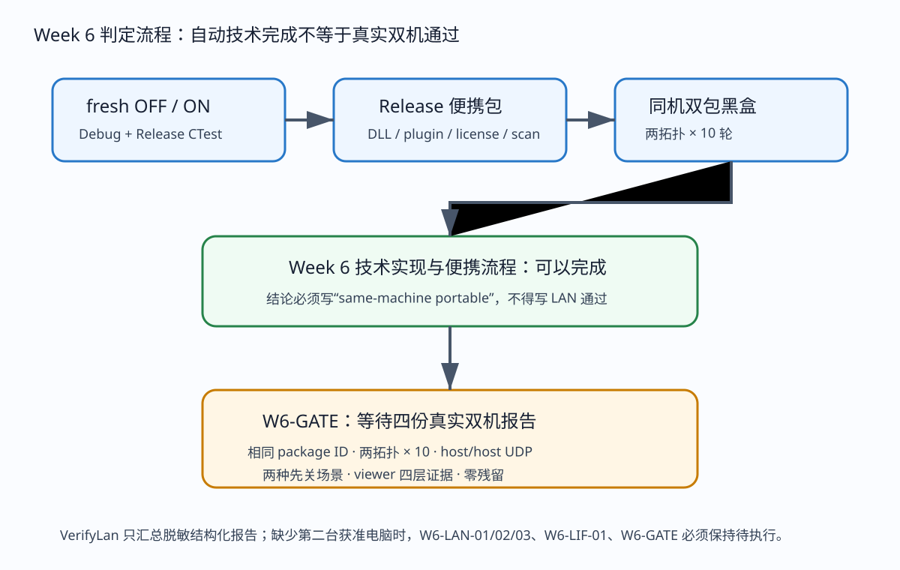
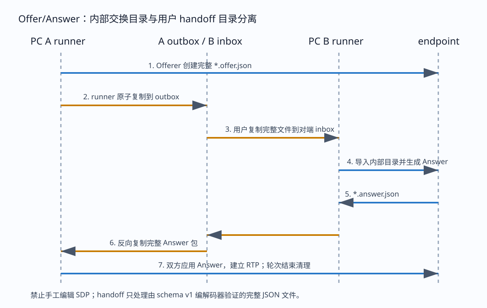
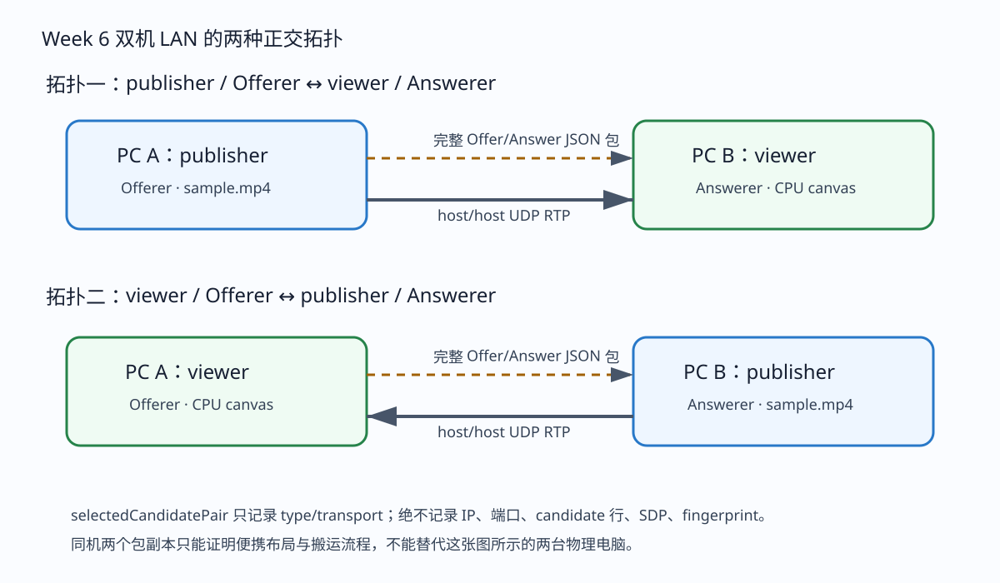
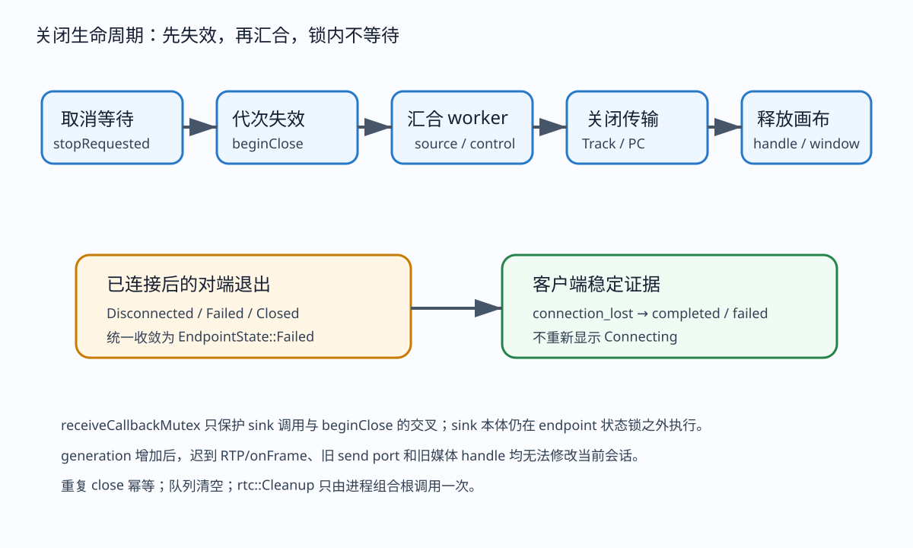

# WebRTC V2 Week 6 独立测试指南：自动脚本版与人工双机版

> 本文可以单独使用。它先说明本周测试的对象和证据层，再给出开发机自动测试、Release 包自检、
> 可选的真实双机两种拓扑、双方退出顺序、报告汇总和排障。2026-08-24 用户确认以最终 ZIP 的
> 本地双实例 20/20 结果作为 Week 6 设计验收，`W6-DESIGN-GATE` 与本阶段 `W6-GATE` 已通过并
> 解锁 Week 7/P2P；物理双机测试保留为延期的环境资格，不再阻塞开发。

## 1. 本周主要测试什么

Week 6 测试的不是“能不能创建 WebRTC 对象”，而是一个完整、可搬运的接收播放闭环。publisher 从包内固定 MP4 读取 H.264，PeerConnection 通过文件 Offer/Answer 建连，viewer 收到 RTP，经官方 depacketizer 得到 Annex-B AU，再进入既有 FFmpeg decoder、capacity-1 mailbox 和 CPU canvas。成功必须同时有连接选中 pair、RTP、AU、decoded、presented 和清理证据。

本周还测试运行布局。开发构建必须报告 `repository`，Release 测试包必须报告 `portable`；包在没有 `.git` 的目录也能工作，所有交换文件只写在包内。selected pair 只包含 type 与 transport；真实双机 LAN 仍只接受 host/host UDP。同机两个包副本可能得到 host/srflx，不能写成物理 LAN 通过，但在当前批准口径下可以作为设计、便携流程和媒体闭环通过的依据。



## 2. 你会得到哪些测试入口

开发仓库入口是 `scripts/webrtc/qualify_week6.ps1`。`Check` 检查 Qt、vcpkg、VS/CMake、FFmpeg 和 state；`SelfTest` 检查脚本语法、占位符负向行为、manifest/report 纯规则和文档/SVG；`Run` 执行 fresh 构建、完整 CTest、Release 打包和同机双包；`VerifyLan` 仍可汇总四份真实双机报告，但现在属于可选物理环境资格，不控制 Week 7 开始；`Status` 查看结果；`Stop` 只停止身份匹配的本轮进程。

打包入口是 `package_week6.ps1`，通常由 Run 调用。它不负责构建，只把已经完成 CTest 的 Release runtime、样本、许可、脚本和指南物化为 stage 与 ZIP。包内入口是 `week6_lan_test.ps1`，两台电脑各运行自己的一侧。包内 runner 的 Check/SelfTest 不需要源码。

Week 4、Week 5 脚本仍保留原入口。本周修改 Week 5 的测试总数判断为“完整 CTest 成功 + 关键测试名称存在”，所以新增 runtime path test 后不会因预计数量变化误报。

## 3. 开发机前置条件

需要 Windows x64、Qt 6.6.1 MSVC kit、vcpkg x64-windows 依赖、带 C++ 工作负载的 Visual Studio 2026、FFmpeg/ffprobe 和仓库 Beta 分支。不要把 Qt 的 MinGW kit 传给 MSVC generator。建议在 PowerShell 5.1 打开仓库根目录，并通过系统环境或当前终端把 `QTDIR` 与 `VCPKG_ROOT` 设为本机真实安装目录，然后先查看：

```powershell
$env:QTDIR
$env:VCPKG_ROOT
```

路径应替换为本机真实安装；不要输入 `<qt-root>`。脚本现在会在 `Test-Path` 前识别尖括号并给出“请替换占位符”，不会再出现“路径中具有非法字符”的底层异常。VS 通常由 vswhere 自动发现，只有多安装选择错误时才传真实 `VsDevCmd.bat`。

开始前执行：

```powershell
git status --short --branch
& scripts/webrtc/qualify_week6.ps1 -Action Check
& scripts/webrtc/qualify_week6.ps1 -Action SelfTest
```

期望工作区状态符合本次交付阶段，Check 输出 prerequisites passed，SelfTest 输出 qualification self-test passed。若 state 已存在，先用 Status 确认，再 Stop；不要直接删除 state。

## 4. 自动脚本版：完整 Run

从仓库根执行：

```powershell
& scripts/webrtc/qualify_week6.ps1 -Action Run `
  -QtRoot $env:QTDIR `
  -VcpkgRoot $env:VCPKG_ROOT
```

Run 首先生成六秒测试视频和三类负向 fixture。主样本必须是 H.264 Constrained Baseline、level 31、1280×720、30/1、has_b_frames=0；ffprobe 不符合立即退出。不要用私人视频替换 sample，因为两台机器必须拥有完全相同的已知编码条件。

然后脚本依次 fresh 配置并全构建 Debug OFF、Debug ON、Release ON。每个目录运行完整 CTest；脚本从 `ctest -N` 记录实际总数，并检查 OFF 的 disabled test、ON 的 endpoint/runtime paths/viewer pipeline 等名称。任何全量测试失败都算 Run 失败，不能只重跑一个绿色测试后手工标记通过。

Release 通过后调用打包器，产生 Git 忽略的 stage 和 ZIP。脚本从 stage 复制出 package-a 与 package-b，每个目录都有 marker、独立 session-exchange、相同 sample 和 DLL。自动 broker 只复制完整 offer/answer 文件。默认两种拓扑各十轮；每轮 viewer 必须产生 RTP/AU/decoded/presented，pair 必须是允许的脱敏类型与 UDP，双方进程退出且交换目录为空。

自动结果位于 `out/webrtc-week6/local-portable-results.json`。关键字段应该是：

```json
{
  "sameMachinePortable": true,
  "lanClaimed": false
}
```

这两个字段必须同时保留。即使二十轮全过，也不能把 `lanClaimed` 改成 true。

## 5. 自动版每层期望证据

构建层：OFF 不生成 WebRTC client/datachannel 依赖；ON 生成测试目标；Release 有 `rtmp_monitor_webrtc_client.exe`、运行 DLL和两个 Qt platform plugin。层依赖脚本不能发现 transport include media/render/ui 或 media include render/ui。

连接层：两侧 JSONL 都有 `runtime_ready`、`description_exported`、`connected`。便携副本的 layout 必须是 portable。connected 有 `selectedCandidatePair`，字段仅 localType、remoteType、localTransport、remoteTransport，日志不能出现 IP、candidate 行、fingerprint 或绝对路径。

媒体层：publisher completed 的 sentAccessUnits 大于零、sendFailures 为零。viewer completed 的 receivedRtpPackets、receivedAccessUnits、submittedAccessUnits 大于零，decoded/presented 为真。测试还需要 `frame_decoded`、`frame_presented` 事件，不能只依赖 completed 汇总。

画面层：viewer pipeline C++ 测试读取 framebuffer，宽高有效、mailbox sequence 和 rendered/presented 增加、像素非空非黑。同机黑盒运行使用 offscreen，不能代替人工肉眼，但证明 Qt plugin 和 CPU canvas 真实执行。

生命周期层：endpoint 测试关闭一端后，对端在 libjuice 有界失联检测内变 Failed，sink 计数不再增加，重复 close 后队列为零。便携轮次结束没有 owned PID、state 或交换 JSON。桌面窗口先关仍在人工版执行。

## 6. 自动版快速检查与只看状态

只检查工具：

```powershell
& scripts/webrtc/qualify_week6.ps1 -Action Check
```

只检查脚本纯逻辑：

```powershell
& scripts/webrtc/qualify_week6.ps1 -Action SelfTest
```

查看最近本机结果：

```powershell
& scripts/webrtc/qualify_week6.ps1 -Action Status
```

停止受管资格进程：

```powershell
& scripts/webrtc/qualify_week6.ps1 -Action Stop
```

Stop 不会按名称杀死所有 client；它读取 state 中 PID、路径和启动时间，三者匹配才停止。若身份不匹配会保留 state 并报错，此时人工确认，不要强删别人的进程。

## 7. Release 包的独立自检

从 `out/packages/webrtc-week6` 找到 ZIP，复制到一个全新本地目录并解压。包根应直接看到 executable、manifest、runner、common modules、TESTING_GUIDE、DLL、platforms、webrtc-assets 和 licenses。原始 ZIP 不应含 logs、results、handoff、session-exchange 或 state。

在包根执行：

```powershell
& .\week6_lan_test.ps1 -Action Check
& .\week6_lan_test.ps1 -Action SelfTest
.\rtmp_monitor_webrtc_client.exe --help
```

Check 验证 manifest、client、sample 和 qwindows/qoffscreen；SelfTest 验证 Release manifest 合同；help 应列出 media-role、signaling-role、source 和 timeout，不应再写 Week 5。非法 viewer source 应返回退出码 2 与 `invalid_arguments`。

包扫描应确认没有 PDB、LIB、EXP、源码、CMake cache、开发机绝对路径。licenses 至少含 Qt、FFmpeg、libdatachannel、libjuice、libsrtp、OpenSSL。manifest 的 sourceCommit 要与生成包的干净 Git 提交一致，configuration 为 Release，sample 属性与 ffprobe 相符。

## 8. 人工双机版：网络和目录准备

准备两台获准 Windows x64 电脑，位于同一个允许点对点 UDP 的局域网。避免访客 Wi-Fi 的客户端隔离、不同 VLAN 和 VPN 虚拟网卡。不要使用公网 IP、云主机或未授权设备。两台电脑从同一个 ZIP 分别全新解压，因此 packageId 相同；不要把已经运行过并含日志的目录复制给另一台。

PC A 与 PC B 都执行包内 Check/SelfTest。若 Windows 防火墙首次询问，只按组织规则允许该 executable 在当前受控专用网络；不要关闭整个防火墙。两台电脑都打开包根 PowerShell 和资源管理器中的 `handoff/outbox`、`handoff/inbox`。

文件搬运规则只有一条：看到 outbox 中完整 `UUID.offer.json` 或 `UUID.answer.json` 后，复制整个文件到对端 inbox，保持文件名，不打开、不编辑、不复制一段文本。内部 session-exchange 由 runner 管理，用户不要直接操作。



## 9. 人工拓扑一：publisher/Offerer 对 viewer/Answerer

PC A：

```powershell
& .\week6_lan_test.ps1 -Action Run `
  -MediaRole publisher -SignalingRole offer `
  -EnvironmentId PC-A -Rounds 10
```

PC B：

```powershell
& .\week6_lan_test.ps1 -Action Run `
  -MediaRole viewer -SignalingRole answer `
  -EnvironmentId PC-B -Rounds 10
```

先启动 PC A。A outbox 出现 offer 后复制到 B inbox，再启动或保持 B runner；B outbox 出现 answer 后复制到 A inbox。连接后 B 应显示动态 1280×720 画面，A 发送六秒样本。每一轮按 runner 提示搬运新文件，不能复用上一轮 UUID。

观察 B 窗口是否动态、非黑、可拖动、可最小化恢复。观察双方最终退出。十轮后 A 生成 `PC-A-publisher-offer-normal.json`，B 生成 `PC-B-viewer-answer-normal.json`。viewer 报告每轮 RTP/AU/decode/present 都通过；双方 pair 应 host/host UDP。

## 10. 人工拓扑二：viewer/Offerer 对 publisher/Answerer

PC A：

```powershell
& .\week6_lan_test.ps1 -Action Run `
  -MediaRole viewer -SignalingRole offer `
  -EnvironmentId PC-A -Rounds 10
```

PC B：

```powershell
& .\week6_lan_test.ps1 -Action Run `
  -MediaRole publisher -SignalingRole answer `
  -EnvironmentId PC-B -Rounds 10
```

本拓扑仍由 PC A 先产生 offer，但媒体从 B 流向 A。若拓扑一通过、本拓扑二失败，优先检查 SDP direction 与 Answerer 的 SendOnly Track，而不是把问题归到网络或 decoder。A viewer 的画面和四层证据要求与前一拓扑相同。

十轮后收集 `PC-A-viewer-offer-normal.json` 和 `PC-B-publisher-answer-normal.json`。现在四份主要报告覆盖所有媒体/信令组合。不要把两个 viewer 报告混成一份，也不要修改 packageId。



## 11. 人工生命周期一：viewer 先关闭

重新使用全新轮次或复制出的测试目录，双方分别用相同角色启动连接。viewer 出现动态画面后，关闭 viewer 窗口或按 runner 指定的 viewer-first 操作。记录关闭时间。viewer 自身应取消等待、使 endpoint generation 失效、汇合 worker、关闭媒体 handle和画布；publisher 应在有界时间观察 Track/PeerConnection 失败并退出，不能永久留后台。

执行双方 Status：

```powershell
& .\week6_lan_test.ps1 -Action Status
```

应显示 idle。检查 session-exchange、handoff/inbox、handoff/outbox 不含 JSON。若进程仍在，执行 Stop 并把该场景记为失败，不要把强制停止当通过。

报告 lifecycle 应为 viewer-first；同时在测试记录表写窗口是否响应、对端是否出现 connection_lost/终态、总收敛时间和残留。报告不需要 IP。

## 12. 人工生命周期二：publisher 先关闭

连接和出画后先关闭 publisher 侧进程。viewer 的 RTP 计数停止增长，已有画面证据保留；libjuice 失联检测后 endpoint 进入 Failed，客户端可发 `connection_lost`，不能回到长期 Connecting。viewer 最终退出后双方 Status 必须 idle，交换与 state 归零。

publisher 的 sample 自然结束也会关闭，但人工场景应在播放期间主动先关，以区别正常文件结束。记录关闭前 viewer 是否已有 frame_presented，否则无法证明是“已连接后的对端退出”。若三十五秒左右才收敛，属于当前底层默认检测边界；超出 runner timeout 则失败并保留脱敏日志。



## 13. 可选：汇总真实双机报告

把四份 normal 主要报告复制到开发机一个本地结果目录。不要放同机自动结果，不要放重复角色，不要放原始 offer/answer。执行：

```powershell
$resultRoot = Join-Path $env:USERPROFILE 'webrtc-week6-lan-results'
& scripts/webrtc/qualify_week6.ps1 -Action VerifyLan `
  -ResultRoot $resultRoot
```

VerifyLan 要求正好四个角色组合、相同 packageId、每份 roundsPassed 等于 roundsRequested、cleanupPassed、每轮 host/host UDP，viewer 每轮有 RTP/AU/decoded/presented。缺任一项仍输出历史固定文字 `W6-GATE blocked`。在 2026-08-24 的新验收口径下，它表示物理 LAN 资格未完成，不会推翻 `W6-DESIGN-GATE`，也不阻塞 Week 7。

当前没有第二台获准电脑时，不运行伪造报告，不把同机文件复制到结果目录。正确记录是：
`W6-GATE=通过（本地双实例设计验收）`，`W6-PHYSICAL-LAN=延期/未验证`。

## 14. 测试记录表

每次人工测试建议填写：日期时间、packageId、PC-A/PC-B OS、拓扑、轮次、Offerer、publisher、viewer、动态画面、窗口响应、selected pair、RTP、AU、decoded、presented、退出顺序、收敛秒数、进程残留、交换文件残留、报告文件。IP、用户名、完整路径、SDP 不填写。

推荐判定：单轮只有双方 connected 但 viewer 不出画，失败；viewer 出画但 pair 非 host/host UDP，媒体功能可观察但物理 LAN 资格失败；所有轮次过但生命周期残留，物理 W6-LIF 失败；四份报告不齐，`W6-PHYSICAL-LAN` 未验证；自动同机 20/20 且没有第二台时，按当前批准口径判定设计门禁通过、物理 LAN 延期。

## 15. 排障：出现 Qt 平台插件弹窗

错误文本通常是“no Qt platform plugin could be initialized”。先检查包根 `platforms/qwindows.dll` 和 `qoffscreen.dll`，确认使用 Release 插件而非带 d 后缀 Debug 插件。不要把 plugin DLL 平铺到根。运行 Check；若文件存在仍失败，检查 Qt6Core/Gui/Widgets DLL 是否来自同一 Qt 6.6.1 kit，不要混用 MinGW/MSVC。

自动化使用 `QT_QPA_PLATFORM=offscreen`，人工桌面不要长期设置该变量，否则窗口不会正常显示。新开 PowerShell 或执行 `Remove-Item Env:QT_QPA_PLATFORM`。Week 5 曾在 `--help` 前创建 QApplication，因此 help 也可能触发插件；本包把插件部署当硬门禁，不能用“只测 publisher headless”绕过。

## 16. 排障：占位符与工具发现

若提示替换 QtRoot/VcpkgRoot，查看环境变量：

```powershell
$env:QTDIR
$env:VCPKG_ROOT
Test-Path (Join-Path $env:QTDIR 'lib\cmake\Qt6\Qt6Config.cmake')
```

不要给路径加尖括号。若 CMake 提示没有 Visual Studio 18 generator，说明调用的是 PATH 上旧 CMake；资格脚本应使用 vswhere 找到 VS2026 自带 CMake。若 MSBuild 在沙箱/受限账户下无法读取 Windows SDK 用户目录，在正常开发终端运行并确认组织权限，不要改 CMakeLists 绕过 SDK 检测。

Qt 检测到 MinGW kit 时，把 QTDIR 改为 `msvc2019_64` 或本机等价 MSVC kit。vcpkg toolchain 必须存在 `scripts/buildsystems/vcpkg.cmake`，triplet 为 x64-windows。

## 17. 排障：协商与 handoff

Offerer 没有 description_exported：看其 failed error，常见 sample 缺失、unsafe_path 或库失败。outbox 没文件但日志有 exported，检查 runner 是否在包根、内部 session-exchange 权限。Answerer 报 not_found 是尚未收到 offer；ambiguous_input 是 inbox/内部目录有多个有效 offer，Stop 清理后重新开始。

复制时不要改变后缀。Offer 必须到 Answerer inbox，Answer 必须回原 Offerer inbox。不要双向复制整个目录，这会把自己生成的文件回灌。每轮 UUID 不同；若看到旧文件，双方 Stop 并确认三处目录为空。

`incompatible_media` 时不要编辑 SDP。确认双方是同一 packageId、角色组合互补，且没有拿 Week 2 probe 文件混入。原始 SDP 含敏感协商信息，不上传。

## 18. 排障：connected 但没有画面

先看 viewer `receivedRtpPackets`。为零说明 Track/UDP 数据未到，检查 publisher sentAccessUnits、Windows 防火墙、局域网隔离和角色方向。RTP 大于零而 receivedAccessUnits 为零，检查 PT 102、H.264 packetization 和丢包；不要直接怀疑 canvas。

AU 大于零但 submitted 为零或 receiveDrops 增长，检查首个当前代 SPS/PPS/IDR、4 MiB 上限和容量恢复。submitted 大于零但 decoded=false，检查 FFmpeg DLL 与解码错误。decoded=true 但 presented=false，检查 mailbox sequence、UI 线程、CPU canvas 和平台插件。framebuffer 黑而计数增长属于画面层失败，保留 viewer pipeline/日志证据。

动态 sample 每秒有关键帧，容量丢弃后应在下一关键帧恢复。如果只第一轮出画，重点检查 generation/参数集缓存是否跨轮清理。

## 19. 排障：selected pair 不符合 LAN

pair 缺失时资格失败，即使 connected。pair 为 host/srflx 在同机自动测试可以接受但不能声明 LAN。真实双机出现 srflx/relay/tcp 时，确认两台是否真的同一二层/可路由私网、是否经 VPN、代理、热点或不同 VLAN；关闭未授权虚拟网络后重试。

不要改报告、转换函数或 VerifyLan 允许集合。Week 6 范围没有 TURN，relay 不应作为 LAN 通过。日志只给类型，不给地址；若需要网络管理员排查，由用户在组织批准的本机工具中检查，不把地址写进仓库。

## 20. 排障：退出或残留

Status 有进程时先核对角色与开始时间。Stop 会尝试窗口关闭，必要时只强制终止身份匹配进程。Stop 后检查 state 是否删除、交换和 handoff JSON 是否清空。logs/results 可以保留，但下一轮文件名应独立。

viewer 先关后 publisher 长期运行，说明对端断线或 source stop 收敛有问题；publisher 先关后 viewer长期 Connecting，说明 post-connected Disconnected 没映射终态。迟到 frame 导致关闭后计数增加，说明 generation/callback 失效回归。以上都属于代码缺陷，记录角色、事件顺序和相对时间，不用原 SDP。

## 21. 最终验收清单

- 开发机 Check/SelfTest 通过。
- fresh Debug OFF、Debug ON、Release ON 全构建与完整 CTest 通过，实际数量写入结果。
- Release stage/ZIP 包含必需 DLL、plugin、sample、manifest、runner、指南和许可，无开发产物。
- 同机 package A/B 两拓扑各十轮通过，结果明确不声称物理 LAN。
- `W6-DESIGN-GATE` 与本阶段 `W6-GATE` 标记为通过，Week 7/P2P 解锁。
- 可选物理资格：PC A/PC B 使用同一 packageId，四个角色组合各十轮。
- viewer 每轮有 RTP、AU、decoded、presented 和动态非黑画面。
- 可选物理资格：真实双机每轮 selected pair 为 host/host UDP。
- 可选物理资格：viewer 先关、publisher 先关均有界收敛，无 owned process/state/交换文件。
- VerifyLan 聚合四份报告通过后，更新 `W6-PHYSICAL-LAN`，不再控制设计门禁。

完成自动项但未完成双机项时，当前最终写法是：“Week 6 技术实现、便携包和本地双实例设计门禁通过，Week 7/P2P 已解锁；真实双机 LAN 环境资格延期且未验证。”

## 22. 自动测试内部检查表：OFF 配置

OFF 不是简单“不运行 WebRTC 测试”。配置阶段必须完全不查找或链接 libdatachannel，不创建 `rtmp_monitor_webrtc_client`、publisher peer、viewer pipeline 或 runtime path test。全目标构建后，产品 executable 目录不能出现 datachannel、juice、srtp、WebRTC OpenSSL 副本和 webrtc-assets。`rtmp_monitor_webrtc_disabled_test` 会检查这些禁止产物；层依赖测试仍运行。

执行者可以用 `ctest -N` 观察 OFF 测试列表，但最终判定以完整 CTest 退出码为准。OFF 数量可能因仓库其他合法测试增加而变化，所以不再要求固定三十九；必须存在 disabled test、H.264 contract 与既有媒体/UI/设备回归。若 OFF 意外编译 runtime paths，说明 CMake source membership 放错了作用域，即使它只依赖 Qt Core也要修复，因为默认产品不应携带测试客户端入口。

OFF 构建失败时不要临时把 `RTMP_MONITOR_ENABLE_WEBRTC=ON` 当解决方案。先看新增 include 是否出现在无条件 target、公共 header 是否把 rtc 类型泄漏给普通产品、复制 DLL post-build 是否错误挂到主程序。修复后删除/`--fresh` 配置，避免旧 cache 让结果失真。

## 23. 自动测试内部检查表：ON Debug

ON Debug 是最适合定位生命周期问题的配置。endpoint test 会跑 publisher Offerer 与 publisher Answerer 两条真实 RTP 路径。每条先验证 H.264 SDP、candidateTypes、selectedPair 安全字段，再发送含 SPS/PPS/IDR 的关键 AU，等待 sent/RTP/submitted。关闭 sender 后最多等待三十五秒让 receiver 进入 Failed，然后观察 sink 不再增加，双方重复 close。

runtime paths test 使用临时目录造三种布局。伪仓库必须同时有 CMakeLists 和 `.git` 目录；portable marker 放在 app dir 后要覆盖仓库发现；无 marker 且不在仓库必须 Invalid。重复调用结果一致，sample 指向 app/webrtc-assets。测试不创建真实 session store，因此能快速明确路径政策。

viewer pipeline test 需要 offscreen plugin 和 FFmpeg Debug DLL。它不是 mock：真实 endpoint 发 RTP，真实 decoder 解 AU，真实 mailbox/canvas 出 framebuffer。若该测试失败但 endpoint 通过，故障在 transport sink 之后；若 endpoint 自身失败，先修下层。所有 WebRTC 网络测试串行，避免端口/全局 Cleanup 互相影响。

## 24. 自动测试内部检查表：ON Release 与打包

Release 使用同一源码但链接 Release Qt/vcpkg DLL，平台插件不带 d。完整 CTest 能发现只在优化构建出现的竞态，也证明测试 executable 运行依赖闭合。打包器只接受 Release client 存在后运行；如果输入 build 不是 Release，manifest configuration 与 plugin 检查会阻止发布。

stage 文件表在 manifest 写入前枚举，路径统一为相对包根，size 为字节。manifest 自身不列入 files，以避免自引用大小。sourceCommit 必须是完整四十位 Git 对象，packageId 使用前十二位便于人工比对。sample 再次 ffprobe，不能只信开发机生成阶段。许可缺失即失败，而不是生成空 notice。

ZIP 应从 stage 内容压缩，使解压后根直接是 executable，而不是多套一层不可预期目录。资格从 stage 全新复制 A/B，也可以额外从 ZIP 全新展开做结构比较。扫描扩展名和目录名时大小写不敏感，任何 PDB/LIB/EXP、CMakeCache、源码、日志/state/session 都应中止。不要删除命中后继续宣称原包通过；重新打包并重扫。

## 25. 同机双包二十轮的逐轮判定

每轮开始先确认 A/B exchange 没有 JSON。Offerer 进程启动后，broker 等一个 `*.offer.json`；等待超时是信令导出失败。复制到 Answerer 后启动对端，等一个 `*.answer.json`；复制回 Offerer。因为 store 使用原子最终文件，broker 不读取临时文件，也不逐字节跟随写入。

两进程在四十五秒外仍未退出算超时。退出码都为零后，两个 runtime_ready 都必须 portable。viewer 找到 connected/completed，selected pair transport 双方 udp、类型在 host/srflx/relay；viewer 接收/解码/呈现全真。publisher completed 的发送证据也应审查。stdout 与 stderr 同时过敏感模式扫描。

结束时客户端应自行删除它使用的 offer/answer；broker不靠强制清理掩盖残留。只有断言目录为零后下一轮才开始。两拓扑交替执行能快速暴露角色文件串线。二十轮结果数组每项有 topology、round、passed 与安全类型，任何一项失败总控退出非零，不生成绿色摘要。

## 26. 双机操作的推荐节奏

第一次不要直接十轮。双方先 `-Rounds 1` 熟悉文件方向，确认动态画面和报告字段；这是一轮预演，不计最终十轮。然后删除预演解压目录，从原 ZIP 重新解压两个干净目录，再开始正式十轮。这样不会把手工试错遗留混入资格。

每轮建议由 PC A 操作者口头报“Offer 已出”，复制到 B inbox；PC B 报“Answer 已出”，复制回 A。双方等待当前轮进程结束并确认 runner进入下一轮，再搬新文件。不要提前复制空目录，不要用同步盘自动双向同步，因为延迟、冲突副本和回灌会破坏唯一输入假设。

画面观察由 viewer 所在电脑负责，另一侧记录 publisher 退出。每轮至少观察两秒动态变化，不以窗口一闪而过算通过。十轮中可在不同轮拖动/最小化窗口，但不要同时改变网络。若要测试退出顺序，单独场景执行，不混入 normal 十轮，确保失败能归因。

## 27. 如何阅读 package runner 报告

顶层 schemaVersion 必须一，packageId 与 manifest 相同；environmentId 只应 PC-A 或 PC-B；OS/architecture 用于确认两台环境而不记录机器名。mediaRole/signalingRole/lifecycle 描述这一份报告，roundsRequested 与 roundsPassed必须相等，cleanupPassed 为真。

rounds 数组每项包含序号、passed、pair 四字段和 viewer 证据。publisher 侧的 viewer 字段可以为零/false，不因此失败；viewer 侧必须大于零/真。pair 四字段在双方视角本地/远端会互换，但都必须 host/host、udp/udp。若某轮 selected pair 缺失，字段为空且 passed false。

报告只保留汇总，不等同原始日志。人工窗口响应和关闭收敛秒数可放在单独记录表；不要手改 runner 报告塞备注，因为 VerifyLan按固定合同解析。若需要重跑一份角色，使用全新目录和同一原 ZIP，替换整份失败报告，不只修改 roundsPassed。

## 28. 如何证明“非黑画面”而不依赖肉眼

C++ viewer pipeline 创建 CPU canvas 后获取 framebuffer，检查宽高与像素缓冲非空，并遍历像素确认存在非黑内容。testsrc2 本身包含多个颜色和运动区域，因此这个断言能排除只清屏、只画背景或 decoder 输出空 frame。rendered/presented 计数与 mailbox sequence 还要增加，避免拿旧 buffer 充当新画面。

自动黑盒不把截图写入 Git，也不读取用户屏幕；它依赖内部只读测试证据。人工版则肉眼确认动态性、窗口响应和尺寸。两者互补：非黑 framebuffer 不能证明窗口没有卡死，肉眼看到一帧不能证明 generation、容量恢复和每轮计数。

若自动非黑失败，先运行 viewer pipeline 单测输出具体断言，不要加入随机 sleep。确认 sample 是 testsrc2、decode frame pixfmt转换正确、mailbox reader拿到当前 sequence。若人工黑屏但自动通过，检查 qwindows 与显卡/远程桌面环境，测试固定 CPU canvas因此不需要 OpenGL。

## 29. 容量丢弃和关键帧恢复测试说明

测试延迟下游接受，让 receive sink 返回 DroppedCapacity。此时 pipeline 必须丢弃缓存参数集并进入等待恢复；后续非 IDR 即使结构合法也不能 submit。测试再发送新的当前代 SPS、PPS、IDR，允许前置参数集后恢复，decoder 最终输出非黑帧。若只在协商前延迟 publisher启动，那只是晚启动，不是晚加入/背压测试，不能替代。

畸形 AU 包括没有 start code、空 NAL 或越界结构，超限是大于 4 MiB。它们增加 invalid/receiveDrops 并 reset。timestamp 测试跨 32 位回绕仍单调。generation 改变后旧 pipeline结果、旧 send port 和旧 handle都被拒绝。重复 close测试队列清空、状态 Closed、无死锁。

这些单元/集成测试让人工测试不必故意制造每种字节级故障。人工主要验证真实 OS、网卡、进程、窗口和文件搬运，自动化负责可重复边界。

## 30. 日志与隐私检查的实际做法

每个进程 stdout 是 JSONL，stderr 单独文件。安全扫描同时读取二者，禁止 candidate、fingerprint、ICE 凭据、stun/turn、token、RTMP URL 和盘符绝对路径。state 文件只存 executable 绝对路径用于本机进程身份，但它位于受管运行目录，不进入报告、ZIP 或 Git；发布扫描必须确认 state 不在包。

用户反馈时首选 `results/*.json`。若必须附日志，先运行仓库扫描或人工确认没有禁止模式；不要附 session-exchange、inbox/outbox 中的 Offer/Answer，因为它们包含完整 SDP。不要截图带 IP 的系统网络面板。package manifest可以附，因为它只有相对路径、大小、版本和提交。

日志出现绝对开发路径往往来自 Qt plugin loader或未收敛 PATH。修复运行布局/环境，而不是只在最终字符串上替换。typed selected pair避免地址从源头进入事件，是本周最重要的输出边界。

## 31. 失败后怎样保留最小证据并安全重试

先不要反复点击启动。双方 Status，记录哪个 PID 仍活、哪个角色、相对时间。复制 runner report和stdout/stderr到本地故障目录，但不复制信令 JSON。执行 Stop，让脚本验证并关闭 owned process；检查三处 JSON 目录为空。若 Stop 报身份不匹配，停止自动操作，人工核对进程。

记录失败层：工具/构建、包启动、offer、answer、connected、RTP、AU、decode、present、disconnect、cleanup。记录拓扑与轮次、哪台是 publisher/Offerer；不要只写“WebRTC失败”。确认问题可复现后，从原 ZIP 新解压，保持网络条件，只重跑最小一轮。偶发一次与连续复现要区分。

代码修复后必须重新提交、重新 Release 构建和打包，packageId/sourceCommit 会变化。旧报告不能与新报告混合，VerifyLan会因 packageId不同拒绝。不得仅替换一个 DLL 继续沿用旧 manifest。

## 32. Week 4/Week 5 回归步骤

Week 6 完整结果前执行：

```powershell
& scripts/webrtc/qualify_week4.ps1 -Action SelfTest
& scripts/webrtc/qualify_week5.ps1 -Action SelfTest
```

在时间和环境允许时再分别 Run。Week 4 验证固定 publisher 与测试 peer、样本负向项、受管 PID/交换文件；Week 5 验证同一个 client 的两种媒体/信令组合、viewer四层证据和 offscreen plugin。Week 6 改动 selected result、runtime路径和共享脚本，因此两个旧周次都可能受影响。

回归日志同样扫描 stdout/stderr。Week 5 不要求旧的 44 总数，而要求全 CTest和关键名称。若旧脚本因新 `runtime_ready`/`connection_lost` 多事件失败，脚本应该只等待稳定必需事件，不依赖严格行数；不要删除新事件来迎合脆弱测试。

## 33. 人工验收记录模板示例

可以在本地文本中为每轮写：`拓扑=publisher-offer；轮次=3；A=publisher/offer；B=viewer/answer；动态画面=是；窗口响应=是；pair=host/host udp；RTP>0；AU>0；decoded=是；presented=是；publisher自然结束；双方idle；交换残留=0；报告=...`。生命周期写主动关闭者、关闭时画面是否已出现、对端终态秒数、是否 connection_lost、是否需 Stop。

失败示例：`拓扑=viewer-offer；轮次=2；Offer/Answer完成；connected；pair=host/srflx udp；画面正常；判定=LAN门禁失败；可能环境=PC B启用VPN；未修改报告；清理通过`。这比“能播放所以通过”更诚实，也给后续排查明确方向。

所有记录只使用 PC-A/PC-B，不写人名、机器名和 IP。最终把四份 runner JSON与人工记录表放在 Git 忽略、本地受控目录，VerifyLan 读取 JSON，人工审查记录表。

## 34. 为什么真实双机仍有价值但不再阻塞

自动化可以创建两个进程、两个目录甚至两个虚拟接口，但只要它们位于同一获准主机，就不能证明两台 Windows 的防火墙、网卡路由、文件搬运操作和窗口体验。用回环地址或同机 ICE 结果冒充 LAN 会掩盖最有价值的环境差异。当前执行环境没有第二台获准电脑，也不能未经授权连接外部设备。

因此真实双机仍是有价值的环境资格，但在用户明确接受本地双实例设计证据后，不再作为 Week 7 的前置条件。未来执行双机时，结构化报告仍让开发者无需接触地址/SDP即可判定；通过则更新 `W6-PHYSICAL-LAN`，失败则作为网络环境或后续修复输入，不回写为“Week 6 设计失败”。

## 35. 命令退出码与事件顺序速查

参数解析失败退出二，路径/信令本地文件类失败通常退出三，WebRTC/媒体资源类失败退出四，成功退出零。脚本以进程退出码为第一道门禁，再解析事件；不能看到 completed 文本就忽略非零退出。`--help` 应为零且不创建会话文件；viewer 带 source、publisher 缺 source 应为二且只输出 invalid_arguments。

正常 Offerer 的基本顺序是 runtime_ready、description_exported、connected、媒体事件、completed；Answerer 在收到 offer 后才 description_exported。viewer 的 frame_decoded 必须先于 frame_presented。publisher 可能先 publishing 再 completed。对端退出路径在 connected 后可出现 connection_lost；协商超时不应出现 connection_lost，因为从未 Connected。

脚本不要要求事件严格相邻，Qt/UI和worker可能交错输出；应按事件名与证据字段等待。也不要用固定 sleep 代替 description 文件/JSON事件条件。出现 failed 后不应再把同一会话标 completed；cleanup_failed 属于进程全局收尾失败，即使媒体证据完整也不能当完全成功。

## 36. 两台电脑的环境一致性检查

两台必须都是 x64 Windows 并能运行同一 Release executable；不要求 Qt/vcpkg/VS/FFmpeg 开发工具，因为依赖和 sample 已随包。先比较 manifest packageId、sourceCommit、文件数量和 sample 字段，不要按 ZIP 文件名猜版本。若一侧安全软件隔离 DLL、Check 会报告缺文件；从原 ZIP重新解压，不从另一台临时拷单 DLL。

确认系统日期相差不致使信令包新鲜度校验失败。schema v1 使用 UTC 创建/过期时间，时钟严重偏差会显示 expired/not_yet_valid。通过系统正规时间同步修复，不改 JSON 时间。确认两台网络配置允许互访，但测试与报告不记录地址。

远程桌面可以用于操作，但 viewer 画面响应可能受会话影响；最好由现场用户观察实际桌面。若只能远程执行，在记录表标明，动态画面和窗口响应结论限定为该远程会话。不要把一台虚拟机和宿主同机结果默认等价两台物理 LAN；可作为补充，不替代批准口径。

## 37. 报告汇总失败的逐项修复

“四份报告未找到”先列 ResultRoot 下 JSON，移走 local-portable、manifest和其他 JSON，只留四份 runner normal 报告。“package ID 不同”表示混用了不同 ZIP，必须用同一包重跑一侧，不能编辑字段。“角色组合不全”按文件顶层 mediaRole/signalingRole 查缺项，补跑完整十轮。

“roundsPassed 不等于 requested”查看第一个 passed=false 的轮次，按 pair或viewer证据定位；不要只把 Rounds 改小重新生成。“cleanup false”说明进程/交换残留，修复关闭后全重跑该角色。“pair 非 host/host UDP”处理局域网环境，不能放宽 VerifyLan。

VerifyLan 通过只代表结构化四份物理环境报告。仍要人工确认 viewer-first、publisher-first和窗口记录；更新 `W6-PHYSICAL-LAN` 时在 test_results 引用实际命令、日期和材料位置（本地忽略路径即可），不提交原始日志/会话包。

## 38. 最小重跑策略与完整重跑策略

开发中修改纯文档/SVG，可先 SelfTest 文档门禁；修改 runtime paths，先编译/运行 path test和 client help；修改 endpoint，先 endpoint test，再 viewer pipeline；修改脚本，先 PowerShell parser/SelfTest。这样能快速定位，但提交前仍需完整 OFF/ON/Release和旧周回归。

包生成后若只发现 TESTING_GUIDE 拼写问题，也要重新打包，因为 manifest 文件表/size 与 ZIP内容变化；source commit更新后 packageId变化，双机报告需基于最终包。若修改 C++，必须重建所有配置和二十轮同机。若修改 LAN report合同，package runner与 VerifyLan SelfTest都要重跑，已有报告是否兼容必须明确。

真实双机失败后的最小重跑可先一轮验证修复；正式门禁仍要最终包两拓扑各十轮与两种生命周期。不要把调试一轮累加到以前九轮，generation、清理和重复启动要求必须在同一最终构建连续证明。

## 39. 测试完成后的清理与保存

开发机保留 `out/packages/webrtc-week6`、`out/webrtc-week6/local-portable-results.json` 和必要 CTest摘要，构建目录可按空间策略稍后删除。Git status 不应出现 ZIP、sample、logs 或 session，因为 out 已忽略。若出现未跟踪运行产物，先确认 `.gitignore`，不要误提交。

双机侧执行 Stop，确认 Status idle；可删除 session-exchange、handoff和logs，保留 results与人工记录到受控本地结果目录。若要再次测试，推荐从原 ZIP全新解压而不是清理到“看起来干净”。报告发给开发者前做禁止模式扫描，Offer/Answer永久不上传。

最终测试文章和事实结果要分开：本文说明“怎么测/期望什么”；`test_results.md` 只记录本次实际执行的环境、命令、数量和通过/待执行，不把说明书中的预期当实际结果。用户完成双机后只更新事实结果、快照和路线状态，无需改测试方法，除非真实流程发现说明错误。

## 40. 常见错误操作及其正确替代

错误：把 `<qt-root>` 原样粘贴。正确：设置真实 QTDIR 后传环境变量。错误：用 MinGW Qt 配 MSVC。正确：选择 MSVC x64 kit。错误：只复制 SDP 文本。正确：复制完整原子 JSON 文件并保持名。错误：把同机 host/srflx 写成物理 LAN。正确：结果保持同机标记，用于已批准的设计验收，并把物理 LAN 单独标为延期。

错误：connected 就判成功。正确：继续检查 selected pair、RTP、AU、decoded、presented、非黑和清理。错误：进程卡住直接任务管理器结束再写通过。正确：Status/Stop并将生命周期判失败。错误：为通过门禁编辑报告或放宽 host规则。正确：修复环境/代码并重跑最终包。

错误：把运行后的包目录重新压缩分发。正确：始终使用打包器从干净 Release stage产生 ZIP。错误：从另一版本拷 DLL补缺。正确：修复打包源并重新生成 manifest。错误：把 Offer/Answer、IP截图和原日志提交 Git。正确：只留脱敏报告、必要摘要和事实文档。

## 41. 完成判定示例

示例一：OFF/ON/Release、二十轮同机和包扫描全过，没有第二台电脑。判定：Week 6 设计门禁与本阶段 W6-GATE 通过，物理 LAN 延期，允许进入 Week 7。示例二：四份物理报告齐全且 host/host UDP，但 viewer-first留下进程。判定：物理 LAN 媒体轮次通过、物理 W6-LIF失败；不推翻设计通过，但应记录并修复关闭问题。

示例三：两拓扑画面正常，一侧报告 packageId不同。判定：物理资格混包，不可汇总，使用同一ZIP重跑。示例四：同一包、十轮、清理全过，pair为srflx。判定：功能可达但不满足物理纯LAN证据，检查VPN/VLAN。示例五：VerifyLan与人工生命周期均通过。判定：把 `W6-PHYSICAL-LAN` 更新为通过，并记录日期环境和命令。

测试者应始终选择与证据完全对应的最窄结论：设计门禁通过是用户批准的产品验收决定，物理 LAN 仍未验证是环境事实，两者必须同时保留。后续 Week 7/8 可以建立在可复现的本地 20/20 基线上。

最后复核一次：测试命令来自最终提交，Release 包的提交号与 manifest 一致，自动结果明确标注同机；若未来执行物理测试，双方应使用同一个 ZIP 且报告明确标注两台环境。未执行的物理项写“延期/未验证”，不能写成真实 LAN 已通过。

完成后请保存四份脱敏报告与人工记录表，运行一次 Status 确认双方空闲，再关闭终端。若后续反馈问题，请同时注明拓扑、角色、轮次、失败证据层和包编号，这样开发者无需猜测现场步骤即可复现。
