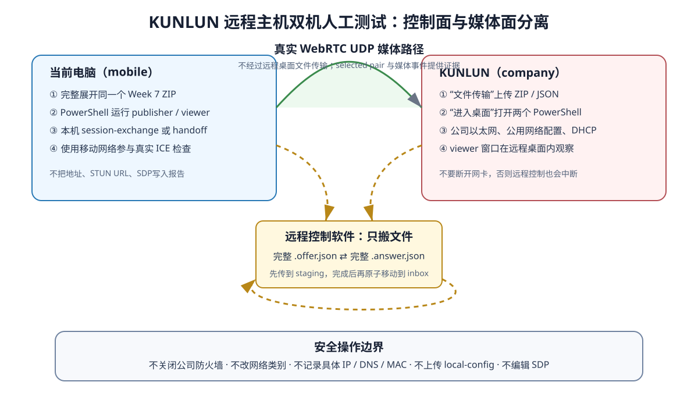

# WebRTC V2 Week 7 双电脑公网手动测试：KUNLUN 远程主机手把手操作手册

> 适用对象：第一次执行本项目双电脑 WebRTC 测试、当前电脑在自己手边、公司电脑通过图形化远程控制软件访问的测试人员。本文把远程控制软件中显示为“KUNLUN”的电脑称为 **KUNLUN**；这只是界面别名，不要求 Windows 计算机名也叫 KUNLUN。文中的按钮名称以用户提供的界面为准：`进入桌面`用于操作远程 Windows，`文件传输`用于在两台电脑之间复制 ZIP 和 JSON 文件。

> 事实边界：本文说明如何执行尚未完成的真实公司网络/移动网络测试。Week 7 本地设计门禁已经通过，但真实公网结果仍必须以本手册运行后产生的报告为准。测试前不能预先写成 `Direct` 或 `NeedsRelay`。

## 1. 先读这一页：你最终要完成什么

本次测试有两台电脑、两条网络和两种角色拓扑：

| 标识 | 实际设备与网络 | 本手册推荐媒体角色 | 主要观察内容 |
|---|---|---|---|
| 当前电脑 | 你手边的电脑，测试时连接获授权的移动网络 | publisher | 启动样本发送、保存本机报告、汇总结果 |
| KUNLUN | 通过远程控制进入的公司电脑，保持公司以太网连接 | viewer | 远程桌面观察动态画面、保存公司侧报告 |

公司侧截图已经能支持以下脱敏描述：以太网、DHCP、公用网络配置、私网 IPv4、1 Gbps 链路。不要把截图里的具体 IPv4、IPv6、网关、DNS 或网卡物理地址复制到 Git、测试报告、聊天记录或结果 JSON。Windows 的“公用网络”是当前事实，不要为了测试擅自改为“专用网络”，也不要关闭防火墙。

你需要完成的最小验收矩阵是：

1. 拓扑 A：当前电脑 `publisher/offer`，KUNLUN `viewer/answer`，正常资格模式连续 10 轮。
2. 拓扑 B：KUNLUN `viewer/offer`，当前电脑 `publisher/answer`，正常资格模式连续 10 轮。
3. 可视拓扑 A：直接运行客户端，在 KUNLUN 远程桌面看到动态 1280×720 测试画面。
4. 可视拓扑 B：信令角色反转，再次在 KUNLUN 看到动态画面。
5. viewer-first：画面已经呈现后先关闭 KUNLUN viewer，确认当前电脑一侧有界结束。
6. publisher-first：publisher 开始发送后先关闭当前电脑 publisher，确认 KUNLUN viewer 不无限显示旧画面。
7. 汇总四份正常角色报告，运行 `VerifyPublic` 得到限定环境结论。



## 2. 三种“测试模式”不要混淆

| 模式 | 启动方式 | 是否显示 viewer 窗口 | 是否生成标准报告 | 用途 |
|---|---|---:|---:|---|
| 包检查 | `week7_public_test.ps1 -Action Check/SelfTest` | 否 | 否 | 检查包是否完整、脚本是否能解析 |
| 资格报告模式 | `week7_public_test.ps1 -Action Run ...` | 否 | 是 | 两种拓扑各 10 轮、生成可聚合报告 |
| 可视窗口模式 | 直接运行 `rtmp_monitor_webrtc_client.exe` | 是 | 否 | 人眼检查动态画面、窗口响应和先关场景 |

资格 runner 在代码中明确设置 `QT_QPA_PLATFORM=offscreen`。所以运行资格命令时没有窗口是正常现象，不是失败。现有测试指南过去把“runner 每轮观察动态画面”写得不够准确；正确做法是先用 runner 取得计数和报告，再用直接客户端模式观察窗口。不要因为资格模式没窗口就修改 Qt DLL，也不要把可视模式的一张截图当作 10 轮资格报告。

## 3. 测试前必须确认的授权与网络安排

在复制包之前，逐项确认：

- 公司允许你在 KUNLUN 上运行这个未签名的内部 Release 测试包。
- 公司允许 KUNLUN 在本次时段进行 UDP/STUN/WebRTC P2P 测试。
- 使用的 STUN 服务已获授权；它不是从仓库或 ZIP 自动提供的。
- 当前电脑可以临时连接获授权的移动网络，例如已获准使用的手机热点。
- 测试不会控制车辆、摄像头或客户设备；样本只来自包内 `webrtc-assets/sample.mp4`。
- 两台电脑都使用同一个 ZIP，不能一台用旧包、一台用新包。
- 测试时有人能观察当前电脑。如果要改变 KUNLUN 网络，必须有现场人员能恢复；仅靠远程控制时禁止断开 KUNLUN 网卡。

远程控制软件本身通过网络维持 KUNLUN 会话。关闭 KUNLUN 以太网、禁用网卡、修改网关或重启网络服务，可能让你立即失去远程访问。Week 7 的“连接后网络变化”只在当前电脑一侧做；除非公司现场有人协助，否则不要在 KUNLUN 上做断网注入。

### 3.1 KUNLUN 已完成的只读网络预检如何使用

另一台电脑已经用只读方式完成网络检查，没有修改网络和防火墙。本文只保留以下脱敏基线：

| 预检事实 | 对 Week 7 的意义 | 不能推出什么 |
|---|---|---|
| 有线千兆网卡、DHCP、私网 IPv4 | KUNLUN 具备稳定的公司侧 IPv4 接口 | 不能证明路由器 WAN 就是公网地址 |
| 没有可用的公网 IPv6 默认路由 | 本轮按 IPv4 ICE 路径观察 | 不能据此评价其他网络的 IPv6 能力 |
| Windows 公用网络、防火墙开启 | 必须保留当前防火墙事实并观察实际结果 | 不能要求关闭防火墙或改网络类别 |
| 至少两个获准的外部 STUN 检查得到 UDP 响应 | UDP/STUN不是全局阻断，适合开始双端实验 | 不等于本项目客户端已经连接成功 |
| 同一本地 UDP 端口访问不同 STUN 时映射端口保持稳定 | 映射行为对打洞是有利迹象 | 不是端点无关映射的完整认证，也不证明一定Direct |
| 至少一层 NAT，是否存在上游NAT仍不确定 | 最终必须使用不同网络的真实peer验证 | 不能仅靠电脑端地址断言是否CGNAT |
| 检查时存在本机代理/VPN进程 | VPN状态必须成为现场记录的一部分 | 不能假设所有UDP必然绕过VPN |

具体公网映射、局域网地址、网关、DNS、代理监听端口和物理地址不写进本手册。它们对复现实验没有必要，还会扩大隐私暴露面。

### 3.2 正式轮次前固定 VPN/代理状态

用户补充说明，预检中的本地代理来自正在运行的 VPN。VPN可能只代理HTTP，也可能通过TUN/WFP或虚拟网卡接管UDP；不能仅凭“系统代理”页面判断本项目媒体包究竟走哪条路径。因此每一组20轮开始前必须选择并固定一种状态：

1. 如果公司政策允许且远程控制不依赖该VPN，退出VPN，等待网络稳定后记录 `VPN=off`。
2. 如果公司政策要求VPN保持运行，就保持当前配置，记录 `VPN=on`，不要为测试绕过企业要求。
3. 同一组拓扑A和拓扑B中不能中途切换VPN。
4. 如果需要比较开/关VPN，必须作为两组完全独立的20轮实验，分别使用新的报告目录；不能混合四份报告。
5. VPN切换可能改变candidate、NAT映射和远程控制稳定性。仅靠远程访问时，切换前确认仍有恢复KUNLUN的方法。

`networkClass=company` 是当前报告schema允许的脱敏类别，它不会自动记录VPN状态。因此必须在第16章人工记录表中单独填写VPN on/off和测试时段。`VerifyPublic=Direct`如果在VPN开启时产生，只能表述为“company网络在该VPN状态下Direct”，不能写成裸公司网络一定Direct。

## 4. 准备两台电脑上的目录

### 4.1 找到最终 ZIP

在当前电脑仓库中找到最新 Week 7 ZIP，名称形如：

```text
RtmpMonitor-WebRTC-Week7-<提交短号>-windows-x64.zip
```

默认生成位置在仓库的 `out/packages/webrtc-week7/`。不要把整个构建目录传到公司电脑；只传最终 ZIP。也不要只传 `rtmp_monitor_webrtc_client.exe`，因为运行还需要 Qt、FFmpeg、libdatachannel、OpenSSL、platform plugin、样本和 PowerShell 模块。

### 4.2 当前电脑解压

打开 Windows PowerShell 5.1。下面命令使用用户桌面，不要求管理员权限。把 `$Week7Zip` 的值改成你实际 ZIP 的完整路径：

```powershell
$Week7Root = Join-Path $env:USERPROFILE 'Desktop\WebRtcWeek7Current'
$Week7Zip = '把这里替换为当前电脑上的实际ZIP完整路径'

New-Item -ItemType Directory -Force -Path $Week7Root | Out-Null
Expand-Archive -LiteralPath $Week7Zip -DestinationPath $Week7Root -Force
Get-ChildItem -LiteralPath $Week7Root
```

如果 ZIP 解压后多了一层以 `RtmpMonitor-WebRTC-Week7-...` 命名的目录，就把 `$Week7Root` 改成真正包含 `package-manifest.json` 的那一层。用下面命令确认：

```powershell
Test-Path -LiteralPath (Join-Path $Week7Root 'package-manifest.json')
Test-Path -LiteralPath (Join-Path $Week7Root 'rtmp_monitor_webrtc_client.exe')
Test-Path -LiteralPath (Join-Path $Week7Root 'week7_public_test.ps1')
```

三行都必须显示 `True`。

### 4.3 用“KUNLUN → 文件传输”上传 ZIP

1. 回到显示 KUNLUN 卡片的远程控制软件首页。
2. 点击卡片下方的 `文件传输`，不要先点“进入桌面”。
3. 在本地一侧找到最终 Week 7 ZIP。
4. 在远程一侧选择 KUNLUN 当前用户桌面或公司允许的临时目录。
5. 选择上传/发送，等待进度明确显示完成。
6. 比较本地 ZIP 和远程 ZIP 的文件大小。大小不同就删除远程残缺文件后重传，不要尝试解压残缺 ZIP。
7. 关闭文件传输窗口，回到 KUNLUN 卡片，点击 `进入桌面`。

文件传输界面在不同版本中可能左右布局相反。判断“本地/远程”必须看窗口标签和路径，不要只凭左边或右边猜测。初次传输的是 ZIP，不是解压后的数十个文件，这样能避免 DLL 漏传。

### 4.4 在 KUNLUN 上解压

进入 KUNLUN 桌面后打开 Windows PowerShell 5.1：

```powershell
$Week7Root = Join-Path $env:USERPROFILE 'Desktop\WebRtcWeek7Kunlun'
$Week7Zip = '把这里替换为KUNLUN桌面上的实际ZIP完整路径'

New-Item -ItemType Directory -Force -Path $Week7Root | Out-Null
Expand-Archive -LiteralPath $Week7Zip -DestinationPath $Week7Root -Force
Get-ChildItem -LiteralPath $Week7Root
```

同样确认三项文件存在：

```powershell
Test-Path -LiteralPath (Join-Path $Week7Root 'package-manifest.json')
Test-Path -LiteralPath (Join-Path $Week7Root 'rtmp_monitor_webrtc_client.exe')
Test-Path -LiteralPath (Join-Path $Week7Root 'platforms\qwindows.dll')
```

全部为 `True` 后再继续。

## 5. 核对两台电脑确实使用同一个包

在当前电脑和 KUNLUN 各自执行：

```powershell
Set-Location -LiteralPath $Week7Root
$Week7Manifest = Get-Content -LiteralPath '.\package-manifest.json' -Raw -Encoding UTF8 |
    ConvertFrom-Json
$Week7Manifest.packageId
$Week7Manifest.sourceCommit
$Week7Manifest.architecture
$Week7Manifest.configuration
```

两边的 `packageId` 和 `sourceCommit` 必须逐字符一致；架构应为 `windows-x64`，配置应为 `Release`。只要 packageId 不同，就停止测试，删除其中一边的展开目录，重新从同一个 ZIP 解压。不要把不同包跑出的成功轮次拼到一个结果目录。

## 6. 在两台电脑上做运行前检查

### 6.1 打开正确的 PowerShell

使用系统自带 **Windows PowerShell**，不是命令提示符。可执行：

```powershell
$PSVersionTable.PSVersion
```

项目按 Windows PowerShell 5.1 验证。若公司电脑只允许 PowerShell 7，也可以先尝试 Check，但最终记录要写明未按验证基线执行。若脚本执行策略阻止 `.ps1`，只能在公司政策允许时对当前进程临时放行：

```powershell
Set-ExecutionPolicy -Scope Process Bypass
```

不要修改 LocalMachine 或 CurrentUser 的长期执行策略。企业策略拒绝时，联系 IT，不要绕过。

### 6.2 执行 Check 和 SelfTest

两台电脑各自执行：

```powershell
Set-Location -LiteralPath $Week7Root
& .\week7_public_test.ps1 -Action Check
& .\week7_public_test.ps1 -Action SelfTest
```

预期分别看到：

```text
Week 7 package check passed.
Week 7 package runner self-test passed.
```

这一步不证明网络可直连，只证明包文件和脚本基本可用。如果出现 Qt platform plugin 错误，先确认 `platforms/qwindows.dll` 与 `platforms/qoffscreen.dll` 都在完整包内。如果提示缺少 `VCRUNTIME140.dll`、`VCRUNTIME140_1.dll` 或 `MSVCP140.dll`，让公司 IT 安装批准的 Microsoft Visual C++ x64 运行库；不要从不可信网站单独下载 DLL。

### 6.3 记录脱敏网络类别

在 KUNLUN 上只确认网络类别，不复制详细地址：

```powershell
Get-NetConnectionProfile | Select-Object InterfaceAlias,NetworkCategory,IPv4Connectivity
```

根据提供的截图，预期公司以太网为 `Public` 类别并具有 IPv4 连接。不要运行会把完整 IP、DNS、网关、MAC 写入日志的收集脚本。当前电脑切换到移动网络后也可执行同一命令，只记录“mobile/已连接”，不保存具体地址。

再人工记录 KUNLUN 的 VPN 状态，不要记录代理端口或进程参数：

```text
KUNLUN VPN：on / off
当前电脑 VPN：on / off
从拓扑A第1轮到拓扑B第10轮是否保持不变：是 / 否
```

如果中途变化，当前四报告集合失去单一环境含义，应清理后重新执行。

## 7. 分别配置获授权的 STUN

两台电脑都要单独配置，配置文件不能互相复制。先在当前电脑执行：

```powershell
Set-Location -LiteralPath $Week7Root
& .\week7_public_test.ps1 -Action Configure
```

脚本出现提示后：

1. 阅读授权提醒。
2. 精确输入大写 `AUTHORIZED`。
3. 在交互提示中输入获授权的 `stun:` URL。
4. 看到 `Authorized STUN configuration stored only in this package runtime directory.`。

再进入 KUNLUN 桌面执行相同命令。STUN URL 不要放在 PowerShell 命令行、环境变量、截图、测试报告或聊天文本中。Configure 会在各自包内创建 `local-config/ice-runtime.json` 和授权记录；这是运行时私有文件，不应通过“文件传输”带回仓库。

如果输入错误，执行 Stop 会删除配置：

```powershell
& .\week7_public_test.ps1 -Action Stop
```

然后重新 Configure。注意 Stop 同时清理会话文件，所以只在没有正在运行的测试时执行。

## 8. 为每台电脑准备两个 PowerShell 窗口

资格测试期间，每台电脑建议打开两个 PowerShell：

- `CONTROL` 窗口：运行 `week7_public_test.ps1 -Action Run`，运行后不要再输入命令。
- `FILES` 窗口：观察 outbox、把已经传完的 JSON 从 staging 原子移动到 inbox。

在两台电脑的 `FILES` 窗口分别执行：

```powershell
Set-Location -LiteralPath $Week7Root
$Week7Incoming = Join-Path $Week7Root 'handoff\incoming-staging'
New-Item -ItemType Directory -Force -Path $Week7Incoming | Out-Null

$Week7Inbox = Join-Path $Week7Root 'handoff\inbox'
$Week7Outbox = Join-Path $Week7Root 'handoff\outbox'
New-Item -ItemType Directory -Force -Path $Week7Inbox,$Week7Outbox | Out-Null
```

为什么要有 `incoming-staging`：远程控制软件上传文件时可能先创建一个未完成文件。若直接传进 `handoff/inbox`，runner 每 100 ms 扫描一次，有机会读取半个 JSON。正确流程是先传到 staging，等远程软件明确显示完成，再用 `Move-Item` 一次移动到 inbox。文件名必须保持不变。

## 9. 资格报告模式：拓扑 A 连续 10 轮

拓扑 A 的角色固定为：

```text
当前电脑 / 移动网络：publisher + offer
KUNLUN / 公司网络：viewer + answer
```

资格模式没有 viewer 窗口。它会自动收集 RTP、AU、decoded、rendered、presented 和非黑 framebuffer 证据。

### 9.1 启动 KUNLUN Answerer

先在 KUNLUN 的 `CONTROL` 窗口执行：

```powershell
Set-Location -LiteralPath $Week7Root
& .\week7_public_test.ps1 -Action Run `
    -MediaRole viewer `
    -SignalingRole answer `
    -NetworkClass company `
    -Rounds 10 `
    -TimeoutSeconds 300
```

它会等待 Offer。命令没有立即结束是正常的。

### 9.2 启动当前电脑 Offerer

马上在当前电脑的 `CONTROL` 窗口执行：

```powershell
Set-Location -LiteralPath $Week7Root
& .\week7_public_test.ps1 -Action Run `
    -MediaRole publisher `
    -SignalingRole offer `
    -NetworkClass mobile `
    -Rounds 10 `
    -TimeoutSeconds 300
```

### 9.3 每一轮复制 Offer

在当前电脑的 `FILES` 窗口观察：

```powershell
Get-ChildItem -LiteralPath $Week7Outbox -File -Filter '*.offer.json' |
    Select-Object Name,Length,LastWriteTime
```

出现一个非零长度的 `.offer.json` 后：

1. 记下完整文件名。文件名前半部分是本轮 session ID。
2. 打开 KUNLUN 远程控制软件的 `文件传输`。
3. 本地源选择当前电脑 `$Week7Outbox` 中这个 `.offer.json`。
4. 远程目标选择 KUNLUN 的 `handoff/incoming-staging`。
5. 开始上传，等待状态显示完成。
6. 回到 KUNLUN 桌面的 `FILES` PowerShell。
7. 执行下面命令确认 staging 中只有本轮 Offer：

```powershell
Get-ChildItem -LiteralPath $Week7Incoming -File -Filter '*.offer.json' |
    Select-Object Name,Length,LastWriteTime
```

8. 确认名称与源文件完全相同后执行：

```powershell
$Week7ReceivedOffer = Get-ChildItem -LiteralPath $Week7Incoming -File `
    -Filter '*.offer.json' | Sort-Object LastWriteTime -Descending |
    Select-Object -First 1
Move-Item -LiteralPath $Week7ReceivedOffer.FullName -Destination $Week7Inbox
```

不要打开 JSON，不要改名，不要复制其中的 SDP 文本，不要把上一轮 Offer 再传一次。

### 9.4 每一轮复制 Answer

KUNLUN 接受 Offer 后，`handoff/outbox` 会出现 `.answer.json`。在 KUNLUN 的 `FILES` 窗口执行：

```powershell
Get-ChildItem -LiteralPath $Week7Outbox -File -Filter '*.answer.json' |
    Select-Object Name,Length,LastWriteTime
```

出现 Answer 后：

1. 在远程控制软件中使用下载方向。
2. 远程源选择 KUNLUN `$Week7Outbox` 中本轮 `.answer.json`。
3. 本地目标选择当前电脑的 `handoff/incoming-staging`。
4. 等待传输完全结束。
5. 在当前电脑 `FILES` 窗口执行：

```powershell
$Week7ReceivedAnswer = Get-ChildItem -LiteralPath $Week7Incoming -File `
    -Filter '*.answer.json' | Sort-Object LastWriteTime -Descending |
    Select-Object -First 1
Move-Item -LiteralPath $Week7ReceivedAnswer.FullName -Destination $Week7Inbox
```

Offerer 接受 Answer 后，本轮开始媒体发送并有界结束。runner 会清理本轮文件并进入下一轮。

### 9.5 如何判断已经进入下一轮

不要按固定秒数猜。用以下三个事实确认：

1. 当前电脑 outbox 中上一轮 Offer 消失。
2. 随后出现一个文件名不同的新 `.offer.json`。
3. KUNLUN 与当前电脑的控制窗口仍在运行，没有显示超时错误。

把新文件名记录为第 2 轮，然后重复 9.3 和 9.4。一直做到第 10 轮。每轮是一次新 session，共需搬运 10 个 Offer 和 10 个 Answer。若不确定文件属于哪一轮，停止当前两侧 runner并从第 1 轮重跑，不要把旧文件试着塞进 inbox。

### 9.6 拓扑 A 完成时应该看到什么

两侧控制窗口最终分别显示 `Week 7 public-test side completed:`。检查报告：

当前电脑：

```text
results/mobile-publisher-offer-normal.json
```

KUNLUN：

```text
results/company-viewer-answer-normal.json
```

在各自电脑执行：

```powershell
$Week7Report = Get-Content -LiteralPath `
    (Get-ChildItem -LiteralPath '.\results' -File -Filter '*-normal.json' |
        Sort-Object LastWriteTime -Descending | Select-Object -First 1).FullName `
    -Raw -Encoding UTF8 | ConvertFrom-Json
$Week7Report.packageId
$Week7Report.roundsRequested
$Week7Report.roundsPassed
$Week7Report.cleanupPassed
```

理想值为相同 packageId、`roundsRequested=10`、`roundsPassed=10`、`cleanupPassed=True`。如果少于 10，不要修改 JSON；保存失败日志用于排障，然后完整重跑该角色。

## 10. 资格报告模式：拓扑 B 连续 10 轮

拓扑 B 只反转 Offer/Answer，媒体仍然从当前电脑 publisher 发往 KUNLUN viewer：

```text
KUNLUN / 公司网络：viewer + offer
当前电脑 / 移动网络：publisher + answer
```

先在当前电脑 `CONTROL` 窗口运行 Answerer：

```powershell
Set-Location -LiteralPath $Week7Root
& .\week7_public_test.ps1 -Action Run `
    -MediaRole publisher `
    -SignalingRole answer `
    -NetworkClass mobile `
    -Rounds 10 `
    -TimeoutSeconds 300
```

再在 KUNLUN `CONTROL` 窗口运行 Offerer：

```powershell
Set-Location -LiteralPath $Week7Root
& .\week7_public_test.ps1 -Action Run `
    -MediaRole viewer `
    -SignalingRole offer `
    -NetworkClass company `
    -Rounds 10 `
    -TimeoutSeconds 300
```

这次 Offer 从 KUNLUN `handoff/outbox` 下载到当前电脑 `incoming-staging`，完成后移动到当前电脑 `handoff/inbox`；Answer 从当前电脑 `handoff/outbox` 上传到 KUNLUN `incoming-staging`，完成后移动到 KUNLUN `handoff/inbox`。仍然每轮只搬一个 Offer 和同 session 的一个 Answer，共 10 轮。

完成后应得到：

```text
KUNLUN/results/company-viewer-offer-normal.json
当前电脑/results/mobile-publisher-answer-normal.json
```

至此四个标准角色报告齐全。注意：资格 runner 仍然没有可见窗口；画面人工观察在下一章进行。

## 11. 可视窗口模式：在 KUNLUN 亲眼看到画面

### 11.1 为什么要另跑一次

标准报告中的 `rendered/presented/nonBlack` 来自真实 CPU canvas，但 runner 使用 offscreen。要证明远程桌面中的人能看到窗口并判断动画、比例和响应，需要直接启动客户端并设置 `QT_QPA_PLATFORM=windows`。这一轮不生成资格 JSON，作用是人工观感和窗口生命周期检查。

直接模式使用 `session-exchange`，不是 `handoff/inbox/outbox`。文件传输仍要先落到 `incoming-staging`，完成后再移入目标电脑的 `session-exchange`。

### 11.2 清理旧会话但保留 STUN 配置

确认资格 runner 已结束，Status 为 idle：

```powershell
& .\week7_public_test.ps1 -Action Status
```

不要执行 Stop，因为 Stop 会删除 STUN 配置。分别在两台电脑执行：

```powershell
$Week7Exchange = Join-Path $Week7Root 'session-exchange'
New-Item -ItemType Directory -Force -Path $Week7Exchange | Out-Null
Get-ChildItem -LiteralPath $Week7Exchange -File -Filter '*.json' |
    Select-Object Name,Length,LastWriteTime
```

正常应为空。如果有旧文件，先确认没有客户端进程，再只删除该目录下的 JSON：

```powershell
Get-ChildItem -LiteralPath $Week7Exchange -File -Filter '*.json' |
    Remove-Item -Force
```

### 11.3 可视拓扑 A：当前电脑 publisher/offer，KUNLUN viewer/answer

在 KUNLUN 新开一个 PowerShell，执行：

```powershell
Set-Location -LiteralPath $Week7Root
$env:QT_QPA_PLATFORM = 'windows'
New-Item -ItemType Directory -Force -Path '.\manual-logs' | Out-Null

& .\rtmp_monitor_webrtc_client.exe `
    --media-role viewer `
    --signaling-role answer `
    --ice-mode stun `
    --timeout-ms 300000 `
    2> '.\manual-logs\kunlun-viewer-answer.stderr.txt' |
    Tee-Object -FilePath '.\manual-logs\kunlun-viewer-answer.stdout.jsonl'
```

该命令会等待 Offer，此时暂时没有画面是正常的。

在当前电脑新开 PowerShell，执行：

```powershell
Set-Location -LiteralPath $Week7Root
$env:QT_QPA_PLATFORM = 'windows'
New-Item -ItemType Directory -Force -Path '.\manual-logs' | Out-Null

& .\rtmp_monitor_webrtc_client.exe `
    --media-role publisher `
    --signaling-role offer `
    --source sample `
    --ice-mode stun `
    --timeout-ms 300000 `
    2> '.\manual-logs\current-publisher-offer.stderr.txt' |
    Tee-Object -FilePath '.\manual-logs\current-publisher-offer.stdout.jsonl'
```

当前电脑 `session-exchange` 出现 `.offer.json` 后，使用“文件传输”上传到 KUNLUN `incoming-staging`。传完后在 KUNLUN 第二个 PowerShell执行：

```powershell
$Week7VisualOffer = Get-ChildItem -LiteralPath $Week7Incoming -File `
    -Filter '*.offer.json' | Sort-Object LastWriteTime -Descending |
    Select-Object -First 1
Move-Item -LiteralPath $Week7VisualOffer.FullName -Destination $Week7Exchange
```

KUNLUN `session-exchange` 随后生成 `.answer.json`。把它下载到当前电脑 `incoming-staging`，传完后在当前电脑第二个 PowerShell执行：

```powershell
$Week7VisualAnswer = Get-ChildItem -LiteralPath $Week7Incoming -File `
    -Filter '*.answer.json' | Sort-Object LastWriteTime -Descending |
    Select-Object -First 1
Move-Item -LiteralPath $Week7VisualAnswer.FullName -Destination $Week7Exchange
```

回到 KUNLUN 远程桌面。成功时 viewer 窗口出现动态 1280×720 `testsrc2` 画面。包内样本约六秒，回答文件复制完成后要立即观察；如果错过画面，等双方退出，清理两个 exchange 后重新跑一轮。

人工检查：

- 画面不是全黑、不是固定不动的单帧。
- 运动区域连续变化，没有明显色块长期停留。
- 画面比例正常，没有被拉伸成窄条。
- 拖动窗口时远程桌面仍响应。
- 最小化再恢复后画布继续有效。
- 关闭按钮能让 viewer 有界退出，不出现 Qt platform plugin 弹窗。

### 11.4 可视拓扑 B：KUNLUN viewer/offer，当前电脑 publisher/answer

双方上轮结束并清空 `session-exchange` 后，在当前电脑先运行：

```powershell
Set-Location -LiteralPath $Week7Root
$env:QT_QPA_PLATFORM = 'windows'
& .\rtmp_monitor_webrtc_client.exe `
    --media-role publisher `
    --signaling-role answer `
    --source sample `
    --ice-mode stun `
    --timeout-ms 300000 `
    2> '.\manual-logs\current-publisher-answer.stderr.txt' |
    Tee-Object -FilePath '.\manual-logs\current-publisher-answer.stdout.jsonl'
```

再在 KUNLUN 运行：

```powershell
Set-Location -LiteralPath $Week7Root
$env:QT_QPA_PLATFORM = 'windows'
& .\rtmp_monitor_webrtc_client.exe `
    --media-role viewer `
    --signaling-role offer `
    --ice-mode stun `
    --timeout-ms 300000 `
    2> '.\manual-logs\kunlun-viewer-offer.stderr.txt' |
    Tee-Object -FilePath '.\manual-logs\kunlun-viewer-offer.stdout.jsonl'
```

这一次先把 KUNLUN 的 Offer 下载到当前电脑 exchange，再把当前电脑的 Answer 上传到 KUNLUN exchange。成功后 KUNLUN 再次显示动态 viewer 画面。该轮证明 viewer 作为 Offerer 时的 receive-only track 和 publisher Answerer 路径没有回归。

## 12. 生命周期人工测试

### 12.1 viewer-first

使用可视拓扑 A 建立连接。必须等 KUNLUN 确实出现动态画面后，再点击 viewer 窗口右上角关闭按钮。记录：

- 关闭发生在已经看到画面之后。
- KUNLUN viewer 进程是否在数秒内结束。
- 当前电脑 publisher 是否出现 `connection_lost` 或有界完成。
- 两边是否没有崩溃弹窗。

如果在 Offer/Answer 完成前就关闭 viewer，这不算 viewer-first 生命周期证据。

### 12.2 publisher-first

重新建立可视拓扑 A。看到当前电脑控制台出现 `publishing` 后，关闭 publisher 控制台对应的客户端进程窗口；不要在任务管理器里按名称批量结束。观察 KUNLUN viewer：它应停止接收并有界退出或报告连接丢失，不应无限显示旧 generation 并假装还在播放。

资格 runner 也支持一轮生命周期报告。需要时双方使用相同 Lifecycle：

```powershell
# viewer-first：双方都传同一个参数；各自角色仍按拓扑 A
-Rounds 1 -Lifecycle viewer-first -TimeoutSeconds 300

# publisher-first
-Rounds 1 -Lifecycle publisher-first -TimeoutSeconds 300
```

上面两行是参数片段，不是可单独执行的命令。应追加到第 9 章两侧完整 Run 命令中。

### 12.3 网络变化

仅靠远程控制时，不要在 KUNLUN 禁用以太网、改 DHCP、重启网卡或切换网络类别，否则远程桌面和文件传输也可能同时中断。若要执行连接后网络变化：

1. 先完成一次可视连接并看到画面。
2. 只在当前电脑一侧切换已获授权的移动网络。
3. 记录客户端是否进入 `Disconnected/Failed/Closed` 或输出 `connection_lost`。
4. Week 7 没有 ICE restart，不期待自动重连。
5. 测试后恢复当前电脑网络，再重新建立新 session。

该场景不记录切换前后的具体地址。如果公司要求验证 KUNLUN 断网，必须安排现场人员，另立测试时段。

## 13. 收集四份正常报告并运行 VerifyPublic

在当前电脑创建一个不提交 Git 的结果目录：

```powershell
$Week7ResultRoot = Join-Path $env:USERPROFILE 'Desktop\WebRtcWeek7PublicResults'
New-Item -ItemType Directory -Force -Path $Week7ResultRoot | Out-Null
```

复制当前电脑的两份报告：

```powershell
Copy-Item -LiteralPath `
    (Join-Path $Week7Root 'results\mobile-publisher-offer-normal.json') `
    -Destination $Week7ResultRoot
Copy-Item -LiteralPath `
    (Join-Path $Week7Root 'results\mobile-publisher-answer-normal.json') `
    -Destination $Week7ResultRoot
```

通过 KUNLUN `文件传输` 下载以下两份到当前电脑结果目录：

```text
company-viewer-answer-normal.json
company-viewer-offer-normal.json
```

结果目录最终只能有这四份正常报告。不要混入 `authorization.json`、`ice-runtime.json`、Offer/Answer、stdout、stderr 或手工编辑的 JSON。核对：

```powershell
Get-ChildItem -LiteralPath $Week7ResultRoot -File -Filter '*.json' |
    Select-Object Name,Length,LastWriteTime
```

回到当前电脑的仓库根目录执行：

```powershell
Set-Location -LiteralPath '把这里替换为当前电脑仓库根目录'
& .\scripts\webrtc\qualify_week7.ps1 `
    -Action VerifyPublic `
    -ResultRoot $Week7ResultRoot
```

分类含义：

- `Direct`：四个角色报告、所有轮次、非 relay UDP pair 和 viewer 媒体证据均满足。
- `NeedsRelay`：只有严格满足双方 srflx、合法双拓扑、ICE 明确 Failed、没有非 relay pair且排除其他错误时才成立。
- `RoleRegression`：四种媒体/信令组合不完整或重复。
- `ConfigurationError`：packageId、轮数、角色、networkClass、清理等报告结构不合法。
- `Inconclusive`：普通超时、忘记搬文件、STUN未观察到srflx、媒体证据不足等，不能据此断言需要 TURN。

无论输出什么，只能写成“该 ZIP、该测试时段、company/mobile 这组网络的结果”。不能推导所有公司网络或所有移动运营商都相同。

不要使用 `chrome://webrtc-internals` 作为本项目验收依据。本项目是原生 Qt/libdatachannel客户端，没有浏览器PeerConnection，因此Chrome页面看不到这两个endpoint。原生资格证据来自 `ice_gathering_completed`、`connected.selectedCandidatePair`、viewer媒体事件和四份报告。

当前Week 7只配置STUN，不包含TURN server、TURN凭据或TCP/TLS relay回退。报告若为`NeedsRelay`，含义是“严格前置下需要后续评估relay”，不是当前包已经走relay。生产环境是否部署TURN、是否开放UDP端口或TCP/TLS 443属于后续独立设计，不能为了本轮通过而加入未经评审的配置。

## 14. 测试结束后的安全清理

先在两台电脑分别检查：

```powershell
Set-Location -LiteralPath $Week7Root
& .\week7_public_test.ps1 -Action Status
```

预期显示 `Week 7 package runner is idle.`。然后分别执行：

```powershell
& .\week7_public_test.ps1 -Action Stop
& .\week7_public_test.ps1 -Action Status
```

Stop 会：

- 停止脚本拥有且身份匹配的客户端进程。
- 清理 `session-exchange`、`handoff/inbox`、`handoff/outbox`。
- 删除 package-local STUN 配置和授权记录。
- 保留结果和日志供你决定是否带回。

手工删除 `incoming-staging` 中剩余的 Offer/Answer前先查看精确文件：

```powershell
Get-ChildItem -LiteralPath $Week7Incoming -File
```

只删除该 staging 目录中的会话 JSON，不要对桌面或包根使用递归通配删除。KUNLUN 上最终只带回脱敏报告；`local-config`、`session-exchange`、`handoff`、原始 SDP和详细网络截图不应离开公司电脑。是否删除整个测试包由公司政策决定。

## 15. 常见问题按现象排查

### 15.1 KUNLUN 上双击 EXE 没反应

不要用双击判断。进入包目录 PowerShell运行 `--help` 或 Check，这样能看到缺 DLL、platform plugin 或执行策略错误。确认是完整展开目录，而不是 ZIP 预览窗口。

### 15.2 runner 一直没有窗口

这是预期行为：Run 强制 offscreen。要看窗口，请按第 11 章直接运行 EXE，不要修改 runner。

### 15.3 Answerer 一直等待

依次检查：Offerer outbox 是否出现文件；远程传输是否完成；文件是否先落 staging；是否移动到 Answerer 的正确 inbox/exchange；文件名是否仍以 `.offer.json` 结尾；双方是否仍在 300 秒时限内。不要把 Offer 放入 Answerer 的 outbox。

### 15.4 Offerer 收到 Answer 后仍超时

检查 Answer 是否来自同一 session。Offer 和 Answer 文件名的 UUID 应对应；不要复用上一轮 Answer。确认两台电脑时间大致正常，但不要因时钟差去修改 JSON。

### 15.5 `srflx_not_observed`

它只说明本轮没有观察到反射候选。检查两边是否运行过 Configure、是否使用 `--ice-mode stun`、授权 STUN 是否支持当前网络、公司 UDP策略是否允许。不要直接写“STUN服务器不可达”，也不要更换为未经授权的公共服务。

### 15.6 Windows 防火墙弹窗

不要关闭防火墙。KUNLUN 当前是公用网络配置，企业策略可能比家庭网络更严格。按公司流程让 IT 为这个内部测试包和测试时段放行必要通信；如果不能放行，保存 `Inconclusive` 事实。不要擅自勾选超出授权的网络类别。

### 15.7 远程桌面掉线

先判断是否误操作了 KUNLUN 网卡或公司网络。如果 KUNLUN 仍在线，重新连接远程桌面并运行 Status。不要在失联状态下反复启动新 runner。若无法恢复，需要现场人员处理，当前轮作废。

### 15.8 连接成功但画面全黑

资格模式看不到窗口，先确认你是否在直接客户端模式。可视模式检查 stdout 是否依次出现 `connected`、`media_received`、`frame_decoded`、`frame_presented`。只有 connected 没有媒体时检查 publisher source、Offer/Answer轮次和网络；有 decoded 没 presented 时检查 Qt窗口/platform plugin。不要把“连接成功”等同“用户看到画面”。

### 15.9 报告 roundsPassed 小于 10

打开对应 `logs/<role>-<signaling>-<round>.stdout.jsonl` 和 stderr，定位具体轮次。报告不能手工补数字，必须在清理后重跑该角色的 10 轮。测试失败日志不要提交 Git；只摘录脱敏事件名和计数到人工记录表。

## 16. 建议的现场记录表

| 项目 | 当前电脑 | KUNLUN | 结论/备注 |
|---|---|---|---|
| packageId一致 |  |  |  |
| Release / windows-x64 |  |  |  |
| Check通过 |  |  |  |
| SelfTest通过 |  |  |  |
| STUN已分别授权配置 |  |  | 不记录URL |
| 网络类别 | mobile | company/Public Ethernet | 不记录地址 |
| VPN状态全程固定 | on/off | on/off | 不记录代理端口 |
| 拓扑A roundsPassed | publisher/offer | viewer/answer | /10 |
| 拓扑B roundsPassed | publisher/answer | viewer/offer | /10 |
| KUNLUN动态画面A | 不适用 |  |  |
| KUNLUN动态画面B | 不适用 |  |  |
| viewer-first | 观察断线 | 先关闭 |  |
| publisher-first | 先关闭 | 观察断线 |  |
| Stop后idle |  |  |  |
| local-config已删除 |  |  |  |
| VerifyPublic分类 |  |  |  |

## 17. 一页操作卡：熟悉流程后照此执行

1. 当前电脑连接移动网络；KUNLUN保持公司以太网，不改“公用网络”。
2. 用 KUNLUN“文件传输”上传同一个最终 ZIP；两端完整展开。
3. 两端 Check、SelfTest，核对 packageId。
4. 两端分别 Configure，交互输入同一获授权 STUN；不复制配置。
5. 两端各开 CONTROL 和 FILES 两个 PowerShell，创建 `incoming-staging`。
6. 拓扑 A：KUNLUN viewer/answer，当前电脑 publisher/offer，双方 `Rounds 10`、`TimeoutSeconds 300`。
7. 每轮完整搬运 Offer 到 KUNLUN staging，再 Move 到 inbox；完整搬运 Answer 回当前电脑 staging，再 Move 到 inbox。
8. 拓扑 B：当前电脑 publisher/answer，KUNLUN viewer/offer；方向反转，继续 10 轮。
9. 资格 runner无窗口；随后按直接 EXE 模式做两次 KUNLUN viewer 可视测试。
10. 画面出现后做 viewer-first；publisher开始发送后做 publisher-first。
11. 不在远程 KUNLUN 上断网；网络变化只操作当前电脑。
12. 下载 KUNLUN 两份正常报告，与当前电脑两份报告汇总。
13. 仓库侧运行 VerifyPublic，记录限定环境分类。
14. 两端 Stop、Status，确认 idle；删除 staging 会话文件和本机配置。

完成上述步骤后，才可以更新 `W7-PUBLIC-NETWORK` 的实际事实。若任一步没有执行，就在记录中明确写“未执行”或“Inconclusive”，不要用本地同机 20/20 或远程桌面截图替代真实双网络报告。
