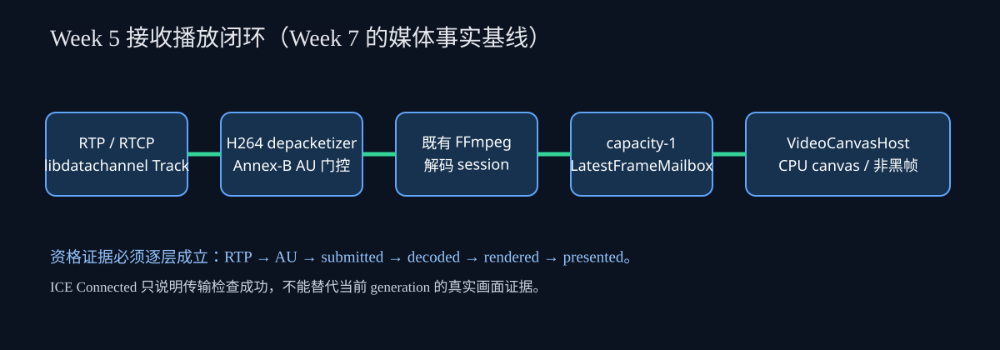
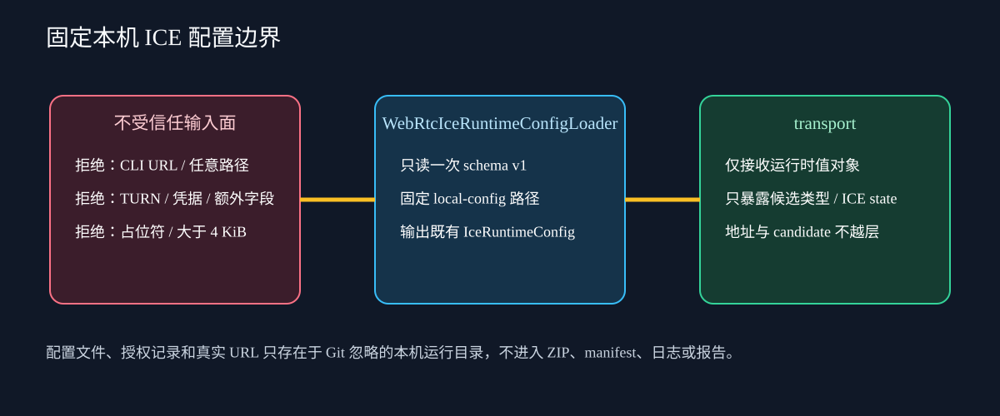

# WebRTC V2 Week 7：本地设计门禁、受限 STUN 配置与公网测试包

> 阅读定位：本文是 Week 7 的实现说明和架构交接材料，完整回顾 Week 5 接收播放闭环、解释 Week 6 便携包如何成为桥梁，再说明 Week 7 为什么增加受限 ICE 配置、地址无关的 transport 事实、本地 STUN fixture 和公网结果分类。正常阅读约二十至三十分钟。本文所说“通过”仅指本地设计门禁；真实公网环境尚未执行。

## 一、结论先行

Week 7 解决的不是“让程序随便连一个公网服务器”，而是建立一套可重复、可审查、不会把错误原因混为一谈的 P2P 资格方法。客户端现在支持 `--ice-mode host|stun`。默认 `host` 完全保持 Week 4～6 行为，不读配置、不发 STUN 请求；显式 `stun` 只从仓库模式或便携模式的固定本机路径读取一个不超过 4 KiB 的 schema v1 文件。这个文件只能包含 `schemaVersion` 和 `stunUrl`，只能使用 STUN，不接受 TURN、用户名、密码、占位符、额外字段、任意路径或命令行 URL。

transport 新增地址无关的 ICE 状态和失败事实。`WebRtcEndpointSession` 记录 `New、Checking、Connected、Completed、Failed、Disconnected、Closed`，候选只保留 `host、srflx、relay` 类型，selected pair 仍只保留两端类型和 `udp/tcp`。原始 candidate、IP、端口、SDP、fingerprint 与 ICE 凭据不离开 transport。描述生成或连接超时时，已经观察到的候选类型和 ICE state 仍随结果返回，因此资格脚本可以区分“没有任何收集事实”“收集完成但没有 srflx”“checks 明确失败”，而不是把所有超时都误写为 Needs Relay。

本轮新增测试专用 `rtmp_monitor_webrtc_stun_fixture`。它直接使用仓库已有依赖 libjuice，只绑定 127/8 回环地址和临时端口，只提供 STUN Binding 所需的服务器行为，不进入 Release ZIP，也不提供 TURN allocation。C++ endpoint 测试会连接该 fixture 并验证真实 `srflx` 候选类型；仓库资格脚本还会从全新 ZIP 展开两个独立副本，把同一份本地配置分别写入两个副本，再运行 publisher/Offerer 与 viewer/Offerer 两种拓扑各十轮。每轮都必须看到配置已加载、`srflx_observed`、非 relay UDP selected pair、RTP、AU、submitted、decoded、rendered、presented 和非黑 framebuffer，并在结束后清空受管进程、交换文件和临时配置。

因此本轮的判定分成两层：`W7-DESIGN-GATE` 使用确定性本地 fixture，目标是证明代码、包、角色互换、配置边界、媒体闭环和分类逻辑；它通过后允许进入 Week 8。`W7-PUBLIC-NETWORK` 需要以后把同一个最终 ZIP 分别放到当前电脑和公司台式机，在获授权的移动网络、公司网络和公网 STUN 上执行，目前状态是延期/未验证。所有本地报告都必须写 `sameMachinePortable=true` 与 `publicClaimed=false`，不能声明真实公网 Direct，也不能声明真实环境 Needs Relay。

## 二、Week 5 最重要的工作：从 RTP 到真实呈现的闭环

Week 7 的 Direct 判定之所以严格，是因为 Week 5 已经定义了“媒体真正工作”的底线。Week 5 不是简单增加一个 viewer 参数，也不是看到 PeerConnection Connected 就结束。它把接收侧真实数据流嵌入既有媒体和渲染框架，形成 `RTP → libdatachannel H.264 depacketizer → Annex-B access unit → FFmpeg 解码 → capacity-1 mailbox → CPU canvas` 的闭环。这个闭环使 transport 只负责媒体包和编码访问单元，media 继续拥有解码生命周期，render/UI 继续拥有帧读取与呈现，跨层连接只发生在测试客户端组合根。

### 2.1 RTP 和 depacketizer

ReceiveOnly track 直接安装 libdatachannel 提供的 `H264RtpDepacketizer(StartSequence)` 与 `RtcpReceivingSession`。选择官方 depacketizer 的意义是避免在项目里复制一份不完整的 RFC 6184 实现。FU-A 分片顺序、单 NAL、聚合、丢包后的帧边界等问题都交给已经随 libdatachannel 版本验证过的组件。transport 的回调接收到的是 depacketizer 输出的完整帧，而不是任意 RTP payload；项目仍会对输出进行 Annex-B 和恢复门控，但不重新发明网络包重组算法。

ReceiveOnly 不依赖同一 mid 下不一定再次触发的 `PeerConnection::onTrack`。endpoint 自己创建协商 track，并在该 track 上安装 frame handler。这一点避免了“SDP 里有 receive track，但项目回调永远没有挂上”的隐性失败。track、PeerConnection、回调弱状态和 generation 都由 endpoint session 管理；关闭以后，迟到回调先检查 closing 与 generation，不会继续把旧帧投进 media。

### 2.2 Annex-B 门控和可恢复起播

`H264ReceivePipeline` 是 transport 私有组件，它不懂 FFmpeg、QWidget、StreamId，也不拥有 decoder。它只处理四类事实：访问单元是否合法、当前 generation 是否具备 SPS/PPS、当前帧是否包含 IDR、RTP 90 kHz 时间戳如何展开。AU 最大 4 MiB，三字节和四字节起始码都可识别；畸形、超限或没有合法 NAL 的输入被计为 invalid。参数集只在当前 endpoint generation 内缓存，generation 变化立即清空。

首次起播必须拿到当前代 SPS、PPS 和 IDR。若 IDR 自身缺少已经缓存的参数集，pipeline 可在输出前补齐；如果容量为一的下游拒绝 AU，pipeline 会清空恢复状态并重新等待下一组可恢复关键帧。这样做不是追求复杂安全策略，而是保护解码事实：在 mailbox 或 decoder 忙时丢掉关键恢复边界后，继续提交 P/B 帧只会产生长时间花屏、错误日志或假成功。等待下一组 SPS/PPS/IDR 是最小、确定的恢复规则。

RTP 时间戳是 32 位 90 kHz 计数，会自然回绕。pipeline 将它展开为更宽的单调值，首帧归零后转换为微秒，再通过 `SessionMediaSample` 交给组合根。时间轴的职责留在 transport，是因为回绕只与 RTP 语义有关；媒体 handle 只接收统一的 `H264AccessUnit.mediaTimestampUs`，不需要知道 90 kHz 或网络回绕。

### 2.3 解码、容量一邮箱与 CPU 画布

组合根以 `shared_ptr<EncodedVideoInputHandle>` 持有输入端，receive sink 只捕获 weak pointer。回调发生时先锁定弱引用，再调用 `submit(H264AccessUnit)`；handle 会重新盖上 media 自己的 generation。因此 endpoint generation 和 media generation 没有被错误地当作同一个数字，但两层都能阻止旧数据复活。transport 不依赖 media，media 也不依赖 transport，连接点只在 `WebRtcClientRuntime` 与 `WebRtcViewerController` 的装配边界。

`EncodedVideoDecodeSession` 使用既有 FFmpeg 解码路径，把 Annex-B H.264 转换为不可变视频帧。解码结果进入 `LatestFrameMailbox`，邮箱容量固定为一：生产者永远只保留最新可呈现帧，不积压无限历史。渲染线程读取最新 sequence，成功呈现后更新 rendered 统计。这个策略适合监控画面，因为实时性比逐帧不丢更重要；如果消费者落后，丢旧帧比增长队列、增加延迟更符合产品目标。

`VideoCanvasHost` 负责在现有画布接口上注册 StreamId、提供 mailbox 和更新布局快照；`CpuVideoCanvas` 负责把视频帧绘制到 framebuffer。Week 5 把这部分 CMake source membership 抽成窄目标 `rtmp_monitor_video_canvas`，测试客户端不需要链接高扇入的完整产品 UI。画布仍然是正式产品现有实现，并非测试专用的假渲染器。`frame_presented` 只有在 canvas rendered 统计、mailbox rendered 统计和 framebuffer 非黑检查全部成立后才发出，因此它比“调用了 paint”更可信。

### 2.4 Week 5 的角色正交和生命周期

`publisher/viewer` 是媒体角色，`offer/answer` 是信令角色。两组概念正交，所以必须测试 publisher/Offerer ↔ viewer/Answerer，以及 viewer/Offerer ↔ publisher/Answerer。若只测 publisher 永远发 Offer，就可能把方向、track 创建或 answer 路径中的错误隐藏到产品阶段。Week 5 把 `WebRtcClientOptions` 固定为明确 CLI，使 viewer 拒绝 `--source`，publisher 固定批准样本，避免角色之间出现模糊默认值。

关闭顺序是：取消文件信令等待；令 endpoint closing 和 generation 失效；停止并汇合 source/control worker；关闭 Track 与 PeerConnection；关闭 media handle 并移除流；注销画布、销毁窗口；全局 `rtc::Cleanup()` 只调用一次。锁内不等待、不 join，所有步骤重复执行安全。Week 7 沿用这条顺序，没有添加 ICE restart 或自动重连。Connected 后出现 Disconnected、Failed 或 Closed 会收敛为失败终态并输出 `connection_lost`，不会重新显示 Connecting 造成状态倒退。

## 三、Week 6 为什么是 Week 7 的桥梁

Week 6 没有改变媒体算法，而是把 Week 5 闭环变成可以离开开发目录运行的 Release 便携包，并新增真实 selected candidate pair 的脱敏证据。客户端若在 exe 同级看到 `package-manifest.json`，就使用 `<package>/session-exchange` 和 `<package>/webrtc-assets/sample.mp4`；否则使用仓库 `out/webrtc-p2p` 的开发布局。`runtime_ready` 只输出 `repository` 或 `portable`，不输出绝对路径。

selected pair DTO 只保存 local/remote 的类型和 transport。它回答“最终走了 host、srflx 还是 relay，以及 UDP 还是 TCP”，但不保存地址、端口和 candidate 文本。Week 6 的两个 ZIP 副本各有独立 exchange，通过自动 broker 完整复制 Offer/Answer JSON。两种拓扑各十轮全部跑通，证明 portable marker、DLL、Qt plugin、FFmpeg、样本、文件搬运和媒体闭环在两个隔离目录中都成立。由于仍在同一台物理机，这只能作为 LAN/便携设计门禁，不能冒充物理双机或公网。

Week 7 在此基础上没有让 transport 依赖 signaling。实际 CMake 边界是 transport 依赖 H.264 contracts、WebRTC contracts 和 libdatachannel；signaling 是兄弟模块，负责文件包 schema。客户端组合根同时依赖二者并完成装配。路线图中任何暗示 transport 依赖 signaling 的旧图都应以实际 CMake 为准并更正。

## 四、Week 7 的本机 ICE 配置设计

### 4.1 为什么不把 URL 放进 CLI

把 STUN URL 做成 `--stun-url` 看似省事，却会进入 PowerShell 历史、进程命令行、自动化日志和问题截图；允许 `--ice-config <path>` 又会扩大文件读取边界，使测试包难以判断实际用了哪个配置。Week 7 选择固定位置：仓库模式只看 `out/webrtc-p2p/local-config/ice-runtime.json`，便携模式只看 exe 同级 `local-config/ice-runtime.json`。CLI 只选择 `host` 或 `stun`，不接受地址、凭据和路径。

`WebRtcClientRuntimePaths` 是纯值解析器。它根据 application dir、manifest marker 和 repository marker 决定布局，并同时给出 exchangeRoot、samplePath、iceConfigPath。它不创建目录、不读 JSON、不启动网络。路径解析可通过表驱动测试重复调用，便携 marker 始终优先，找不到合法布局返回 invalid，客户端输出既有 `unsafe_path`。

`WebRtcIceRuntimeConfigLoader` 在 runtime worker 创建 endpoint 前同步读取一次。它没有 watcher、线程和热更新，也不缓存全局配置。文件不存在、读取失败、版本不支持和内容非法分别映射稳定错误。严格字段集合能阻止未来某人“顺手”在 v1 中塞入 username/password 而不更新契约；上限 4 KiB 防止把大段会话材料误当配置。解析后仍用 libdatachannel 的 `rtc::IceServer` 做语义验证，再转换为项目已有 `IceRuntimeConfig`，没有复制第二套 ICE DTO。

host 模式甚至不检查配置文件是否存在。这保证 Week 4～6 旧命令在本机恰好残留错误配置时仍然按原行为运行，也避免默认启动产生新的网络访问。stun 模式缺文件会明确失败，而不是偷偷回退 host；因为静默回退会让资格脚本误以为测试了 STUN。

### 4.2 STUN 与 Relay 的边界

STUN 的作用是让 peer 观察自己经过地址转换后的 server-reflexive 候选。它不承载 H.264 媒体，不替两个 peer 转发 RTP，也不能保证企业网络、移动网络或 CGNAT 一定允许直连。观察到 srflx 只证明该次候选收集得到了一个反射候选；没有观察到 srflx 也只能写 `srflx_not_observed`，不能武断声称服务器宕机，因为原因还可能是路由、DNS、UDP 策略、超时或候选去重。

TURN 才是 relay 服务，但 Week 7 明确不实现 TURN allocation、不接受凭据、不生成 relay 测试。`NeedsRelay` 是一种严格的环境诊断结论，不是“程序已经有 Relay 能力”。只有两种拓扑都完成合法协商、双方都观察到 srflx、ICE checks 明确进入 Failed、没有配置/codec/handoff/媒体错误且没有非 relay pair，才允许输出 NeedsRelay。否则都是 Inconclusive、RoleRegression 或 ConfigurationError。

## 五、transport ICE 事实与事件

`EndpointIceState` 与 `EndpointState` 不重复。前者描述 ICE 检查阶段，后者描述项目 endpoint 生命周期。比如 endpoint 可以仍在 Negotiating，而 ICE state 已从 New 进入 Checking；项目进入 Closed 时，迟到的 ICE 回调不能改变 generation。`onIceStateChange` 只更新枚举，`onLocalCandidate` 只提取候选类型并去重排序。任何原始地址或 candidate 字符串只在回调栈内被 libdatachannel 对象持有，不进入项目 DTO。

`EndpointDescriptionResult`、`EndpointConnectionResult` 和 `EndpointSnapshot` 都追加 ICE state。连接结果保留 selected pair，描述结果保留候选类型。发生 GatheringTimeout 或 ConnectionTimeout 时先在锁内复制当前类型和 state，再返回错误；调用方因此能够给出“已看到 host、尚未看到 srflx、当前 checking”这样的地址无关事实。`rtc::IceServer` 参数解析异常单独映射 `InvalidIceConfiguration`，PeerConnection 创建或其他库异常仍为 `LibraryFailure`，避免把依赖故障错写成用户配置错误。

客户端事件也保持判定边界。`runtime_ready` 增加 iceMode；只有 stun 模式成功读取配置才输出 `ice_config_loaded`，内容只有 mode 与 serverCount；`ice_gathering_completed` 输出 candidateTypes、iceState、stunObservation；`connected、failed、connection_lost` 增加 ICE state。客户端不输出 Direct 或 NeedsRelay，因为它只看一侧的一次 session，不能证明两种拓扑和 viewer 的全部媒体证据。资格脚本才拥有跨进程、跨轮次的聚合职责。

## 六、本地确定性 STUN fixture 与双副本门禁

`rtmp_monitor_webrtc_stun_fixture` 仅在 `RTMP_MONITOR_ENABLE_WEBRTC=ON` 且 `BUILD_TESTING=ON` 时构建。它调用 libjuice server API，绑定回环地址和系统分配的临时端口，启动后只输出一行安全 JSON：事件名与端口。fixture 不复制到 Release stage，OFF 构建没有该 target，也不应出现 juice DLL、客户端或 WebRTC 入口。

为什么使用 127/8 的两个回环地址：若 STUN 返回的映射与 host 候选完全相同，底层库可能按地址和端口去重，测试就无法稳定观察 srflx 类型。fixture 仍只绑定回环网络，但用另一个 127/8 外部映射形成确定性、不可离开本机的反射候选。C++ 集成测试实际创建两个 endpoint，确认双方描述包含 srflx，连接后 selected pair 仍是脱敏 UDP 类型。这比伪造事件或解析手写 SDP 更接近真实库行为。

资格脚本启动 fixture 时使用受管 PID 记录，包括完整 exe 路径和启动时间。随后从最终 ZIP 全新展开两个副本，运行时才分别创建 local-config。每轮先清空两侧 exchange，再启动 Offerer，等完整 offer 文件写完后复制到另一侧；启动 Answerer，等待完整 answer 再复制回去。脚本不编辑 SDP，不拼接 candidate，不共享 exchange 目录，因此能够发现 portable path 和文件搬运问题。

每种拓扑十轮，共二十轮。viewer 每轮必须有 RTP 包、接收 AU、提交 AU、解码事件和呈现事件；呈现事件本身要求 renderedFrames 大于零且 framebuffer 非黑。双方都必须有 `ice_config_loaded` 和 `srflx_observed`，selected pair 必须存在、UDP 且两端类型都不是 relay。轮次完成后 exchange 为空，最终删除两个副本的 local-config，停止 fixture，状态文件归零。结果明确写 sameMachinePortable 与 publicClaimed，设计门禁可以通过但公网字段保持 deferred。

## 七、Direct 与 NeedsRelay 分类为什么不能简化

Direct 不是 `selectedPair != relay` 的别名。如果只有 publisher 连上而 viewer 没有当前代画面，可能是 H.264 fmtp、参数集、generation 或渲染失败；如果只测一种 Offer 角色，可能隐藏 answer 方向错误；如果只看到 presented 而没有 selected pair，无法证明路径类型。因此 `Test-Week7Round` 把角色、pair、transport、srflx 观察、媒体层级和清理作为整体验证。

NeedsRelay 更不能由普通 timeout 推导。对端没启动、用户忘记复制 answer、STUN 配置非法、codec 不兼容、窗口被提前关闭都能产生 timeout 或失败。只有 ICE checks 在合法双拓扑中明确 Failed，并且双方已有 srflx、没有 non-relay pair、其他错误类别为空时，才说明“这组获授权网络可能需要 relay”。即使得到 NeedsRelay，也只对这次网络组合和时间窗口负责，不承诺其他公司网络、运营商或路由器。

`Resolve-Week7PublicResult` 固定输出 Direct、NeedsRelay、RoleRegression、ConfigurationError 或 Inconclusive。报告集合必须恰好覆盖 publisher/offer、viewer/answer、viewer/offer、publisher/answer，packageId 必须一致，networkClass 只能是 company 或 mobile，requested rounds 必须等于实际 rounds 数量，不能只相信 roundsPassed。重复角色、缺报告、不同包、清理失败都会阻止通过。

## 八、类、模块和脚本职责表

| 类型或工具 | 负责什么 | 明确不负责什么 | owner / 线程 | 失败和停止语义 |
| --- | --- | --- | --- | --- |
| `WebRtcEndpointSession` | PeerConnection、Track、ICE state、候选类型、selected pair、generation 与 RTP/AU 统计 | 不读文件配置，不解码，不创建 QWidget，不判定 Direct | runtime 独占；libdatachannel 回调线程更新弱共享状态 | closing 令回调失效；解析 ICE 参数错误与库错误分离；重复 close 安全 |
| `H264ReceivePipeline` | Annex-B、SPS/PPS/IDR、时间戳回绕、恢复门控 | 不懂 RTP socket、FFmpeg、mailbox 或 UI | endpoint generation 内部；回调线程调用 | 畸形、超限、容量丢弃后重等关键帧；generation 变化清空 |
| `WebRtcClientOptions` | 解析媒体角色、信令角色、ice mode、timeout、source 组合 | 不读配置，不推导网络地址 | main 线程纯值 | 非法组合输出 invalid_arguments；旧命令默认 host |
| `WebRtcClientRuntimePaths` | 决定 repository/portable 的 exchange、sample、固定 iceConfigPath | 不访问网络，不创建文件，不验证 JSON | main 线程纯值 | 无有效布局返回 invalid/unsafe_path |
| `WebRtcIceRuntimeConfigLoader` | 一次性读取 schema v1，严格验证 STUN URL，生成既有 IceRuntimeConfig | 不热更新，不接受 TURN/凭据/任意路径，不保存全局状态 | runtime worker 同步调用 | not_found/read_failed/version/invalid 稳定分类 |
| `WebRtcClientRuntime` | 组合 signaling、endpoint、publisher 或 viewer，输出稳定 JSONL | 不实现 codec、STUN server、Direct 分类 | control worker；资源互斥只保护所有权 | 取消等待后按固定顺序关闭；只输出单 session 事实 |
| `WebRtcViewerController` | UI 线程拥有 manager、input handle、mailbox、窗口和画布；产生 decoded/presented 证据 | 不拥有 PeerConnection，不解析 SDP，不读取 ICE 配置 | QApplication UI 线程 | 先关闭 handle/stream，再注销画布和窗口；非黑 framebuffer 才 presented |
| `WebRtcViewerEvidence` | 跨线程传递 decoded/presented 原子事实 | 不保存帧、地址或日志 | viewer controller 创建，runtime 只读 | controller 停止后不再增长 |
| `EncodedVideoInputHandle` | 接收 H.264 AU并加 media generation | 不理解 RTP timestamp 或 ICE | media manager 所有，receive sink 弱捕获 | close 后提交失败，旧 generation 不复活 |
| `EncodedVideoDecodeSession` | 使用既有 FFmpeg 解码并输出不可变 VideoFrame | 不选择网络角色或画布布局 | media 解码 worker | stop 汇合解码任务，错误不越层改 ICE 状态 |
| `LatestFrameMailbox` | 容量一最新帧、sequence 和 rendered 统计 | 不缓存历史、不做网络重传 | decode 写、render 读 | 覆盖旧帧有界，generation/sequence 防旧帧 |
| `VideoCanvasHost` | 注册 StreamId、连接 mailbox、维护画布快照 | 不创建 endpoint 或 decoder | UI 线程 | stream 移除后画布不再读取邮箱 |
| `CpuVideoCanvas` | CPU framebuffer 呈现和统计 | 不拥有媒体会话，不参与 ICE | UI 线程 | grabFramebufferImage 提供非黑证据 |
| `WebRtcPackageCommon` | 公共 stage、DLL/plugin、样本、许可与 ZIP 机械流程 | 不定义 Week 6/7 报告策略，不带本地配置 | PowerShell 调用线程 | 目标限定在仓库 out，缺依赖立即失败 |
| `WebRtcHandoffCommon` | 完整 JSON 的 inbox/outbox/exchange 同步和清理、JSONL 事件读取 | 不编辑 SDP，不判定媒体成功 | package runner | 只删除受管根内 JSON；可重复清理 |
| `Week7QualificationCommon` | manifest、配置 schema、round 与公网报告分类 | 不启动进程、不连接网络 | PowerShell 纯函数 | 不满足严格证据返回非通过分类 |
| `package_week7.ps1` | 选择 Week 7 profile，复制 runner/guide，写 manifest 和 ZIP | 不运行公网、不写 local-config | 仓库资格进程 | ZIP 内发现 local-config 即失败 |
| `qualify_week7.ps1` | fresh 构建、CTest、fixture、双副本二十轮、文档/敏感门禁、VerifyPublic | 不把同机结果声明公网 | 受管 PowerShell 总控 | Status/Stop 通过 PID+路径+启动时间管理；失败保留明确阶段 |
| `week7_public_test.ps1` | 交互 Configure、单侧 handoff、脱敏报告、Status/Stop | 不保存 URL 到报告，不部署 TURN，不自动搬运跨电脑文件 | 每台电脑各自运行 | Stop 清会话和本地配置；报告只含类型、状态和计数 |

## 九、依赖、所有权与关闭影响

风险等级为 R2。公共契约只做向后兼容的末尾追加：`EndpointError` 追加 InvalidIceConfiguration，结果 DTO 追加 iceState，CLI 新参数有 host 默认。Offer/Answer 文件 schema v1、media 公共接口、RTMP profile、MQTT 与产品 UI 均未改变。新增 loader 保持 client-private，因此不会让 signaling 或 transport 依赖 Qt 文件系统策略。

依赖方向保持：webrtc contracts 是纯值；transport 依赖 contracts 和 libdatachannel；signaling 依赖 Qt Core并处理 session 包；publisher source 依赖 H.264 contract 和 FFmpeg；media 不依赖 render/UI；render 不依赖 UI；video canvas 依赖 render 和 Qt Widgets；测试客户端作为组合根同时链接这些兄弟目标。本地 STUN fixture 只在测试配置显式链接 LibJuice，不进入产品/Release 包。

新增 ICE 回调没有改变关闭原则。`onIceStateChange` 与 `onLocalCandidate` 捕获 weak state 和 generation，锁内只写枚举或类型并 notify，不调用 sink、不等待。receive sink 仍在 endpoint 锁外调用。beginClose 先设置 closing、递增 generation、清队列并使 port/callback 失效；worker 汇合和 PeerConnection close 在锁外发生。没有 watcher，所以配置 loader 不增加需要停止的资源。

## 十、包内公网测试的人工边界

包内 runner 的 Configure 用交互式 `Read-Host` 获取 STUN URL，避免 URL作为命令参数进入历史。用户必须输入 AUTHORIZED，确认当前电脑、网络和 STUN 服务均已获授权。配置和授权记录只写 package 的 local-config；manifest 明确 `localConfigurationIncluded=false`，stage 和 ZIP 扫描发现配置即失败。报告不写 URL、IP、端口、机器名、SDP、candidate 或凭据，只写 packageId、媒体/信令角色、company/mobile 网络类别、候选类型、ICE state、媒体计数、lifecycle 和 cleanup。

两台电脑之间只复制 `handoff/outbox` 中的完整 JSON 到另一侧 `handoff/inbox`。用户不打开文件修改 SDP，不复制日志，不共享 local-config。runner 把 inbox 文件复制进内部 exchange，并把新生成的完整包复制到 outbox。这样手工步骤可观察，同时维持 schema v1 和原子文件写入语义。

当前真实公网未执行。以后环境满足时，当前电脑使用获授权移动网络，公司台式机使用获授权公司网络，两端分别 Configure 同一个获授权公网 STUN，再完成两种角色组合、viewer 先退、publisher 先退和连接后网络变化。收集四份正常角色报告及生命周期记录，在仓库运行 VerifyPublic。只有 Direct 或严格 NeedsRelay 才算真实公网资格通过；其他结果必须按分类排障后重测。

## 十一、测试覆盖与未覆盖范围

C++ 新测试覆盖 host 默认不读配置、固定 repository/portable 路径、合法 STUN、缺失/不可读/空/非法 JSON、错误 schema、额外字段、TURN、凭据形态、占位符和非法端口；endpoint 覆盖无效 ICE 参数、timeout 保留候选与 state、本地 fixture 产生 srflx、两种信令拓扑 selected pair、连接后关闭终态和迟到回调。原有 H.264 codec/fmtp、depacketizer、缺片、容量、SPS/PPS/IDR、时间戳回绕、FFmpeg、mailbox、CPU framebuffer 继续保留。

PowerShell SelfTest 覆盖脚本解析、配置 schema、Direct 缺 presented、relay pair、缺角色、NeedsRelay 的错误归因、round 数量和文档/SVG。Run 覆盖 fresh OFF/ON/Release 全构建和 CTest、ZIP 重新展开、help/非法参数、fixture、两副本二十轮、配置删除、进程和交换文件清理、敏感扫描。实际测试数量与结果只写入 test_results，不在本文预填预计值。

未覆盖项包括真实公网 NAT/CGNAT、企业防火墙策略、真实 STUN 的可达性、网络切换后的现场表现、TURN relay、ICE restart、自动重连、正式产品 UI、多路会话、摄像头和 ARM 真机。Week 7 不为这些范围预留半成品公共接口；Week 8 只在当前既有 schema 和依赖方向允许的情况下做正式产品组合根集成。

## 十二、维护者排查顺序

遇到失败时先按层定位。第一步看 `runtime_ready` 是否为预期 portable/repository 与 iceMode；若没有，问题在 CLI 或路径。第二步看 `ice_config_loaded`；不存在且使用 stun，检查固定文件与 schema，不要看网络。第三步看 `ice_gathering_completed`；invalid 表示配置，timeout 表示收集未完成，not_observed 只表示没有 srflx 事实。第四步看 connected 的 selected pair 和 iceState；没有 answer 文件先修 handoff，不能直接推断 Relay。第五步依次看 media_received、frame_decoded、frame_presented 和 completed；网络已连接但媒体失败时，回到 H.264 generation、参数集、decoder 和 canvas，不要修改 ICE 分类掩盖问题。

若弹出 Qt platform plugin 对话框，先确认从最终 ZIP 展开、`platforms/qwindows.dll` 与 `qoffscreen.dll` 存在、测试设置 `QT_QPA_PLATFORM=offscreen`，并扫描 DLL 闭合；这不是 WebRTC 会话错误。若出现测试可执行程序缺少 Qt 符号，检查 Debug/Release Qt DLL 是否混用以及 PATH 是否由资格脚本收敛。若 Stop 报进程身份不匹配，不要强杀同 PID 的未知进程；保留 state，核对完整 exe 路径与启动时间后再处理。

## 十三、架构影响总结

- 风险等级：R2。新增 CLI、client-private loader、transport 结果事实、测试 target 和资格脚本，但未改变产品持久 schema、media 公共接口或层依赖方向。
- 职责变化：options 只选择 ice mode；paths 只给固定路径；loader 只验证一次性本地配置；endpoint 只暴露地址无关 ICE 事实；资格脚本独占 Direct/NeedsRelay 聚合。
- 依赖变化：测试配置显式增加 LibJuice fixture；Release 客户端仍通过 LibDataChannel 使用 ICE，transport 不依赖 signaling，media/render/UI 无反向依赖。
- 契约与兼容：旧命令默认 host；EndpointError 与结果 DTO 末尾追加；session package schema v1 不变；真实配置不进入 Git、ZIP、manifest 或报告。
- 生命周期：ICE 回调弱状态+generation；配置无 watcher；关闭顺序与 Week 5 一致；Connected 后断线进入失败终态，不做 restart。
- 验证口径：本地确定性 fixture 和双 ZIP 二十轮用于 W7-DESIGN-GATE；真实公网只有以后人工执行并通过 VerifyPublic 才能形成 Direct/NeedsRelay 结论。

Week 7 的核心价值不是增加了一个 STUN 字符串，而是把“配置存在”“候选收集”“ICE 检查”“非 relay pair”“当前代媒体”“真实呈现”和“跨拓扑环境结论”拆成互不冒充的事实层。这个边界使 Week 8 可以把已经验证的会话组合进正式 UI，同时仍能诚实标记公网环境尚未验证。

## 附录 A：逐类生命周期深解

### A.1 WebRtcEndpointSession 的状态归属

endpoint 的 Impl 独占配置和发送线程，SharedState 只保存需要被库回调观察的最小状态。endpointState 是应用生命周期，iceState 是库报告的检查事实，二者不能互相覆盖。例如 PeerConnection 的 ICE 进入 Completed 时，应用仍可能在等待远端 answer 文件处理后的媒体 track 打开；反过来，应用开始 closing 后，即使底层稍后报告 Connected，也必须因为 generation 不匹配而忽略。所有回调先锁 weak state，再在短临界区检查 closing 和 generation，写入枚举、候选类型或计数后通知条件变量。回调不持有 Impl，不捕获 QApplication、decoder 或文件 store，所以 endpoint 销毁不会形成跨层引用环。

初始化先验证 ReceiveOnly 是否已经安装 sink，再构造 rtc 配置。每个 IceServerRuntimeConfig 可以含 URL 列表和可选凭据，但 Week 7 loader 只产生一个无凭据 STUN server；transport 保留通用既有 DTO，是为了不破坏早期契约，而不是允许 Week 7 包接受 TURN。构造 `rtc::IceServer` 的异常被局部捕获并返回 InvalidIceConfiguration；构造 PeerConnection、创建 Description、Track 或设置远端描述中的其他异常继续归 LibraryFailure。这样调用方不会把库初始化失败建议成“重新输入 STUN”，也不会把用户格式错误建议成“重装 DLL”。

候选类型存在两条来源：`onLocalCandidate` 在 trickle 回调到达时累计类型，localDescription 完成后再从结构化 Description 遍历 candidate 并覆盖为最终去重集合。前者保证 GatheringTimeout 时仍能返回已观察事实，后者保证正常描述结果与真正写入 SDP 的候选一致。两条路径都调用 candidate.type 并映射固定字符串，不读取 candidate 地址。selected pair 只在 connected 后调用 `getSelectedCandidatePair()`，将 local/remote type 和 transport 转成 DTO；访问失败只让 pair 为空，不把未脱敏对象写日志。

### A.2 H264ReceivePipeline 的恢复理由

pipeline 维护当前 generation 的 SPS、PPS 和“正在等待可恢复关键帧”标志。解析 AU 时逐个扫描起始码和 NAL type，允许 Access Unit Delimiter、SEI 等附加 NAL，但必须存在可识别边界，尺寸不能超过上限。SPS 与 PPS 只在同一 generation 复用，因为新连接可能协商相同 codec 却发送不同参数集；跨代复用旧参数集会导致解码器看似收到 IDR 仍无法正确建立分辨率或参考状态。

下游 submit 返回 Accepted、AcceptedAfterDrop、DroppedCapacity、DroppedUntilKeyframe、InvalidAccessUnit 或 InvalidGeneration。pipeline 不把所有非 Accepted 都当相同错误。容量丢弃意味着这个 AU 没有进入 media，若它恰好承载关键恢复点，后续 delta 帧不再可靠，所以清缓存并重新等待；InvalidGeneration 表示生命周期已经结束，后续晚帧直接失效；畸形输入计 invalid 并重新等待。统计分别记录 received、submitted、dropped、invalid，使测试能证明 RTP 到达但 AU 被门控，而不是只有一个模糊的 frame count。

### A.3 WebRtcClientRuntime 的组合根作用

runtime 是跨层装配的位置，不是一个新的业务层。它持有文件 signaling store、endpoint、可取消 control worker、可选 publisher source，以及 viewer controller 提供的弱 media ingress。启动时先发 runtime_ready，再按角色准备 sample 或 viewer；随后在 stun 模式读取配置并发 ice_config_loaded。配置必须在 endpoint 创建前完成，因为 libdatachannel 的 RTCConfiguration 不是本轮热更新对象。若加载失败，runtime 不创建 endpoint、不写 offer、不访问网络，直接输出稳定 failed 事件并结束。

Offerer 路径先 createOffer，输出 gathering 事实和 description_exported，等待 answer 包后 acceptAnswerAndWait；Answerer 路径等待 offer，结构化验证 H.264 media 后 createAnswer，输出 gathering 事实和 answer 文件，再 waitConnected。文件等待由 stop token 取消，超时不会让 worker 永远挂住。连接成功后 publisher 取得 H264SubmitPort并启动固定 MP4 source；viewer 则等待 endpoint sink 经 media handle 产生解码和呈现证据。两条路径共享 endpoint 生命周期，但不把 source 和 viewer controller 塞进 transport。

### A.4 WebRtcViewerController 的线程与证据

controller 必须在 Qt UI 线程创建和销毁，因为 QWidget、canvas 注册和 framebuffer 抓取都要求该线程。它通过 manager 创建 encoded video input，取得 handle 和 mailbox，再注册单画面 StreamId。receive sink 只保存 handle 弱引用，endpoint 回调不会直接触碰 QWidget。decoded 证据通过定时观察 mailbox sequence 产生；presented 证据通过 canvas statistics、mailbox rendered 和采样 framebuffer 共同产生。采样不是像素级画质评测，而是排除全黑或根本未绘制的最小黑盒证明。

窗口关闭通知只请求 runtime stop，不在 event filter 里 join worker。runtime 收到请求后走统一关闭顺序，controller 最后在 UI 线程移除事件过滤器、隐藏并销毁窗口。offscreen 自动测试仍创建真实 QApplication 和 CPU canvas，只是 platform plugin 不显示桌面窗口；因此它能覆盖 Qt plugin、paint、mailbox 和 framebuffer，而不产生需要用户点击的弹窗。

### A.5 WebRtcIceRuntimeConfigLoader 的拒绝矩阵

loader 首先区分不存在和不可读：不存在用于提示先 Configure，不可读用于提示权限或目录类型问题。文件大小为零或超过上限属于 invalid，而不是 read_failed，因为读操作本身成功但内容不满足契约。JSON 必须是 object，schemaVersion 必须是数值一，字段集合必须精确等于两个字段。版本为其他整数单独返回 unsupported version，让未来 schema 升级时可以给出明确兼容信息；字段类型错误、额外字段和语法错误都归 invalid。

stunUrl 必须非空、长度受限、以 `stun:` 开头、没有空白、尖括号占位符或凭据分隔形态。随后交给 rtc::IceServer 解析并确认类型确为 Stun。测试覆盖非法端口、TURN、placeholder、额外 username、空文件和目录路径。真实 hostname 不进入测试资源，合法用例使用回环；文档只写符号占位，不提供默认公网服务。loader 返回项目已有 IceRuntimeConfig，serverCount 在事件中是数字一，但 URL 永远不进入事件。

### A.6 WebRtcClientRuntimePaths 的优先级

路径解析以 application directory 为起点。如果同级有 package-manifest，portable 布局立即成立，exchange、sample 和 local-config 都锚定 package root；即使从仓库子目录启动该 exe，也不会错误回落到开发路径。如果没有 manifest，再寻找 repository marker并生成仓库 out 路径。两种 marker 都不存在时返回 invalid，避免当前工作目录碰巧存在同名目录而越界。

固定 iceConfigPath 是值对象的一部分，但 `ok()` 不要求配置文件实际存在，只要求解析出了合法固定路径。原因是 host 模式不应接触文件，stun 模式由 loader 再判定存在性。把“路径可解析”和“配置可加载”分成两层，使路径测试不需要构造网络配置，也使错误码稳定。

## 附录 B：事件字段与判读实例

### B.1 runtime_ready

`runtime_ready` 包含 mediaRole、signalingRole、layout 与 iceMode。layout 只能是 repository 或 portable，iceMode 只能是 host 或 stun。若命令传入未知值，options 在 QApplication 会话启动前拒绝，输出 invalid_arguments。资格脚本先检查这个事件，是为了确认后续 offer 真来自预期副本和模式。它不包含 repository root、exe path、用户名或当前目录。

### B.2 ice_config_loaded

这个事件只在 stun 模式且 loader 成功后出现，字段固定为 mode=stun 和 serverCount=1。host 模式没有该事件是正确行为，不是遗漏。若 stun 模式 runtime_ready 后直接 failed，错误可能是 ice_config_not_found、ice_config_read_failed、unsupported_ice_config_version 或 invalid_ice_config；此时不能等待 description_exported，因为 endpoint 尚未创建。

### B.3 ice_gathering_completed

事件名表达一次描述生成阶段的收集结果，即使结果为 gathering_timeout 也会发出，便于先保存事实再发 failed。candidateTypes 是去重后的类型数组，iceState 是当时快照，stunObservation 只有四个稳定值。`srflx_observed` 证明出现反射候选；`srflx_not_observed` 只证明本次完成时没有；`gathering_timeout` 证明收集没有在时限内完成；`invalid_ice_config` 证明 transport 的 IceServer 参数不被库接受。事件不判断服务器品牌、NAT 类型或公网可达性。

### B.4 connected 与 completed

connected 包含候选类型、iceState 和可选 selectedCandidatePair。pair 缺失时即使 endpoint 报 Connected，资格脚本也不能判 Direct，因为无法证明实际路径类型。publisher 的 completed 主要给出发送统计；viewer 的 completed 给出 receivedRtpPackets、receivedAccessUnits、submittedAccessUnits、receiveDrops、decoded 和 presented。rendered 与 nonBlack 从 frame_presented 的 renderedFrames 和事件成立本身推导，不能凭 completed 的 presented 字段单独伪造。

### B.5 failed 与 connection_lost

failed 的 error 是稳定错误名，可附 candidateTypes 和 iceState。配置、文件、codec、media_timeout 与 connection_timeout 是不同失败类；报告聚合必须保留类别，特别是 NeedsRelay 不能吞掉配置或 handoff 错误。connection_lost 表示已经 Connected 后对端退出或连接关闭导致 endpoint 进入失败终态，事件附最后 ICE state。它不是自动重连提示，Week 7 也不会重新进入 gathering。

## 附录 C：自动测试用例为什么存在

### C.1 host 默认兼容用例

测试使用 Week 5/6 旧式 publisher 命令，不传 ice-mode，断言解析为 HostOnly。该用例保护向后兼容：若未来有人把默认改 stun，旧脚本会因为缺配置突然失败或启动默认网络请求。测试还验证 viewer 显式 source 继续拒绝，未知 relay 模式拒绝，URL/path 参数不在 parser 注册表中。

### C.2 repository 与 portable 路径表

测试分别创建临时 repository marker、application dir 和 package manifest。repository 期望 exchange 在 out/webrtc-p2p/session-exchange，配置在 out/webrtc-p2p/local-config；portable 期望两者都在 package 内，sample 在 webrtc-assets。marker 同时出现时 portable 优先；重复解析必须返回完全相同的纯值；没有 marker 时 layout invalid且所有敏感路径为空。

### C.3 配置内容数据表

合法回环 STUN 应产生恰好一个 server、一个 URL、空 username/password。错误表逐行喂给 loader：空字节、截断 JSON、schema 二、额外字段、TURN、尖括号 placeholder、hostname 空白、非数字端口。缺文件和把目录当文件分别映射 not_found 与 read_failed。测试不尝试访问任何公网服务，只验证本地解析和 libdatachannel 参数语义。

### C.4 endpoint timeout 保留事实

单个 Offerer 生成本地描述后不提供远端 answer，再用很短时限 waitConnected。预期 ConnectionTimeout，但 candidateTypes 仍至少包含 host，iceState 保持 New 或 Checking。这个用例防止错误返回把类型清空；否则公网脚本看到 timeout 时无法区分“根本没开始收集”和“已有候选但对端流程未完成”。

### C.5 本地 srflx 集成

测试先创建 LocalStunServer，再让 sendonly Offerer 与 receiveonly Answerer 都使用同一回环 URL。receiver 必须在协商前绑定 sink。offer 和 answer 的结构化候选类型都必须包含 srflx，双方连接结果必须成功，selected pair 必须只含安全类型和 UDP transport。测试不要求最终一定选择 srflx，因为同机 host/host 通常更优；它验证的是收集事实与连接事实可以同时成立。

### C.6 分类反例

PowerShell SelfTest 构造完整 Direct round，再逐个移除 presented、改成 relay pair、缺一个 Offerer 组合、篡改 requested rounds、加入配置错误或把 ICE state 从 Failed 改为 Checking。每个反例都必须从通过降级。NeedsRelay 反例特别重要：普通 timeout、对端未启动、handoff 缺文件、codec 不兼容或 media_timeout 即使没有 pair，也只能 Inconclusive。

## 附录 D：二十轮本地门禁的每轮时序

每轮开始，资格总控只删除两个副本受管 exchange 中的 JSON，不碰 exe、样本和 manifest。Offerer 进程登记 owned state 后启动，options 解析 portable + stun，loader 读取本副本配置，endpoint 从 fixture 收集 host/srflx并写完整 offer。总控只在文件存在且写入完成后复制到 Answerer exchange。Answerer 走同样配置加载，结构化验证 offer 的 video、方向、PT、H264/90000 和固定 fmtp，生成 answer，再由总控完整复制回 Offerer。

双方进入 connected 后，publisher 从同级 sample.mp4 读取批准的六秒 1280×720、三十帧、Constrained Baseline 3.1、无 B 帧 H.264。access unit 经 send port、RTP packetizer 与 peer 传输。viewer 的 depacketizer 重组 AU，receive pipeline 等当前代 SPS/PPS/IDR，把微秒时间戳的 AU交给 handle。FFmpeg 解码后的最新帧覆盖 mailbox，CPU canvas 获取当前 sequence 并绘制。frame_decoded 和 frame_presented 到达后，publisher 自然完成；viewer观察 connection_lost 或达到完成条件，双方有界退出。

总控等待两个进程，检查 exit code、runtime_ready、ice_config_loaded、gathering、connected、completed 和 frame_presented。日志扫描 candidate 文本、fingerprint、ICE 凭据、STUN/TURN URL、Token、RTMP URL和绝对路径。交换目录必须为空。随后进入下一拓扑，使 viewer 成为 Offerer，重复相同媒体方向但翻转信令方向。十个 round 完成后删除两个副本 local-config，停止 fixture，校验 state 移除。任何一轮失败都会终止门禁，不用 roundsPassed 字段掩盖缺失轮次。

## 附录 E：真实公网执行后的解读限制

未来得到 Direct 时，结论只能写“在记录的包版本、当前电脑移动网络、公司台式机获授权网络、指定测试时段和获授权 STUN 条件下，两种角色拓扑都选中非 relay UDP pair并呈现当前代画面”。它不能推广为所有公司网络、所有运营商、所有 NAT 或长期稳定性，也不意味着有自动信令、身份认证或产品 UI。

未来得到 NeedsRelay 时，结论只能写“在同一限定环境中，两种拓扑都完成合法协商并观察到 srflx，但 ICE checks 明确 Failed且没有非 relay pair，其他配置、文件、codec 和媒体前置错误已排除，因此下一阶段若要覆盖该环境需要评估 TURN”。它不代表 Week 7 已经部署 coturn，也不能凭此把任意公网失败都归咎于 CGNAT。

未来得到 Inconclusive，应先查看错误层：ConfigurationError 修正包、配置和报告集合；RoleRegression 修正缺失或重复的媒体/信令角色；handoff timeout 检查完整文件复制；srflx_not_observed 检查授权 STUN 和网络策略；media_timeout 回到 H.264/decoder/canvas。只有错误层清空后，重跑相同矩阵才有资格生成网络结论。

## 附录 F：架构场景逐项推演

### F.1 默认启动场景

用户沿用 Week 6 命令启动 publisher，options 将未出现的 ice-mode解析为host。runtime paths虽然计算出固定iceConfigPath，但runtime不会调用loader；即使目录里残留一个损坏JSON，也不影响host协商。endpoint得到空IceRuntimeConfig，只收集host候选。该行为由CLI兼容测试保护，保证升级Week 7不会让旧自动化突然依赖外部配置或产生默认网络请求。

### F.2 显式STUN但缺文件

runtime_ready先说明stun模式和布局，loader在创建endpoint前发现固定文件不存在，输出ice_config_not_found并返回。没有PeerConnection、没有offer、没有session文件、没有fixture访问。这样的失败属于ConfigurationError，不是gathering_timeout，更不能被聚合成NeedsRelay。操作者应运行Configure或让资格脚本创建受管配置，而不是修改源码默认值。

### F.3 配置合法但服务无响应

loader成功并输出serverCount一，endpoint开始候选收集。host候选可能已经出现，STUN响应未在期限内到达，描述结果返回GatheringTimeout并保留host类型和当前iceState。客户端输出gathering_timeout观察，再输出failed。聚合层只能给Inconclusive，因为尚未证明双方都观察到srflx，也没有完成两种合法拓扑的checks。这个场景说明“配置被接受”和“服务器产生反射候选”是两层事实。

### F.4 收集到srflx并走host pair

本地fixture最常出现这种情况。offer和answer都包含host与srflx，stunObservation为observed；ICE优先级发现同机host路径代价最低，selected pair为host/host UDP。媒体完整呈现后，本地round通过，因为测试目标是证明STUN收集与非relay媒体闭环，而不是强迫选择某种候选。报告仍不叫公网Direct，因为物理网络环境没有变化。

### F.5 收集到srflx并走srflx pair

真实网络中可能选择host/srflx、srflx/host或srflx/srflx。DTO允许三种安全类型组合，只要两端都非relay、transport为UDP且媒体证据齐全，单round具备Direct证据。最终仍需要两种Offer角色、四份一致packageId报告、实际轮次数与清理全部通过，才能由VerifyPublic输出Direct。

### F.6 ICE Connected但H.264不兼容

selected pair可能已经存在，ICE state为connected或completed，但远端描述中的PT、codec clock或fmtp不满足固定契约，endpoint应在协商结构化验证阶段返回IncompatibleMedia；若错误发生在媒体开始后，则viewer没有完整AU或解码。分类层必须把它保留为codec/media错误，不能因为非relay pair存在就Direct，也不能因为最终退出就NeedsRelay。这个分离避免网络团队被错误地要求部署TURN来修复编码问题。

### F.7 RTP到达但等待参数集

viewer snapshot的receivedRtpPackets增长，receivedAccessUnits也可能增长，但pipeline没有当前generation的SPS、PPS和IDR，submitted保持零。media_received可以提供接收事实，completed最终media_timeout。排查应看参数集与关键帧，不应改STUN。容量丢弃之后也会回到同一等待状态，这是设计的恢复行为，而不是随机丢帧缺陷。

### F.8 解码成功但画布未呈现

mailbox已有sequence且frame_decoded出现，但canvas rendered统计或framebuffer采样未成立，frame_presented不会发出。Direct证据因此缺失。可能原因是Qt platform plugin、UI事件循环、canvas注册、窗口尺寸或backend失败。自动版固定CPU canvas与offscreen plugin，能够在无桌面交互时复现；人工版则观察窗口响应。资格脚本不能用decoded替代presented。

### F.9 对端在Connected后退出

底层ICE可能先报Disconnected，再报Failed或Closed。endpoint应用状态一旦从Connected看到这些值，就收敛为Failed并通知等待者；客户端输出connection_lost。它不会把状态改回Connecting，也不会启动新的gathering。关闭序列让send port和receive callback先失效，随后关闭track和PC，所以对端退出后的晚RTP不会重新增加submitted或呈现旧帧。

### F.10 用户重复Stop

第一次Stop读取state，逐条核对PID、路径和启动时间，对仍在运行的owned process请求关闭并在有界等待后终止，随后删除state和会话JSON。第二次Stop读不到state，直接执行幂等清理。若PID已经被另一个程序复用且路径或时间不同，脚本拒绝终止并保留state，要求人工核对。这是必要的进程所有权边界，不是额外网络安全工程。

### F.11 两个报告使用不同ZIP

VerifyPublic发现packageId不唯一，输出ConfigurationError。即使每个viewer都有画面，也不能把不同源码、DLL或manifest的结果拼成一个网络结论。处理方式是从同一最终ZIP重新展开两端，清除旧results后完整重跑。packageId只含版本身份，不含机器名或地址，可以安全进入脱敏报告。

### F.12 报告声称十轮但数组只有一轮

Week 6旧验证只比较roundsPassed与roundsRequested，存在信任计数字段的缺口。Week 7以及顺带修正后的Week 6会检查rounds数组实际数量、round编号唯一性、每轮passed和生命周期约束。缺少九个对象时立即失败，不能靠手改计数通过。该规则也防止进程中途崩溃后runner只写汇总数字。

### F.13 缺viewer/Offerer拓扑

publisher/Offerer路径十轮成功只能证明一种track与description方向。报告集合缺viewer/Offerer或出现重复publisher/Offerer时，分类为RoleRegression。原因是媒体角色与信令角色正交：viewer创建Offer时必须正确声明receiveonly，publisher作为Answerer必须正确创建sendonly answer。Week 8产品集成若只复用一种路径，也会被这个门禁发现。

### F.14 本地配置误入ZIP

打包器在公共stage完成后只复制批准文件，Week 7 profile不会创建local-config。manifest的localConfigurationIncluded固定false，资格包扫描若发现ice-runtime.json立即失败并删除受影响stage后重建。真实URL、授权记录和配置永远不提交Git。这样同一个ZIP可以安全交给两台测试机，由各自Configure产生本地状态。

### F.15 OFF构建污染

RTMP_MONITOR_ENABLE_WEBRTC为OFF时，不查找LibDataChannel或LibJuice，不构建client、transport、fixture和WebRTC测试，也不复制juice/datachannel DLL。disabled CMake测试扫描入口和制品。若有人把fixture放到无条件BUILD_TESTING块或让通用目标链接LibJuice，OFF门禁会失败，阻止WebRTC依赖扩散到正式RTMP默认构建。

### F.16 Release包与测试fixture的分离

fixture存在于Debug/Release测试构建目录只为资格总控提供确定性服务，但package common只从webrtc Release运行目录复制客户端和运行DLL，不复制fixture exe。即使juice DLL因客户端依赖进入包，也不表示包提供STUN服务；package runner只能作为peer使用外部获授权STUN。这个区分必须在许可清单、manifest和文档中保持清楚。

### F.17 地址无关日志扫描

安全日志扫描寻找candidate文本、fingerprint、ice-ufrag、ice-pwd、STUN/TURN URL、Token、RTMP URL和Windows绝对路径。事件只写候选类型数组和ICE枚举，所以正常零命中。若库错误文本意外包含完整URL，资格立即失败；修复应在事件映射处输出稳定错误名，而不是放宽扫描。原始日志只留out也不能成为泄露敏感信息的理由。

### F.18 Week 8嵌入方式

Week 8可以复用endpoint、loader和viewer组合，但正式UI只在产品应用组合根选择会话并订阅稳定事实。media和render不会新增transport依赖，profile schema v1不保存STUN，产品默认网络仍关闭。若正式UI需要持久设备身份、自动信令或schema v2，那是新的R3决策，不能把测试runner直接塞进主窗口。Week 7提供的是已验证接缝，不是完整产品功能。

### F.19 为什么不新增自动重连

ICE restart需要新的offer/answer generation、track和媒体generation如何对应、旧frame如何清理、UI如何表达重连，以及文件schema是否携带restart身份。Week 7没有这些产品需求，仓促重用同一endpoint会让旧回调和新会话耦合。因此当前断线明确失败，由上层决定是否创建全新session。简单、可测试的终态比隐式重试更适合作为Week 8基线。

### F.20 为什么不过度扩展安全范围

本轮只保留项目强制的受管进程、输出脱敏和固定本地文件边界，没有新增TLS、鉴权、RBAC或证书。原因不是这些能力不重要，而是Week 7使用手工文件信令和测试包，尚无生产身份与服务器。提前实现会把P2P媒体资格和产品安全架构绑在一起。真实端点只由获授权交互输入、只存忽略目录，已经满足本阶段边界；生产安全在自动信令基础设施确定后另立计划。

## 附录 G：术语和代码事实对照

**host候选**是本机接口产生的直接候选类型，不等于“已经在局域网可达”。自动同机通常选择host/host，但真实企业网络可能因路由或策略无法使用。项目只记录字符串host，不记录接口地址。

**srflx候选**是通过STUN观察到的server-reflexive类型。它证明收集阶段收到反射事实，不证明最终选中、不证明媒体可达、更不等于公网IP长期固定。项目事件用srflx_observed表达这条有限事实。

**relay候选**通常由TURN allocation产生。Week 7配置拒绝TURN和凭据，fixture也不提供allocation，因此本地门禁不应出现relay。报告看到relay时不能判Direct，同时也要检查是否使用了超出批准范围的配置。

**selected candidate pair**是ICE检查后实际承载连接的一对候选。DTO只保留两端type和transport；它比候选列表更接近实际路径，但仍必须与viewer媒体和呈现证据组合，不能单独代表业务成功。

**ICE state**是libdatachannel报告的检查状态；**endpoint state**是项目会话生命周期。两者并列保存能解释“检查中但应用正在等待文件”或“底层迟到Connected但应用已closing”等情况，避免一个枚举承担两套含义。

**gathering timeout**表示描述生成阶段未在时限内结束。它保留已观察候选，但不说明对端，因为此时甚至可能尚未交换offer。**connection timeout**发生在远端描述处理后的等待阶段，也可能由handoff缺失或对端未运行引起。

**generation**是旧回调隔离标识。endpoint generation保护RTP/track回调，media generation保护decode/mailbox输入；组合根通过弱handle连接二者，但不把数字强行共享。任一层关闭都能拒绝旧数据。

**Access Unit**是同一显示时刻的一组Annex-B NAL，不等于单个RTP包或单个NAL。depacketizer先重组，receive pipeline再检查参数集和IDR，media decoder只接收合法、可恢复的AU。

**capacity-one mailbox**只保留最新解码帧。它通过覆盖旧帧限制延迟和内存，不保证逐帧展示。rendered sequence和统计使测试能证明消费者实际读取了新帧，而不是仅证明producer写入。

**presented**是最严格的客户端画面事件：decoded frame存在、canvas与mailbox rendered计数增长、framebuffer采样非黑。它不评估主观清晰度，但能排除空窗口、全黑和未触发paint的常见假阳性。

**portable layout**由exe同级manifest标记，不由当前目录猜测。exchange、sample与local-config都锚定同一package root，使两个ZIP副本真正隔离，也使用户可以整体移动目录而不泄露开发仓库路径。

**schema v1冻结**指Offer/Answer包和本地ICE文件各有明确字段集合。本轮不把ICE配置塞进session package，也不把URL塞进profile。未来若需要自动信令或凭据，必须新版本决策，不能静默添加字段。

**sameMachinePortable**描述两个独立包副本仍运行在同一物理主机。它证明文件和运行布局隔离，但共享操作系统网络栈。**publicClaimed=false**明确禁止把这份结果当跨公网证据。

**Direct**是资格脚本跨四份报告聚合后的环境结论，不是客户端事件。**NeedsRelay**是排除其他错误后对特定网络组合的诊断，不代表项目已有TURN。**Inconclusive**是证据不足的诚实结果，不是可以忽略的软通过。

**设计门禁**检验实现、契约、包和确定性测试；**环境资格**检验真实设备和网络。用户接受前者解锁Week 8，并没有删除后者。文档、路线图和交接必须长期保持这条差异，避免未来维护者误读。

## 附录 H：代码评审问题清单

评审者首先确认新增状态是否属于正确模块：ICE枚举和候选类型属于transport，文件路径和JSON加载属于client-private，跨报告分类属于PowerShell资格层。若transport开始包含QFile、package marker或Direct字符串，说明职责发生倒置；若loader直接创建PeerConnection，说明配置解析和连接生命周期耦合。其次确认公共契约只做兼容追加，旧host命令、session schema和media接口不变。

并发评审要逐个查看库回调捕获：必须是weak state和generation，不得捕获runtime、viewer或裸QWidget；临界区只更新小状态并notify，sink调用和PeerConnection关闭在锁外。资源评审要确认beginClose先失效回调，source/control worker在对象销毁前汇合，media handle在画布注销前关闭，全局Cleanup只有组合根调用一次。

测试评审不能只看新增用例数量。必须确认反例真正改变一个证据条件，fixture确实通过libjuice响应而非手写事件，srflx测试不要求错误的selected pair优先级，timeout结果保留候选事实，OFF构建没有入口。PowerShell报告验证必须遍历round数组、核对唯一角色和packageId，不能相信汇总计数。

交付评审最后检查事实措辞：本地二十轮可以写设计门禁通过，但必须同时出现sameMachinePortable与publicClaimed false；真实公网没有报告就只能延期。任何“公网可用”“公司网络可直连”或“需要Relay”的句子都必须有VerifyPublic输出支撑。这个文字门禁与代码门禁同等重要，因为后续Week 8会依据它决定前置是否满足。

评审结论还应明确记录实际测试命令、退出码、数量和未覆盖环境，确保后来者无需依赖口头说明即可复核边界与证据。
