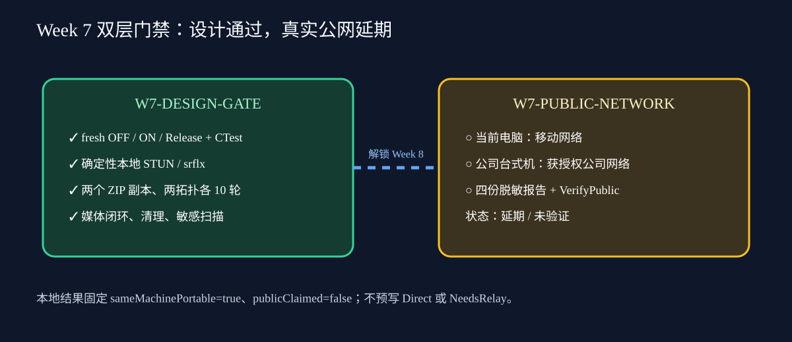
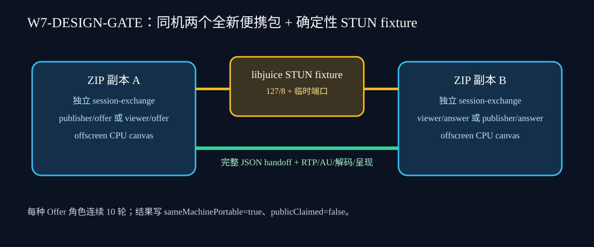
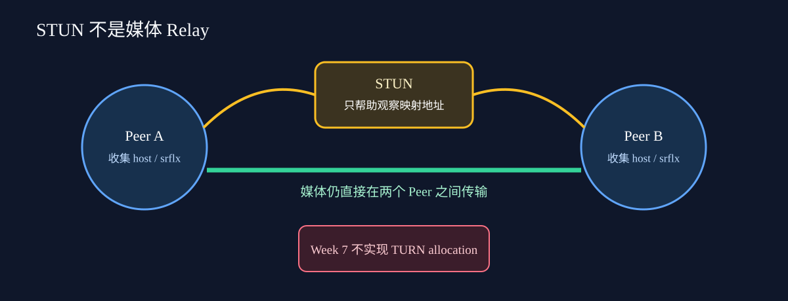
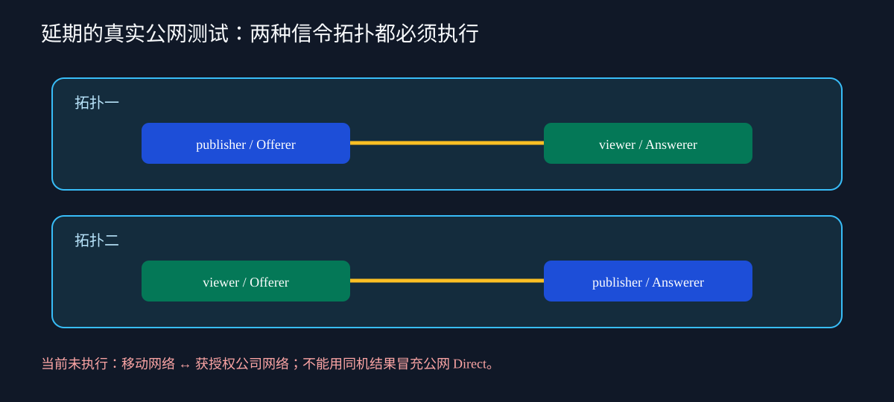
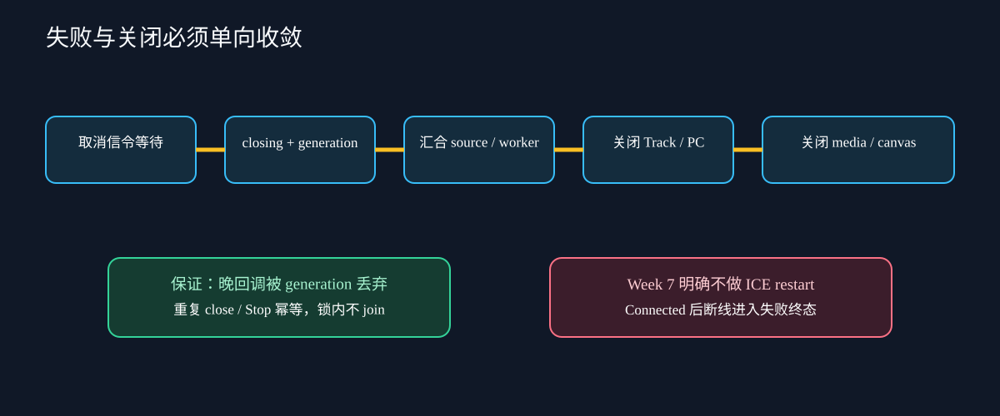
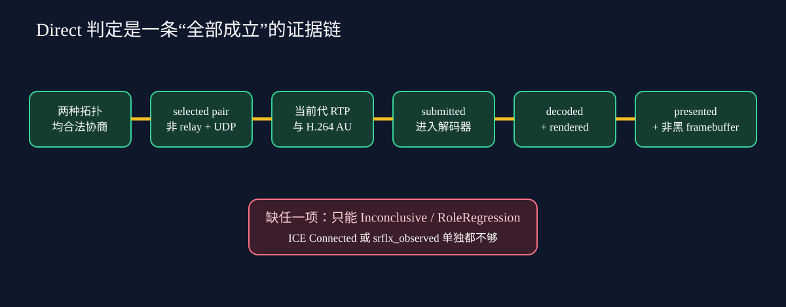
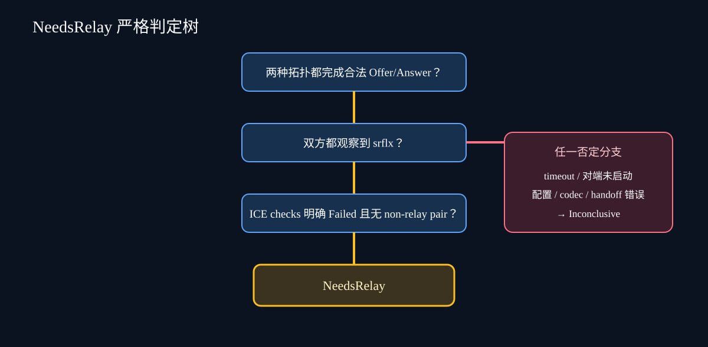

# WebRTC V2 Week 7 测试指南：自动化、本地双实例与延期公网版本

> 本文是可独立阅读的测试文章。它说明 Week 7 做了什么、如何运行自动资格脚本、如何观察本地两个便携包、以后如何在当前电脑与公司台式机之间执行获授权公网测试。真实公网目前没有执行；本地设计门禁通过不能写成公网 Direct。

## 1. 这次主要测试什么

Week 7 在 Week 5 的 RTP→H.264 AU→FFmpeg→mailbox→CPU canvas 闭环和 Week 6 的 Release 便携包之上，新增了三项可测试能力。第一项是 `--ice-mode host|stun`：host 保持旧行为，stun 从固定的 package-local `local-config/ice-runtime.json` 读取一个 STUN server。第二项是 transport 的 ICE state、候选类型和 selected pair 脱敏事实。第三项是资格分类：只有非 relay UDP pair和当前 generation 的 RTP、AU、submitted、decoded、rendered、presented、非黑 framebuffer 同时成立，才具备 Direct 的媒体证据；普通 timeout 不能写成 NeedsRelay。



自动版使用测试专用 libjuice fixture，两个 peer 和 fixture 都在当前电脑。fixture 只使用回环和临时端口，目的是稳定产生 srflx 观察，验证代码、脚本、ZIP 和分类，不测试真实 NAT。人工本地版让你从最终 ZIP 展开两个目录，观察 Offer/Answer 完整文件和 viewer 画面。人工公网版留给以后两台电脑和两种获授权网络，届时才运行 VerifyPublic。

## 2. 测试前准备

在仓库根目录打开 Windows PowerShell 5.1。不要把文档里的尖括号当真实路径复制；本指南优先使用环境变量。先确认本机已经设置 Qt 与 vcpkg：

```powershell
$env:QTDIR
$env:VCPKG_ROOT
Test-Path (Join-Path $env:QTDIR 'lib\cmake\Qt6\Qt6Config.cmake')
Test-Path (Join-Path $env:VCPKG_ROOT 'scripts\buildsystems\vcpkg.cmake')
```

两个 `Test-Path` 都应返回 True。Visual Studio 通常由脚本通过 vswhere 自动发现；只有自动发现失败时才传 `-VsDevCmd` 的真实本机路径。不要传 `'<visual-studio>'`、`'<qt-root>'` 或 `'<vcpkg-root>'`，脚本会在 Test-Path 前明确拒绝占位符。

确认 Git 分支和工作区：

```powershell
git branch --show-current
git status --short --branch
git stash list
```

正式资格应在 Beta 的干净 feature commit 上执行。ZIP 的 packageId 包含源码提交前十二位；若在未提交改动上生成，manifest 不能代表这些改动，因此只能作为开发试跑，不能写最终 test_results。

测试会在仓库 `out` 下创建 fresh build、六秒合成 MP4、日志、ZIP 和两个展开副本。不要把 `out` 内容提交 Git。自动测试不访问公网，不需要关闭防火墙，不需要管理员权限，也不需要安装 TURN。

## 3. 自动化脚本版本

### 3.1 Check：只检查工具和边界

```powershell
& scripts/webrtc/qualify_week7.ps1 -Action Check
```

Check 验证 Qt CMake 配置、vcpkg toolchain、Visual Studio、CMake、CTest、FFmpeg 与 ffprobe，并检查是否残留 Week 7 qualification state。它不构建、不启动客户端、不读 STUN 配置、不联网。预期最后输出 `Week 7 prerequisites passed.`。若提示 state 已存在，先执行 Status；确认是本脚本拥有的进程后再 Stop。

```powershell
& scripts/webrtc/qualify_week7.ps1 -Action Status
& scripts/webrtc/qualify_week7.ps1 -Action Stop
```

Status 只显示受管记录或已经完成的本地结果。Stop 会核对 PID、完整 exe 路径和启动时间，避免 PID 重用时误杀别的进程；重复 Stop 安全。

### 3.2 SelfTest：脚本、分类和文档门禁

```powershell
& scripts/webrtc/qualify_week7.ps1 -Action SelfTest
```

SelfTest 用 PowerShell 5.1 parser 读取资格总控、打包器、包内 runner 和三个公共模块。它构造合法/非法 ICE schema，确认 TURN、凭据形态、额外字段和占位符被拒绝；构造 Direct round 后删除 presented 或替换 relay pair，确认不能通过；构造错误 NeedsRelay 前置，确认普通 timeout、配置、codec、handoff 与 media 错误仍是 Inconclusive。随后检查 summary 中文字符数、testing guide 中文字符数、九张 SVG 的 XML、图片相对链接、关键类职责和敏感端点模式。

SelfTest 不构建 C++，适合修改脚本或文档后快速运行。预期输出 `Week 7 qualification self-test passed.`。若报 broken SVG link，检查 Markdown 相对路径是 `assets/name.svg`；若报 concrete ICE endpoint，不要把真实或公共 STUN 地址写进文档，合法示例应只出现在交互 Configure 的说明里，不出现在命令参数。

### 3.3 Run：完整本地设计资格

```powershell
& scripts/webrtc/qualify_week7.ps1 -Action Run -RoundsPerTopology 10
```

Run 的时间较长。它首先用 FFmpeg `testsrc2` 生成六秒 1280×720、30 fps、H.264 Constrained Baseline 3.1、无 B 帧样本，并用 ffprobe验证。接着依次 fresh 配置 Debug OFF、Debug ON 和 Release ON，构建全目标并运行完整 CTest。OFF 必须包含 disabled test且不能出现客户端、fixture、libdatachannel/libjuice入口或相关 DLL；ON 必须包含 endpoint、ice config、viewer pipeline 等必需测试。

Release CTest 通过后，脚本调用 `package_week7.ps1`。公共打包模块只复制 WebRTC 客户端需要的 Qt、FFmpeg、libdatachannel、libjuice、libsrtp、OpenSSL DLL、platform plugin、批准样本、许可、runner、公共模块和本指南。stage 内不得有 PDB、LIB、EXP、OBJ、源码、CMake cache、日志、state、session JSON或 local-config。manifest 记录文件相对路径/大小、packageId、sourceCommit 和 ffprobe属性，但不记录内容哈希、真实 URL 或本机路径。

脚本从 ZIP 全新展开，运行 package Check/SelfTest，再复制为 package-a 与 package-b。Debug ON 的测试目录启动 `rtmp_monitor_webrtc_stun_fixture`，等安全 ready 事件取得临时端口。资格总控只在两个副本运行时创建固定配置，每个配置都指向回环 fixture；配置不会进入 ZIP。随后执行：

1. package-a publisher/Offerer，package-b viewer/Answerer；
2. package-a viewer/Offerer，package-b publisher/Answerer；
3. 每种拓扑连续十轮，共二十轮；
4. 每轮复制完整 offer/answer JSON，不打开或修改 SDP；
5. 双方必须加载 stun 模式并观察 srflx；
6. selected pair 必须存在、UDP且非 relay；
7. viewer 必须产生 RTP、AU、submitted、decoded、rendered、presented和非黑证据；
8. 每轮进程有界退出、exchange 为空；全部结束后 local-config、state和 fixture归零。



成功时写入 `out/webrtc-week7/local-design-results.json`。关键字段应为：

```json
{
  "sameMachinePortable": true,
  "publicClaimed": false,
  "designGate": "passed",
  "publicNetwork": "deferred"
}
```

不要手工把 `publicClaimed` 改成 true。该文件是同机设计事实，不是公网报告。完整日志留在 `out/webrtc-week7`，不提交 Git。

### 3.4 自动结果如何判读

先看 ctest 三个数量和退出码，再看 rounds 是否恰好二十项，两个 topology 是否各有 1..10且无重复。每个 round 的 `stunObservation` 应为 `srflx_observed`，localType/remoteType 可以是 host 或 srflx，但不能 relay/unknown，transport 必须 udp。viewer 计数必须大于零，四个布尔证据为 true。cleanupPassed 必须逐轮 true。

`selected pair` 可能仍是 host/host，这是正确的：同机 host 路径通常优于反射路径。本地门禁要求“确实收集 srflx”和“最终选择非 relay”，不强迫 ICE 选择 srflx。强迫选择反射路径会把 ICE 优先级测试和 STUN 收集测试混在一起。



## 4. 本地两个实例的人工版本

人工本地测试用于看窗口和文件搬运，不替代自动二十轮。找到最终 ZIP，展开两份，例如放到同一测试根下的 `A` 与 `B`。不要直接在 ZIP 查看器中运行 exe。确认每份根目录都有 client、platforms、webrtc-assets、manifest和脚本，且起初没有 local-config。

本地 fixture 是测试 target，不随包分发。最省事的人工观察方式是先执行完整 Run，让脚本创建两个副本并完成门禁；若要手动控制窗口，可在资格运行期间查看生成的 fixture ready和两个副本，但不要与自动 broker抢文件。更推荐只验证 host 默认的手工画面：分别在两个副本开 PowerShell，设置 `QT_QPA_PLATFORM=windows`，一侧启动 publisher/offer，另一侧启动 viewer/answer，然后按 outbox/inbox规则复制完整文件。host 模式不需要配置，验证的是 Week 5/6 画面，不是 Week 7 srflx。

若需要完全手工验证 stun 模式，应由资格脚本启动 fixture并把运行时配置写到两个副本，操作者只负责启动客户端和复制文件；不要把临时 URL粘贴到聊天、截图或命令行。两端命令必须包含 `--ice-mode stun`，publisher 还要 `--source sample`，viewer 禁止 source。先启动 Offerer，看到 description_exported 后把完整 `.offer.json` 复制到 Answerer 的 internal exchange或通过 handoff runner；Answerer生成 `.answer.json` 后复制回 Offerer。viewer 窗口应显示动态 testsrc2 画面，分辨率 1280×720，窗口调整大小仍响应。

观察 JSONL 的顺序：runtime_ready → ice_config_loaded → ice_gathering_completed → description_exported → connected；viewer 随后出现 media_received、frame_decoded、frame_presented、completed。并发下 description和gathering事件的相邻顺序以实际代码为准，但 connected不能早于合法 answer，frame_presented不能早于 decoded。关闭 publisher 后 viewer 应出现 connection_lost或有界完成，不应重新回到 Connecting。

人工结束后运行 Stop，检查 Task Manager没有两个 client或fixture，两个 session-exchange、handoff/inbox、handoff/outbox都为空，state不存在。测试配置应删除。若窗口仍在但 state 已丢失，不要用模糊进程名批量终止；先核对 exe完整路径再结束该副本进程。

## 5. 以后两台电脑的真实公网版本

### 5.1 环境与授权

该部分当前未执行。需要当前电脑连接获授权的移动网络，公司台式机连接获授权的公司网络；两端均允许运行该测试包，所用公网 STUN 服务也必须获授权。不要关闭整机防火墙，不要绕过公司网络政策，不要测试客户或现场端点。两端必须使用同一个最终 ZIP，manifest packageId一致。

用户当前通过远程控制软件访问显示为 KUNLUN 的公司电脑。公司侧已确认的脱敏事实是：以太网、DHCP、公用网络配置、私网 IPv4 和 1 Gbps 链路；具体 IPv4、IPv6、网关、DNS 与 MAC 不进入文档和报告。远程控制软件的“文件传输”只用于搬运完整 ZIP/Offer/Answer，“进入桌面”用于操作公司 Windows；WebRTC 媒体仍必须通过两端客户端的真实 UDP selected pair建立，不能把远程控制画面当作 WebRTC viewer 证据。

KUNLUN的补充只读预检已经观察到外部STUN UDP响应和跨服务稳定映射，这是适合开始双机实验的有利迹象，不是本项目Direct证据。预检时本机代理来自VPN；正式20轮必须固定VPN on/off并在人工表记录，同一四报告集合不得混合两种VPN状态。原生libdatachannel客户端不使用Chrome PeerConnection，不能用`chrome://webrtc-internals`替代JSONL和报告。Week 7没有TURN或TCP/TLS relay回退，相关建议留给后续生产规划。

第一次执行时不要只读本节摘要，请完整按照独立的 [KUNLUN 双电脑公网手动测试手册](manual_two_computer_public_test.md) 操作。该手册从 ZIP 上传、两端解压、packageId 核对、PowerShell窗口布置、STUN交互配置开始，逐轮说明如何通过 staging 原子搬运 Offer/Answer，并分别给出资格报告模式和可视窗口模式。



每台电脑从全新 ZIP 展开。首次只运行：

```powershell
& .\week7_public_test.ps1 -Action Check
& .\week7_public_test.ps1 -Action SelfTest
& .\week7_public_test.ps1 -Action Configure
```

Configure 会要求输入 `AUTHORIZED`，然后交互读取 STUN URL。URL不会作为脚本参数出现在 PowerShell历史。不要在命令行提前定义包含真实 URL的环境变量，不要把 local-config复制到另一台电脑；每台电脑各自交互配置。配置文件和授权记录只在包运行目录，Stop会删除。

`week7_public_test.ps1 -Action Run` 会强制 `QT_QPA_PLATFORM=offscreen`。所以以下十轮资格流程不会显示 viewer窗口，而是从真实canvas计数和非黑 framebuffer生成报告。要在 KUNLUN 远程桌面亲眼观察动态画面，必须在资格十轮之后，按独立手册的“可视窗口模式”直接运行 `rtmp_monitor_webrtc_client.exe`；两种证据不能相互冒充。

### 5.2 拓扑一

当前电脑或公司电脑的角色分配可以交换，但 networkClass必须反映当前连接网络。一端运行 publisher/offer，另一端运行 viewer/answer。示意命令只包含非敏感角色：

```powershell
& .\week7_public_test.ps1 -Action Run -MediaRole publisher -SignalingRole offer -NetworkClass mobile -Rounds 10
```

另一端：

```powershell
& .\week7_public_test.ps1 -Action Run -MediaRole viewer -SignalingRole answer -NetworkClass company -Rounds 10
```

runner启动后会把完整文件同步到 outbox。使用远程控制软件时，不要直接把正在传输的文件落入 inbox：先传到目标包的 `handoff/incoming-staging`，等待文件传输明确完成，再在目标 PowerShell用 `Move-Item -LiteralPath`移动到 inbox。把 Offerer outbox中的 `.offer.json` 整个复制到 Answerer，Answerer outbox出现 `.answer.json` 后整个复制回 Offerer。不要重命名、打开编辑、合并或只复制 sdp字段。每一轮 runner都会清理旧 session文件，必须复制该轮新文件，不能复用前一轮。

资格 runner 每轮核对 RTP、AU、submitted、decoded、rendered、presented与nonBlack，不进行肉眼窗口观察。窗口动态画面、响应和退出由单独的可视模式完成。两端完成后保留 results中的脱敏 JSON，不保留 logs或handoff文件作为最终材料。日志用于本地排障，可能含时间和错误文本，但资格汇总只接收报告。

### 5.3 拓扑二

重新 Configure（仅当前次 Stop已清配置），把媒体角色不变而信令角色翻转：KUNLUN viewer/offer 与当前电脑 publisher/answer。命令参数仍不包含地址。完整运行十轮并复制新生成的 offer/answer。只完成拓扑一不能通过，因为 viewer作为 Offerer 的 track方向和 answer路径尚未证明。

### 5.4 生命周期场景

正常二十轮后，每种提前退出场景只跑一轮。viewer-first：画面呈现后停止 viewer，publisher应有界感知 connection_lost或结束，不得无限等待。publisher-first：开始发送后停止 publisher，viewer应有界收敛，不得继续显示旧 generation画面。连接后网络变化只操作当前电脑的获授权移动网络；仅靠远程控制时禁止断开 KUNLUN 公司以太网，否则远程桌面和文件传输也会中断。Week 7不做 ICE restart，所以预期是失败收敛而非自动恢复。



### 5.5 汇总 VerifyPublic

把四个正常角色报告和要求的生命周期记录复制到仓库忽略的本地结果目录。不要复制 local-config、日志、SDP或截图中的地址。执行：

```powershell
& scripts/webrtc/qualify_week7.ps1 -Action VerifyPublic -ResultRoot $env:W7_RESULT_ROOT
```

`$env:W7_RESULT_ROOT` 应提前设置为真实本地目录，避免复制尖括号占位符。输出只有 Direct、NeedsRelay、RoleRegression、ConfigurationError或Inconclusive。Direct 与 NeedsRelay 才是网络资格通过分类，但仍只对该次网络组合负责。当前没有这些报告时，W7-PUBLIC-NETWORK保持 deferred。

## 6. Direct 与 NeedsRelay 的人工复核



Direct 必须逐项复核：四个角色报告 packageId相同；两个 Offerer拓扑都存在且实际 rounds等于 requested；viewer当前代计数大于零；frame_presented对应非黑 framebuffer；selected pair两端都不是 relay且transport为udp；cleanup通过。只看到 srflx、Connected、窗口打开或publisher exit code零都不够。



NeedsRelay要求两种拓扑合法、双方观察srflx、ICE checks明确Failed、没有non-relay pair，并排除配置、codec、handoff、文件、媒体和用户提前退出。若任一端没有启动、忘记复制answer、STUN配置错误、gathering timeout或ICE还在Checking，只能Inconclusive。NeedsRelay表示需要后续评估TURN，不表示当前包已有relay能力。

## 7. 常见故障与处理

### 7.1 Qt platform plugin 弹窗

症状是“no Qt platform plugin could be initialized”。检查是否从完整展开目录运行，platforms/qwindows.dll和qoffscreen.dll是否存在，Debug程序是否误配Release Qt DLL。自动测试应由脚本设置offscreen，不要在缺plugin时用重装Qt掩盖打包缺口。该错误发生在QApplication初始化，不是ICE或WebRTC失败。

### 7.2 Test-Path 非法字符

若命令里使用 `'<qt-root>'`，尖括号会导致路径非法。改用已设置的QTDIR/VCPKG_ROOT，或传真实本机路径。Week 7脚本在Test-Path前调用占位符检查，正常应给出“replace placeholder”的明确错误，不应抛底层ArgumentException。

### 7.3 ice_config_not_found

确认命令确实传 `--ice-mode stun`，并在当前运行副本的固定local-config路径执行过Configure。不要用 `--ice-config` 或 `--stun-url`，这些参数不存在。host模式不会读文件；stun模式不会静默回退host。

### 7.4 srflx_not_observed

本地自动版出现该值，先确认fixture仍运行、两个配置端口与ready事件一致、127/8未被异常网络软件拦截。公网人工版只能说明本次没有反射候选，检查授权STUN、DNS和UDP策略，但不要直接写“服务器不可达”。

### 7.5 connection_timeout

先检查完整offer/answer是否复制到正确轮次的inbox、双方packageId和角色是否匹配。再看candidateTypes与iceState。对端没启动或answer没搬运是handoff问题，不是NeedsRelay。若协商已经完成且checks明确Failed，再进入网络分类。

### 7.6 已连接但没有画面

按media_received、frame_decoded、frame_presented顺序定位。无RTP检查publisher和track；有RTP无AU检查depacketizer与H.264门控；有AU无submitted检查generation和capacity drop；有submitted无decoded检查FFmpeg与参数集；有decoded无presented检查mailbox、CPU canvas、Qt事件循环和framebuffer。不要修改ICE分类掩盖媒体层错误。

### 7.7 Status/Stop 与残留

Status显示name、pid和startTimeUtc。Stop核对完整path和start time后先请求窗口关闭，超时才强制终止。若身份不符，脚本保留state并拒绝杀进程。正常Stop后state、session-exchange和handoff JSON清空；包内Stop还删除local-config。重复Stop应输出idle或完成，不报错。

## 8. 测试记录表

自动门禁记录：

| 项目 | 实际值 | 通过条件 |
| --- | --- | --- |
| Git提交 | 运行时填写 | 与manifest sourceCommit一致 |
| Debug OFF CTest | 运行时填写 | 全量0失败，disabled门禁存在 |
| Debug ON CTest | 运行时填写 | 全量0失败，Week7测试存在 |
| Release ON CTest | 运行时填写 | 全量0失败 |
| publisher/Offerer轮次 | 运行时填写 | 10/10 |
| viewer/Offerer轮次 | 运行时填写 | 10/10 |
| srflx观察 | 运行时填写 | 双方每轮observed |
| viewer证据 | 运行时填写 | 六层计数/布尔全部成立 |
| 清理与扫描 | 运行时填写 | PID、state、exchange、配置零残留 |
| 公网声明 | false | 必须保持false |

公网人工记录：

| 项目 | 填写内容 |
| --- | --- |
| packageId | 四份报告相同的脱敏ID |
| 测试时段 | 本地日期与大致时段，不写地址 |
| 网络类别 | mobile / company |
| 两种拓扑 | 各十轮实际通过数 |
| viewer-first | 有界终态及清理结果 |
| publisher-first | 有界终态及清理结果 |
| 网络变化 | ICE state和收敛结果 |
| VerifyPublic | Direct / NeedsRelay / 其他分类 |
| 限制 | 只适用于本次包、网络组合和时段 |

## 9. 测试完成后的动作

本地自动测试通过后，可以把 W7-DESIGN-GATE 和研发阶段 W7-GATE标记通过并进入Week 8，但test_results必须继续写真实公网未执行。保留最终ZIP和local-design-results在out，不提交二进制、日志和配置。提交源代码、脚本、SVG与事实文档后，普通非强制推送Beta并用ls-remote核对。

真实公网以后完成时，只更新test_results、snapshot、handoff和相关门禁事实；不要为了让结果好看而修改原始报告。若结果Inconclusive，按失败层修复后生成全新报告集合。若严格NeedsRelay成立，后续另立TURN/coturn计划，评估凭据、带宽和成本；Week 7本身不扩展为Relay实现。

## 附录 A：自动资格逐步观察清单

### A.1 fresh OFF 阶段

配置输出应显示 WebRTC developer path为OFF。构建目录必须是Week 7专用fresh目录，不复用Week 6缓存。全目标构建后，CTest列表包含disabled验证而不包含endpoint、ice config、viewer pipeline或STUN fixture测试。制品扫描不应找到webrtc client、fixture、datachannel.dll和juice.dll。若OFF仍出现fixture，检查CMake是否把find_package LibJuice或add_executable放到了WebRTC条件外；不要仅从扫描名单删除文件名。

### A.2 fresh Debug ON阶段

配置必须精确找到libdatachannel 0.24.5和现有vcpkg triplet。全目标构建包括client、endpoint test、runtime paths test、client ice config test、viewer pipeline test和stun fixture。CTest必须完整运行，不使用正则过滤隐藏其他产品测试。若GUI测试弹窗，检查QT_QPA_PLATFORM和platform plugin；不允许点击忽略后把测试记通过。endpoint测试可能需要较长时间，因为它包含两种真实PeerConnection拓扑和断线收敛。

### A.3 fresh Release ON阶段

Release必须重新配置而不是把Debug exe复制到包。完整CTest再次运行，运行PATH使用Release Qt和vcpkg bin。检查测试可执行程序入口点错误时，优先排除Debug/Release DLL混用。最终client位于release-on/webrtc/Release，fixture虽然可在测试构建目录出现，但打包profile不得复制fixture exe。

### A.4 样本阶段

ffmpeg命令从testsrc2生成动态画面，编码参数固定baseline、level 3.1、yuv420p、GOP三十、无场景切换、无B帧、faststart。ffprobe必须返回codec h264、profile Constrained Baseline、level 31、1280×720、30/1和has_b_frames零。若本机ffmpeg缺libx264，资格阻塞，不能换成未验证的随机MP4；若输出尺寸或profile错误，package manifest也必须拒绝。

### A.5 stage和ZIP阶段

stage名称含sourceCommit前十二位。根目录至少有client、运行DLL、platforms、webrtc-assets、licenses、manifest、public runner、公共模块和testing guide。local-config、logs、results、session-exchange可以由运行时创建，但不能预置进ZIP。许可必须来自实际Qt/vcpkg依赖。Expand-Archive到全新目录后再做黑盒测试，不能直接测试stage后假定压缩内容相同。

### A.6 fixture阶段

资格用owned-process helper启动fixture，stdout首行是stun_fixture_ready和临时port，stderr不应出现fatal。fixture完整路径和启动时间进入state。端口只用于在out副本创建配置，不进入Git文档和最终报告。若ready超时，检查juice.dll和回环绑定；不要改为公共STUN绕过确定性测试。fixture结束后state删除，Task Manager不应残留其进程。

### A.7 第一种拓扑每轮

publisher/Offerer先启动，必须在本副本产生新的offer文件。broker复制整个文件到viewer/Answerer exchange，Answerer写answer后完整复制回去。两个runtime_ready均为portable/stun，两个ice_config_loaded均为serverCount一，两个gathering事件均observed。viewer connected有非relay UDP pair。completed的三层计数大于零，decoded/presented为true，frame_presented renderedFrames大于零。双方退出后两个exchange无JSON。

### A.8 第二种拓扑每轮

viewer/Offerer先创建receiveonly offer，publisher/Answerer生成sendonly answer。媒体方向仍然publisher到viewer，不因Offer角色改变。检查viewer窗口对应Offerer进程的stdout，而不是固定读取Answerer日志。若第一拓扑通过、第二拓扑失败，优先检查track方向和answer协商，不要修改STUN。十轮编号应连续唯一，任何缺轮使总门禁失败。

### A.9 最终清理

二十轮结束后删除package-a和package-b的local-config。session-exchange为空，handoff目录若存在也为空，qualification-state不存在，fixture与client全部退出。LocalResult写二十个round对象而不是只有passed计数。安全扫描覆盖stdout、stderr、状态、文本包内容和交换目录。只要出现candidate、fingerprint、ICE凭据、URL或开发机绝对路径，就应修复输出后重跑。

## 附录 B：C++测试逐项预期

### B.1 Options测试

旧publisher命令不传ice-mode仍成功解析host；viewer/answer加stun成功；relay失败；viewer带source失败；publisher缺source失败；timeout越界失败。帮助文字应描述稳定WebRTC V2客户端，不出现Week 5硬编码。命令行不存在stun-url、turn-url、username、password和exchange-dir，传入未知参数由parser拒绝。

### B.2 RuntimePaths测试

临时repository marker生成仓库exchange和local-config固定路径；package manifest生成portable同级路径且优先于repository；sample永远是exe同级webrtc-assets。无marker返回invalid，ok为false，不能根据当前工作目录猜测仓库。重复resolve返回同一纯值，测试后临时目录自动清除。

### B.3 IceConfig测试

合法回环文件仅产生一个server和一个URL，凭据为空。不存在映射not_found，把目录当文件映射read_failed。空文件、超限、非法JSON、非object、字段类型错误、额外字段、空URL、TURN、placeholder、空白host和非法port映射稳定错误。错误schema单独unsupported version。测试只验证解析，不发网络请求。

### B.4 Endpoint测试

无效http型ICE URL在PeerConnection创建前映射InvalidIceConfiguration。单端Offer收集host后waitConnected超时仍返回host与New/Checking。LocalStunServer用127/8和临时端口，offer/answer都含srflx，连接结果pair只含安全类型和udp。两种publisher信令角色都能发送真实RTP，receiver收到合法AU；一端关闭后另一端在有界时间Failed，关闭后的port返回InvalidGeneration，receive sink不再增长。

### B.5 Viewer pipeline测试

真实endpoint、FFmpeg decoder、capacity-one mailbox和CPU canvas串行连接。断言当前generation decoded frame宽高正确、mailbox sequence增长、rendered/presented计数增长和framebuffer非黑。制造capacity drop后必须等下一组当前代SPS/PPS/IDR恢复，协商前延迟启动不能冒充晚加入。测试环境设置offscreen，但仍使用真实Qt画布。

## 附录 C：人工公网每轮操作卡

### C.1 开始前

两端口头确认测试时段、网络和STUN授权。核对packageId相同，删除旧results/logs/handoff/session-exchange/local-config，再从Configure开始。当前电脑接移动网络，公司台式机接公司网络；不要让两端都在同一个Wi-Fi后声称公网。关闭可能自动切换网络的VPN或代理需遵守各自政策，不能为测试绕过公司限制。

### C.2 Offerer操作

运行指定媒体角色和offer。等待outbox出现当前轮offer，确认文件名时间属于本轮，只复制完整文件到安全传输介质或获准共享位置，再放到Answerer inbox。不要查看内容，不要拍摄含文件内容的截图。等待Answerer返回完整answer，放入本机inbox。观察connected和本机角色所需媒体事件。

### C.3 Answerer操作

先启动runner等待inbox。收到offer后runner同步到exchange并生成answer；把outbox完整answer复制回Offerer。若误复制上一轮文件，停止本轮、清理并重跑，不要手改sessionId。viewer角色观察动态画面和窗口响应，publisher角色观察自然发送完成。记录只使用报告中的计数和类型。

### C.4 一轮结束

两端等待进程有界退出，检查Status idle、handoff和exchange为空。报告round编号、角色、networkClass和cleanup必须正确。若一侧失败，另一侧报告也不能与下一轮拼接；两端都清理后用同一轮号重跑。十轮应连续完成，避免长时间跨越网络策略变化而不记录测试时段。

### C.5 viewer-first

只运行一轮生命周期场景。连接并看到frame_presented后，在viewer侧执行Stop或关闭窗口。记录publisher是否输出connection_lost或有界结束、ICE最终状态、双方清理。不要在尚未presented时关闭，否则只能证明启动中取消，不能证明已连接后viewer先退。

### C.6 publisher-first

只运行一轮。publisher开始publishing且viewer至少收到媒体后关闭publisher。viewer应停止增加当前代计数并在有界时间connection_lost或结束，不应无限播放旧邮箱帧。检查receive sink在endpoint generation失效后不再提交。若viewer窗口保留最后一帧但进程已终止，记录UI现象，不把静态画面当持续连接。

### C.7 网络变化

先完成连接和呈现，再按获授权方案改变一侧测试网络。Week 7没有ICE restart，期望现有endpoint进入Disconnected/Failed/Closed并由应用收敛Failed。记录时间范围和状态类型，不记录新旧地址。若网络自动恢复导致底层仍Connected，只能记录实际结果，不能强迫失败；该场景不影响正常拓扑报告的独立判定。

## 附录 D：结果分类实例

实例一：四份报告、两种拓扑各十轮，非relay UDP pair，viewer六层证据齐全，清理全过，输出Direct。表述必须限定包、网络类别和时段。

实例二：两种拓扑都观察srflx，合法answer已交换，双方ICE明确Failed，所有round无nonrelay pair，配置、codec、handoff和媒体前置均无错，输出NeedsRelay。后续另评审TURN，不修改Week 7包假装已有relay。

实例三：只有publisher/Offerer和viewer/Answerer两份报告，输出RoleRegression或Inconclusive，补跑viewer/Offerer组合。

实例四：packageId不同、roundsRequested十但数组九、networkClass拼写错误或cleanup false，输出ConfigurationError，重新使用同一ZIP完整执行。

实例五：双方只看到host，srflx_not_observed并最终timeout，输出Inconclusive。检查授权STUN和网络，但不能NeedsRelay。

实例六：selected pair非relay且Connected，viewer receivedRtp为零，输出Inconclusive。检查publisher、track和handoff，不得Direct。

实例七：RTP和AU大于零、submitted为零，说明H264恢复门控或generation拒绝，输出Inconclusive。等待正确SPS/PPS/IDR并排查capacity drop。

实例八：decoded为true但presented为false，说明mailbox/canvas/Qt呈现证据缺失，输出Inconclusive。修复UI测试环境后重跑。

实例九：普通connection_timeout且对端没有启动，输出Inconclusive。启动对端并完成answer，不得用NeedsRelay解释人为缺席。

实例十：STUN配置文件多一个username字段，客户端invalid_ice_config，报告属于ConfigurationError。删除额外字段并通过Configure重建，不能把凭据加入schema v1。

## 附录 E：交付前最终核对

代码核对：transport不依赖signaling/media/render/ui；loader位于client-private；fixture只在ON+testing；公共DTO只末尾追加；Offer/Answer schema不变。线程核对：ICE回调只写弱状态；sink锁外调用；loader无线程；Qt对象只在UI线程；锁内无join。资源核对：source/control worker汇合、track/PC关闭、handle/stream关闭、canvas/window销毁、Cleanup一次。

测试核对：PowerShell 5.1解析通过；OFF/ON/Release全量CTest零失败；必需测试名存在；两个ZIP副本两拓扑各十轮；错误配置和timeout有界；Week 4/5/6 SelfTest/Run回归；包扫描和日志扫描零命中；SVG可解析；长文字符门禁通过。事实文档只能写实际命令和数量，未运行项写待执行。

Git核对：工作区只含本轮内聚改动；先提交feature，再从该提交生成最终ZIP并重跑；随后提交test_results、snapshot、handoff和ADR事实。推送前fetch并确认origin/Beta未前进，普通push，禁止force。最后用ls-remote对照完整HEAD。ZIP、日志、配置、授权记录、session包和公网现场材料全部留在out或包运行目录。

## 附录 F：失败注入与预期结果手册

以下注入只用于本地受管测试目录，不修改最终ZIP和真实网络。每次注入后恢复全新副本，避免一个错误污染下一个用例。

**删除配置文件**：以stun模式启动，预期runtime_ready后failed=ice_config_not_found，没有ice_config_loaded、description_exported或session文件，进程有界退出。恢复方式是由资格总控重建回环配置或包内重新Configure。

**把schemaVersion改为二**：预期unsupported_ice_config_version。该结果证明版本错误与普通invalid分离。不要让loader回退v1，也不要在报告里保存文件内容。

**增加username字段**：预期invalid_ice_config。即使值为空也必须拒绝，因为schema字段集合精确。恢复时删除整个配置并由Configure重新生成，不手工留下未知字段。

**把协议改成TURN**：预期invalid_ice_config，endpoint不创建。该测试证明Week 7不偷偷获得relay能力。不得为了测试通过而向包加入用户名、密码或公共TURN地址。

**停止fixture后启动双方**：loader仍成功，可能先收集host，随后gathering_timeout或srflx_not_observed。分类必须Inconclusive。恢复时用owned runner重新启动fixture并取得新临时port，旧配置不可复用。

**只启动Offerer**：生成offer后等待answer超时。candidateTypes可能有host/srflx，但没有合法双端协商，不能NeedsRelay。Status应能看到Offerer，Stop后exchange清空。

**复制offer但不复制answer**：Answerer可能connected等待或已生成answer，Offerer最终timeout。该用例是handoff错误。检查outbox和轮次文件，不分析NAT。

**把上一轮answer复制回来**：session package校验或远端描述应拒绝/超时，不能拼接成功。清理双方旧JSON后重跑，不编辑session标识冒充当前轮。

**viewer命令加入source**：options应立即invalid_arguments，不创建QApplication会话资源或配置读取。它保护媒体角色边界，runner不应把未知参数静默忽略。

**publisher缺source**：同样invalid_arguments。Week 7仍只批准sample来源，没有摄像头或任意路径。不要临时添加source-path绕过打包样本资格。

**缩短connection timeout**：若正常流程来不及搬运文件，结果connection_timeout且保留候选事实。它只验证有界退出，不可作为网络结论。正式轮次恢复规定时限。

**在连接后关闭publisher**：viewer应connection_lost或有界结束，submitted计数停止增长，旧generation回调不再触发。重复close不崩溃，exchange最终为空。

**在presented后关闭viewer**：publisher应有界感知连接终止或自然完成。若只在窗口创建后、尚未presented就关闭，该记录不满足viewer-first生命周期场景，应重新执行。

**制造decoder容量丢弃**：测试路径延迟media接受，receive pipeline清恢复缓存，后续delta被DroppedUntilKeyframe，下一组当前代SPS/PPS/IDR后恢复。不得把协商前延迟当晚加入证明。

**让Qt找不到platform plugin**：预期进程在QApplication初始化失败，可能出现系统弹窗；资格失败且没有WebRTC事件。修复package/platforms，不把它归为ICE或media timeout。

**混用Debug Qt和Release exe**：可能出现入口点弹窗。检查收敛PATH和package DLL，不重新安装系统运行库掩盖制品错误。最终ZIP必须在干净展开和收敛PATH下通过。

**在报告中删除一轮对象但保留roundsPassed十**：Verify必须ConfigurationError或失败，证明验证实际数组。恢复方式是重新运行缺失轮次并生成完整新报告，不直接编辑计数。

**复制四份报告但packageId不同**：预期ConfigurationError。删除混合报告，从同一ZIP在两端重跑。不能把不同提交的成功轮次拼成一个矩阵。

**重复viewer/answer报告替代viewer/offer**：预期RoleRegression。补跑第二种拓扑；修改JSON角色字段属于伪造，不可接受。

**pair改为relay而媒体全过**：round不能Direct。若真实包意外报告relay，核对是否使用了超范围ICE配置；Week 7没有批准relay资格。

**presented改false而其他计数全过**：round不能Direct，定位canvas和framebuffer。decoded不等于用户看到画面。

**ICE state为Checking且无pair**：不能NeedsRelay，因为checks没有穷尽。等待有界终态或记录Inconclusive，不以超时猜测Failed。

**ICE明确Failed但没有srflx**：仍不能NeedsRelay。先解决STUN观察，确认双方都有反射候选后重跑。

**ICE Failed且srflx存在但codec错误**：仍不能NeedsRelay。合法媒体协商是网络诊断前置，先修fmtp或样本。

**日志出现candidate文本**：安全扫描立即失败。修复稳定事件映射，只输出type/transport/state，清理受影响日志并从干净提交重跑。不要仅把扫描文件排除。

**ZIP包含local-config**：package scan失败。删除stage和ZIP，从公共打包器重建；核对manifest localConfigurationIncluded为false。不能发布含测试端点的包。

**Stop时PID身份不符**：脚本拒绝终止并保留state。人工比较exe完整路径与启动时间，确认是否PID重用；只处理确属本轮的进程，不按进程名批量强杀。

## 附录 G：一次完整验收的建议节奏

第一阶段做十分钟快速检查：Git干净、Check、SelfTest、四个增量C++目标构建和指定测试。发现接口或脚本语法问题在此修复，不立即跑二十轮。第二阶段执行fresh OFF/ON/Release与全量CTest，记录实际数量；任一失败先修根因并从fresh重新开始。

第三阶段从干净feature commit生成ZIP，完成展开扫描、package Check/SelfTest和本地fixture二十轮。运行期间每隔几分钟用Status观察，不手动移动broker正在处理的文件。完成后核对local result、进程和配置清理。第四阶段回归Week 4、5、6的SelfTest/Run，确认host默认和旧包行为没有退化。

第五阶段根据真实输出填写test_results，不复制大日志，不写预计值。更新snapshot、handoff、decisions和两份路线图，明确设计通过、公网延期。形成事实提交后再次运行轻量SelfTest和diff/层依赖检查。最后fetch远端、确认Beta未前进、普通push并用ls-remote核对。

以后进行公网测试时独立安排一个获授权时段。先在两端全新展开和Configure，再跑拓扑一十轮、拓扑二十轮和三个生命周期场景。现场只收集脱敏results，结束立即Stop并删除local-config。回到仓库运行VerifyPublic；无论输出什么，都按有限环境事实记录，不修改Week 7代码来迎合预期分类。

## 附录 H：用户最终验收问答

**问：只有一台电脑能否完成Week 7？** 可以完成代码、构建、配置边界、STUN收集、双ZIP媒体闭环和分类逻辑，因此设计门禁可以通过并进入Week 8；不能完成真实跨公网环境资格，后者继续延期。

**问：为什么本地看到srflx还不能叫公网？** fixture返回的是127/8回环映射，两个peer共享一台主机和网络栈，没有经过真实NAT、运营商或企业策略。它只证明库和代码能处理反射候选。

**问：为什么selected pair是host/host也通过本地门禁？** ICE会选择优先级更高的可用路径，同机host通常最优。门禁分别要求收集到srflx和最终pair非relay，不强迫错误路径。

**问：能否直接使用一个公共STUN默认值？** 不能。真实端点必须获授权并只存本地忽略配置；默认网络功能保持关闭，ZIP、源码、manifest、日志和文档不保存URL。

**问：测试失败能否先继续Week 8？** 只有明确属于延期公网环境的项目可以不阻塞。fresh构建、CTest、本地fixture、两个拓扑、媒体呈现、清理或敏感扫描失败都属于设计门禁失败，必须修复后重跑。

**问：测试时弹出Qt错误怎么办？** 先修platform plugin和DLL布局。弹窗发生在应用初始化，不能通过点击忽略后把WebRTC记成功；自动测试应offscreen且无交互。

**问：报告可以手工补字段吗？** 不可以。报告由runner从JSONL和进程事实生成，round缺失、角色错误或packageId不同应重跑。手工修改会破坏资格证据链。

**问：NeedsRelay是否意味着下一步必须部署TURN？** 它只表示该限定网络组合在严格前置下没有非relay路径，说明需要评估TURN。部署、凭据、带宽、成本和安全是后续独立计划。

**问：如何确认彻底清理？** Status显示idle，Task Manager无对应完整路径进程，state不存在，session-exchange和handoff为空，local-config已删除。重复Stop应安全。

**问：最终应保存什么？** Git保存源码、测试、脚本、SVG和事实文档；out保存ZIP、本地结果和原始日志；公网现场只带回脱敏reports。真实配置、授权记录、SDP和candidate都不提交。

完成这些检查后，用户可以把“Week 7本地设计通过”作为明确结论，同时在任务列表保留“公司台式机与移动网络公网测试待执行”。两句话必须同时存在，才是完整验收。

如果自动脚本在中途失败，先执行Status保存阶段信息，再执行Stop清理受管进程；修复后从失败所属的fresh阶段重新运行，不沿用旧ZIP、旧配置或旧round对象。任何人工截图只能辅助排障，不能替代JSONL事件、CTest退出码、manifest身份和实际报告数组。测试人员应在记录表中注明哪些步骤由脚本自动完成、哪些步骤由人工观察、哪些公网步骤尚未执行，从而避免后来把“看到窗口”“连接成功”“设计门禁通过”和“真实公网资格通过”混为同一个结论。

最终结论必须可重复、可追溯、可由另一位维护者独立验证，并忠实保留尚未具备的外部测试条件。
