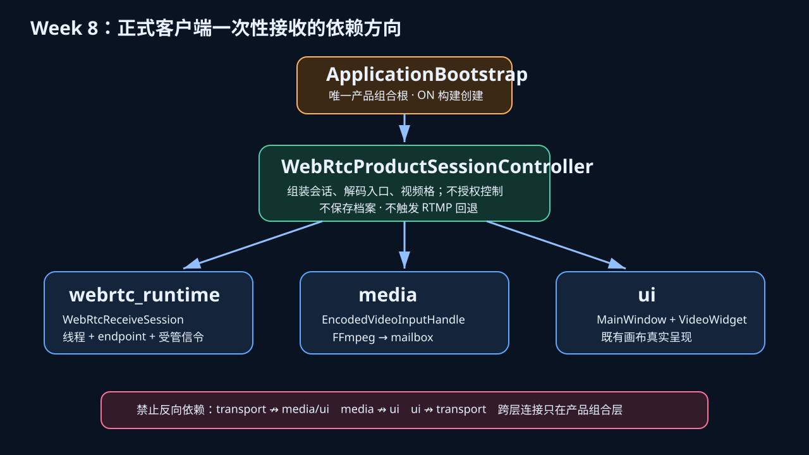
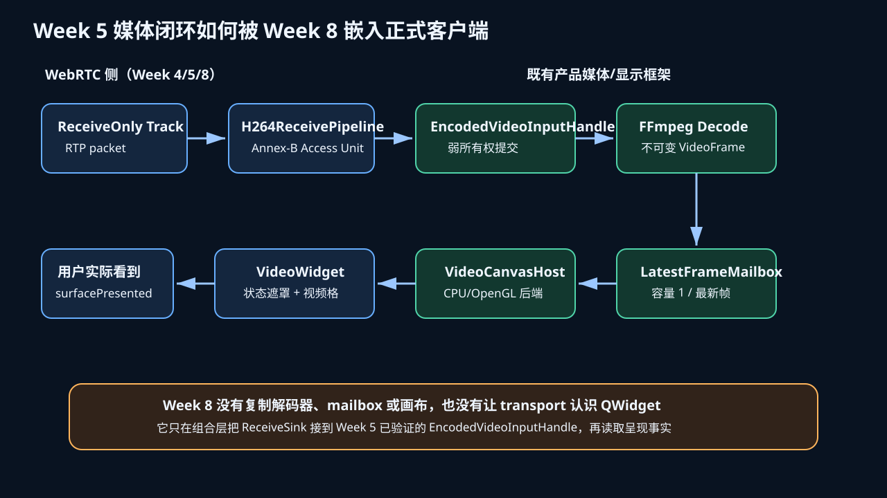
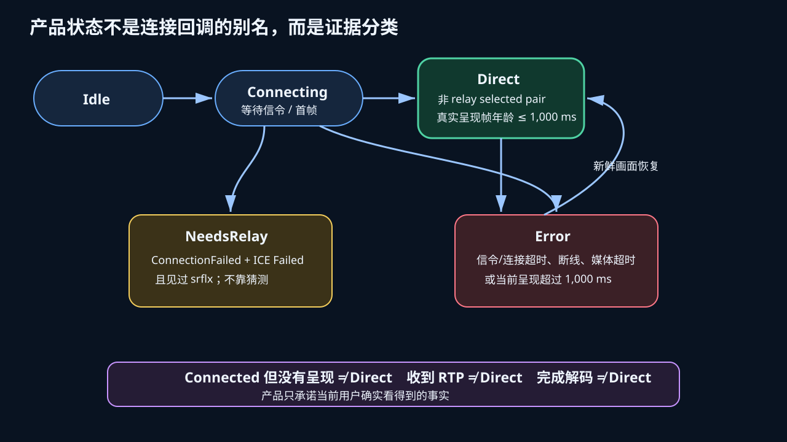
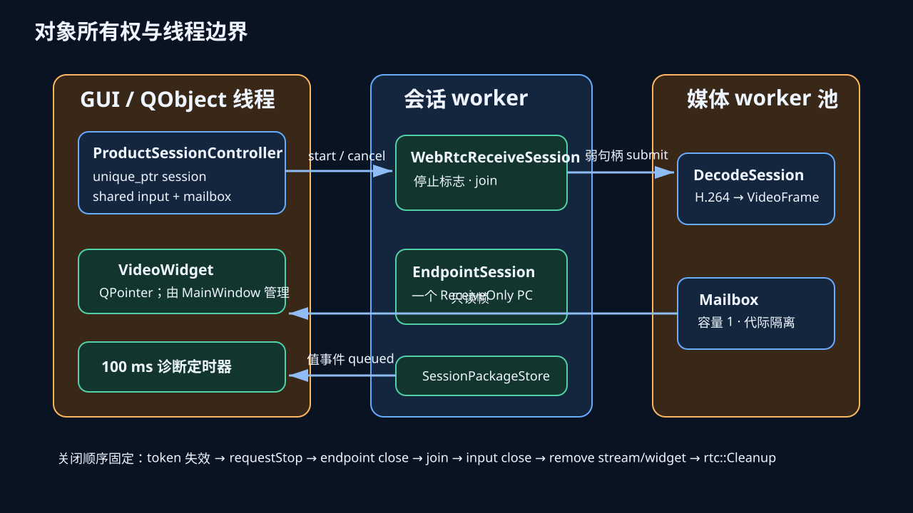
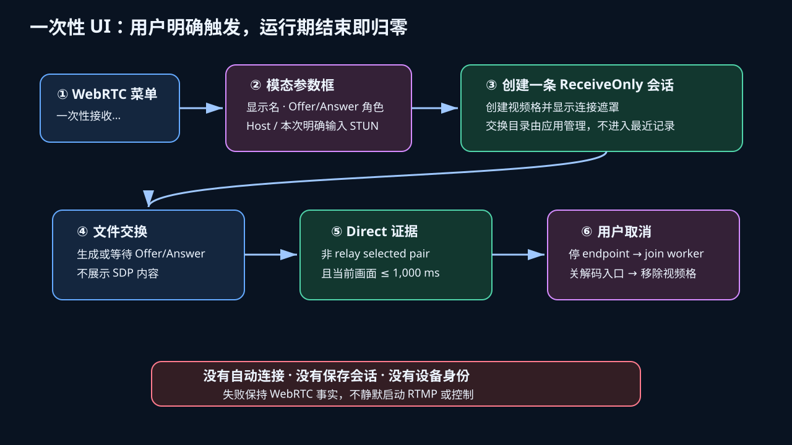
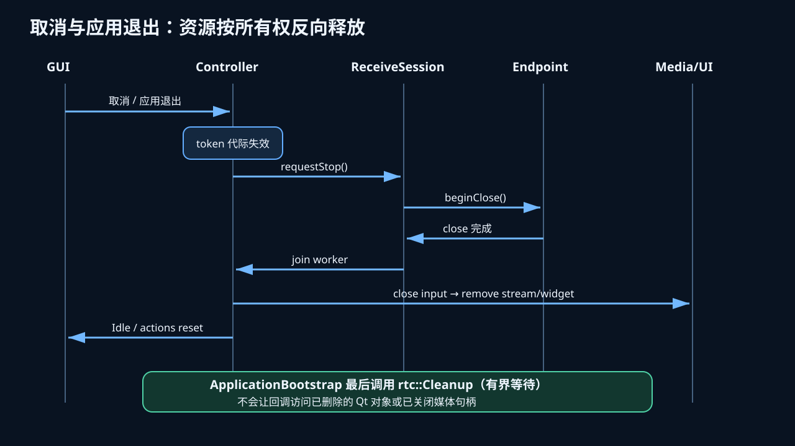
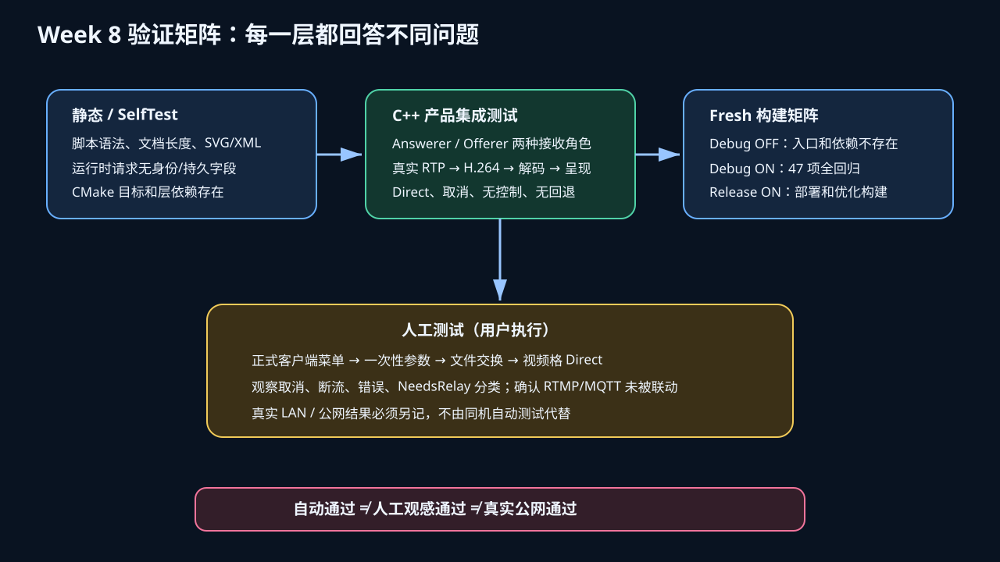

# WebRTC V2 Week 8：正式客户端一次性接收集成详解

> 版本：`0.2.0-beta.1` 开发线
>
> 完成日期：2026-08-25
>
> 建议阅读时间：25～35 分钟
> 本文范围：说明 Week 8 实际改了什么、每个新增类负责什么、它如何嵌入既有框架，以及哪些能力仍未声称完成。测试操作请另读 [Week 8 测试指南](testing_guide.md)。

## 1. 先给结论：Week 8 到底完成了什么

Week 8 把 Week 4～7 一直存在于开发者客户端和测试程序里的 WebRTC ReceiveOnly 能力，第一次接入了
`rtmp_monitor` 正式桌面程序。用户在 WebRTC=ON 的构建中可以从主菜单显式打开“一次性接收”对话框，
为本次运行选择显示名称、接收端的 Offerer/Answerer 角色以及 Host 或显式 STUN 模式。控制器创建一条
ReceiveOnly 会话，把收到的 H.264 Access Unit 交给 Week 5 已验证的外部解码入口，再把不可变视频帧
送进现有 mailbox、CPU/OpenGL 画布和 `VideoWidget`。会话取消或程序退出时，线程、PeerConnection、
解码入口、流条目和视频格按固定顺序释放。

这不是把开发者客户端窗口复制进正式程序，也不是把 WebRTC 代码塞入 `MainWindow`。新增实现被分成三层：

1. `webrtc_runtime` 只负责一个 ReceiveOnly endpoint、受管 Offer/Answer 文件交换和 worker 生命周期；
2. `webrtc_product` 的纯类型与策略只负责请求、状态、事件和证据判断；
3. `WebRtcProductSessionController` 位于产品组合层，才允许同时看见 runtime、media 和 ui。

正式程序原有 `media` 不依赖 WebRTC，`ui` 不依赖 WebRTC，transport 也不依赖 QWidget。WebRTC=OFF
时上述两个新目标、菜单入口、libdatachannel 运行时部署和产品测试都不存在；这保持了当前 RTMP 稳定路径
的默认行为。

Week 8 特别处理了五个容易被误写成“看似可用”的问题：

- `ICE Connected` 不等于用户已经看到画面；只有非 relay selected candidate pair，加上当前代真实呈现，
  且最近呈现帧年龄不超过 1,000 ms，产品状态才是 `Direct`。
- 收到 RTP 或完成解码也不等于呈现成功；判断使用 mailbox 的 presented 事实，而不是只看网络计数。
- WebRTC 失败不会静默创建 RTMP 播放，不会把失败误报为设备离线，也不会自动授权 MQTT/设备控制。
- 本次 STUN、Offer/Answer 和会话身份只活在运行期或受管交换目录，不写入 `SavedStreamProfile`，
  不升级 schema v1，也不加入 autoConnect。
- “允许画布尝试渲染”与“向用户宣布 Direct”被分开：前者是产生呈现证据的必要条件，后者必须等证据成立。

自动验证已经在 VS2026 Debug WebRTC=ON 构建中完成：主程序和全部目标编译成功，完整 CTest 47/47
通过；新增产品集成测试用两个真实 PeerConnection 覆盖接收端作为 Answerer 和 Offerer 两种拓扑，真实
H.264 经过 RTP、depacketize、FFmpeg 解码、mailbox 和画布呈现，随后验证 Direct 与取消清理。真实双机
LAN、真实公司网络/移动网络、公网 Direct/NeedsRelay 结论以及 ARM 真机仍不是本轮自动测试结论。



## 2. Week 8 相对于 Week 5 的位置

理解 Week 8 的最好方法，是先明确 Week 5 已经解决了什么、又故意没有解决什么。

Week 5 的核心任务是“接收媒体闭环”。它让同一个开发者客户端可以作为 viewer，用
`WebRtcEndpointSession` 创建 ReceiveOnly Track；`H264ReceivePipeline` 将收到的 RTP 包经过
libdatachannel H.264 depacketizer 恢复为 Annex-B Access Unit，执行 SPS/PPS/IDR、大小上限、RTP
时间戳等契约；组合根通过弱 `EncodedVideoInputHandle` 把 AU 提交给既有 FFmpeg 解码；解码结果进入
容量为 1 的 `LatestFrameMailbox`；`VideoCanvasHost` 的 CPU 画布实际绘制，并通过 presented/non-black
证据证明不是“只收包不出画”。Week 5 还覆盖 publisher/viewer 与 Offerer/Answerer 的正交组合。

但是 Week 5 明确是开发者客户端技术闭环。它没有给正式 `rtmp_monitor` 增加菜单，没有规定正式产品状态，
没有决定 WebRTC 画面是否能成为设备控制目标，没有把一次性会话的对象生命周期接入应用退出顺序，也没有
证明 WebRTC=OFF 的正式产品完全看不到入口。换句话说，Week 5 回答“媒体管线能不能工作”，Week 8 回答
“怎样在不破坏现有 RTMP、媒体、UI 和控制边界的前提下，把它作为有限产品能力交给用户”。

Week 8 没有重新实现 Week 5 的 depacketizer、解码器、mailbox 或画布。它复用了
`MultiStreamPlaybackManager::createEncodedVideoInput()` 这一条窄接缝：产品控制器取得运行期 handle，
ReceiveSession 只持有该 handle 的弱引用，收到 AU 时调用 `submit()`；解码、帧代际、容量控制、渲染和
presented 统计继续由原模块负责。这样修复或优化解码器时不需要改 WebRTC transport，调整 UI 布局时也不
需要修改 RTP 管线。



可以把两周的职责压缩成下面这组对照：

| 问题 | Week 5 | Week 8 |
| --- | --- | --- |
| RTP 能否恢复 H.264 AU | 完成 | 直接复用 |
| AU 能否经 FFmpeg 解码 | 完成 | 通过 handle 接入 |
| 画布是否真的呈现 | 完成技术证据 | 成为 `Direct` 必要证据 |
| 正式程序是否有入口 | 未做 | ON 构建显式菜单 |
| 产品状态如何定义 | 未做 | Connecting/Direct/NeedsRelay/Error |
| 是否持久化 Peer/会话 | 未做产品决定 | 明确禁止，运行期对象 |
| 是否绑定设备控制 | 未做产品决定 | 明确不绑定、不授权 |
| WebRTC 失败是否回 RTMP | 未做产品决定 | 明确不静默回退 |
| 应用退出怎样清理 | 开发者程序自清理 | 接入 `ApplicationBootstrap` 顺序 |

## 3. 架构设计：为什么新增两个目标，而不是直接改 MainWindow

本轮架构风险按 `architect-code-changes` 评估为 R2：新增公共头文件、线程对象、CMake 目标、产品组合和
应用退出生命周期，但没有改变现有持久化 schema、RTMP 公共契约或跨层依赖方向。R2 要求先明确职责、
依赖、数据/线程/资源所有权、兼容策略和验证计划。

### 3.1 `rtmp_monitor_webrtc_runtime`

这是非 UI 的运行时会话目标，公开 `WebRtcReceiveSession`。它依赖 Qt Core、WebRTC transport 和内部
signaling store，不依赖 media、render、ui、profiles、MQTT 或应用控制器。它的输入是交换目录、信令
角色、运行期 ICE 配置和超时；媒体输出是一个 `H264ReceiveSink` 回调；状态输出是按值复制的事件。

把 worker 和文件信令放在这一层有两个理由。第一，产品控制器不应在 GUI 线程同步等待 Offer/Answer 或
连接；第二，transport 不应知道文件目录、对话框或视频格。runtime 把两个已有低层能力组合为“一条可取消
的接收会话”，但仍然不认识产品 UI。

### 3.2 `rtmp_monitor_webrtc_product`

这是 WebRTC=ON 时才存在的产品组合目标。它公开 `WebRtcProductTypes` 和
`WebRtcProductSessionController`，允许依赖 runtime、media、ui 和 logging。依赖汇合只发生在这里，
没有把新的反向边加到既有模块。`cmake/CheckLayerDependencies.cmake` 新增了 runtime 扫描，禁止它
反向包含 app/product/media/render/ui 等层；产品目标则被明确视为组合层。

### 3.3 `ApplicationBootstrap` 是创建和最终清理位置

正式程序的具体对象组装仍在应用组合根。`ApplicationBootstrap` 只在生成配置宏
`RTMP_MONITOR_HAS_WEBRTC=1` 时包含产品控制器头并创建 controller；OFF 构建的预处理结果里没有该
类型。正常退出时先取消产品会话，保证 endpoint 和 worker 已结束，再执行既有 `playbackManager.stopAll()`；
最后调用有界 `rtc::Cleanup()`，避免 libdatachannel 全局线程活过 Qt 对象。

这个顺序是生命周期契约，不是防御性装饰。如果先删除视频格或 media handle，网络回调可能继续提交到已
关闭资源；如果只发停止标志但不 join，应用析构可能与 worker 竞争；如果在会话仍运行时调用全局 Cleanup，
库级资源与 endpoint 所有权会冲突。

### 3.4 依赖没有怎样变化

- `rtmp_monitor_media` 没有链接 WebRTC、产品层、render 或 ui；
- `rtmp_monitor_ui` 没有链接 WebRTC runtime 或 transport；
- `rtmp_monitor_webrtc_transport` 没有包含 media 或 QWidget；
- `rtmp_monitor_webrtc_runtime` 没有包含 UI、profiles 或设备控制；
- `profiles`、`SavedStreamProfile`、schema v1 和 autoConnect 源码未因 Week 8 增加字段；
- RTMP `StreamConnectionController` 没有被 WebRTC 控制器调用来创建回退连接；
- `DeviceControlController` 和 connection binding registry 没有为 WebRTC 视频格注册控制目标。

## 4. 新增类型与类：逐个说明职责、状态和调用关系

### 4.1 `WebRtcSessionRequest`

这是一次性产品入口的输入值，不是持久化模型。字段只有：

- `displayName`：当前视频格标题，去除首尾空白后必须为 1～64 个字符；
- `signalingRole`：接收端本次作为 Answerer 或 Offerer；
- `ice`：本次运行的 `IceRuntimeConfig`，当前 UI 允许无 server 的 Host 模式，或一个无凭据 STUN URL。

它故意没有 `peerId`、`deviceId`、保存流 ID、任意文件路径、RTMP URL、profile key 或 autoConnect。
因此 controller 即使未来被错误地传给 repository，也没有足够字段表达“保存一条 WebRTC 设备”。交换根也
不由请求提供，而由 controller 选择应用本地受管目录；测试可通过构造参数注入临时目录，这是测试接缝，
不是产品任意路径入口。

### 4.2 `WebRtcProductState`

它是面向产品的一次性会话状态，共五个值：`Idle`、`Connecting`、`Direct`、`NeedsRelay`、`Error`。
它没有复用 endpoint 内部枚举，因为产品状态包含媒体呈现事实，而 endpoint 只知道网络/协议状态。

- `Idle`：没有运行期 input handle，也没有会话资源；
- `Connecting`：正在等待信令、ICE 或首个真实呈现；
- `Direct`：selected pair 非 relay，endpoint 当前为 Connected，且当前代最近呈现不超过 1,000 ms；
- `NeedsRelay`：只有 ICE checks 明确耗尽为 Failed、错误为 ConnectionFailed，并且本轮见过 srflx 时成立；
- `Error`：信令错误、连接超时、无 srflx 的连接失败、连接丢失、连接后 10 秒无呈现或呈现超过阈值。

### 4.3 `WebRtcProductEventKind` 与 `WebRtcProductEvent`

事件是运行期瞬态事实：`SessionStarted`、`DescriptionExported`、`DirectEstablished`、
`MediaInterrupted`、`MediaRecovered`、`NeedsRelay`、`Failed`、`Cancelled`。事件只有固定 kind 和稳定
reason，不携带 SDP、candidate、地址、端口、凭据或完整异常。

这些事件通过 Qt signal 暴露给测试和未来只读诊断消费者，同时写入现有 `LogManager` 的脱敏系统日志。
它们没有进入事件中心的“设备安全事件”schema，因为一次性 WebRTC peer 不是已识别设备；网络断线也不
能被包装为“设备离线”，恢复画面更不表示恢复控制权限。

### 4.4 `WebRtcProductDiagnostics`

这是一次只读快照，不持有 PeerConnection 或回调。它包含：

- transport 的 `EndpointSnapshot` 值副本；
- media 的 `StreamMetrics` 值副本；
- mailbox 的 `presentedFrameAgeMs`；
- 是否有非 relay selected pair；
- 固定为 false 的 `controlAuthorized`；
- 固定为 false 的 `rtmpFallbackStarted`。

快照由 100 ms GUI 定时器读取。读取动作不会延长 endpoint、SDP、handle 或视频格寿命。把两个 false 字段
放进诊断不是为了“安全炫技”，而是把 Week 8 最关键的负向产品契约变成可自动断言的事实：测试不必猜测
控制器是否暗中绑定过控制或启动过 RTMP。

### 4.5 `WebRtcProductPolicy`

这是无实例、无线程、无 I/O 的纯策略类，集中处理四类规则：

1. `validateRequest()` 校验显示名和一次性 STUN 输入；
2. `selectedPairIsNonRelay()` 要求连接成功、有 selected pair、两端类型都不是 relay，且 transport 字段非空；
3. `hasFreshDirectEvidence()` 同时检查连接、transport 当前状态、有效 StreamId、presentedFrames 和年龄；
4. `classifyConnectionFailure()` 只在精确证据组合成立时返回 NeedsRelay，其余返回 Error。

状态名称和事件名称也由该类提供稳定英文标识，日志不用依赖翻译文本。把策略从 controller 抽出后，边界值
1,000/1,001 ms、TURN 拒绝、超时不误报 NeedsRelay 等行为可用快速单元测试覆盖，不需要每次创建网络会话。



### 4.6 `WebRtcReceiveSessionOptions`

这是 runtime 的创建参数，包含受管交换根、接收端信令角色、ICE 运行时值以及默认 30 秒信令超时。它没有
Qt Widget，也没有产品显示名或持久化字段。产品 UI 负责把用户本次选择转换为 request，controller 再只把
runtime 所需部分复制到 options。

### 4.7 `ReceiveSessionEventKind` 与 `ReceiveSessionEvent`

runtime 事件描述协议会话事实：Started、DescriptionExported、Connected、ConnectionLost、Failed、
Cancelled。Connected 事件携带脱敏 `EndpointConnectionResult` 和值快照；Failed 携带固定 reason 与连接
失败分类所需字段。worker 回调不直接调用 QWidget，而是 controller 用 `QMetaObject::invokeMethod` 排队
回 GUI 线程，并用递增 session token 丢弃旧代事件。

### 4.8 `WebRtcReceiveSession`

这是本轮主要的非 UI 生命周期类。一个实例只拥有一个 worker 线程和一个
`WebRtcEndpointSession`。`start()` 只能成功一次；`requestStop()` 设置原子停止标志并调用 endpoint
`beginClose()`；`join()` 等待 worker 结束；析构函数重复调用停止和 join 仍安全。

worker 的执行过程如下：

1. 准备 `SessionPackageStore`，清理过期包；
2. 创建 ReceiveOnly endpoint，注册 H.264 sink；
3. 如果接收端是 Offerer，创建 Offer、写受管包、等待匹配 sessionId 的唯一 Answer；
4. 如果接收端是 Answerer，等待唯一有效 Offer、生成 Answer 并写回；
5. 删除已经消费的远端包和本地产生的临时包；
6. 等待连接，保存 selected pair 等脱敏结果，发出 Connected；
7. 以 25 ms 周期观察 endpoint，直到取消、关闭或连接失败；
8. 关闭 endpoint，保存终态快照，释放 endpoint，发出 Cancelled 或 ConnectionLost。

`SessionPackageStore` 只接受它自己的受管文件模型和校验规则。runtime 不把文件内容写日志，不把路径塞进
产品最近记录，也不会扫描用户任意目录。媒体 sink 的捕获是弱 `EncodedVideoInputHandle`；取消后即使库回调
晚到，也只得到 Closed，不会复活媒体对象。

### 4.9 `WebRtcProductSessionController`

这是产品组合层的核心 QObject。它在构造时给主窗口加入 WebRTC 菜单和两个 action：“一次性接收…”与
“取消当前会话”。`start()` 执行以下组装：

1. 调用 policy 验证一次性 request；
2. 向 `MultiStreamPlaybackManager` 请求 `EncodedVideoInputHandle`；
3. 取得对应 `LatestFrameMailbox`；
4. 让 `MainWindow` 创建一个普通 `VideoWidget` 并绑定 StreamId/mailbox；
5. 激活视频格的 render item，同时保留 Connecting 状态遮罩；
6. 创建 `WebRtcReceiveSession`，用弱 handle 作为 H.264 sink；
7. 启动 100 ms 诊断轮询并启动 worker。

这里“先激活 render item、后根据 presented 证据宣布 Direct”是首轮测试发现并修正的重要细节。如果视频格
在 Direct 前保持 `frameVisible=false`，画布不会消费 mailbox；如果画布不消费，就永远没有 presented；
controller 又会因为没有 presented 拒绝 Direct，形成循环等待。修正没有降低 Direct 标准：状态遮罩仍显示
Connecting，画布只是获得产生证据的机会；只有画布确实呈现后才调用 `showFrame()` 隐藏遮罩并发布
DirectEstablished。

controller 没有调用 `StreamConnectionController::connectStream()`，因此不会创建 RTMP session；没有向
`ConnectionBindingRegistry` 注册设备，也没有选择控制目标；音频明确标为 Unavailable。本轮只承诺单条
一次性视频接收，达到现有 16 路容量上限时启动失败并保持 Idle。

### 4.10 `WebRtcSessionDialog`（controller 源文件内私有类）

对话框是本轮唯一新 UI 类，保持在 product controller 的 `.cpp` 私有命名空间，没有成为公共 UI 组件。
它包含显示名输入、信令角色下拉框、ICE 模式下拉框、仅 STUN 模式启用的 URL 输入，以及只读受管交换目录
和“打开目录”按钮。Host 是默认选项，构造对话框不会联网；只有用户点击“开始接收”后才创建 endpoint。

对话框不让用户选择任意交换根，避免把临时包散落到项目或最近文件；默认根来自
`QStandardPaths::AppLocalDataLocation`。自动测试通过 controller 构造参数注入 `QTemporaryDir`，不依赖
真实用户目录。

### 4.11 被复用但没有新增职责的既有类

为了理解嵌入点，还需要明确下列既有类没有被 Week 8“偷偷改造成 WebRTC 类”：

| 类 | 原职责 | Week 8 怎样使用 | 没有承担什么 |
| --- | --- | --- | --- |
| `WebRtcEndpointSession` | PeerConnection、Track、ICE、连接/关闭 | runtime 独占一个 ReceiveOnly 实例 | 不认识 UI、profiles、RTMP |
| `SessionPackageStore` | 受管 Offer/Answer 文件、校验和过期 | runtime 等待/写入/消费会话包 | 不保存产品档案 |
| `H264ReceivePipeline` | RTP depacketize、AU 契约 | endpoint 内继续使用 | 不解码、不绘制 |
| `EncodedVideoInputHandle` | 外部 H.264 当前代提交句柄 | controller 持有，sink 弱捕获 | 不管理 PeerConnection |
| `EncodedVideoDecodeSession` | FFmpeg 解码与媒体指标 | manager 内部继续使用 | 不判断 Direct |
| `LatestFrameMailbox` | 最新不可变帧和 rendered/presented 统计 | UI 读取，controller 读年龄 | 不持有 WebRTC 对象 |
| `MultiStreamPlaybackManager` | 0～16 路媒体条目和 worker 池 | 创建/删除运行期外部流 | 不保存一次性会话 |
| `MainWindow` | 窗口、菜单、视频格组合 | 提供添加、绑定、删除入口 | 不实现信令/transport |
| `VideoWidget` | 单格标题、遮罩、render 状态 | 显示 Connecting/Direct/Error | 不成为设备控制目标 |
| `VideoCanvasHost` | CPU/OpenGL 画布组合 | 呈现 mailbox 当前帧 | 不解释 ICE 状态 |
| `LogManager` | 脱敏结构化日志 | 记录固定 Week 8 事件字段 | 不记录 SDP/candidate |



## 5. 用户操作流程和两种信令角色

WebRTC=ON 的主窗口出现 `WebRTC` 菜单。点击“一次性接收…”后，对话框默认显示 Host、接收端
Answerer 和临时显示名。Host 模式不会访问 STUN。若用户明确选择 STUN，URL 输入才启用；当前只接受一个
无凭据 `stun:<stun-host>:3478` 形式，TURN 被拒绝，因为 Week 8 只做 Direct/NeedsRelay 分类而没有 relay
实现。

接收端作为 Answerer 时，用户先让发布端生成 `.offer.json`，再把它放入正式程序显示的受管交换目录。
runtime 验证后生成与相同 sessionId 对应的 `.answer.json`；用户把 Answer 交回发布端。接收端作为
Offerer 时方向相反：正式程序先生成 Offer，发布端消费后产生 Answer，再放回目录。两种角色的媒体方向都
是 ReceiveOnly；“Offerer”不表示发送视频。

一个 controller 同时只允许一条会话。会话活跃时开始 action 禁用，取消 action 启用；视频格的删除请求也
等价于取消。取消完成后开始 action 恢复，交换目录应不再残留本次已消费的 Offer/Answer，视频格和 manager
流计数回到启动前。



## 6. Direct、NeedsRelay 与 Error 的准确含义

### 6.1 为什么 `Direct` 要同时看三层

transport 层能证明 selected candidate pair 和 PeerConnection 状态；media 层能证明 AU 已提交、帧已解码；
render/mailbox 能证明某一帧被当前画布呈现。任何单层都不能代表用户正在看到实时画面。

`WebRtcProductPolicy::hasFreshDirectEvidence()` 的条件是合取关系：

```text
connectionResult.ok
AND selectedPair exists
AND localType != relay AND remoteType != relay
AND endpoint snapshot == Connected
AND StreamId valid
AND presentedFrames > 0
AND 0 <= presentedFrameAgeMs <= 1000
```

阈值使用计划固定的 1,000 ms，没有为了让测试容易通过而放宽。连接后最多等待 10 秒获得首个呈现；超时进入
Error。已经 Direct 后，如果画面年龄超过 1,000 ms，状态进入 Error 并发出 MediaInterrupted；只要同一代
连接仍然有效且新鲜呈现恢复，状态可以回 Direct 并发出 MediaRecovered。恢复只表示视频呈现恢复，控制权限
始终为 false。

### 6.2 为什么 NeedsRelay 不能由超时推断

连接超时可能来自信令文件未交换、防火墙、对端未运行、编码或调度问题，不能证明 relay 是唯一缺失能力。
Week 8 只有在 endpoint 返回明确 `ConnectionFailed`、ICE 状态为 `Failed` 且 candidate types 中出现 srflx
时才分类 NeedsRelay。这表示端点至少观察到服务器反射候选，ICE checks 又明确耗尽；它仍是“可能需要
Relay”的产品提示，不是假装已经有 TURN。

### 6.3 Error 后不会发生什么

Error 不会调用已有 RTMP 保存流，不会按同名设备寻找 RTMP URL，不会自动重连 RTMP，也不会把视频格注册成
MQTT 控制目标。用户需要明确取消，再决定是否使用原有 RTMP 入口。这样屏幕上的协议事实与实际资源一致，
不会出现“显示 WebRTC 错误但后台正在拉 RTMP”或“画面恢复便允许控制”的混合状态。

## 7. 生命周期、取消和应用退出

取消的第一步是递增 session token，使已经排队但尚未执行的旧 worker 事件失效。随后停止诊断 timer，调用
session `requestStop()`，让 endpoint `beginClose()` 唤醒连接等待，再 `join()` worker。只有 worker 不再
访问 sink 后，controller 才关闭 input handle、从 manager 删除 StreamId、移除视频格并清空 mailbox。

应用退出使用同一 cancel 路径，因此用户点击菜单取消、删除视频格和关闭整个程序不会形成三套清理代码。
`releaseSessionObjects()` 是 controller 内统一释放点；`WebRtcReceiveSession` 析构再次 stop/join，
`EncodedVideoInputHandle::close()` 也允许重复调用，提供幂等收尾。

`rtc::Cleanup()` 不放在每条 session 取消中，因为它是 libdatachannel 进程级全局清理；用户取消一条会话后仍
可以启动下一条。只有应用最终退出或测试进程 cleanup 时调用，默认有界等待 10 秒，异常转成 false 而不是
跨析构边界抛出。



## 8. CMake、功能开关和运行时部署

`cmake/RtmpMonitorBuildConfig.h.in` 新增 `RTMP_MONITOR_HAS_WEBRTC`，由根 CMake 根据
`RTMP_MONITOR_ENABLE_WEBRTC` 生成 0 或 1。它用于 C++ 组合根条件编译，不把 CMake option 名称当作未定义
预处理符号。

ON 构建新增 `rtmp_monitor_webrtc_runtime` 和 `rtmp_monitor_webrtc_product` 两个静态目标；正式
`rtmp_monitor` 私有链接 product；Windows 构建为主程序复制 libdatachannel 及其所需运行时。新增测试目标
`rtmp_monitor_webrtc_product_test` 也部署 FFmpeg、Qt platform 和 WebRTC DLL，并以
`QT_QPA_PLATFORM=offscreen`、串行、180 秒超时注册到 CTest。

OFF 构建不查找/链接产品目标，不创建菜单，主程序不部署 WebRTC DLL，CTest 列表中没有产品测试而有既有
`rtmp_monitor_webrtc_disabled_test`。自动脚本还读取生成的配置头，核对 ON=1、OFF=0，防止“目标没链接但
宏误开”或相反。

## 9. 自动测试覆盖了什么

新增 `WebRtcProductSessionTest` 有两部分。快速策略部分验证：合法默认 request；空显示名失败；TURN 输入
失败；明确 ICE Failed+srflx 分类 NeedsRelay；连接超时分类 Error；呈现年龄 1,000 ms 接受而 1,001 ms
拒绝。

真实产品路径部分使用数据驱动两行：`receiver-answerer` 与 `receiver-offerer`。每行创建临时受管目录、真实
`MultiStreamPlaybackManager`、CPU `MainWindow` 和 product controller；检查 ON-only action 初始状态；
启动一次性请求；创建真实 SendOnly 对端；按角色交换经过 codec 校验的 session package；等待双方连接；
发送固定合法 H.264 IDR；等待产品状态 Direct；检查 selected pair 非 relay、decoded/presented 大于零、
呈现年龄不超过阈值、controlAuthorized=false、rtmpFallbackStarted=false；最后关闭发送端并取消，验证
Idle、视频格 0、流计数 0、action 恢复和交换目录清空。

全量 CTest 不只运行新测试，还回归既有 RTMP、FFmpeg、多路、音频、OpenGL、UI、日志、profiles、MQTT、
设备控制、事件中心、WebRTC endpoint/client/viewer pipeline 和层依赖。首次全量运行还暴露了 Qt 测试运行
环境问题：构建目录有 Qt DLL 但平台插件未在同级，普通 UI 测试会停在 QApplication 启动；全局强制
offscreen 又会让 Windows OpenGL/边框测试产生假失败。最终资格环境显式设置 Qt plugin 根并让常规测试使用
`windows`，仅产品测试的 CTest 属性使用 offscreen。这条处理已写入 Week 8 自动脚本。



## 10. 对照计划：W8 每项任务如何落地

| 计划项 | 实际落地 | 主要证据 |
| --- | --- | --- |
| W8-ARC-01 | R2 架构设计；runtime 与 product composition 分层 | 两个新 CMake 目标、层依赖门禁、本文 |
| W8-API-01 | 一次性 `WebRtcSessionRequest`，无身份/持久字段 | types 头、policy 测试、SelfTest 扫描 |
| W8-UI-01 | ON-only WebRTC 菜单与显式对话框 | feature macro、action 集成测试、OFF 列表 |
| W8-UI-02 | 受管目录 Offer/Answer、打开目录和取消 | ReceiveSession、两角色真实测试、清空断言 |
| W8-APP-01 | controller 在组合层组装 session/handle/widget | CMake 依赖、ApplicationBootstrap、层测试 |
| W8-STA-01 | 五态产品事实映射 | policy、100 ms 诊断轮询、边界测试 |
| W8-EVT-01 | 失败、恢复、NeedsRelay 等脱敏瞬态事件 | event enum、Qt signal、固定日志字段 |
| W8-DIA-01 | transport/media/render 值快照 | diagnostics DTO、无资源持有 |
| W8-SAF-01 | 当前代真实呈现与 1,000 ms 新鲜度 | mailbox presented age、1,000/1,001 测试 |
| W8-SAF-02 | 不静默回 RTMP、不授权控制 | controller 无绑定路径、两个 false 诊断断言 |
| W8-CFG-01 | schema v1、SavedStreamProfile、autoConnect 不变 | product contract 无字段、profiles 回归通过 |
| W8-TST-01 | 新产品测试、自动矩阵、手动指南 | 47/47、新脚本、独立 testing guide |
| W8-GATE | 本地研发门禁通过；真实网络资格不冒充 | test_results 与自动结果 JSON |

## 11. 本轮刻意没有做的事情

Week 8 不是完整 WebRTC 产品终局。下列能力仍明确未完成：

- 没有 TURN/Relay 配置或传输，只能把有充分证据的失败分类为 NeedsRelay；
- 没有自动 WSS/HTTP 信令，仍使用受管 Offer/Answer 文件；
- 没有保存 WebRTC peer、设备身份或开机自动连接；
- 没有把 WebRTC 视频格绑定到 MQTT/设备控制；
- 没有 WebRTC 音频产品接入；
- 没有多条正式产品 WebRTC 会话，本轮 controller 同时只允许一条；
- 没有摄像头采集或正式 publisher UI；
- 没有静默 RTMP fallback；
- 没有声明真实双机 LAN、公网、公司网络/移动网络或 ARM 真机已经通过；
- 没有升级 profiles schema v1，也没有提前实施计划里后置的 schema v2。

这些限制不是遗漏，而是为了让 Week 8 的公共契约足够窄。Week 9 可以在已验证的一次性产品接收边界上增加
摄像头 publisher、多路独立会话、故障注入和性能资格，而不需要先拆除一个把 transport、UI、profiles 和
控制揉在一起的 God Class。

## 12. 架构影响总结

- **风险等级**：R2。新增公共头、两个 CMake 目标、一条 worker 生命周期和正式应用组合，但未改变持久化
  schema、RTMP/MQTT 公共契约或既有层方向。
- **职责变化**：新增 runtime 会话负责 endpoint+受管信令；新增 product policy 负责产品事实；新增
  controller 负责跨层组装。现有 media/ui/transport 类职责不扩大。
- **依赖变化**：ON 构建由 application → product → runtime/media/ui；runtime → transport/signaling。
  没有 sibling 反向依赖；OFF 构建无新增产品依赖。
- **契约与生命周期**：request 只在内存；一次一个 ReceiveOnly session；worker 事件值传递并按 token
  隔离；取消先停/join，再关 media/UI；全局 Cleanup 最后执行。
- **兼容性**：profiles schema v1、SavedStreamProfile、autoConnect、RTMP 回退和设备控制均不变；默认
  WebRTC 仍关闭。
- **实际验证**：Debug ON 主程序全目标构建成功；CTest 47/47，196.46 秒；新增产品测试两种角色通过；
  layer dependency test 通过。OFF 与 Release 的最终 fresh 矩阵结果见 `test_results.md`，以该文档最后记录
  为准。

## 13. 阅读代码的建议顺序

若准备继续 Week 9，建议按下面顺序阅读，而不是从 `MainWindow` 搜索 WebRTC：

1. `include/common/webrtc_product/WebRtcProductTypes.h`：先理解产品请求、状态、事件和诊断；
2. `src/common/webrtc_product/WebRtcProductTypes.cpp`：看 Direct/NeedsRelay 证据规则；
3. `include/common/webrtc_runtime/WebRtcReceiveSession.h`：看非 UI 会话边界；
4. `src/common/webrtc_runtime/WebRtcReceiveSession.cpp`：看两种信令角色和取消；
5. `WebRtcProductSessionController.h/.cpp`：看组合、UI、状态轮询和释放；
6. `ApplicationBootstrap.cpp`：只看创建和退出接线；
7. `tests/WebRtcProductSessionTest.cpp`：用可执行场景核对上述理解；
8. `CMakeLists.txt` 与 `CheckLayerDependencies.cmake`：确认实际依赖图，而不是只相信本文。

最终判断仍以源代码、CMake 和实际测试为准。本文记录的是 2026-08-25 Week 8 完成时的可审查解释；后续若
类职责或门禁改变，应同步更新周文档与项目快照，而不是让本文长期冒充最新事实。
