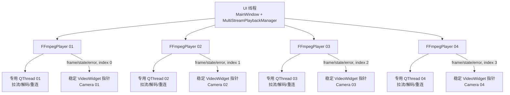

# 第四周：首批四路 RTMP 独立播放

## 1. 实施结果

完成日期：2026-07-26。

程序启动时确定性创建 `Camera 01`～`Camera 04`，并默认绑定：

```text
Camera 01 -> rtmp://127.0.0.1:1935/live/camera001
Camera 02 -> rtmp://127.0.0.1:1935/live/camera002
Camera 03 -> rtmp://127.0.0.1:1935/live/camera003
Camera 04 -> rtmp://127.0.0.1:1935/live/camera004
```

四路分别拥有独立的 `FFmpegPlayer`、`QThread`、停止标志、重连状态和最新帧邮箱。
任一路连接失败、断流或解码失败只会清空并更新自己的 `VideoWidget`。动态网格、拖拽
交换、单路全屏和最多 16 格的 UI 能力继续保留；Camera 05～16 本阶段不创建播放器。

## 2. 线程与所有权



`MultiStreamPlaybackManager` 位于 UI 线程，只管理播放器所有权、稳定索引路由和启停。
网络读取、H.264 软件解码和 RGB888 转换仍在各自的解码线程执行。管理器公开：

```cpp
int streamCount() const;
bool startStream(int index);
void stopStream(int index);
int startAll();
void stopAll();
bool isStreamRunning(int index) const;
```

对外事件都携带 `streamIndex`：

```cpp
void frameReady(int streamIndex, const QImage &image);
void stateChanged(int streamIndex, FFmpegPlayer::PlaybackState state);
void errorOccurred(int streamIndex, const QString &message);
```

管理器按值捕获创建时的稳定索引。`main.cpp` 在任何拖拽发生前取得前四个
`VideoWidget` 的 `QPointer`。拖拽只改变控件在网格中的位置，不改变播放器到控件
对象的绑定，因此标题、状态和画面会作为一个整体移动。

## 3. 启动、失败隔离与关闭

### 3.1 启动

1. `MainWindow` 在尚未显示时同步创建四格，不播放添加动画。
2. `main.cpp` 捕获前四个控件的稳定指针。
3. 管理器按 URL 数量创建四个独立播放器并连接带索引信号。
4. `startAll()` 依次调用四个播放器的 `start()`；某一路立即启动失败时仍继续启动后续路。
5. 各播放器进入自己的连接、播放或退避重连循环。

`FFmpegPlayer` 的 session-id 保护、FFmpeg 中断回调和“只投递最新一帧”的背压策略
保持不变。帧、状态和错误由索引分流，UI 不共享单路播放状态。

### 3.2 两阶段停止

`FFmpegPlayer::requestStop()` 只设置原子停止标志并唤醒重连等待，不阻塞 UI 线程。
`stopAll()` 分成两阶段：

1. 向全部播放器调用 `requestStop()`，让四路阻塞 I/O 和退避等待同时开始退出；
2. 再逐路调用 `stop()` 等待并回收线程。

这样总关闭时间接近最慢一路的退出时间，而不是四路网络超时相加。停止操作幂等，
未启动停止和重复停止均安全，不使用 `QThread::terminate()`。

FFmpeg 的 `avformat_network_init()` 由进程级静态运行时在首个播放器解码线程启动前
执行一次，所有播放器退出后随进程统一 `avformat_network_deinit()`，避免每个解码
线程重复初始化和释放全局网络模块。

## 4. 命令行 URL

`--url` 可重复 1～4 次，依次覆盖 Camera 01～04；未提供的位置继续使用默认地址。
原有单次参数仍兼容：

```powershell
.\out\build-windows-x64\debug\rtmp_monitor.exe `
    --url rtmp://127.0.0.1:1935/live/camera001
```

四路覆盖示例：

```powershell
.\out\build-windows-x64\debug\rtmp_monitor.exe `
    --url rtmp://127.0.0.1:1935/live/camera001 `
    --url rtmp://127.0.0.1:1935/live/camera002 `
    --url rtmp://127.0.0.1:1935/live/camera003 `
    --url rtmp://127.0.0.1:1935/live/camera004
```

第五次 `--url` 会在创建窗口前打印错误并返回失败。仍只接受 `rtmp://`，且错误消息
不会回显可能含凭据的完整 URL。

## 5. 性能取舍

本阶段没有引入通用线程池或额外的单线程逻辑队列。RTMP 拉流和解码是长生命周期、
包含阻塞 I/O 的任务；把四路任务长期占用在线程池中既不能减少需要并发执行的解码
上下文，也容易饿死池内短任务。四个专用线程使故障边界、退出等待和线程归属更明确。

轻量启停和索引路由留在 UI 线程，实际解码不经过 UI 任务队列。沿用最新帧邮箱可
限制每路待显示帧数量，避免 Qt 队列随输入帧率无限增长。硬件解码、OpenGL、统一
解码调度、UI 限帧和 9/16 路真实播放应先取得 CPU、内存、帧率和延迟数据后再设计。

## 6. 自动测试

Windows Debug：

```powershell
cmake --preset Qt-Debug
cmake --build out/build-windows-x64/debug
ctest --test-dir out/build-windows-x64/debug --output-on-failure
```

测试目标及覆盖：

| 目标 | 覆盖 |
|---|---|
| `rtmp_monitor_ui_smoke_test` | 拖拽交换真实对象、全屏进入和恢复 |
| `rtmp_monitor_dynamic_grid_test` | 主窗口默认四格、2×2、索引和名称；继续添加到 16 格 |
| `rtmp_monitor_ffmpeg_player_test` | 单路生命周期、重连、中断和最新帧 |
| `rtmp_monitor_multi_stream_test` | 四个独立播放器、索引信号、单路隔离、幂等停止、四路并行退出 |

多路测试默认使用不可用的本地地址，不依赖 RTMP 服务。可选真实流测试要求恰好四个
分号分隔的地址，并验证索引 0～3 都收到 `QImage::Format_RGB888` 视频帧：

```powershell
$env:RTMP_MONITOR_TEST_URLS = @(
    "rtmp://127.0.0.1:1935/live/camera001",
    "rtmp://127.0.0.1:1935/live/camera002",
    "rtmp://127.0.0.1:1935/live/camera003",
    "rtmp://127.0.0.1:1935/live/camera004"
) -join ";"

ctest --test-dir out/build-windows-x64/debug `
    -R rtmp_monitor_multi_stream_test --output-on-failure
```

### 6.1 本次结果

| 检查 | 结果 |
|---|---|
| Windows Debug 完整 CTest | 4/4 通过，28.31 秒（2026-07-27 复验） |
| 四路真实 RTMP/RGB888 集成测试 | 1/1 通过，12.07 秒，四个索引均收到帧 |
| 四路不可用地址批量退出 | 通过，测试上限 4 秒，无残留解码线程 |
| Linux ARM64 交叉构建 | 主程序和四个测试目标全部编译、链接成功 |
| `file/readelf` 架构检查 | 主程序及多路测试均为 ELF64/AArch64 |

实况检查使用同一个本地 H.264 测试素材同时推送到 camera001～camera004。程序四格
连续显示后终止 camera003：第三格单独清黑并显示 I/O error 和退避重连，另外三格
持续播放；恢复 camera003 推流后第三格自动继续。全播放状态关闭窗口可以正常退出，
没有残留 `rtmp_monitor` 进程。拖拽交换与 Camera 02/03 全屏进入、退出由 UI smoke
自动测试覆盖。

## 7. ARM64 构建门禁

```bash
cmake --preset Linux-ARM64-Debug
cmake --build --preset Linux-ARM64-Debug
file out/build-linux-arm64/debug/rtmp_monitor
file out/build-linux-arm64/debug/rtmp_monitor_multi_stream_test
aarch64-linux-gnu-readelf -h out/build-linux-arm64/debug/rtmp_monitor
```

本次输出中的 `Class` 为 `ELF64`，`Machine` 为 `AArch64`。WSL2 只负责交叉构建，
不代替真实 ARM64 盒子的 QPA、窗口系统和视频性能验收。

## 8. 人工验收清单

本节使用 [test_week4_multi_stream.ps1](../scripts/test_week4_multi_stream.ps1)
准备环境和注入故障。脚本不会模拟鼠标拖拽、双击或 `Alt+F4`，这些操作必须由
测试人员亲自完成，才能覆盖真实的 Windows 输入和窗口行为。

### 8.1 当前电脑与前置条件

本文档中的默认路径和窗口摆放针对当前开发电脑：

| 项目 | 当前值 |
|---|---|
| 操作系统 | Windows 11 专业版 64 位，版本 10.0.22631 |
| CPU | AMD Ryzen 7 6800H，8 核 16 线程 |
| 内存 | 约 16 GB |
| 主屏 | 1920×1080，工作区 1920×1032 |
| 副屏 | 1536×864 |
| FFmpeg | `E:\DevTools\ffmpeg-8.1.2-full_build\bin\ffmpeg.exe` |
| nginx-rtmp | `E:\DevTools\nginx-rtmp` |
| 测试视频 | `E:\rtmpProject\testdata\test.mp4`，H.264、1920×1080、30 fps |
| Qt Debug 程序 | `E:\rtmpProject\out\build-windows-x64\debug\rtmp_monitor.exe` |

测试脚本默认把同一素材编码成四路 1280×720、30 fps 的 H.264/RTMP，并在左上角
叠加不同颜色的 `CAMERA 001`～`CAMERA 004` 标签。标签用于确认画面、标题和状态在
拖拽后仍属于同一个 `VideoWidget`。

从 Windows“开始”菜单打开普通 PowerShell，然后执行：

```powershell
Set-Location E:\rtmpProject
```

下面所有命令都显式使用 `-NoProfile`，避免当前用户 PowerShell 配置中失效的
`H:\ANACONDA3\conda.exe` 路径产生无关警告。脚本不要求管理员权限；若防火墙首次
询问 nginx 或 FFmpeg 的本地网络访问，只允许专用网络即可。

测试前确认：

- `testdata\test.mp4` 存在；
- Debug 程序已经完成构建；
- 没有其他程序占用 `camera001`～`camera004`；
- 如果 1935 已经有可用 RTMP 服务，脚本会复用并且清理时不会停止它；
- 如果存在 nginx 进程但 1935 没有监听，脚本会拒绝自动清理，避免误杀其他环境。

先执行只读检查：

```powershell
powershell.exe -NoProfile -ExecutionPolicy Bypass `
    -File .\scripts\test_week4_multi_stream.ps1 `
    -Action Check
```

通过时应看到：

- FFmpeg、ffprobe、nginx、测试视频和 Qt 程序全部存在；
- `libx264`、`drawtext`、RTMP 和 FLV 均可用；
- 测试视频报告 `codec_name=h264`、`1920x1080`、`30/1`；
- 主屏和副屏的分辨率与上表一致；
- 脚本打印 1935 当前是否监听，但未启动任何新进程。

### 8.2 启动四路并检查基础画面

启动 nginx、四路推流和 Qt 程序：

```powershell
powershell.exe -NoProfile -ExecutionPolicy Bypass `
    -File .\scripts\test_week4_multi_stream.ps1 `
    -Action Start
```

脚本把 Qt 主窗口移动到主屏工作区。等待最多 10 秒，然后检查：

1. 主屏显示 Camera 01～Camera 04，布局恰好为 2×2。
2. 四格分别显示 `CAMERA 001`、`CAMERA 002`、`CAMERA 003`、`CAMERA 004`。
3. 成功出帧后连接状态文字消失，不应持续显示“正在连接”或“正在缓冲”。
4. 四格画面持续变化，没有某一格长期冻结。
5. 原素材和输出均为 16:9；允许视频区域上下或左右留黑边，但人物、窗口和文字不能
   被横向或纵向拉伸。

在另一个 PowerShell 窗口执行：

```powershell
powershell.exe -NoProfile -ExecutionPolicy Bypass `
    -File .\scripts\test_week4_multi_stream.ps1 `
    -Action Status
```

`Status` 应报告：

- RTMP 1935 为“监听”；
- `rtmp_monitor` 为“运行”；
- Camera 01～04 都有不同的 FFmpeg PID；
- 每个进程都有运行时间、累计 CPU 秒数和工作集内存。

打开任务管理器的“详细信息”页，记录 `rtmp_monitor.exe` 和四个 `ffmpeg.exe` 的
CPU、内存。本次只建立功能验收基线，不设置性能通过门槛；记录值明显持续上升或系统
无法流畅操作时，在结果表中注明。

### 8.3 注入 camera003 单路故障并恢复

停止第三路推流：

```powershell
powershell.exe -NoProfile -ExecutionPolicy Bypass `
    -File .\scripts\test_week4_multi_stream.ps1 `
    -Action StopCamera03
```

预期现象：

1. Camera 03 在网络读取失败后清黑。
2. 第三格显示类似“视频流已中断：I/O error；1 秒后重试”的提示，后续退避间隔可
   依次增长到 2、4、5 秒。
3. Camera 01、02、04 始终保留画面，不出现清黑或重连提示。
4. `Status` 只把 Camera 03 报告为“停止”，其余三路和应用仍为“运行”。

任何其他格同时清黑、应用无响应或退出，都判定为失败。此时先执行 `Status`，再查看：

```text
out\week4-multi-stream-manual\camera003.ffmpeg.log
```

恢复第三路：

```powershell
powershell.exe -NoProfile -ExecutionPolicy Bypass `
    -File .\scripts\test_week4_multi_stream.ps1 `
    -Action StartCamera03
```

播放器最长可能处于 5 秒退避等待，再加上连接和首帧时间。以命令执行完成为起点，
最多等待 8 秒；Camera 03 应重新出现带蓝色标签的 `CAMERA 003` 连续画面。

### 8.4 手动交换 Camera 01 和 Camera 04

确认网格不在添加动画或全屏状态，然后：

1. 把鼠标移到 Camera 01 的标题或格子空白边框。
2. 按住鼠标左键，移动超过几像素以触发 Windows/Qt 拖拽。
3. 保持左键按下，把鼠标移动到 Camera 04 格子的中央。
4. 看到目标格高亮后释放左键。
5. 等待约 220 ms 的交换动画结束，期间不要再次点击。

通过标准：

- 原 Camera 01 整个控件移动到右下位置；
- 右下位置的标题仍为 `Camera 01`，画面标签仍为 `CAMERA 001`；
- 原 Camera 04 移到左上，标题与 `CAMERA 004` 标签仍匹配；
- 两路视频在拖拽前后连续播放，状态没有重新连接；
- Camera 02、03 的位置和画面不变。

用相同动作把 Camera 01 和 Camera 04 换回原位。若拖动没有开始，优先从标题文字旁的
空白区域重新按下并移动；不要从顶部工具栏开始拖动。

### 8.5 手动验证 Camera 02 和 Camera 03 全屏

Camera 02：

1. 双击 Camera 02 的标题区域。
2. 全屏窗口应出现在 Camera 02 所在的主屏，而不是副屏。
3. 观察 `CAMERA 002` 画面仍持续变化，没有重新连接或短暂换成其他路。
4. 把鼠标移到屏幕底部约 120 像素区域，确认悬浮控制栏出现。
5. 移开鼠标并等待约 2.5 秒，控制栏应自动隐藏。
6. 按 `Esc`，确认回到原 2×2 网格。

Camera 03：

1. 双击 Camera 03 标题进入全屏。
2. 确认显示 `CAMERA 003` 且播放连续。
3. 再次双击全屏画面退出。

两次退出后，四个格子的标题、标签、位置和播放状态都应与进入全屏前一致。全屏时的
静音和截图按钮仍是接口占位，不纳入本次验收。

### 8.6 三种关闭状态

每次都使用真实窗口关闭操作，不用脚本强杀应用；关闭后用 `Status` 判断结果。

#### A. 四路全播放

1. 确认四格都在播放。
2. 激活 Qt 窗口并按 `Alt+F4`，或点击右上角关闭按钮。
3. 从关闭动作开始计时，最多等待 5 秒。
4. 执行 `-Action Status`。

通过标准：窗口消失、`rtmp_monitor` 显示“停止”，四个 FFmpeg 推流可继续运行，
Windows 不出现“程序未响应”或线程销毁警告。

重新启动应用：

```powershell
powershell.exe -NoProfile -ExecutionPolicy Bypass `
    -File .\scripts\test_week4_multi_stream.ps1 `
    -Action StartApp
```

#### B. Camera 03 重连中

1. 执行 `-Action StopCamera03`。
2. 等 Camera 03 清黑并显示重连，确认其他三格继续播放。
3. 按 `Alt+F4`，5 秒内执行 `Status`。
4. 确认应用为“停止”，其余三路 FFmpeg 仍运行。
5. 执行 `-Action StartCamera03` 恢复测试环境。
6. 执行 `-Action StartApp`，确认四格重新显示。

#### C. 四路全部连接失败

停止全部推流但保留 nginx 和应用：

```powershell
powershell.exe -NoProfile -ExecutionPolicy Bypass `
    -File .\scripts\test_week4_multi_stream.ps1 `
    -Action StopStreams
```

等待四格全部清黑并显示各自的重连状态，然后按 `Alt+F4`。5 秒内执行 `Status`；
应用和四路 FFmpeg 都应显示“停止”，不能有残留 `rtmp_monitor`。

如果还要恢复四路继续观察：

```powershell
powershell.exe -NoProfile -ExecutionPolicy Bypass `
    -File .\scripts\test_week4_multi_stream.ps1 `
    -Action StartStreams

powershell.exe -NoProfile -ExecutionPolicy Bypass `
    -File .\scripts\test_week4_multi_stream.ps1 `
    -Action StartApp
```

### 8.7 清理、日志和重复停止

验收结束后执行：

```powershell
powershell.exe -NoProfile -ExecutionPolicy Bypass `
    -File .\scripts\test_week4_multi_stream.ps1 `
    -Action Stop
```

`Stop` 的安全边界：

- 先请求脚本记录的 Qt 主窗口正常关闭，最多等待 5 秒；
- 只停止状态文件中记录的四路 FFmpeg；
- 停止前核对 PID、进程名、可执行路径和 UTC 启动时间，避免 PID 复用误杀；
- nginx 在测试前已运行时保持不动；
- nginx 由脚本启动时先优雅退出，只在失败后终止经过相同身份校验的记录进程。

再次执行同一个 `Stop` 命令，结果仍应为成功且不影响其他进程。日志和最终状态保留在：

```text
out\week4-multi-stream-manual\
├── state.json
├── camera001.ffmpeg.log
├── camera002.ffmpeg.log
├── camera003.ffmpeg.log
└── camera004.ffmpeg.log
```

`out/` 已被 Git 忽略。验收后执行 `git status --short`，这些日志、PID 和状态不能出现
在 Git 差异中。

### 8.8 验收记录表

复制下面的表格填写，CPU 和内存只记录观察值：

| 日期时间 | 验收步骤 | 结果 | CPU/内存或耗时 | 异常与日志 |
|---|---|:---:|---|---|
|  | 四路 2×2 连续播放 | 通过/失败 | Qt：；FFmpeg 合计： |  |
|  | camera003 单路停止 | 通过/失败 | 其他三路是否连续： |  |
|  | camera003 自动恢复 | 通过/失败 | 恢复耗时： |  |
|  | Camera 01/04 拖拽交换 | 通过/失败 | 动画和绑定： |  |
|  | Camera 02/03 全屏退出 | 通过/失败 | 播放是否中断： |  |
|  | 全播放状态关闭 | 通过/失败 | 关闭耗时： |  |
|  | 部分重连状态关闭 | 通过/失败 | 关闭耗时： |  |
|  | 全失败状态关闭 | 通过/失败 | 关闭耗时： |  |
|  | Stop 与重复 Stop | 通过/失败 | 残留进程： |  |

### 8.9 ARM64 验收边界

当前 Windows 电脑可以执行 AArch64 交叉构建和 `file/readelf` 架构检查，但不能替代
目标 ARM64 盒子的显示系统、QPA、GPU 和网络环境。部署到盒子后，应按 8.2～8.8
重复四路播放、单路断流、拖拽、全屏和三种关闭场景，并额外记录 CPU、内存、帧率、
端到端延迟和关闭耗时。

## 9. 本阶段边界

- Camera 05～16 仅为 UI 占位，不创建额外播放器。
- 不增加配置系统、日志面板、硬件解码、OpenGL 或录制。
- 不引入线程池、统一解码调度或专用逻辑线程。
- 不修改被 Git 忽略的 `docs/project_handoff.md`。
