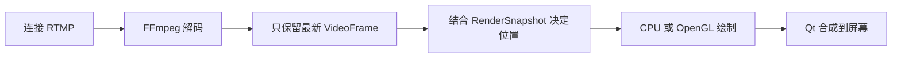
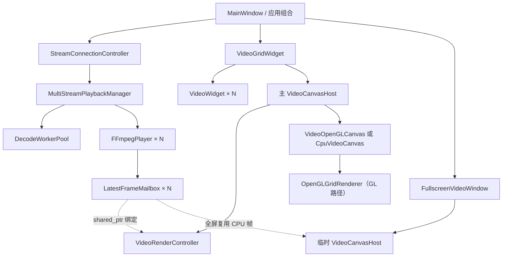
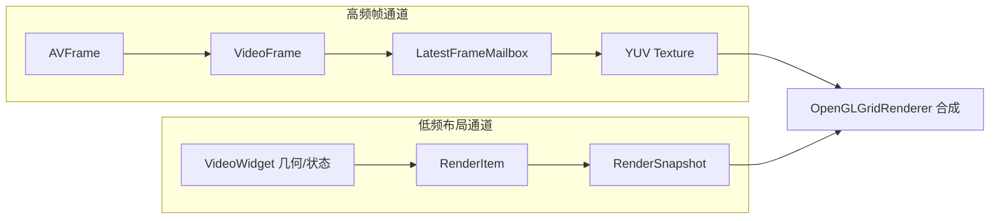
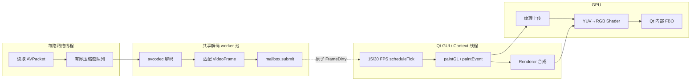
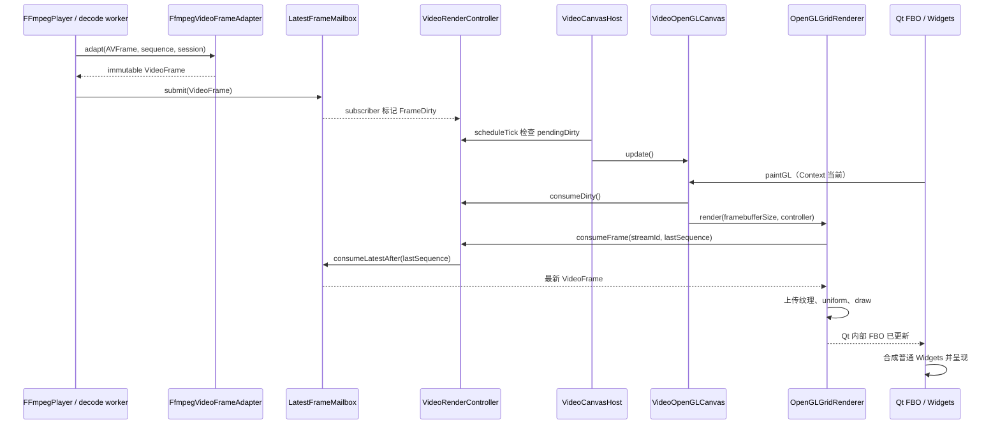
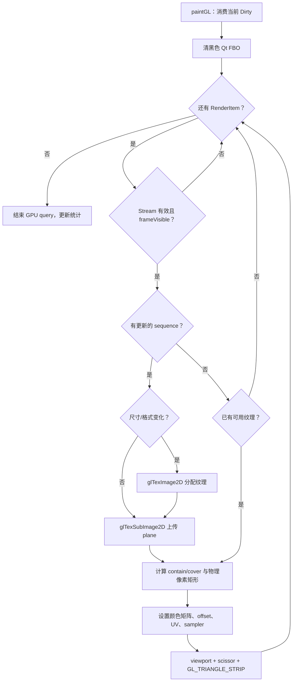
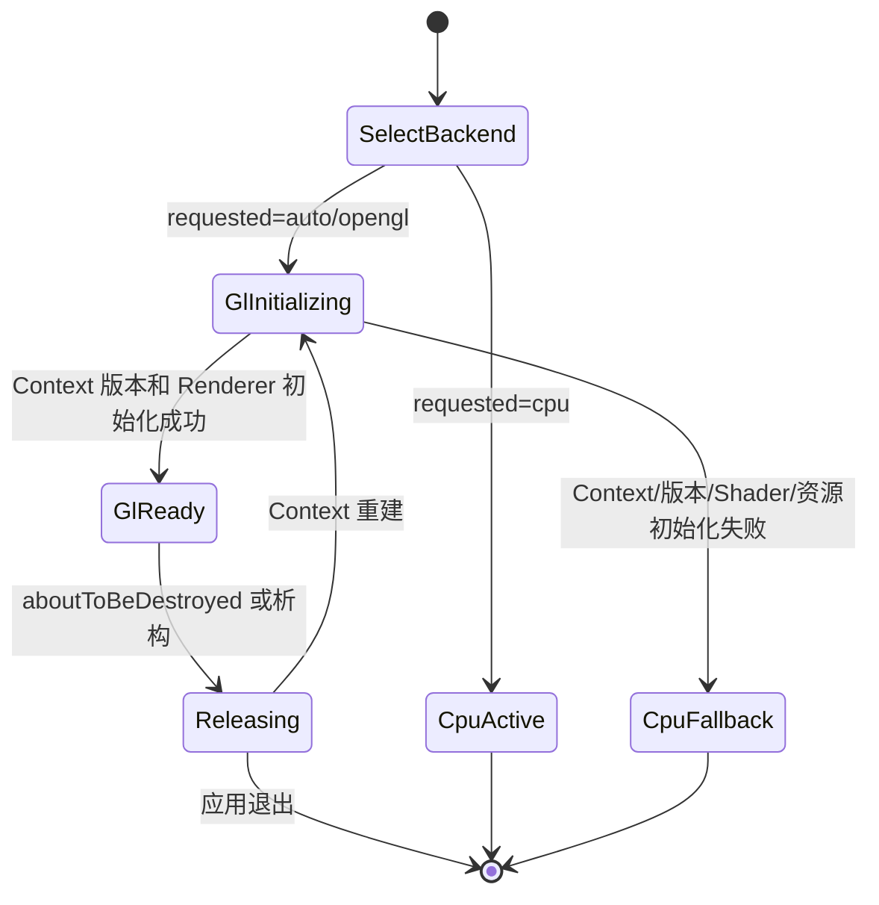
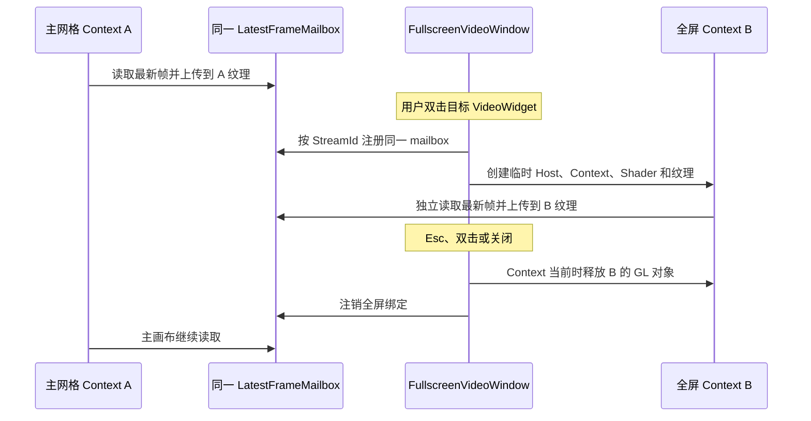
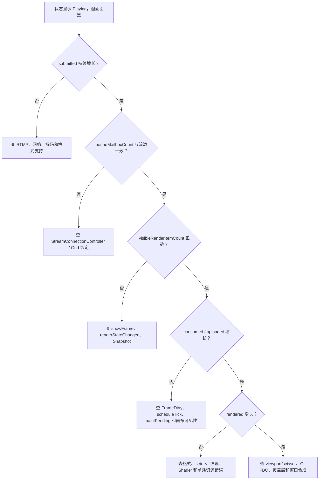

# Week 6 OpenGL 框架与 CPU/OpenGL 自动化对照测试：纯新手实战篇

> 历史记录：本文的本机 A/B 性能脚本已经退役，仅保留测试方法和历史结果。参见[遗留脚本索引](../../archive/legacy_test_scripts.md)。

> Windows 真实摄像头 30 FPS 资格测试已经迁移到[新指南](../../guides/testing/windows_camera_validation.md)。本文件中的历史 15 FPS CPU/OpenGL 对照不能替代 schema v4 摄像头门禁。

这篇文档从“项目里的每个类究竟在干什么”开始，最后才进入测试命令。读者只学过 LearnOpenGL 入门内容也可以从头阅读，不需要先读其他 Week 6 文档。

建议严格按顺序阅读：

```text
项目要解决什么问题
→ 先认识名词和类名
→ 认识每个角色
→ 看懂一路视频怎样接力
→ 再扩展到 16 路和全屏
→ 最后运行脚本并解释证据
```

如果只想复制命令，可以从[第 9 章](#9-开始测试前的准备)开始；但第一次接触本项目时，不建议跳过前八章。

> 本文以当前 `.cpp` 实现和正式测试结果为准。少数历史头文件注释仍提到“VideoWidget 绘制帧”或“全屏搬运视频区域”，那是旧 CPU 架构留下的描述；当前产品路径实际使用共享主画布和临时全屏画布。

## 1. 这个项目到底要解决什么问题

RtmpMonitor 要同时接收、解码并显示 0～16 路 RTMP/H.264 视频。它不是只把一张图片画到窗口，而是要长期重复完成下面五件相互独立的事：

1. **连接**：找到 RTMP Server，读取一路持续到来的压缩数据。
2. **解码**：把 H.264 压缩包变成可读取像素的 YUV 帧。
3. **保存最新画面**：解码可能是 30 FPS，网格只计划显示 15 FPS，所以旧帧必须允许被新帧覆盖。
4. **决定画在哪里**：拖拽、增删、窗口缩放和全屏都会改变每路画面的矩形。
5. **真正绘制**：CPU 后端把 YUV 转为 `QImage` 后用 `QPainter` 画；OpenGL 后端把 YUV 上传成纹理并由 Shader 转成 RGB。

这五件事不能塞进一个大类。否则网络阻塞会拖住界面、窗口缩放会影响解码、OpenGL Context 销毁会干扰连接状态，最终很难判断黑屏究竟坏在哪一层。

### 1.1 为什么“Playing”不等于“已经显示”

`Playing` 只能证明连接和解码链已经取得有效帧。要在显示器上看到画面，后面还必须全部成功：

```text
邮箱收到帧
→ 该 StreamId 出现在 RenderSnapshot 中
→ RenderItem.frameVisible 为 true
→ FrameDirty 被调度器看到
→ Canvas 收到一次 paint
→ 纹理上传成功
→ Shader draw 成功
→ Qt 把内部 FBO 合成到窗口
```

所以“连接成功但黑屏”不应该立即归咎于 nginx 或 FFmpeg。指标必须告诉我们，帧在哪一站停止了。

### 1.2 为什么不采用“解码一帧，立即画一帧”

假设 16 路输入都是 30 FPS，每秒会产生 480 帧。如果每帧都向 Qt GUI 事件队列投递一次绘制请求，GUI 会不断处理已经过时的任务，延迟会越积越大。

本项目采用实时视频原则：**宁可丢掉旧帧，也不要排队显示历史画面**。

- 每路 `LatestFrameMailbox` 容量固定为 1。
- 解码线程只替换最新帧并标记 `FrameDirty`。
- 主网格调度器约 15 FPS 检查是否需要绘制。
- 全屏调度器约 30 FPS 检查是否需要绘制。
- 一次 `paintGL()` 最多扫描 16 个邮箱，每路只上传比上次 sequence 更新的帧。

### 1.3 CPU 后端和 OpenGL 后端的区别

两种后端共享连接、解码、`VideoFrame`、邮箱、布局和调度。区别只发生在最后的像素处理阶段：

| 阶段 | CPU 后端 | OpenGL 后端 |
|---|---|---|
| 读取帧 | 从同一个邮箱读取 `VideoFrame` | 从同一个邮箱读取 `VideoFrame` |
| YUV→RGB | CPU 转成 `QImage` | Fragment Shader 在 GPU 上转换 |
| 缩放/合成 | `QPainter::drawImage()` | viewport、scissor、UV 和 draw call |
| 帧缓存 | 每路 CPU `QImage` cache | 每路 GPU YUV texture set |
| 诊断用途 | 可靠回退和画质参考 | 默认产品路径 |

因此 A/B 测试不是比较两套播放器，而是固定相同输入和上游链路，只比较最终渲染后端。

### 1.4 为什么 16 路只使用一个主画布

LearnOpenGL 示例通常只有一个窗口和一个三角形。这里仍然保持一个主 `QOpenGLWidget`：16 路只是同一次 `paintGL()` 中最多 16 次轻量绘制。

如果每路各有一个 `QOpenGLWidget`，就会产生最多 16 个 Context、Qt 内部 FBO 和更多 Context 切换；拖拽、全屏、退出以及未来硬件帧导入都会更复杂。单画布让所有路共享 Shader、VAO、VBO 和一次 Qt 合成，同时每路只保留自己的纹理。

## 2. 先认识会反复出现的名词

| 名词 | 新手解释 | 在本项目中的具体含义 |
|---|---|---|
| Stream | 一条持续到来的媒体数据 | 一个稳定 `StreamId` 对应一路 RTMP 播放会话 |
| Packet | 压缩后的“小包裹” | FFmpeg 读取到的 H.264 `AVPacket`，还不能直接显示 |
| Decoded frame | 解压后的完整画面 | FFmpeg `AVFrame`，随后适配成项目的 `VideoFrame` |
| YUV | 把亮度与色度分开保存的像素表示 | 第一版支持 YUV420P8 和 NV12_8 |
| Plane | 一块二维像素平面 | Y、U、V 三平面，或 Y 与交错 UV 两平面 |
| Stride | 内存中相邻两行起点的距离 | 可能大于有效像素字节数，也可能为负数 |
| Texture | Shader 可采样的 GPU 二维数据 | 每路 YUV plane 对应一张 GL texture |
| Shader | GPU 执行的小程序 | Vertex Shader 传位置/UV，Fragment Shader 做 YUV→RGB |
| Uniform | 一次 draw 使用的只读参数 | 颜色矩阵、offset、UV 矩形、NV12 开关、sampler 编号 |
| Context | OpenGL 状态和对象名字所属的环境 | GL 对象只能在所属 Context 当前时创建、使用和释放 |
| FBO | 一块可被 OpenGL 绘制的目标图像 | `QOpenGLWidget` 内部 FBO，Qt 再把它合成到窗口 |
| Snapshot | 某一时刻的完整描述 | `RenderSnapshot` 描述画布和全部格子，不复制帧像素 |
| Dirty | “有东西变化了”的位标记 | Frame/Layout/Resource/Viewport 等变化可以合并 |
| Backend | 同一接口下的具体实现 | `cpu` 或 `opengl`；`auto` 优先 GL，失败时回退 CPU |

最容易混淆的是“帧”和“布局”。`VideoFrame` 回答“像素是什么”，`RenderSnapshot` 回答“应该画在哪里”。它们变化频率不同，所以绝不能合成一个每帧复制的大对象。

## 3. 从类名判断它的职责

项目采用英文角色后缀。先学会读类名，后面看到新类时就不容易迷路。

| 后缀/名词 | 代表什么 | 项目例子 |
|---|---|---|
| `Frame` | 一帧不可变画面数据 | `VideoFrame` |
| `Mailbox` | 生产者和消费者之间的最新值交换点 | `LatestFrameMailbox` |
| `Item` | 一次合成中的单个绘制项目 | `RenderItem` |
| `Snapshot` | 某一时刻的完整低频状态 | `RenderSnapshot` |
| `Player` | 读取并解码一路媒体 | `FFmpegPlayer` |
| `Manager` | 管理多个同类对象及生命周期 | `MultiStreamPlaybackManager` |
| `Controller` | 协调模块，不包办具体底层工作 | `StreamConnectionController`、`VideoRenderController` |
| `Host` | 承载并选择一种实现 | `VideoCanvasHost` |
| `Renderer` | 真正操作图形资源并发出 draw | `OpenGLGridRenderer` |
| `Widget` | Qt 界面、几何或交互控件 | `VideoWidget`、`VideoGridWidget` |
| `Window` | 独立顶层窗口和生命周期 | `FullscreenVideoWindow` |
| `Adapter` | 把外部表示转换成项目统一表示 | `FfmpegVideoFrameAdapter` |

### 3.1 五个最容易混淆的名字

**为什么 `VideoCanvasHost` 不是 Renderer？**  `Host` 负责选择 CPU/GL 子画布、调度 paint、记录后端身份和执行 fallback；它本身不持有 GLuint，也不实现 YUV Shader。真正执行 GL 的是 `OpenGLGridRenderer`。

**为什么 `VideoRenderController` 不直接写 GL？**  Controller 保存 Snapshot、StreamId→Mailbox 绑定和 Dirty 状态。这些逻辑 CPU/GL 都需要。若它直接写 GL，CPU fallback 就无法复用同一控制层。

**为什么叫 `LatestFrameMailbox`，而不是 `FrameQueue`？**  Queue 暗示每个元素都会按顺序消费；Mailbox 容量只有 1，新帧可以覆盖未显示的旧帧。它追求低延迟，不追求播放每一帧。

**为什么有 `VideoWidget`，它却不画视频像素？**  Widget 仍是每个格子的交互和几何锚点：标题、状态、选择、拖拽、右键和双击都属于它。像素由下层共享画布统一合成。

**为什么 16 路不是 16 个 `OpenGLGridRenderer`？**  `GridRenderer` 的“Grid”表示它的职责就是遍历整个 `RenderSnapshot`。一路对应一组纹理和一个 `RenderItem`，不是一个 Renderer。

## 4. 按一帧经过的顺序认识所有类

下面的“角色卡”都回答相同问题：为什么存在、输入输出、保存内容、线程与生命周期、合作边界、故障表现和源码入口。先关注粗体第一句，第二遍阅读时再看细节。

### 4.1 `StreamConnectionController`：业务接线员

- **名字和职责**：`ConnectionController` 表示它协调设备、URL、稳定 `StreamId`、UI 槽位与播放 Manager，不直接解码或绘制。
- **解决的问题**：用户点击连接、断开或重连时，要让业务状态、Player 和对应 `VideoWidget` 始终指向同一路流。
- **输入/输出**：接收设备/URL和 UI 操作；调用 `MultiStreamPlaybackManager` 创建流，并把 Manager 返回的 mailbox 绑定给主窗口。
- **保存内容**：连接记录、StreamId 与界面对象之间的业务映射。
- **线程/生命周期**：在 Qt GUI 所有者线程工作；随应用组合创建，应用退出时先停止连接链。
- **合作对象**：`MainWindow`、`MultiStreamPlaybackManager`、`VideoGridWidget`。
- **不负责**：`AVPacket`、YUV plane、纹理、Shader、viewport。
- **故障表现**：设备状态和画面槽位错配、重连了错误流、删除后仍残留绑定。
- **源码入口**：`src/common/app/StreamConnectionController.cpp` 中的连接、绑定和状态处理函数。

### 4.2 `MultiStreamPlaybackManager`：多路播放器管理员

- **名字和职责**：`MultiStream` 表示 0～16 路，`Manager` 表示它拥有各路 Player 并管理共享资源。
- **解决的问题**：每路网络会话独立，但解码 worker 不应无限增加；指标也要统一汇总和写出。
- **输入/输出**：接收 add/start/stop/restart；输出稳定 `StreamId`、状态/错误信号、mailbox 和 schema v3 指标。
- **保存内容**：每路 `Entry`、一个共享 `DecodeWorkerPool`、指标定时器和 UI watchdog。
- **线程/生命周期**：公开管理接口在 QObject 所在线程调用，通常是 GUI 线程；真正网络和解码工作交给其他线程。
- **合作对象**：`FFmpegPlayer`、`DecodeWorkerPool`、`StreamConnectionController`、指标脚本。
- **不负责**：逐帧向 QWidget 发 `QImage`，也不决定格子位置。
- **故障表现**：流数量/StreamId 不一致、停止时未排空、指标缺路或 worker 数异常。
- **源码入口**：`include/common/media/MultiStreamPlaybackManager.h` 的 `addStream()`、`frameMailbox()`、`metricsSnapshot()`。

### 4.3 `FFmpegPlayer`：一路网络读取与解码入口

- **名字和职责**：每个实例只代表“一路 FFmpeg 播放会话”。它拥有独立阻塞网络线程，并把压缩包交给共享解码池。
- **解决的问题**：RTMP 读取可能长时间阻塞，不能卡住 GUI；解码也不能在网络线程里无限占用。
- **输入/输出**：输入 RTMP URL；输出状态、错误、重连事件和提交到 mailbox 的 `VideoFrame`。
- **保存内容**：会话 generation、网络线程、停止标志、有界压缩包队列相关状态、帧 sequence 和指标。
- **线程/生命周期**：`start()/stop()` 在 QObject 所有者线程；网络读取在每路 `QThread`；解码在共享 `DecodeWorkerPool` worker。提交 mailbox 的动作发生在解码 worker。
- **合作对象**：FFmpeg、`DecodeWorkerPool`、`FfmpegVideoFrameAdapter`、`LatestFrameMailbox`。
- **不负责**：视口缩放、生成逐帧 `QImage`、调用 OpenGL、决定显示 15 还是 30 FPS。
- **故障表现**：submitted 不增长、队列上涨、状态反复重连或旧 session 帧被提交。
- **源码入口**：`FFmpegPlayer::decodeNetworkLoop()`、`drainDecodeState()`、`frameMailbox()`。

### 4.4 `FfmpegVideoFrameAdapter`：FFmpeg 到项目边界的翻译器

- **名字和职责**：`Adapter` 把 FFmpeg 的 `AVFrame` 表示翻译成不暴露 FFmpeg 类型的 `VideoFrame`。
- **解决的问题**：Renderer 不应该依赖可被解码器复用的裸 `AVFrame::data`，也不应该到处解释 FFmpeg 颜色枚举。
- **输入/输出**：输入 `AVFrame`、time base、sequence、session generation 和时间戳；输出 `std::optional<VideoFrame>`。
- **保存内容**：它是无状态工具类型，不长期保存帧。
- **线程/生命周期**：在解码 worker 中同步调用，函数返回即结束。
- **所有权**：正常路径 `av_frame_clone()`，再用类型擦除 `shared_ptr` 持有；这样原始 `AVFrame` unref 后 plane 仍有效。
- **合作对象**：FFmpeg `AVFrame`、`VideoFrame`、颜色元数据回退函数。
- **不负责**：布局、显示 FPS、纹理和 UI。
- **故障表现**：帧格式被拒绝、plane/stride 错误、颜色元数据错误或释放后悬空。
- **源码入口**：`src/common/media/FfmpegVideoFrameAdapter.cpp` 的 `adapt()`。

### 4.5 `VideoFrame`：不可变的标准画面包裹

- **名字和职责**：它是渲染边界唯一认可的一帧视频值，不是 QWidget，也不是 GL texture。
- **解决的问题**：让解码和渲染用稳定、跨线程安全的共享所有权交换数据。
- **输入/输出**：由 Adapter 或测试构造；消费者只读 width/height/format/plane/stride/PTS/颜色/sequence/session。
- **保存内容**：最多三个 `VideoPlaneView`、有效行字节、带符号 stride、时间信息、颜色描述和类型擦除 owner。
- **线程/生命周期**：值对象可以在线程间复制；拷贝共享 owner，不复制正常 FFmpeg plane。最后一个副本销毁时才释放底层帧。
- **合作对象**：Adapter、Mailbox、CPU converter、OpenGL uploader。
- **不负责**：Stream 的屏幕位置、连接状态和 OpenGL Context。
- **故障表现**：`isValid()==false`、画面行错位、颜色错误、session 旧帧污染新连接。
- **源码入口**：`include/common/media/VideoFrame.h` 的只读访问器与 `copyFromPlanes()`。

### 4.6 `LatestFrameMailbox`：容量为 1 的最新帧取件柜

- **名字和职责**：解码生产者把最新帧放入，Canvas 消费者只取 sequence 更新的那一帧。
- **解决的问题**：生产 30 FPS、显示 15 FPS 时不能积累等待播放的旧画面。
- **输入/输出**：`submit()` 接收 `VideoFrame`；`consumeLatestAfter()` 返回比上次 sequence 更新的帧；`clear()` 清空断流旧画面。
- **保存内容**：一帧 `latest_`、最后消费 sequence、订阅回调和 submitted/overwritten/consumed/uploaded/rendered/latency 统计。
- **线程/生命周期**：内部 mutex 保护；解码 worker 提交，GUI/Context 线程消费。订阅回调在提交线程执行，所以只能做快速、非阻塞的原子 Dirty 标记。
- **合作对象**：`FFmpegPlayer`、`VideoRenderController`、CPU/GL Canvas、指标写入器。
- **不负责**：保证每帧显示、排序很长的播放队列、调用 QWidget::update()。
- **故障表现**：submitted 增长但 consumed/uploaded 不增长；覆盖伴随 frame age 上升说明下游消费不足。
- **源码入口**：`LatestFrameMailbox::submit()`、`consumeLatestAfter()`、`stats()`。

### 4.7 `VideoWidget`：一路视频格子的交互锚点

- **名字和职责**：它仍是一个 Qt `QFrame`，负责标题、状态、选择、拖拽、右键、双击全屏、视频区域几何，以及该格子的显示方式选择。
- **解决的问题**：共享画布负责像素后，每一路仍需要独立可交互的 UI 外壳。
- **输入/输出**：绑定 StreamId/mailbox，接收 `showFrame()/clearFrame()`；`setDisplayMode()` 修改本格模式；发出重连、移除、交换、全屏和 `renderStateChanged` 信号。
- **保存内容**：完整设备名 `deviceName_`、左上角覆盖标题、`videoSurface_` 几何锚点、`frameVisible_` 业务状态、mailbox 引用和 `displayMode_`。新格子默认 `Contain`；标准 16:9 流依靠同为 16:9 的 viewport 完整铺满，右键仍可手动改成 `Cover`。
- **线程/生命周期**：只在 GUI 线程；由 `VideoGridWidget` 创建和拥有，删除时解除绑定。
- **合作对象**：`VideoGridWidget`、`StreamConnectionController`、`FullscreenVideoWindow`。
- **不负责**：保存每帧 `QImage`、创建纹理、调用 Shader。
- **故障表现**：标题/状态错误、无法拖拽、`frameVisible` 未传播导致 Playing 但 Snapshot 不可见，或显示模式没有进入 Snapshot 导致菜单已切换但画面比例不变。
- **源码入口**：`bindRenderSource()`、`showFrame()`、`clearFrame()`、`displayMode()`、`setDisplayMode()`、`videoViewportRect()` 和 `contextMenuEvent()`。

标题现在是 `videoSurface_` 左上角的半透明覆盖标签，不再占用独立标题行。画面 viewport 因此可以利用原标题行的高度；长名称只在覆盖标签中省略，`deviceName()`、tooltip 和 Snapshot 始终保存完整名称。标题不接收鼠标事件，所以不会阻断拖拽、右键或双击。

显示模式属于 `VideoWidget`，也就是属于当前这个流格子。拖拽交换时，流、Widget 和显示模式一起移动；重连、清帧和重新播放不会重置它。删除格子后该选择自然消失，本轮不会跨应用重启永久保存。全屏窗口不照搬手动 Cover，而是显式使用 `Contain`，保证全屏始终能看到完整画面。

### 4.8 `VideoGridWidget`：0～16 路布局总管

- **名字和职责**：`GridWidget` 管理所有 `VideoWidget` 的唯一逻辑顺序、网格几何、动画和共享主画布。
- **解决的问题**：布局、交互和 Renderer 必须对“第几路位于哪个矩形”得到同一答案。
- **监控网格几何**：`MonitoringGridGeometry` 扣除边框和格间距后，在整数像素中分别计算“宽度受限”和“高度受限”的近似 16:9 候选，选择面积最大的有效尺寸，最后用动态 layout margins 把整个矩阵居中。普通窗口使用 4px 外边距和 4px 格间距；F11 监控墙使用 0px/0px。多余空间位于网格外围，而不是每路 16:9 视频内部。
- **输入/输出**：接收添加/删除/交换/绑定/窗口变化；输出 `RenderSnapshot` 给 `VideoCanvasHost`。
- **保存内容**：`videoWidgets_`、一个 `VideoCanvasHost`、网格布局、交互状态、监控墙状态和当前全屏来源。
- **线程/生命周期**：只在 GUI 线程；随主页面存在，主画布通常贯穿应用生命周期。
- **合作对象**：`VideoWidget`、`VideoCanvasHost`、`FullscreenVideoWindow`。
- **不负责**：解码、逐路绘制像素、保存 GLuint。
- **故障表现**：格子错位、拖拽后流与标题错配、Snapshot item 数错误、主网格首帧不刷新。
- **源码入口**：`calculateMonitoringGridGeometry()`、`setMonitoringWallMode()`、`bindVideoStream()`、`refreshRenderSnapshot()` 和 `handleRenderStateChanged()`。

### 4.9 `RenderItem`：一路应该怎样画的说明书

- **名字和职责**：一个 `Item` 只描述一次合成中的一路，不包含实际帧像素。
- **保存内容**：StreamId、tile rect、video viewport、该路独立的 `VideoDisplayMode`（Contain/Cover）、标题、状态、是否有可见帧、选中和全屏标记。
- **创建/消费**：由网格或全屏窗口在 GUI 线程创建，由 CPU/GL Canvas 在 GUI/Context 线程只读。
- **合作对象**：`RenderSnapshot`、`VideoRenderController`、`OpenGLGridRenderer`。
- **不负责**：plane、stride、PTS、texture ID。
- **故障表现**：viewport 错导致画偏；`frameVisible=false` 会让 Renderer 有意跳过该路。
- **源码入口**：`include/common/render/RenderTypes.h`。

### 4.10 `RenderSnapshot`：整个画布的低频快照

- **名字和职责**：`Snapshot` 表示“这一刻整个画布应该是什么样”，包含全部 `RenderItem`。
- **解决的问题**：Renderer 不应在 draw 中遍历和查询易变化的 QWidget 树。
- **保存内容**：generation、逻辑画布尺寸、device pixel ratio 和 `items`。
- **输入/输出**：网格/全屏构造后整体交给 Controller；Renderer 一次 paint 读取一份稳定描述。
- **线程/生命周期**：GUI 线程创建、替换和读取；它是低频状态，不随每个解码帧复制。
- **不负责**：帧数据和网络状态机。
- **故障表现**：增删/缩放后布局不刷新、DPI 错导致只画一部分、全屏仍保留多路 item。
- **源码入口**：`RenderTypes.h` 与两个 `refreshRenderSnapshot()`。

### 4.11 `VideoRenderController`：画布内部调度员

- **名字和职责**：它协调 Snapshot、StreamId→Mailbox 绑定和 Dirty，不创建窗口，也不执行 GL。
- **解决的问题**：CPU 和 OpenGL 后端需要完全相同的帧选择与低频状态接口。
- **输入/输出**：注册/注销 mailbox、接收 Snapshot、消费新 sequence、暴露 Dirty 位。
- **保存内容**：每路 `Binding`、Mailbox subscription、当前 Snapshot 和共享 `RenderDirtyState`。
- **线程/生命周期**：绑定和消费在 GUI/Context 线程；mailbox 回调可能在解码 worker 执行，但只通过 weak_ptr 标记原子 `FrameDirty`。
- **合作对象**：`LatestFrameMailbox`、`VideoCanvasHost`、CPU/GL Canvas。
- **不负责**：Qt 事件、目标 FPS、Shader、纹理。
- **故障表现**：bound mailbox 数不足、Dirty 不增长、消费了错误 sequence 或注销后仍收到回调。
- **源码入口**：`registerStream()`、`setSnapshot()`、`consumeFrame()`、`consumeDirty()`。

### 4.12 `VideoCanvasHost`：后端选择器和绘制节拍器

- **名字和职责**：`Host` 承载 `VideoOpenGLCanvas` 或 `CpuVideoCanvas`，并拥有共享 `VideoRenderController`。
- **解决的问题**：上层网格不应该知道当前是 CPU、GL 还是 GL 失败后的 fallback。
- **输入/输出**：接收 Snapshot/stream binding/目标 FPS/后端偏好；输出 active backend、GL 身份、统计和错误信号。
- **保存内容**：Controller、调度 `QTimer`、`paintPending_`、统计、后端身份和 fallback reason；不保存 GLuint。
- **线程/生命周期**：仅 GUI 线程。网格 Host 目标 15 FPS；全屏 Host 设置为 30 FPS。隐藏时保留 Dirty，不持续 update。
- **调度逻辑**：tick 只有在可见、没有待完成 paint 且 Dirty 非零时才 `update()`；paint 完成后清除 `paintPending_`。
- **合作对象**：两种 Canvas、`VideoRenderController`、网格/全屏窗口和指标系统。
- **不负责**：RTMP、解码、每路纹理细节。
- **故障表现**：requested=opengl 但 active=cpu、fallback reason 非空、scheduleChecks 增长但 updateRequests 不增长。
- **源码入口**：`createBackend()`、`scheduleTick()`、`onOpenGLInitialized()`、`runtimeMetrics()`。

### 4.13 `CpuVideoCanvas`：可诊断的 CPU 回退画布

- **名字和职责**：这是 `VideoCanvasHost.cpp` 内部类，用 `QPainter` 实现同一 Snapshot 的 CPU 参考路径。
- **输入/输出**：从 Controller 取 `VideoFrame`；用 `VideoFrameToImageConverter` 转成 `QImage` 并画到 QWidget。
- **保存内容**：每路 sequence、转换器和最后一张 `QImage` cache。
- **线程/生命周期**：GUI 线程创建和 `paintEvent()`；明确请求 CPU 或 GL 初始化失败时存在。
- **合作对象**：Host、Controller、颜色/布局纯逻辑函数。
- **不负责**：GL Context、纹理和 GPU timing。
- **故障表现**：CPU 占用较高、paint 时间高；但它也是判断 GL 画质是否退化的参考。
- **源码入口**：`src/common/ui/VideoCanvasHost.cpp` 内 `class CpuVideoCanvas`。

### 4.14 `VideoOpenGLCanvas`：Qt Context 生命周期外壳

- **名字和职责**：这是 `VideoCanvasHost.cpp` 内部 `QOpenGLWidget` 子类；它把 Qt 的 `initializeGL()/paintGL()` 生命周期交给生产 Renderer。
- **解决的问题**：OpenGL API 只能在 Context 当前时调用，而 Host 不应该持有 Context 资源。
- **输入/输出**：Qt 调用 GL 生命周期函数；Canvas 调用 `OpenGLGridRenderer::initialize/render/release` 并把成功或错误报告给 Host。
- **保存内容**：一个 `OpenGLGridRenderer` 和 Context 销毁连接。
- **线程/生命周期**：GUI/Context 线程；`initializeGL()` 建资源，`paintGL()` 绘制，`aboutToBeDestroyed` 或析构时 `makeCurrent()` 后释放。
- **合作对象**：Qt `QOpenGLWidget`、Host、Renderer、Controller。
- **不负责**：逐路网络连接、布局生成、后端选择策略。
- **故障表现**：Context/版本不足触发 CPU fallback；释放顺序错可能导致退出或全屏切换崩溃。
- **源码入口**：`VideoCanvasHost.cpp` 内 `class VideoOpenGLCanvas`。

### 4.15 `OpenGLGridRenderer`：单画布 YUV 合成施工队

- **名字和职责**：它在一个当前 Context 中为整个 Grid 管理 Shader、静态 Quad、纹理和 draw。
- **输入/输出**：输入 framebuffer size、Controller 和统计对象；输出 Qt 当前 FBO 中的合成画面。
- **保存内容**：Shader program、VAO/VBO、每个 StreamId 的纹理集合、staging buffer、GPU timer query 和 Context 相关状态。
- **线程/生命周期**：只能在拥有它的 `VideoOpenGLCanvas` Context 线程使用；初始化、render、release 都要求相同 Context 规则。
- **每路工作**：取新 sequence、必要时分配纹理、上传 plane、设置颜色/UV uniform、viewport/scissor、绑定纹理并 `glDrawArrays()`。
- **复用策略**：分辨率/格式不变时用 `glTexSubImage2D()`，不重新分配；16 路共享 program/VAO/VBO。
- **合作对象**：Controller、`VideoFrame`、`RenderSnapshot`、Qt OpenGL 封装。
- **不负责**：QWidget 交互、连接状态、重连和 Stream 顺序。
- **故障表现**：uploaded 不增长、单路花屏/偏色、texture bytes 异常增长、rendered 不增长。
- **源码入口**：`initialize()`、`render()`、`release()` 和内部 `uploadPlane()`。

### 4.16 `FullscreenVideoWindow`：临时单路全屏协调器

- **名字和职责**：独立顶层 Window，按选中 StreamId 创建一份只有一个 `RenderItem` 的全屏 Snapshot。
- **解决的问题**：全屏不应搬走主网格 Renderer，也不应让两个 Context 共享不明确的 GLuint。
- **输入/输出**：输入发起双击的 `VideoWidget`；复用它的 CPU 侧 mailbox，创建临时 `VideoCanvasHost` 并处理 Esc、关闭和控制栏。
- **保存内容**：全屏 Host、来源 `VideoWidget` 指针、控制栏和进入/退出状态。
- **线程/生命周期**：GUI 线程；窗口平时可存在但只在全屏时注册目标 stream，退出时注销并清空 Snapshot。临时 GL Context 的资源自行释放。
- **合作对象**：来源 Widget、主 Grid、临时 Host。
- **不负责**：共享主画布 texture ID、改变 Player 或创建第二路解码。
- **故障表现**：全屏无画面、退出后绑定未恢复、Context 资源未释放或主/全屏状态互锁错误。
- **源码入口**：`enterFullscreen()`、`exitFullscreen()`、`refreshRenderSnapshot()`。

### 4.17 `MainWindow`：应用外壳和监控墙状态保管员

- **名字和职责**：`MainWindow` 是 Qt 主窗口，不解码也不画视频；它拥有菜单、工具栏、状态栏、日志 Dock 和中央 `VideoGridWidget`，并负责应用级窗口模式切换。
- **解决的问题**：F11 监控墙需要同时隐藏多种窗口 chrome，退出后又必须精确恢复进入前的普通/最大化状态和各面板可见性，不能把这些职责塞进 Renderer。
- **输入/输出**：接收“视图 → 监控墙模式”、F11、Esc 和单路全屏请求；调用 `VideoGridWidget::setMonitoringWallMode()`，同时改变顶层窗口显示状态。
- **保存内容**：监控墙开关、进入前窗口几何/最大化状态，以及菜单、工具栏、状态栏、日志 Dock 的原可见性。
- **线程/生命周期**：只在 GUI 线程；随应用主窗口创建和销毁。监控墙状态只在本次会话保存，不跨重启持久化。
- **合作对象**：`VideoGridWidget`、`FullscreenVideoWindow`、`LogPanel` 和 Qt 的菜单/工具栏/Dock。
- **不负责**：计算 YUV、管理 GL texture、决定某个 Shader uniform 或读取 RTMP 包。
- **故障表现**：F11/Esc 往返后菜单或日志没有恢复、窗口尺寸错误，或从监控墙进入单路全屏后错误退出监控墙。
- **源码入口**：`setMonitoringWallMode()`、`isMonitoringWallMode()`、`keyPressEvent()` 和 `handleFullscreenRequested()`。

## 5. 分三遍把框架跑通

### 5.1 第一遍：只看一路视频的一帧

1. `StreamConnectionController` 请求 Manager 启动一路流，并得到稳定 `StreamId`。
2. `FFmpegPlayer` 的网络线程读取压缩 `AVPacket`，放入有界队列。
3. 共享 `DecodeWorkerPool` 取包并用 FFmpeg 解码成 `AVFrame`。
4. 不支持的解码格式先被规范化为 YUV420P；NV12 和 YUV420P 可直接进入适配。
5. `FfmpegVideoFrameAdapter` clone/ref FFmpeg 帧，生成不可变 `VideoFrame`。
6. 解码 worker 调用 `LatestFrameMailbox::submit()`。若柜中有未消费旧帧，新帧覆盖它。
7. Mailbox 订阅回调在当前解码 worker 中执行，只做一件事：原子标记 `FrameDirty`。
8. GUI 线程的 `VideoCanvasHost` 定时器到期，看到 Dirty、画布可见且没有未完成 paint，于是调用子 Canvas 的 `update()`。
9. Qt 在 Context 当前时调用 `VideoOpenGLCanvas::paintGL()`。
10. `OpenGLGridRenderer` 根据 Snapshot 找到 StreamId，从 Controller 取得最新 sequence。
11. Renderer 把 Y/U/V 或 Y/UV plane 上传到纹理；Shader 根据颜色矩阵转成 RGB。
12. viewport 决定画到哪个矩形，scissor 防止越界，UV 决定 contain/cover 的源图范围。
13. `glDrawArrays(GL_TRIANGLE_STRIP, 0, 4)` 把静态 Quad 画进 Qt 内部 FBO。
14. Qt 把该 FBO 与标题、状态、按钮等普通 Widgets 合成到最终窗口。

注意：第 6 步跨越“解码生产者”和“GUI 消费者”，但没有把 GL 调用搬到解码线程。第一版所有 GL 操作都留在 Qt GUI/Context 线程。

### 5.2 第二遍：理解两条不同速度的数据通道

**高频画面通道**每秒可能变化几百次：

```text
AVFrame → VideoFrame → LatestFrameMailbox → GPU Texture
```

它只关心最新像素和 sequence，允许覆盖旧帧。

**低频布局通道**只在增删、拖拽、缩放、DPI、状态或全屏变化时更新：

```text
VideoWidget 几何/状态 → RenderItem → RenderSnapshot → viewport/scissor/UV
```

它不复制 YUV 数据。这样拖动窗口不会要求 FFmpeg 重新缩放帧，30 FPS 输入也不会每秒创建 480 份布局对象。

### 5.3 第三遍：从一路扩展到 16 路

16 路不是把上述系统复制 16 次：

- 每路独有：网络会话、StreamId、Mailbox、sequence 和纹理集合。
- 全部路共享：解码 worker 池、主 `VideoCanvasHost`、主 Context、Shader program、VAO、VBO 和调度器。
- 一次 paint：清屏一次，遍历最多 16 个 `RenderItem`，每路设置不同 viewport/scissor/UV/纹理/uniform，最后由 Qt 交换一幅主画布。
- 没有新 sequence 的路继续使用旧纹理绘制，不重复上传。
- 状态为 Connecting/Error/Disconnected 或 `frameVisible=false` 的路跳过视频 draw，由 Qt 覆盖层显示占位信息。

## 6. 现在再看框架图

### 6.1 五阶段最简图

这张图只回答“画面从哪里到哪里”。从左向右读，箭头代表数据交接，不代表对象所有权。



### 6.2 主要对象拥有关系

这张图回答“谁负责管理谁的生命周期”。实线箭头表示拥有或长期承载；Mailbox 同时由 Player 和渲染绑定通过 `shared_ptr` 保持有效。



### 6.3 高频帧与低频布局双通道

这张图回答“为什么帧不放进 Snapshot”。上方是高频数据，下方是低频描述，两条线只在 Renderer 合成时汇合。



### 6.4 跨线程泳道图

这张图回答“哪些代码可以碰 OpenGL”。纵向分区代表执行线程；虚线含义是通知/原子 Dirty，不是把 GL 工作派到 worker。



### 6.5 一帧到 Qt FBO 的时序图

从上到下看时间，横向参与者是类或执行环境。`submit()` 到 Dirty 是解码线程；`paintGL()` 之后才进入 Context 安全区。



### 6.6 `paintGL()` 内部流程

这张图只看一次 paint。菱形表示条件判断；循环最多执行 Snapshot 中的 item 数量。



### 6.7 后端与 Context 状态

这张图回答“为什么命令行写 opengl 仍可能得到 CPU”。`requested` 是偏好，`active` 才是实际后端。



### 6.8 主画布与全屏临时画布

这张图回答“全屏是否复用主纹理”。两边只共享 CPU 侧 mailbox，不共享 GLuint；Context A/B 各自上传和释放自己的纹理。



## 7. 把 LearnOpenGL 知识映射到项目

### 7.1 `QOpenGLWidget`、Context 和 Qt FBO

教程里常直接画到默认 framebuffer 0；`QOpenGLWidget` 为了和其他 Qt Widgets 合成，会准备内部 FBO。项目在 `paintGL()` 中画当前 Qt FBO，不另建每路 FBO，也不擅自绑定 0。

Context 可以理解为 OpenGL 状态和对象名字所在的“房间”。GLuint 只是在这个房间里的编号，不是进程全局对象。因此释放 Shader、VAO、VBO、texture 时必须先让所属 Context current。

**理解错的症状**：画面全黑、抓取 framebuffer 错误、Context 重建后 texture ID 看似存在但不可用、退出时崩溃。

### 7.2 静态 Quad、VAO、VBO 与 `GL_TRIANGLE_STRIP`

VBO 保存四个顶点的位置和 UV，VAO 记录“这些字节怎样解释”。四个点用 triangle strip 组成两个三角形：

```text
(-1,+1) ------ (+1,+1)
   |          /   |
   |        /     |
   |      /       |
(-1,-1) ------ (+1,-1)
```

所有路共用这份静态几何。不同格子通过 viewport 映射到不同屏幕矩形，不需要每帧重写 VBO。

**理解错的症状**：顶点顺序错误导致三角形翻转/缺角；UV 与位置错配导致倒置或镜像。

### 7.3 Vertex Shader 与 Fragment Shader

Vertex Shader 只传递标准 Quad 的位置和 UV。Fragment Shader 对每个目标像素采样 Y/U/V 或 Y/UV，再执行 offset、缩放和 3×3 颜色矩阵。

Desktop 使用 `#version 330 core`，ES 使用 `#version 300 es`；ES Fragment Shader 还需要精度声明。C++ 端保持相同 attribute/uniform 语义，因此两套 Shader 共用一套合成流程。

**理解错的症状**：Shader 编译失败会触发 CPU fallback；sampler 或矩阵错会出现纯黑、偏色或灰阶。

### 7.4 Texture unit、YUV420P 与 NV12

- YUV420P：Y、U、V 三个独立 plane，对应三个 `GL_R8` 纹理和 texture unit 0/1/2。
- NV12：Y 是一个 `GL_R8`，UV 交错在一个 `GL_RG8` 中，对应两个纹理。

sampler uniform 保存的是 texture unit 编号，不是 GLuint。真正 texture 通过 `glActiveTexture()` 和 `glBindTexture()` 绑定到该 unit。

**理解错的症状**：U/V 颠倒会强烈偏色；把 texture ID 当 unit 传入会采样错误或黑屏。

### 7.5 `glTexImage2D()` 与 `glTexSubImage2D()`

`glTexImage2D()` 定义纹理存储的尺寸和格式，可能分配显存；`glTexSubImage2D()` 更新已有存储。本项目只在首次帧、分辨率/格式变化或 Context 重建时分配，普通新帧只更新内容。

**理解错的症状**：每帧重新分配会造成 CPU/GPU 抖动，texture bytes 或驱动工作集也可能不稳定。

### 7.6 stride、alignment、row length 与 staging buffer

`rowBytes` 是一行有效像素字节，`stride` 是内存中下一行起点的距离。两者不一定相等。项目设置 `GL_UNPACK_ALIGNMENT=1`；正常正 stride 用 `GL_UNPACK_ROW_LENGTH`，负 stride、不能按像素整除或驱动限制时逐行复制到可复用 staging buffer。

奇数尺寸的 4:2:0 色度宽高使用 `(width+1)/2`、`(height+1)/2`，不能直接截断。

**理解错的症状**：斜纹、隔行错位、画面撕裂式错行、边缘颜色块；stride 问题不一定表现为全黑。

### 7.7 viewport、scissor、UV、contain 与 cover

- viewport：把标准 Quad 映射到目标矩形。
- scissor：禁止像素写出该视频格，避免污染相邻路。
- UV：从源纹理选择哪一块。
- contain：完整显示，比例不同时留下黑边。
- cover：填满目标，按 UV 从源图中心裁剪。

当前项目不再用 Cover 掩盖格子比例错误。主网格先通过 `MonitoringGridGeometry` 把每格真实视频区域设计成 16:9，再让新 `VideoWidget` 默认使用 `Contain`：

- **16:9 输入**：源与 viewport 比例一致，Contain 的目标矩形等于完整 viewport、UV 为 `(0,0,1,1)`，因此同时做到完整、铺满和不变形。
- **4:3、竖屏等异常输入**：默认仍完整显示且不变形，无法使用的区域在该路内对称留边。
- **手动 Cover**：右键选择“裁剪铺满（可能丢失边缘）”后才执行居中裁剪。

标题位于视频左上角，以半透明标签覆盖显示，不再占用一整行布局高度；它只是 Qt 覆盖层，不会改变视频 UV 或裁掉源画面。长标题不会撑宽列，完整名称可通过 tooltip 查看。底部事件日志启动时默认隐藏但仍持续收集，可从“视图 → 事件消息”呼出。打开日志会缩小并重新居中整个网格，不会改变视频比例。

这解决了原截图中约 4:1 格子的根因：当时 QGridLayout 把被日志压低的中央区域全部平均分配，Cover 只能通过裁掉约 56% 的源高度临时铺满。现在剩余宽度集中为整个 4×4 矩阵外围的统一深色留白，每路 16:9 画面本身不再裁剪。项目仍不提供 Stretch，因为非等比拉伸会压扁文字、人物和图形。

这里有一个不能靠代码绕过的几何事实：当“窗口可用区域比例”不是“列数÷行数×16:9”时，等尺寸网格不可能同时做到完整、无变形、无裁剪和绝对零留白。普通窗口还有标题栏、菜单、工具栏和状态栏，因此采用紧凑的 4px/4px 几何，把留白压到尽可能小；按 F11 进入监控墙后，窗口栏、菜单、工具栏、状态栏和日志 Dock 都被临时隐藏，网格改用 0px/0px，1920×1080 的 4×4 监控墙可把理论左右残余控制在约 0～8px/侧。Esc 或再次按 F11 会原样恢复进入前的窗口和面板状态。非 16:9 显示器仍优先完整和不变形，而不是暗中裁剪。

监控墙模式还会把每格的**有效显示方式**临时强制为 `Contain`；退出监控墙后，每格原先保存的 Contain/Cover 选择恢复。这样即使某一路是 4:3 或竖屏，值班人员在监控墙里也不会丢失边缘内容。

全屏窗口固定为 `Contain`。CPU Canvas 与 OpenGL Canvas 都调用同一套 `calculateVideoPlacement()`，所以不会出现两种后端比例不一致。

Snapshot 使用 Qt 逻辑坐标；真正 GL viewport/scissor 乘 `devicePixelRatio` 变成物理像素，还要把 Qt 顶部原点换算成 GL 底部原点。

**理解错的症状**：画面偏移、只画半屏、高 DPI 下尺寸错误、一路覆盖相邻格子、Contain/Cover 比例不对，或者 Cover 错误地只裁一侧而不是居中裁剪。

### 7.8 BT.601/709/2020 与 Limited/Full

YUV 数值必须结合 matrix 和 range 才能得到正确 RGB。项目把颜色矩阵和 offset 作为 uniform；HD 缺元数据默认 BT.709，SD 默认 BT.601，普通 YUV 默认 Limited。第一版支持 8-bit SDR 和 BT.601/709/2020 NCL；PQ/HLG 会报告 unsupported，不假装 HDR 正确。

**理解错的症状**：黑位发灰、白位不够亮、肤色或整体色调明显偏移。画面“能看见”并不代表颜色正确。

### 7.9 Dirty、`paintPending` 与容量 1 邮箱

Dirty 位描述 Frame/Layout/Overlay/Resource/Viewport/ColorMetadata 哪一类事情变化了。多个变化可以合并为一次 paint；绘制期间到达的新 Dirty 留到下一 tick。

`paintPending` 防止上一请求还未完成时重复 `update()`。Mailbox 容量 1 防止帧排队。两者分别限制 Qt 事件数量和待显示帧数量。

**理解错的症状**：逐帧 update 会导致事件积压和延迟增长；忘记 Dirty 会造成有帧但不刷新；过早清 Dirty 会偶发停画。

### 7.10 为什么第一版不用 PBO、共享 GLuint 或上传线程

PBO 和上传线程需要 ring buffer、fence、额外 Context 共享及严格退出同步；共享全屏 GLuint 还引入 share group 和析构顺序风险。当前持久纹理、单 Context 主画布和容量 1 邮箱已经获得可测收益。只有 GPU/上传计时证明它们是下一瓶颈时，才值得增加复杂度。

**过早引入的症状**：难复现的退出竞态、纹理仍在使用时被覆盖、Context share 失败、全屏快速切换崩溃。

## 8. 测试前先知道“证据来自哪个类”

任何单个数字都不能独自证明 OpenGL 更好。例如 CPU 下降但 FPS 也下降，可能只是少画了；PSNR 通过但 active backend 是 CPU，也没有证明 Shader。需要组合证据。

| 指标/证据 | 主要来源 | 它能回答什么 |
|---|---|---|
| `submitted` | `FFmpegPlayer` → Mailbox | 解码链是否持续产出有效帧 |
| `mailbox overwritten` | `LatestFrameMailbox` | 显示节奏慢于输入时覆盖了多少旧帧 |
| `consumed` | Controller/Mailbox | Canvas 是否取得了新 sequence |
| `uploaded` | CPU cache 或 `OpenGLGridRenderer` | 新帧是否进入后端资源 |
| `rendered` / display FPS | 最终合成阶段 | 画面是否真正完成 draw，而不是只有解码 FPS |
| frame age | Mailbox 到最终 draw | 最新帧在本机渲染链中等待了多久 |
| internal latency | 帧进入本机到 draw | 调度、上传和 draw 是否积压 |
| source-to-display latency | 源时钟到最终 draw | 采集、编码、RTMP、解码和显示的端到端延迟 |
| paint/upload CPU time | Canvas/Renderer | GUI paint 与纹理上传命令消耗的 CPU 墙钟时间 |
| GPU time | `OpenGLGridRenderer` timer query | GPU 执行 draw 的近似耗时；`-1` 表示不可用 |
| texture bytes | GL 每路纹理集合 | 是否实际创建纹理、预热后是否稳定复用 |
| active backend/fallback | `VideoCanvasHost` | 最终真的使用 GL，还是已经回退 CPU |
| vendor/renderer/version | `VideoOpenGLCanvas` 初始化 | 使用了哪个驱动和 GPU/API |
| render/visible/bound item count | Snapshot/Controller | 布局、业务可见性和 mailbox 绑定是否一致 |

正式结论必须同时满足：实际 GL 身份有效、CPU 降低、FPS 达标、延迟未恶化、内存/纹理稳定、画质相对 CPU 参考无可见退化。

## 9. 开始测试前的准备

后续命令都从仓库根目录执行。对照脚本默认使用 `renderer_comparison_video_*` 和 `renderer_comparison_latency_*` 流名，不抢占日常 `camera001～016` 发布；清理时只处理能够同时核对 PID、程序路径和启动时间的本次子进程。

脚本会把相对 `-OutputRoot` 立即规范化为绝对路径，再把绝对 `--metrics-file` 交给工作目录位于构建目录的客户端。不要把它改回相对 metrics 路径，否则采样器可能在仓库输出目录找不到指标并生成空报告。

### 9.1 打开 PowerShell 并进入仓库

```powershell
Set-Location <仓库根目录>
```

建议使用 Windows PowerShell 5.1，因为脚本会显式做 5.1 语法解析和进程清理验证。不要从不明工作目录复制相对路径命令。

### 9.2 检查本机依赖

默认路径如下；若你的安装不同，在命令中传相应参数，或先修改为本机明确路径：

```text
FFmpeg : E:\DevTools\ffmpeg-8.1.2-full_build\bin\ffmpeg.exe
ffprobe: E:\DevTools\ffmpeg-8.1.2-full_build\bin\ffprobe.exe
nginx  : E:\DevTools\nginx-rtmp
程序   : out\build-windows-x64\debug\rtmp_monitor.exe
素材   : testdata\test.mp4
```

逐项只读检查：

```powershell
Test-Path E:\DevTools\ffmpeg-8.1.2-full_build\bin\ffmpeg.exe
Test-Path E:\DevTools\ffmpeg-8.1.2-full_build\bin\ffprobe.exe
Test-Path E:\DevTools\nginx-rtmp\sbin\nginx.exe
Test-Path .\testdata\test.mp4
Test-Path .\out\build-windows-x64\debug\rtmp_monitor.exe
$PSVersionTable.PSVersion
```

前五项应为 `True`。实况延迟套件还要求 Windows 识别两个扩展桌面显示器：一个显示机器可读源时钟，一个运行客户端/参考时钟。镜像模式不算双屏；建议两屏缩放比例固定，测试期间不要移动窗口或改变 DPI。

### 9.3 先理解四种产物

- `Video`：16 路相同编码参数、不同颜色/标签的预录素材，测 CPU、FPS、frame age、内存和故障恢复。
- `LiveLatency`：从副屏抓取机器可读时钟并发布 16 路，测源到最终显示延迟。
- `Quality`：不依赖 RTMP，用实际 Shader framebuffer 与 CPU 参考逐像素比较。
- `All`：依次执行 Quality、Video CPU/OpenGL、LiveLatency CPU/OpenGL，并汇总门禁。

## 10. 第一步：脚本自身检查

这一章先验证“尺子是否准确”，不验证视频性能。

| 项目 | `SelfTest` | `Check -Suite All` |
|---|---|---|
| 验证模块 | 脚本的百分位、CPU 归一化、改善率、内存斜率、门禁和脱敏算法 | PowerShell 语法、程序、FFmpeg、nginx、素材和双屏条件 |
| 启动 GUI/nginx/FFmpeg | 否 | 否 |
| 需要 RTMP 发布许可 | 否 | 否；只检查文件和环境 |
| 预计耗时 | 数秒 | 数秒到十几秒 |
| 中止风险 | 无运行中视频进程 | 无运行中视频进程 |
| 成功证据 | 明确输出 self-test passed | 每项检查通过，不产生 600 秒报告 |

先运行纯算法自测；它不启动 GUI、nginx 或 FFmpeg：

```powershell
powershell.exe -NoProfile -ExecutionPolicy Bypass `
  -File .\scripts\compare_renderers.ps1 -Action SelfTest
```

看到 `Renderer comparison self-test passed.` 才继续。它验证：P95 算法、CPU 改善率、工作集线性斜率、按逻辑处理器归一化以及报告脱敏判断。

再做环境检查：

```powershell
powershell.exe -NoProfile -ExecutionPolicy Bypass `
  -File .\scripts\compare_renderers.ps1 -Action Check -Suite All
```

`Check` 会解析四个 PowerShell 脚本，检查构建程序、FFmpeg/nginx/素材和双屏条件，不执行 600 秒采样。若只准备测预录视频，可用 `-Suite Video`，暂时不要求双屏。

## 11. 第二步：构建、CTest 和 OpenGL 画质 smoke

这一步验证从 `VideoFrame`、颜色矩阵、stride 上传到 `OpenGLGridRenderer` framebuffer 的确定性正确性。

- **会启动什么**：CMake 构建进程和测试程序；不会启动 16 路 RTMP GUI 长测。
- **需要什么许可**：不需要 RTMP 发布许可，不需要双屏。
- **预计耗时**：取决于是否增量构建；通常数分钟。
- **成功是什么**：WGL/Context 身份有效，生产 YUV framebuffer 8 个质量用例通过，完整 CTest 通过。
- **产物在哪里**：`out\week6-opengl`。
- **能否停止**：可以中断构建/测试；不会留下 nginx 或 16 个推流进程，但当前产物可能不完整。

```powershell
powershell.exe -NoProfile -ExecutionPolicy Bypass `
  -File .\scripts\test_week6_opengl.ps1 -SkipConfigure
```

如果构建目录尚未配置，去掉 `-SkipConfigure`。脚本会：

1. 构建生产 `rtmp_monitor_render` 和相关测试。
2. 运行 WGL 身份检查、历史 RGB Context 烟测和生产 YUV framebuffer 测试。
3. 运行 OpenGL 标签测试与完整 CTest。
4. 导出 8 个 YUV420P/NV12、matrix/range 质量结果和差异产物。

完成后打开：

```powershell
Get-Content .\out\week6-opengl\windows-opengl-validation.json -Raw
Get-Content .\out\week6-opengl\framebuffer-quality-results.txt
```

重点确认 `vendor`、`renderer`、`version` 非空，8 个质量用例都满足 PSNR/MAE/P99 门槛。这里通过只说明 Shader 和像素正确，不说明 16 路性能通过。

## 12. 第三步：120 秒教学性快速演练

快速演练用于确认自动启动、实际后端、采样和清理链正常，不是发布资格测试。先跑预录场景：

### 12.1 预录 Video 快速演练

- **验证哪些类**：完整经过 Manager、16 个 Player/Mailbox、主 Host、Controller 和 CPU/GL Canvas，重点比较最后两个后端。
- **会启动什么**：受控 nginx、素材准备 FFmpeg、16 路发布 FFmpeg 和一个 `rtmp_monitor.exe`；CPU 组清理后再启动 OpenGL 组。
- **需要什么许可**：需要允许这些测试进程启动和使用本机 RTMP；若系统逐次弹出许可，应在睡觉或无人值守前先完成授权。默认独立流名前缀不会抢占 `camera001～016`。
- **预计耗时**：两组各 20 秒预热和 120 秒采样，中间冷却 30 秒，再加准备/清理，约 6 分钟。
- **成功是什么**：两组都有有效报告；GL 组 active backend 真的是 `opengl`，vendor/version 非空且 texture bytes>0。
- **产物在哪里**：`out\renderer-comparison-quick-video`。
- **如何停止**：另开 PowerShell，用第 13 章相同 OutputRoot 执行 `-Action Stop`。

```powershell
powershell.exe -NoProfile -ExecutionPolicy Bypass `
  -File .\scripts\compare_renderers.ps1 `
  -Action Run -Suite Video `
  -VideoDurationSeconds 120 `
  -WarmupSeconds 20 -CooldownSeconds 30 `
  -OutputRoot .\out\renderer-comparison-quick-video
```

脚本只预编码一次素材；CPU 与 OpenGL 使用同一批文件和独立流名。它先跑 CPU，冷却 30 秒，再跑 OpenGL。预录场景两边都执行 Camera 03 故障注入，所以不要把故障窗口的短时 FPS 误认为稳态平均值。

### 12.2 2026-08-08 居中 16:9 网格第一轮本机快速结果

本次默认恢复 `Contain` 并把视频区域改成统一 16:9 后，已经按上面的 20 秒预热、120 秒采样、30 秒冷却规则完成一次 Video CPU/OpenGL 快速对照。原始报告位于 `out\renderer-comparison-monitoring-grid-20260808`，总控判定为通过：

| 指标 | CPU | OpenGL | 初学者应该怎样读 |
|---|---:|---:|---|
| 实际后端 | cpu | opengl | 不是只相信命令行；GL 报告还记录了 NVIDIA 身份 |
| 平均应用 CPU | 3.425% | 0.203% | 此次短测相对降低 94.06% |
| 平均 display FPS | 11.047 | 14.914 | GL 达到网格 14 FPS 门槛；CPU 值只是本轮对照基线 |
| latest frame age P95 | 46 ms | 34 ms | 完整显示没有造成最新帧积压 |
| internal latency P95 | 40 ms | 40 ms | 没有用内部积压换取低 CPU |
| paint CPU P95 | 77,640 μs | 6,416 μs | 单次主画布 paint 的 CPU 占用明显下降 |
| upload CPU P95 | 0 | 5,610 μs | CPU 后端不上传 GL 纹理；GL 数值是正常上传成本 |
| GPU time P95 | 不适用 | 20,147 μs | 来自非阻塞 timer query，不是伪装成 0 的缺失值 |
| 最大 UI gap | 214 ms | 192 ms | 两者都低于 500 ms 门槛 |
| 最大压缩包队列 | 1 | 1 | 上游没有持续积压 |
| 工作集斜率 | +2.653 MiB/min | -1.122 MiB/min | OpenGL 组没有观察到持续增长；总控门禁通过 |
| OpenGL 纹理字节 | 0 | 22,118,400 | 证明实际创建并使用了 16 路 YUV 纹理 |

OpenGL 身份为 `NVIDIA Corporation / NVIDIA GeForce RTX 3060 Laptop GPU / OpenGL 3.3.0 NVIDIA 591.86`，没有发生 CPU fallback。测试结束后脚本按 PID、程序路径和启动时间清理，复核没有 1935 监听器，也没有残留的 `rtmp_monitor`、`ffmpeg` 或 `nginx` 测试进程。

后续最终版本把标题改为覆盖层，并加入普通紧凑模式和 F11 监控墙。最终自动验收覆盖 1～16 路 × 1280×720/1920×1080/1920×1032/2560×1440 共 64 组纯几何，以及 CPU/OpenGL 四边标记 framebuffer：16:9 的上下左右标记全部保留，4:3 和竖屏 UV 仍为完整源范围。

视觉证据需要特别区分启动环境：用户在 Visual Studio 生成并启动的程序中确认显示正常；自动化账户另外拉起的窗口与该 VS 运行环境并不等价，因此其截图不用于判断生产画面是否正确，也不据此继续修改渲染代码。当前可审查的定量证据是几何测试、framebuffer 回读和用户对 VS 产物的人工确认；尚未把 VS 窗口的实际外围像素测量固化成正式截图报告。

这份结果证明第一轮 16:9 完整显示路径没有破坏实际 OpenGL 后端、帧率、延迟、纹理稳定性和清理链，但它早于最终 F11 监控墙版本，而且只有 120 秒、只覆盖预录 Video 场景。它**不是**最终布局的发布资格认证，也不能替代第 19 章的四组 600 秒正式结果。

### 12.3 2026-08-08 最终监控墙版本的 120 秒快速结果

最终“标题覆盖 + 普通 4px/4px + F11 0px/0px”版本也完成了同口径 Video 快速对照，原始报告位于 `out\renderer-comparison-monitoring-wall-20260808`。这一次总控结果是 **failed**，不能只挑选 CPU 或 FPS 的好看数字宣称整体通过：

| 指标 | CPU | OpenGL | 门禁结论 |
|---|---:|---:|---|
| 平均应用 CPU | 2.362% | 0.197% | 降低 91.66%，通过 |
| 平均 display FPS | 8.496 | 14.914 | OpenGL ≥14 FPS，通过 |
| latest frame age P95 | 47 ms | 52 ms | 限值为 51.7 ms，超出 0.3 ms，失败 |
| internal latency P95 | 43 ms | 40 ms | 未恶化，通过 |
| 最大 UI gap | 149 ms | 174 ms | 均 <500 ms，通过 |
| 最大压缩包队列 | 1 | 1 | 通过 |
| 工作集斜率 | -10.628 MiB/min | -0.812 MiB/min | 没有持续增长，通过 |
| OpenGL 纹理字节 | 0 | 22,118,400 | GL 后端与纹理证据有效 |

OpenGL 稳态样本实际后端为 `opengl`，GPU 仍为 RTX 3060 Desktop GL 3.3，且纹理稳定。唯一失败项是最新帧年龄 P95：整数采样从 47 ms 到 52 ms，相对 10% 门槛只差 0.3 ms。它可能属于 120 秒短测的毫秒级抖动，但门禁规则不能事后放宽，所以文档按失败记录。结论是：**OpenGL 的 CPU 和显示帧率收益在这次短测中仍很明显，但最终监控墙版本尚未通过全部快速门禁，更不能冒充 600 秒正式认证。**

### 12.4 双屏 LiveLatency 快速演练

若有双屏，再跑实况延迟演练：

- **验证哪些类**：除完整渲染链外，还验证 `VideoFrame.sourceTimestampMs`、Mailbox 最终 draw 采样和脚本 OCR/标记读取链。
- **会启动什么**：副屏机器时钟、屏幕采集/发布 FFmpeg、nginx 和客户端。
- **需要什么许可**：需要 RTMP/屏幕采集进程许可和两个扩展显示器；镜像模式不能代替扩展桌面。
- **预计耗时**：与 Video 快速演练相近，约 6 分钟。
- **成功是什么**：每路 `sourceLatencySamples>0`，两后端报告完整，GL 身份和纹理证据有效。
- **产物在哪里**：`out\renderer-comparison-quick-latency`，其中包含用于人工核对的截图。
- **如何停止**：使用第 13 章相同 OutputRoot 的 `Stop`，不要批量终止所有 FFmpeg。

```powershell
powershell.exe -NoProfile -ExecutionPolicy Bypass `
  -File .\scripts\compare_renderers.ps1 `
  -Action Run -Suite LiveLatency `
  -LiveLatencyDurationSeconds 120 `
  -WarmupSeconds 20 -CooldownSeconds 30 `
  -OutputRoot .\out\renderer-comparison-quick-latency
```

演练期间应看到 16 路均进入 Playing；OpenGL 组报告必须写 `RequestedRenderer=opengl`、`ActiveRenderer=opengl`，且纹理字节>0。仅看到命令行有 `--renderer opengl` 不够，因为 Context/Shader 失败可能回退 CPU。

## 13. 查看进度与安全停止

`Status` 和 `Stop` 只管理给定 OutputRoot 记录的本次运行。脚本同时核对 PID、可执行文件路径和启动时间，故意不处理身份不完全匹配的用户进程。

| 命令 | 启动新测试吗 | 用途 | 可重复执行吗 |
|---|---:|---|---:|
| `Status` | 否 | 读取当前阶段和 completed/incomplete 状态 | 是 |
| `Status -RecalculateSummary` | 否 | 只用已保存原始报告重算汇总 | 是，但要记录算法变更原因 |
| `Stop` | 否 | 安全停止该 OutputRoot 记录的子进程 | 是，幂等 |

使用与 `Run` 完全相同的 `-OutputRoot`：

```powershell
powershell.exe -NoProfile -ExecutionPolicy Bypass `
  -File .\scripts\compare_renderers.ps1 `
  -Action Status `
  -OutputRoot .\out\renderer-comparison-quick-video
```

状态文件会显示 `running/completed/incomplete` 和当前阶段，例如 `video-cpu`。

运行中的状态写入采用同目录临时文件加原子替换，并在 Windows 短暂共享冲突时退避重试，因此 `Status` 读取不会使长测因日志文件竞争而中止。

若只修改了确定性的汇总/门禁算法，而四组原始报告没有变化，可从已保存样本重新计算总报告，不必重跑视频：

```powershell
powershell.exe -NoProfile -ExecutionPolicy Bypass `
  -File .\scripts\compare_renderers.ps1 `
  -Action Status -Suite All -RecalculateSummary `
  -OutputRoot .\out\renderer-comparison
```

该命令只读取四个子报告和 Quality JSON，再重写 `comparison.json/.md`；它不会修改原始每秒样本。应在版本记录中说明为什么汇总算法改变。

```powershell
powershell.exe -NoProfile -ExecutionPolicy Bypass `
  -File .\scripts\compare_renderers.ps1 `
  -Action Stop `
  -OutputRoot .\out\renderer-comparison-quick-video
```

`Stop` 是幂等的：多运行一次不会把“进程不存在”当成失败。中断后已完成的单组 JSON/Markdown 会保留，总状态标记为 incomplete。不要用按名称杀死全部 `ffmpeg`/`nginx` 的命令，因为那会误伤你自己的发布进程。

## 14. 第四步：四组 600 秒正式门禁

这是发布资格测试，不是第一次练习命令的地方。

- **验证哪些模块**：Quality、Video CPU/OpenGL、LiveLatency CPU/OpenGL 以及统一门禁汇总。
- **会启动什么**：与两次快速演练相同的受控进程，但按固定顺序连续执行全部套件。
- **需要什么许可**：必须提前完成 RTMP 发布、屏幕采集和客户端运行授权；需要双屏。测试开始后不应等待人工逐个点击权限，否则 A/B 环境不公平。
- **预计耗时**：约 45～50 分钟。
- **成功是什么**：`comparison.json` 顶层 `passed=true`，且原始样本无明显空洞；退出码为 0。
- **产物在哪里**：`out\renderer-comparison`；被 Git 忽略的原始样本保留在这里。
- **如何停止**：可以执行相同 OutputRoot 的 `Stop`；已完成单组保留，总体标记 incomplete，不能冒充正式通过。

确认两个 120 秒演练都结构正确后，执行：

```powershell
powershell.exe -NoProfile -ExecutionPolicy Bypass `
  -File .\scripts\compare_renderers.ps1 `
  -Action Run -Suite All `
  -VideoDurationSeconds 600 `
  -LiveLatencyDurationSeconds 600 `
  -WarmupSeconds 20 -CooldownSeconds 30 `
  -OutputRoot .\out\renderer-comparison
```

四组指 Video CPU 600 秒、Video OpenGL 600 秒、LiveLatency CPU 600 秒、LiveLatency OpenGL 600 秒。加上预热、冷却、素材准备、Quality 和清理，通常需要约 45～50 分钟。测试期间：

- 保持供电/电源模式、窗口 1280×720、8 个解码 worker 和两屏 DPI 不变。
- 不拖动窗口、不进入全屏、不运行大型编译/游戏/录屏任务。
- 不修改流地址、素材或 nginx 配置。
- 允许脚本执行 Camera 03 的相同故障注入。

正式命令退出码非零并不等于产物丢失：某个硬门槛失败时，脚本会保留各组报告并生成 A/B 汇总，然后以失败退出，提醒你不能切默认后端。

## 15. 报告在哪里、先看什么

```text
out/renderer-comparison/
├─ comparison-state.json
├─ comparison.json
├─ comparison.md
├─ quality/
│  ├─ windows-opengl-validation.json
│  ├─ framebuffer-quality-results.txt
│  └─ artifacts/
├─ shared-assets/
├─ video/
│  ├─ cpu/automated-report.json
│  └─ opengl/automated-report.json
└─ live-latency/
   ├─ cpu/latency-report.json
   └─ opengl/latency-report.json
```

实况延迟目录还会按采样间隔保存截图，用来确认源时钟、窗口位置和肉眼画面。`out/` 被 Git 忽略，保留原始路径/日志；需要写入文档或提交时只摘录脱敏汇总，不复制 RTMP URL、绝对个人路径或大日志。

建议按此顺序阅读：

1. `comparison.md`：哪项门槛失败。
2. `comparison.json.Configuration`：时长、顺序、逻辑处理器数和流名前缀是否公平。
3. 两个 OpenGL 子报告的 `ActiveRenderer`、`Renderer`、`TextureEvidence`。
4. CPU/OpenGL 的平均 CPU、FPS、P95、内存斜率。
5. `Samples` 原始每秒记录，判断峰值是偶发还是持续。
6. Quality 数字和差异图，判断是否为颜色/stride 问题。

## 16. 指标逐项读懂

### 16.1 应用 CPU %

脚本读取进程累计 CPU 时间的增量，再除以采样时长和逻辑处理器数。因此 16 核机器上“占满一个逻辑核”约为 6.25%，而不是 100%。CPU 改善率为：

```text
(CPU后端平均值 - OpenGL平均值) / CPU后端平均值 × 100%
```

门槛要求至少降低 15%。这不是 GPU 利用率；OpenGL 可能降低应用 CPU，同时增加 GPU 工作。

### 16.2 平均、P50、P95、最大值

- 平均值：总体成本，容易被少量峰值稀释。
- P50：一半样本不超过它，代表典型体验。
- P95：95% 样本不超过它，更适合判断卡顿/延迟尾部。
- 最大值：最坏观测，容易受窗口切换等一次性事件影响，但延迟仍设绝对上限。

### 16.3 display FPS

这是最终合成计数的每秒速率，不是解码 FPS。网格目标 15 FPS，所以门槛是平均≥14；输入 30 FPS 时 mailbox 覆盖旧帧是预期行为，不应要求显示 30 FPS。

### 16.4 frame age

最新帧年龄是“当前绘制时刻 - 帧进入本机的单调时钟时间”。它综合反映邮箱等待、调度、上传和 draw。P95 持续增大通常意味着排队或画布未及时消费。

### 16.5 internal latency 与 source-to-display latency

内部延迟从帧进入本机到最终 draw；源到显示延迟从副屏生成机器标记的时刻到该帧最终 draw，额外包含采集、编码、RTMP 和解码。每路必须有样本；`-1` 或 0 个样本不能被当成“零延迟”。

### 16.6 mailbox overwritten

新帧到达而旧帧尚未显示时，容量 1 邮箱覆盖旧帧。适量覆盖说明实时策略在主动丢旧帧；若覆盖上升同时 display FPS、frame age 恶化，要查 GUI 调度/上传。如果完全无覆盖但压缩包队列增长，问题可能在更早的解码链。

### 16.7 paint/upload CPU time

`paintCpuUs` 是一次画布 paint 的 CPU 墙钟时间；`uploadCpuUs` 是纹理上传命令相关的 CPU 时间。它们不是 GPU 真正执行时间。看 P95 比只看最后一次更可靠。

### 16.8 GPU time

Desktop GL 使用双缓冲、非阻塞 `GL_TIME_ELAPSED` query。上一条查询未完成或平台不支持时为 `-1`，脚本不会 `glFinish()` 阻塞 GUI，也不会把缺失值伪装为 0。只有非负样本才计算 GPU P95。

### 16.9 texture bytes

按当前纹理尺寸/格式估算的显存占用。分辨率稳定后应形成平台；持续阶梯上涨说明纹理未复用或资源未释放。全屏临时 Context 存在时允许短期增加，退出后应回到基线。

### 16.10 工作集斜率

对每秒工作集样本做线性回归，换算为 MiB/分钟；门槛≤2。还比较预热后首 60 秒与末 60 秒均值，增长不得超过 64 MiB。一次 allocator 峰值不等于泄漏，持续正斜率才值得警惕。

### 16.11 PSNR、MAE 和 P99 通道误差

- PSNR 越高越接近参考，完全一致为无穷大。
- MAE 是所有通道绝对误差平均值，越低越好。
- P99 表示 99% 通道误差不超过该值，用于发现少量严重像素偏差。

门槛证明“相对 CPU 参考无可见退化”，不应写成“OpenGL 画质更好”。OpenGL 的画质优势是避免错误的 RGB 预转换/颜色元数据丢失并提供可验证路径，而不是凭后端名称自动变清晰。

## 17. 常见失败按什么顺序查

### 17.1 请求 OpenGL，实际却是 CPU

1. 看 `renderer.requestedBackend` 与 `activeBackend`。
2. 看 `fallbackOccurred`、`fallbackReason`。
3. 检查 graphicsApi/vendor/renderer/version 是否为空。
4. 查 Shader 编译和 Context 日志。
5. 确认不是远程桌面/软件 GL 改变了驱动环境。

### 17.2 状态 Playing 但黑屏

1. 看 RenderItem/visible RenderItem/bound mailbox 是否均为期望值。
2. 看 submitted、uploaded、rendered 分别在哪一级停止增长。
3. 若进入全屏后突然显示，优先查 Snapshot/Dirty/信号连接，不要先认定 nginx 故障。
4. 若仅一路异常，查该路 stride、格式代次和纹理。

### 17.3 没有源到显示延迟样本

1. 确认双屏为扩展模式，源时钟窗口没有被遮挡。
2. 检查 FFmpeg gdigrab 区域和 DPI。
3. 打开截图确认机器标记清晰存在。
4. 确认客户端启动了 `--latency-marker`。
5. 每路 `sourceLatencySamples` 必须>0；脚本现在会把缺样本判为失败。

### 17.4 推流失败或“Already publishing”

1. 查看当前是否有人占用同一个 stream name。
2. 保留日常 `camera*`，让总控使用默认独立 `renderer_comparison_*` 前缀。
3. 如需并行跑两次对照，为第二次指定不同 `-StreamPrefix`。
4. 不要按名称强杀全部 FFmpeg/nginx。

### 17.5 CPU 数字明显不合理

1. 确认报告 `LogicalProcessors` 与任务管理器一致。
2. 查采样是否覆盖预热，测试期间是否有编译/录屏。
3. 不要拿旧版“未按逻辑处理器归一化”的报告直接比较。

### 17.6 工作集或纹理持续增长

1. 区分工作集和 texture bytes 哪一个增长。
2. 查是否发生分辨率/格式反复切换或全屏 Context 未退出。
3. 比较首末 60 秒均值与线性斜率。
4. 进行 100 次添加/移除、全屏切换生命周期测试，再查对象计数。

### 17.7 Stop 后仍有进程

1. 再执行一次同 OutputRoot 的 `-Action Stop`。
2. 查看该目录 `runtime` 中记录的 PID/路径/启动时间。
3. 区分脚本创建进程和用户原有进程；脚本会故意保留无法匹配三项身份的进程。
4. 不要用不带路径验证的批量终止命令。

## 18. 怎样开始读源码，而不是在几十个文件里迷路

第一次阅读不要从 `main()` 一路单步到 FFmpeg 和 OpenGL。按三轮阅读，每轮只回答一个问题。

### 18.1 第一轮：只理解“最新帧怎样被画出来”

依次阅读这六个入口：

1. [`VideoFrame.h`](../../../include/common/media/VideoFrame.h)：先看只读字段，理解项目统一帧长什么样。
2. [`LatestFrameMailbox.cpp`](../../../src/common/media/LatestFrameMailbox.cpp)：只看 `submit()` 和 `consumeLatestAfter()`，理解容量 1。
3. [`RenderTypes.h`](../../../include/common/render/RenderTypes.h)：区分 `VideoFrame` 与 `RenderSnapshot`。
4. [`VideoRenderController.cpp`](../../../src/common/render/VideoRenderController.cpp)：看 StreamId 如何绑定 mailbox，回调怎样只标记 Dirty。
5. [`VideoCanvasHost.cpp`](../../../src/common/ui/VideoCanvasHost.cpp)：看 `scheduleTick()`、`paintGL()` 和 CPU fallback。
6. [`OpenGLGridRenderer.cpp`](../../../src/common/render/OpenGLGridRenderer.cpp)：只看 `render()` 主循环，先跳过 Shader 字符串和上传细节。

读完后应该能用自己的话回答：为什么 submitted 可以是 30 FPS，而 display FPS 约为 15；为什么没有新 sequence 时还能继续显示上一张纹理。

### 18.2 第二轮：补上连接、UI 和全屏

依次阅读：

1. `StreamConnectionController.cpp`：业务 StreamId 从哪里来，mailbox 怎样绑定到 UI。
2. `MultiStreamPlaybackManager.h/.cpp`：多路 Player、共享 worker 与指标怎样集中管理。
3. `FFmpegPlayer.cpp`：搜索 `FfmpegVideoFrameAdapter::adapt` 和 `frameMailbox->submit`，不要一开始陷入全部 FFmpeg 错误分支。
4. `VideoWidget.cpp`：搜索 `showFrame`、`clearFrame` 和 `renderStateChanged`。
5. `VideoGridWidget.cpp`：阅读 `bindVideoStream()` 与 `refreshRenderSnapshot()`。
6. `FullscreenVideoWindow.cpp`：对比全屏 Snapshot 为什么只有一个 item，确认它复用 mailbox 而不是主 Context 的 texture。

读完后应该能回答：标题/状态为什么属于 `VideoWidget`，像素为什么属于共享 Canvas；双击全屏为什么不需要启动第二个 FFmpegPlayer。

### 18.3 第三轮：再研究真正的 OpenGL 细节

在 `OpenGLGridRenderer.cpp` 中按以下顺序搜索：

```text
initialize
→ vertexArray / vertexBuffer
→ allocateTextures
→ uploadPlane
→ glPixelStorei
→ yuvMatrix / yuvOffset
→ glViewport / glScissor
→ glDrawArrays
→ gpuQueries
→ release
```

每看一段就回到第 7 章对应概念，不要同时学习颜色科学、stride、Context 销毁和 timer query。最后再阅读 framebuffer 测试，观察合成输入如何构造、像素容差如何判定。

### 18.4 用计数器定位 Playing 但黑屏

下面的箭头是诊断顺序，不是程序调用顺序。每个菱形都把故障范围缩小一层。



### 18.5 已修复的“四路黑屏，进入全屏才显示”案例

这个历史案例非常适合说明为什么要分层：

1. RTMP 和 FFmpeg 实际已经工作，四路 mailbox 都有帧。
2. 问题不在 Shader，也不是四路纹理同时损坏。
3. 当时 `VideoWidget::renderStateChanged` 使用 lambda 配合 `Qt::UniqueConnection`；Qt 6 不接受这种唯一连接形式，首帧业务可见状态没有可靠通知 `VideoGridWidget`。
4. 主画布 Snapshot 因而没有及时反映 `frameVisible=true`，Renderer 按设计跳过这些 item。
5. 进入全屏触发了另一条 Snapshot/生命周期刷新路径，所以看起来像“全屏修好了 OpenGL”，其实只是意外刷新了低频描述通道。
6. 修复改为可靠的成员槽 `VideoGridWidget::handleRenderStateChanged()`，并避免把 QWidget 动画或页面切换时的瞬时 show/hide 固化为长期业务可见性。

该问题已经修复并通过动态网格、完整 CTest 和四路无需双击的实机验证。以后出现相似症状，应沿第 18.4 节重新取证，不能直接假定还是同一个原因。

## 19. 正式实测结果与默认后端决定

2026-08-04 的正式测试已经按同机、同输入、同窗口、相同 worker 和相同采样规则完成。脱敏机器结果保存在 [`week6_renderer_comparison_results.json`](week6_renderer_comparison_results.json)。该轮虽然默认也是 `Contain`，但还没有 16:9 监控网格几何和日志默认隐藏，因此这些数据继续证明生产 OpenGL 架构和当时的正式门禁通过，不能重新包装成本次布局的 600 秒认证；新布局目前只有第 12.2 节记录的 120 秒 Video 快速证据。

### 19.1 实际 OpenGL 身份

| 项目 | 实测值 |
|---|---|
| API | Desktop OpenGL |
| Vendor | NVIDIA Corporation |
| Renderer | NVIDIA GeForce RTX 3060 Laptop GPU/PCIe/SSE2 |
| Version | 3.3.0 NVIDIA 591.86 |
| Fallback | 未发生 |
| 16 路纹理字节 | 22,118,400 bytes |

### 19.2 16 路预录 Video 结果

| 指标 | CPU | OpenGL | 怎样解释 |
|---|---:|---:|---|
| 平均应用 CPU | 4.8523% | 1.5003% | OpenGL 相对降低 **69.08%**，超过 15% 门槛 |
| 平均 display FPS | 12.7379 | 14.9133 | OpenGL 达到网格 ≥14 FPS 门槛 |
| latest frame age P95 | 46 ms | 43 ms | 没有用积压换取低 CPU |
| internal latency P95 | 42 ms | 40 ms | 本机渲染链没有恶化 |
| OpenGL GPU time P95 | 不适用 | 18,063 μs | 来自非阻塞 timer query |
| 最大 UI gap | 145 ms | 271 ms | OpenGL 仍低于 500 ms 门槛 |
| 最大压缩包队列 | 1 | 1 | 上游没有持续积压 |

“CPU 从 4.85% 到 1.50%”不能单独证明改进；这里还同时看到 FPS 更接近目标、frame age 和 internal latency 没有恶化、队列没有增长，证据才完整。

### 19.3 双屏 LiveLatency 结果

| 指标 | CPU | OpenGL | 怎样解释 |
|---|---:|---:|---|
| 平均应用 CPU | 5.0736% | 2.0676% | 实况场景同样显著降低 |
| 平均 display FPS | 10.0102 | 14.7867 | OpenGL 更接近 15 FPS 目标 |
| 最差流源到显示 P95 | 214 ms | 196 ms | OpenGL 没有恶化，且远低于 750 ms 上限 |
| OpenGL 最大源到显示 | — | 317 ms | 低于 1,500 ms 上限 |
| latest frame age P95 | 45 ms | 43 ms | 最新帧保持新鲜 |
| internal latency P95 | 51 ms | 42 ms | 渲染内部延迟降低 |
| OpenGL 最大 UI gap | — | 441 ms | 低于 500 ms 门槛 |

### 19.4 画质结果应该怎样表述

8 个 YUV420P/NV12、matrix/range 用例全部通过：

| 指标 | 正式最差值 | 门槛 |
|---|---:|---:|
| 最低 PSNR | 46.0896 dB | ≥35 dB |
| 最大 MAE | 0.8889 | ≤3 |
| 最大 P99 通道误差 | 2 | ≤8 |

正确结论是：**OpenGL 对 CPU 参考没有可见画质退化，颜色、比例、裁剪和 stride 路径通过验证。** 不应写成“OpenGL 天然更清晰”。

### 19.5 当前默认与以后怎样重新决定

本机正式硬门槛全部通过后，CLI 默认已经从 `cpu` 切换为 `auto`。默认切换后 OpenGL 3/3 和完整 CTest 12/12 通过；不带 `--renderer` 的 smoke 记录为 requested=`auto`、active=`opengl`、无 fallback。

- `--renderer=auto`：优先 OpenGL，初始化失败自动使用 CPU。
- `--renderer=opengl`：明确请求 OpenGL，但实际结果仍必须检查 active backend 和 fallback reason。
- `--renderer=cpu`：诊断、A/B 参考和安全回滚。

更换 GPU、驱动、窗口分辨率或部署环境后，不能直接沿用本机结论。应重新运行本指南的正式套件：全部证据通过才保留该环境的 OpenGL 默认；任一硬门槛失败，就记录实际数字并在该环境显式回滚 CPU。失败报告同样是有效实证，它说明当前硬件/驱动/实现尚未满足目标，而不是“脚本没有价值”。
